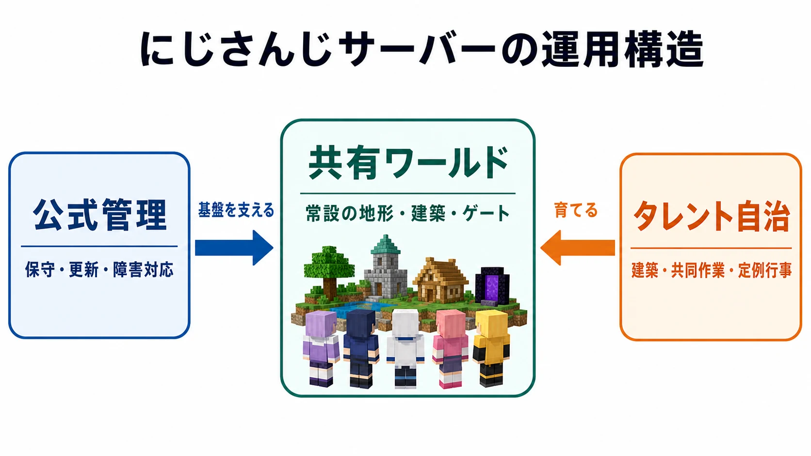
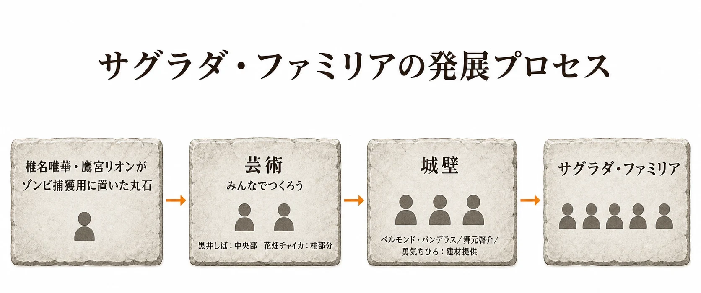
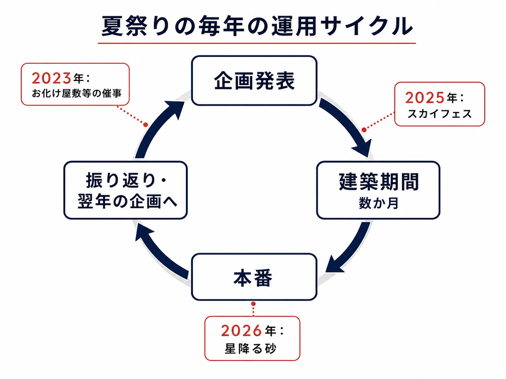
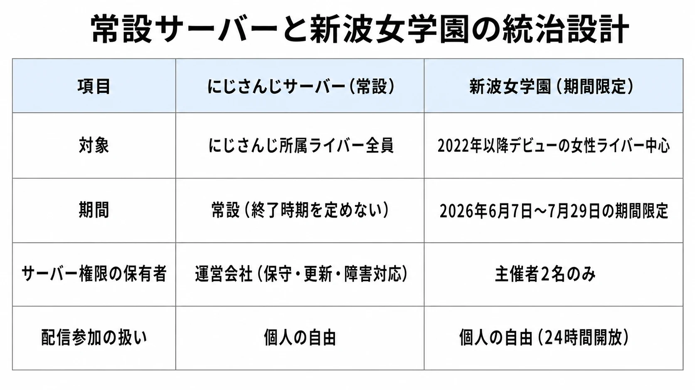

# にじさんじサーバー――Minecraftのアバターが育てる、もう一つの生活拠点

にじさんじサーバーは、にじさんじのライバーが共有する『Minecraft』の常設ワールドである。配信で画面に現れるライバーの姿は、Live2Dや3Dモデルだけではない。四角いMinecraftスキンもまた、ほかのライバーと出会い、資源を集め、建物を残すための姿になっている。

本稿では、このMinecraft上のアバターを「デジタルツイン」と比喩的に呼ぶ。ただし、これは現実の設備や人をリアルタイムに同期・再現する工学上のデジタルツインを意味しない。ここで指すのは、配信活動を続ける人物が、継続する共有空間で別の身体を持ち、ほかの参加者と並行して生活する状態である。実世界の本人を複製したという主張ではなく、活動上の関係性を担う「もう一つの居場所」という意味に限る。

この比喩を用いる理由は、3Dアバターがまだ実装されていない新人ライバーであっても、Minecraftではスキンを用いて先輩・同期と同じ地形を歩き、チャットし、共同作業へ参加できるからだ。実装の順番や配信環境の差があっても、共有ワールドの内部では、ログインしたスキンが他者から見える行為主体になる。画面上で会話するだけではなく、作業の途中に残された看板、畑、道、建築物が次の訪問者との会話を呼ぶ。

同じにじさんじの大型企画でも、既存の記事で扱った「[にじさんじ甲子園](nijisanji-koshien-publisher-engagement-design.md)」は、期間を区切った大会と、ゲームのパブリッシャーが関与を深める過程を主題にした。本稿が見るのはその逆側である。一回の勝敗ではなく、数年単位で残る場所を、公式管理とタレント自身の自治がどう支えてきたかである。

***

## 私費の専用サーバーから、常設の共有ワールドへ

起点は2018年10月である。ドーラ氏、緑仙氏、宇志海いちご氏、伏見ガク氏がMinecraftを遊んだ際、利用していたサーバーが重く、配信中に頻繁に落ちる問題が起きた。そこでドーラ氏が私費で専用サーバーを立ち上げ、ライバー全員が使える場所にした。初期の経緯を紹介したMoguLiveの記事は、4人のコラボ中のトラブルと、ドーラ氏によるサーバー開設を記録している。[[1](#ref-1)] ドーラ氏本人は後年のインタビューで、2018年11月から2020年3月まで、この共有サーバーを準備・管理していたと振り返っている。[[2](#ref-2)]

この出発点は、最初から企業が用意した公式イベント空間ではない。配信を継続しやすくするための、個人によるインフラ上の解決だった。だが、常設の共有ワールドには、一度きりのコラボにはない性質がある。ある人が採掘した資源、敷いた鉄道、建てかけの家は、ログアウト後も残る。別の日に入った人は、その痕跡を見つけ、利用し、あるいは続きを作れる。

2020年3月16日、ドーラ氏はそれまで自費で担っていた管理を、当時のいちから株式会社（現ANYCOLOR株式会社）へ一任した。[[3](#ref-3)] 個人の負担で始まった場を、組織が長く保守する対象へ移した転換である。利用者が増え、ワールド内の成果物が積み重なるほど、再起動、更新、障害対応といった裏方の作業を一人の善意に預け続けることは難しくなる。公式管理への移管は、自治を消すことではなく、自治が活動できる基盤を安定させる措置として読める。

さらに2022年4月20日には、JP、KR、ID、Worldの各サーバーへ通じるゲートサーバーが設置され、ライバーが相互に往来できるようになった。[[4](#ref-4)] これはワールドを一枚の地図に物理的に合体させたというより、入口を共通化して複数の生活圏をつないだ設計である。各地の建築や文化を保ったまま、移動の機会を作る。なお、この時点の接続対象はJP、KR、ID、Worldであり、ENサーバーは後に別の時期で統合されたため、同じ出来事として扱うべきではない。[[4](#ref-4)]

***

## サバイバルの手間が、共同の名所を作る

にじさんじサーバーが単なる配信の背景で終わらなかった理由の一つは、基本がサバイバルモードであることだ。ブロックを無制限に取り出せるクリエイティブモードと違い、建築には材料を集める時間が要る。地面を平らにするなら掘削が要り、遠い場所の資材を使うなら運搬が要る。夜間や敵対モブへの対処も、作業計画に混ざる。

これは不便さであると同時に、他者が関わる余地でもある。一人が大聖堂の外形を考え、別の人が採掘を引き受け、別の人が柱や装飾を追加する。完成までに何日もかかるから、途中の姿そのものが配信の題材になる。建築の目的は完成物だけではなく、「今から材料を取りに行く」「整地を手伝ってほしい」と声を掛ける理由を生むことにある。

代表的な大規模建築としては、「サグラダ・ファミリア」「いちご大墳墓」「にじさんじランド」が3大建築物として知られる。この呼び名は公式の分類ではなく、コミュニティ内で定着した見取り図である点に注意がいる。たとえばサグラダ・ファミリアは、椎名唯華氏と鷹宮リオン氏がゾンビを捕まえるために置いた丸石から始まり、ほかのライバーが中央部、柱、建材を持ち寄って発展したとまとめられている。[[5](#ref-5)] 偶発的な作業の出発点が、共同のランドマークへ変わる典型である。

ここで重要なのは、大建築を「有名な人が一人で完成させた作品」としてだけ見ないことだ。資源集め、整地、輸送、仮設の道といった周辺作業まで含めると、建築は参加の濃淡を受け止める器になる。設計を主導する人、数時間だけ素材を届ける人、観光に来て次の場所を紹介する人は、同じ建築物を介してつながる。完成した後も、待ち合わせ場所や観光先として使われれば、当初の作者の手を離れて共有資産になる。

サバイバルの制約が必ず共同性を生むわけではない。個人作業が孤立し、必要な素材が負担になることもある。それでも常設サーバーでは、未完の建築と資源不足が「次に何をしようか」という会話の足場になる。制約が多いから協力が起きるのではなく、協力が起きたときに、その痕跡が次の参加者にも見えることが大きい。

***

## 夏祭りは「運営イベント」ではなく、タレントのプロジェクトである

常設ワールドがイベント会場として機能する分かりやすい例が、にじ鯖夏祭りである。毎年の夏祭りは、ANYCOLORが番組として一方的に制作する形ではなく、ライバーが企画と準備の中心を担ってきた。運営会社がサーバーを保守し、当事者であるライバーが会場を作り、参加者を募り、当日を進行する。この役割分担によって、公式の基盤とタレント発の内容が重なっている。

2022年6月には、桜凛月氏、長尾景氏、セフィナ氏、ナラ ハラマウン氏の4名による夏祭り運営ユニット「めにまにカンパニー」が結成された。2023年の報道でも、同ユニットが夏祭りを担い、ホテルやビーチなどの施設を1年以上かけて建築してきたことが紹介されている。[[6](#ref-6)] 以後の夏祭り準備では、中心メンバーが企画の骨格を示し、ほかのライバーが建築や当日の遊びへ加わる形が見られる。2025年の「スカイフェス」では、地上ではなく空中に会場そのものを作る構成が採られ、準備段階にも多数のライバーが作業へ参加した記録が残る。[[7](#ref-7)]

この型は、イベントを「一日だけの配信」に縮めない。数か月前から始まる会場づくり、説明会、アルバイトとしての建築協力、当日の案内や接客までが、複数の配信に分散する。視聴者は本番だけでなく、空の足場が浮島に変わる過程や、施設に役割が与えられる過程を追える。完成品を見せるだけなら映像制作でもできるが、サバイバルの共有ワールドでは作業の手触りまで企画の一部になる。

2026年の夏祭りは「星降る砂」をテーマに準備されており、8月15日の本番が予定されている。この記事の執筆時点では開催前であるため、完成した内容や成功を前提に評価することはできない。ただし、準備期間、本番日時、主催体制が事前に示されていることからも、夏祭りが単発の思いつきではなく、繰り返し運用される行事の型になっていることは分かる。[[8](#ref-8)]

企画の当事者が運営するからといって、全員に重い責任を負わせる必要はない。中心メンバーが方針と安全な範囲を決め、参加者には建築、出演、観光、当日だけの参加など複数の入口を開く。この濃淡があるから、常設ワールドの関係性を定例行事へ接続できる。

***

## コラム：期間限定サーバー「新波女学園」の、意図的に狭い統治

### 常設ワールドとは別に、短期間の生活圏を作る

2026年6月7日から7月29日にかけて、「新波女学園～目指せ！ビッグウェーブ～」が開かれた。これはにじさんじサーバーとは別に用意された、期間限定・メンバー限定のMinecraftサーバーである。主催は猫屋敷美紅氏、サポートは栞葉るり氏で、2022年以降にデビューした女性ライバーを主な対象とした。PANORAも、猫屋敷氏が主催する期間限定サーバー企画であることと、対象となるメンバーの範囲を報じている。[[9](#ref-9)]

参加者を学園の生徒に見立て、制服スキンのリボン色で学年を区別した。3年生は緑、2年生は青、1年生はピンクである。サーバーは24時間開放されたが、配信参加は任意だった。これは、常に誰かと同時に配信しなければ参加できない場ではなく、各自の時間帯でログインし、偶然の出会いも作れる設計である。[[9](#ref-9)][[10](#ref-10)]

一方、サーバー権限、すなわちコマンドを使える権限は主催の2名だけに絞られた。全員が管理者になれば、企画中の事故への対応は早く見えるかもしれない。しかし、地形の復旧、時間や天候の変更、アイテムの扱いなどに強い権限が広く渡ると、意図しない変更が起きたときに責任の所在がぼやける。限定された期間・参加者・権限という枠を先に決めたことで、自由なサバイバル生活と、企画としての管理を両立させようとしたのである。[[10](#ref-10)]

ここには、2025年に栞葉氏が主催した「にじ若手女子マイクラ」を踏襲する再現性もある。毎回ゼロから関係を立ち上げるのではなく、対象者をある程度絞った共有サーバー、主催者による支援、自由参加という型を次の企画へ引き継ぐ。常設サーバーが世代をまたぐ大きな街だとすれば、新波女学園は、短い期間だけ同学年の関係を濃くする教室に近い。

期間限定だから常設より小さい、というわけではない。期限があるから、入学、校舎づくり、行事、卒業に当たる終わりを、参加者が共有しやすい。常設ワールドには残り続ける安心があり、期間限定ワールドには「今ここで一緒に作る」締切がある。両者は競合するのではなく、異なる関係を作るための別の器である。

***

## プランナーが見るなら、自治を成立させる「境界」を設計する

Minecraftは、ブロックを壊し、置き、世界そのものを改変できる点で、ほかのゲームへ簡単に置き換えられないタイトルである。そのため、にじさんじサーバーから万能の成功法則を引き出すべきではない。ただし、長期の共有空間を扱う際の小さな観察点はある。

第一に、強い権限は少数へ絞り、その代わり日常的な創作と参加の入口は広く取ることだ。サーバーの保守、復旧、更新は公式管理のような基盤側が受け持つ。一方で、何を建てるか、誰と作るか、どんな祭りを開くかまで中央が決める必要はない。新波女学園で主催者2名にコマンド権限を集めた設計は、この区別を短期企画として見えやすくした。

第二に、公式管理と当事者自治を、どちらか一方がもう一方を代替する関係にしないことだ。公式がすべてを演出すれば、当事者が作る偶然の余地は小さくなる。反対に、基盤の負担まで当事者の自費や善意へ任せれば、継続性が危うくなる。個人で始まったサーバーが運営管理へ移り、その上でライバー主導の建築や夏祭りが続く経緯には、この分担が見える。

第三に、定例行事を単なる慣例ではなく、参加の型として残すことだ。夏祭りの会場づくりは、素材集めだけの人、建築を担う人、当日に遊ぶ人、配信を視聴する人を同じ時間軸へ置く。毎年すべてを同じにする必要はないが、準備、本番、振り返りという大枠があれば、新しい参加者もどこに入ればよいかを理解しやすい。

にじさんじサーバーの価値は、巨大建築の完成度だけではない。Minecraftスキンという簡素なアバターが、長く残る場所で関係を作り、作業の痕跡を次の会話へ渡していく点にある。デジタルツインという比喩で捉えるなら、それは本人を精密に再現した分身ではなく、互いに訪問できる生活拠点を持つ並行した自己である。そこでは、公式が世界を保ち、タレントが世界を使い、そして使われた世界が次の企画を生む。

## References

1. [VTuberの「マイクラ」実況に注目！笑いあり衝撃ありのおすすめ配信まとめ][1] - 2018年の4人によるコラボ時の負荷問題と、ドーラ氏が全ライバー向けのサーバーを立てた経緯を記す。

2. [「同じにじさんじのメンバーとしてフラットに楽しみ合いたい」][2] - ドーラ氏が2018年11月から2020年3月まで、にじさんじメンバー共有サーバーを準備・管理していたことを紹介するインタビュー。

3. [ドーラ(どーら) - にじさんじ Wiki*][3] - 2020年3月16日に、ドーラ氏がにじさんじサーバーの管理をいちから運営へ一任したとの記録。

4. [Minecraftまとめ - にじさんじ Wiki*][4] - 2022年4月20日に、JP、KR、ID、Worldを結ぶゲートサーバーが設置され、相互往来が可能になったことを記す。

5. [Minecraftにじさんじサーバーまとめ／名所／共同施設 - にじさんじ Wiki*][5] - サグラダ・ファミリアの建設開始から複数ライバーによる協力までをまとめる。

6. [「にじさんじマイクラ夏祭り2023」が開催決定！お化け屋敷やナガオ逃走中など企画満載][6] - めにまにカンパニーのメンバー、2022年6月からの活動、夏祭りの企画内容を報じる。

7. [めにまにカンパニー - にじさんじ Wiki*][7] - 2025年の「スカイフェス」準備、本番、建築協力の配信記録。

8. [Minecraftまとめ - にじさんじ Wiki*][8] - にじ鯖夏祭り2026「星降る砂の一夜祭」の準備期間、本番日程、主催体制を掲載。

9. [にじさんじ 若手女性ライバー中心のマイクラ企画「新波女学園」がスタート][9] - 新波女学園の開催期間、主催・サポート、主な参加対象と制服スキンを報じる。

10. [新波女学園～目指せ！ビッグウェーブ～ - にじさんじ Wiki*][10] - 新波女学園の参加条件、制服スキン、サーバー運用に関する記録。

[1]: https://www.moguravr.com/vtuber-minecraft-live/
[2]: https://realsound.jp/tech/2022/08/post-1107110_2.html
[3]: https://wikiwiki.jp/nijisanji/%E3%83%89%E3%83%BC%E3%83%A9
[4]: https://wikiwiki.jp/nijisanji/Minecraft%E3%81%BE%E3%81%A8%E3%82%81
[5]: https://wikiwiki.jp/nijisanji/Minecraft%E3%81%AB%E3%81%98%E3%81%95%E3%82%93%E3%81%98%E3%82%B5%E3%83%BC%E3%83%90%E3%83%BC%E3%81%BE%E3%81%A8%E3%82%81/%E5%90%8D%E6%89%80/%E5%85%B1%E5%90%8C%E6%96%BD%E8%A8%AD
[6]: https://www.moguravr.com/nijisanji-minecraft-summer-fes-2023/
[7]: https://wikiwiki.jp/nijisanji/%E3%82%81%E3%81%AB%E3%81%BE%E3%81%AB%E3%82%AB%E3%83%B3%E3%83%91%E3%83%8B%E3%83%BC
[8]: https://wikiwiki.jp/nijisanji/Minecraft%E3%81%BE%E3%81%A8%E3%82%81
[9]: https://panora.tokyo/archives/145149
[10]: https://wikiwiki.jp/nijisanji/Minecraft%E3%81%AB%E3%81%98%E3%81%95%E3%82%93%E3%81%98%E3%82%B5%E3%83%BC%E3%83%90%E3%83%BC%E3%81%BE%E3%81%A8%E3%82%81/%E3%81%AB%E3%81%98%E3%81%95%E3%82%93%E3%81%98%E3%82%B5%E3%83%BC%E3%83%90%E3%83%BC%E4%BB%A5%E5%A4%96%E3%81%AE%E3%82%B5%E3%83%BC%E3%83%90%E3%83%BC/%E3%81%82%E3%82%89%E3%81%AA%E3%81%BF%E3%83%9E%E3%82%A4%E3%82%AF%E3%83%A9

----

この文書は、Perplexity、Claude、OpenAI Codex の3つのAIの支援を受けて著述されたものです。引用画像を除き、MIT License にて提供されています。
