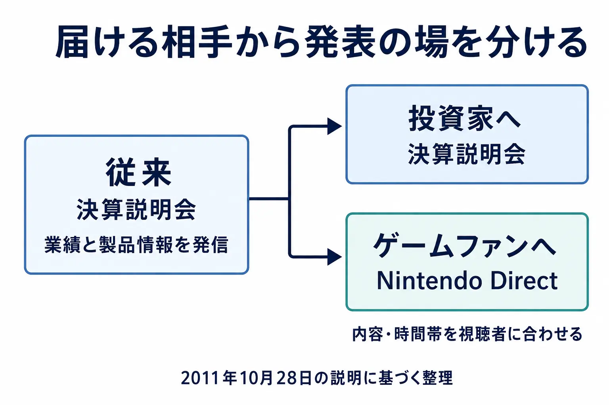

# 「直接！」はどこから来たのか――ニンテンドーダイレクトの成立と、発表の場が移った十数年

## 1. 語り継がれてきた、ある始まりの話

ニンテンドーダイレクトには、ファンの間で語り継がれてきた誕生の逸話がある。日本経済新聞が任天堂について観測記事を重ねたため、任天堂が自分たちで情報を直接届ける番組を始めた、という話だ。「日経の飛ばし記事への対抗」と表現されることもある。実際、2024年の記事には、日経の報道に「また飛ばし記事」と疑う声と、任天堂の大きな発表はニンテンドーダイレクトで出るはずだという期待とが、同じ投稿の中で隣り合って語られた例が転載されている。[[1](#ref-1)]

新作や発売日の情報を、任天堂が映像にまとめて届けるニンテンドーダイレクト。その名前と「直接！」の掛け声に、この逸話を結び付けて覚えている人もいるだろう。繰り返し語られてきた話だからこそ、いつ何が起き、当事者がどう説明していたのかを確かめる価値がある。

発足当時の記録から始めてみよう。そこから見えてくるのは、伝える相手に合わせて発表の場を作り、その役割を別の人にも担えるようにしていく過程である。やがて業界では、各社が自社の名前を冠した発表番組を持つようになる。一本の番組を入口に、発表の場が変わった十数年をたどる。

***

## 2. 開始と衝突を、日付の順に置く

ニンテンドーダイレクトが始まったのは **2011年10月** である。当時の任天堂社長・岩田聡氏は、同月28日の決算説明会で直前に行った新しい試みとして紹介し、2013年6月27日の株主総会でも、2年前の10月に開始したと説明している。[[2](#ref-2)][[3](#ref-3)]

まず、番組の開始と、日経報道をめぐる出来事を並べる。

| 時期 | 記録に残る出来事 |
| --- | --- |
| 2011年10月 | ニンテンドーダイレクトが開始。岩田氏が同月28日の決算説明会で説明した。[[2](#ref-2)] |
| 2011年12月 | ファミ通が第2回を告知。放送予定は12月27日正午と記載されている。[[4](#ref-4)] |
| 2012年2月22日 | 岩田氏がTwitterで不正確な報道を批判。J-CASTニュースは、同月20日の日経電子版の記事を指すとみられると報じた。[[5](#ref-5)] |
| 2012年3月16日 | 日経産業新聞が3DSの韓国発売日などを報道。J-CASTニュースによれば、任天堂は同日、推測に基づく報道として否定した。[[6](#ref-6)] |
| 2012年4月28日 | 3DSが韓国で発売。J-CASTニュースが任天堂広報に確認した発売日は、3月の日経産業新聞が報じた日付と一致した。[[6](#ref-6)] |
| 2012年6月5日 | 任天堂が日経の報道「任天堂、スマホに対抗」を、誤りを多数含む憶測記事だと公式サイトで批判した。[[7](#ref-7)] |

番組が始まった翌年に、ここで挙げた衝突が続いている。 **2012年のこれらの出来事を、2011年10月の開始理由にはできない。** ただし、この表は両社の関係をすべて調べ尽くした一覧ではない。これより前の報道への不満が一切なかった、とまで証明するものでもない。

2月の件には、もう一つ区別が必要だ。岩田氏は媒体名を明示していない。J-CASTニュースが日経電子版の「岩田社長が口にした、任天堂の『没落』」との関係を指摘した一方、任天堂は取材に対し、日経を指しているというのは周囲の見方だと回答している。同社は日経から取材を受けたわけではなく、謝罪も求めていないと説明した。したがって、これは「岩田氏が日経を名指しして抗議した」とは書き分けるべき記録である。[[5](#ref-5)]

3月の韓国発売の件も、任天堂の否定だけを取り上げると見え方が偏る。 **報道された発売日は、実際の発売日と一致していた。** 企業が公表・確認した情報かどうかと、報道内容が結果として正しかったかどうかは、別々に見る必要がある。なお、この件の経緯と発売日の照合は、当時の任天堂広報への取材を含むJ-CASTニュースに基づく。[[6](#ref-6)]

では、逸話自体の出どころはどうか。本稿の調査範囲では、日経への対抗を発足理由だとする任天堂の一次資料や、それを当事者への取材で裏付けた報道は確認できなかった。見つかったのは個人による発信と、それを転載する記事である。冒頭で挙げた2024年の記事も、該当部分はSNSの反応を紹介した欄であり、投稿自体は発足理由を述べていない。二つの認識が隣り合って語られる素地があった記録にはなるが、発足理由の証言にはならない。最初に誰がこの説明を始めたのかも、特定できていない。[[1](#ref-1)]

***

## 3. 岩田聡が説明した「直接」の中身

2011年10月28日の決算説明会には、番組の成立を説明するまとまった文章が残っている。岩田氏はニンテンドーダイレクトを「ちょうど1週間前」に行ったものとし、「ゲームファンのみなさんに直接お届けする新しい試み」と位置付けた。[[2](#ref-2)]

この言葉の前後が重要である。任天堂はそれまで、投資家向けの決算説明会でも製品情報を紹介し、その動画や文章をウェブに公開していた。ところが、投資家が知りたい情報と、ゲームファンが知りたい情報には違いがある。岩田氏は、その二つを明確に分けるべきだと説明した。[[2](#ref-2)]

同時に、Twitterなどで情報が速く広まるようになり、自分の発言が「思いもよらない歪んだ形」で伝わった経験にも触れている。情報の伝わり方への問題意識は、確かに原文にある。そこを落として、ただ映像配信の便利さを語っていたと読むのも不十分だ。[[2](#ref-2)]

転機として述べられているのは、同年9月のニンテンドー3DSカンファレンスである。製品の発表イベントをインターネットで生中継したところ、多くの人が視聴し、反響があった。岩田氏は、顧客へ適切な情報を直接届けられる手応えを得たと説明する。続くニンテンドーダイレクトは、会場に客を招くことより、ネットで見る人へ届けることを目的に、午後8時から録画を配信した。番組の時間帯も、伝える相手から決めていたのである。[[2](#ref-2)]

2013年6月27日の第73期定時株主総会でも、岩田氏の説明の中心は変わらない。ゲームの新情報を定期的にインターネットで届ける取り組みを「直接お客様にお届けするという試み」と呼び、2年前の10月に始めたものだと述べている。[[3](#ref-3)]

**この二つの説明では、日経への対抗やメディア報道への報復を発足理由として一度も挙げていない。** 一貫しているのは、インターネットを通じて顧客へ直接届けるという枠組みである。2011年の説明を含めて整理すれば、伝達の途中で情報が歪む問題を意識しつつ、相手に合わせて情報発信の場そのものを分けた、と読むのが原文に沿っている。[[2](#ref-2)][[3](#ref-3)]

「直接」には、会社自身が話すという意味に加えて、 **誰が見るのかを起点に内容と届け方を組み立てる** という意味があったと考えられる。

2011年10月28日の決算説明会での説明に基づく整理。[[2](#ref-2)]

***

## 4. 「直接！」を、別の人も担う

2015年4月2日のニンテンドーダイレクトでは、岩田氏に加えて任天堂広報室の森本氏が紹介役として登場した。当日のファミ通記事は、岩田氏が日本向けの番組で、開発者を招く場合を除き、自分一人でソフトを紹介してきたと説明したことを記録している。[[8](#ref-8)]

岩田氏は当時55歳の自分が「毎回すべてのソフトの紹介をし続けるやりかた」を、「今後も漫然と続けていていいのだろうか」と問い、事務系社員の中から一緒に紹介する人を探していたと述べた。森本氏はその指名を受けての登場だった。[[8](#ref-8)]

二人は並んで「直接！」のポーズを披露した。ファミ通は、岩田氏が親指を開いていたのに対し、森本氏は閉じていたという違いも伝えている。同日の任天堂公式Twitterには、二人による伝承を示す写真も投稿されたという。見慣れた合図を別の社員が使うことで、情報を届ける役割が共有された。[[8](#ref-8)]

この時点での取り組みは、岩田氏から森本氏への全面的な交代ではなく、 **一緒に紹介できる人を増やすこと** だった。同年7月に岩田氏が逝去した後、11月には森本氏の出演による配信が告知され、11月13日に番組が放送された。告知だけでなく、放送当日の記事でも森本氏が紹介を担ったことを確認できる。[[9](#ref-9)][[10](#ref-10)]

岩田氏の経営全般と対話の歩みは、既刊記事「[岩田聡評伝——プログラマー社長が経営した「危機」と「対話」](satoru-iwata-crisis-management-and-dialogue.md)」で扱っている。ここで見たいのは、一人の話し手が始めた方針が、別の人も担える番組として残った点である。4月の時点から、未来の出来事を見越した交代だったと推測する必要はない。特定の人が毎回すべてを紹介する形を見直すという、本人が明言した課題から継承を捉えられる。

***

## 5. 大きな発表会を降り、届け先を分ける

E3は、米国で開かれていたゲームの見本市、Electronic Entertainment Expoの略称である。ゲーム会社が新作を展示し、報道関係者や流通関係者などに紹介する場で、大規模な発表会も世界のゲームファンが注目する機会になっていた。

2013年4月25日の決算説明会で、岩田氏はE3での発信方法を変えると説明した。これまでの発表会には、報道関係者、投資家、ゲーム業界の取引先、流通関係者を招き、ネット中継でゲームファンにも届けていた。しかし、それぞれが求める情報は異なる。そこで同年は、例年のような「全方位向け」の大規模な発表を行わず、届け先ごとに機会を分けるとした。[[11](#ref-11)]

米国の流通関係者向けイベントと、主に欧米のゲームメディア向けの体験イベントを計画し、日本の視聴者にはニンテンドーダイレクトなどで、E3の時期に合わせて情報を届ける。会場での展示や体験も引き続き活用する計画だった。 **2013年に任天堂が降りたのは、E3で一度に全員へ向けて話す大規模発表会である。** 見本市への参加と、大きな舞台でのプレゼンテーションは分けて考えられていた。[[11](#ref-11)]

同年6月27日の株主総会で、岩田氏はその年のE3について、例年のような大きな発表会を開かず「この『Nintendo Direct』を中心にして情報を発信」したと説明している。[[3](#ref-3)] そこで示したのは、2014年までにWii Uで計画していたソフトだった。顧客へ直接届けるという2011年の考え方が、大規模な国際イベントの発表方法にも及んだのである。[[3](#ref-3)]

その後、E3自体も変わっていく。新型コロナウイルスの影響で2020年は中止、2021年はオンライン開催、2022年は再び中止となった。2023年には会場での開催再開が予定された。[[12](#ref-12)]

ところが2023年3月時点では、任天堂とソニー・インタラクティブエンタテインメントの不参加、マイクロソフトの展示ブース不設置に加え、Ubisoftやセガの不参加が報じられた。マイクロソフトとUbisoftは、6月にそれぞれ独自の発表イベントを予定していた。主要企業が同じ季節に情報を出しながら、E3の会場を使う必要性は薄れていた。[[12](#ref-12)]

E3 2023は結局中止となり、同年12月12日、北米時間で主催団体のESAがE3の終了を発表した。[[13](#ref-13)]

この経過を、ニンテンドーダイレクトがE3を終わらせたという一本の因果関係にまとめることはできない。感染症による開催の断絶も、各社の判断も介在している。ただ、見本市の大きな発表会に集約されていた機能の一部を、自社で視聴者へ届ける番組が担うようになったという変化は、任天堂の説明と各社の動きから読み取れる。

***

## 6. 各社が、自分たちの番組を持つ

企業が新作や更新情報をまとめて紹介する発表番組は、 **ショーケース** とも呼ばれる。ニンテンドーダイレクトの開始後、各社も固有の番組名を持つ発表の場を設けた。

| 番組 | 開始時期 | 公式に案内された形式 |
| --- | --- | --- |
| State of Play | 2019年3月。初回は米太平洋時間3月25日14時、日本時間3月26日6時 | PlayStationの新情報、予告映像、新作発表、ゲームプレイ映像を配信し、その後も年内に番組を続けると告知した。[[14](#ref-14)] |
| Ubisoft Forward | 2020年7月。初回は米太平洋時間7月12日12時、日本時間7月13日4時 | Ubisoft初のデジタルカンファレンスとして告知。世界各地の実会場イベントの延期を背景に、ゲーム情報をまとめて届けるとした。[[15](#ref-15)] |
| Capcom Showcase（カプコンショーケース） | 2022年6月。日本時間6月14日7時 | カプコンが最新情報を届ける世界同時配信のデジタルイベントとして告知した。[[16](#ref-16)] |

共通するのは、会社が番組名を持ち、複数の情報をまとめ、視聴者へ映像で届けることだ。こうした自社番組は、主要企業が使う標準的な発表手段の一つになったといえる。

一方、この表は「ニンテンドーダイレクトを模倣した」という証明ではない。確認した各社の公式告知には、任天堂を模倣したという説明はない。時期が後で形式が似ていることと、採用の理由が同じであることは区別する必要がある。Ubisoftは、実会場でのイベントが延期された状況を自ら説明していた。[[14](#ref-14)][[15](#ref-15)][[16](#ref-16)]

自社番組が広がる流れの中で、ニンテンドーダイレクトは、それに先立って継続的に運用されていた例として位置付けられる。各社への直接の影響の大きさを測る資料までは、今回確認できていない。

State of Playの地域別の枠が誰へ向けられているかは、既刊記事「[「State of Play 日本」は誰に向けた番組か――地域別ショーケースの設計](state-of-play-japan-regional-showcase-design.md)」で扱った。ここでは、その内容分析よりも、企業が自分の発表番組を持つようになったという共通点に注目したい。

***

## 7. 発表の場を持つと、中身を用意する責任も持つ

自社で発表の場を持てば、番組の尺、情報を出す順番、説明の細かさ、公開のタイミングを自分たちで設計できる。遊び方に理解を要する作品には時間を取り、すでに知られている作品は更新点から話す、といった構成も選べる。以下は、ここまでの事例から考えられる制作上の含意であり、各社の社内工程を確認したものではない。

その裁量と引き換えに負うのが、 **中身を自分で用意し続ける義務** である。これは毎回新作を発表しなければならないという規則ではなく、発信を続けるなら、その回を見る意味を自分たちで作る必要がある、という運営上の責任だ。

見本市へ出展する場合は、会期が準備の締切を決めてくれる面がある。自社番組では、いつ、何を、どれだけ見せられる状態にするかも自分で決める。外部の締切から自由になるほど、発表に向けた準備と、ゲーム本体の制作をどう両立させるかが課題になりうる。

例えば、遊び方を説明する映像を番組に載せるなら、次の三つを一緒に考えられる。

| 決めること | 開発側で確かめたいこと |
| --- | --- |
| 何を伝えるか | 視聴後に理解してほしい面白さは何か。その内容は、今後も維持する見込みがあるか |
| どこまで見せるか | 実際のプレイで示せる部分はどこか。説明だけが先行する部分はどこか |
| いつ公開するか | 撮影や確認の準備が、本体の制作にどう影響するか。次の続報まで見通せるか |

任天堂自身も、発表の時期を単純には扱っていない。2013年6月27日の株主総会で岩田氏は、発売直前の告知では購入計画を立てにくいと言われる一方、早くから情報を出しすぎると、発売時に既視感が強くなると説明した。そのうえで、発表内容が将来変わらない段階をできるだけ選びたいが、品質基準を満たさなければ延期などもあり得ると述べている。[[17](#ref-17)]

この問題は、既刊記事「[発表されたタイトルに、あとから人が集まる――発表と開発は別のカレンダーで動いている](game-announcement-timing-and-development-calendar.md)」につながる。発表の器を持つことと、発表の時期を決めることは表裏である。番組の枠が用意できても、ゲームがどの段階にあり、何を約束できるかという判断は残る。

新人プランナーにとっては、宣伝映像を求められたときに、見栄えのする場面だけでなく、 **その映像で何を約束することになるか** を考える視点が持ち帰りになる。自分たちで話せる場は、制作の状態と伝える内容を丁寧につなぐときに力を持つ。

***

## 8. 記憶に残る逸話と、記録に残る方針

ニンテンドーダイレクトは2011年10月に始まった。その翌年には、任天堂と日経報道をめぐる衝突が相次いで記録された。岩田氏の公式説明に一貫しているのは、顧客へ直接届けることと、受け手に合わせて情報発信を組み立てることである。

では、なぜ日経への対抗という逸話が生まれたのだろうか。二つを結び付ける素地は、当時の公式コメント自体にも見える。2012年6月5日に任天堂が出した文書は、日経の報道を憶測記事だと否定したうえで、新製品に関する情報については前日の「Nintendo Direct Pre E3 2012」で岩田氏が直接メッセージを届けていると案内していた。 **日経への批判とニンテンドーダイレクトが、一つの文書の中に並んでいたのである。** [[7](#ref-7)]

2012年の衝突が強く記憶に残り、「直接届ける」という番組の方針と結び付き、始まった順序が入れ替わって語られたのかもしれない。 **これは本稿の推測であり、逸話の成立過程を確認できたわけではない。** 最初の発信者も、どのように広まったのかも分かっていない。

一方、記録からたどれる番組の歩みは明瞭だ。伝える相手から場を分け、一人に集中していた紹介役を広げ、大きな見本市の発表機能の一部も担うようになった。その後、業界には各社の発表番組が並ぶようになった。

「直接！」から持ち帰れるのは、誰に、何を、いつ届けるかを自分たちで決める姿勢である。そして、その場を持ち続けるためには、届けるに足る中身と、そこで約束できることを考え続けなければならない。

## References

1. [任天堂「Switch」後継機の発売は25年に後ろ倒し？（2ページ目）｜マネーボイス][1] — 2024年2月27日。日経報道への疑念とニンテンドーダイレクトへの期待が同一の個人投稿で隣接して語られている例として参照。この投稿は発足理由には言及しておらず、逸話の裏付けには用いていない。

2. [2011年10月28日 第2四半期（中間）決算説明会・社長講演｜任天堂][2] — 情報発信の対象分離、情報の歪んだ伝わり方、9月の中継の反響、ニンテンドーダイレクトの成立と配信時刻についての一次資料。

3. [2013年6月27日 第73期定時株主総会 質疑応答・質問1｜任天堂][3] — 2011年10月の開始、直接届ける方針、2013年のE3での情報発信についての一次資料。

4. [岩田社長のインターネットプレゼン“Nintendo Direct”第2回は2011年12月27日正午放送｜ファミ通][4] — 2011年12月26日。第2回の告知。第1回の日付は記載されていない。

5. [任天堂・岩田社長「まるでゴシップ誌」と怒る あの「日経新聞」に噛み付いた？｜J-CASTニュース][5] — 2012年2月23日。岩田氏の投稿、対象記事についての報道側の推定、任天堂への取材回答。

6. [任天堂、また日経報道に激怒 わざわざ「数多くの間違い」と強調｜J-CASTニュース][6] — 2012年6月5日。3月16日の報道と任天堂の否定、広報取材による韓国発売日の照合を参照。

7. [本日の日本経済新聞の報道について｜任天堂][7] — 2012年6月5日。日経報道への公式コメント原文。

8. [Nintendo Directにて岩田社長から“直接！”を継承された任天堂 広報室の“森本さん”とは？｜ファミ通][8] — 2015年4月2日。岩田氏の発言はこの記事に収録された番組内発言から引用。共同の紹介役としての登場とポーズを記録。

9. [「ニンテンドーダイレクト」13日に配信 故・岩田氏に代わり広報室の森本氏がプレゼン｜ITmedia NEWS][9] — 2015年11月11日。森本氏出演による配信告知と、当時の任天堂の回答。

10. [“Nintendo Direct 2015.11.13”総まとめ｜ファミ通][10] — 2015年11月13日。放送後の記録として配信の実施と森本氏の登場を参照。

11. [2013年4月25日 決算説明会・社長説明（4ページ目）｜任天堂][11] — E3での大規模発表会を取りやめ、対象別のイベントや情報発信を行う理由を示す一次資料。

12. [ゲームイベントE3 2023、各社不参加で開催自体危ぶまれる｜AUTOMATON][12] — 2023年3月29日。過去の中止・オンライン開催、各社の不参加やブース不設置、独自イベントの予定についての報道。

13. [E3の終了が正式に発表｜ファミ通][13] — 2023年12月13日。E3 2023の中止と、北米時間12月12日のESAによる終了発表を記録。

14. [State of Play: PlayStation’s New Video Showcase Debuts Monday｜PlayStation.Blog][14] — 2019年3月22日。初回の日付・米太平洋時間、番組の形式、継続予定を記した公式告知。

15. [Save the Date: Ubisoft Forward Announced for July 12｜Ubisoft][15] — 2020年5月11日。初のデジタルカンファレンスの告知。日本時間は原文のPDTから換算。

16. [カプコンの最新情報をお届けするデジタルイベント「カプコンショーケース」開催決定！｜株式会社カプコン／PR TIMES][16] — 2022年6月7日。カプコン自身が配信した開始告知。

17. [2013年6月27日 第73期定時株主総会 質疑応答・質問9｜任天堂][17] — 発表タイミング、既視感、品質と発売判断についての一次資料。

[1]: https://www.mag2.com/p/money/1419848/2
[2]: https://www.nintendo.co.jp/ir/events/111028/index.html
[3]: https://www.nintendo.co.jp/ir/stock/meeting/130627qa/index.html
[4]: https://www.famitsu.com/news/201112/26007700.html
[5]: https://www.j-cast.com/2012/02/23123220.html?p=all
[6]: https://www.j-cast.com/2012/06/05134590.html?p=all
[7]: https://www.nintendo.co.jp/corporate/release/2012/120605.html
[8]: https://www.famitsu.com/news/201504/02075779.html
[9]: https://www.itmedia.co.jp/news/articles/1511/11/news078.html
[10]: https://www.famitsu.com/news/201511/13092916.html
[11]: https://www.nintendo.co.jp/ir/events/130425/04.html
[12]: https://automaton-media.com/articles/newsjp/20230329-242220/
[13]: https://www.famitsu.com/news/202312/13327615.html
[14]: https://blog.playstation.com/2019/03/22/state-of-play-playstations-new-video-showcase-debuts-monday/
[15]: https://news.ubisoft.com/en-us/article/4zeZmXUNV2QZYwfOd0whUa/save-the-date-ubisoft-forward-announced-for-july-12
[16]: https://prtimes.jp/main/html/rd/p/000003109.000013450.html
[17]: https://www.nintendo.co.jp/ir/stock/meeting/130627qa/03.html

----

この文書は、Perplexity、Claude、OpenAI Codex の3つのAIの支援を受けて著述されたものです。引用画像を除き、MIT License にて提供されています。
