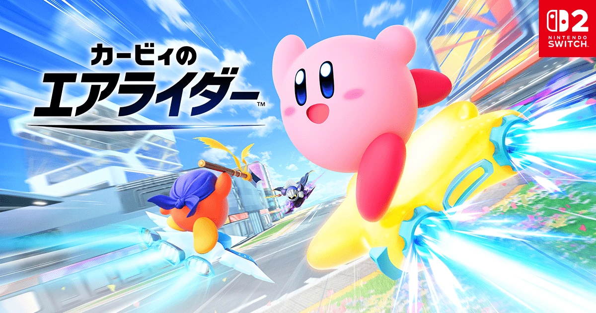
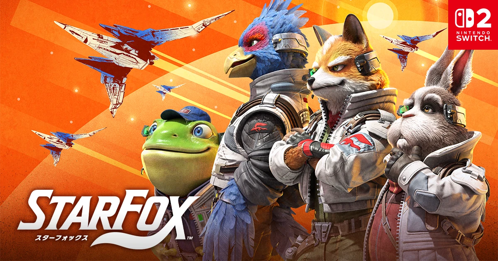
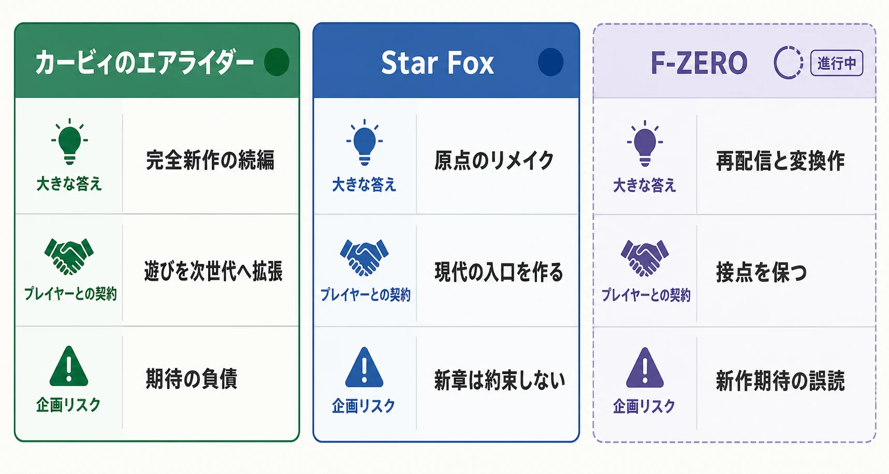
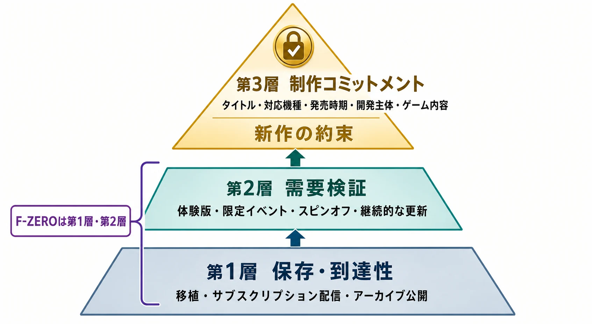

# カービィのエアライダーとStar Foxは帰ってきた。F-ZEROに残る23年目の空白から読む、任天堂の休眠IP再起動

## エグゼクティブサマリー

2025年の『カービィのエアライダー』と2026年の『Star Fox』は、どちらも長く新作を待たれていた任天堂IPの再起動である。ただし、前者は『カービィのエアライド』の遊びを次世代へ延ばす完全新作、後者は『スターフォックス64』を現代の入口として作り直すリメイクであり、復活の目的とリスクは同じではない。[[1](#ref-1)][[2](#ref-2)]

対照的にF-ZEROは、Nintendo Switch Online加入者向けの『F-ZERO 99』、ゲームボーイアドバンス後期2作の再配信、Nintendo Switch 2で遊べる『F-ZERO GX』と、過去作への接点を増やす動きが続く。しかし、これらは新作の発表ではない。再販、移植、スピンオフは、IPが捨てられたことの証明ではない一方、新作制作が決定したことの証明でもない。[[3](#ref-3)][[4](#ref-4)]

本稿は、単一IPの技術的な復活案を作る記事ではない。任天堂内の三つのIPを横断し、「何が復活のシグナルになり、何がまだシグナルにならないのか」を、ゲームプランナーが自社の休眠IPを扱うための判断材料として整理する。グラフィックス実装や物理演算の処方箋ではなく、再起動の入口、検証、約束の順序を扱う。

***

## 1. まず年表を正確に置く：F-ZEROの「23年目」は何を指すのか

F-ZEROの初代は1990年のスーパーファミコン版である。続く『F-ZERO X』は1998年にNINTENDO64で登場し、3周の順位争いにブースターや攻撃を組み込む高速レースとして、シリーズの据置機向け表現を更新した。[[5](#ref-5)] 2001年にはゲームボーイアドバンスで『F-ZERO: マキシマムベロシティ』が発売され、携帯機でもシリーズが続いた。[[6](#ref-6)]

2003年のゲームキューブ版『F-ZERO GX』は、その流れの到達点の一つである。任天堂の当時の発売一覧には同作が2003年7月25日発売と記録され、現在のNintendo Classics配信ページの権利表記には「© AMUSEMENT VISION, LTD. / SEGA, 2003」とある。セガのAmusement Visionとの共同制作という例外的な体制も含め、同作はF-ZEROの据置向け大型作品として強く記憶されている。[[7](#ref-7)][[4](#ref-4)]

ここで「『GX』以後23年間、新作がない」と一括りにするのは正確ではない。ゲームボーイアドバンス向けには『F-ZERO ファルコン伝説』と『F-ZERO CLIMAX』があり、任天堂は両作を2024年にNintendo Switch Onlineへ追加している。したがって、シリーズ全体の最後の完全新作を『GX』と呼ぶことはできない。[[8](#ref-8)]

2026年7月18日時点では、『GX』の日本発売から23年の丸い節目まではあと一週間であり、空白は23年目に入っている。この時間差は、「据置機向けに、シリーズの基本ルールを前へ進める大型新作」が途絶えている期間として読むべきである。これは携帯機向け続編や配信作品の価値を下げるためではない。何を不在と数え、何を復活と数えるのかを、企画の議論で混同しないための切り分けである。

| 年 | F-ZEROで起きたこと | 再起動を読む際の位置づけ |
| --- | --- | --- |
| 1990 | スーパーファミコン『F-ZERO』 | シリーズの基礎となる高速レースの出発点 |
| 1998 | NINTENDO64『F-ZERO X』 | 据置機世代に合わせた続編 |
| 2001 | GBA『F-ZERO: マキシマムベロシティ』 | 携帯機への展開 |
| 2003 | ゲームキューブ『F-ZERO GX』 | 据置向け大型作品。Amusement Visionとの共同制作 |
| 2004 | GBA『F-ZERO CLIMAX』 | シリーズ全体の新作史を『GX』だけで閉じないための重要な例外 |
| 2023 | 『F-ZERO 99』配信 | 旧作の文法をオンライン対戦へ変換したスピンオフ |
| 2024 | GBA『ファルコン伝説』『CLIMAX』を再配信 | 携帯機後期作まで含めて過去作へ到達できるようにする動き |
| 2025 | 『F-ZERO GX』をNintendo Classicsで配信 | 代表作へ触れる導線を現行機に置く「地ならし」 |

***

## 2. F-ZEROに起きているのは「再起動」ではなく、接点の再編成である

2023年9月に配信された『F-ZERO 99』は、1990年の初代を99人のオンライン・バトルロイヤル形式へ変換した加入者限定ソフトである。最大99人の同時接続を前提にし、追加料金なしでNintendo Switch Online加入者へ届ける設計は、従来作の続編をそのまま出す判断とは異なる。これは新規プレイヤーに「F-ZEROらしい緊張」を低い導入障壁で体験させ、既存ファンには競技の場を用意する施策と読める。[[3](#ref-3)][[9](#ref-9)]

2024年10月には、ゲームボーイアドバンス Nintendo Switch Onlineへ『F-ZERO ファルコン伝説』『F-ZERO CLIMAX』の2作が追加された。据置の代表作だけでなく、携帯機向けの後期作まで含めて、シリーズの全体像へ現行機から到達できるようにする動きである。[[8](#ref-8)]

さらに、Nintendo Switch 2の発売日である2025年6月5日には、『F-ZERO GX』がニンテンドー ゲームキューブ Nintendo Classicsの開始タイトルに含まれた。これは現代的なフルリメイクではなく、サブスクリプション内で過去作へアクセスさせる配信である。だが、未プレイ層が「なぜGXが語られるのか」を自分で確かめられる状態を作る意味はある。[[4](#ref-4)]

この三つを同じ「新作への布石」と呼ぶべきではない。

| 施策 | 直接に示すこと | 示さないこと |
| --- | --- | --- |
| 『F-ZERO 99』 | 過去のルールを別の対戦形式で提供する意志 | 正統続編の制作決定 |
| GBA2作のNintendo Switch Online追加 | 携帯機作品まで含めて過去作への到達性を保つ意志 | 現代向け新作の仕様や発売時期 |
| 『F-ZERO GX』のNintendo Classics配信 | 代表作に触れる導線を現行機へ置く意志 | 新作としてのシリーズ再始動の計画 |

ここでいう「地ならし」とは、次の作品を必ず発売する約束ではない。プレイヤーにIPの文法を思い出してもらい、社内にも利用状況を観測する場を作る、可逆的で比較的小さな投資である。ファン層の維持、作品保存、Nintendo Switch Onlineのライブラリ価値の拡張、商標・ブランドの継続利用など、複数の目的で説明できる。外部から一つの目的に決め打ちすることはできない。

***

## 3. 二つの「復活」は、同じ復活ではない

### 3-1. カービィのエアライダー：続編としての約束を引き受けた復活

『カービィのエアライド』はゲームキューブで2003年7月11日に発売された。『カービィのエアライダー』は2025年4月2日のNintendo Directで発表され、2025年11月20日にNintendo Switch 2向けに発売された。前作から22年を経て、桜井政博がディレクターを務める完全新作として再開した形である。[[7](#ref-7)][[1](#ref-1)][[10](#ref-10)]

ここで任天堂が引き受けたのは、単にタイトルを再利用する責任ではない。前作を知る人が期待するレース、マシン、育成と最終決戦を組み合わせた「シティトライアル」の感触を、現代のプレイ環境において続編として成立させる責任である。公式説明でも、本作は最大6人の「エアライド」、最大16人の「シティトライアル」など、前作を想起させる遊びを新しい作品として拡張している。[[1](#ref-1)]

完全新作の利点は、シリーズの時間を前進させられることにある。反面、過去作の記憶が比較基準になり、続編であること自体が期待の負債になる。だからこそ、誰が方向付けを担うのか、何の遊びを継承するのかを、発表の時点で明確にしたことは重要である。

画像出典（引用）：任天堂「[カービィのエアライダー｜Nintendo Switch 2](https://www.nintendo.com/jp/games/switch2/aaaba/index.html)」掲載のキービジュアル（© Nintendo / SORA / HAL Laboratory, Inc.）を無改変で引用／WebP変換。

### 3-2. Star Fox：原点を入口に作り直す復活

『Star Fox』は、2026年5月7日のStar Fox Directで発表され、Nintendo Switch 2向けに同年6月25日に発売された。放送開始の直前に宮本茂名義で告知され、小泉歓晃が番組内で紹介したサプライズ性も、長い不在を短い予告で断ち切る演出になった。任天堂は本作を、『スターフォックス64』を映画のような演出で現代に作り直した作品と位置づけており、ステージの外観、キャラクターデザイン、カットシーン、フルボイス、オーケストラ音楽などを刷新した作品として提示している。Velan Studiosが開発を担ったことも、同社と関係者が発売後に公表している。[[11](#ref-11)][[12](#ref-12)][[2](#ref-2)][[13](#ref-13)]

前作『スターフォックス ゼロ』からおよそ10年を経た復帰であるが、形は連続する新章ではなく、1997年の『スターフォックス64』を現代の入口にし直すリメイクである。公式サイトにある分岐するステージ進行やアーウィンでの戦闘は、シリーズを初めて遊ぶ人にも、何を遊ぶIPなのかを短時間で伝える素材になる。[[2](#ref-2)]

リメイクの利点は、評価済みのコアを使って、操作・見せ方・遊びやすさの基準を再提示できることにある。反面、それは将来の完全新作を約束しない。『Star Fox』の発売はブランドを再び現役にした事実だが、次が新章になるか、別のリメイクになるかは別の判断である。

画像出典（引用）：任天堂「[Star Fox｜Nintendo Switch 2](https://www.nintendo.com/jp/games/switch2/abgwa/index.html)」掲載のキービジュアル（© Nintendo）を無改変で引用／WebP変換。

### 3-3. 比較すべきなのは「沈黙の長さ」ではなく「再起動の契約」である

図表の要点：不在の後に最初に出した答え、プレイヤーに約束する内容、企画リスクを比較する。F-ZEROは「進行中」であり、新作という答えにはまだ到達していない。

この比較は、「F-ZEROが劣っている」と結論づけるためのものではない。三つのIPはジャンル、開発体制、過去作の蓄積、事業上の役割が違う。比較すべきなのは売上や知名度ではなく、プレイヤーにどの範囲まで将来を約束したかである。

***

## 4. 「再販があるから新作が来る」を、企画判断に使わない

休眠IPで危険なのは、観測しやすい出来事を因果に変えてしまうことだ。移植が出た、公式SNSが動いた、コラボに登場した、過去の開発資料が公開された。これらは関心や継続管理を示すことはあるが、新作の稟議、予算、開発チーム、発売枠までを示すものではない。

プランナーはシグナルを少なくとも三層に分けて読むとよい。

1. **保存・到達性のシグナル**：移植、サブスクリプション配信、アーカイブ公開である。過去作へ到達させる施策であり、新規企画の確定ではない。
2. **需要検証のシグナル**：体験版、限定イベント、スピンオフ、継続的な更新である。どの層が、どの遊びに反応するかを調べられる。ただし反応が良くても、続編の採算や開発可能性が自動的に解決するわけではない。
3. **制作コミットメントのシグナル**：タイトル、対応機種、発売時期、開発主体、ゲーム内容を公式に同時提示する発表である。ここで初めて、組織が将来のプロダクトを約束したと扱える。

図表の要点：再起動のシグナルは同じ強さではない。タイトル・対応機種・発売時期・開発主体・ゲーム内容が同時に示される第3層で、初めて新作の約束として扱える。

『F-ZERO 99』は第2層の性質を持つが、Nintendo Switch Online加入者限定のソフトであり、その利用規模や収益、続編へどう接続するかは公開されていない。『GX』の配信やGBA2作の再配信は第1層の強い事例である。これらを第3層として語ると、ファンの期待も社内の企画評価も誤らせる。[[3](#ref-3)][[4](#ref-4)][[8](#ref-8)]

一方で第1層と第2層は無意味ではない。完全に忘れられたIPでは、新作の説明に必要な共通言語がない。過去作を現行機で遊べること、既存ファンと新規プレイヤーが同じ話題に触れられること、どの遊びが今も通じるかを確かめられることは、将来の企画の入力になり得る。ただしそれは「新作の予告」ではなく「次の判断を可能にする材料」である。

***

## 5. 自社の休眠IPに応用する：再起動は一枚岩のプロジェクトではない

休眠IPを扱う会議では、最初に「新作を作るか」を問いたくなる。しかし、先に決めるべきは、何を回復させたいのかである。認知なのか、遊びの文法なのか、コミュニティなのか、販売可能な商品なのか。目的が違えば、移植、リメイク、スピンオフ、続編の評価軸も変わる。

| 確認する問い | 企画上の意味 | 取りうる最初の手 |
| --- | --- | --- |
| いまのプレイヤーは、何を知らないのか | IP名だけが残り、遊びが伝わらない状態を見つける | 現行機での再配信、短い紹介導線 |
| 何が現在でも独自の遊びなのか | ただの懐古ではなく、再起動の核を定義する | 小規模試作、体験版、限定イベント |
| 誰に向けた復帰なのか | 旧来ファン、新規、両者で必要な説明が違う | 続編、リメイク、別ジャンル化を選ぶ |
| どの事実を公約にするのか | 未確定な期待を膨張させない | タイトル・日付・開発体制の発表順を決める |
| 失敗した場合に何が残るか | 一作でIPを再び閉じないための設計 | アーカイブ、再利用可能な基盤、学習の記録を残す |

特に重要なのは、需要検証を「好きか嫌いか」の投票にしないことだ。『F-ZERO 99』のような変換作を出すなら、見るべきは総プレイヤー数だけではない。どのマシンが選ばれるか、初回離脱はどこで起きるか、競技へ残る人は何を価値と語るか、旧作経験の有無で行動がどう違うかを分けて見る必要がある。これらが分からなければ、次に作るべきものが続編なのか、リメイクなのか、そもそも別の入口なのかを判断できない。

また、発表の強さは開発規模ではなく、プレイヤーに何を確定情報として伝え、どこまでを約束するかで決めるべきである。『カービィのエアライダー』は完全新作として、ディレクターと発売時期を示した。『Star Fox』はリメイクとして、現行機で何が変わるかを示した。いずれも、プレイヤーが「今回の復活は何なのか」を判別できる。休眠IPで最も避けたいのは、アーカイブ施策を新作の期待として受け取らせ、その期待だけを残すことだ。

***

## おわりに：F-ZEROの次を、外から決めない

カービィとStar Foxは、長い不在の後に「完全新作の続編」と「原点を作り直すリメイク」という異なる答えを出した。これにより、休眠IPの復活は一つの成功パターンではなく、再起動後にどんな約束を結ぶかの選択だと見えてくる。

F-ZEROでは、1990年の初代から『X』、『マキシマムベロシティ』、『GX』、そしてGBA後期作まで続いた系譜を、現行機で再び触れられるようにする動きが進む。だが、2023年の『F-ZERO 99』、2024年のGBA2作の再配信、2025年の『GX』配信は、いずれも新作の公式発表ではない。ここに勝手な発売予告を読み込むのではなく、何が観測でき、何が観測できないのかを分けることが、ファンにとっても企画側にとっても誠実である。[[3](#ref-3)][[4](#ref-4)][[8](#ref-8)]

休眠IPを再起動する仕事は、昔の名前をもう一度掲げることではない。過去を保存するのか、遊びを検証するのか、次の作品を約束するのかを分け、その順序に見合う規模と発信を選ぶことである。復活のシグナルを読み違えないことは、次の一作の期待を守るための、最初のプランニングでもある。

## References

1. [『カービィのエアライダー』が11月20日に発売決定。予約も受付中。気になる要素をまとめてご紹介。][1] - Nintendo Switch 2版の発売日、桜井政博によるプレゼンテーション、基本モードを示す任天堂公式記事。

2. [Star Fox Direct 2026.5.7][2] - Nintendo Switch 2『Star Fox』の2026年6月25日発売を告知した任天堂公式Directページ。

3. [F-ZERO 99 : 商品情報][3] - 2023年9月15日の配信開始、Nintendo Switch Online加入者限定、最大99人のオンライン対戦を示す任天堂公式ページ。

4. [「ニンテンドー ゲームキューブ Nintendo Classics」をNintendo Switch 2 専用サービスとして配信。][4] - 2025年6月5日のサービス開始と『F-ZERO GX』の開始タイトル入り、Amusement Vision／SEGAの権利表記を示す任天堂公式記事。

5. [VC F-ZERO X][5] - 初代『F-ZERO』と1998年7月14日発売の『F-ZERO X』の位置づけ、基本ルールを説明する任天堂公式ページ。

6. [Ｆ－ＺＥＲＯ FOR GAMEBOY ADVANCE][6] - 2001年3月21日発売の『F-ZERO: マキシマムベロシティ』を示す任天堂公式ページ。

7. [2004年3月期 決算説明会][7] - 『カービィのエアライド』と『F-ZERO GX』の日本発売日を含む任天堂の発売一覧。

8. [ゲームボーイアドバンス Nintendo Switch Online『F-ZERO ファルコン伝説』『F-ZERO CLIMAX』の2作を追加。][8] - 『F-ZERO CLIMAX』を含むGBA後期2作の再配信を示す任天堂公式記事。

9. [F-ZERO 99｜My Nintendo Store][9] - 初代『F-ZERO』を99人オンライン・バトルロイヤルレースへ進化させたと説明する商品ページ。

10. [『カービィのエアライダー』の音楽ができるまで（前編）][10] - 桜井政博が『カービィのエアライダー』のディレクターであること、および2025年4月2日の発表への言及を含む任天堂公式記事。

11. [Nintendo has announced a Star Fox Direct][11] - 宮本茂名義の直前告知と、小泉歓晃による番組内での紹介を報じたVGCの記事。

12. [Star Fox launches for Nintendo Switch 2 on 25 June][12] - 『Star Fox』を『スターフォックス64』の現代的な再構成として説明し、刷新内容を示す任天堂公式記事。

13. [Nintendo Classic Remade by RPI Alum for Switch 2][13] - Velan StudiosがNintendo Switch 2版『Star Fox』の開発元であることを扱うRensselaer Polytechnic Instituteのニュース。

[1]: https://www.nintendo.com/jp/topics/article/e6a88782-f86d-45ed-a222-1f18322c0e33
[2]: https://www.nintendo.com/jp/nintendo-direct/20260507/index.html
[3]: https://www.nintendo.com/jp/switch/baypa/products/soft.html
[4]: https://www.nintendo.com/jp/topics/article/a6473679-537a-4034-ad34-52a2e5d71914
[5]: https://www.nintendo.co.jp/wii/vc/vc_fzx/vc_fzx_01.html
[6]: https://www.nintendo.co.jp/n08/afzj/index.html
[7]: https://www.nintendo.co.jp/ir/pdf/2004/040528.pdf
[8]: https://www.nintendo.com/jp/topics/article/cce36ee3-92e3-480a-86cc-bb6dba7fdef7
[9]: https://store-jp.nintendo.com/list/software/D70010000072185.html
[10]: https://www.nintendo.com/jp/topics/article/6b248f86-a955-4a86-aae6-01d270587b83
[11]: https://www.videogameschronicle.com/news/nintendo-has-announced-a-star-fox-direct/
[12]: https://www.nintendo.com/sg/news/article/XLNwUoKaa2CveWIwQjCvi
[13]: https://news.rpi.edu/2026/06/26/nintendo-classic-remade-rpi-alum-switch-2

----

この文書は、Perplexity、Claude、OpenAI Codex の3つのAIの支援を受けて著述されたものです。引用画像を除き、MIT License にて提供されています。
