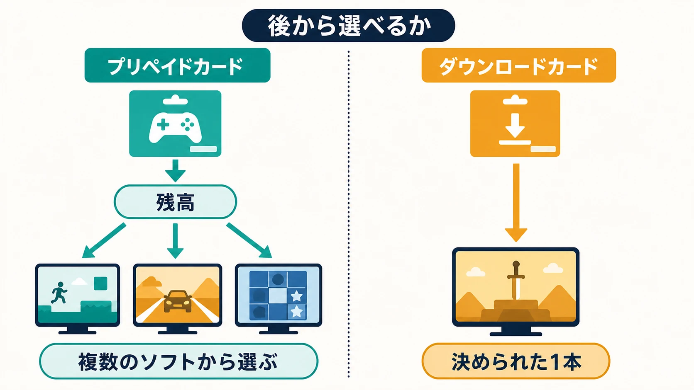
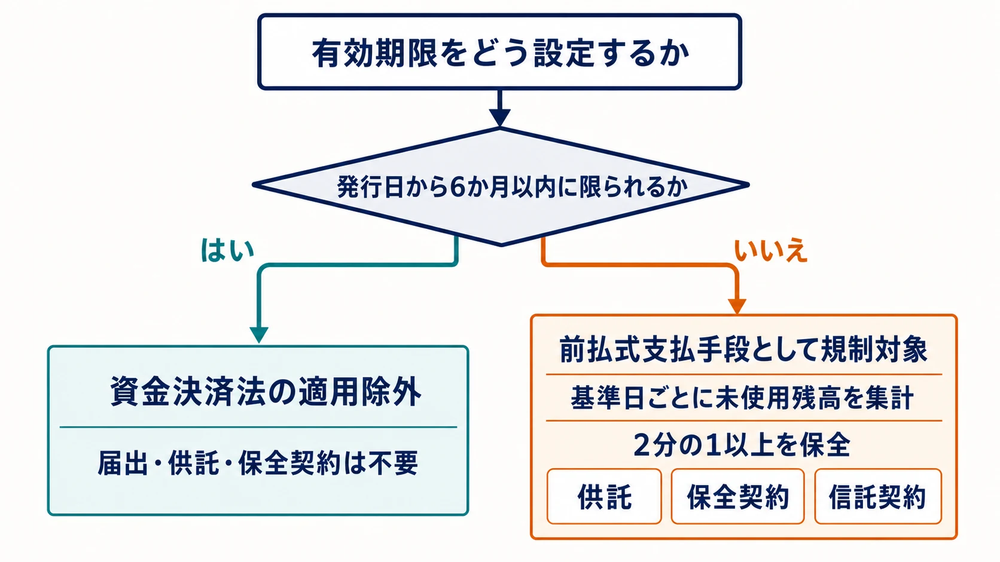

# コンビニのニンテンドーカード、なぜ2種類あるのか――資金決済法から読むゲーム課金の「前払い」

> **注意：** 本稿は公開資料を基に制度の考え方を整理したものであり、個別の法的助言ではありません。前払式支払手段に当たるかどうかは、名称ではなく具体的な販売方法、利用規約、システム上の扱いによって決まります。実装前には最新の法令を確認し、法務部門や弁護士、所管の財務局等へ相談してください。

コンビニのレジ横には、よく似た薄いカードが並んでいる。金額が大きく書かれた **ニンテンドープリペイドカード** と、ゲームのパッケージ画像が描かれた **ダウンロードカード** である。

前者を買うと、記載された金額をニンテンドーアカウントの残高へ追加し、その後で好きな商品を選べる。後者を買うと、カードに記載されたダウンロード番号を入力し、あらかじめ決まったソフトと引き換える。任天堂も、この二つを別の購入方法として案内している。[[1](#ref-1)][[2](#ref-2)]

見た目は似ていても、法律が見るのはカードの絵柄ではなく、 **支払った後に何が残り、何を選べるのか** である。プリペイドカードは「お金に近い残高を先に買う」仕組みであり、資金決済法上の前払式支払手段に明確に位置づけられている。一方、特定タイトル用のダウンロードカードは「決まった商品をその場で買った」と整理できる余地がある。

この違いを理解すると、ゲーム内のコイン、交換券、宝箱の鍵まで、同じ物差しで考えられるようになる。

資金決済法を含むゲーム関連法令の全体像は、既存記事「[ゲームプランナーが知っておくべき法令ガイド](game-planner-japanese-law-guide.md)」で確認できる。本稿では、その概説から一歩進み、前払式支払手段の保全実務と、残高型・特定商品型の境界に焦点を絞る。

***

## 先に知りたいのは、なぜ規制があるのか

プリペイド残高を買った時点では、利用者はまだゲームや追加コンテンツを受け取っていない。発行者へ先にお金を渡し、将来使える残高を受け取った状態である。

その間に発行者が破綻すれば、残高を使えず、支払ったお金も戻らないおそれがある。そこで資金決済法は、一定の発行者に未使用残高の一部を保全させる。金融庁は、破綻時に発行保証金から配当を受けられる仕組みを、利用者保護の中心として説明している。もっとも、未使用残高の全額が常に保全される制度ではない。[[3](#ref-3)]

この目的を先に押さえると、後に出てくる「残高」「有効期限」「供託」という言葉が、単なる事務手続ではなくなる。法律が見ているのは、事業者が預かったままになっている価値である。

***

## 三つの要件を、店頭カードに当てはめる

金融庁は、前払式支払手段への該当性を三つの要件で個別具体的に判断すると整理している。[[4](#ref-4)]

| 法律上の見方 | 一言で言い換えると | プリペイド残高の例 |
|---|---|---|
| **価値保存性** | 使える価値が数字や数量で残る | アカウントに3,000円分の残高が記録される |
| **対価発行性** | お金などを払って受け取る | 3,000円を支払って番号を買う |
| **権利行使性** | 使うことで商品やサービスの代金を払える | 残高を減らしてソフトを買う |

三つとも満たす典型が、汎用の残高チャージ型である。任天堂の公式表示によると、ニンテンドープリペイド番号は、別途指定される場合を除いて有効期限がなく、残高登録の上限は12万円である。登録後は、任天堂が指定するネットワークサービスで複数の商品に使える。[[5](#ref-5)]

反対に、無料配布だけで入手するポイントは、通常はお金などの対価を受け取る要件を欠く。名前が「コイン」か「チケット」かではなく、取得と使用の仕組みを見る必要がある。

***

## 「自社だけで使える」と「加盟店でも使える」

前払式支払手段は、使える相手によって二つに分かれる。

- **自家型**：発行者や、その発行者と密接な関係にある会社の商品・サービスだけに使えるもの。
- **第三者型**：発行者以外の加盟店の商品・サービスにも使えるもの。

自家型は、毎年3月31日と9月30日の **基準日** 、つまり残高を集計する日に、発行者が出している自家型の未使用残高合計が初めて1,000万円を超えると、財務局等への届出が必要になる。第三者型はこの基準まで待つ制度ではなく、発行前の登録が必要である。[[6](#ref-6)]

ニンテンドープリペイド番号とカタログチケットは、任天堂が発行し、任天堂の対象商品・サービスに使う自家型である。コンビニなどの販売店で買えること自体は、そこでゲーム代の支払いに使えるという意味ではないため、第三者型に変わる理由にはならない。[[5](#ref-5)][[6](#ref-6)]

届出対象となった自家型発行者や第三者型発行者には、基準日未使用残高の2分の1以上に当たる発行保証金を、最寄りの供託所である法務局へ預ける義務がある。実際に現金等を供託する代わりに、銀行等との **発行保証金保全契約** 、つまり銀行等が必要額を保証する契約や、信託会社等との **発行保証金信託契約** 、つまり保全する財産を信託で分けて管理する契約を使うこともできる。[[7](#ref-7)]

身近なゲーム会社も、この代替手段を使っている。任天堂は三菱UFJ銀行との保全契約により未使用残高の半額を保全している。ソニー・インタラクティブエンタテインメントも、同じ銀行との保全契約によって、同社が発行する前払式支払手段の未使用残高の2分の1以上を保全している。[[5](#ref-5)][[8](#ref-8)]

これは「売上の半分を毎回別口座に移す」という単純な話ではない。基準日時点の **未使用残高** を集計し、供託、保全契約、信託契約のいずれかで法定額を確保する実務である。売れた額ではなく、まだ使われていない額を正確に追える台帳が必要になる。

***

## 6か月以内なら、法律の適用から外れる

資金決済法4条2号は、発行日から政令で定める期間内に限って使える前払式支払手段を、この章の適用対象から外している。その期間を **6か月** と定めるのが資金決済法施行令4条2項である。[[9](#ref-9)][[10](#ref-10)]

ここで重要なのは、単に画面へ「180日」と書けばよいわけではないことだ。実務上の「発行の日」は、価値が記録された日と、番号などが利用者へ渡された日のうち遅い日とされる。期限後も実際には使える、残高を更新後の手段へ引き継げる、起算日を確認できない、といった設計では6か月の適用除外を使えない。[[7](#ref-7)]

短い期限は、発行者が長期の未使用残高を抱えない設計にできる一方、利用者には失効のリスクを負わせる。法対応だけで決めず、期限の見つけやすさ、失効前の通知、サポート対応まで一緒に設計すべきである。

### 12か月のカタログチケットは、保全される側にある

「2本でお得 ニンテンドーカタログチケット」は、2枚のうち1枚をNintendo Switchソフト1本と交換でき、交換時にもNintendo Switch Onlineへの加入が必要な商品だった。販売は2026年1月30日に終了したが、購入済みチケットは購入から12か月、365日間使える。[[5](#ref-5)][[11](#ref-11)]

12か月は6か月を超えるため、6か月ルールによる適用除外には入らない。任天堂は実際にカタログチケットを前払式支払手段として表示し、プリペイド番号とともに保全契約の対象としている。つまり、利用者が長く選択を保留できる代わりに、その未使用分を制度上の保全に乗せる構造である。

ただし、任天堂が有効期間を12か月に決めた理由を、資金決済法対応だと説明した公式資料は確認できない。ここで確実に言えるのは、 **12か月という仕様の法的な結果として、6か月の適用除外ではなく、保全を伴う前払式支払手段として扱われている** ことまでである。

***

## ダウンロードカードとプリペイドカードの分かれ目

ニンテンドープリペイド番号では、番号を登録した後にも「どの商品へ使うか」という選択が残る。残高は商品を買うまで保存され、購入時に減るため、三要件をそのまま満たす。

特定タイトル1本用のダウンロードカードでは、購入時点ですでに交換先が固定されている。番号の入力は、別の商品を選ぶための支払いというより、購入済み商品を受け取る手続と見ることができる。

金融庁は資金決済法施行時の意見募集で、オンラインゲームのアイテムパックを直接購入し、その購入によって利用者がサービスの対価の支払いを終えているといえる場合、前払式支払手段には該当しないとの考え方を示した。一方、利用のたびにポイントが減る仕組みなら該当するとしている。[[12](#ref-12)]

2017年の法令適用事前確認手続でも、金融庁は、一定のゲーム内コンテンツについて「取得をもって商品・サービスの提供がなされた」と利用者へ周知し、同意を得る仕組みを前提に、権利行使性を欠くため該当しないとの回答を出した。ただし、この回答は照会者が示した具体的事実だけを前提とし、明らかに前払式支払手段と同じ性質を持つものを除外している。[[4](#ref-4)]

任天堂の公式な「資金決済法に基づく表示」には、ニンテンドープリペイド番号とカタログチケットは掲載されているが、特定タイトル用ダウンロードカードは掲載されていない。公開資料を組み合わせると、固定された1本を直接買う商品として整理していると読む余地がある。ただし、任天堂が個々のダウンロードカードについて非該当の理由を説明した一次資料は確認できず、カード一般について法的結論を断定することはできない。

### PlayStationは、固定タイトルのコードも掲載する

この境界に対し、PlayStationの公開実務は異なる。公式の資金決済法表示には、特定ソフトやダウンロードコンテンツと交換するプロダクトコードも、前払式支払手段として個別に掲載されている。たとえば『モンスターハンターワイルズ』用コードは2027年2月27日まで、『Marvel's Spider-Man Remastered』用コードは2030年11月12日までと、タイトルごとに期限も異なる。[[13](#ref-13)]

同じページには、『HELLDIVERS 2』のスーパークレジットや『グランツーリスモ７』のGRAN TURISMO CREDITSといったゲーム内通貨も掲載されている。プロダクトコードと通貨型をまとめて自家型の発行実務に乗せ、未使用残高の2分の1以上を三菱UFJ銀行との保全契約で保護する構成である。[[8](#ref-8)][[13](#ref-13)]

一方でPlayStationは、同社の資金決済法表示に掲げたコンテンツだけを前払式支払手段として扱い、それ以外のコンテンツは取得時に商品・サービスの提供がなされたものとして扱うと明示している。[[14](#ref-14)]

ここから分かるのは、「交換先が一つなら必ず対象外」という自動判定ではないことだ。固定商品のコードにも、対象として保全する実務と、商品提供済みとして対象外にする実務の両方があり得る。発行者は商品の実態、契約、利用者への表示、残高管理をまとめて判断している。

***

## 「宝箱の鍵」が示した、選択肢の重さ

境界をゲーム内へ持ち込むと、関東財務局による『LINE POP』の「宝箱の鍵」をめぐる事例が見えてくる。

2016年の国会答弁では、関東財務局がLINEへ立入検査を行った事実に触れたうえで、金融庁側が一般論を説明している。ゲーム内アイテムであっても、価値が保存され、対価を得て発行され、使うことで **さまざまなサービス** を受けられるなら、前払式支払手段に当たり得るという説明である。個別の検査内容そのものについて、政府側はコメントを控えた。[[15](#ref-15)]

後の払戻公告では、『LINE POP』の「宝箱の鍵」が、ルビーと並んで払戻対象の前払式支払手段として実際に掲げられた。[[16](#ref-16)] 弁護士法人内田・鮫島法律事務所は、この鍵を使うとアイテムやルビーなど複数種類を得られた点が、権利行使性の判断で重視されたと考えられる、と分析している。[[17](#ref-17)]

ここで持ち帰りたい判断軸は、 **使った後の行き先が一つに固定されているか、複数の結果や選択肢へつながるか** である。

- 決められたソフト1本を受け取るコードは、購入時に商品提供が完了したと整理しやすい。
- 残高から好きな商品を選ぶ仕組みは、後の支払いに使う手段と整理されやすい。
- 鍵やチケットを使って複数種類の中から何かを得る仕組みは、名前が「アイテム」でも権利行使性を持ち得る。

ただし、選択肢の数だけで結論が決まるわけではない。三要件と販売・利用の実態を全体で見るための、早期チェックに使える軸である。

ランダムなアイテムを得るガチャや宝箱では、二つの法律を分けて確認する必要がある。本稿の資金決済法は、鍵や通貨が前払式支払手段に当たるかを扱う。既存記事「[ガチャは違法になったのか？ コンプガチャ規制から確率表示までの歴史](gacha-regulation-japan-history.md)」が扱う景品表示法は、景品の付け方や表示を扱う。一本の仕様が両方の論点を持つことはあるが、同じ規制ではない。

***

## 新しい課金アイテムを作るときの確認表

企画段階では、アイテム名より先に、次の仕様を書き出すとよい。

- [ ] 現金、残高、有償通貨など、何を対価として発行するのか。
- [ ] 金額や個数が、カード、端末、アカウント、サーバのどこに記録されるのか。
- [ ] 取得した時点で商品提供が終わるのか、後で使って初めて別の商品・サービスを受けるのか。
- [ ] 交換先は一つに固定されているか、利用者が複数から選べるか、ランダムに決まるか。
- [ ] 発行者自身だけに使える自家型か、第三者の加盟店にも使える第三者型か。
- [ ] 有効期限は発行日から6か月以内か。起算日を記録し、期限後の利用や残高引継ぎをシステム上も止められるか。
- [ ] 3月31日と9月30日に未使用残高を正確に集計できるか。
- [ ] 自家型の合計未使用残高が1,000万円を超える見込みはあるか。第三者型なら発行前の登録を検討しているか。
- [ ] 供託、保全契約、信託契約のどれを使い、法定額をどう確保するか。
- [ ] 利用規約、購入画面、資金決済法に基づく表示、残高台帳の内容が一致しているか。
- [ ] ガチャや宝箱なら、資金決済法とは別に景品表示法や表示の問題も確認したか。

有効期限や「選べる／選べない」は、遊びやすさだけを左右する小さな仕様ではない。プレイヤーが先に支払った後、発行者のもとにどのような未使用の価値が残るのかを変え、前払式支払手段への該当性、届出、残高保全、終了時の払戻しへつながる。

コンビニの二つのカードは、その違いを最も身近に見せる教材である。金額を預けて後から選ぶカードと、最初から決めた1本を受け取るカード。同じ棚に並んでいても、設計者が管理すべき「前払い」の中身は同じではない。

## References

1. [ダウンロード版ソフトのご案内][1] - 任天堂。店頭のダウンロードカードから、特定ソフトを引き換える購入方法を案内。

2. [「ニンテンドープリペイドカード」を使ってダウンロード購入する][2] - 任天堂。カード記載額を残高として追加し、ソフト購入に使う方法を案内。

3. [前払式支払手段に関する主な変更点][3] - 金融庁。発行者破綻時の利用者保護と、未使用残高の2分の1以上を保全する仕組みを説明。

4. [金融庁における法令適用事前確認手続（回答書）][4] - 金融庁、2017年9月15日。三要件と、一定のゲーム内コンテンツが権利行使性を欠くとした個別回答。

5. [資金決済法に基づく表示][5] - 任天堂。ニンテンドーカタログチケットとニンテンドープリペイド番号の期限、上限、保全方法を掲載。

6. [前払式支払手段（商品券・プリペイドカード等）関係][6] - 関東財務局。自家型と第三者型、届出・登録、基準日と基準額を説明。

7. [用語に関する説明][7] - 一般社団法人日本資金決済業協会。発行日、届出、供託、保全契約、信託契約の実務を説明。

8. [資金決済法に基づく表示][8] - PlayStation。ウォレット、ストアカード等の期限と、三菱UFJ銀行との発行保証金保全契約を掲載。

9. [資金決済に関する法律][9] - e-Gov法令検索。4条2号で、発行日から政令所定の期間内に限り使える手段を適用除外とする。

10. [資金決済に関する法律施行令][10] - e-Gov法令検索。4条2項で、法律4条2号の期間を6か月と定める。

11. [「2本でお得 ニンテンドーカタログチケット」販売終了に関するお知らせ][11] - 任天堂、2025年7月10日。販売終了日と、購入から1年間の有効期限を案内。

12. [「資金決済に関する法律」等の施行に伴う政令案・内閣府令案等に対するパブリックコメントの結果等について][12] - 金融庁、2010年2月23日。直接購入するアイテムパックと、利用時にポイントが減る仕組みの違いを説明。

13. [ゲームに関する資金決済法に基づく表示][13] - PlayStation。タイトル別プロダクトコードとゲーム内通貨の期限、利用先を個別掲載。

14. [「PlayStation Store」について][14] - PlayStation。表示対象のコンテンツを前払式支払手段として扱い、それ以外は取得時に提供済みとする方針を掲載。

15. [第190回国会 衆議院財務金融委員会 第19号][15] - 衆議院、2016年5月25日。「宝箱の鍵」をめぐる質疑と、金融庁側による三要件の一般論。

16. [前払式支払手段の払戻しのお知らせ][16] - LINE、2018年12月4日。『LINE POP』の「宝箱の鍵」を払戻対象として掲載した公告。

17. [ゲーム内アイテムの前払式支払手段該当性][17] - 弁護士法人内田・鮫島法律事務所、2022年12月26日。「宝箱の鍵」と複数種類の取得先の関係を分析した二次資料。

[1]: https://www.nintendo.com/jp/games/howtodl/index.html
[2]: https://www.nintendo.com/jp/games/howtodl/prepaidcard/index.html
[3]: https://www.fsa.go.jp/common/about/pamphlet/shin-kessai.pdf
[4]: https://www.fsa.go.jp/common/noact/kaitou/027/027_05b.pdf
[5]: https://support.nintendo.com/jp/legal-notes/payment-services/index.html
[6]: https://lfb.mof.go.jp/kantou/kinyuu/pagekthp00400036.html
[7]: https://www.s-kessai.jp/businesses/prepaid_means_overview_data
[8]: https://www.playstation.com/ja-jp/legal/shikinkessaihou/
[9]: https://laws.e-gov.go.jp/law/421AC0000000059
[10]: https://laws.e-gov.go.jp/law/422CO0000000019
[11]: https://support.nintendo.com/jp/information/2025/0710/index.html
[12]: https://www.fsa.go.jp/news/21/kinyu/20100223-1/00.pdf
[13]: https://www.playstation.com/ja-jp/legal/games/payment-services-act-jp/
[14]: https://www.playstation.com/ja-jp/legal/about-playstation-store/
[15]: https://www.shugiin.go.jp/internet/itdb_kaigirokua.nsf/html/kaigirokua/009519020160525019.htm
[16]: https://www.fsa.go.jp/policy/prepaid/shohinken/20181220line.pdf
[17]: https://www.it-houmu.com/archives/2049

----

この文書は、Perplexity、Claude、OpenAI Codex の3つのAIの支援を受けて著述されたものです。引用画像を除き、MIT License にて提供されています。
