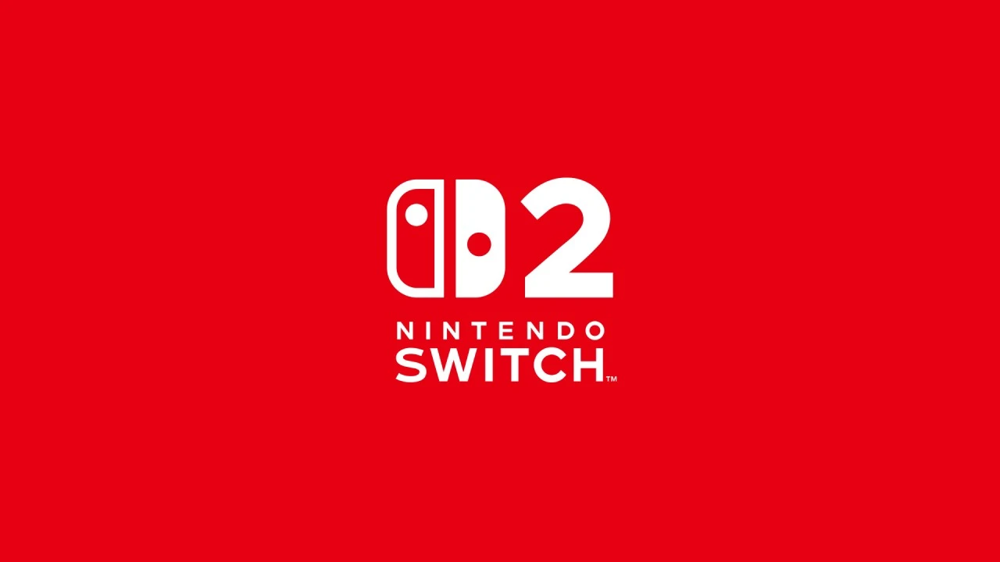
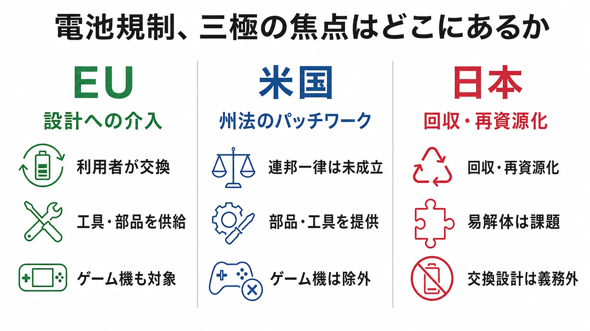
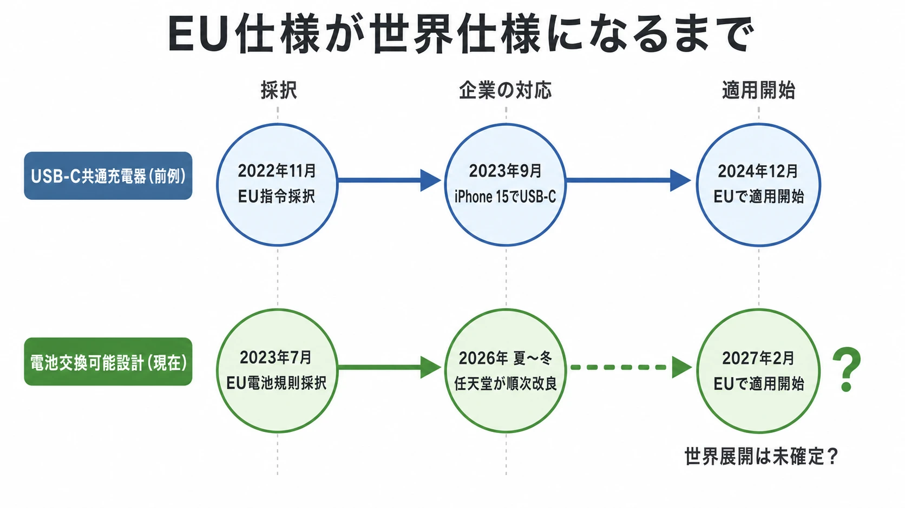

# Nintendo Switch 2の電池交換対応から読む、EU規制がハードウェア設計を変える仕組み

## エグゼクティブサマリー

2026年7月、任天堂は欧州で販売する一部製品を、ユーザーが交換できる電池を備えた改良版へ段階的に切り替えると告知した。Nintendo Switch 2本体は2026年秋、Joy-Con 2とNintendo Switch 2 Pro Controllerは同年冬が最短の予定である。本体は約10g重くなり、電池容量は5220mAhから5172mAhへ約1％小さくなる。これは機能を追加する製品改良というより、EUの電池規則が製品の開け方、部品の供給期間、説明書までを市場アクセスの条件にしたことへの対応である。[[1](#ref-1)]

EU電池規則は2027年2月18日から、携帯用電池を製品寿命中いつでもエンドユーザーが取り外し、互換電池に交換できる設計を原則として求める。市販工具で外せること、専用工具なら無償添付すること、最終出荷後少なくとも5年間は交換用電池を合理的かつ非差別的な価格で供給することまで定める。回収箱を置く段階の規制ではなく、筐体、固定方法、部品物流、サポートを先に設計させる規制である。[[2](#ref-2)]

ゲームプランナーが持ち帰るべき要点は、地域規制をローカライズの最終確認に置かないことである。ハードの形状と重量、SKU、部品在庫、修理導線、サービス期間は、企画初期に同じロードマップへ置く必要がある。

***

## 任天堂の改良版は、何が変わるのか

任天堂の英国サポートサイトは、欧州の電池規制変更への準備として、2026年夏から対象製品をユーザー交換可能電池入りの改良版へ順次置き換えると説明している。現行版と改良版の間に機能差はないとも明記する一方、発売時期は製造・流通事情で国ごとに前後しうる。[[1](#ref-1)]

出典：Nintendo UK, [Information about upcoming battery-related revisions to some Nintendo products](https://www.nintendo.com/en-gb/Support/Nintendo-Switch-2/Information-about-upcoming-battery-related-revisions-to-some-Nintendo-products-3132901.html)

| 製品 | 最短の提供予定 | 任天堂が示した主な変更 |
| --- | --- | --- |
| Nintendo Switch 2 | 2026年秋 | 電池容量は5220mAhから5172mAhへ約1％減少。約401gから約411gへ約10g増加。付属Joy-Con 2も交換可能電池となる。 |
| Joy-Con 2（L／R） | 2026年冬 | 電池容量は据え置き。Lは約66gから約68g、Rは約67gから約69gへ、それぞれ約2g増加。 |
| Nintendo Switch 2 Pro Controller | 2026年冬 | 電池容量は1070mAhから897mAhへ約16％減少。重量は約235gから約228gへ約7g減少。 |

表の数字は、「交換可能」にすることが無コストではないことを具体的に示す。Nintendo Switch 2では重量と容量に、Pro Controllerでは容量に影響が出ている。交換口、固定機構、再組立時の安全性、部品の公差を成立させるために、内部レイアウトを再調整した可能性はある。しかし、任天堂は個別の設計理由を公表していないため、数値から内部構造の因果を断定してはならない。確実に言えるのは、規制適合がプレイ機能とは別の製品トレードオフを可視化したことである。[[1](#ref-1)]

***

## EU電池規則は、回収制度ではなく設計要件である

対象となるのは Regulation (EU) 2023/1542、通称EU電池規則である。ここでいう「規則（Regulation）」は、EUの加盟国で原則として直接適用される法形式である。加盟国ごとに国内法へ置き換えることを前提とする「指令（Directive）」とは異なる。実際に同規則は、加盟国でそのまま拘束力と直接適用性を持つと定める。[[3](#ref-3)]

同規則の第11条は、製品に組み込まれた携帯用電池について、製品寿命の間、エンドユーザーが「容易に」取り外し、交換できるよう市場に出す者へ求める。適用開始は2027年2月18日である。対象は電池パック全体であり、個々のセルをユーザーが扱えるようにする義務ではない。[[2](#ref-2)]

「容易に」の定義が設計へ踏み込む。市販され、誰でも制限なく入手できる工具で外せることが原則である。専用工具は原則として認められないが、製品に無償で付属する場合は例外となる。熱や溶剤を必要とする分解も許容されない。さらに、使用・取り外し・交換の手順と安全情報を添付し、分かりやすい形で公開ウェブサイトにも恒久的に載せる必要がある。[[2](#ref-2)][[4](#ref-4)]

要件は作り方だけで終わらない。交換後も機能、性能、安全性を損なわない互換電池で置き換えられること、最終ユニットを市場に出してから最低5年間、独立修理業者とエンドユーザーに対して合理的かつ非差別的な価格でスペア電池を用意すること、ソフトウェアで互換電池への交換を妨げないことも定める。つまり、販売後の部品供給とソフトウェア挙動までが適合範囲に入る。[[2](#ref-2)]

例外はある。例えば、安全上、常時の電源連続性と恒久接続が必要な製品、または主機能がデータの収集・供給で、データ完全性のために恒久接続が必要な製品には第11条1項の義務が及ばない。水しぶきや浸水を受け、洗浄を目的とする機器などには、一定の安全条件の下で独立修理業者による交換にとどめる例外がある。ただし、例外があるからといって、一般的な携帯ゲーム機が自動的に対象外になるわけではない。[[2](#ref-2)]

この違いを一言でいえば、回収規制は「使い終えた後に、どこへ戻すか」を扱い、EU電池規則第11条は「使い続ける途中に、誰がどう開けるか」を扱う。後者は接着、ねじ、工具、パッキン、電池コネクター、ファームウェア、説明書、在庫までの選択肢を狭める。ここに「設計そのものへの介入」と呼べる理由がある。

***

## 米国と日本では、規制の焦点がどこにあるか

### 米国：連邦一律の設計義務ではなく、州法を中心とした修理権

米国では、連邦議会にFair Repair Actの法案が提出されているものの、2026年2月時点では委員会付託段階である。少なくともEU第11条のように、携帯用電池をユーザー交換式にする連邦一律の市場要件は成立していない。FTCも修理制限を問題として調査し、州法・州モデル法を含む複数の立法アプローチを整理している。制度の実態は州ごとの差を伴うパッチワークとして読むのが適切である。[[5](#ref-5)][[6](#ref-6)]

比較対象として分かりやすいのが、2023年10月に成立し、2024年7月に施行されたカリフォルニア州のRight to Repair Act（SB 244）である。同法は対象製品について部品、工具、文書を公正かつ合理的な条件で提供する枠組みを置く。しかし「video game console」は、据置機、携帯機、周辺機器を含む定義のうえで明示的に適用除外である。[[7](#ref-7)]

この除外は偶然ではない。州上院の法案分析によれば、Entertainment Software Associationはコンソールのコンテンツ保護が海賊行為対策に必要だとして反対し、法案提出者はその懸念を受けてゲーム機を除外することに合意した。ここで重要なのは、その主張の技術的な当否を論じることではない。修理可能性の制度設計が、産業ごとの懸念と州ごとの政治過程を経て、適用範囲を変えうる点である。[[8](#ref-8)]

EUの規則が加盟国を横断して製品要件をそろえるのに対し、米国では州法の対象、価格閾値、例外が異なりうる。グローバルなハード企画にとっては、「米国向け」という一つの箱ではなく、販売州・流通形態・製品分類まで確認する仕事になる。

### 日本：2026年4月の改正は、回収・再資源化を強める制度である

日本の資源有効利用促進法では、小型二次電池とその使用製品について、製造・輸入事業者による自主回収・再資源化が既に義務付けられている。2026年4月1日施行の改正資源法では、リチウム蓄電池に関し「電源装置」「携帯電話用装置」「加熱式たばこデバイス」が指定再資源化製品として位置付けられ、認定を受けた自主回収・再資源化計画の制度が始まった。[[9](#ref-9)][[10](#ref-10)]

ここは用語を正確にしたい。対象は「モバイルバッテリー内蔵製品」を一括りにしたものではない。モバイルバッテリー等に当たる電源装置、スマートフォン等に当たる携帯電話用装置、加熱式たばこデバイスという区分であり、内蔵電池を取り外せない一体型製品の回収体制を強めることが検討の背景にある。火災リスクと資源回収を主な問題設定とする制度である。[[10](#ref-10)]

したがって、日本の改正を「ユーザーが電池を交換できる設計の義務」と読んではならない。資料は易解体設計の取組を議論しているが、EU第11条のように、製品寿命中いつでもエンドユーザーが市販工具で外せることや、5年間の部品供給を直接義務付けるものではない。日本は主に使用済み製品を安全に回収・再資源化する段階へ責任を置き、EUはそこに加えて、交換して使用期間を延ばす入口を製品設計へ組み込む。この差が、同じ「循環型経済」でも開発工程への効き方を変える。[[2](#ref-2)][[10](#ref-10)]

この緩さは、業界側の消極性だけの産物ではない。改正に向けた経済産業省の業界ヒアリング（2025年7月）で、携帯電話用装置の業界団体は、安全性の観点からリチウム蓄電池を取り外しやすくする易解体性設計への対応は困難だと明言している。対象範囲も、勧告・命令の対象となる年間販売数量要件を携帯電話用装置で1万台と設定するなど、回収体制の実効性を担保する制度設計にとどまる。検討会に参加したワーキンググループ委員自身、「資源有効利用促進法による自主的な取り組みには限界があり、EUの欧州電池規則のような包括的かつ義務的な回収・リサイクル制度の検討が必要」との所感を残しており、日本の政策側にもEUの規則を参照点とする視点があることがうかがえる。[[10](#ref-10)]

***

## コラム：USB-Cが先に示した「EU仕様が世界仕様になる」瞬間

電池交換の問題は、EUが初めて製品の物理的な設計選択へ影響した例ではない。Directive (EU) 2022/2380は無線機器指令を改正し、スマートフォン、タブレット、デジタルカメラ、ヘッドホン、携帯型ゲーム機を含む一定の充電式機器に、USB Type-Cレセプタクルを求めた。2022年11月23日に採択され、対象機器への適用は2024年12月28日からである。指令は規則と違い、加盟国が国内法化して適用する法形式だが、域内市場で売るための端子要件という意味では、製品の外形と周辺機器の設計に直接作用した。[[11](#ref-11)][[12](#ref-12)]

Appleはこの義務の適用に先立つ2023年9月、iPhone 15シリーズでLightning端子を廃止してUSB-Cへ移行した。同社はこのモデルを日本、米国を含む40超の国・地域で同時に販売し、同月に世界各地のApple Storeへ投入している。EU域内だけLightningを残すのではなく、世界共通の製品変更を選んだことになる。[[13](#ref-13)][[14](#ref-14)]

この出来事は、読者にとっても身近だろう。Lightningケーブルや周辺機器を持っていた人には買い替えや変換の負担が生じ、USB-C中心の環境を持つ人には充電ケーブルを共通化する利点が生じた。一つの地域の市場要件が、世界共通SKUの判断を通じて日本の利用体験まで変えた例である。EUの規制が「欧州ローカルの話」で終わらないことを示している。

***

## EUが設計を変えようとする背景

EUの狙いを単一の電池規則だけで捉えると、なぜ交換可能性まで求めるのかが見えにくい。EUはCircular Economy Action Planを通じ、耐久性、修理可能性、アップグレード可能性、再利用・再資源化を製品のライフサイクルで高める方向を示してきた。欧州グリーンディールも、修理可能な製品設計を含む製品・廃棄物改革を掲げる。[[15](#ref-15)][[16](#ref-16)]

その横串となるのが Ecodesign for Sustainable Products Regulation（ESPR、Regulation (EU) 2024/1781）である。ESPRは持続可能な製品のエコデザイン要件を定めるための枠組みであり、製品群ごとの要件を通じて環境持続可能性と循環性の改善を追う。重要なのは、エコデザインを省エネルギーだけでなく、製品が長く使え、修理・再利用されることを含む市場ルールとして扱う点にある。[[17](#ref-17)]

さらにRight to Repair Directive（Directive (EU) 2024/1799）は、加盟国が2026年7月31日から国内ルールとして適用する。これは、既にEU法上の修理可能性要件を負う製品について、合理的な期間と価格で製造者の修理を促す制度であり、設計・スペアパーツ要件を置くエコデザイン枠組みを補完する。電池規則、ESPR、修理指令は同一の法律ではない。しかし、設計、部品、修理、再使用を連結して製品寿命を伸ばすという規制哲学ではつながっている。[[18](#ref-18)]

「規則」と「指令」の違いは、企画の実務にも関係する。規則はEUで直接適用されるため、共通仕様への圧力が強い。一方、指令は各国の国内実装を経るため、開始時期や運用の確認が必要になる。いずれも法務だけの後工程ではなく、要求がハード仕様と運用に戻ってくることを前提に、製品ロードマップで監視する必要がある。

***

## 任天堂の対応から読む、地域SKUと修理体制のコスト

地域差に対応する方法は、大きく二つある。EU向けの改良SKUを用意し、他地域は既存設計を継続する方法と、適合設計を世界共通SKUへ広げる方法である。前者は重量、電池容量、価格、製造工程を地域ごとに最適化できる反面、部品表、認証、在庫、修理マニュアル、販売説明、返品判定を分けるコストが発生する。後者は設計・部品・サービスの共通化を期待できる反面、規制がない地域にも同じトレードオフを持ち込む。

任天堂の告知は現時点で「欧州の一部製品」を対象としており、世界展開を約束していない。よって、電池交換可能なNintendo Switch 2が将来世界共通になると断定する根拠はない。ただし、USB-CでAppleが世界共通化を選んだことは、比較対象として有用である。地域SKUの維持費と、共通化により吸収できる設計トレードオフをどう比較するかは、任天堂に限らない経営判断となる。[[1](#ref-1)][[14](#ref-14)]

ゲームハードでは、5年間のスペア電池供給を「調達部門の仕事」として後付けにできない。少なくとも次の論点が連動する。

- **ハードウェア設計**：ねじ・工具・開口部・防水性・落下耐性・熱・重量・電池容量を同時に評価する。ユーザー交換の手順が安全に完了することも仕様である。
- **地域SKU管理**：本体、コントローラー、交換電池、梱包、説明書、オンラインの安全情報を、どの地域でどの版として扱うか決める。販売国をまたぐ流通と中古市場も無関係ではない。
- **修理と部品物流**：最終出荷日を記録し、そこから5年間の供給を計画する。部品番号、価格原則、互換性、在庫切れ時の代替、独立修理業者・エンドユーザー向けの窓口を一本の運用として設計する。
- **体験設計**：電池交換後に設定、ペアリング、保証、サポートがどう見えるかを決める。交換を促す説明が難しければ、法適合していてもユーザーは修理を選べない。

ここでプランナーは、電池を直接設計しないから関係がない、と切り離さない方がよい。遊びの想定寿命、携帯モードの利用時間、継続課金やオンラインサービスの提供期間、周辺機器との互換性は、電池の寿命と部品供給の約束に影響される。長く遊ばせたい企画ほど、ハードが長く使えるという前提を明文化する価値がある。

***

## 日本のゲームプランナーが持ち帰る二つの論点

### 1. 国内で当たり前でも、海外では市場に出せないことがある

日本で主に回収・再資源化の制度として受け止めていた設計が、EUではユーザー交換可能性を欠くことで市場要件に届かない可能性がある。逆方向のリスクは、翻訳漏れやレーティングの取り違えのようなローカライズ問題とは性質が違う。仕様凍結後には筐体の開口、固定具、部品調達、重量までを巻き戻す必要が出るからである。

企画書の初期段階で、対象市場ごとの必須要件を「表示」「コンテンツ」「通信」だけでなく「物理製品」「修理」「部品供給」に分けて棚卸ししたい。特に、ハード担当、法務・認証、カスタマーサポート、サプライチェーンを同じレビューに招くことが有効である。プランナーは要件の正解を一人で判定する役ではなく、後戻りが大きい依存関係を早く表面化させる役になれる。

### 2. 規制収斂を、長期ロードマップのシナリオとして持つ

EUに合わせた設計が他地域にも広がるかは、製品、競争、調達、各国法制で変わるため予言できない。それでもUSB-Cの例が示す通り、世界共通SKUという企業判断によって、EU起点の変更が世界のユーザーへ波及することはある。反対に、米国のように州ごとの適用範囲が残る市場もある。[[7](#ref-7)][[14](#ref-14)]

したがって、ロードマップは「現行法に適合する一案」だけでなく、少なくとも次の分岐を持つとよい。

| 分岐 | 企画段階で決める問い |
| --- | --- |
| EU専用SKU | 仕様差、流通混在、修理・部品在庫を何年維持できるか。 |
| 世界共通SKU | 規制のない地域にも持ち込む重量・容量・原価の変化を、体験価値で受け止められるか。 |
| 規制追随の早期化 | 他地域がEUへ追随した場合、次のモデルチェンジまで待たずに切り替えられるか。 |
| 修理期間の長期化 | ハード寿命、オンラインサービス、周辺機器互換性、サポート終了告知を矛盾なく設計できるか。 |

規制収斂は必ず起きるという予測ではない。設計変更が必要になったとき、どの市場で、どのSKUを、どの部品供給期間まで維持するかを選べる状態にしておくためのシナリオである。任天堂の改良版は、環境規制が製品の終末処理だけでなく、遊ぶ道具の重さ、交換のしやすさ、販売後の約束を変えることを示した。ゲームの企画にとっても、これは発売後の体験まで含めた設計条件なのである。

## References

1. [Nintendo UK: Information about upcoming battery-related revisions to some Nintendo products][1] - 欧州向け改良版の時期、容量、重量、機能差がない旨の任天堂告知。

2. [Regulation (EU) 2023/1542, Article 11][2] - 携帯用電池の取り外し・交換、手順情報、スペア部品、ソフトウェアに関する義務。

3. [Regulation (EU) 2023/1542, Article 96][3] - 規則の適用開始日と加盟国での直接適用性。

4. [Regulation (EU) 2023/1542, Recital 38][4] - 市販工具、無償提供される専用工具、熱・溶剤の扱いに関する趣旨。

5. [Fair Repair Act, H.R. 7404][5] - 2026年2月に連邦議会へ提出された修理権法案。

6. [FTC: Nixing the Fix][6] - 米国における修理制限と州法を含む立法アプローチの整理。

7. [California SB 244, Right to Repair Act][7] - ゲーム機を明示的に適用除外とするカリフォルニア州法本文。

8. [California Senate Judiciary analysis of SB 244][8] - ESAの海賊行為懸念とゲーム機除外に至る法案修正の記録。

9. [経済産業省：小型二次電池のリサイクル][9] - 資源有効利用促進法に基づく回収・再資源化の説明。

10. [環境省：改正資源有効利用促進法の説明資料][10] - 2026年4月施行、指定再資源化製品、内蔵電池一体型製品の回収体制に関する資料。

11. [Directive (EU) 2022/2380][11] - 無線機器指令の改正と携帯型ゲーム機を含むUSB-C要件。

12. [Commission guidance on the Common Charger Directive][12] - 2024年12月28日からの対象機器への適用開始日。

13. [Apple: iPhone 15 and iPhone 15 Plus][13] - 2023年9月のiPhone 15シリーズとUSB-C搭載の発表。

14. [Apple: iPhone 15 lineup arrives worldwide][14] - iPhone 15シリーズの世界展開。

15. [European Commission: Circular Economy][15] - 修理、アップグレード、耐久性、再資源化を促す循環型経済政策。

16. [European Commission: The European Green Deal][16] - 修理可能な製品設計を含む製品・廃棄物改革の位置付け。

17. [Regulation (EU) 2024/1781, ESPR][17] - 持続可能な製品のエコデザイン要件を定める枠組み。

18. [European Commission: Directive on repair of goods][18] - Right to Repair Directiveの適用日と、エコデザイン・スペア部品要件との補完関係。

[1]: https://www.nintendo.com/en-gb/Support/Nintendo-Switch-2/Information-about-upcoming-battery-related-revisions-to-some-Nintendo-products-3132901.html
[2]: https://eur-lex.europa.eu/eli/reg/2023/1542/oj
[3]: https://eur-lex.europa.eu/eli/reg/2023/1542/oj
[4]: https://eur-lex.europa.eu/eli/reg/2023/1542/oj
[5]: https://www.congress.gov/bill/119th-congress/house-bill/7404/text
[6]: https://www.ftc.gov/system/files/documents/reports/nixing-fix-ftc-report-congress-repair-restrictions/nixing_the_fix_report_final_5521_630pm-508_002.pdf
[7]: https://leginfo.legislature.ca.gov/faces/billTextClient.xhtml?bill_id=202320240SB244
[8]: https://sjud.senate.ca.gov/sites/sjud.senate.ca.gov/files/sb_244_eggman_sjud_analysis.pdf
[9]: https://www.meti.go.jp/policy/it_policy/kaden/index03.html
[10]: https://lithium.env.go.jp/recycle/waste/lithium_1/pdf/03_setsumeikai_file.pdf
[11]: https://eur-lex.europa.eu/eli/dir/2022/2380/oj/eng
[12]: https://eur-lex.europa.eu/legal-content/EN/TXT/PDF/?uri=OJ:C_202402997
[13]: https://www.apple.com/newsroom/2023/09/apple-debuts-iphone-15-and-iphone-15-plus/
[14]: https://www.apple.com/newsroom/2023/09/iphone-15-lineup-and-new-apple-watch-lineup-arrive-worldwide/
[15]: https://commission.europa.eu/document/download/359ef9d3-7888-469b-86c7-24eb9d83c35f_en?filename=circular-economy-factsheet-consumption_en.pdf
[16]: https://commission.europa.eu/strategy-and-policy/priorities-2019-2024/european-green-deal_en
[17]: https://eur-lex.europa.eu/eli/reg/2024/1781/oj
[18]: https://commission.europa.eu/law/law-topic/consumer-protection-law/directive-repair-goods_en

----

この文書は、Perplexity、Claude、OpenAI Codex の3つのAIの支援を受けて著述されたものです。引用画像を除き、MIT License にて提供されています。
