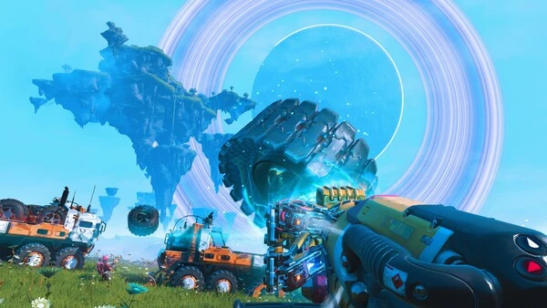

# No Man's Skyの炎上と復活――期待値管理と運営立て直しの事例

***

## はじめに

2016年8月9日、イギリスのインディースタジオHello Gamesが4人から始めた開発チームの作品、『No Man's Sky』がPS4向けにリリースされた（北米8月9日・欧州8月10日、PC版は8月12日）。全宇宙に約1844京（18 quintillion、＝2の64乗）を超える惑星が存在し、そのすべてを自由に探索できるというコンセプトは、ゲーム史上類を見ないスケールの約束だった。しかし発売直後の反応は激烈な批判で、Steamのレビューは「ほとんど不評」（直近レビューは一時「圧倒的不評」）にまで落ち込み、英国広告標準局（ASA）が調査に乗り出す事態にまで発展した。[[1](#ref-1)][[2](#ref-2)][[3](#ref-3)]

しかしこの記事の主題は「失敗した」ことではない。Hello Gamesはその後9年以上にわたって無料アップデートを40本以上リリースし続け、2025年9月にはSteamの同時接続プレイヤー数が98,285人を記録——ローンチ時のピーク（21万人超）には及ばないものの、発売後9年間で最高の数字だ。業界で「史上最大の復活劇」と呼ばれるこのプロセスを分解すると、新米ゲームプランナーが学ぶべき期待値管理の教訓が凝縮されている。[[4](#ref-4)][[5](#ref-5)][[6](#ref-6)]

*画像引用: [Steam - No Man's Sky](https://store.steampowered.com/app/275850/No_Mans_Sky/)（公式ストア掲載スクリーンショット, © Hello Games。本文中の作品紹介・実ゲーム画面の説明に必要な範囲で引用）*

***

## 第1章：なぜ期待値はここまで膨れ上がったのか

### 1-1. 小さなチームが世界規模の夢を語り続けた

Hello Gamesはもともと4人のスタジオだ。前作『Joe Danger』で成功を収めた後、Sean Murrayは「宇宙全体を舞台にしたゲーム」というアイデアに取り憑かれ、2013年12月のVGX授賞式で初公開した。[[7](#ref-7)][[8](#ref-8)]

公開直後の2013年12月24日、スタジオのオフィスが近くの川の氾濫で浸水するという不運に見舞われた。MacBookやハードウェアの大部分が水没し、コードのバックアップから開発を再スタートしなければならなかった。この逆境のエピソードは当時の記事で広く紹介され、「小さなチームが何倍もの夢に向かっている」というナラティブをさらに強化した。[[9](#ref-9)][[7](#ref-7)]

Sonyがパブリッシャーとして名乗りを上げ、E3の基調講演という最も注目される舞台にNo Man's Skyが登場すると、メディアとファンの熱狂は完全に制御不能なレベルに達した。「ゲームの期待値は、開発者自身では制御できなくなっていた」とMurray自身が後年のインタビューで述懐している。[[10](#ref-10)][[11](#ref-11)][[7](#ref-7)]

### 1-2. 曖昧な発言が積み重なった結果

Murrayの発言に「嘘をついた」という確定的な事実はなく、彼自身も後に「意図的な欺きではなく、ナイーブだった」と語った。しかし問題は、 **「開発中に実現したい理想」と「発売時に入っている機能」を曖昧に混同した発言を繰り返した** ことにある。[[10](#ref-10)]

最も批判を集めたのはマルチプレイヤーに関する発言だ。Murrayは複数のインタビューで「同じ宇宙を他のプレイヤーと共有できる」と示唆し続けた。実際、ゲームは全プレイヤーが同一の宇宙を共有するサーバーを使っていたが、 **リリース時には他のプレイヤーを画面上で視認することもインタラクトすることもできなかった**。[[12](#ref-12)][[13](#ref-13)]

発売直後に2人のプレイヤーが同じ惑星の同じ地点に立ったにもかかわらず、互いの姿が見えなかったという動画が拡散し、「マルチプレイヤーは嘘だった」という批判が爆発した。英国ASAはSteamストアページの広告に対する調査を開始し、結果的に「規制違反なし」という裁定を下したが、これはゲームが「手続き生成であるため、広告映像と完全に同一のシーンが再現されないことは消費者も理解できる」という論理による部分が大きかった。[[14](#ref-14)][[12](#ref-12)]

***

## 第2章：炎上後に何が起きたか

### 2-1. 沈黙という選択

発売から約3ヵ月間、Sean Murrayは公的なコミュニケーションをほぼ完全に停止した。Twitterには沈黙が続き、メディアの取材にも応じなかった。後にMurrayは「脅迫を受け、精神的に追い詰められていた」と語っている。さかのぼれば発売の約2か月半前、発売延期（6月21日→8月9日）を発表した直後の2016年5月にも、Murrayは殺害予告を「大量に受けた」とTwitterに投稿しており、スタジオへの反応が発売前から苛烈だったことを示している。[[15](#ref-15)][[16](#ref-16)][[17](#ref-17)][[27](#ref-27)]

この沈黙は当時のコミュニティから「不誠実の証拠」として批判された。しかし後から振り返れば、 **沈黙の裏でHello Gamesは最初の大型アップデートを黙々と開発していた**。発売から3ヵ月後の2016年11月、告知からリリースまでほぼ同時に「Foundationアップデート」を公開し、初めて公式コミュニケーションを再開した。[[18](#ref-18)][[19](#ref-19)][[20](#ref-20)]

### 2-2. 炎上後のプレイヤー推移

Steamでの同時接続プレイヤー数の推移は、問題の深刻さを数字で示している：[[21](#ref-21)][[1](#ref-1)]

| 時期 | Steam同時接続ピーク | 出来事 |
|---|---|---|
| 2016年8月（発売時） | 212,133人 | 発売[[22](#ref-22)] |
| 発売1週間後 | 約46,000人（−78%） | 批判が本格化[[1](#ref-1)] |
| 発売2ヵ月後 | 約2,000人（−99%） | プレイヤー離脱が止まらず[[26](#ref-26)] |
| 2016年11月（Foundation） | 約8,000人 | 大型アップデートで一時回復[[1](#ref-1)] |
| 2017年3月（Pathfinder） | 約7,000人 | 再び下落[[1](#ref-1)] |
| 2018年7月（NEXT） | 約97,000人 | 初のフルマルチプレイヤー実装[[26](#ref-26)] |
| 2025年9月（Voyagers） | 98,285人 | 発売後最高値を更新[[5](#ref-5)] |

発売直後の99%超のプレイヤー離脱という数字の深刻さと、9年間の積み重ねが発売後最高のプレイヤー数をつくり出した逆転劇の対比が、この表に凝縮されている。

***

## 第3章：復活を可能にした意思決定の構造

### 3-1. 「謝罪より行動」という戦略の成否

Hello Gamesは発売直後の炎上に対して、公式の謝罪声明をほとんど出さなかった。代わりに **「まず動いてから話す」というアプローチを一貫した**。Foundationアップデートの告知はリリースとほぼ同時で、「近いうちに改善します」という宣言ではなく「今日から使えます」という形で届けられた。[[18](#ref-18)]

この戦略には賛否がある。「もっと早く謝罪と説明をすべきだった」という批判は今も残る。しかし一方で、「空手形の約束ではなく動作するものを見せる」という姿勢が、コミュニティの中に「Hello Gamesを信じ続ける人々」を残したことも確かだ。[[20](#ref-20)]

### 3-2. 40本以上の無料アップデートが語るもの

2026年4月時点で、No Man's Skyは **名前のついた大型アップデートを44本以上、中規模パッチを5本リリースしている**。すべて無料だ。主な追加機能を時系列で見ると：[[4](#ref-4)]

- **Foundation（2016年11月）**：拠点建設、貨物船の所有、サバイバル・クリエイティブモード[[2](#ref-2)]
- **Pathfinder（2017年3月）**：エクソクラフト（探索車両）、パーマデスモード[[2](#ref-2)]
- **Atlas Rises（2017年8月）**：30時間のストーリーコンテンツ、最大16人の共同探索[[23](#ref-23)]
- **NEXT（2018年7月）**：フルマルチプレイヤー実装、Xbox One対応、三人称視点[[24](#ref-24)][[2](#ref-2)]
- **Beyond（2019年8月）**：VRサポート、大型コミュニティ機能[[20](#ref-20)]
- **Worlds Part II（2025年1月）**：ガスジャイアント、深海惑星などの新惑星タイプ[[2](#ref-2)]
- **Remnant（2026年2月）**：重力銃（Gravitino Coil）による大型物体の把持・運搬[[2](#ref-2)]
- **Xeno Arena（2026年4月）**：エイリアン生物を捕獲して戦わせるポケモン的コンテンツ[[2](#ref-2)]

発売時に「約束されていたが存在しなかった」機能の多くが、時間をかけて実装されていった。 **「嘘をついた」と批判された内容が、アップデートという形で後付けで実現されていく** という逆説的なプロセスが、コミュニティの信頼を少しずつ回復させた。

### 3-3. Hello Gamesを支えた経済的構造

なぜこれだけの規模の無料アップデートを長期間続けられたのか。Hello GamesはイギリスのCompanies Houseに財務諸表を提出している。それによれば2023年度（2023年10月期）の税引前利益は2,160万ポンド（前年は4,060万ポンド）で、2022年時点の総資産は約1億4,500万ポンドに達していた。発売時の大量販売が生み出したキャッシュが、9年間の継続開発を支えた構造だ。[[25](#ref-25)]

同時に、チームが「プライベートで独立したスタジオ」であったことが **「株主の要求に左右されず、長期的にゲームをよくする判断を続ける」自由を確保した**。上場企業であれば、発売3ヵ月後に99%のプレイヤーが離脱した時点で投資家圧力により方針変更を迫られていた可能性が高い。[[25](#ref-25)]

***

## コラム：「期待値の過剰管理」と「ゲームジャーナリズムの役割」

No Man's Skyのケースには、もうひとつの視点がある。Murrayが「ナイーブに夢を語り続けた」一方で、 **大手メディアもその夢を増幅させることに加担した** という問題だ。

E3の大舞台での登場、Sonyの後ろ盾、「史上最大のゲーム」という枕詞——これらはHello Gamesではなくメディアが生み出した表現だった。Ars Technicaの記事は「Murray自身もコントロールできなくなった期待値の嵐が形成された」と表現している。Polygonも「ゲームはPRの大失敗だったが、売上は大成功だった」と分析しており、その矛盾が批判の温床になったと指摘した。[[11](#ref-11)][[15](#ref-15)]

インディースタジオの創設者が広報の専門家なしにメディアに向けて「夢」を語り続けたとき、何が起きるか——この問いは、マーケティング担当者だけでなくプランナーにとっても他人事ではない。 **「面白いと思っているコンセプト」と「確約できる機能」を同じ文脈で語ることは、ユーザーの期待値を管理不能にするリスクを孕んでいる。**

***

## 第4章：分岐点——何が変えられたか

### 分岐点①：発売前の「現在の状態」の明示

Murrayはリリース直前のブログ投稿で「これはあなたがトレーラーから想像したゲームとは違うかもしれない」と初めて明示した。しかしこのメッセージは発売数日前、プレオーダーのキャンセル期限が過ぎた後だった。[[11](#ref-11)]

**もし発売の半年前から「現在入っていない機能のリスト」を透明に公開していれば、購入者のミスマッチは大幅に減少していたはずだ。** 期待値管理は「夢を小さくすること」ではなく「現在の状態と将来の意図を分けて伝えること」である。

### 分岐点②：レビューコピーを送らなかった判断

No Man's Skyは発売前にメディアへのレビューコピーを配布しなかった。Polygonはこれを「ゲームが未完成だったから」と分析している。この判断によって発売前レビューが存在せず、初日購入者は情報なしに8,000〜6,000円を支払った。[[15](#ref-15)]

**レビューコピーを出さないことで批判的レビューを封じる戦略は、発売後の大量返金・炎上という形で跳ね返った。** [Cyberpunk 2077のケース](cyberpunk-2077-anatomy-of-a-collapse.md)とは逆方向のアプローチだが、結果として同様に「情報の非対称性がユーザーの信頼を壊す」という構造を示している。

### 分岐点③：沈黙期間のコミュニケーション設計

3ヵ月の沈黙は「開発に集中する」という意味では正当化できる。しかし「毎月の進捗状況を1段落だけ投稿する」程度の最低限のコミュニケーションがあれば、「見捨てられた」という感覚を持つプレイヤーを大幅に減らせた可能性がある。コミュニティ管理において **「沈黙」は意図がどうあれ「拒絶」として受け取られやすい**。[[19](#ref-19)]

***

## ゲームプランナーへの教訓

| 問題の構造 | No Man's Skyでの現れ方 | 現場への応用 |
|---|---|---|
| **「夢」と「仕様」の混同** | マルチプレイヤーに関する曖昧な発言[[12](#ref-12)][[13](#ref-13)] | 「実現したいこと」と「発売日に確約できること」を社内でも対外でも明確に分類する |
| **期待値の自己増殖** | E3登場後、メディアがコントロール不能な熱狂を作り出した[[11](#ref-11)] | 公開情報は「発売時の状態」を基準にする。将来の可能性は「〜を検討中」と明示する |
| **レビュー情報の遮断** | 発売前レビューコードを配布しなかった[[15](#ref-15)] | 透明性を欠いた情報遮断は短期的な批判回避にはなっても長期的な信頼は生まない |
| **炎上後の沈黙** | 3ヵ月のSNS・メディア対応停止[[19](#ref-19)][[16](#ref-16)] | 問題発生時のコミュニケーション計画を事前に用意する。最低限の状況報告は続ける |
| **独立財源の重要性** | 内部留保が9年間の無料アップデートを支えた[[25](#ref-25)] | 長期的なゲームの改善は「収益が担保されていること」を前提にしている |

***

## おわりに：No Man's Skyが業界に残したもの

No Man's Skyの「復活劇」は、ゲーム業界全体に一つの問いを投げかけた。 **「発売時に完成していなかったゲームは、アップデートで取り戻せるか」** ——そしてその答えは「条件が揃えば、可能だ」であることを示した。

条件とは、①財政的な持続性、②スタジオが外部圧力から自由であること、③ユーザーの一部に「待ち続ける意志」があること、④実際に機能を届け続けること——の四つだ。

しかし同時に、これは「最初から期待値を管理していれば、炎上を経ずに同じ結果に辿り着けた」という教訓でもある。復活劇のドラマチックさは結果であり、目指すべき戦略ではない。発売前に「現在の状態」と「将来の意図」を分けて誠実に伝えることは、ゲームプランナーにとって技術スキルではなく **コミュニケーション設計の問題** だ。その設計を怠った代償が、9年間の復旧コストとして計上されたのがNo Man's Skyの本当の教訓である。

---

## References

1. [No Man's Sky Player Counts One Year After Launching on Steam][1] - And once again, the gains were short-lived with the playerbase returning to its same core of 500-1,0...

2. [No Man's Sky - Wikipedia][2] - The game has received a plethora of free major content updates that have added several previously mi...

3. ['No Man's Sky' False Advertising Investigation - Business Insider][3] - The ongoing backlash to "No Man's Sky" has reached a new peak, as an advertising authority has decid...

4. [Updates ｜ No Man's Sky Resources][4] - As of April 2026 there have (so far) been over 44 named updates, and 5 medium content patches, after...

5. [No Man's Sky hits 98,000 players on Steam, highest ... - TweakTown][5] - TL;DR: The free Voyagers expansion for No Man's Sky has driven the game's 24-hour Steam player count...

6. [Voyagers Update Drives Highest No Man's Sky Player Counts Since ...][6] - No Man's Sky has just recorded its highest player counts since its launch nine years ago off the bac...

7. [Hello Games - Wikipedia][7] - Hello Games Ltd is a British video game company based in Guildford, Surrey. The company was founded ...

8. [Digital Media Concepts/No Man's Sky - Wikiversity][8] - As it developed, the team grew to a size of 17. No Man's Sky. Developer, Hello Games, Genre, Open Wo...

9. [Back to work: The story of the Hello Games flood - Polygon.com][9] - Sean Murray was on a plane headed to San Francisco, and he was nervous. He and three other developer...

10. [Sean Murray breaks his silence on No Man's Sky's development ...][10] - Sean Murray breaks his silence on No Man's Sky's development, launch. Extensive interviews cover “na...

11. [How sky-high hype formed a storm cloud over No Man's ...][11] - Murray's early interviews about No Man's Sky could be cringe ... No Man's Sky: first look gameplay ｜...

12. ['No Man's Sky' Multiplayer Controversy Explained: Server Issues ...][12] - So is 'No Man's Sky' multiplayer or not? It seems that server issues have kept some multiplayer feat...

13. [No Man's Sky - managing the hype (Sean Murray interview)][13] - No Man's Sky Interview: Five minutes with Sean Murray. Eurogamer · 36K views ; No Man's Sky - Interv...

14. [ASA rules No Man's Sky advertising did not mislead consumers][14] - There were also claims that the screenshots misrepresented the graphical quality of the game, and th...

15. [No Man's Sky was a PR disaster wrapped in huge sales - Polygon.com][15] - "It wasn't a great PR strategy, because he didn't have a PR person helping him, and in the end he is...

16. [No Man's Sky Developer Sean Murray Is 'Fine,' Hello Games Busy ...][16] - In the wake of the backlash to the game, Sean Murray, who had been the face of Hello Games in No Man...

17. ["I have received loads of death threats this week, but don't ...][17] - Sean Murray on Twitter: "I have received loads of death threats this week, but don't worry, Hello Ga...

18. [Back from the abyss: The story of No Man's Sky's death - The Spinoff][18] - Braving the risk of being labelled a No Man's Sky apologist, Josh Drummond unpacks what many conside...

19. [Sean Murray and Hello Games, this silence is deafening. - Reddit][19] - Hello Games sold a game, and then went completely radio silent. No official tweets in two months. Re...

20. [The Redemption of No Man's Sky - Big Red Barrel][20] - On Twitter, I started seeing people send abuse to Sean Murray after he mentioned something about mor...

21. [No Man's Sky sees huge spike in player numbers][21] - According to Steam Charts, No Man's Sky's concurrent users peaked at over 60,000 players on Steam th...

22. [No Man's Sky Player Count - Steam Charts - Tracker Network][22] - The game has achieved an all-time high of 212,133 concurrent players on Steam. Compared to the previ...

23. [Atlas Rises Update - No Man's Sky][23] - Update 1.3, Atlas Rises, brings a brand new and overhauled central storyline, portals, a new procedu...

24. ['No Man's Sky' is finally getting full-fledged multiplayer - Mashable][24] - Almost two years after 'No Man's Sky' launched, developer Hello Games is introducing a big update th...

25. [Video game company behind popular No Man's Sky in "strong position" despite fall in profits - Insider Media][25] - Its last accounts for the year to 31 October 2023 revealed a profit before tax of £21.6m, down from £40.6m made in 2022...

26. [No Man's Sky - Steam Charts][26] - Monthly concurrent player peaks: October 2016 ≈ 2,172; July 2018 (NEXT) ≈ 96,954; all-time peak 212,321...

27. [No Man's Sky Creator Receives Death Threats After Delay Announcement - Game Informer][27] - "I have received loads of death threats this week" — Sean Murray (@NoMansSky) May 28, 2016, following the delay from June 21 to August 9...

[1]: https://www.githyp.com/no-mans-sky-player-counts-one-year-after-launching-on-steam/
[2]: https://en.wikipedia.org/wiki/No_Man's_Sky
[3]: https://www.businessinsider.com/no-mans-sky-false-advertising-investigation-2016-9
[4]: https://www.nomansskyresources.com/updates-and-experimental
[5]: https://www.tweaktown.com/news/107494/no-mans-sky-hits-98000-players-on-steam-highest-player-count-since-launch/index.html
[6]: https://hellogames.org/2025/09/08/voyagers-update-drives-highest-no-mans-sky-player-counts-since-launch/
[7]: https://en.wikipedia.org/wiki/Hello_Games
[8]: https://en.wikiversity.org/wiki/Digital_Media_Concepts/No_Man's_Sky
[9]: https://www.polygon.com/2014/3/11/5487564/hello-games-flood-recovery-interview/
[10]: https://arstechnica.com/gaming/2018/07/sean-murray-breaks-his-silence-on-no-mans-skys-development-launch/
[11]: https://arstechnica.com/gaming/2016/08/how-sky-high-hype-formed-a-storm-cloud-over-no-mans-skys-release/
[12]: https://www.player.one/no-mans-sky-multiplayer-controversy-explained-server-issues-crushing-online-features-550145
[13]: https://www.youtube.com/watch?v=lWhSdSAm7To
[14]: https://www.gamesindustry.biz/asa-rules-no-mans-sky-advertising-did-not-mislead-consumers
[15]: https://www.polygon.com/2016/9/16/12929618/no-mans-sky-disaster-lies-lessons-learned/
[16]: https://gamingbolt.com/no-mans-sky-developer-sean-murray-is-fine-hello-games-busy-working-on-next-patch
[17]: https://www.reddit.com/r/NoMansSkyTheGame/comments/4lhw7w/sean_murray_on_twitter_i_have_received_loads_of/
[18]: https://thespinoff.co.nz/pop-culture/20-12-2016/back-from-the-abyss-the-story-of-no-mans-skys-death-and-resurrection
[19]: https://www.reddit.com/r/NoMansSkyTheGame/comments/59dujc/sean_murray_and_hello_games_this_silence_is/
[20]: https://www.bigredbarrel.com/2019/08/10/the-redemption-of-no-mans-sky/
[21]: https://www.gamereactor.eu/no-mans-sky-sees-huge-spike-in-player-numbers/
[22]: https://tracker.gg/population/steam/275850?page=8
[23]: https://www.nomanssky.com/atlas-rises-update/
[24]: https://mashable.com/article/no-mans-sky-multiplayer-update
[25]: https://www.insidermedia.com/news/south-east/video-game-company-behind-popular-no-mans-sky-in-strong-position-despite-fall-in-profits
[26]: https://steamcharts.com/app/275850
[27]: https://www.gameinformer.com/b/news/archive/2016/05/29/no-mans-sky-creator-receives-death-threats-after-delay-announcement.aspx

----

この文書は、Perplexity、Claude、OpenAI Codex の3つのAIの支援を受けて著述されたものです。引用画像を除き、MIT License にて提供されています。
