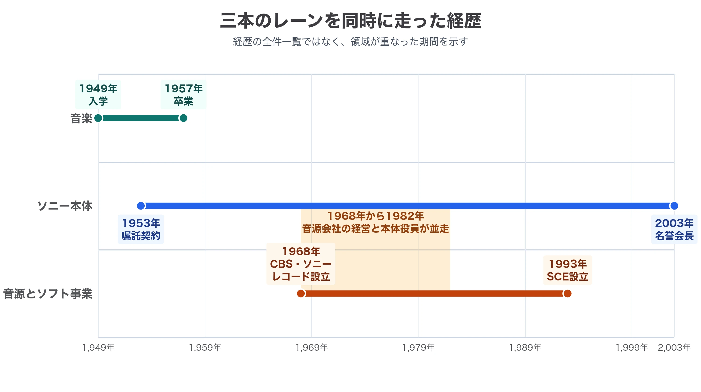
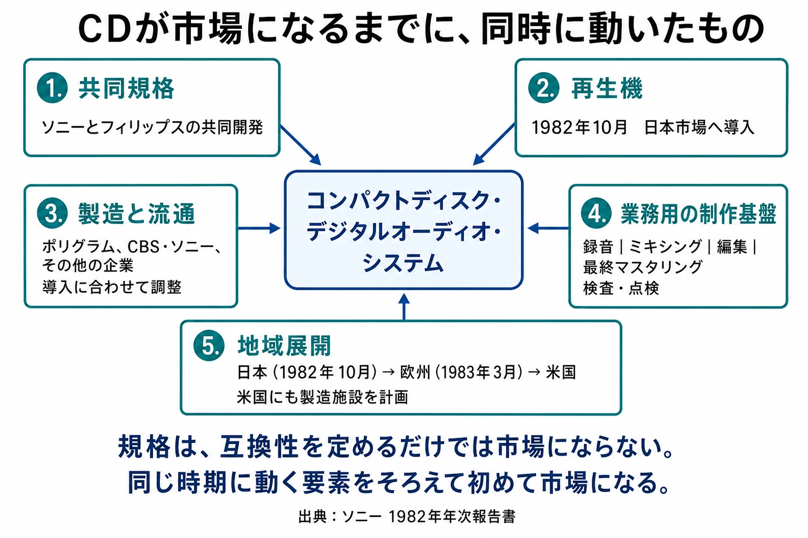
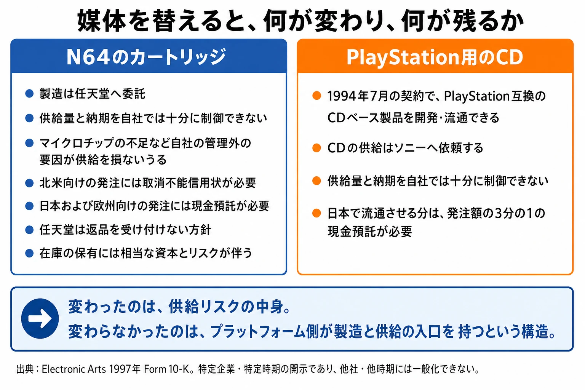
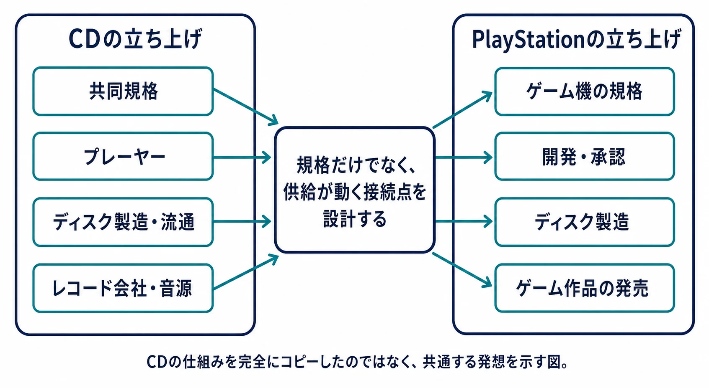

# 大賀典雄評伝——CDからPlayStationへ、「規格と供給」を一体で考えた経営者

## はじめに：PlayStationの勝因を、誰の判断として読むか

初代PlayStationの強さは、3DグラフィックスやCD-ROMの容量から説明されることが多い。どちらも正しい。しかし、その説明だけでは、別の問いが残る。CD-ROMを選ぶとは、単に本体へ大容量の記憶装置を載せることだったのか。あるいは、規格、ディスクの生産、ソフトの発売、店頭へ届くまでの経路を一つの事業として組み直すことだったのか。

この問いを考えるとき、ソニー元社長・元会長の大賀典雄を外すことはできない。大賀はゲームの技術者でも、ゲームデザイナーでもなかった。東京藝術大学の音楽学部で学び、音楽を再生する機械を「使う側」から見ていた人物である。後にソニーは、大賀がハードとソフトを「車の両輪」として経営し、1993年にソニー・コンピュータエンタテインメントを設立してゲーム事業への参入を決めたと記している。大賀は2011年4月23日、ソニー株式会社相談役として逝去した。[[1](#ref-1)]

もちろん、PlayStationを一人で作った人物はいない。半導体、開発機材、ゲーム制作、営業、流通には、それぞれ別の専門家と組織があった。本稿の目的は、大賀を万能な功労者として祭り上げることではない。音楽産業で、規格を決めることと、規格に乗る作品をつくり届けることを切り離さずに考えた経営者が、ゲーム事業をどのような形で立ち上げたのかを読むことである。

任天堂とのCD-ROM協業とその破談の経緯、また1990年代の市場競争そのものは、すでに別記事で扱っている。本稿は勝敗の年表ではなく、PlayStationが生まれる以前からソニー内部にあった「何を握れば、コンテンツが動くか」という発想の来歴に絞る。

***

## 1. 声楽を学んだ学生が、製品の判断へ入るまで

### 「聴く人」の要求を、仕様に翻訳した

大賀は1949年に東京藝術大学音楽学部声楽科へ入り、1953年に卒業した。ソニーの略歴によれば、同年に東京通信工業（のちのソニー）と嘱託契約を結び、1959年に正式入社している。[[2](#ref-2)] ここで大切なのは、音楽家志望者が偶然メーカーへ転じたという珍しさではない。大賀が会社へ入る入口そのものが、再生機を使う側の不満を、機械の要件として言葉にしたことだった。

ソニーの社史は、1950年の大賀を、芸大で使ったG型テープレコーダーの改良点を仕様書として東京通信工業へ出した学生として記録する。井深大との打ち合わせで、大賀は、音楽家にとってテープレコーダーは練習を映す鏡のようなものだと述べたという。井深はその知識を評価し、大賀は無給のアドバイザーとして出入りするようになった。[[3](#ref-3)]

この出来事を、後年の成功を知ったうえでの美談にしてはならない。重要なのは、「良い音」という感覚的な要求が、演奏者の練習という具体的な用途から、改良すべき箇所を持つ仕様書へ変換されていた点である。技術者が性能を作り、利用者が評価するという二分法ではない。利用者の仕事や失敗の仕方を知る人が、何を優先するかという製品判断に入る構造が、ここで生まれている。

その後の大賀は、製品の品質、機能、デザイン、宣伝の改善に携わり、「お客さまが欲しくなる商品づくり」という考えを社内へ浸透させたとソニーは説明する。[[1](#ref-1)] 入社直後の職掌も、この説明と符合する。1959年9月の入社と同時に第二製造部長へ就き、1961年にはデザイン室長と宣伝部長を兼務している。[[2](#ref-2)] 作る側と、見せて売る側の両方を、同じ人物が同時に持っていた。 これはゲームにおける「ユーザー目線」という曖昧な標語とは少し違う。誰がどの場面で何を確かめ、どの条件なら買うかを、製品の形、売り方、供給まで含めて判断する位置に置くという意味である。

### 音源を持たないオーディオ企業は、片輪である

大賀の視野は、再生機の使い勝手だけで止まらなかった。1968年のCBS・ソニーレコード設立を扱うソニー社史によれば、大賀は以前から「オーディオ機器をつくるソニーには音源が必要です。レコード会社を持つべきです」と進言していた。設立後、社長を兼ねる盛田昭夫に代わり、実質的な経営は大賀に任された。大賀は自らCBS・ソニーレコードへ転籍している。[[4](#ref-4)] 以後、1968年3月に専務取締役、1970年に社長、1980年に会長。[[2](#ref-2)] レコード会社を外から眺めたのではなく、十年以上にわたって自ら経営した。

この判断の要点は、ソニーがレコードを「周辺事業」として持ったことではない。再生機だけを改良しても、再生される作品、作品を作る人、作品を店へ届ける会社が別々の事情で動けば、顧客が新しい機械を使う理由は弱い。反対に、ハードと音源の双方を見れば、規格を採用する側の不安、作品を供給する側の不安、発売日に店頭で体験できるかという不安を、同じ経営の議題に載せられる。

大賀は技術を発明する立場よりも、こうした異なる仕事を一つの製品体験へ結び直す立場にいた。後のゲーム事業を理解するうえでは、ここで「音源」がすでにハードの付属物ではなく、事業の成立条件として捉えられていたことが出発点になる。

  

***

## 2. CDで得た経験：規格は、仕様書だけでは市場にならない

### 共同規格と、立ち上げを同期させる仕事

CDはソニー単独の規格ではない。1982年のソニー年次報告書は、コンパクトディスク・デジタルオーディオ・システムをフィリップスとの共同開発とし、プレーヤーの導入に合わせて、ポリグラム、CBS・ソニー、その他の会社によるCDの製造・流通を調整していたと記す。[[5](#ref-5)]

この記録が示すのは、CDの立ち上げが「規格を決めた会社が、すべてのディスクを単独で作り売った」という話ではないことだ。共同開発者、レコード会社、製造・流通を担う複数の会社が存在した。それでも、プレーヤーだけ、あるいはソフトだけを先に置くのではなく、機器とディスクが同じ時期に市場へ出るように調整する必要があった。規格は図面上で互換性を定めるだけでは足りない。規格に従う商品が作られ、店へ届き、消費者が最初に再生できる作品を選べて初めて、規格は市場になる。

同じ年次報告書は、業務用の領域についても書いている。ソニーはこの時期、マルチチャンネル録音からミキシング、編集、最終マスタリング、そして製造されたディスクの検査・点検までを含む、CDの録音・製造の総合的なシステムを開発し販売していた。[[5](#ref-5)] 規格を決めた側が、作品が物理的なディスクとして完成するまでの工程を、自社の商品として持っていたということである。

時期も見ておきたい。大賀がソニーの代表取締役社長へ就いたのは1982年9月であり、CDプレーヤー「CDP-101」が発売されたのはその翌月の10月である。[[2](#ref-2)] 経営の責任を負う立場に移った直後に、自ら関わった規格の商品が市場へ出た。年次報告書によれば、日本での導入に続いて欧州は1983年3月、その後に米国という順序が計画されており、CBS・ソニーは米国にもCDの製造施設を設ける計画を持っていた。[[5](#ref-5)] 規格、機器、ディスクの製造拠点、発売地域の順序が、同じ経営の議題として並んでいる。

ただし、この時期の大賀の役割を、一人の指揮官の功績として確定させることには注意が要る。ソニー自身は、大賀が小型光ディスクの将来性を予見して開発の陣頭指揮を執ったと説明している。[[1](#ref-1)] 一方、経営史の研究はこれと異なる像を示す。長谷部弘道は、従来の研究がCDの戦略過程を当時副社長だった大賀の功績として描いてきたのに対し、実際にディジタル録音技術を開発した技術者たちの著作では自分たちが戦略過程を主導したと主張されている点を指摘したうえで、技術者へのインタビューや業界誌の記事を分析し、この過程の主たる戦略的リーダーはミドルマネジャーとして計画に動機を与えた中島平太郎であったと結論している。同論文は、これがトップマネジメントではなくミドルマネジメントに率いられた、技術者主導の過程だったとまとめている。[[6](#ref-6)]

本稿は、この研究の結論と対立しない。むしろ前提として受け取る。大賀を、規格を発明した人物として描く必要はないからである。本稿が論点に置くのは、個別仕様を誰が最終決定したかではなく、大賀がレコード会社の経営とCDの事業化を同じ視野に置いていたという、確認できる構造である。技術を主導した人物と、その技術が市場になる条件を整えた人物は、同じである必要がない。

### 「第九が入る長さ」の逸話を、根拠にしない

CDの直径と収録時間をめぐっては、大賀がベートーヴェンの交響曲第9番を一枚に収めるため、12センチ・75分を強く求めたという逸話が広く語られている。ソニーの2011年の訃報もその説明を採用している。[[1](#ref-1)]

ただし、この逸話は、演奏時間の取り方、誰の録音を念頭に置いたか、実際の規格決定でどの程度の決定因だったかに複数の語られ方があり、確定した史実として扱えない。ここでは「音楽家である大賀が演奏時間へ強い関心を持ったことを象徴する、広く流布した話」にとどめる。この逸話を、PlayStationのCD-ROM採用や大賀の先見性を立証する根拠には用いない。

根拠にすべきなのは、むしろ確認できる事業の配置である。大賀が実質的な経営を担ったCBS・ソニーレコードは、音源を持ち、1982年にはCD製造も始めた。[[4](#ref-4)][[7](#ref-7)] そしてソニーの年次報告書は、プレーヤーの発売とディスク供給を同期させる必要を記録している。規格を選ぶ側が、作品の供給と物理的な届け方を「あとで誰かが解く問題」にしなかった経験こそ、後のゲーム事業を考える手がかりになる。

***

## 3. CD-ROMを選ぶとは、何を選ぶことだったのか

### 媒体は容量ではなく、発売計画の条件である

ゲーム機でCD-ROMを採用する意味を、ムービーや音声を多く入れられることだけに縮めると、CDで積み上げた経験とのつながりが消える。媒体は、表現の上限であると同時に、誰が、いつ、どの数量を製造し、いつ追加生産を決められるかという発売計画の条件でもある。

カートリッジの構造が持つ事業上の重さは、当時のパブリッシャーの開示資料にも現れる。Electronic Artsの1997年年次報告書は、NINTENDO64用カートリッジを任天堂へ製造委託しており、供給量と納期を十分に制御できないこと、マイクロチップ不足が供給を損ない得ること、地域によっては発注時に保証や預託が必要になることをリスクとして挙げた。任天堂は返品を受け付けない方針でもあり、同社はカートリッジ在庫に大きな資本とリスクが伴うと記している。[[8](#ref-8)] これはカートリッジが劣った媒体だという意味ではない。読み込みの短さなど、別の設計上の利点もある。だが、半導体を使う物理媒体を先にどれだけ確保するかは、ゲームの内容とは別に、在庫、資金、発売日の判断を重くする。

半導体の需給が事業の重石になりうることを、大賀は業界団体の側からも見ていた。ソニーは訃報で、大賀が日本電子機械工業会会長として、1986年から10年間続いた日米半導体協定の問題を1996年に解決したと記している。[[1](#ref-1)] 半導体をめぐる通商交渉の当事者だった人物が率いる会社が、半導体を積んだカートリッジではなく光ディスクを載せた機械で参入した——この並びは偶然かもしれない。因果を主張する材料はない。それでも、部材の調達が経営の議題になるという感覚が、この経営者の側にあったことは確かである。

CD-ROMは、この問題を自動的に解いたわけではない。同じ年次報告書でEAは、PlayStation用CDについてもソニーから供給を受け、供給量と納期を自社だけでは制御できないと記した。日本での流通分には発注額の3分の1の現金預託も求められていた。[[8](#ref-8)] 原盤、プレス、パッケージ、物流、店頭在庫もなお必要である。つまり光ディスクへの移行が取り替えたのは、プラットフォーム側による製造・供給の管理そのものではない。少なくともこの事例では、その管理を保ったまま、半導体の不足が直接の供給リスクとして明記されるカートリッジとは異なる物理媒体へ移したのである。

ここで大賀のCD経験が示唆するのは、媒体選択をハード開発部門だけの部品選定にしないことだ。光ディスクが容量を増やすとしても、発注、預託、複製、物流、発売時期の決定までが変わる。ゲーム会社にとっての利点や負担は、媒体名だけでは決まらず、各プラットフォームの製造契約と供給条件の中で決まる。表現、製造、流通、ソフトの発売時期を一枚の設計として見ることである。

### プラットフォームが持ったのは、ディスクそのものではなく接続点である

PlayStation用ソフトの製造は、ライセンスされたパブリッシャーの開発工程から切り離された無関係な後工程ではなかった。EAは、1994年のソニー・コンピュータエンタテインメント・アメリカとの契約により、PlayStation互換のCDベースのソフトを開発・流通でき、そのCDをソニーへ供給依頼していたと開示している。[[8](#ref-8)] また、米国のPlayStationライセンス資料を収蔵するアーカイブも、企画、開発、パッケージ、申請と並んで、PlayStationゲームの製造を資料の対象としている。[[9](#ref-9)] ここでプラットフォーム側が持つのは、すべての小売を一社で支配する力というより、規格に適合したマスターを、承認、複製、パッケージ、発売という工程へ接続する入口である。

CDの時代に見えていたのも、同じ種類の接続であった。プレーヤー、共同規格、ディスク製造、レコード会社の音源、販売店が、それぞれ独立していながら、発売時には同時に動かなければならない。PlayStationで音楽産業の仕組みがそのまま複製されたわけではない。ゲームには開発環境、審査、インタラクティブな作品の品質確認といった固有の仕事がある。それでも「ハードを売る会社が、作品が物理媒体になり市場へ出る接続点まで設計する」という発想は、CDで得た経験と連続している。

この見方は、「CD-ROMだから勝った」という短い結論を、より実務的な問いに変える。自分たちが選ぶ技術は、どんな表現を可能にするかだけでなく、誰の発注、承認、複製、発売の判断を変えるのか。プランナーが媒体や配信先を選ぶとき、性能表の横に置くべきなのは、この運用の地図である。

***

## 4. 久夛良木健をめぐる判断を、組織の形から読む

PlayStationの事業化を語るとき、久夛良木健氏をめぐる「社内で異物と見られた技術者を、大賀が直接支えた」という物語がしばしば語られる。しかし、誰がどの会議で反対し、大賀がどのような指示を出したかを裏づける同時代の一次資料を、本稿では確認できなかった。存命の人物をめぐる評価を、後年の逸話だけで断定することは避けるべきである。

その代わりに、確認できる判断を見る。ソニーの訃報は大賀がゲーム事業への参入を決断したと記し、ソニー・コンピュータエンタテインメントは1993年11月、ソニー株式会社とソニー・ミュージックエンタテインメント（ジャパン）の合弁として設立された。[[1](#ref-1)][[10](#ref-10)]

この会社の設立は、ゲーム機の企画を既存の家電事業部の内部案件として処理するだけではなく、音楽会社も出資する別法人として置いたことを意味する。ここから「大賀が特定の技術者を救った」とまでは言えない。しかし、少なくとも経営は、ゲームを家電の周辺機器ではなく、ハード、ディスク、作品、販売の仕事をまとめて扱う事業として組織化した、と読むことができる。

組織の形は、技術者を評価する言葉より長く残る。別法人にすることには、既存部門の損益や慣行から距離を取り、異なる専門性を同じ事業目標へ集める利点がある一方、本体との資源配分や責任の線引きを難しくする代償もある。大賀の判断をここに見るなら、焦点は久夛良木氏個人の英雄譚ではない。CDで学んだ「ハードとソフトを別々にしない」発想を、ゲームで実行できる組織の形へ移した点にある。

***

## 5. 異業種の作法を持ち込むとは、何を握るかを問い直すこと

大賀典雄の経歴は、声楽家からメーカー経営者へ転じた異色の物語として読める。しかし、ゲームを学ぶうえで持ち帰るべきなのは、その経歴の珍しさではない。音楽産業での経験を通じて、機器、規格、音源、製造、流通を、別々の部署の仕事ではなく、一つの顧客体験の成立条件として見たことにある。

プラットフォームの勝敗は、最高性能の部品だけで決まらない。作品が作られるか、発売日までに製造できるか、販売側が扱えるか、利用者が最初に触れたとき次の作品も欲しくなるか——その接続のどこを誰が持つかで、技術の価値は変わる。CDとPlayStationの間にあるのは、光ディスクという形の一致だけではない。規格を「互換性の約束」として終わらせず、供給が実際に動く仕組みまで設計対象にする発想の一致である。

現在のゲームは、ディスクよりもダウンロード、ストア、オンライン更新、課金基盤、コミュニティへ重心を移している。それでも問いは残る。新しい機能を入れるとき、チームはその機能を誰が承認し、誰が配信し、誰が顧客へ説明し、失敗したとき誰が在庫や運用の負担を負うのかまで見ているか。異業種の常識が競争優位になるのは、表面の成功例を借りたときではない。自分たちの業界で分断されている工程を見つけ、別の業界がすでに解いていた接続の問題として捉え直せたときである。

そして経営にとっての教訓は、技術者の構想を称賛することだけでは足りないという点にある。その構想が、既存組織の中で実行不能なら、どの責任、資金、供給能力を結び直す組織が必要かを決めなければならない。大賀が残した線は、音楽からゲームへ移った一本の技術史ではない。技術、作品、供給を別々にしないために、何を握り、どの組織に任せるかを問う経営の線である。

## References

1. [訃報　弊社相談役 大賀典雄][1] - 大賀典雄の逝去、音楽学部在学中からの経歴、CD・ハードとソフト・ゲーム事業に関するソニーの公式説明。

2. [弊社取締役会議長 大賀典雄 取締役退任のお知らせ][2] - 大賀典雄の略歴。東京藝術大学音楽学部声楽科への入学、嘱託契約、正式入社などを記す。

3. [第1部 第2章 日本初のテープレコーダー][3] - 芸大生だった大賀がG型テープレコーダーの改良仕様を提出し、井深大の無給アドバイザーとなった経緯を記すソニー社史。

4. [第2部 第1章 CBS・ソニーレコード誕生][4] - 大賀のレコード会社所有に関する進言、CBS・ソニーレコードの設立と実質的な経営を記すソニー社史。

5. [Sony Annual Report 1982][5] - フィリップスとのCD共同開発と、プレーヤー導入に合わせたポリグラム、CBS・ソニーなどによるCD製造・流通の調整を記す年次報告書。

6. [Development Process of Digital Recording Technology][6] - CDの戦略過程における大賀と技術者の役割をめぐる、異なる記述を整理した経営史研究。

7. [沿革｜ソニーミュージックグループ][7] - CBS・ソニーレコードによる1982年のCD製造開始を記す公式沿革。

8. [Electronic Arts 1997 Form 10-K][8] - NINTENDO64用カートリッジの製造委託、供給・納期・発注条件を事業リスクとして記載したEAの年次報告書。

9. [PlayStation SCEA SourceBook][9] - PlayStationのライセンスされた開発者・パブリッシャー向け資料群。企画、開発、パッケージ、申請、製造を含むことが収蔵情報から確認できる。

10. [Sony Interactive Entertainment Timeline][10] - 1993年11月のソニー・コンピュータエンタテインメント設立を、ソニーとソニー・ミュージックエンタテインメント（ジャパン）の合弁として記す公式年表。

[1]: https://www.sony.com/ja/SonyInfo/News/Press/201104/11-0423/
[2]: https://www.sony.com/ja/SonyInfo/News/Press/200301/03-003/
[3]: https://www.sony.com/ja/SonyInfo/CorporateInfo/History/SonyHistory/1-02.html
[4]: https://www.sony.com/ja/SonyInfo/CorporateInfo/History/SonyHistory/2-01.html
[5]: https://www.sony.com/en/SonyInfo/IR/library/ar/8ido18000005fmhn-att/1982-E.pdf
[6]: https://www.jstage.jst.go.jp/article/bhsj/51/4/51_3/_article/-char/en
[7]: https://www.sme.co.jp/company/history/
[8]: https://www.sec.gov/Archives/edgar/data/712515/0001012870-97-001195.txt
[9]: https://archives.museumofplay.org/repositories/3/resources/161
[10]: https://sonyinteractive.com/en/our-company/expanded-company-timeline/

----

この文書は、Perplexity、Claude、OpenAI Codex の3つのAIの支援を受けて著述されたものです。引用画像を除き、MIT License にて提供されています。
