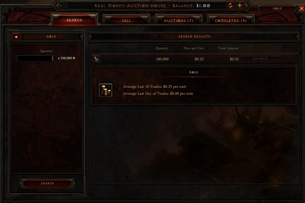
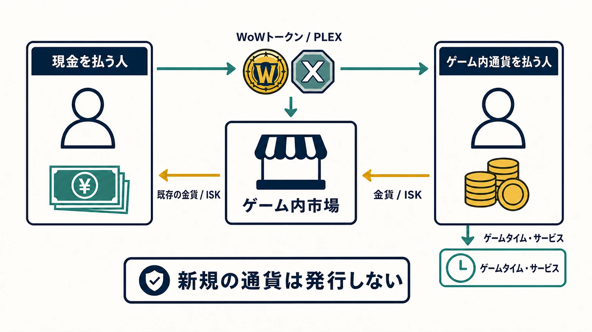
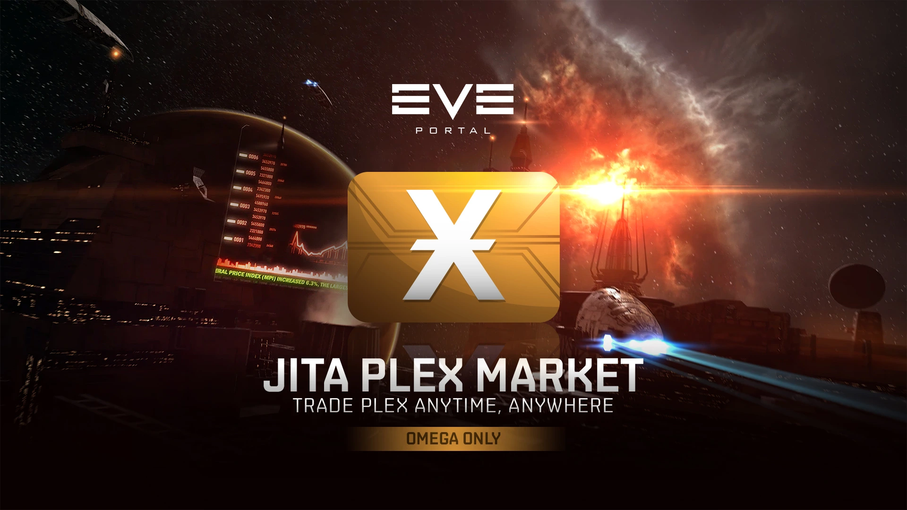
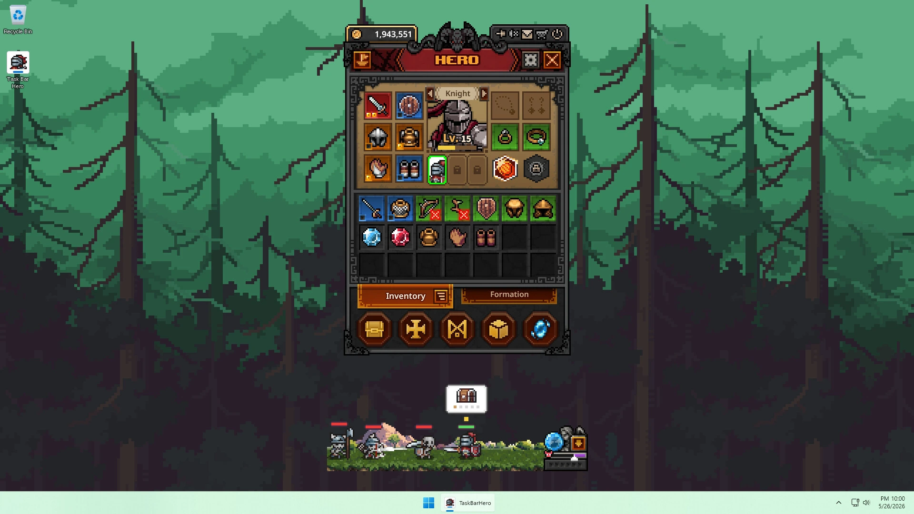
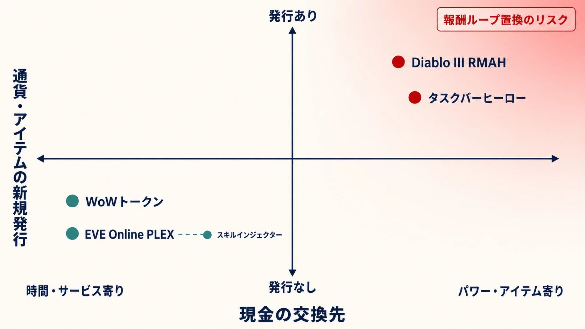

# 運営公認RMTは機能するのか――Diablo III、WoWトークン、EVE Online、タスクバーヒーローに見る「売るもの」の設計

RMT（リアルマネートレード）は、多くのオンラインゲームで禁止対象である。だが、運営自身が取引の入口と市場を管理し、現金とゲーム内の価値を交換できるようにしたらどうなるのか。

本稿が扱うのは、規約外のRMTをなぜ禁じるかではない。その論点は [日本におけるRMTの歴史](rmt-history-japan-why-games-ban-real-money-trading.md) で扱った。また、外部取引を含む経済全体の防御は [ゲーム内経済の設計](in-game-economy-design.md) で扱っている。ここでは逆に、運営が公認の交換経路を用意したとき、 **何を現金と結び付けるか** が報酬ループ、経済、不正対策をどう変えるかを比較する。

先に結論を言えば、現金で買えるものを「ゲームを遊ぶ時間やサービス」にとどめ、ゲーム内通貨との交換をプレイヤー間の移転にする設計は長く続いている。反対に、戦利品や成長を現金で直接買えるようにすると、ゲームの中心だったはずの行為が市場での購入へ置き換わりやすい。ただし、これは万能の法則ではない。2026年に始まった『TBH: Task Bar Hero』（以下、タスクバーヒーロー）は、まさにその境界を運用の中で試している。

***

## 1. 四つの仕組みは、同じ「現金化」ではない

比較の出発点は、「現金が入ったからゲーム内通貨が増える」と短絡しないことである。現金を払っても、運営が新しい金貨やアイテムを生成するとは限らない。誰かが持つ既存の金貨へ、別のプレイヤーの支払った現金の価値を交換するだけなら、金貨の総量は変わらない。

| 事例 | 現金で得る最初のもの | ゲーム内で交換されるもの | 直接買える価値 | 主な論点 |
| --- | --- | --- | --- | --- |
| Diablo III RMAH | 装備・素材などの売買代金 | 戦利品そのもの | 装備の性能 | 報酬ループの置換 |
| WoWトークン | 売却できるトークン | トークンと金貨 | ゲームタイム／Battle.net残高 | 金貨の総量を増やさない |
| EVE Online PLEX | 売却できるPLEX | PLEXとISK | サブスクリプションなどのサービス | 経済の観測と、成長短縮への拡張 |
| タスクバーヒーロー | Steamウォレット残高による取引 | 装備・素材そのもの | 装備・素材の性能 | BOT・チートの採算化 |

WoWトークンとPLEXは、現金を使うプレイヤーが「時間・サービスを受ける権利」を買い、それをゲーム内通貨で欲しいプレイヤーへ渡す。運営はこの取引で新規の金貨やISKを発行しない。対してDiablo IIIのリアルマネーオークションハウス（RMAH）とタスクバーヒーローでは、戦闘・放置プレイの成果である装備や素材そのものが現金に近い価値を持つ。この差が、後で見る不正の誘因と遊びの焦点を分ける。

***

## 2. Diablo III――「敵を倒す」より市場を見るゲームになった

『Diablo III』のRMAHは2012年6月12日に開設された。武器・防具などの装備品は1件あたり1米ドル相当の固定手数料、クラフト素材、宝石、ゴールドなどのスタック可能な品目は売買額の15％を手数料とする仕組みである。現金を支払えば、他人が見つけた装備を即座に買え、売り手は戦利品を現金へ換えられた。[[1](#ref-1)]

*画像出典（引用）：[「いよいよ元の姿へ戻るか？ ディアブロ3 オークションハウス閉鎖」](https://www.inven.co.kr/webzine/news/?news=106342&site=diablo3), Inven。実マネーオークションハウスの金貨取引画面を示す資料として引用。WebP変換。*

この発想には合理性もあった。運営が安全な場を作れば、第三者の取引サイトや詐欺を減らせる。実際、Blizzardがオークションハウスを設計した当初の目的は「便利で安全な取引システム」だった。[[2](#ref-2)]

しかし、アクションRPGで最も大きな報酬は、本来なら敵を倒して自分のビルドに合う戦利品を見つける瞬間である。RMAHでは、必要な装備を探す最短経路がダンジョンではなく市場になる。ドロップは「自分で使う喜び」だけでなく、売れるかどうか、いくらになるかで評価されるようになる。買い手にとっては攻略の壁を現金で越える選択肢になり、売り手にとっては最も収益性の高い周回が目的になりうる。

2013年のGDC講演で、当時のゲームディレクターだったJay Wilsonは、ゴールド用と現金用の二つのオークションハウスがゲームを大きく損ねたと振り返った。利用者の多さにかかわらず、取引がアイテム報酬を傷つけたという趣旨である。[[3](#ref-3)] Blizzardは2013年9月、両オークションハウスを半年後の2014年3月18日に閉鎖すると発表した。公式の説明は明快で、「モンスターを倒して格好いい戦利品を得る」という中核の遊びを最終的に損なった、というものであった。[[2](#ref-2)]

ここで重要なのは、RMAHだけでなくゴールド用オークションハウスも同時に閉鎖された点である。失敗を「現金が不快だった」とだけ捉えると見落とす。問題の根は、装備の獲得が市場での最適化へ寄りすぎ、戦闘と戦利品の結び付きが弱くなったことにある。現金はその置換をいっそう強く、可視的にした。

***

## 3. 同じBlizzardの別解――WoWトークンは金貨を作らない

Blizzardは2015年4月7日、『World of Warcraft』にWoWトークンを導入した。現在の公式サポートの説明に沿って流れを単純化すると、現金を払うプレイヤーがトークンを購入してオークションハウスで金貨へ売り、金貨を持つプレイヤーがそのトークンを買って30日分のゲームタイムまたはBattle.net残高へ交換する。ゲームタイムとは、サブスクリプション型ゲームで月額などの料金を払い、遊べる期間を延長する権利である。現金で購入したトークンは売却専用であり、金貨で買ったトークンはゲームタイムまたはBattle.net残高への交換専用である。[[4](#ref-4)]

この一方向性が設計の要である。金貨を払ってトークンを買う人が得るのは、強い武器やレベルではなくサービス利用の権利である。現金を払う人が得るのは、他のプレイヤーが既に持っていた金貨である。運営が取引の成立に合わせて新しい金貨を発行するわけではないため、トークン自体は金貨のフォーセットにならない。

もちろん、金貨を多く持つことがWoW内の行動を有利にする局面はある。それでも、トークンは「特定の最終装備を現金で買う画面」ではない。現金とゲーム内通貨の交換を、時間・サービスという中間財へ迂回させたのである。RMAH閉鎖から約1年後、同じ会社は「ゲーム内の報酬を売る」のでなく「ゲームを続ける時間を売買できる」形で、外部価値との接点を作り直した。この方式が10年以上継続していることは、設計上の対比として重い。

***

## 4. EVE Online――経済をゲームの中心に置いた先行例

WoWトークンより7年早く、EVE Onlineは2008年にPLEXを導入した。PLEXは当初、現金で購入したゲームタイムをゲーム内で扱える形にしたものであり、プレイヤーはPLEXを市場で売ってISK（ゲーム内通貨）を得るか、自身のサブスクリプションへ使うかを選べた。CCPは後に、PLEXが2008年に導入されたものだと説明している。[[5](#ref-5)]

### 4-1. まず、EVE Onlineはどんなゲームなのか

EVE Onlineは、宇宙船に乗るSF MMOである。しかし、レベルを上げて決められた装備更新を追うゲームとして想像すると本質を外す。同じ持続世界を多くのプレイヤーが共有する単一シャード（単一サーバー）の宇宙で、採掘、製造、輸送、商取引、海賊行為、企業同盟の戦争までが、プレイヤーの行動と市場で結び付いている。CCP自身も、巨大なプレイヤー主導経済と単一サーバーの持続世界をEVEの特徴として説明している。[[6](#ref-6)]

参入障壁も高い。船、モジュール、弾薬には必要スキルがあり、スキルには前提がある。さらにEVEのスキル訓練は経験値を戦闘で稼ぐ方式ではなく、ログアウト中にも現実時間で進む。初心者は、何をしたいかを決め、必要なスキル、船、装備、危険な宙域、プレイヤー組織との関係を同時に学ばなければならない。CCPが新規プレイヤーの離脱理由として「初期に迷った」「進行が遅く感じる」などを認識してきた背景には、この複雑さがある。[[7](#ref-7)]

この複雑さは、経済が飾りではないことの裏返しでもある。艦船を失えば、誰かが採掘した資源、誰かが製造した船やモジュールを買い直す。戦争の損失は産業と物流の需要を生み、価格は次の行動を変える。経済の設計不良は、単に店の価格が不便になる話ではなく、宇宙での選択肢そのものを変える。

*画像出典（引用）：[EVE Portal - Jita PLEX Market](https://www.eveonline.com/news/view/eve-portal-jita-plex-market), EVE Online（CCP Games）。PLEXとISKを取引するJita PLEX Marketの公式告知画像として引用。WebP変換。*

### 4-2. 専属エコノミストを置いた理由

CCPは2007年、経済学の研究者であるEyjólfur Guðmundsson博士を、ゲーム内経済を担当する専属エコノミストとして採用した。四半期ごとの経済レポートを公表し、インフレ、経済成長、価格動向を分析するとした。[[8](#ref-8)]

これは「ゲームに経済学者がいれば成功する」という物語ではない。むしろ、EVEの市場がゲーム体験の中枢であり、通貨量、取引量、資産分布、価格を観測しなければ変更の副作用を読めないという認識の表れである。PLEXは、この観測対象へ現金価値を接続する仕組みだった。

現在のPLEXは、Omega状態へのアップグレード、ゲームタイム、キャラクター移転、スキル抽出器、外見アイテムなどにも使えるため、WoWトークンより用途が広い。だが基本の交換は同じである。現金で買われたPLEXをプレイヤー間市場でISKへ売り、ISKを多く稼いだプレイヤーはPLEXを買ってサブスクリプション等に使える。運営がその市場取引に合わせてISKを発行しないため、PLEXはISK総量を直接増やす手段ではない。[[9](#ref-9)]

### 4-3. スキルインジェクターは、境界を一歩越えた

EVEは2016年、スキル抽出器とスキルインジェクターを導入した。十分に訓練済みのキャラクターから50万スキルポイントを取り出してインジェクターを作り、市場で売る。買ったキャラクターは、インジェクターを消費して未配分スキルポイントを直ちに得られる。受け取る量は既存の訓練量に応じて減るが、ポイントはすぐ配分できる。[[10](#ref-10)]

これはRMAHと完全に同じではない。スキルポイントは別のプレイヤーが既に訓練したものから移され、ISKで買うこともできる。また、船を操作する知識や戦闘判断まで買えるわけではない。それでも、PLEXを現金で買ってISKへ換え、そのISKでインジェクターを買えば、現金は実質的に訓練待ち時間を短縮できる。時間・サービスの交換だったPLEXに、キャラクターの能力へ近づく経路が加わったのである。

このため、PLEXとスキルインジェクターを一つの成功例として無条件にまとめてはいけない。PLEX単体は「遊び続ける権利」とISKを交換する仕組みだが、インジェクターは成長の待ち時間そのものを市場化する。EVEはその危うさを、スキルポイントの供給元、取得量の逓減、経済レポート、長期運用で管理してきた。だが、これはパワーを直接買う方向へ踏み出した、慎重に観測すべき拡張である。

***

## 5. タスクバーヒーロー――放置の戦利品に現金の出口が付いたとき

Nugem StudioとTesseract Studioが開発したタスクバーヒーローは、2026年5月27日にSteamで配信された、タスクバー上の小さなウィンドウでキャラクターが自動戦闘を続ける放置型RPGである。クラス、スキル、ビルド、500種類以上のアイテムを掲げ、獲得したアイテムはSteamコミュニティマーケットで取引可能としている。[[11](#ref-11)]

*画像出典（引用）：[TBH: Task Bar Hero on Steam](https://store.steampowered.com/app/3678970/TBH_Task_Bar_Hero/), Nugem Studio / Tesseract Studio。タスクバー上のゲーム画面、装備画面、自動戦闘を示す公式スクリーンショットとして引用。WebP変換。*

取引の決済に使われるのはSteamウォレット残高であり、利用規約もゲーム内アイテムをSteamコミュニティマーケットで取引できると定める。運営が現金を直接送金する市場ではないが、Steamウォレット残高はSteam上の購入に使える。このため、希少な装備や素材を売ることには、ゲーム外で使える購買力へ近づく意味が生じる。[[12](#ref-12)]

ここで、放置型RPGの性質が強く作用する。通常ならプレイヤーの進行を支える自動周回は、売れる在庫を増やす工程にもなる。チート、マクロ、BOT、脆弱性の悪用でアイテムを増やせば、単なる進行短縮ではなく市場で換えられる価値を作れる。運営の利用規約も、ハック、マクロ、自動プログラム、脆弱性の悪用、異常取引を禁じ、アイテム回収や永久停止を含む措置を定めている。[[12](#ref-12)]

実際にローンチ後の運用は混乱した。開発チームは2026年6月8日、新規アイテムのSteamマーケット出品を一時停止した。既存出品の取消と購入は可能としつつ、過剰なアクセスと不正利用への対応を進めた。その後、6月25日に市場を再開した際は、出品枠を4枠、各枠のクールダウンを8時間とし、最高位の3等級であるCosmic、Divine、Celestialの出品を一時制限した。[[13](#ref-13)]

不正への対処も続いた。同月25日、マーケット再開の告知に合わせて、異常な方法でアイテムを作成・取得した者、違法プログラムやシステムの悪用で不当な利益を得た者として、6,180アカウントへ制裁を行ったと発表している。[[13](#ref-13)] 7月6日には追加で20,406ユーザーへの制裁を告知し、ゲーム利用またはマーケット利用の制限を適用した。[[14](#ref-14)]

こうした強い制裁は副作用も伴った。6月上旬時点で4,700人超が制裁を受けたと報じられた際には、SteamフォーラムやSNSで「不正をしていないのにBANされた」と訴える声が広がった。開発元は同月4日、海外メディアの取材に対し、無作為な処分ではなく具体的な検知記録に基づくものだと説明し、不服とするユーザー向けの申し立て窓口も設けた。[[15](#ref-15)]

この数字だけから、すべてがBOTだった、あるいは市場の問題が不正だけで起きた、と断定することはできない。だが、運営が出品枠、待機時間、取引可能な希少等級、検知と制裁を同時に調整していることは明白である。戦利品の市場価値を保つ設計は、ドロップ率や強さだけでは完成しない。供給経路の監査、異常アイテムの追跡、制裁後の市場安定化までが、ゲームデザインの一部になっている。

***

## 6. 成功と失敗を分けるのは「現金の有無」ではない

四例から導けるのは、運営公認RMTの成否を「現金を使わせるか」で測るべきではない、という設計仮説である。

### 仮説1：売る対象を、報酬の代替物にしない

WoWトークンと初期のPLEXは、現金をゲームタイムやサービスへ交換する。そのトークンをゲーム内通貨で買う人は、主に「現金の代わりにプレイ時間を払う」選択をしている。現金を払う人は、他プレイヤーの既存通貨を受け取る。ゲーム内通貨が増えず、ボスを倒した報酬そのものが店頭に並ぶわけでもない。

Diablo IIIのRMAHは逆であった。装備を直接売買可能にしたことで、敵を倒す行為の価値を市場価格が上書きした。タスクバーヒーローも、装備と素材をSteamマーケットで直接扱うため、この軸では後者に近い。遊びの核が「自分で良い品を引くこと」なら、その品を市場で即座に買える設計は、核を置換する圧力を持つ。

### 仮説2：経済に新しい通貨を流し込まない

WoWトークンとPLEXの市場は、現金を払う人とゲーム内通貨を払う人の間の移転である。運営の収益化とゲーム内通貨の発行を切り離せるため、金貨やISKのインフレ対策を、トークン販売量だけに頼らずに済む。

ただし、通貨総量が増えないことは、価格が安定することと同義ではない。PLEXは需給でISK価格が動き、貯め込まれれば準備資産にも投機対象にもなる。必要なのは「通貨を作らない」という一点ではなく、保有量、取引量、価格、流通速度、プレイヤー層ごとの影響を観測することだ。EVEが経済レポートを重視してきた理由はここにある。

### 仮説3：不正の期待収益を、正常プレイより低くする

アイテムが外部価値に近いものと交換できるなら、チートやBOTは強い装備を得る近道ではなく、販売在庫を作る事業になりうる。タスクバーヒーローの事例は、出品数の上限だけではなく、アイテム生成、取引、決済、制裁、回収のログを一つながりに設計する必要を示す。

設計時に問うべきなのは、「チートを検知できるか」だけではない。異常に増えたアイテムを特定し、二次流通後にも影響範囲を追え、取引停止や回収が正規プレイヤーへ与える損失をどう抑えるかまで決めなければならない。市場を開くことは、経済システムと不正対策システムを同時にリリースすることなのである。

### 仮説4：成長を売るなら、時間だけでなく能力差を測る

EVEのスキルインジェクターは、時間価値を交換するPLEXから一歩進み、成長の待機時間を短縮できるようにした。これは新規プレイヤーの参入障壁を下げうる一方、能力到達の順序と希少性を市場化する。

そのため「現金で直接スキルポイントを買わせていないから安全」とは言えない。プレイヤー間の移転、取得量の逓減、前提スキル、操作知識、失敗時の損失といった緩衝材が、どこまで能力差を抑えているかを測る必要がある。サービス売買とパワー売買の境界は、アイテム名ではなく、そのアイテムがゲーム内でどの到達を早めるかで判断する。

***

## おわりに――タスクバーヒーローは長続きするのか

Diablo IIIは、便利で安全な市場を用意しても、戦利品を得る喜びを市場が置き換えればゲームの中核を守れないことを示した。WoWトークンとPLEXは、現金とゲーム内通貨を結びながら、交換対象を時間・サービスへ寄せ、通貨の新規発行を伴わない設計で長く運用されている。EVEのスキルインジェクターは、その境界が固定ではなく、成長短縮へ踏み出すたびに慎重な観測が必要になることも示した。

タスクバーヒーローは、実アイテムをSteamコミュニティマーケットで直接売買できる設計を、ライブ運用の最初期で試している。出品停止、再開時の枠と等級の制限、大規模な制裁は、単なる初動の不具合対応ではない。希少ドロップを現金に近い価値と接続したとき、報酬ループと不正対策がどこまで一体で機能するかを測る過程である。

この設計は長続きするのか。答えはまだ出ていない。見るべきなのは市場価格だけではない。正規プレイヤーが自分で見つけた装備に喜びを感じ続けられるか。不正な供給が市場を支配しないか。制裁と制限が、遊ぶ人の進行を過度に傷つけないか。運営公認RMTが機能するかどうかは、現金を入れる瞬間ではなく、そこから先にゲームの報酬と信頼を守り続けられるかで決まる。

## References

1. [Diablo III auction house fees, Global Play revealed][1] - RMAHの装備品固定手数料とスタック可能な品目の15％手数料を報じた当時の仕様紹介。

2. [Diablo III Auction House Update][2] - Blizzardによる2013年9月の閉鎖発表。設計目的と2014年3月18日の閉鎖日を示す。

3. [［GDC 2013］「オークションハウスはDiablo IIIに大きなダメージを与えた」][3] - Jay WilsonのGDC 2013講演を報じた記事。

4. [Using a WoW Token][4] - 現金購入トークンの売却、金貨購入トークンのゲームタイム・Battle.net残高への交換、利用制限を説明するBlizzardサポート。

5. [The ETC is Dead, Long Live the PLEX Activation Code!][5] - CCPがPLEXを2008年導入と説明する公式記事。

6. [EVE Online Appoints In-World Economist][6] - 単一シャードの持続世界とプレイヤー主導経済を説明するCCPの発表。

7. [CSM meeting minutes – Iceland, 30th of May to 1st of June 2012][7] - CCPが共有した、新規プレイヤーの初期離脱に関する認識と理由の記録。

8. [EVE Online Appoints In-World Economist][8] - Eyjólfur Guðmundsson博士の採用と四半期経済レポートの方針を示すCCPの発表。

9. [ISK and PLEX][9] - PLEXの現金購入、ISK市場での売買、Omega状態やサービスへの利用を説明するEVE公式サポート。

10. [Patch Notes for February 2016 Release][10] - スキル抽出器・スキルインジェクターの導入、50万ポイントの抽出、即時配分の仕様を示す公式パッチノート。

11. [TBH: Task Bar Hero on Steam][11] - 配信日、開発元、放置型RPGとしての概要、Steamマーケットでのアイテム取引を示すストアページ。

12. [TBH: Task Bar Hero Terms of Service & Privacy Policy][12] - Steamウォレット残高での市場取引、不正なアイテム生成・取引の禁止、制裁・回収の規定。

13. [Steam Market Reopening & Hotfix [Ver 1.00.21]][13] - 6月8日の停止後に行われた市場再開、出品枠、クールダウン、最高位3等級の制限、および6,180アカウントへの制裁を告知する公式投稿。

14. [Additional Sanctions Against Cheating Users][14] - 2026年7月6日の追加制裁とマーケット制限に関するタスクバーヒーロー公式投稿。

15. [『タスクバーヒーロー』4,700人超のチーター制裁も"誤BAN"訴える声が広がる―開発元「ランダムBANではない」と説明][15] - 大規模制裁に伴う誤BAN批判と、開発元Nugem Studioの海外メディアへの説明を報じるGame*Spark記事。

[1]: https://thedailygamepad.net/diablo-iii-auction-house-fees-global-play-revealed/
[2]: https://news.blizzard.com/en-gb/article/10974978/diablo-iii-auction-house-update
[3]: https://www.4gamer.net/games/008/G000817/20130329027/
[4]: https://eu.support.blizzard.com/en/article/000031218
[5]: https://www.eveonline.com/news/view/the-etc-is-dead-long-live-the-plex-activation-code
[6]: https://community.eveonline.com/news/news-channels/press-releases/eve-online-appoints-in-world-economist-1/
[7]: https://web.ccpgamescdn.com/csm/CSM_CCP_Meeting_2012_05_30.pdf
[8]: https://community.eveonline.com/news/news-channels/press-releases/eve-online-appoints-in-world-economist-1/
[9]: https://support.eveonline.com/hc/en-us/articles/14141550499612-ISK-and-PLEX
[10]: https://www.eveonline.com/news/view/patch-notes-for-february-2016-release
[11]: https://store.steampowered.com/app/3678970/TBH_Task_Bar_Hero/
[12]: https://store.steampowered.com/eula/3678970_eula_1
[13]: https://steamcommunity.com/games/3678970/announcements/detail/689761349249532400
[14]: https://steamcommunity.com/games/3678970/announcements/detail/689761349249536485
[15]: https://www.gamespark.jp/article/2026/06/05/167431.html

----

この文書は、Perplexity、Claude、OpenAI Codex の3つのAIの支援を受けて著述されたものです。引用画像を除き、MIT License にて提供されています。
