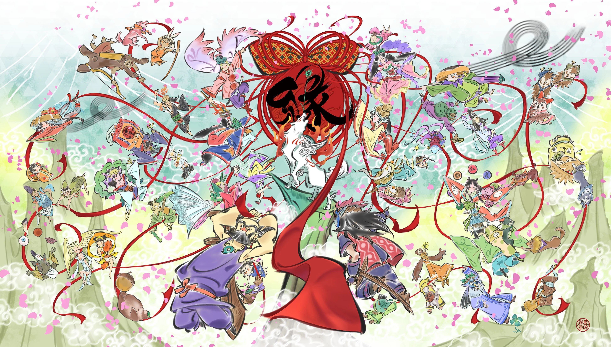
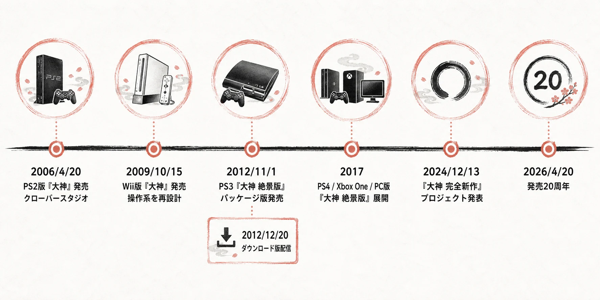
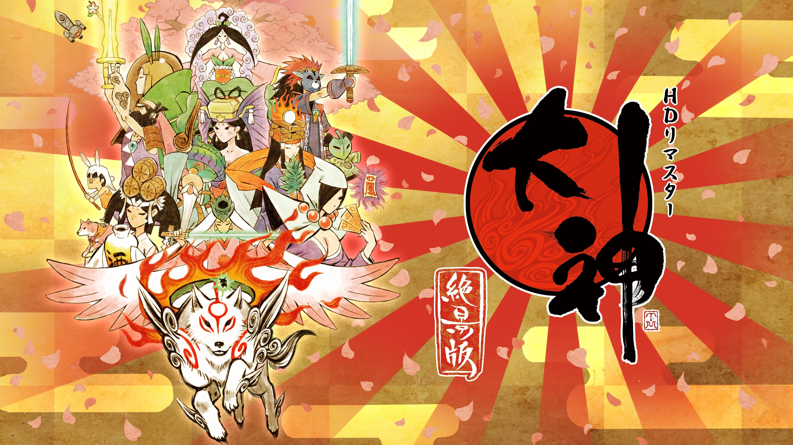
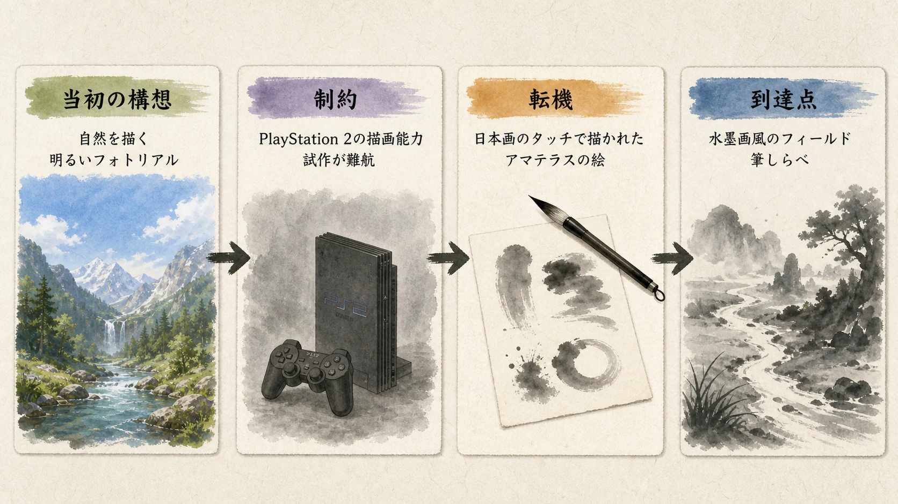
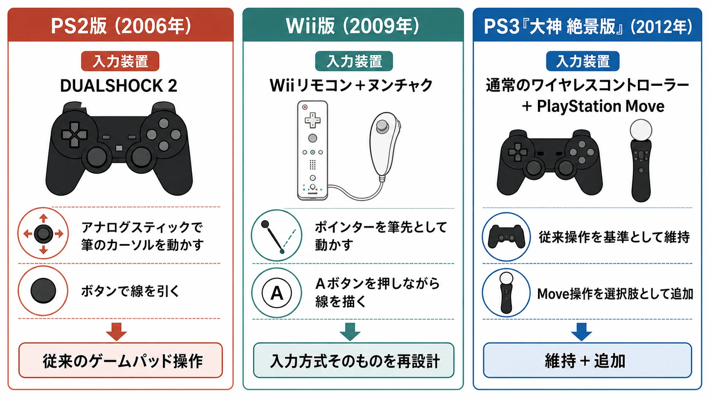
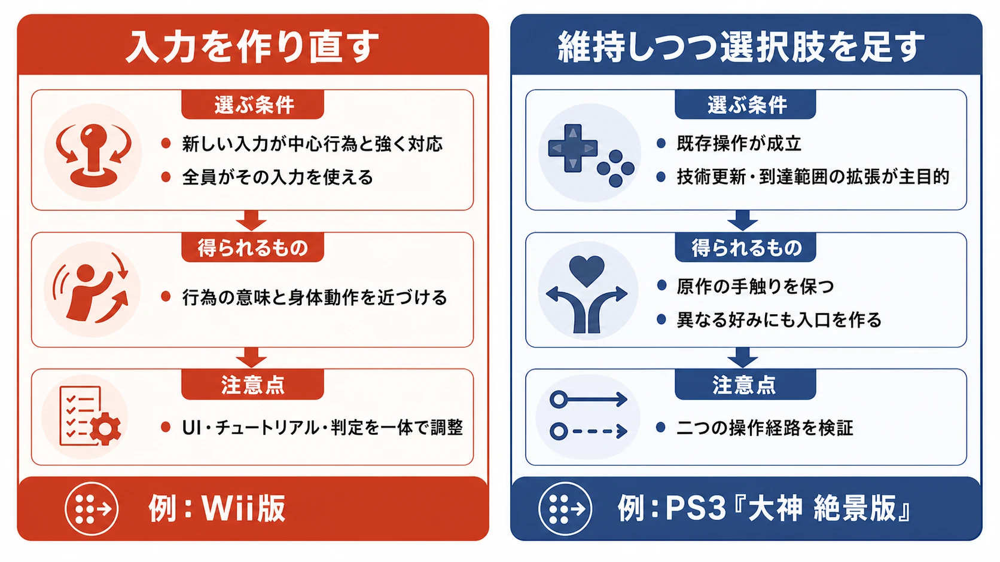

# 『大神』の操作系デザインは、なぜ二度違う形で再解釈されたのか――Wii版とPS3『大神 絶景版』に学ぶコントロール再設計

***

## はじめに：同じ原作を新しいハードへ載せる方法は、一つではない

『大神』は2026年4月20日に発売20周年を迎えた。カプコンは記念特設サイトと記念アートを公開し、4月29日にはBunkamuraオーチャードホールで「大神 20周年記念コンサート 〜大神 音絵巻〜」が開かれた[[1](#ref-1)][[2](#ref-2)]。いま本作を振り返る意義は、美しい水墨画風の絵を懐かしむことだけではない。絵の中に線を引いて奇跡を起こす「筆しらべ」が、ハードの入力装置に合わせて二度、異なる方針で扱い直されたからである。

*画像出典（引用）：カプコン「[祝！ 「大神」シリーズ20周年。記念特設サイトがオープン！](https://prtimes.jp/main/html/rd/p/000005743.000013450.html)」掲載の20周年記念アート（デザイナー・島崎麻里氏描き下ろし）。画像はWebPへ変換。*

本稿は、原作の内容を新規に組み直す話ではない。2009年のWii版は、筆しらべをWiiリモコンのポインティングへ結び直し、入力方式そのものを再設計した。対して2012年のPS3『大神 絶景版』は、従来のコントローラー操作を残しながら、HD化、トロフィー、PlayStation Moveという任意の選択肢を加えた。両者の違いを「何を新しくしたか」ではなく、 **何を不変の核と見なし、入力をどこまで動かしたか** で読む。

***

## 1. 水墨画風の表現は、筆しらべを呼び込むために選ばれた

2006年4月20日にPlayStation 2で発売された『大神』は、クローバースタジオ（Clover Studio）が開発し、神谷英樹がディレクターを務めたアクションアドベンチャーである[[3](#ref-3)][[4](#ref-4)]。主人公アマテラスを操作し、荒廃した地に生命を取り戻していく。その体験の中心にあるのが、画面を絵のように切り取り、線や円を描いて効果を発動する筆しらべである。たとえば枯れ木の枝を囲めば花を咲かせ、対象へ横線を引けば一閃が発動する[[5](#ref-5)]。

*画像出典（引用）：カプコン「[祝！ 「大神」シリーズ20周年。記念特設サイトがオープン！](https://prtimes.jp/main/html/rd/p/000005743.000013450.html)」内「『大神』とは？」掲載画像。画像はWebPへ変換。*

この仕組みは、完成後に水墨画風の画面へ「和風らしい能力」を足したものではない。神谷は後年のインタビューで、開発初期には、同じクローバースタジオ内で三上真司が手掛けていた『バイオハザード』の表現を横目に、「暗い」方向のフォトリアルとは異なる、自然を描く「明るい」方向のフォトリアルを構想していたと語っている。しかしPlayStation 2の描画能力では狙う画作りに届かず、試作は難航した。そこでデザイナーが日本画のタッチで描いたアマテラスの絵を見て、フィールド全体を同じタッチで作る発想へ至ったという[[6](#ref-6)]。

表現上の転換は、操作上の問いも生んだ。画面を紙に見立てるなら、プレイヤーが絵の中へ線を加える行為を、ただのメニュー選択にはできない。水墨画風の画面と筆しらべは、見た目とゲームルールが別々に成立しているのではなく、「絵の中に介入する」という一つの発想の表と裏である。

PlayStation 2版では、DUALSHOCK 2のアナログスティックで筆のカーソルを動かし、ボタンを押して線を引いた。物理的な筆跡ではなく、ゲームパッドでの近似であっても、時間を止めた画面上に自分で軌跡を残すことが重要だった[[7](#ref-7)]。この「筆跡をつくる」という核を保ったまま、後の二作は異なる答えを出す。

### クローバースタジオの解散と、作品を継ぐ体制の変化

原作を生んだクローバースタジオは、2006年10月12日にカプコン取締役会による解散決議が公表された。公表時点の清算結了予定日は2007年3月末日であった[[8](#ref-8)]。実際の清算結了日はこれより早い2007年3月15日で、カプコンの2007年アニュアルレポートは連結決算上もこの日を清算日として扱い、3月16日から3月31日までの重要な取引については財務諸表に必要な調整を加えたと注記している[[9](#ref-9)]。原作チームがそのまま次のハードへ拡張する連続ではなく、以後は別の体制が、完成済みの体験の何を持ち込むかを判断することになる。

***

## 2. Wii版：入力装置を中心に、体験への入口を組み替える

2009年10月15日、カプコンはWii版『大神』を発売した。任天堂のソフト情報は、対応コントローラーをWiiリモコン＋ヌンチャクとし、開発をReady at Dawn Studios LLCが担ったと明記する[[5](#ref-5)]。これは、既存のボタン配置をWiiのコントローラーへ置き換えるだけの仕事ではない。

Wii版でアマテラスの移動はヌンチャクのアナログスティックが受け持つ。一方、筆しらべではZボタンで画面を切り替え、Wiiリモコンのポインターを筆先として動かし、Aボタンを押して線を描く。移動と描画に、異なる手の役割を割り当てたのである[[10](#ref-10)]。

ここで変わるのは精度だけではない。PlayStation 2版では、左スティックを倒す量と方向を、画面上の筆の動きへ読み替える必要があった。Wii版ではプレイヤーが画面へ向けた手の位置が、そのまま筆先の位置として見える。円を描く、一直線を引く、離れた二点をつなぐといった筆しらべの要求が、身体の小さな軌跡と対応しやすくなる。

この対応は、すべての操作を体感型にすることとは異なる。走る、跳ぶ、攻撃するといった継続的なアクションをヌンチャクとボタンで安定して扱い、絵を描くという限定された行為だけをポインティングへ渡した。つまりWii版は、ハードの特色を全体へ一律に被せるのではなく、原作の中で最も入力と意味が密着している箇所を選び、そこを作り直したのである。

| 設計対象 | PlayStation 2版 | Wii版 | Wii版で変えた意味 |
| --- | --- | --- | --- |
| アマテラスの移動 | アナログスティック | ヌンチャクのアナログスティック | 連続移動の安定性を維持する |
| 筆しらべの筆先 | スティックでカーソルを動かす | Wiiリモコンで画面を指す | 線を引く身体動作を画面上の筆跡へ近づける |
| 筆跡の確定 | ボタン入力 | Aボタンを押しながらリモコンを動かす | 誤入力を抑えつつ描画感を保つ |

「直感的」という言葉だけでは、設計の中身は見えにくい。Wii版の本質は、筆しらべという原作の意味論を、Wiiリモコンの得意な空間指定へ移し替えたことにある。入力方式の変更が許されるのは、操作の形を変えても、「絵の中に筆跡を入れて世界へ作用する」という因果をむしろ明瞭にできると判断したからだ。

***

## 3. PS3『大神 絶景版』：基準の操作を残し、選択肢として追加する

PS3『大神 絶景版』のパッケージ版は2012年11月1日に発売され、ダウンロード版は同年12月20日に配信された[[11](#ref-11)][[12](#ref-12)]。本作はPlayStation 2版を1080p対応のHD画質へ高精細化し、トロフィー機能にも対応した作品である[[11](#ref-11)]。

ここで重要なのは、PlayStation Moveへの対応が、Wii版のように唯一の操作経路にはならなかったことである。筆しらべはMoveでより直接的に操作できる一方、通常のワイヤレスコントローラーでも遊べる。カプコンのサポート情報も、ワイヤレスコントローラーとモーションコントローラーの双方への対応、トロフィー機能、1080pを含む映像出力を記載している[[13](#ref-13)]。

PS3版は、アナログスティックを使う従来の操作を基準として維持し、Moveを「筆しらべを別の感触で扱いたいプレイヤー」の選択肢にした。これは消極的な折衷ではない。HD化の目的は、原作のゲーム進行と既存の手触りを保ちながら、表示とプラットフォーム機能を強化することにある。Moveを必須にすれば、筆しらべは直接的になる反面、従来のコントローラーで遊ぶ入口を閉じ、操作経験の基準まで変えることになる。

| 設計対象 | Wii版 | PS3『大神 絶景版』 |
| --- | --- | --- |
| 操作方式の位置づけ | Wiiリモコン＋ヌンチャクを前提に組み替える | 通常コントローラーを残し、Moveを選択肢として加える |
| 筆しらべの狙い | 画面へのポインティングで、描画の直接性を高める | 従来操作を保ちつつ、好みによりモーション操作を選べる |
| 作品全体への介入 | 入力の対応関係を再設計する | 解像度・トロフィーなど技術面を強化し、入力の選択肢を増やす |

同じ「筆しらべを動かしやすくする」取り組みでも、前提が違う。Wii版は、新しい入力装置を体験の入口に据えるための再設計である。PS3版は、既存の入口を維持するために、モーション操作を追加的な経路に留める技術強化である。

***

## 4. プランナーが比較すべきは、変更多寡ではなく「誰のための基準操作か」である

移植時の操作設計では、「新しいハードの機能を使うべきか」という問いを先に置きがちである。しかし『大神』の二例が示すのは、先に決めるべき問いが別にあることだ。 **この作品の基準となる操作経験を、どのプレイヤーに、どの入力装置で届けるのか。**

Wii版のような作り直しが向くのは、新しい入力装置が原作の中心行為をより素直に表現でき、かつその装置を全プレイヤーの前提にできる場合である。操作を一つへ絞れるため、チュートリアル、UIの指示、失敗時のフィードバック、難度調整も、その入力方式に合わせて統一できる。Ready at Dawn Studiosが担ったWii版では、筆しらべをポインティングへ翻訳する判断が、移植全体の中心になった。

PS3『大神 絶景版』のような維持＋追加が向くのは、原作の操作がすでに機能しており、技術面の更新と対応ハードでの可用性を主目的にする場合である。追加操作を選べるようにするなら、プランナーは二つの経路を「同じ意図を、異なる手段で達成できる」状態に保たなければならない。モーション操作の方が有利すぎれば標準コントローラーが劣化版になり、逆に使いにくければ選択肢を置く意味が薄れる。

選択は、ハードの性能だけでは決まらない。原作の操作をどこまで再現できるか、追加入力を必須にしてよい市場・同梱状況か、操作経路を複数検証する体制があるか、そして移植の目的が「新しい入口の構築」なのか「既存体験の到達範囲を広げること」なのかで決まる。

| 戦略 | 選ぶ条件 | 得られるもの | 主な注意点 |
| --- | --- | --- | --- |
| 入力を作り直す | 新しい入力が中心行為と強く対応し、全員がその入力を使える | 行為の意味と身体動作を近づけられる | 操作だけでなく、UI・チュートリアル・判定も一体で調整する |
| 維持しつつ選択肢を足す | 既存操作が成立しており、技術更新や到達範囲の拡張が主目的 | 原作の手触りを保ち、異なる好みにも入口を作れる | 二つの操作経路が一方的に不利にならないよう検証する |

***

## おわりに：続編へ渡すべきものは、ボタン配置ではなく因果である

『大神』の20年は、同じ原作が新しいハードに載るとき、操作を変えるか、残すかという二択で終わらないことを示している。Wii版は筆しらべの入力方式を本質的に作り直し、PS3『大神 絶景版』は従来操作を維持したまま、HD化と任意のMove操作を重ねた。どちらも筆しらべを捨てず、しかし「筆で線を引く」行為をどの入力から受け取るかについては、異なる戦略を採った。

2024年12月には、神谷をディレクターに迎える『大神 完全新作』プロジェクトが発表された。クローバーズ株式会社、株式会社マシンヘッドワークス、株式会社エムツーの共同開発である[[4](#ref-4)]。続編がどの入力装置を選ぶかはまだ公表されていない。それでも過去の二つの再解釈は、次の企画で問うべき基準を残している。新しいハードの機能を採るかどうかではなく、その機能によってプレイヤーが作品の中で行う因果――線を引き、世界に働きかける感覚――を、より明瞭にできるかである。

## References

1. [祝！ 「大神」シリーズ20周年。記念特設サイトがオープン！][1] - カプコンによる20周年到達日、記念特設サイト、記念アートと企画の告知を確認した。

2. [大神 20周年記念コンサート 〜大神 音絵巻〜][2] - 2026年4月29日の記念コンサート開催日と会場を確認した。

3. [Capcom’s Okami and Monster Hunter Freedom Development Teams receive top honors at CEDEC AWARDS][3] - PlayStation 2版『大神』の発売日を確認した。神谷英樹の原作での役割は資料4で確認した。

4. [この世の命が、蘇る。『大神 完全新作』プロジェクトが始動！][4] - 神谷英樹が2006年『大神』のディレクションを担ったこと、2024年の正式続編プロジェクト発表、続編での神谷英樹のディレクター就任、クローバーズ株式会社・株式会社マシンヘッドワークス・株式会社エムツーによる共同開発を確認した。本稿の「株式会社エムツー」は、クラシックタイトルの移植・復刻を手がける有限会社エムツーとは別法人である[[14](#ref-14)]。

5. [大神][5] - 筆しらべの公式説明と桜花・一閃の操作例、Wii版の発売日・発売元カプコン・Wiiリモコン＋ヌンチャク専用・Ready at Dawn Studiosによる開発を確認した。

6. [『大神』の続編は、いつかはやりたい―神谷英樹が語る傑作誕生秘話と“やり残したこと”][6] - 神谷英樹の直接の回想として、初期のフォトリアル志向、PlayStation 2の描画上の制約、日本画風アマテラスの絵からの転換を確認した。

7. [『大神』20年を回顧：その輝きはなぜ強いのか？色褪せない鮮やかさ、その秘訣を探る][7] - PlayStation 2版でアナログスティックにより筆しらべの線を描いたことを確認した。

8. [当社子会社の解散および清算に関するお知らせ][8] - Clover Studioの解散決議日と、当時公表された清算結了予定日を確認した。

9. [Annual Report 2007][9] - Clover Studioの実際の清算日が2007年3月15日であったこと、3月16日から31日までの取引について財務諸表に必要な調整を加えたと注記していることを確認した。

10. [Wiiゲームファーストインプレッション「大神（おおかみ）」][10] - Wii版におけるヌンチャクでの移動、Wiiリモコンのポインターを筆先にする筆しらべの具体的な操作を確認した。

11. [カプコン、PS3「大神 絶景版」、PS2版をHDリマスターし登場。PS Moveでの操作やトロフィー機能に対応][11] - パッケージ版の発売日、1080p対応、HD化、PlayStation Moveと通常コントローラーの併用を確認した。

12. [「大神 絶景版」ダウンロード版が12月20日に発売。HD画質でリマスターされた名作を手頃な価格で楽しむチャンス][12] - ダウンロード版の2012年12月20日配信を確認した。

13. [よくあるご質問 大神 絶景版(PlayStation 3)][13] - PlayStation 3版のワイヤレスコントローラーとモーションコントローラー対応、映像出力、トロフィー対応を確認した。

14. [企業情報 \| 有限会社エムツー \| M2 Co., Ltd.][14] - 有限会社エムツーの法人名と、クラシックタイトルの移植・復刻を含む開発実績を確認した。

[1]: https://prtimes.jp/main/html/rd/p/000005743.000013450.html
[2]: https://www.bunkamura.co.jp/orchard/lineup/kashi/20260429.html
[3]: https://www.capcom.co.jp/ir/english/news/html/e090903.html
[4]: https://prtimes.jp/main/html/rd/p/000004774.000013450.html
[5]: https://www.nintendo.co.jp/wii/software/rowj/index.html
[6]: https://www.gamespark.jp/article/2021/11/05/113324.html
[7]: https://www.gamespark.jp/article/2026/05/17/166522.html
[8]: https://www.capcom.co.jp/ir/news/pdf/061012a.pdf
[9]: https://www.capcom.co.jp/ir/english/data/pdf/2007annual/Annual2007e.pdf
[10]: https://game.watch.impress.co.jp/docs/review/321372.html
[11]: https://game.watch.impress.co.jp/docs/news/541657.html
[12]: https://www.4gamer.net/games/171/G017124/20121217004/
[13]: https://www.capcom.co.jp/support/faq/full_platform_ps3_o-kami_zekkei.html
[14]: https://www.mtwo.co.jp/corp-profile/

----

この文書は、Perplexity、Claude、OpenAI Codex の3つのAIの支援を受けて著述されたものです。引用画像を除き、MIT License にて提供されています。
