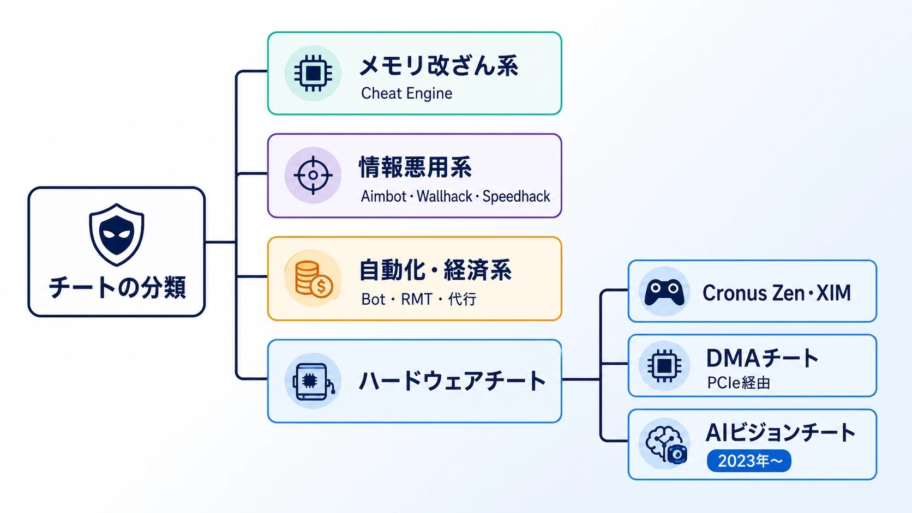
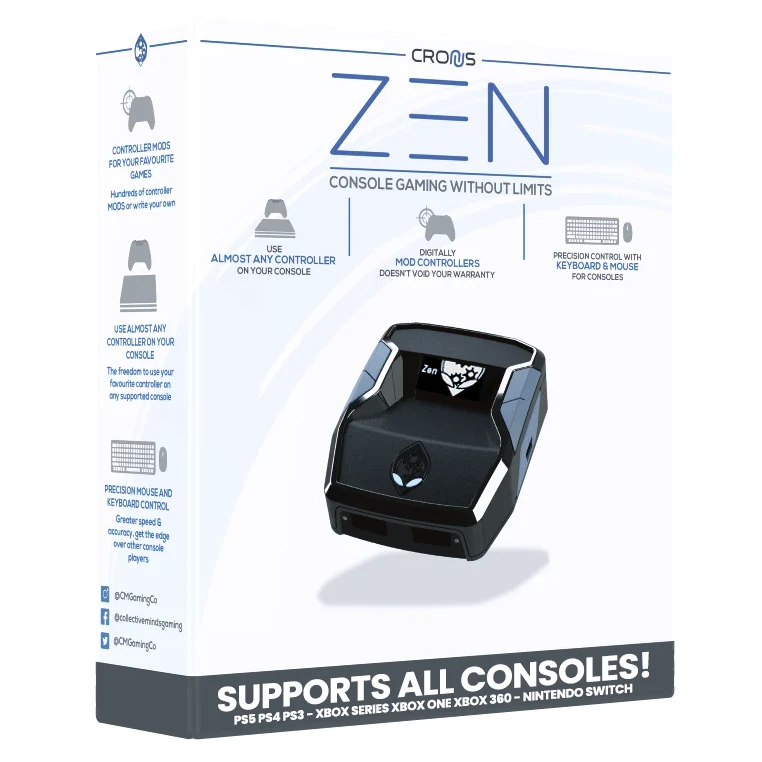
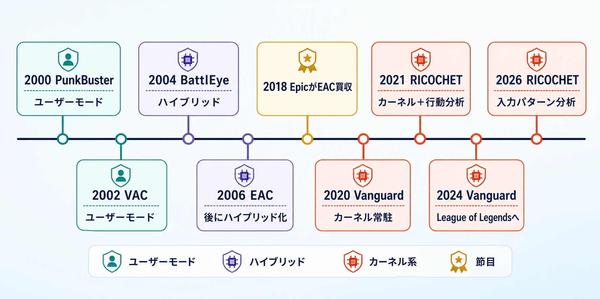
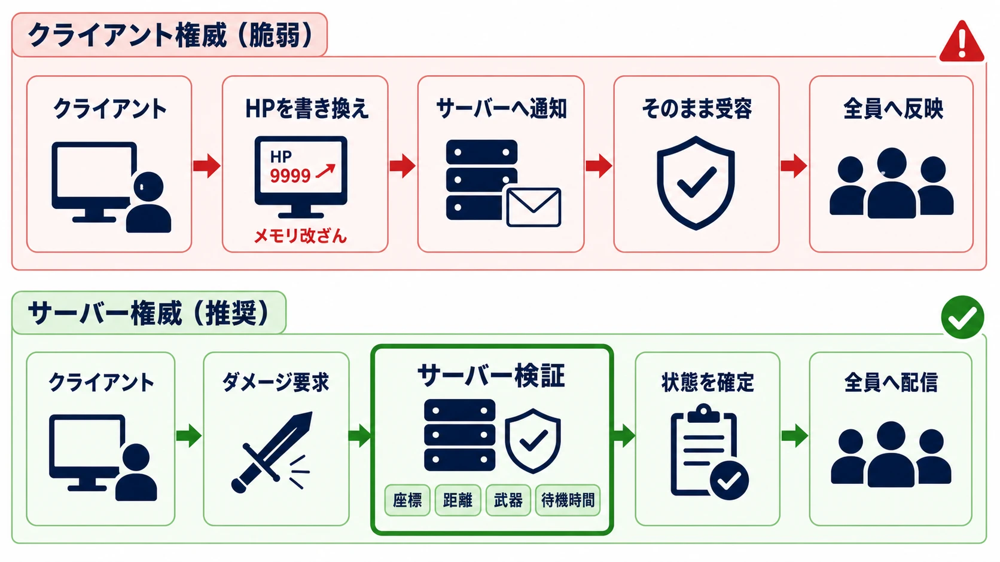
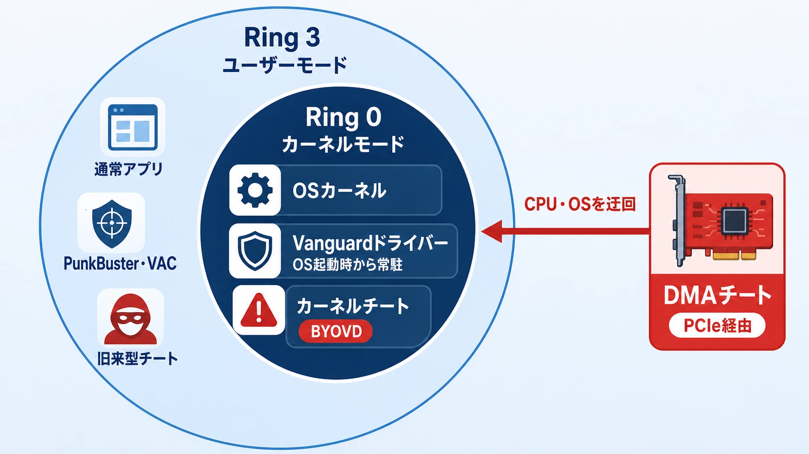
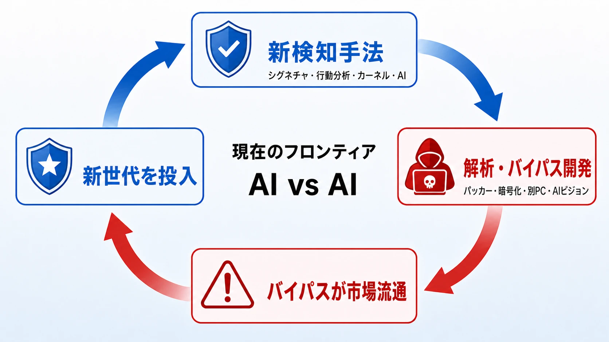
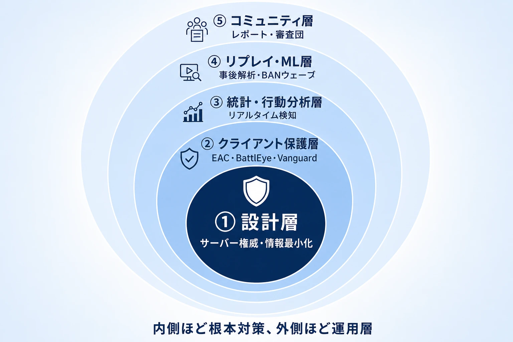

# オンラインゲームのアンチチート技術：歴史・現状・開発者の判断軸

> **注意：** 本記事は、チート対策を検討するためにチートの手法や技術を紹介するものであり、チート行為を推奨・助長するものではありません。チート行為はほぼすべてのゲームで利用規約違反となり、手法や利用状況によっては法令に抵触する可能性もあります。

## エグゼクティブサマリー

対戦・オンラインゲームにおけるチートとアンチチートの攻防は、1990年代後半から現在まで30年近く続く「いたちごっこ」の歴史である。技術の進化はチート側とアンチチート側の双方で起き、その構図は今日もなお変わらない。本レポートでは、チートの種類・検知技術の系譜・カーネルレベルアンチチートの議論・機械学習の活用・BAN運用まで、ゲームプランナーが知るべき論点を網羅的に整理する。

***

## 1. チートの分類学

### 1.1 メモリ改ざん系

最も古典的なチートである。ゲームプロセスのメモリ空間に直接アクセスし、HP・弾薬・スコアなどの値を書き換える。Cheat Engine（Windows）やScanmem（Linux）といったツールがその代表で、プロセスの仮想アドレスを特定して任意の値を注入する仕組みは、1990年代から本質的に変わっていない。サーバー側が同値を正規のものとして受け取る設計になっている場合に絶大な効果を発揮するが、サーバー権威設計によって根本から無効化できる。[[1](#ref-1)][[2](#ref-2)][[3](#ref-3)]

### 1.2 Aimbot / Wallhack / Speedhack

**Aimbot** は、敵のポジション情報をメモリやパケットから取得し、マウス操作を自動補正する。1990年代後半、Quake / QuakeWorld 向けにkl33n3xなどの初期aimbotツールが登場し、パケット傍受で敵位置を取得して照準を自動補正する設計が確立された。 **Wallhack**（透視チート）はクライアントに届いているが本来非表示にすべき敵座標データを可視化するもので、エンティティリストへのアクセスや、ビュー行列（4×4マトリクス）を用いたオーバーレイ描画によって実現される。 **Speedhack** はゲームのタイマーや物理演算のクロックを操作し、移動速度や攻撃速度を加速する。サーバー側で速度の上限をバリデーションすることで対処が可能だが、ゲームの設計によっては実装コストが高い。[[4](#ref-4)][[5](#ref-5)][[6](#ref-6)]

### 1.3 Bot・RMT・代行

**Bot** はゲーム操作を自動化するスクリプトで、MMORPGでの資源採集・レベリングから、FPSの自動射撃まで幅広い。 **RMT（リアルマネートレード）** はゲーム内通貨・アイテムを現実の金銭で売買する行為で、多くのタイトルが規約で禁止する。上流のBot業者が大量のアカウントを自動運用し、下流の代行業者やRMT業者へ流す産業チェーンが存在する。近年は中国当局の介入もあり、決済にBitcoin・USDTなど仮想通貨が使われ資金追跡を困難にしている。[[7](#ref-7)][[8](#ref-8)]

### 1.4 ハードウェアチート

#### Cronus Zen / XIM系デバイス

コントローラーとゲーム機の間に挟むコンバーターで、リコイルスクリプト（反動制御マクロ）や自動射撃を実行する。ソフトウェアアンチチートを経由しないため従来の検知が困難だった。2026年2月、Call of DutyのRICOCHETアンチチートがBlack Ops 7 Season 2のランクプレイ導入に合わせて、ハードウェアの識別ではなく「入力パターン分析」によって検知を開始した。Season 04（2026年6月）の公式報告では、これらのデバイス使用で一時BANされたプレイヤーのほぼ3分の2が、復帰後にデバイスを再使用していないことが報告されている。[[9](#ref-9)][[10](#ref-10)]

画像出典：[The Cronus Shop「CRONUS ZEN」](https://cronus.shop/products/cronus-zen)（Collective Minds）

#### DMAチート（Direct Memory Access）

近年最も危険視されるハードウェアチートである。PCIeスロットに挿入したカスタムカードが、CPU・OSを介さずに直接メモリを読み書きすることでゲームデータを取得する。カーネルレベルのアンチチートドライバーでさえもCPUを経由しない読み取りを検知できないため、アンチチート側はPCIeデバイスのIDスキャンや異常なI/Oパターンの検出で対応しているが、DMAカードのIDスプーフィング（偽装）によって回避されるケースも多い。[[11](#ref-11)][[12](#ref-12)]

#### AIビジョンチート（画面読み取り型）

2023年頃から登場した新世代チートで、OBSなどの合法的なキャプチャソフトで画面を取得し、コンピュータビジョン（AIモデル）でリアルタイムに敵を検出し、人間の操作を模倣しながら照準補助を行う。ゲームメモリに一切触れないため、シグネチャベースのアンチチートは無力化される。アンチチート側はこれに対しAIによる行動分析で対抗しており、「AI対AI」の構図が生まれている。現在のチート市場では、このレベルの装備を整えるために別PC・外部ハードウェア・月額数ドルから数百ドル規模の費用が必要になり、参入コストが大幅に上昇している。[[6](#ref-6)][[13](#ref-13)]

***

## 2. クライアント側検知の系譜

### 2.1 PunkBuster（2000年〜）：シグネチャ検知の夜明け

2000年9月、Even Balance社がHalf-Life向けに初のベータを公開したPunkBusterは（最初に商用統合されたタイトルは2001年のid Software製Return to Castle Wolfenstein）、商業的アンチチートの先駆けである。アンチウイルスと同様の **シグネチャスキャン** 手法、すなわちメモリ内の既知チートパターンとのマッチングを核とした。Battlefield、Medal of Honor、Call of Dutyなど2000年代の主要タイトルで採用され、2013年頃まで業界標準として機能した。[[14](#ref-14)][[15](#ref-15)][[16](#ref-16)]

弱点は「知っているものしか検知できない」点にあった。チート開発者はシグネチャをランダム化・暗号化することで容易に回避できた。サーバー管理者がPunkBusterに問い合わせてBANリストを更新する仕組みは、新チートへの対応を必然的に遅らせた。[[16](#ref-16)]

### 2.2 VAC（Valve Anti-Cheat）（2002年〜）：遅延BANによる心理戦

Valveが2002年にCounter-Strike向けにリリースしたVACは、シグネチャスキャンを基本としつつも **遅延BAN** という独自の戦略を採用した。チートを検知しても即座にBANせず、数日〜数週間後に一斉に発動する。これによりチート開発者が「どの行為が検知されたか」を特定しにくくなる。VACのBANはアカウント単位で恒久的かつ非交渉、Steam上で公開される。スキャンパケットを定期的に送信し、適切な応答が返らない場合に違反フラグを立てる設計だが、カーネルレベルのアクセスなしにユーザーモードで動作するため、洗練されたチートへの検知力には限界がある。[[17](#ref-17)][[18](#ref-18)][[3](#ref-3)][[19](#ref-19)]

### 2.3 BattlEye（2004年〜）：プロアクティブなカーネル統合

PunkBusterと同様、サードパーティアンチチートとしてスタートし、2004年にBattlefield Vietnam向けに登場したBattlEyeは、クライアント・サーバー双方に常駐し、**ゲームのネットワークトラフィック経由でバックエンドと通信する** 設計が特徴である。「完全プロアクティブなカーネルベース保護システム」を自称し、DLL注入・直接メモリ編集・外部アタッチを起動時にブロックする保護レイヤーを実装している。バックエンドが動的にスキャン内容をコントロールし変更するため、チーターが特定クライアントファイルに対する永続的なバイパスを開発することが困難になっている。PUBG・Arma 3・Destiny 2・War Thunderなど多数のタイトルで採用されている。[[20](#ref-20)][[21](#ref-21)][[22](#ref-22)]

### 2.4 Easy Anti-Cheat（EAC）（2006年〜）：普及と課題

EACのオリジナルは2006年にCounter-Strike 1.6向けにフィンランドの開発者2名によってリリースされ、2013年にEasyAntiCheat社として法人化、2017年にKamuへ社名変更を経て、2018年10月にEpic GamesがKamuを買収した。買収後はEpic Online Services（EOS）に統合され、Fortniteをはじめ多数のタイトルで利用されている。LinuxのProton経由で一部動作するため、Steam Deckユーザーへの対応面でBattlEyeと並んで代表的な選択肢となっている。一方で、EACのカーネルドライバーがWindowsのHardware-Enforced Stack Protectionなどのセキュリティ機能と競合するケースも報告されており、偽陽性BANの申請窓口がゲームデベロッパーではなくEAC本社になる点がサポート上の摩擦を生んでいる。EACとBattlEyeはいずれもユーザーモードベースに一部カーネル監視を組み合わせるハイブリッド型アーキテクチャを採用している。[[23](#ref-23)][[22](#ref-22)][[24](#ref-24)]

### 2.5 各アンチチートの比較

| アンチチート | 初期リリース | 動作レベル | 常駐タイミング | 主な採用タイトル | Linux対応 |
|---|---|---|---|---|---|
| PunkBuster | 2000 | ユーザーモード | ゲーム起動時 | Battlefield 4, CoD (旧作) | 限定的 |
| VAC | 2002 | ユーザーモード | Steam起動時 | CS2, DOTA 2, TF2 | Steam経由 |
| BattlEye | 2004 | ハイブリッド | ゲーム起動時 | PUBG, Arma 3, Destiny 2 | Proton対応 |
| Easy Anti-Cheat | 2006 | ハイブリッド | ゲーム起動時 | Fortnite, Apex Legends | Proton対応 |
| Vanguard (Riot) | 2020 | カーネル常駐型 | OS起動時（常時） | VALORANT, League of Legends | 非対応 |
| RICOCHET (Activision) | 2021 | カーネル+行動分析 | ゲーム起動時 | Call of Duty (BO6, Warzone) | 部分的 |

***

## 3. サーバー権威・整合性チェック・リプレイ解析

### 3.1 サーバー権威設計（Server Authority）

アンチチートを語る前に、最重要の設計原則として **サーバー権威** がある。「HPはクライアントが管理する」設計にすると、どれだけ優れたクライアント側アンチチートを導入しても、ゲームモードの無効化（God Mode）を防ぎきれない。サーバー権威設計ではクライアントはリクエストを送るだけで、全ての状態変化はサーバーが検証・決定する。移動でさえ、クライアントが先行して動きつつサーバーが検証・却下するラグ補償付き権威設計が可能である。これがアンチチートの「根本対策」であり、クライアントアンチチートは補助手段と位置付けるべきである。[[3](#ref-3)]

### 3.2 情報の最小化（Interest Management）

Wallhackを根本的に無効化するアプローチとして、 **クライアントに不必要な情報を送らない** 設計がある。例えば、視野角・障害物のレイキャストを使って「そのプレイヤーが視認できる敵」の情報だけをパケットに乗せる。これにより、メモリを読み取っても意味のある敵座標データが存在しない状態を作れる。ただし実装コストとネットワーク負荷が増加するため、ゲームの規模・ジャンルに応じた判断が必要になる。[[3](#ref-3)]

### 3.3 リプレイ解析と行動ログ

ゲームセッション終了後にリプレイデータをサーバーに送信し、フレーム精度の行動ログをオフラインで解析する手法が普及している。Call of DutyのRICOCHETはこの手法にMLを組み合わせており、「AIがリプレイを解析して不審なプレイを識別し、人間が検証してBANを確定する」ワークフローを採用している。Tencent ACE（Anti-Cheat Expert）も同様に、DMAチートによるWallhackをリプレイ+ビッグデータ解析で検出している。リアルタイムでは検知できない超人的な精度の蓄積パターンが、後処理で浮かび上がることが多い。[[25](#ref-25)][[12](#ref-12)][[26](#ref-26)]

### 3.4 統計的外れ値検知

サーバー側アンチチートの代表的アプローチは、 **ヘッドショット率・キル数・反応速度などをプレイヤー集団の分布と比較し、外れ値を自動フラグ立て** することである。FairFightなどのサーバー側ソリューションが「HackPoints」システムを実装し、複数の統計指標が基準を超えた場合に段階的な対処を行う。弱点は「非常に上手いプレイヤー」と「チーター」の境界が曖昧なことで、偽陽性（FP）リスクが高い。新しい武器追加などゲームバランス変化のたびに閾値の再調整が必要になる。[[27](#ref-27)]

***

## 4. カーネルレベルアンチチートとその是非

### 4.1 なぜカーネルが必要か

Windows OSはCPUの保護リング構造を持つ。通常のアプリケーションはRing 3（ユーザーモード）、OSカーネルはRing 0で動作する。ユーザーモードのアンチチートは、カーネルモードで動作するチートに対して「見えない」状態になる。BYOVD（Bring Your Own Vulnerable Driver）攻撃のように、署名済みの脆弱なドライバーを悪用してRing 0アクセスを得るチートが出現したことで、アンチチート側もカーネルへの移行を余儀なくされた。[[28](#ref-28)]

### 4.2 Riot Vanguardの設計と効果

RiotがVALORANT向けに2020年に導入したVanguardは、 **OS起動時からカーネルドライバーが常駐し、ゲーム起動前から有効** になる最も強力な実装の代表例である。3コンポーネント構成（クライアント／ドライバー／プラットフォーム）で、ドライバーがメモリ・システム状態をバリデーション、クライアントは実プレイ中の検知を担う。2024年にLeague of Legendsへ導入したところ、 **スクリプター率が4年ぶりに1%を下回り、175,000アカウントをBANした**。偽陽性率は10,000件に1件以下（<0.01%）と報告されている。[[29](#ref-29)][[30](#ref-30)][[31](#ref-31)]

### 4.3 プライバシー・安全性・セキュリティへの懸念

カーネル常駐型には以下の正当な懸念がある：[[32](#ref-32)][[33](#ref-33)][[29](#ref-29)]

- **「ユーザー自身より高い権限」** でコンピューターを監視し、ユーザーが知らない操作が技術的に可能[[32](#ref-32)]
- VanguardはゲームをしていないときもOS起動から常時稼働し、無効化するにはOS再起動が必要[[29](#ref-29)]
- TencentによるRiot Game買収の文脈で、データがTencent（中国企業）へ送信されるのではという懸念[[33](#ref-33)]
- BYOVD攻撃に対してカーネルドライバー自体が攻撃ベクターになるリスク[[28](#ref-28)]
- ドライバーのバグによるBSoD（ブルースクリーン）・システム不安定化のリスク
- Linux / Steam Deckで動作しないため、プラットフォームのエコシステムを分断する[[22](#ref-22)]

Riotの公式見解では「ドライバーは個人情報を収集・送信しない」「MicrosoftのEV証明書による署名済み」と説明しているが、研究者やセキュリティ意識の高いユーザーからの批判は続いている。学術的なレビューでは、カーネルレベルドライバーが「最大限の観測能力と積極的防衛力を提供する」と認めつつも、利用者全員に高いリスクを負わせる設計であることを指摘している。[[30](#ref-30)][[34](#ref-34)][[35](#ref-35)]

***

## コラム：SMM／UEFIファームウェアチートという次の脅威

カーネルレベルアンチチートが動作するRing 0よりも、さらに深い領域として **SMM（System Management Mode）** がある。SMMは俗に「Ring -2」と呼ばれ、OSやハイパーバイザーから独立して動作し、システムメモリやデバイスへアクセスできる。ここにチートを組み込めば、OS上のアンチチートから見えにくい状態でゲームメモリの読み取りや操作を行える可能性がある。[[49](#ref-49)][[50](#ref-50)]

その可能性を実証した公開プロジェクトが、SMM向けゲームチートフレームワーク「Plouton」である。作者は概念実証（PoC）と位置付けているが、CS2でのデモに加え、UEFIモジュールをマザーボードのファームウェアイメージへ組み込み、外部SPIプログラマーで書き込む手順まで公開している。これは、UEFIに常駐するチートが単なる思考実験ではなく、技術的には構築可能であることを示している。[[49](#ref-49)]

ただし、2026年時点で公に検証できる範囲では、この方式が広く実戦投入されていることや、商用チートとして流通していることを示す確かな証拠は確認できない。導入にはマザーボードごとの解析、ファームウェアの改変、書き込み失敗による起動不能のリスクがあり、現在主流のDMAチートよりもはるかに高い技術とコストを要する。したがって、現状は「一般的なチート手法」ではなく、 **将来の脅威を示す先行事例** と捉えるのが妥当である。

一方、Riot Gamesが2025年に公表した事例では、複数メーカーのUEFI実装におけるIOMMU初期化不備が、DMA機器によるOS起動前のコード注入に悪用され得ることが確認された。これはUEFI常駐チートそのものではないが、アンチチートの防衛線がすでにOSやカーネルの内側だけで完結せず、起動直後のファームウェアまで広がっていることを示している。[[51](#ref-51)][[52](#ref-52)]

ゲームプランナーにとって重要なのは、SMMチートの実装方法を知ることではない。将来、Secure Boot・TPM・IOMMU・対応BIOSなどが競技ゲームの動作要件となり、古いPCの切り捨て、BIOS更新の案内、起動不能時のサポート、誤検知への救済までがゲーム仕様の一部になり得ることである。同時に、クライアント側の防御がどれほど深い層へ進んでも完全ではないため、サーバー権威・行動分析・リプレイ検証を組み合わせる設計の重要性は変わらない。

***

## 5. 機械学習・行動分析による検知

### 5.1 従来アプローチの限界と機械学習の登場

シグネチャベース検知は「既知の悪意あるパターン」しか検知できない本質的な限界がある。チート開発者がシグネチャを暗号化・ランダム化するたびに検知が無効化される。この「反応型」アプローチを補完するのが、 **行動分析・機械学習による異常検知** である。[[36](#ref-36)]

### 5.2 行動分析の主要手法

検知に用いられる主な特徴量（feature）を以下に示す：[[37](#ref-37)]

- **照準特性：** ヘッドショット率・照準速度・クロスヘアの動き方（壁越しの敵を追跡する動き）
- **反応時間：** 敵が視野に入ってから発射までのラグ（aimbot は人間より速い）
- **移動パターン：** 地図上での経路の規則性・完璧すぎる動線
- **入力一貫性：** リコイルがまったくブレない、ボタン押下のタイミングが一定すぎるなど

通常の人間のプレイには「自然なばらつき」があり、自動化された入力はそのばらつきを再現することが難しい。行動バイオメトリクスはマウス・コントローラーの入力パターンを個人の「指紋」として捉え、合成・自動化入力を識別する。[[38](#ref-38)]

### 5.3 MLモデルの学習と運用

学習データはチーターと正規プレイヤー双方のラベル付きマッチデータで、ランダムフォレスト・Gradient Boosting・ニューラルネットワークなどが用いられる。Tencent ACEなどは深層ニューラルネットワークでリプレイデータを学習し、チートサンプルに依存しない検知を実現している。VALORANTではVanguardの継続的なアップデートにより、2026年1月10〜13日の週末に1分間に約7件という史上最高のBAN速度を記録している。RICOCHET（Call of Duty）では2025年3月時点でBlack Ops 6リリース以来228,000件以上のBANを発行し、23%のチーターが最初のマッチを遊ぶ前に排除されている。[[39](#ref-39)][[26](#ref-26)][[37](#ref-37)][[25](#ref-25)]

### 5.4 MLの課題：偽陽性と逆最適化

MLベースのアンチチートが直面する最大の課題は **偽陽性（FP）** である。ランクを外れて上達した正規プレイヤーが誤検知されるリスクがある。即時BANではなく、まず「要注意フラグ」を立てて人間レビューへ回すハイブリッドワークフローが主流になっている理由はここにある。一方でチート開発者も対策を打っており、チートの精度を意図的に下げて「より人間らしく」見せるネーフ設定が普及している。[[40](#ref-40)][[13](#ref-13)][[37](#ref-37)]

***

## 6. BAN運用とマッチメイキングとの接続

### 6.1 BAN戦略の種類

アンチチートの検知はゴールではなくスタート地点で、検知後の **エンフォースメント（執行）設計** がプレイヤー体験を大きく左右する。[[27](#ref-27)]

| BAN手法 | 概要 | 利点 | 欠点 |
|---|---|---|---|
| アカウントBAN | 対象アカウントへの永続BAN | シンプル、低コスト | 新アカウント作成で回避（スマーフ）容易 |
| HWID BAN | ハードウェアIDを基にデバイスをBAN | 再登録コスト増 | HWID スプーファーで回避可能[[41](#ref-41)] |
| マシンコードBAN | マザーボードなどのコアHWへの紐付け | 回避コストが飛躍的に増大[[8](#ref-8)] | 中古パーツ購入で回避の余地 |
| 遅延BAN（ウェーブBAN） | 検知〜執行に意図的に遅延 | チーターが検知トリガーを特定しにくい[[18](#ref-18)] | チート被害が一定期間継続 |
| シャドウBAN / 隔離MM | チーターを別MMキューに封じ込め | プレイヤーには見えず嫌がらせ耐性 | リソース消費が大きい |
| ゲーム内嫌がらせ | Lagを増加・照準をズラすなど[[27](#ref-27)] | 「使っても意味ない」という心理的抑止 | 実装が複雑、正規プレイヤーへの誤適用リスク |

### 6.2 ランクロールバックとプレイヤー保護

チーターとマッチした正規プレイヤーが受けた不公平を「ロールバック」する取り組みが広まっている。VALORANTはランクロールバック機能を実装し、チーターと同卓したプレイヤーのMMR損失を遡及的に回復する。Overwatch 2では、チーターが検知されたマッチは「ノーコンテスト」扱いにし、全プレイヤーの勝敗を無効化する。これによりチートが「他者への被害」として可視化され、コミュニティの公正感が向上する。[[42](#ref-42)][[39](#ref-39)]

### 6.3 コミュニティレポートとの連携

機械的な検知と人力レポートを組み合わせることで、検知精度と正当性の双方が向上する。FACEITのスマーフ検知では「アカウント情報と行動パターンの組み合わせ」でマルチアカウントを検知し、48時間以内の本人確認を要求する。Delta Forceは「プレイヤー審査団（Player Inspection Team）」を開設し、プレイヤーがアンチチート作業に参加できる体制を整えている。Arc Raidersは「明確な検知は即時永久BAN、行動・データ分析由来の検知は一時停止+一度のチャンス」という段階的執行ポリシーを公表している。[[8](#ref-8)][[43](#ref-43)][[40](#ref-40)]

***

## 7. 根本的な「いたちごっこ」構造

### 7.1 攻防サイクルの解剖

アンチチートが新しい検知手法を導入 → チーター側がそれを解析・バイパス → アンチチートが対応 — この循環は30年間止まったことがない。現時点で存在するすべてのアンチチートシステムが何らかの形でバイパスされており、これは将来も変わらないと業界は認識している。技術のフロンティアは現在「AI対AI」に移行し、AIが人間を模倣するチートに対してAIが「本物の人間かどうか」を判定しようとする構図になっている。[[44](#ref-44)][[6](#ref-6)]

### 7.2 非対称な攻守コスト

防衛側（アンチチート開発者）は、あらゆる攻撃ベクターを同時に守る必要があるが、攻撃側（チーター）は一点突破できれば良い。この **非対称性** がいたちごっこを不可避にする。さらに攻撃側の市場は経済的動機（チート販売・RMT）を持ち、プロフェッショナルなチーム・継続的な資金・グローバルな分散拠点を持つ。Delta Forceの開発チームは最速で1日に2回防御プランを更新した例を挙げ、「チーターのアップデート動向を24時間追跡し続ける」体制を示している。[[8](#ref-8)]

***

## 8. ゲームプランナーが取るべき判断軸

アンチチート設計は「どのソフトウェアを入れるか」だけでなく、 **設計初期からの意思決定の積み重ね** である。以下に実践的な判断フレームワークを示す。

### 8.1 サーバー権威を最優先に設計する

クライアントアンチチートを検討する前に、まず全てのゲーム状態をサーバー権威で設計する。サーバー権威の実装コストとレイテンシのトレードオフはあるが、これを軽視すると後からどれだけ洗練されたアンチチートを追加しても根本的な脆弱性が残る。「クライアントのことは一切信用しない」をデフォルト姿勢とし、例外を設けるたびに意識的なリスク判断を行う。[[3](#ref-3)]

### 8.2 侵襲性のレベルを明示的に決定する

カーネルレベルのアンチチートは検知精度が高い反面、ユーザーのプライバシー・安定性・他プラットフォーム対応への影響が大きい。以下の問いに答えてから採用を判断する：[[45](#ref-45)]

- そのゲームの競技性は、カーネルアクセスという代償に見合うか（ランク付きFPS vs カジュアルMMO）
- Linux / Steam Deckユーザーを切り捨てることは許容できるか
- Tencent・Epic・Riotなどサードパーティへの依存に対するユーザーの信頼を担保できるか

### 8.3 サーバー側・クライアント側を層として組み合わせる

単一手法への過信は避け、防衛の層（Defense in Depth）を意識する：[[46](#ref-46)][[47](#ref-47)]

1. **設計層：** サーバー権威・情報最小化（Wallhack対策の根本）
2. **クライアント保護層：** EAC / BattlEye / Vanguardなどによるプロセス保護
3. **統計・行動分析層：** サーバー側でのリアルタイム外れ値検知
4. **リプレイ・ML層：** 事後的な行動パターン解析によるBANウェーブ
5. **コミュニティ層：** プレイヤーレポートの活用・審査団の整備

### 8.4 偽陽性コストを明示的に設計する

アンチチートの精度向上は偽陽性リスクを高める。偽陽性BANは正直なプレイヤーを傷つけ、ブランドダメージになる。事前に「偽陽性をゼロに近づけることを優先し感度を下げる」か「偽陽性を許容してもチーターを多く取る」かをビジネス目標として明示する。審査フロー・BANアピールの窓口・証拠開示の透明性を設計のうちに組み込む。[[48](#ref-48)][[19](#ref-19)]

### 8.5 経済的抑止力を設計に組み込む

チートを「割に合わなくする」コスト設計が重要である。[[8](#ref-8)]

- **機械コードBAN・デバイスBAN：** アカウントBANより回避コストが圧倒的に高い
- **BANウェーブのランダム化：** チーターが安全期間を特定できなくなる
- **ゲーム内妨害：** BANよりチートを「無意味化」する方が継続的抑止力になることがある
- **チート価格の上昇を意識する：** 強力なアンチチートがチート市場の価格を押し上げ、ライトなチーターの参入障壁を上げる効果がある[[13](#ref-13)]

### 8.6 「完全勝利」を目標にしない

アンチチートは **完全なチート排除を目指すのではなく、誠実なプレイヤーが十分に楽しめる環境を維持すること** が目標である。「いたちごっこは終わらない」という現実を受け入れた上で、自社のゲームジャンル・プレイヤー層・開発リソースに最適な投資水準を判断する。小規模スタジオが単独でVanguard級のアンチチートを開発・維持するのは現実的ではなく、サードパーティとサーバー権威設計の組み合わせが最もコスト効率が良い選択肢になる。[[19](#ref-19)]

***

## まとめ：チートは消えない。では何をするか

「チートを撲滅する」ことはできない。しかし「チートが割に合わない環境を作る」ことは可能である。技術的な手段（サーバー権威・カーネル保護・ML行動分析）と、設計的な手段（情報最小化・ゲームシステムへのチート耐性の組み込み）と、運用的な手段（BAN執行・コミュニティ連携・偽陽性管理）を層として組み合わせること。そしてその全体が「誠実なプレイヤーの体験を最大化する」という目的から逆算されていること。これが今日のアンチチート設計の最前線における共通の知恵である。

---

## References

1. [Gangi: Preventing Memory Tampering Cheats in Online Games](https://www.jstage.jst.go.jp/article/ipsjjip/33/0/33_901/_pdf) - In general, online game cheats can be categorized into three types: memory tam- pering cheat, confid...

2. [Manipulating Memory to Cheat in Games - YouTube](https://www.youtube.com/watch?v=9zLmTccbDqE) - Scanning and manipulating memory to change a score in a game. We use scanmem for memory scanning and...

3. [Cheat Protection Stages - Mirror Networking - GitBook](https://mirror-networking.gitbook.io/docs/security/cheat-protection-stages) - It would be wise to implement almost all game logic with server authority first, before worrying abo...

4. [How To Make a Wallhack For Any Game In Python - YouTube](https://www.youtube.com/watch?v=haO0Jem9c9A) - #swedz #cheatengine #python Learn How To Make Your Very Own Wallhack For Any Game Video Overview: On...

5. [Knightmare Server-side Anti-Cheat Service [updated 5/7/2025]](https://devforum.roblox.com/t/knightmare-server-side-anti-cheat-service-updated-572025/2223732) - A server based anti-cheat system that covers most of the basic types of cheating with lots of tune-a...

6. [The Endless War on (Anti-)Cheats - YouTube](https://www.youtube.com/watch?v=cxJwFYkXs20) - GUESS WHO'S GOING TO REGULARLY UPLOAD AGAIN? [Hit that bell boi] Download War Thunder for FREE and g...

7. [RMT, bots, buyers and sellers : r/AshesofCreation - Reddit](https://www.reddit.com/r/AshesofCreation/comments/vf5ka1/rmt_bots_buyers_and_sellers/) - If you have been flagged by multiple players as botting or cheating then no ban until customer suppo...

8. [Game Companies Launch an "Arms Race" on the Anti - Cheating ...](https://eu.36kr.com/en/p/3846046471277059) - That is to say, the current confrontation between cheats and anti - cheats has evolved into an "arms...

9. [RICOCHET Anti-Cheat™ Update – Season 02 - Call of Duty](https://www.callofduty.com/blog/2026/02/call-of-duty-black-ops-7-ricochet-anti-cheat-season-02) - Black Ops 7 Season 2で導入された、Cronus Zen・XIM Matrixなどのハードウェアチートに対する入力パターン分析ベースの検知に関する公式アナウンス。

10. [RICOCHET Anti-Cheat™ Update – Season 04 - Call of Duty](https://www.callofduty.com/blog/2026/06/call-of-duty-black-ops-7-warzone-ricochet-anti-cheat-season-04) - 2026年6月公式報告。ハードウェアチート用に一時BANされたプレイヤーのほぼ3分の2がデバイスを再使用していないことが確認されている。

11. [A Brief History of Game Cheating - CyberArk](https://www.cyberark.com/resources/threat-research-blog/a-brief-history-of-game-cheating) - In this post, we will go over the history of cheats and their evolution; for each one, we will prese...

12. [Emerging Threats to Game Integrity: Unpacking the DMA Cheat ...](https://intl.anticheatexpert.com/resource-center/content-68.html) - In gaming, DMA cheating is when cheaters use DMA to read and write game memory data to gain an unfai...

13. [AI cheats: Why you didn't notice your teammate was cheating](https://niila.fi/en/ai-cheats/) - You probably won't notice the cheat while spectating, because cheat developers are intentionally ner...

14. [Even Balance, Inc. - PunkBuster Online Countermeasures](https://evenbalance.com/punkbuster.php) - In September of 2000, a small effort began to fight back against the growing problem of online cheat...

15. [Who is Punkbuster - A Solutions Guide : r/battlefield_4 - Reddit](https://www.reddit.com/r/battlefield_4/comments/w967wf/who_is_punkbuster_a_solutions_guide/) - It is developed by Evenbalance, and was originally released all the way back in 2000 for Half-Life, ...

16. [PunkBuster Ensures Fair Play in Online Multiplayer Gaming - Lenovo](https://www.lenovo.com/us/en/glossary/what-is-punkbuster/) - PunkBuster is an anti-cheat software that monitors online games for cheating activities. It ensures ...

17. [VAC vs BattlEye vs EasyAntiCheat (discussing with other anti cheat ...](https://steamcommunity.com/discussions/forum/9/2952595757897505960/) - VAC is more based on Valve's system and uses scan packets to send and receive the memory instances a...

18. [Valve Anti-Cheat - Wikipedia](https://en.wikipedia.org/wiki/Valve_Anti-Cheat) - Valve Anti-Cheat (VAC) is an automated anti-cheat system developed by Valve and first released with ...

19. [Anti-Cheat, An Analysis ｜ Games ｜ Maddy Miller](https://madelinemiller.dev/blog/anticheat-an-analysis/) - When talking with people regarding anti-cheat in games, a few common topics usually emerge. This is ...

20. [BattlEye – The Anti-Cheat Gold Standard](https://www.battleye.com) - Decade-long history. Starting as a third-party tool for the Battlefield series in 2004, BattlEye has...

21. [BattlEye - Wikipedia](https://en.wikipedia.org/wiki/BattlEye) - BattlEye is proprietary kernel–level anti-cheat software designed to detect players that hack or abu...

22. [【2026年】アンチチート（EAC/BattlEye）互換性ガイド - 自作.com](https://jisaku.com/posts/anti-cheat-compatibility-guide) - 第一に、Easy Anti-Cheat（EAC）とBattlEyeはProton経由でLinux・Steam Deckに一部対応する一方、Riot VanguardはカーネルレベルでWindows専用...

23. [Easy Anti-Cheat Driver Incompatible with Kernel-Mode Hardware ...](https://learn.microsoft.com/en-us/answers/questions/3962392/easy-anti-cheat-driver-incompatible-with-kernel-mo) - Easy Anti-Cheat Driver Incompatible with Kernel-Mode Hardware-Enforced Stack Protection ... It's a w...

24. [EAC False Positive Bans : r/HuntShowdown - Reddit](https://www.reddit.com/r/HuntShowdown/comments/11dtjew/eac_false_positive_bans/) - If your ban is given out by EAC, Crytek support will most likely not be able to help - you need to c...

25. [RICOCHET Anti-Cheat™ Update – Season 03 - Call of Duty](https://www.callofduty.com/blog/2025/03/call-of-duty-ricochet-black-ops-6-warzone-season-three-anti-cheat-update) - Team RICOCHET has issued over 228,000 bans since Black Ops 6 was released. We removed 23% of cheater...

26. [AI in Mobile Games: The Future of Anti-Cheat Innovation](https://intl.anticheatexpert.com/resource-center/content-70.html) - AI anti-cheat systems must boost their detection abilities by developing large-scale neural networks...

27. [Comparing server- and client-side anti-cheat solutions - i3D.net](https://www.i3d.net/ban-or-not-comparing-server-client-side-anti-cheat-solutions/) - Server-side anti-cheats work by using real-time in-game player information for statistical analyses....

28. [Security Concerns About Kernel-Level Anti-Cheat in Video Games](https://ritcsec.wordpress.com/2022/08/03/security-concerns-about-kernel-level-anti-cheat-in-video-games/) - Before the early 2000's, cheaters ran rampant in online games. The company Even Balance, Inc. had ju...

29. [Riot Requires Kernel Level Anti-Cheat Software - Tuta](https://tuta.com/blog/riot-requires-kernel-level-anticheat) - The Vanguard software was quick to draw criticism from researchers and more security conscious gamer...

30. [A Message About Vanguard From Our Security & Privacy Teams](https://www.riotgames.com/en/news/a-message-about-vanguard-from-our-security-privacy-teams) - The Anti-Cheat team made sure Vanguard was designed with our Security and Data Privacy teams coordin...

31. [/dev: Vanguard x LoL Retrospective - League of Legends](https://www.leagueoflegends.com/en-us/news/dev/dev-vanguard-x-lol-retrospective/) - Above on the left is our primary anti-cheat KPI, called “Time-to-Action,” and it can be interpreted ...

32. [The Risks of Kernel-Level Anti-Cheat Software.md - GitHub Gist](https://gist.github.com/stdNullPtr/2998eacb71ae925515360410af6f0a32) - Vanguard is a kernel-level anticheat and these anticheats operate at a privilege level HIGHER THAN Y...

33. [Is Valorant's Anticheat Spyware? - Sp-cy](https://www.sp-cy.com/article/is-valorants-anticheat-spyware/) - The game's kernel-level anti-cheat software called Vanguard has always raised concerns over potentia...

34. [Riot Vanguard is absurdly invasive and doesn't even accomplish its ...](https://www.reddit.com/r/riotgames/comments/1g7duse/riot_vanguard_is_absurdly_invasive_and_doesnt/) - Since this type of cheat works by analyzing network traffic outside of the game client, Vanguard is ...

35. [A Systematic Review of Technical Defenses Against Software ... - arXiv](https://arxiv.org/html/2512.21377v1) - This systematic literature review surveys technical defenses against software-based cheating in onli...

36. [Mitigating In-Game Cheating: An Overview of Modern Anti ... - Quago](https://quago.io/blog/mitigating-in-game-cheating-an-overview-of-modern-anti-cheat-strategies/) - Machine learning algorithms analyze sensor data to identify in-game anomalies and recognize patterns...

37. [Artificial Intelligence vs. Cheaters in video games: Is real-time ...](https://limaindigo.com/blog/inteligencia_artificial_contra_tramposos_en.html) - By combining statistical analysis, behavioral monitoring, and machine learning, anti-cheat systems c...

38. [Taking a smarter approach to anti-cheat with behavioral biometrics](https://www.biometricupdate.com/202604/taking-a-smarter-approach-to-anti-cheat-with-behavioral-biometrics) - Behavioral analysis focuses on outcomes rather than methods. Instead of attempting to identify every...

39. [Vanguard hits new 'Bans-Per-Second' record - VALORANT](https://playvalorant.com/en-us/news/dev/vanguard-hits-new-bans-per-second-record/) - VALORANT Vanguardチームの公式レポート。2026年1月10〜13日の週末に1分間に約7件という史上最高のBAN速度を記録した。

40. [Update on Anti-Cheat policy (perma ban policy) : r/ArcRaiders - Reddit](https://www.reddit.com/r/ArcRaiders/comments/1rde835/update_on_anticheat_policy_perma_ban_policy/) - Strong detections will receive permanent bans right off the bat, while others will receive a tempora...

41. [[PDF] Cheating and anti-cheating software in video games - OuluREPO](https://oulurepo.oulu.fi/bitstream/handle/10024/60118/nbnfioulu-202512227644.pdf?sequence=1) - Some of popular anti-cheat solutions used by game developers include BattleEye, Easy. Anti-Cheat, Va...

42. [Blizzard Introduced Anti-Cheat Feature To Overwatch - Hotspawn](https://www.hotspawn.com/overwatch/news/blizzard-introduced-anti-cheat-feature-to-overwatch) - Fans have recently discovered a new anti-cheat system implemented by Blizzard to prevent penalties a...

43. [Anti Cheat Smurf Detection FAQ - FACEIT](https://support.faceit.com/hc/en-us/articles/16873826012060-Anti-Cheat-Smurf-Detection-FAQ) - When accounts are detected by the Anti-Cheat system, they are required to complete a verification pr...

44. [Lets be real about anticheats : r/Warzone - Reddit](https://www.reddit.com/r/Warzone/comments/1l3tbz6/lets_be_real_about_anticheats/) - Every anti-cheat ever developed has been bypassed, and this isn't going to suddenly change. Here's w...

45. [[PDF] Anti-Cheating Measures in Video Games](https://collab.dvb.bayern/download/attachments/77832800/main.pdf) - Because this thesis aims to help developers use anti-cheating measures that not only are technically...

46. [FYI: Server Side Anti-Cheat does not do 10% of what Client ... - Reddit](https://www.reddit.com/r/linux_gaming/comments/1s3ujcu/fyi_server_side_anticheat_does_not_do_10_of_what/) - This system is so easy to spoof, plus chances of false positives are massive, which is why ABSOLUTEL...

47. [What are actual solutions to the anti cheat issue? : r/linux_gaming](https://www.reddit.com/r/linux_gaming/comments/1mg9v7g/what_are_actual_solutions_to_the_anti_cheat_issue/) - A cheat running at kernel level can completely bypass user land anticheat, and if linux has user lev...

48. [False positives in cheating in games: Who's telling the truth? - Irdeto](https://irdeto.com/blog/false-positive-of-cheating-in-game-whos-telling-the-truth) - A false positive in cheat detection indicates that a legitimate player has engaged in suspected chea...

49. [Plouton - a System Management Mode (SMM) cheat framework](https://github.com/pRain1337/plouton) - SMMで動作するゲームチートの概念実証。CS2でのデモと、UEFIファームウェアへ組み込むためのコード・手順を公開している。

50. [System Management Mode deep dive: How SMM isolation hardens the platform](https://www.microsoft.com/en-us/security/blog/2020/11/12/system-management-mode-deep-dive-how-smm-isolation-hardens-the-platform/) - SMMがOSやハイパーバイザーより高い実効権限を持ち、メモリやデバイスへアクセスできることを解説したMicrosoftの技術資料。

51. [Vanguard Security Update: Closing the Pre-Boot Gap](https://www.riotgames.com/en/news/vanguard-security-update-motherboard) - UEFIのIOMMU初期化不備により、DMAチートがOS起動前にコードを注入できる問題と、Vanguardの対応を説明したRiot Games公式報告。

52. [VU#382314 - Vulnerability in UEFI firmware modules prevents IOMMU initialization on some UEFI-based motherboards](https://www.kb.cert.org/vuls/id/382314) - 複数メーカーのUEFI実装におけるIOMMU初期化不備と、起動初期のDMA攻撃リスクを記録したCERT/CCの脆弱性情報。

----

この文書は、Perplexity、Claude、OpenAI Codex の3つのAIの支援を受けて著述されたものです。引用画像を除き、MIT License にて提供されています。
