# オープンワールドゲームの歴史：萌芽から革新へ
**ファミコン時代の自由度から『ブレス オブ ザ ワイルド』まで、コンピュータ技術とともに辿る進化の軌跡**

***

## エグゼクティブサマリー

「オープンワールド」という言葉が本格的に使われ始めたのは2005〜2007年頃のことだが、「プレイヤーが自由に世界を探索できる」というゲームデザインの理念は、実に1980年代から存在していた。本レポートは、ファミコン時代の『ゼルダの伝説』（1986年）を起点に、3Dグラフィックス革命、そして現代のオープンワールドの完成形に至るまでの技術的・デザイン的変遷を体系的に解説する。ゲームプランナーがオープンワールドを設計する上での歴史的背景と技術的文脈を理解するための指針となることを目指す。[[1](#ref-1)]

***

## 第1章：「オープンワールド」以前の時代——1970年代〜1980年代前半

### 概念の夜明け：テキストと宇宙の広がり

オープンワールドという概念の起源をたどると、1976年のテキストアドベンチャー『Colossal Cave Adventure』まで遡ることができる。プレイヤーが自由にコマンドを打ち込んで洞窟を探索するこの作品は、「プレイヤー主導の探索」という思想の先駆けだった。[[2](#ref-2)]

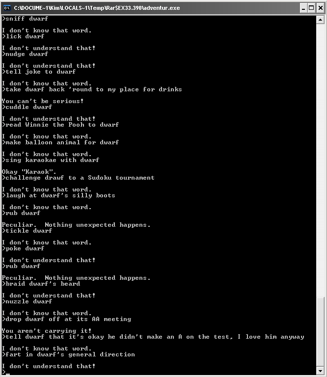
*画像出典: [Wikimedia Commons - Adventure.PNG](https://commons.wikimedia.org/wiki/File:Adventure.PNG) / 『Colossal Cave Adventure』の画面。本文中の作品解説のため引用。*

1981年には、米カリフォルニア・パシフィック・コンピュータ社が『Ultima』（後の『Ultima I: The First Age of Darkness』）をApple II向けにリリースした。プレイヤーは最終目標（悪の魔法使いモンデインを倒すこと）を持ちながらも、マップのどこへでも自由に移動でき、多数のオプショナルクエストや装備が用意されていた。これは事実上、世界初のオープンワールドRPGとしての評価を受けている。[[3](#ref-3)]

*画像出典: [The Avocado - Franchise Festival #68: Ultima (Part One)](https://the-avocado.org/2019/09/20/franchise-festival-68-ultima-part-one/) / 『Ultima』Atari 8-bit版の画面。本文中の作品解説のため引用。*

1984年のスペースフライトシミュレーター『Elite』は、現在のオープンワールドゲームの原型と言われており、広大な宇宙空間を自由に飛び回り、貿易・戦闘・探索を行うそのゲームプレイは、後のサンドボックス型ゲームに直接的な影響を与えた。ただし、これらの初期作品は主にPC（パソコン）プラットフォームに限定されており、一般家庭の茶の間には届いていなかった。[[4](#ref-4)]

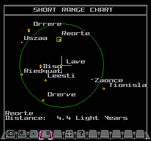
*画像出典: [Elite on the 6502 - Sprite usage in NES Elite](https://elite.bbcelite.com/deep_dives/sprite_usage_in_nes_elite.html) / 『Elite』関連画面。本文中の作品解説のため引用。*

***

## 第2章：ファミコンが変えた地平線——1986年『ゼルダの伝説』

### ハードウェアの制約と天才的なデザイン

ファミリーコンピュータ（ファミコン）のスペックは現代から見れば極めて限定的だ。CPUはMOS 6502ベースの8ビットプロセッサで動作クロックは約1.79MHz、メインRAMはわずか2KBだった。この非力なハードウェア上で、宮本茂と手塚卓志が設計した『ゼルダの伝説』（1986年2月21日、ファミリーコンピュータ ディスクシステム向けに発売）は、ゲーム史に革命をもたらした。[[5](#ref-5)][[6](#ref-6)][[7](#ref-7)]

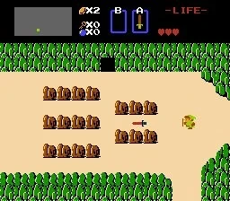
*画像出典: [Nintendo Life - The Legend of Zelda screenshots](https://www.nintendolife.com/games/nes/legend_of_zelda/screenshots) / 『ゼルダの伝説』NES版の画面。本文中の作品解説のため引用。*

縦8画面×横16画面、計128画面から構成される広大なトップビューのフィールドが展開され、草原・森・山・湖などあらゆるエリアへ自由に移動できる設計になっていた。ダンジョンの攻略順序さえプレイヤーが自由に決められる（最終ダンジョンを除く）という非線形性は、当時の主流だった一本道ゲームとは根本的に異なるアプローチだった。[[8](#ref-8)][[9](#ref-9)][[3](#ref-3)]

宮本茂は、京都の郊外を子供の頃に自由に探検した記憶や、自宅の迷路のような引き戸の構造からインスピレーションを得ていたと語っており、このゲームの核心にある「自由な探索による発見の喜び」は設計思想として明確に意図されたものだった。海外メディアGameSpotは「これほど非線形で開かれたゲームが、主流の家庭用ゲーム市場向けに販売されたことはなかった」と評している。[[10](#ref-10)][[2](#ref-2)]

### 『ゼルダの伝説』の功罪：広すぎる自由の問題

一方で、この過度な自由は当時のプレイヤーに混乱をもたらした側面もあった。重要なアイテムを見落とすことが多く、続編『リンクの冒険』（1987年）ではより線形的なデザインへと舵を切る「課題修正」が行われた。この揺り戻しと改善の繰り返しこそが、後のオープンワールドデザイン論の原点ともなっている。[[3](#ref-3)]

***

## 第3章：3D革命の衝撃——1990年代中盤

### プレイステーションとNINTENDO 64が開いた新次元

1990年代前半の家庭用ゲーム機は、スーパーファミコンやメガドライブに代表される16ビット機が主流だった。転換点は1994年12月3日に発売されたソニー・コンピュータエンタテインメントのプレイステーション登場だ。プレイステーションの最大の特徴は、3Dポリゴン描画に特化したアーキテクチャにあった。座標変換専用チップ（GTE）の搭載により、1秒間あたり最大150万ポリゴンの演算が可能だった。CD-ROMの採用による大容量化も加わり、「映画的なムービー演出」「本格的なテクスチャ付き3Dグラフィックス」が家庭で楽しめるようになった。[[11](#ref-11)][[12](#ref-12)][[13](#ref-13)]

1996年6月23日、任天堂はNINTENDO 64を『スーパーマリオ64』と同時に発売した。64ビットCPUと真のポリゴン3Dグラフィックスを採用したこの機器上で、マリオは初めて360度の自由な3D空間を駆け回ることができるようになった。海外メディアIGNはスーパーマリオ64について「3Dのオープンエンドなフリーローミングの世界において革命的だった」と評しており、プレイヤーが自分のスタイルでスターを集められる自由なステージ設計は、後の3Dオープンワールドの雛形となった。[[14](#ref-14)][[15](#ref-15)][[2](#ref-2)]

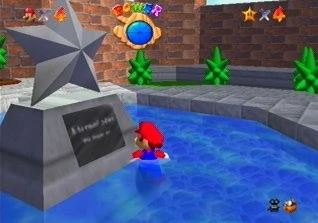
*画像出典: [Nintendo Life - Super Mario 64 screenshots](https://www.nintendolife.com/games/n64/super_mario_64/screenshots) / 『スーパーマリオ64』ゲームプレイ中の画面。本文中の作品解説のため引用。*

### 『ゼルダの伝説 時のオカリナ』が証明した「3Dゼルダ」の可能性

1998年、NINTENDO 64向けに『ゼルダの伝説 時のオカリナ』が発売された。シリーズ初の3D作品となるこの作品で、ダンジョンは複数フロアを持つ立体的な構造となり、垂直方向の移動・カメラ制御・「Zターゲット」による敵ロックオンシステムなど、3D空間の操作に関する様々な革新が盛り込まれた。N64の強化されたグラフィックス能力により、ハイラル城下町やコキリの森の牧歌的な雰囲気、影の神殿やガノンの城の不気味な世界観など、エリアごとの没入感が飛躍的に向上した。『時のオカリナ』は3D空間でのアドベンチャーゲームデザインの基本文法を定め、その後の多くのゲームがこのシステムを模倣した。[[16](#ref-16)][[17](#ref-17)][[18](#ref-18)]

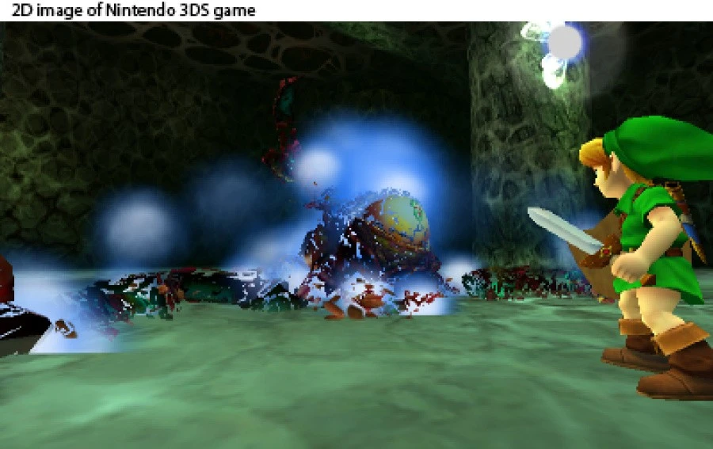
*画像出典: [Nintendo Life - The Legend of Zelda: Ocarina of Time 3D screenshots](https://www.nintendolife.com/games/3ds/legend_of_zelda_ocarina_of_time_3D/screenshots) / 『ゼルダの伝説 時のオカリナ 3D』の画面。本文中の作品解説のため引用。*

***

## 第4章：3Dオープンワールドの誕生——1999〜2002年

### 『シェンムー 一章 横須賀』（1999年）——まだ見ぬ「生きた世界」

セガがドリームキャスト向けに1999年12月29日にリリースした『シェンムー 一章 横須賀』は、当時としては前例のない完成度の3D都市環境を実現した作品だ。「総製作費70億円」と謳われたこの大作は、1986年の横須賀を舞台に、昼夜の変化・天候変化・NPCが独自のスケジュールで動く「生きた街」をリアルに再現した。建物の内外に移動できる3Dフィールド、数多くのインタラクティブなオブジェクト、ミニゲームの充実など、これらはのちに「オープンワールドの定義」として標準化される要素の先取りだった。メーカーが定めたジャンルは「FREE（Full Reactive Eyes Entertainment）」で、その自由度の高さが特徴とされた。[[19](#ref-19)][[20](#ref-20)]

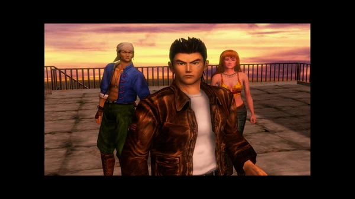
*画像出典: [Steam - Shenmue I & II](https://store.steampowered.com/app/758330/Shenmue/) / 『Shenmue I & II』公式スクリーンショット。本文中の作品解説のため引用。*

『シェンムー』は現代的なオープンワールドの先駆けとして高く評価される一方、当時の商業的成功は限定的で、セガのハード事業撤退の一因ともなった。しかし、その設計思想は後の『GTA III』以降のオープンワールドゲームに多大な影響を与えており、後続の多くの開発者がシェンムーを学習材料としたことが知られている。[[21](#ref-21)][[1](#ref-1)]

### 『グランド・セフト・オートIII』（2001年）——オープンワールドの「大衆化」

2001年10月22日（北米版）、ロックスター・ゲームスから発売された『グランド・セフト・オートIII』（以下『GTA III』）は、オープンワールドというジャンルを一般大衆に定着させた歴史的作品だ。ニューヨークをモデルにした架空の都市「リバティーシティ」を3人称視点で自由に歩き回り、車を乗り回し、ミッションを自由な順序でこなせる設計は、当時のゲーマーに「都市そのものが遊び場だ」という強烈な体験を与えた。日本ではカプコンより2003年にPlayStation 2版が発売されている。『GTA III』は全世界で1,450万本を超える売上を記録し、3Dオープンワールドという設計思想を業界のスタンダードへと引き上げた。[[22](#ref-22)][[23](#ref-23)]

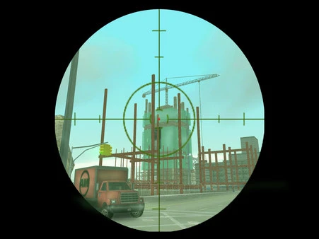
*画像出典: [Steam - Grand Theft Auto III](https://store.steampowered.com/app/12100/Grand_Theft_Auto_III/) / 『Grand Theft Auto III』公式スクリーンショット。本文中の作品解説のため引用。*

| 年代 | 作品 | プラットフォーム | 主な技術的革新 |
|------|------|------------|------------|
| 1986 | ゼルダの伝説 | ファミリーコンピュータ ディスクシステム | 128画面の2Dトップビュー、非線形攻略 |
| 1999 | シェンムー 一章 横須賀 | ドリームキャスト | 3D都市環境、昼夜変化、NPCスケジュール管理 |
| 2001 | グランド・セフト・オートIII | PlayStation 2 | 完全3Dオープンワールド都市、サンドボックス設計 |
| 2002 | The Elder Scrolls III: Morrowind | PC/Xbox | 広大なRPG世界、プレイヤー主導の自由なストーリー進行 |

### 『The Elder Scrolls III: Morrowind』（2002年）——RPGの大陸を自由に歩く

2002年5月1日にBethesda Game Studiosがリリースした『The Elder Scrolls III: Morrowind』は、広大なオープンワールドRPGの原型を確立した。「プレイヤーの行動を制約する境界がほとんどない」という設計思想のもと、メインシナリオよりもプレイヤー自身の行動や探索を重視するゲームデザインは、のちのベセスダ作品（『Oblivion』『Skyrim』）はもちろん、多くのオープンワールドRPGに受け継がれた。[[24](#ref-24)][[25](#ref-25)]

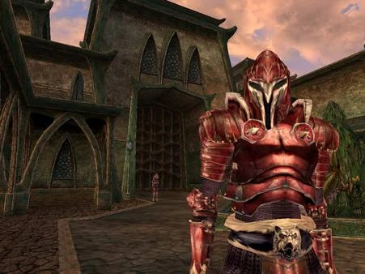
*画像出典: [Steam - The Elder Scrolls III: Morrowind Game of the Year Edition](https://store.steampowered.com/app/22320/The_Elder_Scrolls_III_Morrowind_Game_of_the_Year_Edition/) / 『The Elder Scrolls III: Morrowind』公式スクリーンショット。本文中の作品解説のため引用。*

***

## 第5章：オープンワールドの黄金時代——2010年代

### 『The Elder Scrolls V: Skyrim』（2011年）とゲームエンジンの民主化

2011年11月11日に欧米で（日本語版は同年12月8日に）リリースされた『The Elder Scrolls V: Skyrim』は、IGN・Spike Video Game Awardsをはじめ複数のメディアから「ゲーム・オブ・ザ・イヤー」を受賞し、オープンワールドRPGというジャンルを新たな高みへと引き上げた。同時期の2011年前後、ゲームエンジン市場でも大きな変化が起きていた。Unreal Engine（1998年初版）やUnity（2005年公開）といった汎用ゲームエンジンが普及し、2015年には両エンジンとも基本無償提供が開始された。これにより、大規模スタジオだけでなく中小スタジオやインディー開発者も本格的な3Dオープンワールドを開発できる環境が整った。[[26](#ref-26)][[27](#ref-27)][[28](#ref-28)]

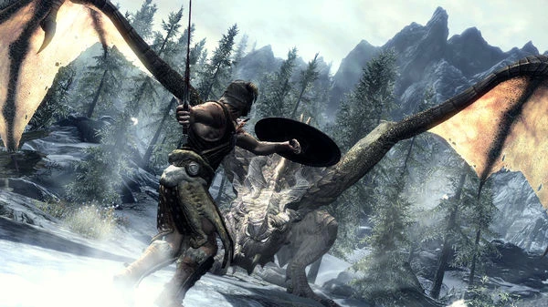
*画像出典: [Steam - The Elder Scrolls V: Skyrim](https://store.steampowered.com/app/72850/The_Elder_Scrolls_V_Skyrim/) / 『The Elder Scrolls V: Skyrim』公式スクリーンショット。本文中の作品解説のため引用。*

### 『Minecraft』（2011年）——プロシージャル生成という第3の道

2011年11月18日に正式版がリリースされ、累計販売本数3億本以上を記録した『Minecraft』（マインクラフト）は、オープンワールドに全く異なるアプローチをもたらした。アルゴリズムによって自動生成される無限の世界（プロシージャル生成）と、ブロックを自由に破壊・設置できるサンドボックス性の組み合わせは、「開発者が設計した世界を探索する」のではなく「プレイヤー自身が世界を創る」という新しいパラダイムを生み出した。『No Man's Sky』（2016年）のような「1京8,000兆以上の惑星」を擁する手続き的宇宙も、『Minecraft』が切り開いたプロシージャル生成の延長線上にある。[[29](#ref-29)][[30](#ref-30)][[31](#ref-31)]

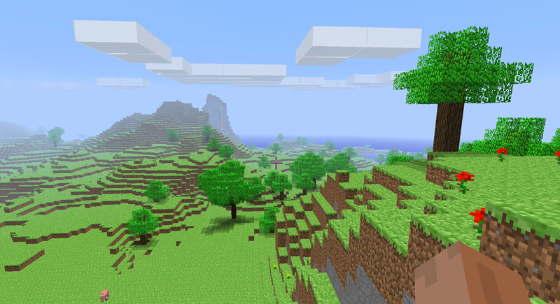
*画像出典: [Minecraft Wiki - Minecraft landscape1.png](https://minecraft.wiki/w/File:Minecraft_landscape1.png) / 『Minecraft』公式由来のスクリーンショット。本文中の作品解説のため引用。*

*画像出典: [Steam - No Man's Sky](https://store.steampowered.com/app/275850/No_Mans_Sky/) / 『No Man's Sky』公式スクリーンショット。本文中の作品解説のため引用。*

### 『ウィッチャー3 ワイルドハント』（2015年）——クオリティとスケールの両立

2015年にCD Projekt REDがリリースした『ウィッチャー3 ワイルドハント』は、広大なオープンワールドとハンドクラフト（手作業）による密度の高いコンテンツを両立させた金字塔的作品だ。同社は独自のゲームエンジン「REDengine 3」を採用し、非線形RPGのためのオープンワールド表現に最適化させた。「あらゆる場所を手作りで、プレイヤーが探索する際のワクワク感と驚きを維持する」という設計方針のもとで制作されたサブクエストの質の高さは、「広大だが空虚」という従来のオープンワールドの弱点を正面から乗り越えるものだった。[[32](#ref-32)][[33](#ref-33)]

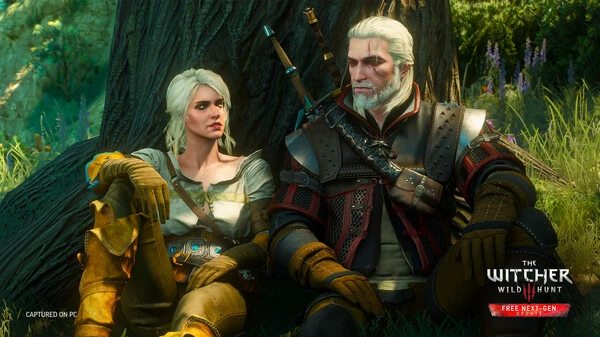
*画像出典: [Steam - The Witcher 3: Wild Hunt](https://store.steampowered.com/app/292030/The_Witcher_3_Wild_Hunt/) / 『The Witcher 3: Wild Hunt』公式スクリーンショット。本文中の作品解説のため引用。*

### 『レッド・デッド・リデンプション2』（2018年）——技術的到達点

2018年発売のロックスター・ゲームス作品『レッド・デッド・リデンプション2』（以下『RDR2』）は、1899年のアメリカ西部を舞台にした5地域にわたる広大なオープンワールドを実現した。Euphoriaエンジン（NaturalMotion社製物理エンジン）を独自に進化させ、人間・動物の物理的なリアクションを飛躍的に向上。RAGE（Rockstar Advanced Game Engine）と最新のテンポラル・アンチエイリアシング、パー・オブジェクト・モーションブラーを組み合わせることで、映画的なビジュアルとリアルな世界表現を達成した。『RDR2』は「オープンワールドゲームとしての没入感と体験の意味合いを極限まで昇華させている」と評され、現代のオープンワールドの技術的ベンチマークとなっている。[[34](#ref-34)][[35](#ref-35)][[36](#ref-36)][[37](#ref-37)]

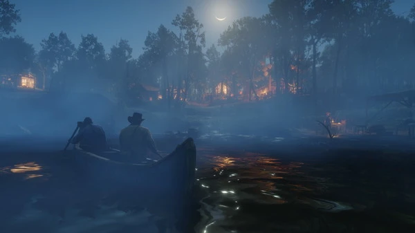
*画像出典: [Steam - Red Dead Redemption 2](https://store.steampowered.com/app/1174180/Red_Dead_Redemption_2/) / 『Red Dead Redemption 2』公式スクリーンショット。本文中の作品解説のため引用。*

***

## 第6章：原点への回帰——『ゼルダの伝説 ブレス オブ ザ ワイルド』（2017年）

### オープンワールドの「再発明」

2017年3月3日、Nintendo Switch本体のローンチタイトル兼Wii U向けに発売された『ゼルダの伝説 ブレス オブ ザ ワイルド』（以下『ブレス オブ ザ ワイルド』）は、オープンワールドゲームの概念を根底から再定義した。海外メディアDigital Trendsは「あらゆる表面を登れる能力とマップを滑空できる能力が、プレイヤーに前例のない移動の自由を与え、ゲームジャンルを切り開き、開発者に垂直方向のデザインへの再考を促した」と評している。[[38](#ref-38)][[39](#ref-39)]

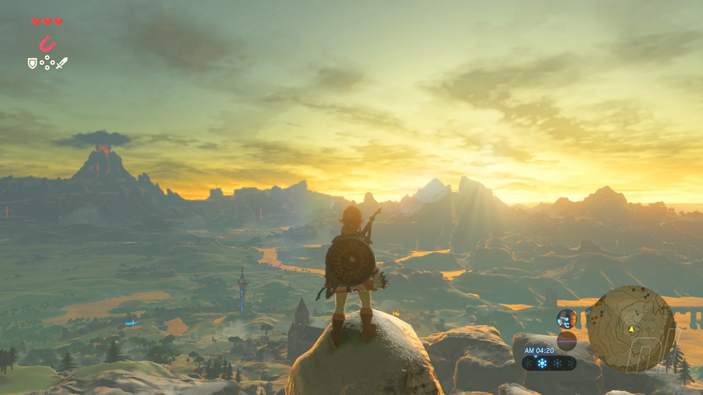
*画像出典: [Nintendo Life - The Legend of Zelda: Breath of the Wild screenshots](https://www.nintendolife.com/games/nintendo-switch/legend_of_zelda_breath_of_the_wild/screenshots) / 『ゼルダの伝説 ブレス オブ ザ ワイルド』ゲームプレイ中の画面。本文中の作品解説のため引用。*

開発チームがこだわったのは「UIや導線の削減」だった。地図をマーカーで埋め尽くすいわゆる「Ubisoftスタイル」と対極に位置し、プレイヤー自身が目標を設定し、発見をマップに記録していく自由形式の探索を中心に据えた。[[39](#ref-39)]

### フィールドデザインの科学：「三角形の法則」

CEDEC 2017でのセッションでは、『ブレス オブ ザ ワイルド』のフィールドデザインの核心として「フィールド三角形の法則」が紹介された。三角形を基本構造として道を設計することで、視線誘導・自然な迂回路の誘発・探索のリズムを生み出したこの手法は、単純な面積の広さではなく「歩いているだけで楽しい」という体験を設計するための具体的な方法論だ。[[40](#ref-40)][[41](#ref-41)]

また、3Dフィールドマップから地形を自動的に解析し、水場・樹木・建物・街道などを16種の要素と高さ情報から合成するマップ自動生成ツールを開発することで、膨大なマップ制作の効率化を実現した。[[42](#ref-42)]

### 初代ゼルダへの回帰

宮本茂は『ブレス オブ ザ ワイルド』について「初代ゼルダへの回帰を目指した」と語っており、実際に両作品のゲームプレイには本質的な共通点がある。初代『ゼルダの伝説』が128画面のフィールドでダンジョンを好きな順序で攻略できたように、『ブレス オブ ザ ワイルド』では広大なハイラルのどこからでも最終ボスに挑める設計だ。「技術は変わっても、プレイヤーを自由に解き放つ」という設計思想は、30年以上の時を越えて継承されている。[[43](#ref-43)][[8](#ref-8)]

***

## 第7章：オープンワールドのゲームデザイン原則

コンピュータ技術の進化とともにオープンワールドのスケールは飛躍的に拡大したが、優れたオープンワールドが共通して持つデザイン原則は変わっていない。

### 自由と誘導のバランス

オープンワールドの最大の課題は「プレイヤーを迷子にさせない自由の設計」だ。初代『ゼルダの伝説』が証明したように、自由度が高すぎると重要アイテムの見落としや進行不能に陥るリスクがある。『ブレス オブ ザ ワイルド』の「三角形の法則」や「引力を発生させるロケーション設計」は、この課題に対する現代的な答えだ。[[44](#ref-44)][[41](#ref-41)][[3](#ref-3)]

### エマージェントゲームプレイ

優れたオープンワールドは、設計者が意図しなかったプレイを生み出す「エマージェントゲームプレイ」を育む土壌を持つ。『ブレス オブ ザ ワイルド』でのゲーム要素間の予期せぬ相互作用がSNSで話題になり続けたことは、このデザイン哲学の成功例だ。[[45](#ref-45)][[39](#ref-39)]

### 世界の「生きている感」

『シェンムー』が1999年にNPCのスケジュール管理と昼夜変化で示した「生きた世界」の要素は、『RDR2』では動物の生態系・天候変化・NPCの複雑なリアクションとして高度に洗練された。「世界がプレイヤーを待っているのではなく、プレイヤーがいなくても動いている」という感覚は、没入感の核心をなす。[[46](#ref-46)][[19](#ref-19)][[34](#ref-34)]

***

## 技術的変遷まとめ

| 時代 | 主要ハード/技術 | オープンワールドへの影響 |
|------|--------------|----------------------|
| 1980年代 | 8bit CPU、2KBメモリ | 2Dトップビュー探索が限界。初代『ゼルダの伝説』が非線形設計を確立 [[6](#ref-6)][[7](#ref-7)] |
| 1990年代前半 | 16bit機、CD-ROM普及 | 大容量コンテンツが可能に。2Dオープンワールドの充実 [[11](#ref-11)] |
| 1990年代後半 | 32/64bit機、3Dポリゴン | プレイステーションが3Dを家庭に普及。N64で『スーパーマリオ64』『時のオカリナ』が3D空間の文法を確立 [[47](#ref-47)][[13](#ref-13)] |
| 2000年代前半 | PS2/Xbox、GPUの進化 | 『GTA III』『Morrowind』が3Dオープンワールドのスタンダードを形成。ゲームエンジン普及開始 [[48](#ref-48)] |
| 2000年代後半〜2010年代 | PS3/Xbox 360、DirectX 9/10、VRAM増加 | シェーダー技術・リアルタイムライティングの高度化。『Skyrim』『ウィッチャー3』が大規模世界と高品質コンテンツを両立 [[49](#ref-49)] |
| 2010年代後半〜現在 | PS4/PS5、SSD、レイトレーシング | 超高速読み込みによるシームレスな広大世界。『RDR2』『ブレス オブ ザ ワイルド』が技術的・デザイン的到達点に [[37](#ref-37)][[39](#ref-39)] |

***

## 結論：ゲームプランナーへの示唆

オープンワールドの歴史は、「技術が可能にしたことを、デザインがどう活用するか」という問いの繰り返しだ。ファミコンの2KBメモリという極限の制約の中でも、宮本茂は「自由な探索による発見」という体験を設計した。『GTA III』は3D技術を「都市という遊び場」に変え、『ブレス オブ ザ ワイルド』は「登れない場所がない世界」を「プレイヤーが問題を解決する道具」に転化した。[[8](#ref-8)][[10](#ref-10)][[22](#ref-22)][[39](#ref-39)]

技術の進歩はオープンワールドのスケールと密度を高め続けるだろう。しかし、「プレイヤーがどこへでも行けるという自由」と「その自由の中でも迷子にならない誘導の妙」というデザイン上の本質的なテンションは、初代『ゼルダの伝説』から変わっていない。次のオープンワールドを設計する者は、この40年の蓄積の上に立っている。

---

## References

1. [オープンワールド論 定義と歴史から現代ゲームの本質を捉え ...][1] - 例えば、初代『ゼルダの伝説』（1986年）は「その1」～「その3」までの定義を満たしているのでないかとか、『GTA3』が『シェンムー』から影響を受けたと ...

2. [Open world][2] - An open world is a virtual world in which the player can approach objectives freely, as opposed to a...

3. [What Was the First True Open World Game?][3] - While Ultima 1, Elite, and The Legend of Zelda are some of the earliest examples of what many would ...

4. [オープンワールド][4] - オープンワールド（Open world）とは、コンピュータゲームの用語で、直線的に設計されたゲーム世界とは違い、プレイヤーが自由に目的に近づくことができるゲーム世界の ...

5. [The Legend of Zelda (video game)][5] - The Legend of Zelda is a 1986 action-adventure game developed and published by Nintendo for the Fami...

6. [ゲーム機ハードウェアとアセンブリ最適化][6] - Nintendo Entertainment System（NES）では、MOS 6502という8ビットCPUが使用されていた。 クロック：1.79MHz（NTSC）; レジスタ：A, X, Y（汎用...

7. [ファミコンの凄いスペックまとめ - Digital Colors][7] - 仕様・スペック ; 動作クロック, 1.79MHz ; バス, 8bit ; メモリ空間, 64KB ($0000 – $FFFF) ; メインメモリ, ワーキングRAM, 2KB (16Kbit S...

8. [【レビュー】ゼルダの伝説1 [評価・感想] ファミコン時代に生まれ ...][8] - 見た目こそはシンプルですが、自由度の高さに関してはオープンワールドと名乗っても良いほどで、同時期に発売されたタイトルとは一線を画しています。

9. [Why do people think BOTW is the first open-world Zelda ...][9] - [ALL] Why do people think BOTW is the first open-world Zelda game?

10. [The History of Zelda: The NES Years][10] - The Legend of Zelda made its debut in Japan in 1986. The game takes place in the kingdom of Hyrule (...

11. [The Evolution of Gaming: A Journey Through Decades - Xzone][11] - The late 1990s and early 2000s witnessed a seismic shift with the advent of 3D gaming. The release o...

12. [プレイステーション（初代）とは？3Dゲーム革命を起こした ...][12] - 1994年に登場したこのハードは、CD-ROMの採用、3Dポリゴン描画への特化、そして大胆な開発者支援策によって、ゲーム業界そのもののルールを変えてしまい ...

13. [PlayStation (ゲーム機)][13] - 非常に高価なグラフィックスワークステーションでのみ実現できたポリゴンによる3次元コンピュータグラフィックスを比較的簡単にプログラミングできる。但し、ポリゴン ...

14. [Did You Know? - Super Mario 64 (N64, 1996) ...][14] - Super Mario 64 on the Nintendo 64! This wasn't just a game it was a revolution. Mario leapt from 2D ...

15. [スーパーマリオ64][15] - 『スーパーマリオ64』（スーパーマリオろくじゅうよん、英: Super Mario 64）は、任天堂が1996年6月23日に発売したNINTENDO 64用の3Dアクションゲーム。

16. [The Legend of Zelda: Ocarina of Time. Nintendo EAD (1998 ...][16] - The technology on the Nintendo 64 allowed for some other innovations that where a step up on the ear...

17. [The Legend of Zelda: Ocarina of Time][17] - It was the first Legend of Zelda game with 3D graphics. It was released in Japan and North America i...

18. [The Legend of Zelda: Ocarina of Time - Zelda Wiki - Fandom][18] - ... Open," allowing Link to open the door. The 3D environment, enhanced sound, and greater graphical...

19. [Shenmue (video game)][19] - Shenmue is a 1999 action-adventure game developed and published by Sega for the Dreamcast. It follow...

20. [『シェンムー 一章 横須賀』25周年。制作費70億円を投じたオープンワールドゲームの元祖とも呼ばれる、時代を先取りし過ぎた伝説の作品][20] - 1999年（平成11年）12月29日は、ドリームキャスト用ソフト『シェンムー 一章 横須賀』が発売された日。

21. [25 Years Ago, This Criminally Overlooked Game Created ...][21] - Shenmue is one of the most important games ever made, crafting the idea of open world games as we kn...

22. [グランド・セフト・オートIII - Wikipedia][22] - 北米において2001年10月22日にPlayStation 2で発売。後にPCやXboxにも移植され、全世界で1,450万本を売り上げる大ヒット作となった。

23. [Grand Theft Auto III - GTA Wiki - Fandom][23] - Multiple publications deemed it a revolutionary title for its advancements in game design and open-e...

24. [The Elder Scrolls III: Morrowind][24] - Morrowind was designed with an open-ended, freeform style of gameplay in mind with less of an emphas...

25. [The Elder Scrolls III: Morrowind launched on May 1, 2002 ...][25] - On May 1st, 2002, Bethesda Game Studios released The Elder Scrolls III: Morrowind, a game that chang...

26. [The Elder Scrolls][26] - Most games in the series have been critically and commercially successful, with The Elder Scrolls II...

27. [ゲームエンジンの発明と普及によるゲームデザインと開発 ...][27] - ゲームエンジン普及後のゲーム開発とデザイン 特徴 1. 汎用プラットフォームの登場: • Unreal Engine（1998年）、Unity（2005年）などの汎用ゲーム ...

28. [ゲーム制作現場を支えるゲームエンジンとは？][28] - Unityは、2005年に公開されたゲームエンジンで、当初はMac OSでの開発に特化したものでしたが、バージョンアップを重ねてマルチプラットフォームに対応。

29. [「マイクラ」累計販売本数3億突破！ 公式ブログで15年を振り返る][29] - Microsoft傘下のMojang Studiosは、サンドボックスゲーム「Minecraft（マインクラフト）」の累計販売本数が3億本を突破したことを発表した。

30. [Minecraft's Legacy. How Procedural Content Generation…][30] - Minecraft has had a profou...

31. [No Man's Sky][31] - No Man's Sky received mixed reviews at its 2016 launch, with some critics praising the technical ach...

32. [How The Witcher 3's Developers Ensured Their Open ...][32] - CD Projekt RED put together a sprawling open world game that avoided the genre's usual preference fo...

33. [The Witcher 3: Wild Hunt][33] - The Witcher 3: Wild Hunt‍ is a 2015 action role-playing game developed and published by CD Projekt. ...

34. [『レッド・デッド・リデンプション2』世界を驚愕させた緻密な ...][34] - 濃密なオープンワールドを実現した高度なAI技術と物理学

35. [オープンワールドゲームをやる話 ーRED DEAD ...][35] - SkyrimやFalloutがこの世界の常識を変えたように、BotWが業界水準を爆上げしたように、RDR2は体験と世界の持つ意味合いを極限まで昇華させているように ...

36. [Red Dead Redemption 2 - Wikipedia][36] - The game is presented through first- and third-person perspectives, and the player may freely roam i...

37. [The Technology Behind Red Dead Redemption 2 Gameplay][37] - The RAGE engine is a modern marvel. While we have seen some of its elements before, the way the tech...

38. [ゼルダの伝説、40年の歴史を通して見た偉大な変遷 ｜ Vortex ...][38] - 2017年に発売された『ゼルダの伝説 ブレス オブ ザ ワイルド』は、オープンワールドゲームの概念を再定義し、数多くのゲームに影響を与えました。

39. [The Legend of Zelda: Breath of the Wild - Wikipedia][39] - Ars Technica, the open-world design reinvented Zelda formula, in comparison to other entries of the ...

40. [ブレスオブザワイルドのマップ開発秘話][40] - こちらの「フィールド三角形の法則」はマップの至る所に適用されており、これによりプレイヤーは歩いているだけでも楽しい、という感想を抱くのです。

41. [CEDEC2017 「開発スタッフから学ぶ『BotW』の設計」（2017年 ...][41] - 『ゼルダの伝説 ブレス オブ ザ ワイルド』におけるフィールドレベルデザイン ～ハイラルの大地ができるまで～

42. [『ゼルダの伝説 BotW』何気ないウィンドウやアイコンなどに隠 ...][42] - UIを撤廃していく案から生まれた、新たなUIのテーマ.

43. [[PDF] Open-world Game Design - Case Study The Legend of Zelda][43] - (GDC 2017.) 3.2.2 Climbing. Breath of the Wild's climbing system is touted by critics to be a revolu...

44. [「オープンワールド」とは？ 歴史、おすすめ名作ゲーム][44] - ニューオーリンズのギャングの頂点を目指し、縄張りを広げるクライムアクションゲーム。

45. [Open World vs Closed World Games: A production Analysis][45] - A Sandbox game is without specific directions, goals, or instructions, allowing the player to tinker...

46. [レッド・デッド・リデンプション2はオープンワールドゲームを私 ...][46] - RDR2は、ゲームの中で最も複雑で没入感のあるオープンワールドです。

47. [The Evolution of Gaming Graphics: A Look Back and Forward][47] - We're taking a look back (and forward) at the evolution of gaming graphics, exploring the incredible...

48. [ゲームエンジンの歴史][48] - また、一時期大量にあったゲームエンジンは、その熾烈な戦いの末、2大巨頭である Unreal Engine と Unity を中心に精鋭たちが生き残っています。

49. [The Complete Evolution of GPUs - EveZone - Evetech][49] - Explore the complete graphics card history, from the first monochrome adapters to today's AI-powered...

[1]: https://note.com/j1n1/n/n55b91ee41f31
[2]: https://en.wikipedia.org/wiki/Open_world
[3]: https://www.denofgeek.com/games/first-open-world-game-ever-history/
[4]: https://ja.wikipedia.org/wiki/%E3%82%AA%E3%83%BC%E3%83%97%E3%83%B3%E3%83%AF%E3%83%BC%E3%83%AB%E3%83%89
[5]: https://en.wikipedia.org/wiki/The_Legend_of_Zelda_(video_game)
[6]: https://qiita.com/CRUD5th/items/5405223b2ba27ae743fe
[7]: https://www.d-colors.net/game/fc/
[8]: https://kentworld-blog.com/archives/36017681.html
[9]: https://www.reddit.com/r/zelda/comments/14he01t/all_why_do_people_think_botw_is_the_first/
[10]: https://ejunkieblog.com/2026/02/20/the-history-of-zelda-the-nes-years/
[11]: https://www.xzones.ca/blog-posts/the-evolution-of-gaming-a-journey-through-decades
[12]: https://heisei-archive.com/playstation-first-generation-overview/
[13]: https://ja.wikipedia.org/wiki/PlayStation_(%E3%82%B2%E3%83%BC%E3%83%A0%E6%A9%9F)
[14]: https://www.facebook.com/retrogamingmemoriesofficial/posts/did-you-know-super-mario-64-n64-1996super-mario-64-wasnt-just-a-new-mario-gameit/642960825511553/
[15]: https://ja.wikipedia.org/wiki/%E3%82%B9%E3%83%BC%E3%83%91%E3%83%BC%E3%83%9E%E3%83%AA%E3%82%AA64
[16]: https://gamesrevisiteddotcom.wordpress.com/2019/05/06/the-legend-of-zelda-ocarina-of-time-nintendo-ead-1998-nintendo-64/
[17]: https://en.wikipedia.org/wiki/The_Legend_of_Zelda:_Ocarina_of_Time
[18]: https://zelda.fandom.com/wiki/The_Legend_of_Zelda:_Ocarina_of_Time
[19]: https://en.wikipedia.org/wiki/Shenmue_(video_game)
[20]: https://www.famitsu.com/article/202412/28694
[21]: https://www.inverse.com/gaming/shenmue-open-world-games-anniversary
[22]: https://ja.wikipedia.org/wiki/%E3%82%B0%E3%83%A9%E3%83%B3%E3%83%89%E3%83%BB%E3%82%BB%E3%83%95%E3%83%88%E3%83%BB%E3%82%AA%E3%83%BC%E3%83%88III
[23]: https://gta.fandom.com/wiki/Grand_Theft_Auto_III
[24]: https://en.wikipedia.org/wiki/The_Elder_Scrolls_III:_Morrowind
[25]: https://www.instagram.com/reel/DXz7Jb1ibVR/
[26]: https://en.wikipedia.org/wiki/The_Elder_Scrolls
[27]: https://note.com/ak1031/n/nf1e3db2d5715
[28]: https://ss-agent.jp/column/special/sp23-game-engine/
[29]: https://game.watch.impress.co.jp/docs/news/1539548.html
[30]: https://blog.mirageml.com/minecrafts-legacy-c6b6e68c7c88
[31]: https://en.wikipedia.org/wiki/No_Man's_Sky
[32]: https://kotaku.com/how-the-witcher-3s-developers-ensured-their-open-world-1735034176
[33]: https://en.wikipedia.org/wiki/The_Witcher_3:_Wild_Hunt
[34]: https://www.famitsu.com/news/201812/07168913.html
[35]: https://note.com/iriwopposite/n/n0a83051a9bdc
[36]: https://en.wikipedia.org/wiki/Red_Dead_Redemption_2
[37]: https://skywell.software/blog/the-technology-behind-red-dead-redemption-2-gameplay/
[38]: https://vortexgaming.io/ja/postdetail/722108
[39]: https://en.wikipedia.org/wiki/The_Legend_of_Zelda:_Breath_of_the_Wild
[40]: https://basara.jp/blog/?p=7498
[41]: https://www.ndw.jp/post-1121/
[42]: https://www.famitsu.com/news/201709/04141037.html
[43]: https://www.theseus.fi/bitstream/handle/10024/266367/Vidqvist_Joel.pdf?sequence=2
[44]: https://app-liv.jp/articles/127069/
[45]: https://www.postphysical.io/blog/world-structure-an-open-or-closed-space-conundrum
[46]: https://www.reddit.com/r/reddeadredemption2/comments/108dhbw/red_dead_redemption_2_has_ruined_open_world_games/
[47]: https://www.overclockers.co.uk/blog/the-evolution-of-gaming-graphics-a-look-back-and-forward/
[48]: https://qiita.com/totototo01209/items/37bd281315f6cbfb830d
[49]: https://evezone.evetech.co.za/deep-dives/graphics-card-history-evolution-gpus

----

この文書は、Perplexity、Claude、OpenAI Codex の3つのAIの支援を受けて著述されたものです。引用画像を除き、MIT License にて提供されています。
