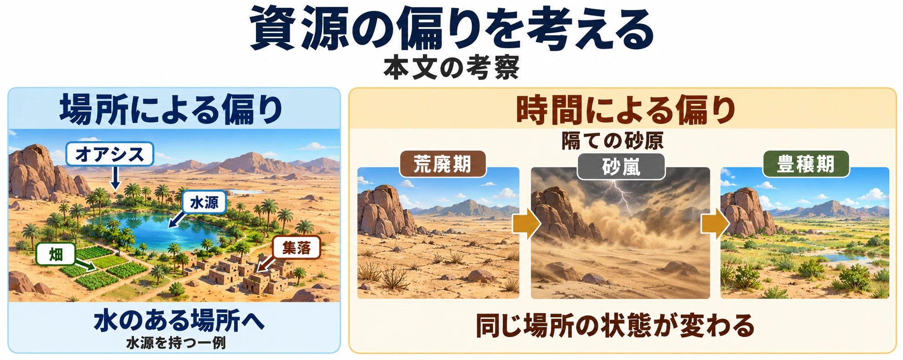

# 何を置かずに残し、何をどこに集めるか――砂漠とオアシスの地形設計

[第4回「何もない広さを、何で満たすか」](open-world-terrain-design-grasslands.md)の終わりで、ステップのさらに乾燥した側へ向かうと予告した。今回は、草がまばらになった先に広がる砂漠と、その中で水を得られるオアシスを取り上げる。

オープンワールドの地形設計シリーズ第5回の前提は、砂漠を **水という資源が極端に偏った地形** として読むことだ。前回の問いが広さを「何で満たすか」なら、今回は **何を置かずに残し、何をどこに集めるか** を考える。

砂漠ができる理由を確かめたうえで、『Sable』と『Journey』のまばらな景色を見ていこう。後半では、水のある「場所」に暮らしが集まるオアシスと、「時間」によって豊かさが変わる『モンスターハンターワイルズ』を並べる。

***

## 砂漠はなぜ砂漠なのか

### 入ってくる水と、失われうる水

赤木祥彦氏による『日本大百科全書（ニッポニカ）』の「砂漠」は、雨が少なく、植物が育たないか、まばらにしか育たない土地と説明する。同項目の「水」には、最大可能蒸発量が降水量の500倍以上という記述もある。 **最大可能蒸発量** とは、水が十分あったと仮定したときに蒸発しうる量のことで、実際に失われた水の量とは異なる。[[1](#ref-1)]

この倍率は、同項目が水不足の大きさを説明する際の値である。砂漠を区分する一律の境界値としては扱わない。同項目も「範囲」では、水の収支をもとにした複数の区分法を紹介している。[[1](#ref-1)]

### 乾く理由を、周囲の地形とつなぐ

同項目に挙げられた成因のうち、まず三つを押さえよう。[[1](#ref-1)]

- **亜熱帯高圧帯**：亜熱帯に帯状に広がる高気圧の地域である。空気が上から下へ降りる下降気流が発達し、雨が降りにくい。
- **大陸内部**：海から遠く、風が内陸へ届くまでに水分を失ってしまう。
- **雨陰砂漠（ういんさばく）**：山脈が湿った風を遮ることで、その風下にできる砂漠である。風上で雨を降らせた空気が、乾いて吹き下りる。

雨陰砂漠の例には、アンデス山脈の東側に広がるパタゴニア砂漠がある。北米のグレート・ベースン砂漠についても、米国国立公園局はシエラ・ネバダ山脈を越える風による雨陰の働きを説明している。[[2](#ref-2)][[3](#ref-3)] [第2回のフェーン現象](open-world-terrain-design-mountains.md)で見た、山が両側の湿り具合を分ける話の続きである。

なお、『日本大百科全書』は寒流の影響を受ける冷涼海岸砂漠も挙げ、実際の砂漠は複数の成因が重なることが多いと説明している。[[1](#ref-1)]

### 地面は、砂・岩・礫から選べる

地表で分けると、砂が広がる **砂砂漠（すなさばく）** 、岩盤が露出する **岩石砂漠** 、礫、つまり小石などに覆われる **礫砂漠（れきさばく）** がある。同項目が示す砂砂漠の割合は、サハラ約20％、アラビア約30％、オーストラリア約40％で、いずれも半分に届かない。砂砂漠には砂丘だけでなく、平坦な砂地も含まれる。[[1](#ref-1)]

ここからは地形設計への考察である。ゲームでなじみのある一面の砂丘は、現実の砂漠から一つの地表を選んだ表現と捉えられる。岩の面が続く場所や、小石に覆われた場所も候補になる。「乾いている理由」と「足元を何が覆うか」を分けて決めれば、砂漠の景色を考える選択肢が増える。

***

## 何を置かずに残すか――まばらな世界の作り方

### 『Sable』の、間を開けて成立する見どころ

Shedworksの『Sable』では、砂漠に点在する場所を巡る旅が中心となる。Chris Kerr氏が2021年10月6日に公開したGame Developerのインタビューで、Gregorios Kythreotis氏は、始まりと終わりを持ち、その間を自由に探索する構成を「レモン型」と呼んでいる。入口と出口が絞られ、中ほどが広がる形を思い浮かべると分かりやすい。[[4](#ref-4)]

まばらな配置の着想の一つは『ゼルダの伝説 風のタクト』だった。砂丘を海に、見どころを島に見立て、各地の内容が単独でも成立するようにしたという。Kythreotis氏はさらに、設計への自信のなさを、要素を増やすことで埋め合わせてしまう場合があると指摘している。[[4](#ref-4)]

これを配置の判断へ引き寄せるなら、見どころ同士の間を埋める前に、それぞれへ向かいたくなる理由を確かめる、という考察ができる。何かを追加するたびに立ち止まらせるのか、それとも次の場所まで走る時間を残すのか。足さずに残す区間も、旅の構成として検討できる。

### 『Journey』の、孤独を感じる広さと足元の反応

thatgamecompanyの『Journey』（邦題『風ノ旅ビト』）も、まばらな景色を考える手掛かりになる。ここではオープンワールド全般の代表としてではなく、砂漠を通る体験の例として取り上げる。

Karen Moltenbrey氏によるComputer Graphics Worldの2012年6・7月号の記事で、Aaron Jessie氏は、広大な世界の中で孤独を感じ、ときどき別の人と出会う体験を説明している。またMatt Nava氏によれば、チームは実際に砂丘を訪れ、その観察から砂の見た目と、プレイヤーの一歩ごとにどう反応させるかの着想を得た。[[5](#ref-5)]

ここからは本稿の考察である。目の前に新しい建物や出来事を次々と置かなくても、自分が広い場所を進んでいる感覚や、歩くたびに返ってくる砂の反応に注意を向けさせることはできる。その意味で、「何もない」と感じる区間自体を体験として組み立てられる。

第4回では、開けた場所を空白にしない工夫に注目した。本回では、まばらさを保つ判断に注目している。これは、作品がどのような時間を過ごしてほしいかによって選ぶものだ。出会いを重ねる区間と、遠くを眺めて進む区間を、目指す体験から考えたい。

***

## 見えたら行ける――まばらな世界で前に進む理由

『Sable』の出発点について、Daniel Fineberg氏は、遠くに大きな形を置き、それが見えれば行って探索できる、という発想を説明している。景色の中に見つけたものが、そのまま次の行き先になる。[[4](#ref-4)]

『Journey』では、遠くの山が視線を集める焦点になる。Jessie氏の説明では、プレイヤーはその山を見て、そこが目標であり、到達する必要があると理解する。[[5](#ref-5)]

この二つを並べると、寄り道の候補を見せる場合と、旅全体の目標を見せる場合を分けて考えられる。これは設計上の考察である。途中の配置をまばらにするときには、何を目指して進むのかも一緒に確かめたい。[第1回の「見せる」](open-world-terrain-design-prospect-refuge.md)と、[第2回の山を目印にする話](open-world-terrain-design-mountains.md)が、ここでつながる。

出典：[thatgamecompany『Journey』公式ページ](https://thatgamecompany.com/journey/)。© 2012 Sony Interactive Entertainment LLC. Developed by thatgamecompany. Journey is a trademark of Sony Interactive Entertainment LLC.

***

## 何をどこに集めるか――オアシスと、時間で動く豊かさ

### 場所で集める――水源からオアシスを置く

赤木祥彦氏による『日本大百科全書』の「オアシス」は、砂漠で使える水を継続して得られる場所と定義する。水の得られ方により、次の四つに分けている。[[6](#ref-6)]

| 分類 | 水はどこから来るか |
| --- | --- |
| 泉性オアシス | 地表へ湧き出る水や、浅い地下にある水を利用する |
| 山麓オアシス | 山から流れ、扇状地で地下へ潜った水を、地下水路などで導く |
| 外来河川オアシス | ナイル川のように、砂漠の外から流れ込む川の水を利用する |
| 人工オアシス | 深井戸での揚水やダムからの導水など、技術によって新たに利用可能にした水に支えられる |

山麓で使われる **カナート** は、地下の水を地表へ導く地下水路のイランでの呼び名である。 **外来河川** は、砂漠の外から水を運び込む川を指す。[[6](#ref-6)] 山麓の例は[第3回で扱った扇状地](open-world-terrain-design-rivers.md)、すなわち谷の出口に土砂が扇状に広がる土地の続きであり、外来河川の例は同回の川と暮らしの関係につながる。

水のある場所には農業が成り立つ。たとえばFAO（国連食糧農業機関）は、エジプトのシワ・オアシスでナツメヤシを中心に、オリーブなどを組み合わせて育てる農業を紹介している。[[7](#ref-7)]

オアシスは、隊商、つまり荷物を運んで集団で旅する商人たちを支える中継地や交易の中心にもなった。『日本大百科全書』は山麓オアシスを結ぶシルク・ロードの発達を説明している。UNESCOの長安―天山回廊の解説でも、水路や井戸などが農業と集落を支え、交易の町や隊商宿を含む道のつながりが築かれたことが分かる。[[6](#ref-6)][[8](#ref-8)]

ここからはゲームへの応用についての考察である。 **水がどこから来るかを決めると、オアシスを置く場所と、道や集落を置く理屈がつながる。** 山麓から水を導くなら、その水が使える場所に畑や住まいを置き、そこを旅の立ち寄り先にできる。砂漠を横切る川なら、川沿いに暮らしを連ねる案が考えられる。

たとえば地図に一つの町を置くとき、水源、水を導く経路、畑、家々、町へ向かう道の順で考えてみる。これは配置を考えるための例であり、すべてのオアシスに共通する形を定めるものではない。

### 時間で変える――『モンスターハンターワイルズ』の隔ての砂原

カプコンが2024年8月21日に発表した『モンスターハンターワイルズ』のフィールド情報では、飢えた肉食モンスターが群れて争う「荒廃期」と、異常気象を経て生命が豊かになる「豊穣期」が示されている。「隔ての砂原」の異常気象は、雷を伴う「砂嵐」である。同じ場所にいても、時によって環境の様子が変わる設計だ。[[9](#ref-9)]

2025年3月1日公開のファミ通のインタビューで、藤岡要氏は、自然の豊かさと厳しさの両端を描こうとした経緯を語っている。さらに、プレイヤーが変化する状況を見て、その場で判断しながら遊ぶことを目指したと説明する。この発言は、砂原だけに限らず、本作のフィールド全体の環境変化についてのものだ。[[10](#ref-10)]

ここからは本稿の考察である。オアシスを置くときには、「どこで水が手に入るか」が配置の軸になる。『ワイルズ』の環境変化からは、「いつ豊かな状態になるか」を軸にする発想を取り出せる。 **資源の偏りは、場所だけでなく時間でも作れる** ということだ。

前者なら、水のある場所へ向かう理由を考える。後者なら、同じ場所をいつ訪れるか、変化を待つかという判断を考えられる。ここで扱っている時間の変化はゲームの設計であり、現実の砂漠の季節変化をそのまま説明するものではない。

オアシスと環境変化を、資源の偏りという観点から比較した模式図。左は水源を持つ一例であり、右はゲーム画面の再現ではなく、同じ場所の状態変化を示している。[[6](#ref-6)][[9](#ref-9)][[10](#ref-10)]

***

## 何を置かずに残し、何をどこに集めるかを決める

最後に、ここまでの資料と事例を、砂漠を設計するときの判断へ置き換えよう。以下の順序と表は、本稿の考察である。

1. **その砂漠が乾いている理由を決める**：山脈の風下か、海から遠い土地か。隣り合う地域との関係を確かめる。
2. **地面を決める**：砂か、岩か、礫か。地域の中で使い分けるなら、どこで景色が変わるかを考える。
3. **何を置かずに残すかを決める**：見どころの間を進む時間に、何を感じてほしいか。広さや孤独、足元の反応へ注意を向ける区間を考える。
4. **水と人が集まる場所を決める**：水源から畑・集落・道をつなぐ。あわせて、豊かさを場所で偏らせるか、時間でも変えるかを選ぶ。
5. **遠くに見せるものを決める**：寄り道の候補か、旅全体の目標か。まばらな区間から何が見え、前へ進む理由になるかを確かめる。

これを、第1回の「見せる・隠す・運ぶ」に当てはめると、次のように整理できる。

| 物差し | 砂漠・オアシスでの問い | 確かめること |
| --- | --- | --- |
| 見せる | まばらな景色の先に何を見せるか | 寄り道の候補、遠方の目標、水や暮らしの集まる場所が、進む理由になるか |
| 隠す | どこまで見通しを保ち、何を地形の向こうに残すか | 砂丘や岩の起伏を使う場合、目標が隠れる区間と再び見える場所が、望む体験に合うか |
| 運ぶ | 何を目指し、どのタイミングで移動してほしいか | 水源や集落を結ぶ道、見どころ間の移動、環境の変化を待つ判断がつながるか |

砂漠の設計では、まばらに残す場所と、豊かさを集める場所を一緒に考えたい。足元に何があり、遠くに何が見え、水や暮らしがどこにあるか。その組み合わせから、静かに進む区間と、立ち寄りたくなる場所を組み立てられる。

最終回では、これまでの山・川・草原・砂漠の関係を規則として広げる、手続き的生成を取り上げる。

## References

1. [赤木祥彦「砂漠」][1] — 小学館『日本大百科全書（ニッポニカ）』、コトバンク掲載、公開日記載なし。冒頭の定義と「範囲」「呼称・分類」「成因」「地形」「水」を参照。「500倍以上」は「水」の記述。砂砂漠の割合は「地形」の値。同ページの他辞典とは区別した。2026年10月2日確認。

[1]: https://kotobank.jp/word/砂漠-69475

2. [赤木祥彦「パタゴニア砂漠」][2] — 小学館『日本大百科全書（ニッポニカ）』、コトバンク掲載、公開日記載なし。アンデス山脈による雨陰の説明を参照。2026年10月2日確認。

[2]: https://kotobank.jp/word/ぱたごにあ砂漠-1580662

3. [National Park Service「Deserts」][3] — Great Basin National Park、2021年4月24日更新。「Creating a Desert」のシエラ・ネバダ山脈と雨陰の説明を参照。

[3]: https://www.nps.gov/grba/learn/nature/deserts.htm

4. [Chris Kerr「Using a 'lemon-shaped' structure to create the sanguine open-world of Sable」][4] — Game Developer、2021年10月6日。Gregorios Kythreotis氏とDaniel Fineberg氏へのインタビュー。構造、独立した見どころ、要素を増やす判断、遠くに見えるものへの探索についての発言を要約。

[4]: https://www.gamedeveloper.com/design/using-a-lemon-shaped-structure-to-create-the-sanguine-open-world-of-i-sable-i-

5. [Karen Moltenbrey「Mysterious Journey」][5] — Computer Graphics World、2012年6・7月号（Volume 35, Issue 4）。Aaron Jessie氏の孤独と遠方の山、Matt Nava氏の砂丘取材と砂の反応に関する発言を要約。

[5]: https://www.cgw.com/Publications/CGW/2012/Volume-35-Issue-4-June-July-2012/Mysterious-Journey.aspx

6. [赤木祥彦「オアシス」][6] — 小学館『日本大百科全書（ニッポニカ）』、コトバンク掲載、公開日記載なし。定義、四分類、カナート、山麓オアシスとシルク・ロードを参照。同ページの他辞典とは区別した。2026年10月2日確認。

[6]: https://kotobank.jp/word/おあしす-3145908

7. [Food and Agriculture Organization of the United Nations「Siwa Oasis」][7] — FAO・Globally Important Agricultural Heritage Systems、公開日記載なし。ナツメヤシと他作物を組み合わせるオアシス農業の例。2026年10月2日確認。

[7]: https://www.fao.org/giahs/giahs-around-the-world/egypt-siwa-oasis-dates-system/en

8. [UNESCO World Heritage Centre「Silk Roads: the Routes Network of Chang'an-Tianshan Corridor」][8] — UNESCO世界遺産センター、公開日記載なし。交易集落・隊商宿と、それらを支える水管理・農業の説明を参照。2026年10月2日確認。

[8]: https://whc.unesco.org/en/list/1442/

9. [株式会社カプコン「新たな広がりを魅せる『モンスターハンターワイルズ』の世界へ。最新のプロモーション映像③を公開！」][9] — PR TIMES掲載の同社プレスリリース、2024年8月21日。「変貌するフィールド」の荒廃期・砂嵐・豊穣期を参照。

[9]: https://prtimes.jp/main/html/rd/p/000004527.000013450.html

10. [ででお・ぽんきち「『モンハンワイルズ』インタビュー。ジン・ダハドは“ちょっとおもしろいギミック”を入れたヌシ的存在。今後のシリーズについては『まだまだ広げていけるIP』【モンスターハンター】」][10] — ファミ通.com、2025年3月1日。フィールドの変化についての質問に対する藤岡要氏の回答を要約。砂原だけに限定した発言としては扱っていない。

[10]: https://www.famitsu.com/article/202503/33795

----

この文書は、Perplexity、Claude、OpenAI Codex の3つのAIの支援を受けて著述されたものです。引用画像を除き、MIT License にて提供されています。
