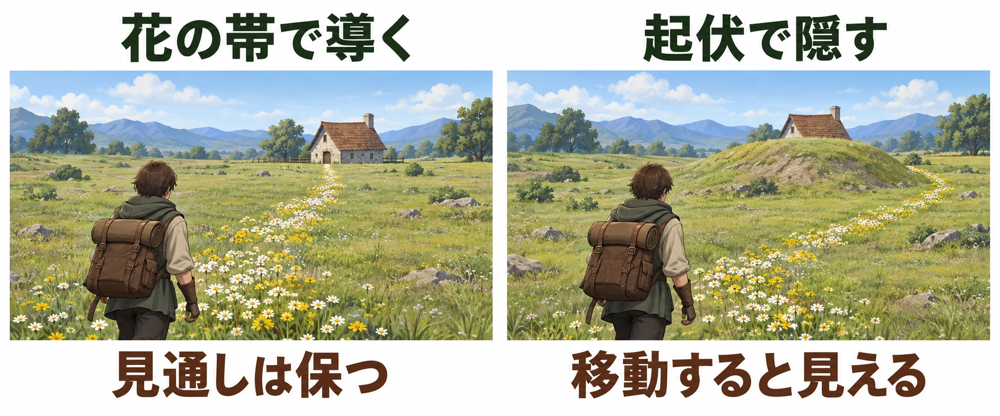

# 何もない広さを、何で満たすか――草原・平原の地形設計

[第3回「川は沿わせるか、渡らせるか」](open-world-terrain-design-rivers.md)では、水の流れとプレイヤーの移動を重ねて考えた。今回はその川を離れ、雨の少ない土地へ向かおう。視界の先に広がるのは、丈の低い草に覆われた大地だ。

オープンワールドの地形設計シリーズ第4回は、草原・平原を扱う。[第1回](open-world-terrain-design-prospect-refuge.md)の眺望－隠れ家理論に照らせば、本回の出発点は「眺望ばかりで、隠すものがない地形」である。ここでは、草に覆われた土地を草原、広く平らな地形を平原として、両者が重なる見通しのよい場所に注目する。

これは設計上の課題を取り出すための前提であり、草原すべてに起伏や樹木がないという意味ではない。[第2回の山](open-world-terrain-design-mountains.md)のように視界を遮るものや、前回の川のように進路を区切るものが少ない場所で、作り手は何を手掛かりに旅を組み立てるのか。

中心となる問いは、 **何もない広さを、何で満たし、何で導くか** である。まず草原が続く理由を確かめ、その上に置かれた風、草、花、鳥、そして馬の働きを、開発者の説明から読んでいく。

***

## 草原はなぜ草原なのか

### 雨の少なさが草原を作る――ステップ

**ステップ** は、半乾燥の土地に広がる丈の低い草原である。半乾燥とは、砂漠ほどではないが雨の少ない状態を指す。深石一夫氏が執筆した『日本大百科全書（ニッポニカ）』の「ステップ気候」は、これを砂漠気候に次いで乾燥した気候と説明している。[[1](#ref-1)]

気温や降水の特徴などで世界の気候を分ける **ケッペンの気候区分** では、記号はBSである。同項目によれば、年降水量はほぼ250～500ミリメートルで、年による変動が大きい。砂漠気候の周辺から、雨の多い湿潤気候へ移る間の地域に分布し、主に牧畜、つまり家畜を飼う営みが行われる。水を引ける場所では農耕も行われる。[[1](#ref-1)]

この降水量は、草原を置く際の一律の境界値として使う数字ではない。同項目も、乾燥・湿潤の境目となる「乾燥限界」との関係で定義している。ここで持ち帰りたいのは、 **森林が育ちにくい乾燥条件が、草原の広がりを支えている** という読み方だ。[[1](#ref-1)]

### 人の営みが草原を保つ――阿蘇

日本には、人が使い続けることで保たれてきた草原もある。阿蘇はその代表的な例だ。環境省は、阿蘇の草原を、千年以上にわたり放牧・採草・野焼きによって維持されてきた半自然草地と説明している。放牧は家畜を放して草を食べさせること、採草は餌などに使う草を刈り取ること、野焼きは草地に火を入れて枯れ草などを焼く作業である。[[2](#ref-2)][[3](#ref-3)]

こうした、人の働きかけによって形作られ、保たれる環境を **二次的な自然** という。阿蘇の現在の気候では、手を入れずにいると草原は森林へ移っていく。時間とともに、その場所に生える植物の集まりが変わることを **遷移（せんい）** と呼ぶ。野焼きなどの営みは、木が増える過程を抑え、草原を保つ働きをしている。[[3](#ref-3)]

環境省の解説は、阿蘇の草原面積が減少し続けていることも伝えている。草原を利用する人の減少や高齢化・後継者不足によって、維持のための作業が難しくなっているのである。目の前の開けた景色には、それを使い、手入れしてきた暮らしが重なっている。[[4](#ref-4)]

ここからは、架空の土地づくりに向けた本稿の考察である。草原を配置するとき、 **「雨が少ないから草原なのか」「人が使い続けているから草原なのか」** を決めると、周囲に置くものの理由を考えやすくなる。

前者なら、乾いた地面や牧畜の営みを組み合わせる。後者なら、放牧地と村のつながり、刈り取った草を集める場所、草を刈った跡や焼いた跡を描く、といった案が生まれる。どちらにも牧畜はあり得るため、家畜の有無だけで区別するのではなく、その土地で草原が続く理由と、生活の配置を結びつけるのだ。

***

## 見せすぎる問題――広い平原で行き先を選ぶ

草原が存在する理由が決まったら、次はプレイヤーがそこをどう読むかを考えたい。

『Ghost of Yōtei』のキャンペーン・ディレクター、Rob Davis氏は、2025年10月22日公開のGadgetGuyのインタビューで、北海道の大きく開けた野や盆地が、設計の出発点として必ずしも直感的ではなかったと述べている。広い場所で、どこから進路を考えればよいか。その手掛かりを作る必要があった。[[5](#ref-5)]

同作では、広さを見せる表現そのものにも力が注がれた。2026年3月10日の4Gamerのレポートは、現地時間3月9日にNate Fox氏とJason Connell氏が行ったGDC 2026講演を報じている。前作『Ghost of Tsushima』より遠くまで見渡せるように、カメラをやや引いて遠景を広く映し、その空間に遊びの内容を十分な密度で配置するバランスを探ったという。[[6](#ref-6)]

この二つの説明からの考察として、 **遠くまで見えることと、次の行き先を選びやすいことは、分けて検討したい。** 見通せる範囲を広げれば、旅の広がりを感じさせられる。一方、行き先の候補が並んだとき、何に注目すればよいかは別に伝える必要がある。

設計時には、遠くから見せる対象と、その間をつなぐ手掛かりを組にして確かめるとよい。建物や出来事の数を数えるだけでなく、「ここに立った人が、まずどこへ向かおうと思うか」を問うのである。

***

## 地形の代わりに導くもの――風、草、花、鳥

### 草の動きで、風を道案内にする

『Ghost of Tsushima』の **導きの風** は、世界の中の動きを道案内に使った例である。

2020年5月21日公開のAndroid Centralのインタビューで、Jason Connell氏は、羅針盤や小さな地図を画面に増やす代わりに、プレイヤーを世界へ没入させる方法を考えたと説明している。もともと風によってさまざまなものが動く表現があり、それを行き先へ導く仕組みに発展させた。地図自体は開ける一方、探索中の画面はできるだけ風景を見られる状態に保つ方針だった。[[7](#ref-7)]

その表現を支えたのが、風に合わせて動く複数の仕組みである。Bill Rockenbeck氏によるGDC 2021講演「Blowing from the West: Simulating Wind in 'Ghost of Tsushima'」の公式概要は、布、草、粒子の動きを連動させ、風向きの変化に世界が反応するようにしたと説明する。粒子とは、舞う小さなものなどを表現するために使う要素のことだ。[[8](#ref-8)]

この事例からの考察として、草原の草は「地面を覆う見た目」と「方向を伝える動き」を兼ねられる。風そのものは見えなくても、草がなびき、周囲のものが同じ風に反応すれば、進む向きを景色の中で読める。大きな矢印のような案内を画面に重ねる代わりに、風景を読む行為と移動を結びつける設計である。

### 花の帯で進路を描き、鳥で広がりに動きを与える

『Ghost of Yōtei』について、前述の4Gamerのレポートは、広い空間をただの空白にしないための工夫として、群れで飛び立つ鳥と、風景でありながら移動の案内にもなる「花の川」を紹介している。鳥が群れで飛び立つことと、花が進路を示すことは、広さを体験へ変える別々の工夫として読める。[[6](#ref-6)]

GadgetGuyのインタビュー記事では、白い花が馬を速く走らせるだけでなく、興味深い場所がありそうな方向を示すことも説明されている。花は眺める対象であり、そこを通る理由にもなっている。[[5](#ref-5)]

ここからの考察として、草原では、 **揺れる草や花の帯のような「地表を覆うもの」が、山や川の代わりに道を描ける。** 地面を大きく盛り上げたり、水で分断したりせずに、通ってみたい向きを示すのである。鳥の群れのような動きも、広い景色の中で目を向けるきっかけとして検討できる。

その際には、「導く」と「隠す」を区別したい。花の帯が進路を示しても、それだけで遠景を遮ったり、敵から身を守ったりできるわけではない。本稿の設計上の考察として、見晴らしを保つ場所は保ち、隠す必要のある場所には、建物や小さな起伏などを別に組み合わせる、と整理できる。草に身を隠す遊びを加える場合も、草の高さや敵からの見つかり方を別途決める必要がある。

方向を示すことと、視界を遮ることは別の働きである。本稿の考察に基づく架空の配置例。

***

## 広さの尺度を決めるもの――馬

行き先を示したら、そこまで渡る時間を考えよう。

『ELDEN RING』の宮崎英高氏は、2021年6月14日のファミ通のインタビューで、霊馬に乗る移動をオープンなフィールドに限ったアクションとして説明している。騎乗は、広く開けた場所での探索に組み込まれた移動手段だった。[[9](#ref-9)]

前節の『Ghost of Yōtei』の白い花も、行き先の案内と馬の加速を兼ねている。[[5](#ref-5)] こちらでは、どちらへ進むかと、そこをどの速さで進むかが、同じ花の配置に結びついている。

ここからは本稿の考察である。同じ距離でも、歩いて渡る場合と、馬で速く渡る場合とでは、次の場所へ着くまでの時間が変わる。新しい判断や出来事に出会わない区間があるなら、その「何もない時間」の長さも変わる。 **草原の広さは、乗り物の速さと組にして決める** という見方ができる。

たとえば、遠くの小屋へ向かう花の帯を置いたなら、想定する移動手段で実際にそこを走り、次に進路を選ぶ場所までの時間を確かめる。馬なら気持ちよく渡れる間隔でも、徒歩を多く使う場面なら、その途中で何を見るかを改めて検討することになる。

この考察が提案するのは、広さを距離だけで決めず、プレイヤーの移動と合わせて確かめる手順である。特定の作品の移動速度や配置間隔を、別のゲームへそのまま当てはめるための基準ではない。

***

## 何で満たし、何で導くかを決める

ここまでの事例を、草原を作るときの判断へ置き換えてみよう。以下は本稿の考察として整理した、検討の順序である。

1. **草原が続く理由を決める**：乾燥した気候によるものか、人が使い続けているものか。周囲の土地や、村・放牧地・手入れの跡を、その理由に合わせて配置する。
2. **見せるものと密度を決める**：何を遠くから見せ、何を置かない場所として残すか。見える行き先と、その間の移動を一緒に確かめる。
3. **地形の代わりに導くものを決める**：風、草、花、鳥の動きのうち、何に注目してほしいか。方向を示す役目と景色に動きを与える役目を分け、必要ならUI、つまり画面上の案内表示でも補う。
4. **渡る手段を決める**：徒歩か、馬か、別の乗り物か。その速さで移動したときの時間を確かめ、広さや配置へ戻って調整する。

最後に、第1回の物差しへ戻そう。次の表も、事例を草原・平原の設計に当てはめた考察である。

| 物差し | 草原・平原での問い | 確かめること |
| --- | --- | --- |
| 見せる | 広い視界の中で、何へ目を向けてほしいか | 遠くの行き先、花の帯、鳥の動きがどう見え、次の判断につながるか |
| 隠す | どこは見通しを保ち、どこには遮るものが必要か | 起伏や建物を置くなら、何がいつ見えるか。身を守る場所にもするか |
| 運ぶ | 何を頼りに、どの速さで渡ってほしいか | 風や花の案内と、徒歩・騎乗で次の場所へ着くまでの時間が合っているか |

草原を設計する出発点は、その広がりに理由を与えることだ。その上で、何を見せ、何に目を向けさせ、どの速さで渡ってもらうかを決める。開けた景色を支える自然や暮らしと、そこで進路を選ぶ手掛かりをつなぐことで、「何もない広さ」を旅の場所として組み立てられる。

次回はステップのさらに乾燥した側、雨がもっと少ない土地へ進み、砂漠とオアシスを取り上げる。

## References

1. [深石一夫「ステップ気候」][1] — 小学館『日本大百科全書（ニッポニカ）』、コトバンク掲載、公開日記載なし。BS気候、短草のステップ、年降水量ほぼ250～500ミリメートル、分布と牧畜の説明を参照。同ページ内の他の辞典の項目とは区別した。2026年10月2日確認。

[1]: https://kotobank.jp/word/すてつぷ気候-3156348

2. [環境省「阿蘇の草原の種類」][2] — 阿蘇くじゅう国立公園、公開日記載なし。千年以上の歴史と、放牧・採草・野焼きで維持される半自然草地の説明を参照。2026年10月2日確認。

[2]: https://www.env.go.jp/park/aso/effort/aso_2/index.html

3. [環境省「野焼きと草原維持の困難性」][3] — 阿蘇くじゅう国立公園、公開日記載なし。「野焼きとは」「野焼きをする目的」「草原維持の困難性」を参照。現在の気候条件での森林化と、人の営みによる維持についての説明。2026年10月2日確認。

[3]: https://www.env.go.jp/park/aso/effort/aso_1/index.html

4. [環境省「千年の草原を未来につなぐ」][4] — 阿蘇くじゅう国立公園・阿蘇山上ビジターセンター、公開日記載なし。「草原の危機」にある面積減少と維持管理の課題を参照。2026年10月2日確認。

[4]: https://www.env.go.jp/park/aso/data/mtasovc/sustaining-glasslands.html

5. [Chris Button「How Ghost of Yōtei avoids open-world trappings to draw players in」][5] — GadgetGuy、2025年10月22日。Sifterとの共同取材によるRob Davis氏へのインタビュー。「Space work」の発言と、白い花についての記者の説明を参照。

[5]: https://www.gadgetguy.com.au/ghost-of-yotei-rob-davis-interview/

6. [Junpoco「『Ghost of Yōtei』はどのように“さすらいの浪人”を描いたのか。チームでビジョンを共有するクリエイティブディレクション［GDC 2026］」][6] — 4Gamer.net、2026年3月10日。現地時間2026年3月9日のNate Fox氏・Jason Connell氏の講演「Does it Make You Feel Like a Wandering Ronin? Creative Direction for 'Ghost of Yōtei'」のレポート。カメラ、遠景とコンテンツ密度、鳥の群れ、「花の川」の説明を参照。

[6]: https://www.4gamer.net/games/840/G084044/20260310041/

7. [Jennifer Locke「Ghost of Tsushima interview: On why the game doesn't have waypoints, inspirations, and more」][7] — Android Central、2020年5月21日。Jason Connell氏へのインタビュー。導きの風、羅針盤・ミニマップと没入感、地図画面についての回答を参照。

[7]: https://www.androidcentral.com/ghost-tsushima-creative-director-interview

8. [Bill Rockenbeck「Blowing from the West: Simulating Wind in 'Ghost of Tsushima'」][8] — GDC 2021、2021年。GDC Vaultの公式講演概要を参照。風向きに反応する布・草・粒子の連動についての説明。

[8]: https://www.gdcvault.com/play/1027350/Blowing-from-the-West-Simulating

9. [コンタカオ（聞き手：林克彦）「『エルデンリング』国内独占インタビュー。フロム・ソフトウェア最大規模となる新しいダークファンタジーをディレクター宮崎英高氏が語る【E3 2021】」][9] — ファミ通.com、2021年6月14日。霊馬の騎乗移動をオープンなフィールドに限定するという、発売前の宮崎英高氏の説明を参照。

[9]: https://www.famitsu.com/news/202106/14223605.html

----

この文書は、Perplexity、Claude、OpenAI Codex の3つのAIの支援を受けて著述されたものです。引用画像を除き、MIT License にて提供されています。
