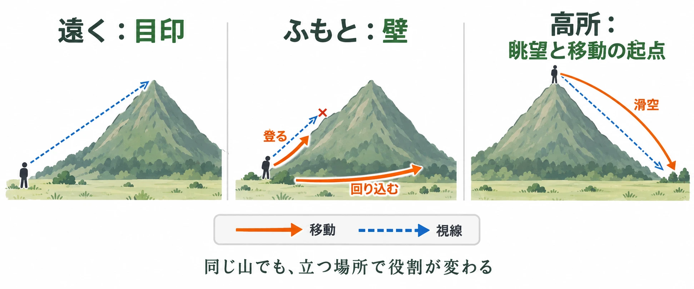
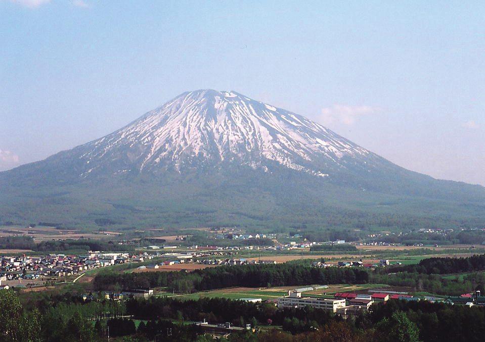

# 山はどこまで登らせるべきか――目印・壁・眺望の三つの顔から考える

遠くに見える山を頼りに進む。ふもとまで来ると、斜面が行く手と視界を遮る。そこを登れば、今度は周囲を見渡し、次の行き先を選べる。同じ山でも、プレイヤーとの距離や高さの関係によって、 **目印、壁、眺望と移動の起点** という三つの顔が現れる。

[第1回「地形は遊びに何をさせるか」](open-world-terrain-design-prospect-refuge.md)では、地形を「見せる・隠す・運ぶ」という物差しで整理した。「運ぶ」とは、地形によってプレイヤーの進み方を組み立てることである。

オープンワールドの地形設計シリーズ第2回は、この物差しを山に当てはめる。『ゼルダの伝説 ブレス オブ ザ ワイルド』（以下BotW）と『Ghost of Yōtei』を手がかりに、プランナーが決めるべき **「どこまで登れるようにするか」** を考えよう。

*山とプレイヤーの位置関係を整理した模式図。高所からの移動は、滑空できるゲームを想定している。*

***

## 遠くから――一つだけ立つ山は、方角の目印になる

### 羊蹄山の、周囲から浮かび上がる形

北海道南西部の羊蹄山は、気象庁の『日本活火山総覧』によれば、標高1898mの円錐形の成層火山である。東・北・西は尻別川が作った平地に囲まれている。[[1](#ref-1)] 成層火山とは、噴火を繰り返すうちに、溶岩や火山灰などが山頂の火口の周囲に積み重なってできた火山のことだ。[[2](#ref-2)]

総覧に掲載された北西側からの写真では、平地の向こうに山体が独立して立ち上がる様子を読み取れる。[[1](#ref-1)] このような姿を移動の手がかりとして考えると、山頂までの道を知らなくても、「あの山のある側」という方向の基準を持てる。これは地形の形をゲームの読みやすさへ結びつけた、本稿の考察である。

*画像出典（引用）：気象庁撮影、2003年5月18日。「羊蹄山全景 北西側から」『[日本活火山総覧（第4版）「16. 羊蹄山」](https://www.data.jma.go.jp/svd/vois/data/filing/souran/main/16_Yoteizan.pdf)』p.264。写真全体を掲載（WebP変換）。*

### 位置の手がかりに、物語の意味を重ねる

都市計画家ケヴィン・リンチ（Kevin Lynch）は、1960年に刊行した『The Image of the City』で、人が都市を頭の中で把握する手がかりを論じた。[[3](#ref-3)] その五つの要素の一つが、 **目印（landmarks）** である。建物や看板、山など、外から見て位置を確かめる基準になるものを指す。遠方の目印は、いろいろな角度や距離から見え、方向の手がかりにもなる。[[3](#ref-3)]

『Ghost of Yōtei』では、羊蹄山に物語上の意味も与えている。コークリエイティブ・ディレクターのNate Fox氏は、2025年5月15日のPlayStation Blogで、現地取材を通じて羊蹄山が開発チームにとって北海道の象徴となり、主人公・篤にとっては失った故郷と家族の象徴になったと説明している。[[4](#ref-4)]

ここからは、リンチの目印とFox氏の説明を重ねた考察である。遠くから方向をつかむ目印と、主人公が何を失ったのかを思い起こさせる目印は、一つの山に重ねられる。プレイヤーが山を見るたびに、土地の位置関係と物語の意味を一緒に受け取る、という読み方だ。

この段階では、山は見えるだけでも役割を持つ。では、近づいて斜面が目の前を占め始めたら、どのように働くのだろうか。

***

## 近づくと――山脈は、地域を分ける縁になる

### 境目が見えると、土地を区別しやすい

リンチの別の要素に、 **縁（edges）** がある。これは、二つの領域の間にある、線状の境目を指す。海岸や壁などが例であり、地域を隔てる障壁にも、二つの地域をつなぐ継ぎ目にもなる。越えられるかどうかだけでなく、「ここで土地のまとまりが切り替わる」と認識するための手がかりである。[[3](#ref-3)]

Justin Reeve氏は2018年9月19日のGame Developer掲載記事で、BotWのハイラルをリンチの五要素から分析した。五要素とは、道、縁、地域、結節点、目印である。Reeve氏はデスマウンテンなどを目印として、山脈や谷などを地域の境目として読み、異なる地域を見分けやすい構成に注目している。[[5](#ref-5)]

さらに同氏は、双子山の上から大きく異なる複数の地域を見渡せることを挙げ、BotWの地形では写実性よりも分かりやすさが選ばれていると論じた。これは **Reeve氏による作品分析** である。ここでは、任天堂がリンチを参照して制作したという開発経緯とは区別して読む。[[5](#ref-5)]

本稿の考察として、山を「壁」にする設計には、通行を制限する働きと、地域の違いを読ませる働きを分けて考えたい。登って越えられる山脈でも、その手前と向こうを別の地域として認識させることはできる。山の向こうを隠すことが、越えたときに土地の変化を見せる準備になる。

### 山の向こうで、空気も変わりうる

現実の山にも、両側で気温や湿り具合が変わる仕組みがある。その一つが **フェーン現象** だ。山を越えた風が、風下へ乾いた暖かい風として吹き下り、気温を上げる現象である。[[6](#ref-6)]

湿った空気が山の斜面を上がると冷やされ、水蒸気が小さな水滴になって雲を作り、雨を降らせる。水分を失った空気は、反対側の斜面を下りながら暖まる。気象庁「はれるんランド」の説明例では、上昇時は100mにつき0.6℃下がり、下降時は100mにつき1℃上がるとしている。これらは同ページが現象を説明するために用いた値である。[[7](#ref-7)]

この自然の仕組みを地形設計へ引き寄せるなら、山の手前と向こうで空気や土地の印象を変える際の、理由づけの一つになるという考察ができる。BotWの地域差をフェーン現象で説明するのではなく、現実の山が環境を分ける働きと、ゲームで地域を分ける働きを並べている。

山と乾燥した土地との関わりは、第5回の「砂漠とオアシス」で改めて扱う。

***

## 登るとき――山は、次の移動を選ぶ場所になる

### BotWは、壁を登るところから自由を広げた

GDC 2017の講演「Change and Constant: Breaking Conventions with 'The Legend of Zelda: Breath of the Wild'」では、従来の制約を見直す方針が説明された。GAME Watchの講演レポートによれば、藤林秀麿氏がまず着手したのは、それまで通行できなかった壁を登れるようにすることだった。従来は低い柵であっても別の道へ向かわせる制約となっていたが、壁を登れるようにすることで、プレイヤー自身に進路を選んでもらえる。受け身の遊びから、能動的な遊びへの転換である。[[8](#ref-8)]

講演では、高い壁を登った後、飛び降りて滑空できることも紹介された。BotWではパラセールで空を滑り降りられるため、登る行為と、その先へ移動する行為がつながっている。[[8](#ref-8)]

ここからは本稿の考察である。山を登れるようにすると、山頂は到着点であると同時に出発点にもなる。登る前には進路を遮っていた斜面が、登った後には次の場所へ向かうための高さになる。 **どこへ登らせるかと、そこからどこへ降りられるか** を一緒に考えると、山を一続きの移動として設計できる。

### 高さが変われば、周囲の木々も変わる

登る途中の景色を考える手がかりに、 **植生の垂直分布** がある。植生とは、その土地に生えている植物のまとまりのことだ。標高に応じてそのまとまりが変わる様子を、垂直分布と呼ぶ。

林野庁中部森林管理局の解説では、南アルプス南部の光岳（てかりだけ）周辺は、約1700mまでがイヌブナやミズナラなどの冷温帯の植生で、それより上はコメツガやウラジロモミなど、亜寒帯の針葉樹が分布する。冷温帯は温帯のうち比較的涼しい帯、亜寒帯はさらに寒い帯である。最上部の高山帯にはハイマツの群落などが見られる。ここでの高さは、光岳周辺についての値である。[[9](#ref-9)]

この変化をゲームの山に取り入れる場合について、次は考察である。登る途中には木々で視界が区切られる区間を置き、高所では背の高い木が減って見晴らしが開ける区間へつなぐ。そうすれば、高さの変化を植生と視界の両方で伝えられる。標高が上がるほど一律に木が減ると考えるのではなく、林を抜けて周囲が見えるようになる変化に注目する。ここで、第1回の「眺望」が、登る過程の到達先として戻ってくる。

### 『DEATH STRANDING』では、山を越えること自体が課題になる

山の上で視界が開く体験と並べて考えたいのが、視界を失いながら山を進む体験である。『DEATH STRANDING』の小島秀夫氏は、2019年10月9日のファミ通インタビューで、大きな雪山と、吹雪によるホワイトアウトについて語っている。ホワイトアウトとは、ここでは周囲が白く覆われ、地形や進路を見分けられなくなる状態のことだ。先が崖かもしれない状況を進む緊張があり、装備が増え、慣れてくると雪山への攻め方も変わるという。[[10](#ref-10)]

この発言をもとにした考察として、同作の山は「越えるべき課題」そのものとして読める。眺める位置に着くことに加え、見通しの悪さに向き合い、装備や経験を使って移動を成立させることが遊びになる。山をプレイヤーに開く際は、到着した先と、そこへ至る過程の両方が設計の対象となる。

***

## 判断の芯――登れる場所と、登った先の発見を組にする

### 『Ghost of Yōtei』が見送った自由登攀

2026年3月9日、GDC 2026でNate Fox氏とJason Connell氏が講演「Does it Make You Feel Like a Wandering Ronin? Creative Direction for 'Ghost of Yōtei'」に登壇した。中心にあったのは、さすらいの浪人として旅をする感覚を、開発判断の基準にするという話である。[[11](#ref-11)]

GamesRadarと4Gamerが伝える講演内容によれば、チームはBotWのように自由に壁を登れる、スタミナ制のクライミングを試作したが、最終的には採用しなかった。4Gamerによれば、地形にはあえて登れない場所やチョークポイント（通行が集中する狭い地形）が設けられており、どこでも登れそうに見えるのに登れないという誤解を生みやすかった。GamesRadarが伝えるFox氏の説明では、どこでも登れる手段を与えても、その先で何も見つからなければ、プレイヤーは探索に価値がないと感じ、登ることをやめるよう学習してしまうという。[[11](#ref-11)][[12](#ref-12)]

同作が選んだのは、決められたルートを登る仕組みである。4Gamerは、最終的に決められたルートを進む設計へ立ち返ったと伝えている。GamesRadarは記者の言葉として、前作『Ghost of Tsushima』と同じ決められた登攀ルートに戻すことで、探索に費やした時間に見合う報いを保証できる、とまとめている。比較すべきなのは、 **登れる範囲を広く開くことと、登る経路を定めて行き着く先を用意すること** である。[[11](#ref-11)][[12](#ref-12)]

### 自由を広げた分だけ、何に出会えるかを問う

ここからは、BotWの移動設計と、Fox氏が述べた不採用の理由を並べた本稿の考察である。[[8](#ref-8)][[11](#ref-11)][[12](#ref-12)]

**登れる範囲を広げるほど、登った先で見つかるものの量が問われる。** ここで数えるものには、宝箱のような報酬に加え、BotWの登攀と滑空が示すように、周囲を見て次の進路を選べることや、その場所から移動を始められることも含めて考えたい。

企画段階では、「山全体を登れるようにする」と決める前に、プレイヤーが登りそうな場所を具体的に歩いて確かめたい。そこで何を見つけ、次に何をするのかを追うためである。二作品の対照から、次の順序で問いを立てられる。

1. **遠くから何を期待させるか**：方角を確かめる山か、近づいて登りたくなる山か。
2. **どこを登れるようにするか**：広い斜面から自分で道を選べるのか、用意した経路をたどるのか。
3. **登った先で何を得るか**：新しい眺望、探索対象、次の移動先などを、その場所から具体的に確認できるか。

BotWの選択では、広いフィールドに登る・滑空する行動を組み合わせることが、移動の自由を支えた。『Ghost of Yōtei』の選択では、登れる範囲と発見の関係が、試作した機能を残すかどうかの判断に関わった。山のどこまで登らせるかは、 **その山でどんな探索を続けてほしいか** と組にして決める、というのが本稿の考察である。

***

## 山の三つの顔を、「見せる・隠す・運ぶ」で読む

本回の考察を、第1回の物差しへ戻して整理しよう。

| 山との関係 | 見せる | 隠す | 運ぶ |
| --- | --- | --- | --- |
| 遠くから見る | 輪郭を目印として、方角や土地の象徴を示す | 山の向こうにある土地を遮る | 山を基準に、進む方向を選ばせる |
| ふもとへ近づく | 斜面や、地域の境目を意識させる | 向こう側の様子や見通しを遮る | 登る、回り込む、用意された道を探す選択を作る |
| 高所へ登る | 周囲の眺望や次の行き先を渡す | 天候によっては、進路の見通しを奪う | 滑空などの出発点にも、越える課題にもなる |

山の価値は、遠くから見つけた瞬間から、近づき、登り、次の場所へ向かうまでの関係に現れる。目印として見せた山に、どこまで触れられるようにするのか。登れる場所には、どんな発見と移動の続きがあるのか。この二つを一緒に確かめることが、山を設計する出発点になる。

山に降った雨は谷を下り、川へと集まる。次回はその流れを追い、川が土地とプレイヤーの移動をどう形作るかを考える。

## References

1. [気象庁編「16. 羊蹄山」『日本活火山総覧（第4版）』][1] — 気象庁、2013年。p.264の概要および北西側からの全景写真を参照。

[1]: https://www.data.jma.go.jp/svd/vois/data/filing/souran/main/16_Yoteizan.pdf

2. [国土地理院「２．火山の活動による地形」][2] — 国土地理院、公開日記載なし。成層火山の定義と羊蹄山の項目を参照。2026年10月1日確認。

[2]: https://www.gsi.go.jp/kikaku/tenkei_kazan.html

3. [Kevin Lynch『The Image of the City』][3] — The Technology Press／Harvard University Press、1960年（現在の刊行元はMIT Press）。第3章、pp.46–48の五要素、特にedgesとlandmarksの定義を参照。リンク先は出版社の書籍案内（ペーパーバック版）。

[3]: https://mitpress.mit.edu/9780262620017/the-image-of-the-city/

4. [ネイト・フォックス「『Ghost of Yōtei』（ゴースト・オブ・ヨウテイ）の舞台はなぜ北海道？ サッカーパンチプロダクションズが明かす開発秘話」][4] — PlayStation Blog、2025年5月15日公開。羊蹄山と篤の故郷・家族についての説明を参照。

[4]: https://blog.ja.playstation.com/2025/05/15/20250515-goy/

5. [Justin Reeve「Realism and Legibility in Open-World Level Design」][5] — Game Developer、2018年9月19日。寄稿者による作品分析として参照。任天堂の制作意図を直接示す資料としては用いていない。

[5]: https://www.gamedeveloper.com/design/realism-and-legibility-in-open-world-level-design

6. [気象庁「気温、湿度」][6] — 気象庁（予報用語）、公開日記載なし。「フェーン現象」の項目の定義を参照。2026年10月1日確認。

[6]: https://www.jma.go.jp/jma/kishou/know/yougo_hp/kion.html

7. [気象庁「フェーン現象って何？」][7] — はれるんランド、公開日記載なし。上昇時100mあたり0.6℃、下降時100mあたり1℃という同ページの説明例を参照。2026年10月1日確認。

[7]: https://www.jma.go.jp/jma/kids/kids/faq/a5_21.html

8. [中村聖司「『ゼルダの伝説 ブレス オブ ザ ワイルド』が実現した“かけ算の遊び”」][8] — GAME Watch、2017年3月2日。GDC 2017講演のレポート。「壁を登り、飛ぶ」までの移動と、能動的なゲームデザインの説明を参照。

[8]: https://game.watch.impress.co.jp/docs/news/1047403.html

9. [林野庁中部森林管理局「1-3南アルプス南部光岳森林生態系保護地域【1511ha】」][9] — 林野庁、公開日記載なし。「設定目的」「地況・林況」を参照。2026年10月1日確認。

[9]: https://www.rinya.maff.go.jp/chubu/policy/business/conservation/hogorin/1-3.html

10. [オポネ菊池・林克彦「『デス・ストランディング』は他者と距離を置くことで人にやさしくなれるゲーム。小島秀夫監督インタビュー」][10] — ファミ通.com、2019年10月9日。雪山、ホワイトアウト、装備と慣れによる攻略の変化についての小島氏の発言を参照。

[10]: https://www.famitsu.com/news/201910/09184726.html

11. [Junpoco「『Ghost of Yōtei』はどのように“さすらいの浪人”を描いたのか。チームでビジョンを共有するクリエイティブディレクション［GDC 2026］」][11] — 4Gamer.net、2026年3月10日。講演は現地時間2026年3月9日。講演名、登壇者、開発判断の中心となる体験を確認。スタミナ制クライミングの不採用理由（登れない場所やチョークポイントによる誤解）と、決められたルートを進む設計への回帰を参照。

[11]: https://www.4gamer.net/games/840/G084044/20260310041/

12. [Ali Jones「Ghost of Yotei devs tried to add Zelda: Breath of the Wild-style rock climbing, but discovered 'rock climbing is not a core aspect of being a wandering ronin'」][12] — GamesRadar+、2026年3月10日。GDC 2026講演の報道。自由登攀の試作と不採用理由についてのFox氏の発言、決められた登攀ルートへ戻したという記者のまとめを参照。

[12]: https://www.gamesradar.com/games/open-world/ghost-of-yotei-devs-tried-to-add-zelda-breath-of-the-wild-style-rock-climbing-but-discovered-rock-climbing-is-not-a-core-aspect-of-being-a-wandering-ronin/

----

この文書は、Perplexity、Claude、OpenAI Codex の3つのAIの支援を受けて著述されたものです。引用画像を除き、MIT License にて提供されています。
