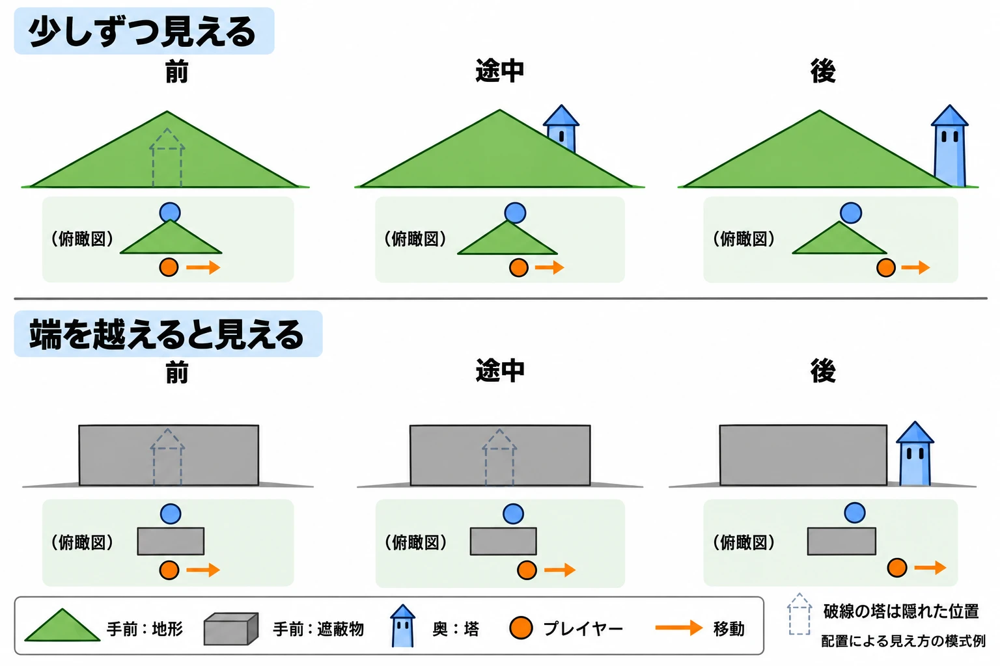
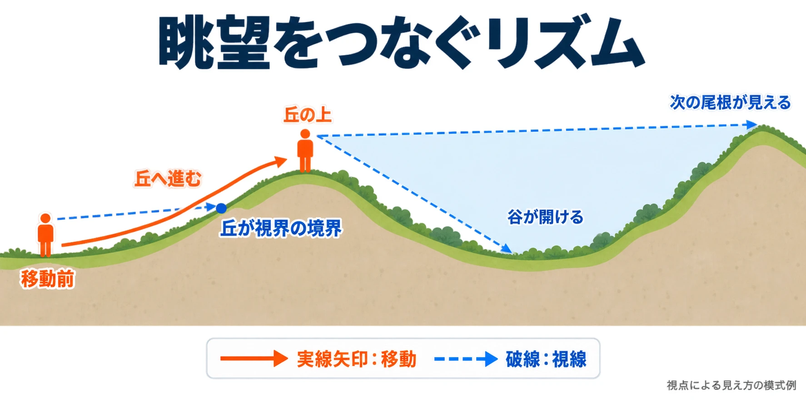

# 地形は遊びに何をさせるか――「見晴らし」と「隠れ場所」から読むオープンワールド

『ゼルダの伝説 ブレス オブ ザ ワイルド』（以下BotW）のフィールドには、移動するうちに次の行き先が目に入る仕組みがある。目指したのは、画面の中に何らかの目標が常に見えている状態だ。2017年8月31日のCEDEC 2017講演「『ゼルダの伝説 ブレス オブ ザ ワイルド』におけるフィールドレベルデザイン～ハイラルの大地ができるまで～」で、その設計が紹介された。登壇したのは任天堂の藤林秀麿氏と米津真氏。講演当時の公式プロフィールでは、藤林氏はディレクター、米津氏はアーティストで、BotWでは地形リードアーティストを担当したとされている。[[1](#ref-1)][[2](#ref-2)][[3](#ref-3)]

地形は景色であると同時に、 **プレイヤーの行動を決める設計の道具** である。山の高さや斜面の形は、何が見えるか、どちらへ進めるかを変える。この連載では、その働きを「見せる・隠す・運ぶ」という三つの問いで読んでいく。

第1回は、地形設計を考えるための物差しを作る回だ。[『オープンワールドゲームの歴史』](open-world-games-history.md)で触れた三角形の法則を、形と行動の関係まで掘り下げる。[『レベルデザイン入門』](level-design-introduction-practical-guide.md)で扱った空間による体験設計のうち、今回は山や丘など、 **地形の形そのもの** に焦点を当てよう。

***

## 見渡せることと、身を守れること

見晴らしのよい場所に立てば、周囲の様子を確かめられる。一方、身を隠せる場所には、外の危険から距離を取れる利点がある。この二つを景観の魅力に結びつけたのが、地理学者ジェイ・アップルトン（Jay Appleton）の **眺望－隠れ家理論（prospect-refuge theory）** だ。1975年の著書『The Experience of Landscape』で示された理論で、マーク・ボナーの論文は、その枠組みを眺望・隠れ家・危険の三要素として紹介している。[[4](#ref-4)]

| 要素 | 平易にいうと | 場所を読むときの問い |
| --- | --- | --- |
| 眺望（prospect） | 周囲を見渡せること | ここから何を確かめられるか |
| 隠れ家（refuge） | 身を隠し、守れること | どこなら危険を避けられるか |
| 危険（hazard） | 身を脅かすものや条件 | 何に備える必要があるか |

アップルトンは、こうした景観への反応を、生存のために周囲を探り、身を守ってきた人間のあり方と結びつけた。眺望－隠れ家理論は、こうした反応から、人がどんな景色を好むかを説明しようとする理論である。[[4](#ref-4)]

レベルデザイン、つまり空間の配置によって遊びを組み立てる分野でも、この考え方は扱われている。クリストファー・トッテン（Christopher W. Totten）の『An Architectural Approach to Level Design』第2版（2019年）は、第6章に眺望と隠れ家の空間設計を扱う節を置く。目次には両者を組み合わせた経路や、建築・ゲームでの例が並ぶ。眺望と隠れ家は、空間の連なりを考える手法の一つとして位置づけられている。[[5](#ref-5)]

ここで、本稿の考察として一つ区別を置きたい。 **自分が隠れられることと、行き先が隠れていることは、別の働きである。** 岩陰が敵から身を守るなら「隠れ家」だが、丘が遠方の塔を隠すなら、変わるのは目標の見え方だ。以降では、この違いを保ったまま、視界と移動の関係を見ていく。

***

## 三角形の法則――遮り、少しずつ見せ、選ばせる

### 山の向こうを、移動に合わせて開く

BotWの「フィールド三角形の法則」は、山や丘の三角形の輪郭を、探索の組み立てに使う考え方だ。地形が向こう側を隠すことを **遮蔽** という。三角形の地形に近づき、登ったり横へ回り込んだりすると、それまで遮られていたものが少しずつ視界に入る。講演レポートでは、この段階的な見え方が重視されている。[[2](#ref-2)][[3](#ref-3)]

たとえば、塔を目指す途中に丘がある。丘に差しかかると、正面から登るか、左右へ迂回するかを選ぶことになる。そして選んだ道を進むうちに、奥の建物や気になる場所が見え始める。地形の形が、 **進路の選択と、新しい目標の発見を一緒に生む** のだ。[[3](#ref-3)][[6](#ref-6)]

四角い形は、別の見せ方に使える。講演では、その裏に敵やアイテムを隠し、急に現れたように感じさせる用途が紹介された。三角形による緩やかな開示と、四角形による驚きという対比である。形を使い分けることで、発見の調子も変えられる。[[6](#ref-6)][[7](#ref-7)]

講演レポートの説明をもとにした模式図。破線の塔は隠れた位置を示す。見え方は地形と対象、視点の配置によって変わる。[[2](#ref-2)][[3](#ref-3)][[6](#ref-6)][[7](#ref-7)]

### 大・中・小で、受け持つ仕事を変える

三角形の大きさにも役割がある。ファミ通とNintendo DREAMのレポートが伝える区分を整理すると、次のようになる。ここでいうランドマークとは、位置や進行方向をつかむための目印だ。[[6](#ref-6)][[7](#ref-7)]

| 大きさ | 主な役割 | プレイヤーとの関わり |
| --- | --- | --- |
| 大 | 遠方のランドマークになる | 大きな移動の目当てになる |
| 中 | 奥の風景やルートを遮る | 登る・迂回する選択や、途中の発見を作る |
| 小 | 細かな操作を促す | 移動や探索に操作の手応えを加える |

小さな起伏まで含めて考えると、地形設計は「何を見るか」から「どう操作するか」へつながる。講演では、コログを探す場所などで、カメラを動かしたりジャンプしたりする入力を増やし、探索した満足感を持たせる工夫が説明された。[[6](#ref-6)]

また、大きな地形と周囲の小さな地形を組み合わせ、遠くの目標と近くの起伏が同じ画面に入るようにする。さまざまな方向から歩いてくるプレイヤーに対し、こうした大小の関係を成立させていた。[[2](#ref-2)][[7](#ref-7)]

***

## 見えた先に、行きたくなる理由を置く

地形が何かを見せたとき、その場所にはどんな魅力があるのか。BotWの講演では、プレイヤーが自分から近づきたくなる力を **引力** と呼んでいた。塔なら周辺の地図、馬宿なら馬の登録や宿泊・情報収集、祠なら成長につながる報酬、敵の拠点なら武器などの獲得が、足を向ける理由になる。[[3](#ref-3)][[7](#ref-7)]

塔の上から周囲の場所を見つけ、気になる場所へ向かう。その途中で、近づいて初めて分かる別の魅力にも出会う。塔から見下ろした風景が強化され、近づくとまた新たな場所が見つかるよう設計されていた。[[2](#ref-2)][[3](#ref-3)]

引力の強さは状況でも変わる。成長を急ぐプレイヤーには祠や敵の拠点が重要になり、夜には灯りのある塔や馬宿の引力が高まる。地形の向こうに同じ場所があっても、そのとき何が目立ち、何を欲しているかで、選ぶ行き先が変わるのである。[[3](#ref-3)][[7](#ref-7)]

この仕組みからの考察として、地形を評価するときには「何が見えるか」に続けて、 **「それを見た人は、何を期待して向かうのか」** を問いたい。遮蔽の形と、見せる対象の役割を一緒に考えることで、発見から移動までをつなげて検討できる。

***

## 距離と時間の感覚を、歩いて確かめる

見える目標を配置するには、どれほど遠くに置くかという基準も必要になる。BotWでは距離感をつかむため、開発者になじみのある京都が物差しになった。GAME Watchは、企画スタッフと歩き回ったことや、京都の地図をゲーム内に置き、二条城までの距離や、御所から京都タワーがどのくらい離れて見えるかを検討したことを報じている。こうして広さの見当をつけ、ハイラル全体の大まかな地形を3DCGで試作して、歩行や見え方を検証した。[[2](#ref-2)][[3](#ref-3)]

さらに、ひとまとまりの遊びにかかる時間、講演でいう「尺感」の検証には、実在の城や観光名所の簡易モデルが使われた。ダンジョンや基地に見立てて動き、攻略や移動の長さを確かめるのである。Nintendo DREAMのレポートには、姫路城のモデル内をリンクが走る映像も紹介されている。[[3](#ref-3)][[7](#ref-7)]

この事例からの考察として、地形の設計図には、形と配置に加えて **歩いたときの時間** を読み込む必要がある。次の目標が見え始めるまでにどれだけ移動するのか。その間に登る、曲がる、立ち止まるといった操作があるのか。見せ方を検討した後は、実際の移動を通して、その間隔を確かめたい。

***

## 地平線から地平線へ、眺望を重ねる

マーク・ボナー（Marc Bonner）はDiGRA 2018の論文「On Striated Wilderness and Prospect Pacing」で、丘、山頂、谷の側面などをたどり、次の眺望へ進むことが探索をリズムづけると論じている。本稿では **眺望をつなぐリズム（prospect pacing）** と呼ぼう。主な分析対象は『Horizon Zero Dawn』だ。[[4](#ref-4)]

論文には、丘の向こうに廃墟となった風力発電設備が見え、丘を越えると広い谷が開け、周囲の崖や尾根が次の地平線になる例がある。ここでいう地平線は、空と陸を分ける遠景の線に加え、丘や尾根が作る視界の境界でもある。境界へ進むたびに、新しい広がりが見えてくる。[[4](#ref-4)]

ここからは、BotWの事例と並べた本稿の考察である。三角形の法則は、 **一つの地形の周囲で、移動に応じて見え方をどう変えるか** という作り手の説明として読める。眺望をつなぐリズムは、 **そうした視界の変化が、探索の道のりでどう連なるか** を読む研究者の言葉だ。両者には、移動が眺めを変え、その眺めが次の移動を促すという共通の構造を見いだせる。

ただし、これらは制作手法の紹介と作品分析という異なる立場の説明である。ここでは、同じ構造を異なる言葉で比較している。BotWの開発がこの理論に基づいた、あるいは論文が三角形の法則を理論化した、という影響関係を述べるものではない。

ボナーの論文で述べられた視界と移動の関係を整理した模式図。特定作品の地形や、探索の必須経路を示すものではない。[[4](#ref-4)]

***

## その地形は、何を見せ、何を隠し、どう運ぶか

ここまでの事例を踏まえ、この連載では次の三つを地形を読む物差しとする。これは本稿の考察に基づく整理であり、既存理論の正式な分類名ではない。

| 働き | 問いかけること | 本回の例 |
| --- | --- | --- |
| 見せる | どんな眺望を与え、次の判断に何を渡すか | 高所から移動先の候補を見渡す |
| 隠す | 何を遮り、どこまで動くと見せるか。身を守れる場所にもなるか | 丘の向こうの目標を、移動に合わせて見せる |
| 運ぶ | 移動の方向、方法、操作をどう変えるか | 登るか迂回するかを選ばせ、小さな起伏で操作を変える |

「運ぶ」とは、地形によってプレイヤーの進み方を組み立てることだ。一つの丘は、向こう側を隠し、登るか回るかを選ばせ、進んだ先で新しい景色を見せられる。三つの働きは、一つの地形の中に重なってよい。

次にゲームの中で気になる地形を見つけたら、少し進む前と後で景色を比べてみよう。何が隠れ、何が新しく見え、そのために進路を変えたのか。この問いからなら、プレイヤーとしての実感を設計の言葉へ移せる。

次回は山を取り上げる。その後は川、草原／ステップ、砂漠とオアシスへ進み、最後に地形を規則によって作る「手続き的生成」を扱う。地形ごとの違いを、「見せる・隠す・運ぶ」という同じ物差しで読んでいこう。

## References

1. [CEDEC 2017公式サイト「『ゼルダの伝説 ブレス オブ ザ ワイルド』におけるフィールドレベルデザイン～ハイラルの大地ができるまで～」][1] — CESA、2017年8月31日開催。講演日時、登壇者の肩書き・担当を参照。

[1]: https://cedec.cesa.or.jp/2017/session/GD/s59007c6395fd6.html

2. [岩泉茂「【CEDEC2017】『ゼルダ』のマップは京都から始まった！？ 『ゼルダの伝説 ブレス オブ ザ ワイルド』におけるフィールドレベルデザイン」][2] — GAME Watch、2017年9月1日。講演内容は本レポートを通じて参照。

[2]: https://game.watch.impress.co.jp/docs/news/1078569.html

3. [米澤崇史「【CEDEC 2017】『オープンエア』の世界はこうして作られた―『ゼルダの伝説 ブレス オブ ザ ワイルド』におけるフィールドレベルデザインの講演をレポート」][3] — Gamer、2017年9月1日。講演内容は本レポートを通じて参照。

[3]: https://www.gamer.ne.jp/news/201709010048/

4. [Marc Bonner「On Striated Wilderness and Prospect Pacing: Rural Open World Games as Liminal Spaces of the Man-Nature Dichotomy」][4] — Proceedings of DiGRA 2018 Conference: The Game is the Message、2018年。DiGRA Digital Library掲載PDF本文、特にpp.5–6を参照。Appleton『The Experience of Landscape』（1975年）の理論は本論文による紹介に基づく。

[4]: https://dl.digra.org/index.php/dl/article/download/938/938/935

5. [Christopher W. Totten『An Architectural Approach to Level Design』第2版][5] — A K Peters/CRC Press（Routledgeの書籍案内）、2019年。出版社の書籍情報に掲載された目次を参照。第6章の眺望と隠れ家を扱う節の位置づけを確認し、同章本文からの直接引用は行っていない。

[5]: https://www.routledge.com/Architectural-Approach-to-Level-Design-Second-edition/Totten/p/book/9781351116305

6. [ファミ通.com「『ゼルダの伝説 BotW』自然と寄り道してしまうレベルデザインのカギは、“引力”と“地形”！ 魅力的なハイラルができるまでを解説【CEDEC 2017】」][6] — ファミ通.com、2017年8月31日。三角形の大小と四角形の用途など、講演内容を報じた記事を参照。

[6]: https://www.famitsu.com/news/201708/31140870.html

7. [平原学「CEDEC2017『開発スタッフから学ぶ「BotW」の設計』（2017年11月号より）」][7] — Nintendo DREAM WEB、2018年7月21日公開、2023年4月8日更新。『ニンテンドードリーム』2017年11月号の講演レポート再掲。

[7]: https://www.ndw.jp/post-1121/

----

この文書は、Perplexity、Claude、OpenAI Codex の3つのAIの支援を受けて著述されたものです。引用画像を除き、MIT License にて提供されています。
