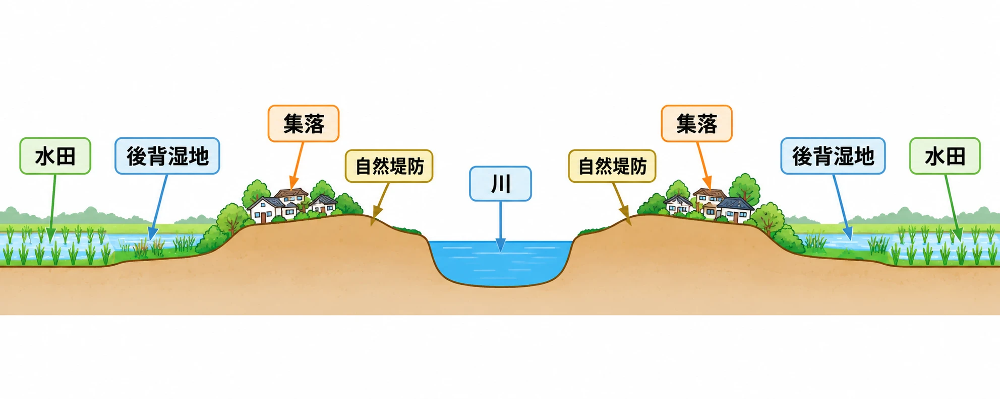
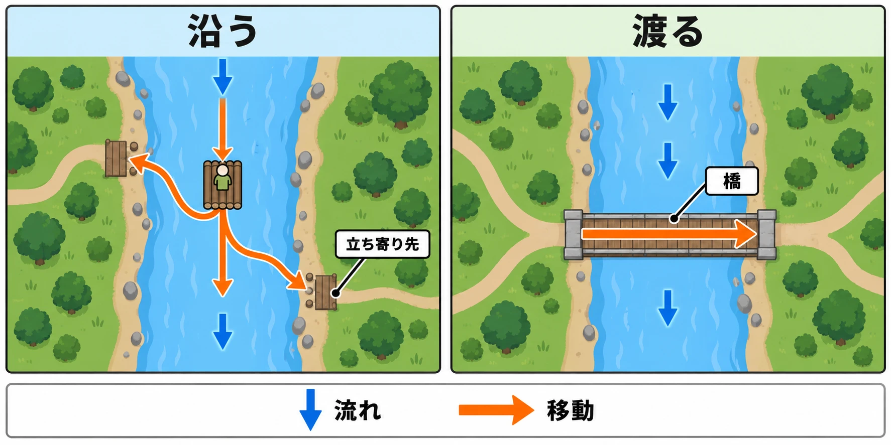

# 川は沿わせるか、渡らせるか――流れの向きから考える地形設計

山に降った雨は谷を下り、川へと集まる。[第2回「山はどこまで登らせるべきか」](open-world-terrain-design-mountains.md)の結びから、その水の行き先を追ってみよう。

『Far Cry 5』のテクニカルアーティスト、Ubisoft MontréalのÉtienne Carrier氏は、2018年3月22日のPlayStation Blogで、自然のつながりを地形づくりへ取り入れたと説明している。山が雨を集めて小川・川・湖へ送り、その水が土地を削り、周囲の植生に影響する。この関係を踏まえ、水系や崖、植物を作る **手続き的生成** 、つまりルールに従って地形や配置を自動で作る仕組みを組み合わせたのである。[[1](#ref-1)]

川は、 **流れる向きを持つ地形** である。その流れに沿って進むのか、横切って向こう岸へ渡るのか。そして、そのほとりのどこに暮らすのか。オープンワールドの地形設計シリーズ第3回では、川との関わりをこの三つに分けて考える。[第1回](open-world-terrain-design-prospect-refuge.md)の物差し「見せる・隠す・運ぶ」のうち、とりわけ「運ぶ」が具体的な形を取る回だ。

中心となる問いは、 **その川を沿わせる道にするか、渡らせる境目にするか。渡れる場所をいくつ、どこに置くか** である。

***

## 沿う――流れが道になり、時間を進める

The Molasses Floodの『The Flame in the Flood』は、いかだで川を下りながら生き延びるゲームだ。オープンワールド全般の代表例としてではなく、川の流れを移動の中心に据えた設計例として見てみよう。

2015年8月12日掲載のGame Developerのインタビューで、リードデザイナーのForrest Dowling氏は、家や拠点を作ることよりも旅に関心があり、そこから川という案が生まれたと語っている。川は、描きたい体験に合わせて選ばれた地形だった。[[2](#ref-2)]

いかだで流れに乗ると、下流への移動が続く。岸に立ち寄って物資を探すことはできるが、水上では流れに対して操縦しなければならない。Dowling氏は、流れを完全には支配できない感覚と、それでも自分で操作できる感覚の両立を課題として挙げている。また、川沿いのどこを訪ねるかは、ある場所を選ぶとほかを選べなくなる判断だとも説明する。[[2](#ref-2)]

ここからは本稿の考察である。 **流れは移動先をつなぐと同時に、選べる機会を通り過ぎさせる。** 岸や島が見えたとき、どこへ寄るかを決める必要がある。選び終えるまで風景が待ってくれるわけではない。この意味で、川は旅の時間も先へ進めている。第1回で述べた「地形によって進み方を組み立てる」という「運ぶ」の働きが、文字どおりの水流として現れる例だ。

GDC 2016でDamian Isla氏が行った講演「Forging The River in 『The Flame in The Flood』」の公式概要も、川をプレイヤー体験全体の背骨と位置づけている。概要には、川を生成する仕組みと、異なる時間の長さにわたる遊びの目標との密接な関係を扱うとある。川の自動生成は、旅の体験を成立させるための仕組みとして説明されている。[[3](#ref-3)]

***

## 渡る――川が地域を分け、橋が次の土地への入口になる

川を横切る立場に変わると、今度は両岸の間にある境目が目に入る。

ケヴィン・リンチの『The Image of the City』（1960年、MIT Press）でいう **縁（edges）** は、二つの領域を隔てる線状の境目であり、障壁にも、両側をつなぎ合わせる継ぎ目にもなる。第2回で山脈に当てはめたこの考え方は、川にも使える。[[4](#ref-4)]

Justin Reeve氏は2018年9月19日のGame Developerの記事で、『ゼルダの伝説 ブレス オブ ザ ワイルド』（以下BotW）のハイラルを分析し、川・谷・山脈を地域を隔てる地形として読んでいる。これはReeve氏による作品分析であり、任天堂の制作意図を直接説明したものではない。[[5](#ref-5)]

### 橋を渡ることが、難しさの切り替わりを伝える

地域の境目をさらに分かりやすくする例として、初代『ドラゴンクエスト』の橋を見てみよう。

多根清史氏は、2016年6月20日の電ファミニコゲーマーのコラムで、橋が地域と敵の強さの区切りになる構造を分析している。同じ地域にはおおむね同程度の強さの敵が現れ、橋の先へ進むことが、より強い敵に備える合図になるという読み方だ。[[6](#ref-6)]

同コラムは、それ以前の『ウルティマ』風の平面マップを持つコンピューターRPGには、同じ地域に弱い敵と強い敵が混在する作品がよくあったと述べる。その対比から、ドラクエの橋は平面の地図に難易度の段階を与えるものとして論じられている。ここで紹介しているのは多根氏の分析である。[[6](#ref-6)]

これらを合わせた本稿の考察として、川を渡る場面には、 **「ここから先は別の地域だ」と伝える働き** を持たせられる。第2回の山脈と同じく、土地を分ける形が地域のまとまりを読み取る手がかりになる。橋はその境目を越える場所なので、先へ進む判断を一か所に結びつけやすい。

***

## ほとりに住む――水が作った土地に、暮らす場所を置く

川沿いに村を置くときは、水面だけでなく、その周囲の小さな高低差にも目を向けたい。川が運んだ土砂は、両岸にさまざまな土地を作る。

### 山あいから平野へ

国土地理院「治水地形分類図の内容」をもとに、山から平野へ流れを追ってみよう。狭い谷を出た場所には、川の運んだ土砂が谷の出口を頂点として扇のように広がる **扇状地** ができる。山の斜面に比べて、比較的緩やかな地形である。[[7](#ref-7)]

平野へ目を移すと、川が土砂を積もらせて作った、起伏の小さい低い土地がある。同図では、こうした土地を **氾濫平野** として扱う。さらに河岸には、洪水が運んだ土砂によって、周囲よりわずかに高い **自然堤防** ができる。その背後などに広がる、周囲より低く湿った土地が **後背湿地** だ。[[7](#ref-7)]

ここで位置関係を押さえよう。扇状地から平野へ、という上流側から下流側への見方に加え、平野では川から横へ目を向けると、自然堤防とその背後の低湿地という違いが見える。

### わずかに高い場所に、集落が連なる

国土交通省が公開する土地履歴調査の教材「氾濫原と人々の暮らし」は、明治時代の埼玉県川口市周辺について、土地利用と地形を重ねている。教材では、線状に連なる集落の建物用地が自然堤防の分布と一致し、微高地、つまり周囲より少し高い場所に住むことで水害を避けていたと説明される。一方、水田は氾濫原低地・湿地に分布し、水はけの悪い土地を利用していた。[[8](#ref-8)]

ここからはゲームへの応用についての考察である。 **川沿いの村や拠点を、周囲よりわずかに高い土地に置く** と、現実の地形と暮らしの関係に沿った配置になる。自然堤防の高まりに家々を並べ、その背後の後背湿地を水田として表す、といった組み立てが考えられる。

川のそばに暮らす理由を、建物の説明文だけでなく、家と水田の高さの違いでも示せるわけだ。自然堤防は大規模な洪水では浸水しうる地形でもあるため、ここで示すのは「比較的安全な少し高い土地を選ぶ」という関係であり、洪水から完全に守られた土地として描くものではない。[[7](#ref-7)]

*地形の定義と土地利用の資料を踏まえたゲーム用配置の模式図。高低差は模式的に示しており、川口市の実測断面ではない。*

***

## 判断の芯――道にするか、境目にするか

ここまでの事例を設計の問いに移すと、最初に決めたいのは **その川で、どちら向きの移動を主な遊びにするか** である。以下は、開発者の説明と作品分析、地形資料を踏まえた本稿の考察だ。

流れに沿わせるなら、『The Flame in the Flood』のように、移動中に何を選ばせるかが中心になる。どの岸へ寄れるか、通り過ぎると何を見逃すかを、流れと立ち寄り先の関係で考える。ほとりの村は、その旅の目的地や途中の立ち寄り先として組み込める。

横切らせるなら、川でどの地域を隔て、どこで接続するかが中心になる。リンチの「縁」と多根氏の橋の分析を踏まえると、 **渡れる場所の数と位置は、地域間の関所や移動経路の数と位置を決める** と考えられる。ここでいう関所は、先へ進む経路が絞られる場所という意味である。

たとえば、両岸を結ぶ方法が橋だけなら、橋を絞るほどプレイヤーの通る場所を集められる。離れた場所にも浅瀬や渡し舟を置けば、違う入口から向こう岸へ進める。泳いでどこでも渡れる設定なら、その移動も含めて考える必要がある。数える対象は、橋の本数よりも **実際に使える渡り方と渡る場所** だ。

位置も大切になる。川沿いの村の近くに橋を置けば、立ち寄りと地域の横断を同じ場所につなげられる。村から離せば、補給してから渡りに向かう道のりを作れる。これは配置を検討するための考察上の例であり、橋を増やすほどよい、減らすほどよいという一律の答えではない。

設計時には、次の順に確かめると判断を具体化できる。

1. **主な向きを決める**：流れに沿って旅を続けてほしいのか、対岸へ渡って地域を変えてほしいのか。
2. **渡れる場所を記す**：橋、浅瀬、渡し舟など、使える移動手段も含めて地図に置く。
3. **行き先との関係を見る**：村や拠点から渡る場所までの経路と、渡った先で何が変わるかを確かめる。

同じ川に、道と境目の両方の役割を持たせてもよい。その場合も、いま設計している場面で、どちら向きの判断をプレイヤーにしてほしいかを定めることが出発点になる。

*川を「沿う道」と「渡る境目」として使う架空の配置例。橋や立ち寄り先の描画数は推奨個数を示すものではない。*

***

## 川との関わりを、「見せる・隠す・運ぶ」で読む

最後に、第1回の物差しへ戻して整理しよう。次の表は、本回の事例を設計の問いに置き換えた考察である。「隠す」については、川だけに遮蔽を求めず、川岸や周囲の地形との組み合わせを問う。

| 川との関わり | 見せる | 隠す | 運ぶ |
| --- | --- | --- | --- |
| 沿う | 次に寄れる岸や島を、いつ見せるか | 岸や周囲の地形で、先の立ち寄り先が見えない区間をどう扱うか | 下流への流れと操縦で、立ち寄る場所を選ばせる |
| 渡る | 対岸の地域と、渡れる場所をどう示すか | 対岸の何を見せ、周囲の地形で何を隠すか | 橋や浅瀬へ導き、地域を移る場所を作る |
| ほとりに住む | 高まりの上の集落と、低い土地の使い方を示す | 川岸の高低差や建物で、拠点への見通しがどう変わるか | 川沿いの旅や横断の経路を、村や拠点につなぐ |

川を設計するときは、水の流れる向きに、プレイヤーの移動を重ねてみよう。沿わせるなら、何を選びながら先へ進ませるか。渡らせるなら、どこで次の地域へ送り出すか。そして、その道のりに置く村は、どんな土地の上にあるか。この問いを重ねると、川の形と遊びのつながりを考えられる。

次回は川から離れ、雨の少ない土地へ向かい、草原・ステップの広がりを「見せる・隠す・運ぶ」で読んでいく。

## References

1. [Étienne Carrier「The Procedural World Generation of Far Cry 5」][1] — PlayStation Blog、2018年3月22日。山・水系・侵食・植生の関係と、生成ツールの説明を参照。

[1]: https://blog.playstation.com/2018/03/22/the-procedural-world-generation-of-far-cry-5/

2. [Game Developer掲載インタビュー「How The Flame in the Flood builds tension through motion」][2] — Game Developer、2015年8月12日。Forrest Dowling氏へのインタビュー。旅を中心とした構想、流れの操作感、立ち寄り先の排他的な選択についての発言を参照。

[2]: https://www.gamedeveloper.com/design/how-i-the-flame-in-the-flood-i-builds-tension-through-motion

3. [Damian Isla「Forging The River in 『The Flame in The Flood』」][3] — GDC 2016、2016年。GDC Vaultの公式講演概要を参照。講演映像の詳細には踏み込んでいない。

[3]: https://www.gdcvault.com/play/1023266/Forging-The-River-in-The

4. [Kevin Lynch『The Image of the City』][4] — MIT Press、1960年。第3章のedgesの定義。リンク先は出版社の書籍案内で、初版ハードカバーは1960年、ペーパーバックは1964年と記載されている。

[4]: https://mitpress.mit.edu/9780262620017/the-image-of-the-city/

5. [Justin Reeve「Realism and Legibility in Open-World Level Design」][5] — Game Developer、2018年9月19日。川・谷・山脈を地域の縁として読む、寄稿者自身の作品分析を参照。

[5]: https://www.gamedeveloper.com/design/realism-and-legibility-in-open-world-level-design

6. [多根清史「ドラクエで堀井雄二はいかに“編集”したか？――初代ドラクエの『1泊2日観光ツアー』革命【ゲーム語りの基礎教養：第二回】」][6] — 電ファミニコゲーマー、2016年6月20日。「『橋』によるレベルデザイン」の節を参照。橋と難易度の関係は同氏の分析として紹介している。

[6]: https://news.denfaminicogamer.jp/column03/game-gatari02

7. [国土地理院「治水地形分類図の内容」][7] — 国土地理院、公開日記載なし。「扇状地」「氾濫平野」「後背湿地」「微高地（自然堤防）」の定義を参照。2026年10月2日確認。

[7]: https://www.gsi.go.jp/bousaichiri/bousaichiri41051.html

8. [国土交通省「氾濫原と人々の暮らし」][8] — 国土交通省・国土調査の地理教育用教材、公開日記載なし。教材内のp.15を中心に、川口市周辺の土地利用と自然堤防の比較を参照。教材の水田立地の表記は「氾濫原低地・湿地」。地理院地図の土地履歴調査の図を用いた教材である。2026年10月2日確認。

[8]: https://nlftp.mlit.go.jp/kokjo/inspect/landclassification/land/teaching_material_2.pdf

----

この文書は、Perplexity、Claude、OpenAI Codex の3つのAIの支援を受けて著述されたものです。引用画像を除き、MIT License にて提供されています。
