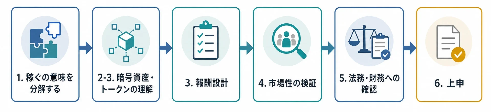
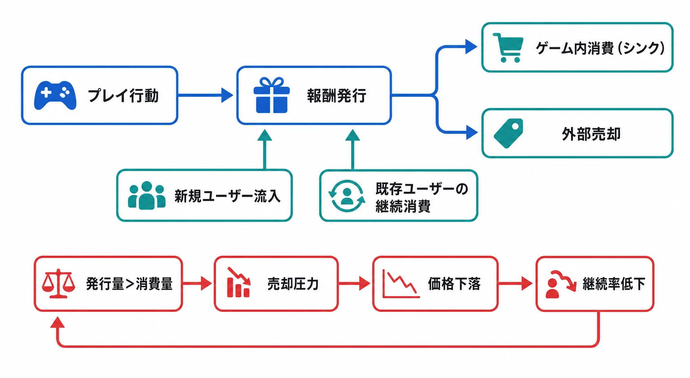
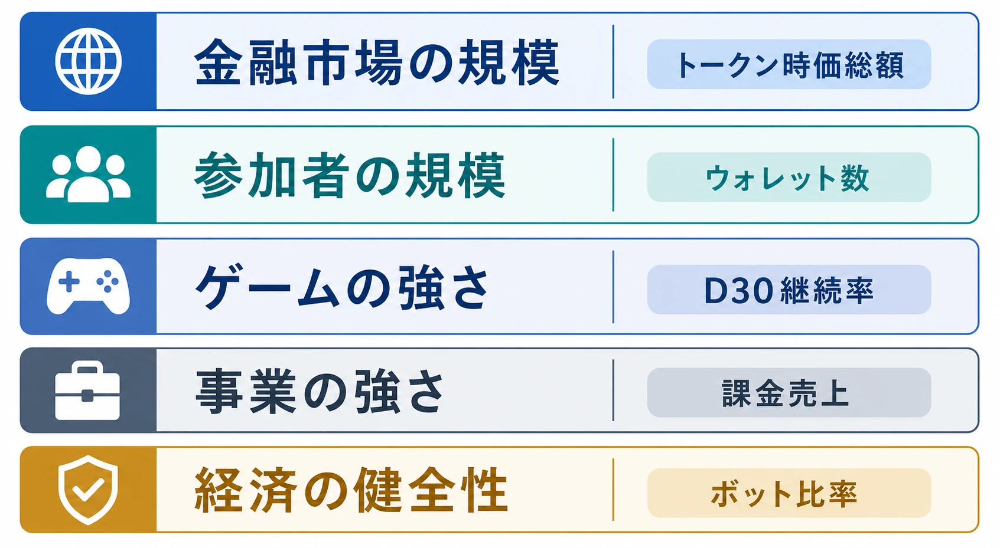
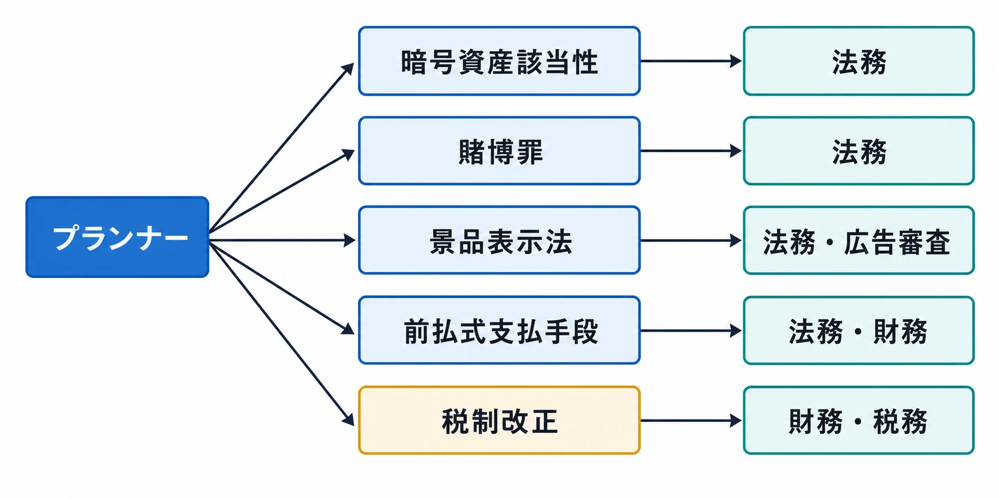

# P2Eゲーム制作を指示されたとき、ゲームプランナーが確認・検討すべきこと

## はじめに

「P2E（Play to Earn）要素を入れたゲームを検討してほしい」と上長から言われたとき、ゲームプランナーが最初に作るべきものは、トークンの名前でも報酬表でもない。企画の前提を分解し、誰のどの課題を、どの仕組みで解決するのかを確認するための論点表である。

2026年は、Web3ゲームをめぐる機運が再び強まりつつある。業界データの一例では、GameFiのトークン時価総額は2025年に大幅に縮小し、取引量も落ち込んだと整理されている。[[1](#ref-1)] 一方、2026年春の集計には、GameFiカテゴリーが年初の下落から横ばい・小幅上昇へ転じた月もある。ただし、時価総額加重の上昇が一部の銘柄に偏り、中央値では下落が続くという見方もある。[[2](#ref-2)] これは「市場が全面回復した」という意味ではなく、投機だけでなく、実際のゲーム体験やデジタル資産の保有に価値を置く企画へ資金と関心が戻る可能性が出てきた、という程度に読むべき材料である。

国内では、Web3・暗号資産・金融などを扱うWebX2026が、2026年7月13日・14日に東京で開催される。公式サイトには経済産業省などの後援と、政府・企業・開発者・投資家が集まるイベントであることが掲載されている。[[3](#ref-3)] この種のイベントが開催されることは、企画相談が増える背景にはなりうる。しかし、行政の後援やカンファレンスの盛況は、個別タイトルの市場性やトークン価格を保証するものではない。

したがって、プランナーが上申すべき問いは「P2Eを入れるべきか」ではない。「報酬を外部価値と結び付ける必要が本当にあるのか」「その価値を誰が、どの消費と収益で支えるのか」「日本向けに同じ動機が成立するのか」「法務・財務・セキュリティに何を確認すれば企画を進められるのか」である。

本稿では、法務や財務の最終判断をプランナーが代行することは扱わない。プランナーが調査し、関係部署に確認し、企画書に不確実性を残したままでも説明できるようにするための実務上の整理を行う。

***

## 1. まず「稼ぐ」の意味を分解する

P2Eは、ゲームをプレイすることで、暗号資産、NFT、ゲーム内トークンなどの経済的価値を持ちうる報酬を得る設計を指す。ここでいう「Earn」は、必ずしもプレイヤーが安定した収入を得ることを意味しない。価格変動、手数料、税金、換金性、参加費、プレイ時間を差し引けば、ユーザーの手元に残る金額がマイナスになる可能性もある。

上長から「稼げるゲーム」と言われた場合は、少なくとも次のどれを指すのかを聞き分ける必要がある。

| 上長が期待しているもの | 実際に設計する対象 | 企画初期に聞く質問 |
|---|---|---|
| プレイヤーへの金銭的リターン | 外部移転できるトークン、NFT、売買市場 | 誰が買い、誰が報酬を支えるのか |
| 所有感 | ユーザーが管理できるデジタル資産 | サービス終了後にも何が残るのか |
| 二次流通 | プレイヤー間の取引、市場、手数料 | 取引の相手と流動性をどう確保するのか |
| ファン参加型の運営 | ガバナンストークン、投票、提案制度 | 投票で決める範囲と、運営が決める範囲は何か |
| 新規ユーザー獲得 | 報酬による広告・紹介・コミュニティ形成 | 報酬を止めても残るユーザー価値は何か |

この表を埋めないまま「報酬を出す」ことから始めると、ゲームの面白さ、投資商品のような期待、マーケットプレイスの事業計画が一つの仕様に混ざる。プランナーは、企画の目的を「ゲーム体験」「所有」「流通」「資金調達」「コミュニティ」のどこに置くのかを分けて書くべきである。

実務上の簡単なストレステストは、「報酬トークンの価格がゼロになってもプレイされるか」である。価格がゼロでも遊ばれるなら、トークンはゲーム体験を補助する要素になりうる。価格がゼロになると遊ばれないなら、それはゲームというより、報酬の分配スケジュールをユーザーに操作させる企画になっている可能性が高い。

***

## 2. 暗号資産・NFT・トークンをゲームの言葉に置き換える

### 2-1. 最初に覚える用語

暗号資産は、法定通貨ではなく、インターネット上で移転・交換される電子的な価値である。日本では法令上の呼称が「仮想通貨」から「暗号資産」に変更され、暗号資産と法定通貨の交換サービスには登録が必要とされている。[[4](#ref-4)] ただし、ゲーム内で「コイン」「ポイント」「トークン」と呼んでいるものが、直ちに法令上の暗号資産になるわけではない。

トークンは、ブロックチェーン上で発行・移転されるデジタルな単位を広く指す言葉である。複数のユーザーが同じ価値の単位を持てるものをFT（代替性トークン）、一つひとつを識別できるものをNFT（非代替性トークン）と呼ぶ。FTは報酬通貨や決済手段に、NFTはキャラクター、装備、土地、会員証などに使われることが多い。

ここで重要なのは、ブロックチェーン上の記録をユーザーが管理できることと、ゲーム内の権利を無期限に所有できることは別だという点である。NFTのウォレット上の保有記録があっても、ゲームの利用規約、サーバー、画像データ、ゲーム内機能、知的財産権までユーザーが所有するとは限らない。金融庁も、現行法上の暗号資産に該当しないNFTは暗号資産規制の対象外となりうる一方、個別の権利や機能によって検討が必要になることを示している。[[5](#ref-5)]

### 2-2. 通常のゲームアイテムとの違い

「ユーザーが所有する」と説明する企画では、次の表を埋めると議論が具体的になる。

| 観点 | 通常のゲームアイテム | 外部移転できるFT・NFT |
|---|---|---|
| 記録場所 | 運営会社のデータベース | ブロックチェーン上のトークンと、ゲーム側のデータベースの組み合わせ |
| ユーザーが持つもの | 利用規約に基づくゲーム内利用権 | トークンを移転できる秘密鍵の管理権と、規約・スマートコントラクト上の権利 |
| 売買 | 原則として運営会社が定めた範囲内 | 外部市場やプレイヤー間で売買できる設計が可能 |
| 価値の決まり方 | 運営の価格設定とゲーム内需要 | ゲーム内需要に加え、外部市場の投機・流動性・暗号資産相場の影響を受ける |
| サービス終了時 | サーバー停止とともに利用不能になることが多い | トークンの記録は残りうるが、ゲーム内機能、公式画像、取引市場、価値が残るとは限らない |
| 変更・回収 | 運営が仕様変更や削除を行いやすい | 移転済み資産の回収、ナーフ、凍結、誤送付、秘密鍵紛失への対応が難しい |

この表で「所有」と書く場合も、次の二つを分ける必要がある。

1. ウォレット上のトークンを移転できること
2. ゲーム内で何らかの機能を使えること

一つ目が実現しても、二つ目を永続的に保証できるとは限らない。逆に、運営がゲーム内機能を保有者へ提供していても、外部市場での価値や換金を保証する義務を負うとは限らない。企画書では「所有」という宣伝語だけでなく、「何のデータを、誰が、どの期間、どの条件で利用できるか」を権利単位で記述するべきである。

### 2-3. プランナーが理解しておく運用コスト

ウォレットは、ユーザーがトークンを保管・送受信するための仕組みである。秘密鍵やリカバリーフレーズを失えば、運営でも復旧できない場合がある。ブロックチェーンへの書き込みには手数料が発生することがあり、チェーンをまたぐブリッジを使えば、別のセキュリティリスクも増える。

そのため、ゲーム設計では「全ユーザーに初日から外部ウォレットを作らせる」ことが本当に必要かを検討する。アカウント内で遊べる期間を設け、出庫時だけウォレットを接続する設計なら、初期離脱を減らせる可能性がある。一方、出庫制限や本人確認を設ければ、ユーザーの自由度と運用コストのトレードオフが生じる。

プランナーがエンジニア、セキュリティ担当、法務に確認する項目は次である。

- 秘密鍵をユーザーが直接管理するのか、運営が預かるのか
- アカウント凍結時に、外部ウォレットへ移転済みの資産をどう扱うのか
- 誤送付、詐欺、アカウント乗っ取り、秘密鍵紛失へのサポート範囲
- ブロックチェーン停止、チェーン移行、コントラクトの脆弱性に対する代替手段
- 外部市場の取引価格を、ゲーム内の価値説明や報酬表示に使うのか

***

## 3. 報酬設計は「配る量」ではなく、経済の流れで考える

### 3-1. トークノミクスの基本

トークノミクスは、トークンの発行、配布、利用、消却、保有、売買を組み合わせた経済設計を指す。ゲームプランナーが最低限作るべきものは、次の流れを数値で追える一枚の表である。

| 項目 | 設計で決めること | 監視する指標 |
|---|---|---|
| 発行 | どの行動で、何枚、誰に出すか | 1人・1日あたりの純増、上位ユーザーへの集中 |
| 初期配布 | 新規ユーザー、運営、投資家、提携先への割当 | 初期保有の偏り、ロック解除時期 |
| 消費先（シンク） | 強化、クラフト、修理、出品、参加費、育成など | 消費量、消費ユーザー率、消費の再利用率 |
| 外部流通 | 取引所、マーケット、ユーザー間送付の可否 | 売買量、買い手と売り手の比率、流動性 |
| 運営保有 | 報酬原資、手数料、財務資産の管理 | 金庫残高、価格下落時の運営余力 |
| 仕様変更 | 発行量、報酬率、使用先、凍結条件の変更 | 変更前後の継続率、信頼毀損、問い合わせ |

単純化すれば、期間中の供給増減は「新規発行量－消費・消却量」である。発行量が多いこと自体が悪いのではない。新規発行量に見合う新しい需要があり、消費される設計なら、供給が増えても経済は維持できる。反対に、シンクが「将来追加する予定」だけで、現時点のプレイヤーが使う理由を持たないなら、報酬は売却圧力になる。

### 3-2. Axie Infinityを例に報酬経済の流れを見る

P2Eの経済を理解するには、トークン価格の上下から入るよりも、「何をすると報酬が発行されるか」「その報酬を何に使うか」「誰が買うか」「使われた分が供給から出るか」の順に追う方がよい。Axie Infinityは、この流れを具体的に確認できる事例である。

Axie Infinityは、Axieと呼ばれるデジタルクリーチャーを集め、チームを組んで戦わせるゲームである。公式ホワイトペーパーは、プレイヤーがゲーム内資源を獲得し、デジタル資産をプレイヤー同士で売買できる「プレイヤー所有の経済圏」を構想していた。ここで、ゲームの勝敗や育成と、外部で売買できる資産が同じ経済の中に接続される。[[6](#ref-6)]

この節で見るトークンは二つある。SLP（Smooth Love Potion）は、バトルなどで得る報酬通貨である。AXS（Axie Infinity Shards）は、ゲームやコミュニティの運営に関わるガバナンストークンであり、ブリードにも使われる。つまり、プレイによって増える報酬通貨と、ゲームの運営・資産作成に関係するトークンを組み合わせて経済を動かしていた、と捉えるとよい。[[6](#ref-6)]

まず、用語をゲーム内の流れに置き換えると次のようになる。

| 流れ | 初心者向けの意味 | 経済上の役割 |
|---|---|---|
| プレイ・バトル | プレイヤーがゲームを遊び、条件を満たす | 報酬を発行する入口 |
| SLPの獲得 | バトルなどで得る報酬通貨 | プレイヤー側への新規供給 |
| ブリード | SLPとAXSを使って、新しいAxieを生み出す | SLPを消費するシンク。新しい資産も生む |
| 外部売却 | 得たSLPやAxieを他の参加者へ売る | 保有者を変える取引。トークン自体を消費するわけではない |
| 新規参加・育成需要 | 新しいプレイヤーがAxieを入手し、既存プレイヤーが育成や収集を続ける | 報酬や資産を買う需要 |

ここで特に区別すべきなのは、「売却」と「シンク」である。プレイヤーがSLPを外部で売却しても、SLPは買い手のウォレットへ移るだけで、経済圏から消えるとは限らない。一方、ブリードのようにSLPをゲーム内の処理で消費する仕組みは、供給を減らすシンクになる。したがって、報酬を売れる場所があることと、報酬を継続的に消費する理由があることは別の設計課題である。

仮に、100人のプレイヤーが1人あたり100 SLPを得ると、期間中に10,000 SLPが新たに発行される。ブリードなどで6,000 SLPが消費されれば、残りは4,000 SLPである。この残りを買う新規参加者や既存プレイヤーの用途が十分にあれば取引は成立するが、買い手が増えず、消費先も増えなければ、残ったSLPは売却に回りやすい。これは実際のゲーム内数値ではなく、発行量と消費量の差を読むための仮想例である。

Axie Infinityで問題になったのは、報酬を出す仕組みだけが強くなり、報酬を使う需要を同じ速度で維持できなかったことである。初期のSLPには発行上限がなく、バトルなどで生まれる量が、ブリードなどで消費される量を上回る局面が続いた。運営は2024年1月、SLPの供給上限を440億に設定し、発行量と焼却量の均衡を目指す方針を公表した。ただし、供給上限を置くことは、発行の蛇口を制限する対策であって、プレイヤーがSLPを使いたくなる需要を自動的に作る対策ではない。[[7](#ref-7)]

さらに、参加コストがあるゲームでは、報酬を得るための初期資産を持つ人と、プレイ時間を提供する新規参加者の役割が分かれることがある。Axie Infinityでは、資産を持つ管理者がAxieを貸し出し、新規プレイヤーがプレイして報酬を分配する「スカラーシップ」が広がった。これは参加の入口を下げる仕組みである一方、新規参加者が報酬を生み、その報酬を前提にさらに新規参加者を呼ぶ構造にもなりうる。新規流入が鈍ると、報酬を買う需要と、初期資産を回収する期待の両方が弱くなる。[[8](#ref-8)]

2022年の縮小は、SLPの発行上限がなかったことだけで説明できない。暗号資産市場全体の下落、報酬設計の持続可能性への疑念、参加コスト、プレイヤー構成、新規参加者への依存などが重なった結果である。学術分析も、COVID-19下の急成長後にユーザー数が頭打ちになり、ゲームのトークン価値と成長が危機に直面した経緯を扱っている。[[8](#ref-8)] プランナーが学ぶべき点は、特定のトークン仕様を真似することではない。報酬の発行、シンク、外部売却、新規流入、既存ユーザーの消費を一つの因果関係として試算することである。

設計時には、次のような問いに答える必要がある。

- 報酬を受け取ったユーザーが、売却以外に使う理由はあるか
- シンクは一部の重課金ユーザーだけでなく、無課金・微課金ユーザーにも存在するか
- 新規ユーザーが増え続けなくても、既存ユーザーの消費で回るか
- 報酬率を半分にしたとき、プレイヤーは面白さを理由に残るか
- ボットや多重アカウントが報酬を自動回収した場合、経済は耐えられるか
- 運営が買い支えないと成立しない設計になっていないか

### 3-3. 設計原則

#### 供給上限と発行スケジュールを別々に考える

供給上限を置けば、それだけで価格が安定するわけではない。上限が大きすぎれば、実質的な希少性は生まれない。また、初期に大量配布してから急激に発行量を絞ると、先行ユーザーと新規ユーザーの間に不公平感が生まれる。

プランナーは、総供給量だけでなく、月次の発行量、ロック解除、報酬率の減衰、運営保有分の放出条件を時系列で書くべきである。企画書には、通常ケースに加えて「ユーザー数が計画の半分」「報酬価格が10分の1」「新規流入が止まる」ケースを置く。

#### シンクはゲーム体験の中に置く

シンクを税や罰だけで作ると、ユーザーは「稼いだものを取り上げられた」と感じる。クラフト、育成、修理、見た目の変更、ギルド活動、イベント参加など、プレイの目的と結び付いた消費先にする方が、経済とゲーム体験を分離しにくい。

ただし、消費先を増やすだけでは足りない。消費されるアイテムが無限に増えたり、強化の結果が新たな供給になったりすれば、シンクの実質量は減る。アイテム・トークン・手数料・報酬のそれぞれについて、どの時点で経済圏から出るのかを定義する必要がある。

#### ガバナンス用途と実利用用途を分ける

ガバナンスは、提案や投票など、コミュニティが運営方針に関与する仕組みである。実利用は、ゲーム内の支払い、クラフト、参加、アクセス権など、遊ぶために必要な用途を指す。

一つのトークンに両方を持たせると、投票権を買う需要とゲーム内消費の需要が価格変動を通じて衝突する。投票権を大量に保有する者がゲーム内報酬を変更できるのか、運営金庫の使途を決められるのか、キャラクター性能に影響するのかを、企画段階で分けておくべきである。

#### 「プレイして稼ぐ」から「プレイして所有する」への変化を読む

2026年時点の業界議論では、報酬を配ってユーザーを呼ぶP2Eから、ゲームを楽しみながらデジタル資産を保有できるPlay-and-Ownへ軸足を移す表現が目立つ。Blockchain Game Allianceの2025年業界レポートも、短期的なP2Eの勢いより、運用の強靭性や実経済での用途を重視する方向を示している。[[9](#ref-9)] これは確立した市場分類ではなく業界側の見解だが、企画の問いを「いくら稼げるか」から「何を所有でき、なぜ残したくなるか」へ移す材料にはなる。

***

## 4. 市場性は「市場規模」ではなく、誰が何のために続けるかで見る

### 4-1. 市場規模データの読み方

Web3ゲームの市場規模として、トークン時価総額、NFT取引量、スマートコントラクトの取引量、ユニークアクティブウォレット数、ゲームの売上、ゲーム内の継続率が混在して語られることがある。これらは別の指標である。

たとえばDappRadarの「ユーザー」は、ゲームのスマートコントラクトと相互作用したUnique Active Walletsであり、ゲームを遊んだ人間の実人数とは一致しない。ボット、複数ウォレット、ウォレットを使わずに遊ぶユーザーが含まれうるため、同社もゲームによっては実際のプレイヤー基盤の一部しか表さないと説明している。[[10](#ref-10)]

したがって、業界寄りの市場レポートに大きな成長率が書かれていても、企画書では次を分けて記載するべきである。

- 金融市場の規模：トークン時価総額、取引量、NFT売買量
- 参加者の規模：ウォレット数、アカウント数、月間アクティブユーザー
- ゲームの強さ：D1・D7・D30継続率、平均セッション時間、コンテンツ消費
- 事業の強さ：課金売上、手数料収入、運営費、報酬原資、粗利
- 経済の健全性：新規流入への依存、報酬の売却率、ボット比率、上位保有者の集中

市場規模は「参入余地」の参考にはなるが、「自社ゲームが獲得できるユーザー数」ではない。特にトークン市場の時価総額は、少量の取引価格を全供給量に掛けた数字であり、全保有者がその価格で売却できる現金の総額を意味しない。

### 4-2. フィリピンやベトナムで成立した動機をそのまま日本へ移さない

P2Eの普及を語るとき、フィリピンのプレイヤーや、ベトナムに拠点を置く開発チーム、東南アジアのコミュニティがよく例に挙がる。Axie Infinityの研究では、COVID-19下の失業や収入減少と、初期資産を持つマネージャーが新規プレイヤーへアセットを貸し出す「スカラーシップ」が、ゲームへの参加を広げた経緯が分析されている。[[11](#ref-11)] 当時の報道でも、フィリピンでゲーム収入を生活費の補助として捉えたプレイヤーや、数時間のプレイを条件とする収益分配の実態が紹介された。[[12](#ref-12)]

この事例から得るべき教訓は、「新興国の人はゲームで稼ぎたい」という単純な属性ではない。外出制限、失業、送金減少、初期資産を持たないユーザー、地域コミュニティによる貸し出しが重なり、ゲームの報酬が生活費を補う切実な選択肢として見えたという構造である。

日本のように、同じ形の経済的困窮や収入代替の必要性を前提にしにくい市場では、同じP2E動機が成立するとは限らない。日本のユーザーが求めるのは、生活費ではなく、所有感、コレクション、コミュニティ参加、創作物の二次利用、少額の還元、既存ゲームでは得にくい取引体験かもしれない。ここは国民性で決めるのではなく、対象ユーザーへの調査で検証する仮説である。

### 4-3. 上長へ市場性を報告するための調査項目

市場性の報告では「市場規模は大きい」と書く前に、次の調査結果を埋める。

#### 想定ユーザー層

- 生活圏、所得の安定性、可処分時間、端末、通信環境
- 暗号資産の保有経験、ウォレット利用経験、本人確認への許容度
- ゲームの面白さ、所有、売買、収入補助のどれが参加理由になるか
- 外部市場の価格変動や税務を理解したうえで参加できるか
- 重課金・中課金・微課金・無課金のそれぞれが、何を買い、何を売るか

#### 類似タイトルの実態

- 報酬価格が下落した後のD30・D90継続率
- 報酬を受け取るユーザーと、報酬を購入するユーザーの比率
- 新規ユーザーの流入が止まった後も、既存ユーザーが消費したか
- 外部ウォレット接続前後の離脱率
- ボット、複数アカウント、スカラーシップなどの運用負担
- サービス終了、チェーン移行、ハッキング、マーケット閉鎖への対応実績

#### 国内外の比較

- 日本向けに同じ報酬動機を使ったタイトルの獲得効率
- 海外タイトルが日本で伸びなかった理由、または伸びた理由
- App Store、Google Play、PC、ブラウザでの配信制約
- 日本のユーザーが外部取引をどの程度受け入れるか
- 海外展開時の国別規制、税務、言語、カスタマーサポートの費用

企画書の結論は、「P2E市場がある」ではなく、「このユーザー層が、このゲームのこの消費先に対して、報酬価格が下がっても継続するという仮説を、どの調査で確かめたか」にするべきである。

***

## 5. 法務・財務には、結論ではなく仕様を渡して確認する

この章は法律相談の代わりではない。プランナーが仕様を抽象語のまま持ち込むと、法務・財務は判断できない。「トークンを出す」ではなく、誰に、何の対価として、どのネットワークで、どの条件で移転可能にするのかまで分解して渡す必要がある。

### 5-1. 暗号資産に該当するか

発行するFT、ゲーム内通貨、NFT、ポイントについて、法務には次を確認する。

- 法定通貨や他の暗号資産と交換できる設計か
- 不特定の者へ移転できるか、移転制限があるか
- ゲーム内だけで使えるのか、外部の決済・サービスでも使えるのか
- 発行、販売、配布、買い取り、交換、保管のどれを自社が行うのか
- 外部取引所やマーケットプレイスへ上場・接続するのか
- 国内ユーザーへ提供するのか、海外法人・海外サーバーを使うのか
- ユーザー資産を運営が預かる場合、暗号資産交換業やカストディに当たりうるか

ゲーム内の呼称ではなく、機能と取引構造で判断される。NFTだから安全、ゲーム内通貨だから安全、海外サービスを使うから安全、と決めつけてはいけない。

なお、暗号資産規制の根拠法自体も変わりつつある。金融審議会は2025年12月、暗号資産規制を資金決済法から金融商品取引法（金商法）へ移管する方向性を報告書として示しており、2026年中の法改正が見込まれている。[[13](#ref-13)] 法務への確認事項は、現行の資金決済法上の整理だけでなく、この移管を前提とした規制の変化も踏まえて確認するべきである。

### 5-2. ランダム販売と賭博罪の関係

有料で参加し、偶然の結果により、外部で売買できる価値のあるアイテムやトークンを得たり失ったりする設計は、通常のガチャの景品表示法上の論点に加えて、賭博罪との関係を法務へ確認すべきである。刑法は、偶然の勝敗に財物を賭ける行為を賭博として規定し、一時の娯楽に供する物を除く例外も置いている。[[14](#ref-14)]

これは、すべてのランダム販売が直ちに賭博罪になるという意味ではない。問題になるかは、参加者が拠出する価値、偶然性、勝敗・得喪、景品の外部価値、換金可能性、運営者の関与などを個別に検討する必要がある。プランナーは、次の仕様を図にして法務へ渡す。

- 参加に必要な有料アイテムやトークン
- 当選・敗北・引き分けの判定方法
- 参加者の拠出物が他の参加者の報酬になるか
- 報酬の外部移転、売却、買い戻し、換金の可否
- 運営が報酬原資を出すのか、参加者の拠出から出すのか
- 日本以外のユーザーが参加できるか

### 5-3. ログインボーナス・ランキング報酬と景品表示法

景品表示法では、取引に付随して提供される経済上の利益について、一般懸賞、共同懸賞、総付景品などの上限が定められている。消費者庁は、商品やサービスの利用者に対して提供するものは、取引に付随する景品規制の対象になりうると説明している。[[15](#ref-15)] また、競技やゲームの優劣で提供相手を決めるものは、懸賞の検討対象になる。[[16](#ref-16)]

したがって、ログインボーナスやランキング報酬について、法務・広告審査へ次を確認する。

- 無料ログインだけで受け取れるのか、有料購入が条件か
- 有料パス、課金額、NFT保有、トークン購入を参加条件にしていないか
- ランキングの勝敗が、プレイヤーの技能だけでなく有料アイテムの量に依存していないか
- 報酬がゲーム内だけの利用権か、外部取引できる経済的利益か
- 報酬価額を何で算定するか。円換算、販売価格、交換価格のどれか
- 報酬の最高額と総額を、開催期間・参加者数・売上見込みと合わせて確認したか

無料報酬なら常に規制対象外、有料報酬なら常に違反という整理ではない。取引との結び付き、提供方法、報酬の価値を仕様と表示の両面で確認する必要がある。

### 5-4. ゲーム内通貨を円で販売する場合の前払式支払手段

円を受け取って発行し、自社のゲーム内サービスの支払いに使えるゲーム内通貨は、資金決済法上の前払式支払手段に該当しうる。金融庁は、対価を得て発行され、サーバーなどに価値が記録され、物品やサービスの代価に使えるものを前払式支払手段として説明している。[[17](#ref-17)]

自社サービスでのみ使える自家型では、3月31日・9月30日の未使用残高が1,000万円を超える場合の届出、発行保証金、表示、サービス終了時の払戻しなどを確認する必要がある。第三者のサービスでも使える第三者型なら、登録制になる。使用期限が6か月以内などの適用除外もあるが、期間設定や表示の方法を含めて法務に確認するべきである。[[17](#ref-17)]

企画段階では、次の残高を別台帳で管理できる仕様にしておくと、財務・法務が確認しやすい。

- 有償で購入されたゲーム内通貨
- 無償配布されたゲーム内通貨
- 外部移転可能な報酬トークン
- NFTの購入・売却に伴う手数料
- 返金、サービス終了、アカウント停止時の残高

### 5-5. 2023年以降の税制改正と財務確認

法人が保有する暗号資産については、活発な市場がある場合、期末時価評価による含み益が課税対象になりうることが、Web3事業の資金繰り上の論点になってきた。2023年度税制改正では、一定の譲渡制限が付された自己発行暗号資産を期末時価評価の対象から除外する措置が示された。[[18](#ref-18)]

さらに2024年度税制改正では、自己発行ではない第三者保有の暗号資産についても、一定の譲渡制限などの要件を満たすものについて、時価法または原価法を選択できる見直しが行われた。[[19](#ref-19)] 2025年時点の国税庁資料でも、活発な市場の有無、譲渡制限、自己発行かどうかによって扱いが分かれることが確認できる。[[20](#ref-20)]

これは「トークンを発行すれば課税されない」という話ではない。ロックアップの条件、保有主体、売却制限が途中で外れた場合、トークンの取得価額、報酬として配布した場合の費用、ユーザー側の課税、消費税、海外法人との取引を財務・税務へ確認する必要がある。プランナーが作るべき資料は、トークンの供給スケジュールと、会社がいつ何枚取得・保有・配布・売却するかを対応させた台帳である。

***

## 6. 上層部への上申で使えるチェックリスト

最後に、企画書や検討報告に最低限含める項目をまとめる。チェックが付かない項目は、未確定のまま「検討中」と書いてよい。重要なのは、未確認の論点を「問題なし」と置き換えないことである。

### 仮想通貨・NFT・トークンの基礎理解

- [ ] P2E、FT、NFT、ウォレット、秘密鍵、外部市場を説明できる
- [ ] 「ユーザーが所有するもの」と「運営が提供するゲーム内機能」を分けて書いた
- [ ] サービス終了後に残るデータ、残らない機能、運営の責任範囲を整理した
- [ ] 外部移転、売買、換金、運営による買い戻しの有無を確定した
- [ ] ウォレット接続、手数料、本人確認、問い合わせ対応のコストを見積もった

### 報酬設計の持続可能性

- [ ] 発行量、消費量、消却量、運営保有分を月次で試算した
- [ ] 新規ユーザーの増加が止まっても成立するシンクがある
- [ ] 報酬価格が大幅に下落した場合の継続率・収益・運営費を試算した
- [ ] ガバナンス用途と実利用用途を分けた
- [ ] ボット、多重アカウント、談合、報酬の集中を想定した
- [ ] 報酬率を下げる、発行を止める、トークンを移行する場合の告知と補償方針を確認した

### 市場性の検証

- [ ] 市場規模、アクティブウォレット、実ユーザー、売上、継続率を混同していない
- [ ] 想定ユーザーの生活圏、所得の安定性、可処分時間、暗号資産経験を調査した
- [ ] フィリピン・ベトナムなどの成功事例を、日本市場の需要の根拠としてそのまま使っていない
- [ ] 報酬がなくても遊ぶユーザーと、報酬だけを目的にするユーザーを区別した
- [ ] 国内外の類似タイトルについて、報酬価格下落後の継続率とサービス運営状況を調べた
- [ ] 配信プラットフォーム、外部ウォレット、マーケット、カスタマーサポートの制約を確認した

### 法務・財務への確認事項

- [ ] 暗号資産該当性、暗号資産交換業、カストディ、外部市場接続を法務に確認した
- [ ] ランダム販売、PVP報酬、参加費、換金可能な景品と賭博罪の関係を法務に確認した
- [ ] ログインボーナス、ランキング報酬、課金連動キャンペーンの景品表示法上の扱いを確認した
- [ ] 円売りゲーム内通貨の前払式支払手段該当性と、未使用残高の管理方法を確認した
- [ ] 自社発行トークンの期末評価、ロックアップ、配布、売却、ユーザーへの報酬課税を財務・税務に確認した
- [ ] 海外ユーザーを受け入れる場合の国別規制と税務を確認した
- [ ] 利用規約、プライバシーポリシー、リスク説明、サービス終了時の取り扱いを確認した

***

### 報告書の結論に書くべきこと

報告書の最後は、「P2Eを導入する／しない」の二択だけにしない。次のように、判断条件を添えて書くと上層部が意思決定しやすい。

> 本企画は、ゲーム内の所有体験とプレイヤー間取引を検証する価値がある。一方、報酬価格が下落した場合に既存ユーザーの消費だけで経済を維持できるか、外部移転可能な報酬が国内法上どの分類になるか、円売り通貨の未使用残高をどう管理するかは未確定である。次工程では、法務・財務・セキュリティの確認を経て、ウォレット接続なしの試遊版と、報酬価格を変動させた経済シミュレーションを検証する。

プランナーの仕事は、暗号資産の専門家になることでも、法務の結論を先取りすることでもない。企画の魅力と、報酬が生む責任を同じ資料に載せ、誰が何を決めるべきかを明確にすることである。P2Eを「稼げる仕組み」として売り込む前に、報酬がなくても遊ぶ理由、所有する理由、使う理由を設計できているかを確認する。それが、2026年のP2E企画を現実的なゲーム企画として扱うための出発点になる。

## References

1. [GameFi 2025 Recap: Crypto Gaming Consoles, Bleeding Markets, Dying Projects][1] - CoinMarketCap Academyによる2025年のGameFi市場概況。トークン時価総額や取引量の集計を含む。

2. [Narrative Overview — May 2026][2] - CryptoRankによる2026年のカテゴリー別トークン騰落分析。GameFiの時価総額加重と中央値の差を確認するために参照した。

3. [WebX2026公式サイト][3] - 2026年7月13日・14日の東京開催日程と、経済産業省などの後援情報。

4. [暗号資産の利用者のみなさまへ][4] - 金融庁による暗号資産の制度概要、法定通貨ではないこと、交換業登録に関する説明。

5. [アクセスＦＳＡ第269号][5] - 金融庁による暗号資産制度見直しの説明。現行法上の暗号資産に該当しないNFTが別扱いになることを含む。

6. [Axie Infinity Official Whitepaper][6] - SLP、プレイヤー所有経済、Axieのブリードとゲーム内資源に関する公式説明。

7. [Updates To SLP’s Monetary Policy!][7] - Axie Infinity運営によるSLP供給上限、発行・焼却量、買い戻し・安定化策の説明。

8. [Playing, earning, crashing, and grinding: Axie infinity and growth crises in the Web3 economy][8] - Axie Infinityのトークノミクス、COVID-19下の成長、新規参加者への依存、2022年の経済危機を扱う学術論文。

9. [2025 BGA State of the Industry Report][9] - Blockchain Game Allianceによる2025年の業界レポート。P2Eから実利用・運用の強靭性を重視する方向性を確認するために参照した。

10. [Dapp Project Pages][10] - DappRadarによるUnique Active Wallets、取引、ボリュームなどの指標定義と、ゲームによってはウォレット活動が実ユーザー全体を表さないという注意書き。

11. [Reassessing blockchain in global development: Tokenization of infrastructure, social impacts, and the axie infinity case in the Philippines][11] - フィリピンにおけるAxie Infinityと、低所得層・COVID-19・トークン経済の社会的影響を扱う研究。

12. [A Crypto Game Promised to Lift Filipinos Out of Poverty. Here’s What Happened Instead][12] - フィリピンでのAxie Infinityの利用、スカラーシップ、生活費補助としての動機と、その後の負担を取材した記事。

13. [金融審議会 暗号資産制度に関するワーキング・グループ報告][13] - 金融庁による、暗号資産規制を資金決済法から金融商品取引法へ移管する方向性を示した2025年12月10日付け報告書。

14. [刑法][14] - e-Gov法令検索。賭博および賭博場開張等に関する刑法の条文。

15. [景品規制の概要][15] - 消費者庁による一般懸賞、共同懸賞、総付景品、取引付随性の説明。

16. [オンラインゲームの「コンプガチャ」と景品表示法の景品規制について][16] - 消費者庁による懸賞の定義とオンラインゲームにおける景品規制の考え方。

17. [FinTechサポートデスクについて][17] - 金融庁による前払式支払手段の定義、自家型・第三者型、未使用残高、6か月以内の使用期限に関する説明。

18. [令和5年度税制改正の概要：暗号資産の評価の方法の改正][18] - 国税庁による、一定の自己発行暗号資産を期末時価評価の対象から除外する改正の説明。

19. [令和6年度税制改正について][19] - 金融庁による、第三者保有の暗号資産の期末時価評価課税見直しの説明。

20. [暗号資産の評価方法の見直し等][20] - 国税庁による2024年度改正後の暗号資産の評価方法、自己発行暗号資産、譲渡制限の説明。

[1]: https://coinmarketcap.com/academy/article/gamefi-2025-recap-crypto-gaming-consoles-markets-dead-projects
[2]: https://cryptorank.io/insights/reports/narrative-overview-may-2026
[3]: https://webx-asia.com/ja/article/?aid=network&lang=JA
[4]: https://www.fsa.go.jp/policy/virtual_currency/index.html
[5]: https://www.fsa.go.jp/access/r7/269.html
[6]: https://whitepaper.axieinfinity.com/
[7]: https://blog.axieinfinity.com/p/slpcap
[8]: https://journals.sagepub.com/doi/10.1177/20539517251357296
[9]: https://blockchaingamealliance.net/wp-content/uploads/2025/12/BGA-2025-State-of-the-Industry-Report.pdf
[10]: https://docs.dappradar.com/dapp-project-pages
[11]: https://www.sciencedirect.com/science/article/pii/S259029112501071X
[12]: https://time.com/6199385/axie-infinity-crypto-game-philippines-debt/
[13]: https://www.fsa.go.jp/singi/singi_kinyu/tosin/20251210/01.pdf
[14]: https://laws.e-gov.go.jp/law/140AC0000000045?occasion_date=20250201
[15]: https://www.caa.go.jp/policies/policy/representation/fair_labeling/premium_regulation
[16]: https://www.caa.go.jp/policies/policy/representation/fair_labeling/guideline/pdf/120518premiums_1.pdf
[17]: https://www.fsa.go.jp/news/27/sonota/20151214-2.html
[18]: https://www.nta.go.jp/law/joho-zeikaishaku/hojin/231016/pdf/c.pdf
[19]: https://www.fsa.go.jp/news/r5/sonota/20231222-7/01.pdf
[20]: https://www.nta.go.jp/publication/pamph/hojin/kaisei_gaiyo2024/pdf/L.pdf

----

この文書は、Perplexity、Claude、OpenAI Codex の3つのAIの支援を受けて著述されたものです。引用画像を除き、MIT License にて提供されています。
