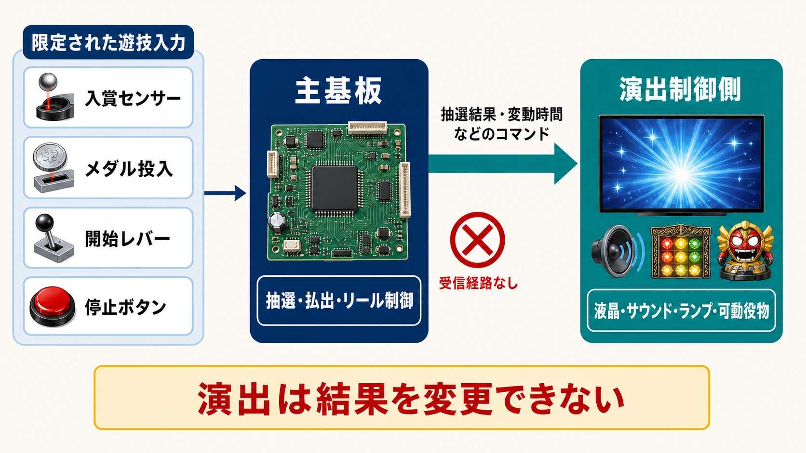
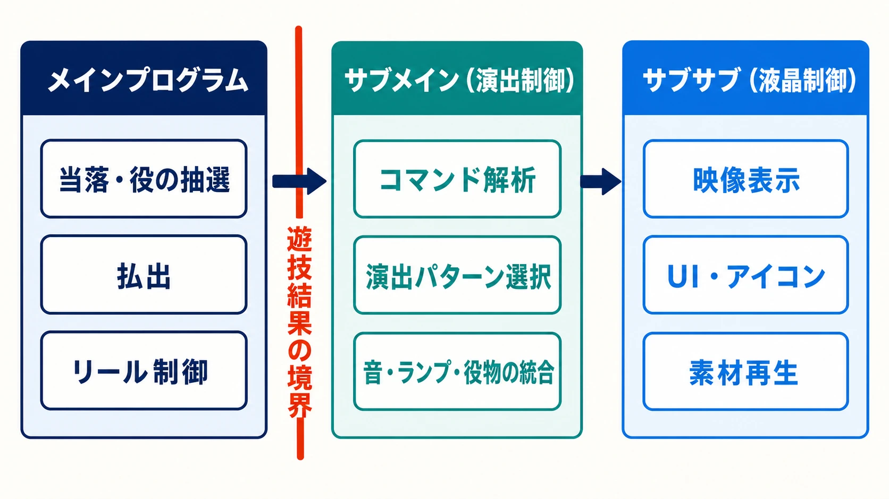

# パチンコ・パチスロの「抽選」と「演出」はなぜ分かれているのか――遊技機を支える一方向制御

## はじめに――ゲーム開発の隣にある、似ていて異なる産業

ゲーム開発会社の仕事は、家庭用ゲームやスマートフォンゲームだけに閉じているとは限らない。CG、エフェクト、UI、サウンド、組込みソフトの技術は、パチンコ・パチスロという **遊技機** の開発でも必要とされる。実際に、ゲームと遊技機の双方を開発する会社や、企画から映像制作、基板プログラム、デバッグまで受託する会社が存在する。[[1](#ref-1)][[2](#ref-2)]

そこでゲームプランナーが出会うのが、通常のゲーム開発とは大きく異なる設計思想である。遊技機では、当たり・外れや出玉を決める **抽選** と、それを液晶、サウンド、ランプ、可動役物で見せる **演出** が、別の制御系へ分けられている。しかも演出側から抽選側へは信号を返せない。

一般的なゲームなら、ゲームロジックが状態を更新し、表示層がその状態を参照する。画面上のボタンからロジックへ操作を渡すこともある。遊技機は、この双方向性を当落判定の周囲から意図的に取り除いている。派手な映像が展開し、筐体のボタンを押すよう促されても、その入力が確定済みの抽選結果を書き換えることはない。

この分離は、単なるプログラム上の作法ではない。法令上の技術規格、型式試験、改造防止構造、歴史的な規制の積み重ね、特殊なCPUと開発環境が、同じ方向を向いて支えている。本稿では、遊技機の基礎知識がない読者にも分かるように、その構造を開発者の視点から読み解く。

***

## 1. 主基板が結果を決め、演出側は受け取って見せる

### 1-1. 「メイン」と「サブ」は何を担当するのか

遊技機の制御は、まず二つの領域へ分けると理解しやすい。

| 制御領域 | 主な役割 | 代表的な入出力 |
| --- | --- | --- |
| 主基板・メイン基板 | 当落抽選、出玉に関わる判断、払出指示、パチスロのリール制御 | 入賞センサー、メダル投入、レバー、停止ボタンなどを受け、払出・リール・演出側へ指示を出す |
| 周辺基板・演出制御側 | 液晶、サウンド、ランプ、可動役物などの演出 | 主基板からコマンドを受け、映像・音・光・動きを組み合わせる |

パチンコでは、球が始動口へ入った時点で主基板が抽選する。主基板は当落と変動時間などを決め、演出側へコマンドを送る。演出側は、その条件に合うリーチや予告を表示する。パチスロでは、開始レバーの入力時に役の抽選が行われ、主基板が停止ボタンとリールの位置を処理する。[[3](#ref-3)]

メーカーであるSANKYOも、開発するソフトを、大当たりやリーチ確率を制御するメインプログラムと、電飾、役物、映像、音響を制御するサブ制御プログラムに大別している。[[4](#ref-4)] 見えている情報量は演出側の方が圧倒的に多いが、遊技結果を決める責任は主基板に集められている。

### 1-2. 一方向通信は「推奨」ではなく技術規格である

「メイン基板は完全独立している」という業界の説明は、少し言葉を補うと正確になる。主基板はすべての入力から孤立しているわけではない。入賞センサー、レバー、停止ボタンなど、遊技に必要な限定された入力は受け取る。一方、演出を担う **周辺基板からの信号は受信できない**。

これは慣例ではない。「遊技機の認定及び型式の検定等に関する規則」の技術上の規格には、主基板が「周辺基板が送信する信号を受信することができるものでないこと」と明記されている。主基板ケースも、開封すれば痕跡が残る透明なケースへ密封する構造が求められる。[[5](#ref-5)]

したがって、通信の向きは次のようになる。

ここで、「演出側は抽選側を覗き見ることさえできない」と表現するのも正確ではない。演出側は、主基板が送った当落や変動条件のコマンドを受信しなければ、結果に合った表示を作れない。できないのは、演出側が主基板のメモリを任意に読み出すこと、問い合わせを返すこと、抽選処理へ命令することである。

遊技中の「ボタンを押せ」という表示も同じだ。ボタン入力で分岐する映像や音を用意することはできるが、それは演出側の選択である。主基板ですでに決まった当落を、押す速さや回数で反転させる機能ではない。

***

## 2. 実務では三層に分かれる――メイン、サブメイン、サブサブ

基板を二分する説明は、制度と信号の流れを理解するには適している。一方、開発現場の担当を考えると、パチスロの制御プログラムは大きく三種類に分けられるという現役開発者の解説が分かりやすい。[[6](#ref-6)]

1. **メインプログラム**：メダル投入、レバー、停止ボタン、役の抽選、払出、リール停止、演出側へのコマンド送信を扱う。
2. **演出制御プログラム（サブメイン）**：主基板からコマンドを受けて解析し、演出パターンを管理・抽選し、液晶制御へ表示指示を送る。
3. **液晶制御プログラム（サブサブ）**：サブメインの指示を受け、実際の映像、UI、アイコンなどを液晶へ表示する。

この三層で使われる「抽選」という語には注意が要る。メインの抽選は、役の成立や出玉に関わる結果を決める。サブメインの演出抽選は、メインから許された条件の中で、どの映像や音を見せるかを選ぶ。同じ言葉でも、変更できる対象が違う。

三層は、担当者の専門性も分ける。メイン担当は抽選、リール、容量制約、申請書類と密接に関わる。サブメイン担当は、企画書の期待度設計をコマンドと演出テーブルへ落とし込む。サブサブ担当は、映像素材、描画負荷、メモリ、再生同期、UI表示を扱う。一台の筐体に収まっていても、ゲームのロジック担当、演出統合担当、クライアント表示担当を別々の制約下で開発するような構成である。

***

## 3. なぜ分離はここまで厳しいのか

### 3-1. 審査済みの構造とソフトを、市場の一台まで一致させるため

遊技機は、完成したらメーカーの判断だけで販売できる製品ではない。保安通信協会は、風営適正化法第20条第5項に基づく指定試験機関として、都道府県公安委員会の委託を受けて型式試験を行う。[[7](#ref-7)] 型式試験では、設計書等の審査、提出機との対比、実機試験が行われる。その後、都道府県公安委員会が型式の検定を行う。

**型式試験、検定、認定** は同じ手続ではない。型式試験は、申請された型式が技術上の規格へ適合するかを指定試験機関が試す工程である。検定は、都道府県公安委員会が型式について行う行政上の手続である。認定は、営業所にある個々の遊技機について、基準に該当しないことを公安委員会が認める別の制度である。[[5](#ref-5)][[7](#ref-7)]

「メインプログラムが検定で封印される」という説明も、制度と物理構造を混ぜた省略表現である。正確には、プログラムを含む型式の構造・材質・性能が審査され、量産機はその型式との同一性を保たなければならない。主基板は、開封痕が残る透明ケースへ密封される。[[5](#ref-5)] 風営適正化法は、遊技機の増設、交替、その他の変更へ、変更承認の規定を準用している。性能へ影響し得る主基板の無承認変更は、単なるメーカー保証外の改造ではなく、公安委員会の承認義務に関わる法令上の問題である。[[8](#ref-8)]

2017年9月4日の規則改正は、この法的な重さを示す具体例である。警察庁は、ぱちんこ遊技機の役物連続作動装置による出玉上限を **2,400個から1,500個** へ、回胴式遊技機では **480枚から300枚** へ引き下げ、2018年2月1日に施行した。[[9](#ref-9)] 警察白書は、ギャンブル等依存症対策の強化を受け、過度な遊技を抑制するための改正だったと説明している。[[10](#ref-10)] 出玉性能の設計は、作品ごとのバランス調整だけで完結せず、規則へ適合することが前提なのである。

### 3-2. 一方向性は、エラーチェックより前に配線と規格で決まる

主基板と演出側の分離を説明するとき、CRCやウォッチドッグタイマーが「異常な命令を遮断する」と語られることがある。しかし、これらの役割は分けて理解した方がよい。

- **CRC** は、受け取ったデータに破損がないかを検出するための方式であり、送信者にその命令を出す権限があるかを決める仕組みではない。
- **ウォッチドッグタイマー** は、プログラムが定期処理を続けられなくなったときに暴走や停止を検知し、リセットへつなげる仕組みである。「不正な命令」を意味内容から判定する装置ではない。[[11](#ref-11)]
- **セキュリティチェック** は、ROM内のプログラムやデータが正規の内容から変わっていないかを照合する。公開特許には、電源投入時にコードを計算し、保存済みのセキュリティコードと一致しなければCPUを停止する構成が記載されている。[[12](#ref-12)]

これらは、通信エラー、プログラム暴走、ROM改変への防御として意味がある。しかし、演出側から主基板へ干渉できない最大の理由は、それより手前にある。技術規格が周辺基板からの信号を受信できない構造を要求し、そもそも戻りの通信経路を持たせないからである。[[5](#ref-5)]

ゲーム開発に置き換えるなら、APIの権限チェックを厳しくした状態ではなく、書き込みAPIと問い合わせAPIそのものが存在しない状態に近い。演出側の不具合で映像が乱れることはあっても、そのコードから主基板の当落変数へ到達する経路はない。

### 3-3. 「演出だった押し順ナビ」が出玉へ影響した歴史

分離の歴史を理解するには、パチスロのAT・ARTで用いられる **押し順ナビ** が重要である。これは、どの停止ボタンから押すかを画面などで案内する機能である。案内に従うことで特定の役を獲得しやすくなるため、表示上は演出でも、実質的には出玉へ影響する。

5号機の旧基準機では、ATの当選や押し順ナビをサブ基板で管理する余地があった。出玉を左右する処理が、主基板より検査範囲の緩い演出側へ置かれる構造である。さらに、サブ基板のROMを不正な内容へ交換し、AT機能を悪用して出玉を得る問題を想定した特許も存在する。[[13](#ref-13)]

業界の新基準では、5.5号機から指示機能を主基板で管理する方向へ移った。フィールズの規制年表は、2015年12月適用の5.5号機を「メイン基板管理」と整理している。[[14](#ref-14)] パチスロサミットの解説も、5号機では演出基板でAT抽選ができたが、出玉への影響が大きくなったため、ATなど出玉に関わる抽選がメイン基板管理になり、この制限が6号機へ引き継がれたと説明する。[[15](#ref-15)]

ここで重要なのは、「サブ基板が物理的に主基板を書き換えていた」という話ではない。演出側が独自に押し順を知らせるだけでも、遊技者が得る結果を大きく変えられたということだ。だから規制は、出玉に関わる **判断そのもの** を、より厳しく審査される主基板へ集める方向へ進んだ。

### 3-4. 開発言語とメモリ容量から、別の文化になっている

主基板と演出側は、通信だけでなく開発環境も大きく異なる。2022年の組込みシステム技術者向けワークショップSWEST24で公開された発表資料は、主基板用CPUをZ80コア、ROM 8,192B、RAM 512B、抽選用16ビット一様乱数発生器という構成で紹介する。メインプログラムはアセンブリ言語で記述され、複数のオブジェクトを後から配置するリロケータブルリンクも使わないという。[[3](#ref-3)]

一方、同資料が紹介する演出制御側は、採用するチップのコンパイラに合わせたCまたはC++で開発し、映像・音声を格納する大容量ストレージを扱う。[[3](#ref-3)] ここには、同じ製品内とは思えないほど異なる設計思想がある。

| 観点 | 主基板 | 演出制御側 |
| --- | --- | --- |
| 最優先 | 審査可能性、再現性、出玉の公正 | 表現力、素材量、描画・再生性能 |
| 代表的な言語 | Z80系アセンブリ | Cを中心とした高級言語 |
| 記憶領域 | KB・B単位の厳しい制約 | 映像・音声を扱う大容量領域 |
| 変更の考え方 | 審査対象として固定 | 主基板のコマンド範囲内で演出を構成 |

通常のゲームであれば、ロジックと演出を同じエンジン、同じ言語、同じリポジトリで扱うことも多い。遊技機では、法的責任の境界が、ツールチェーンと職種の境界としても現れている。

***

## 4. 50年前のZ80が残る――検査可能性による技術ロックイン

Z80は1976年に登場した8ビットCPUであり、2026年には50年前のアーキテクチャとなった。[[16](#ref-16)] 最新の液晶と大容量映像を搭載する筐体の中心で、その命令体系を基礎とするCPUが使われ続けてきたのは、性能競争だけでは説明できない。

SWEST24の発表は、2022年時点の主基板用CPUについて、実質的な供給元をエルイーテックとジャパン・アイディーの2社とし、エルイーテックのV5チップとジャパン・アイディーのIDNACを挙げている。両者の共通仕様として、Z80コア、ROM 8,192B、RAM 512B、16ビット一様乱数発生器を示す。[[3](#ref-3)]

ただし、V5を現在の最新製品名として固定してはいけない。エルイーテックの公式沿革には、V5シリーズを2012年、V7シリーズを2020年にリリースしたとある。[[17](#ref-17)] 「国内にはV5とIDNACの二つしかない」という言い方は、2022年の発表が説明に用いた世代名として読む必要がある。公開情報だけから、2026年時点の全採用製品と市場占有を断定することはできない。

それでも、Z80系が残る理由について、同発表が示す見方は興味深い。発表者は「保通協がZ80のプログラムしか検査できないから」を最大の理由として挙げ、メインプログラムは隅々まで検査されると説明する。[[3](#ref-3)] これは保通協自身が公表した公式見解ではなく、遊技機開発経験を持つ組込み技術者の説明である。しかし、設計書審査とプログラム検査を人が再現可能な形で行う制度では、命令体系やビルド方法を急に変えるほど、検査側の手順、知識、ツールも作り直さなければならない。

つまり主基板では、新しいCPUの性能より、 **同じ規則で読み切れること** の価値が高い。メーカー、チップ供給者、開発ツール、申請資料、検査機関の知識が一つの生態系を作り、技術選択を固定する。古い技術が惰性で残っているのではなく、検証可能性を保つ制度が、意図的に変化を遅くしているのである。

ROM 8KBとRAM 512Bという制約は、単なるトリビアでもない。主基板へ出玉に関わる処理を集めるほど、状態、テーブル、リール制御を極小領域へ収める設計力が必要になる。その外側で、演出側は映像、音声、エフェクトを増やし続ける。同じ筐体の中で、1970年代由来の命令体系と現代的な映像制作が同居する理由がここにある。

***

## 5. 演出が設計するのは当選確率ではなく「期待の時間」である

### 5-1. 結果が先に決まり、見せ方が後から選ばれる

抽選と演出が分離していても、演出が付け足しという意味ではない。主基板から「当たり」「外れ」「変動時間」「役」などの条件を受けた後、演出側には、その時間をどのような感情の流れにするかという大きな仕事が残る。

パチンコの **先読み演出** は、まだ画面上で消化していない保留の情報を使い、後の変動への期待を事前に作る。保留アイコンの色や形を変え、青、緑、赤、金と段階を上げる設計が代表的である。**疑似連** は、図柄がいったん止まりかけて再び変動するように見せ、展開が続くほど期待を高める。これは大当たり抽選をその都度やり直す機能ではなく、一回の変動を複数段階に見せる演出である。

「信頼度」は、その演出が出たときに大当たりへ結びつく割合を示す呼び名である。ただし、色ごとに業界共通の固定値があるわけではない。同じ色でも、機種、遊技状態、演出カスタム、複合した予告によって値は変わる。

たとえば専門メディア「一撃」が掲載する通常設定時の数値では、『e GODZILLA7 TYPE-CRASH』の緑保留は **16.6%**、赤保留は **84.7%**、金保留は **97.4%** である。別機種の『e 新世紀エヴァンゲリオン ～はじまりの記憶～』では、青保留は **1%未満**、緑保留は **約4%**、赤保留は **約88%** とされる。[[18](#ref-18)][[19](#ref-19)] 赤が高期待度という色の文法は共有されても、緑や青の重みは同じではない。

| 機種・通常設定 | 青 | 緑 | 赤 | 金 |
| --- | ---: | ---: | ---: | ---: |
| e GODZILLA7 TYPE-CRASH | 掲載なし | 16.6% | 84.7% | 97.4% |
| e 新世紀エヴァンゲリオン ～はじまりの記憶～ | 1%未満 | 約4% | 約88% | 掲載なし |

この表は機種間の優劣を示すものではない。演出記号の意味が、作品ごとに調律されることを示す例である。ゲームプランナーにとっては、報酬そのものの確率と、その確率をプレイヤーがどう感じるかを別々に設計する事例として読める。弱い示唆を頻繁に出すのか、強い示唆を希少にするのか、外れの中にどれだけ物語的な起伏を作るのか。抽選値を変えずに、体験のテンポと感情曲線を変えられる。

### 5-2. 規制は、演出の「物語を続けられる長さ」も変える

パチスロの **有利区間** は、AT・ARTなど、押し順の指示機能に関わる抽選を行える区間である。[[20](#ref-20)] これは画面演出だけの制限ではないが、区間の長さは、モードをどれだけ長期に管理し、上乗せや段階移行をどの時間幅で見せるかにも影響する。

有利区間のゲーム数上限は、6号機で一律4,000Gだったわけではない。6.0号機では1,500G、6.2号機では3,000G、6.5号機では4,000Gへ段階的に延び、メダルを使う6.6号機では6,000Gになった。スマートパチスロはゲーム数上限が無制限である。[[15](#ref-15)][[20](#ref-20)][[21](#ref-21)][[22](#ref-22)]

6.5号機の4,000Gから6.6号機の6,000Gへの延長で、メダル機は同じ有利区間を長く保ちやすくなった。[[21](#ref-21)] ここから開発上は、長い周期のモード、複数段階の到達目標、上乗せ後の展開を、区間上限による中断へ追われず構成しやすくなると推測できる。ただし、延長したのは演出だけの枠ではなく、出玉設計と一体になった自主規制上の区間である。差枚数など別の上限が消えたわけでも、当落へ演出側が介入できるようになったわけでもない。

ゲームでは、規制を外部条件として受け取った後、ルールと演出を同じソフトウェア上で調整できることが多い。遊技機では、規制が主基板の状態遷移と演出側の構成可能範囲を同時に形作る。演出プランナーは、自由な映像作家であると同時に、主基板から届く有限のコマンドと区間の中で体験を編成する設計者なのである。

***

## 6. 遊技機の演出制作は、ゲーム開発と隣接する受託産業である

遊技機メーカーが、映像と制御のすべてを社内だけで制作するとは限らない。映像制作会社のエルフィンは、遊技機の液晶映像を企画から組込みまで一気通貫で制作し、映像企画、絵コンテ、映像、オーサリング、実装プログラミングまで扱うと説明する。[[23](#ref-23)] ピクトロニクスは、メーカーの開発パートナーとして、企画、仕様書、映像制作、基板プログラム、デバッグを受託し、一括受注と部分受注の双方に対応する。[[2](#ref-2)] ギャラクシーグラフィックスは、CGアニメーション、2D・3Dデザイン、コンポジット、オーサリング、制御まで、遊技機の画像開発工程を担う。[[24](#ref-24)]

ここでいう **オーサリング** は、制作済みの映像、文字、エフェクトを、実機で再生できるデータとタイミングへ組み上げる工程である。コンポジットは、複数の素材を合成して一つの画面へ仕上げる工程を指す。企画段階では、演出フロー、絵コンテ、Vコンテ、期待度に応じたパターン表を作り、制作段階では2D・3DCG、VFX、UI、サウンドを用意し、最後にサブメインや液晶制御へ接続する。

ゲーム業界との人材・会社の重なりも確認できる。フォーチュンは、ゲーム開発の知識を遊技機へ、遊技機で培った映像表現をゲームへ活用する「相乗開発体制」を掲げる。[[1](#ref-1)] ラクジンはゲーム開発と並行して、遊技機の企画提案、2D・3DCG、演出制作、オーサリング、液晶制御、演出抽選、サウンド・ランプ制御までの実績を公開している。[[25](#ref-25)]

ゲームのCGデザイナー、エフェクトアーティスト、映像ディレクター、サウンド担当者、クライアントプログラマーが、遊技機案件へ関わる接点は現実にある。ただし、ゲーム向けの経験をそのまま持ち込めばよいわけではない。遊技機の演出担当は、主基板へ触れず、主基板が送れるコマンドを正しく受け、規定時間内に、期待度と当落が矛盾しない表現を大量に組み合わせる必要がある。

この仕事の中心は、当たりを作ることではない。 **決まった結果へ、どの順序で意味を与えるか** を作ることである。抽選の独立性を守る壁は、演出制作を狭めるだけの制約ではない。結果の公正さを主基板へ閉じ込めることで、演出側が映像、音、光、間の設計へ集中するための責任境界でもある。

***

## まとめ――「変えられない結果」をどう体験させるか

パチンコ・パチスロの抽選と演出は、次の順序でつながっている。

1. 主基板が、限定された遊技入力を受けて当落や役を決める。
2. 主基板が、結果と演出条件を周辺基板へ一方向に送る。
3. サブメインが、条件に合う演出パターンを選び、音、ランプ、役物、液晶を統合する。
4. サブサブが、映像とUIを実際に表示する。

演出側は、主基板から許された情報を受け取れる。しかし、主基板へ問い合わせを返したり、そのメモリや抽選へ命令したりはできない。この一方向性は、技術規格、型式試験、改造防止構造、セキュリティチェック、限られたCPUと開発手法によって多重に支えられている。

歴史的には、押し順ナビのような「演出」が実質的な出玉を左右したため、5.5号機以降は関連処理を主基板へ集める方向が強まった。現在の演出制作は、その境界を越えずに、先読み、疑似連、信頼度、モード、上乗せといった期待の時間を設計する仕事である。

ゲームプランナーがこの構造を知る価値は、遊技機の知識が増えることだけにない。確率と知覚、ロジックと表示、権限と表現を切り分けて考える極端な実例だからである。ゲームでは同じエンジンの中で近接しがちな要素を、遊技機は法令と回路で分離してきた。そして、その境界の外側には、ゲーム会社や映像スタジオも参加する大きな受託制作の現場がある。

遊技機の演出は、結果を変えない。変えられない結果を、数秒から数分の期待へ変える。その設計こそが、ゲーム開発の隣にあるこの産業を理解する入口である。

## References

1. [株式会社フォーチュン 公式サイト][1] - ぱちんこ・回胴式遊技機とゲームの双方を扱い、両分野の技術を相互活用する開発体制を紹介。

2. [事業内容｜株式会社ピクトロニクス][2] - 遊技機メーカーの開発パートナーとして、企画、映像制作、基板プログラム、デバッグまでを受託する業務範囲を説明。

3. [SWEST24「アミューズメント業界における組込システム」発表資料][3] - システムアイ・伊藤慎治氏による、主基板と演出基板、CPU、開発環境、抽選フローの解説。CPU供給状況とZ80継続理由は2022年時点の発表者による説明として参照。

4. [パチンコ遊技機ができるまで｜SANKYO大図鑑][4] - メインプログラムとサブ制御プログラムの役割を説明するメーカー公式資料。

5. [遊技機の認定及び型式の検定等に関する規則｜e-Gov法令検索][5] - 主基板が周辺基板からの信号を受信できないこと、主基板ケースの構造、型式試験・検定・認定の手続を定める国家公安委員会規則。

6. [パチスロ開発のお仕事紹介～プログラム制作編～][6] - パチスロ開発者による、メイン、演出制御（サブメイン）、液晶制御（サブサブ）の実務的な区分の解説。

7. [遊技機の型式試験業務｜一般財団法人保安通信協会][7] - 指定試験機関として型式試験を行う法的根拠と業務概要。

8. [風俗営業等の規制及び業務の適正化等に関する法律｜e-Gov法令検索][8] - 遊技機の規制、認定、検定、増設・交替・その他の変更に関する第20条を参照。

9. [風営適正化法施行規則及び遊技機規則の一部改正について（2017年9月4日）｜警察庁][9] - 出玉上限の変更と2018年2月1日の施行期日を示す通達。

10. [平成30年警察白書 第2章][10] - 2017年の規則改正とギャンブル等依存症対策の関係を説明。

11. [ウォッチドッグタイマーとは｜セイコーエプソン][11] - マイコンの動作異常を検知し、リセットや割込みを発生させる一般的な仕組みを説明。

12. [遊技機用セキュリティチップ及び遊技機用照合機（特許JP2009090019A）][12] - ROM内容から計算したコードと保存済みコードを照合し、不一致時にCPUを停止する構成例。

13. [遊技機及び遊技機における不正行為防止方法並びにプログラム（特許JP4191066B2）][13] - サブ基板側のAT機能と不正ROM交換を想定した改造防止技術の背景説明。

14. [PS規制の動向｜円谷フィールズホールディングス][14] - 旧基準のサブ基板管理から、5.5号機のメイン基板管理への移行を整理した企業資料。

15. [パチスロ6号機時代解説｜パチスロサミットONLINE][15] - 指示機能のメイン基板管理化と、6.0号機から6.5号機までの有利区間の変遷を扱う業界団体関連メディアの解説。

16. [1976 Timeline of Computer History｜Computer History Museum][16] - Zilog Z80が1976年に登場したことを示すコンピュータ史資料。

17. [株式会社エルイーテック 公式サイト][17] - 遊技機向けセキュリティチップ事業と、V5・V7シリーズのリリース年を掲載。

18. [e GODZILLA7 TYPE-CRASH 先読み・保留変化・予告演出｜一撃][18] - 通常設定時の緑・赤・金保留の機種別信頼度を掲載。

19. [e 新世紀エヴァンゲリオン ～はじまりの記憶～ 信頼度まとめ｜一撃][19] - 青・緑・赤保留の機種別信頼度を掲載。

20. [「有利区間」とは何ですか？｜SANKYOオンライン博物館][20] - 有利区間の意味、ゲーム数と獲得枚数の上限、スマートパチスロの扱いを説明するメーカー公式資料。

21. [6.6号機の有利区間上限は6,000ゲームに｜パチマガスロマガFREE][21] - メダル機の有利区間上限が6.5号機の4,000Gから6.6号機の6,000Gへ延びたことを説明。

22. [セガサミーホールディングス 統合レポート2022][22] - 6.0号機1,500G、6.2号機3,000G、6.5号機4,000G、スマートパチスロ上限撤廃という有利区間ゲーム数の変遷を図示。

23. [会社概要｜株式会社エルフィン][23] - 遊技機映像を企画・絵コンテからオーサリング、組込みまで一気通貫で制作する業務内容を紹介。

24. [Galaxy Graphics 公式サイト][24] - 遊技機のCGアニメーション、2D・3Dデザイン、コンポジット、オーサリング、制御を一貫して扱う業務内容を掲載。

25. [遊技機開発実績｜株式会社ラクジン][25] - ゲーム開発会社が並行して手掛ける遊技機の企画、CG、演出制作、液晶・サウンド・ランプ制御等の実績を掲載。

[1]: https://www.f-tune.co.jp/
[2]: https://www.pictronics.co.jp/service.html
[3]: https://swest.toppers.jp/SWEST24/program/pdfs/s1b_public.pdf
[4]: https://www.sankyo-fever.co.jp/corporate/specialbook/process/
[5]: https://laws.e-gov.go.jp/law/360M50400000004
[6]: https://pachirevo.com/developersmonologue/1455/
[7]: https://hotsukyo.or.jp/examination/
[8]: https://laws.e-gov.go.jp/law/323AC0000000122
[9]: https://www.npa.go.jp/laws/notification/seian/hoan/hoan20170904.pdf
[10]: https://www.npa.go.jp/hakusyo/h30/pdf/06_dai2sho.pdf
[11]: https://www.epson.jp/prod/semicon/products/micro_controller/about_mcu8.htm
[12]: https://patents.google.com/patent/JP2009090019A/ja
[13]: https://patents.google.com/patent/JP4191066B2/ja
[14]: https://www.tsuburaya-fields.co.jp/ir/j/files/press/2025/press_20250514c.pdf
[15]: https://www.pachislot-summit.com/column/20220708/
[16]: https://www.computerhistory.org/timeline/1976/
[17]: https://www.letech.co.jp/
[18]: https://1geki.jp/pachinko/e_godzilla7_tc/22/
[19]: https://1geki.jp/pachinko/e_eva17/2/
[20]: https://www.sankyo-fever.jp/beginner/qa/slot/36/
[21]: https://pachimaga.com/free/column/1bc7d4ff5fcc0b7176748bd9606acc77ae527222.php
[22]: https://www.segasammy.co.jp/cms/wp-content/uploads/pdf/ja/ir/ir_2022_web_all__jpn_.pdf
[23]: https://elf-in.com/company
[24]: https://www.galaxygraphics.jp/
[25]: https://www.racjin.co.jp/works/gamemachine/

----

この文書は、Perplexity、Claude、OpenAI Codex の3つのAIの支援を受けて著述されたものです。引用画像を除き、MIT License にて提供されています。
