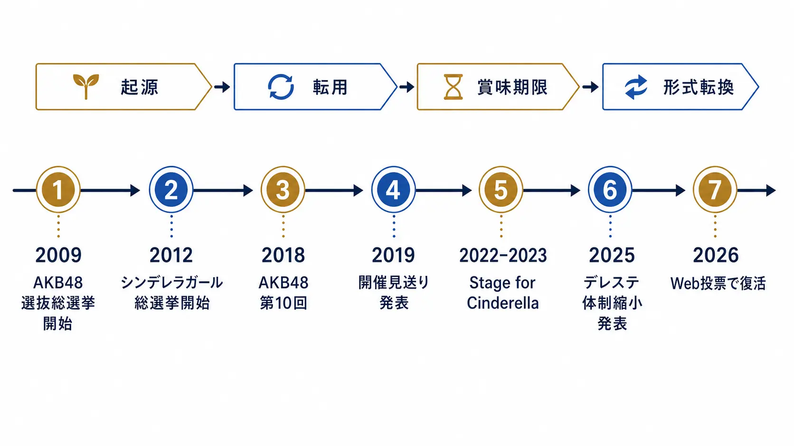
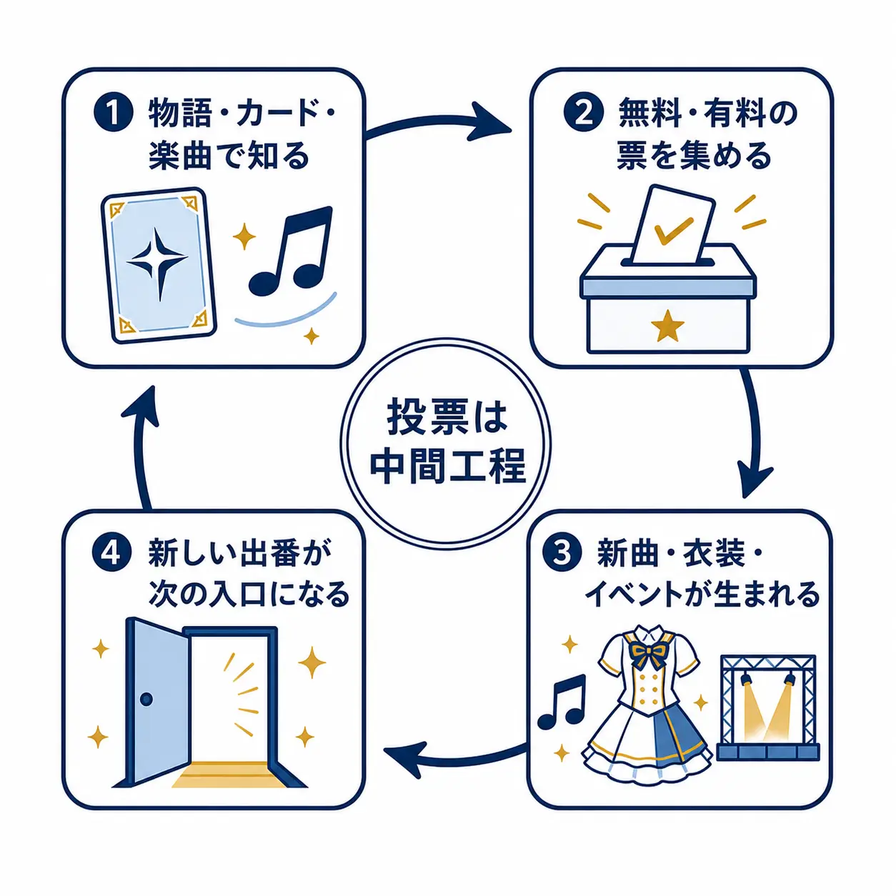
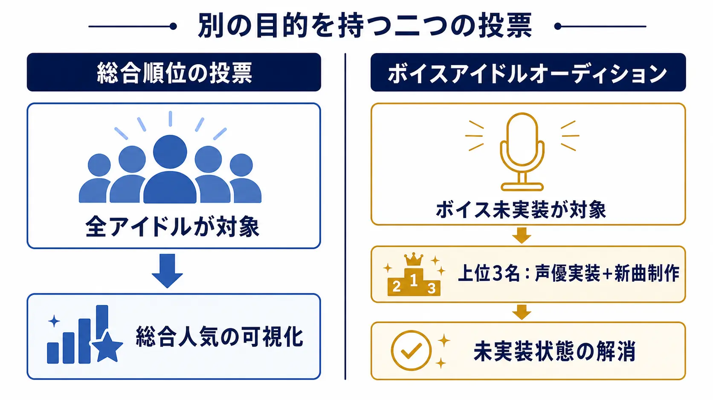
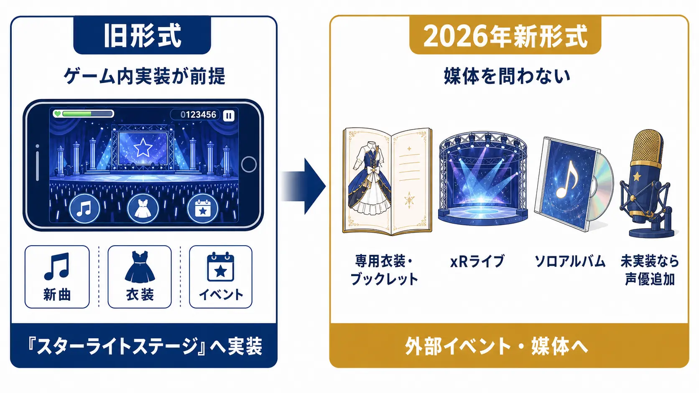

# 課金投票が生んだ「声のつく日」――AKB48選抜総選挙からシンデレラガール総選挙まで、キャラクター人気投票の起源と賞味期限

キャラクター人気投票は、単に「誰が好きか」を集計する企画ではない。投票券の入手経路を商品、ゲーム内行動、会員制度、イベントと結び付け、結果を楽曲、衣装、出演、ボイスへ戻すことで、ファンがコンテンツの次の一部を選ぶ参加装置になる。

この形式を大規模に可視化した先例が、AKB48選抜総選挙である。2009年、AKB48の13thシングルの歌唱メンバーを投票で選ぶ第1回が行われた。後の回では通常盤CDの投票用シリアル、公式ファンクラブやモバイル会員など、複数の経路に投票権が置かれた。CDを買うことが一票を増やす行為になることで、購入と「推しを選抜に入れる」という目的が直結した。[[1](#ref-1)][[2](#ref-2)]

『アイドルマスター シンデレラガールズ』の「シンデレラガール総選挙」は、この参加の型をゲーム内キャラクターへ移した。だが、単に課金票を売ったわけではない。無料参加の入口を残しつつ、上位者に新曲、衣装、そして声という、作品の将来へ戻る報酬を設定した。2026年に復活する総選挙は、ゲーム内ガシャの投票券から離れ、Web投票とライブ・グッズ連動へ重心を移している。

本稿はガチャや景品規制を扱わない。焦点は、人気投票、投票券の経路、当選報酬がひとまとまりになった企画手法である。

*2009年のAKB48選抜総選挙から、ゲーム内実装の制約を越える2026年のWeb投票までをたどる。*

***

## AKB48が示した「購入を意思表示に変える」モデル

AKB48の第1回選抜総選挙は2009年7月8日に開票され、13thシングルの選抜メンバーを決めた。順位は、次のシングルで誰が前に立つかという制作上の配役に直結していた。投票は人気調査ではなく、完成前の作品へ参加する方法だった。[[1](#ref-1)]

この型の重要な点は、投票が一人一票ではなかったことである。たとえば2011年の22ndシングル選抜総選挙では、直前に発売された21stシングルの通常盤CDに投票シリアルナンバーカードを封入した。2017年の公式案内でも、CDに加えてファンクラブ、モバイル、公式アプリなどが投票権の経路として案内されている。[[3](#ref-3)][[2](#ref-2)]

CD購入は、音源を所有する消費だけで終わらない。「このメンバーを次の選抜へ送る」という追加の意味を持つ。複数枚購入も、同じ商品を重ねる行為ではなく、票を積み上げる支援として理解される。選挙ポスター、アピールコメント、速報と開票イベントが加わることで、ファンは候補者の支持者として動き、情報発信や呼びかけも含めて投票期間を過ごした。

これは、投票結果の正確さを競う仕組みではない。誰が選ばれたかを次の作品で見せることによって、投票前の期待、投票中の運動、投票後の鑑賞を一本につなぐ仕組みである。

ただし、この企画は永続する制度ではなかった。第10回に当たる2018年の「AKB48 53rdシングル 世界選抜総選挙」は、ファン投票で選抜・カップリングを含む6ユニット100人を決める企画として実施された。翌2019年、AKB48グループは前年の第10回を大きな区切りとして、その年は実施しないと公式発表した。その後、選抜総選挙は開催されていない。[[4](#ref-4)][[5](#ref-5)]

ここから読み取れるのは、「投票できる」こと自体が作品価値を持つ一方で、毎年同じ熱量で繰り返せるわけではないという事実である。候補者、報酬、発表の舞台が変わらなければ、投票は参加の機会ではなく、既存の支持規模を再確認する年中行事になりやすい。

***

## シンデレラガール総選挙は、人気をコンテンツ制作へ接続した

『アイドルマスター シンデレラガールズ』では、2012年7月に「第1回シンデレラガール選抜総選挙」が始まった。第1位の十時愛梨には「シンデレラガール」の称号が与えられた。候補者が現実のアイドルではなくキャラクターであるため、投票結果を次の出演、カード、楽曲、衣装として実装できる点が、AKB48の選抜総選挙を転用する際の大きな違いである。[[6](#ref-6)]

投票券の設計も、単一の商品に閉じなかった。回次や『シンデレラガールズ』と『スターライトステージ』の運用に応じて、ログイン、ゲーム内のミッションやイベント、投票券付きの有料ガシャなどから票を得る形が組み合わされた。無料の継続プレイを投票へ変える経路と、有償の抽選・商品購入を追加投票へ変える経路を同時に置くことで、参加の入口と強い支援の出口を分けたのである。

このとき、課金は人気投票の結論そのものを買うのではなく、応援の強度を可視化する追加票になる。企画側に必要なのは、無料参加だけでは熱量の低い集計に見え、有償票だけでは資金力だけの競争に見えるという両方の失敗を避けることである。日々のプレイで一票を渡しつつ、購入には追加の支援手段を用意する二層構造には、その緊張を抱え込む役割があった。

報酬は、順位表の外に置かれた。2019年の第8回では、総合上位1〜5位による楽曲「Sun! High! Gold!」、各タイプ上位者による「夢をのぞいたら」が制作された。『スターライトステージ』では上位5人の専用イベントと、3Dライブで使える衣装「サンライトオブフラワー」も作られた。順位がカード上の数字で終わらず、聴ける、見られる、遊べる成果物へ変換される。[[7](#ref-7)]

ここに、キャラクター投票ならではの循環がある。

1. 既存の物語、カード、楽曲、イベントでキャラクターを知る。
2. その魅力を根拠に、無料・有料の複数経路から票を集める。
3. 上位者に新曲、衣装、イベントなどの新たな出番が生まれる。
4. 生まれた成果物が、次にそのキャラクターを知る入口になる。

投票は、ランキングを決める最終工程ではなく、次の制作を選ぶ中間工程となる。

  

*投票は順位を決めて終わる工程ではなく、次の制作物と参加者を生む循環の中間にある。*

***

## 夢見りあむが示した、投票が作品の外側を取り込む瞬間

第8回で3位に入った夢見りあむは、この循環の分かりやすい例である。第8回は彼女にとって初めての総選挙参加であり、上位5人の一人として「Sun! High! Gold!」と「夢をのぞいたら」の歌唱、専用イベント、衣装という報酬へつながった。[[7](#ref-7)]

夢見りあむは、他者からの反応に揺れ、注目を求めながらも失敗を恐れるような自意識を、強い言葉で表に出すキャラクターとして受け取られた。SNSでの炎上、反応数、承認への不安が日常語になった時期に、その感情を作品内のアイドルが露出させる。そうしたキャラクターが、実際のファン運動と多数投票によって上位へ進む状況には、二重の自己言及性がある。

ただし、この事例を「SNSで話題になったから3位になった」という単純な因果にしてはいけない。人気投票の順位は、担当プロデューサーの継続した応援、他のキャラクターとの関係、楽曲やカード、コミュニティの支持が重なった結果である。企画として重要なのは、話題性だけではない。新規キャラクターが、自分の魅力を短い言葉で共有でき、既存のファンが応援する理由も作れるとき、投票の場は新規参入の入口になり得るという点だ。

***

## 「声のつく日」を別枠にした理由

総合順位の報酬が楽曲や衣装だけなら、すでにボイスを持ち、出演機会も多いキャラクターが有利になりやすい。『シンデレラガールズ』は多数のアイドルを抱えるシリーズであり、全員に同じ制作資源を同時に配分することはできない。この非対称性を正面から扱ったのが、「ボイスアイドルオーディション」である。

2014年には「アニバーサリーボイスアイドルオーディション」が行われ、1位の橘ありすにボイスが追加された。[[8](#ref-8)] さらに2020年の第9回、2021年の第10回では、総選挙と「ボイスアイドルオーディション」が同時に開催された。ボイス未実装のアイドルを対象にした別枠の投票であり、上位3人には担当声優を迎え、歌唱する新曲が制作される設計だった。第1回の辻野あかり、砂塚あきら、桐生つかさは「Brand new!」を、第2回の浅利七海、西園寺琴歌、八神マキノは「Let's Sail Away!!!」を歌唱している。公式のCD情報でも、それぞれがCV表記付きで記録されている。[[9](#ref-9)][[10](#ref-10)]

この別枠の価値は、単に「人気が高いから声を付ける」ことにはない。声優の追加は、収録、楽曲、ライブ、コミュ、将来の更新に関わる継続的な制作判断である。そこで総合順位と同じ一枚の表だけに全員を置くと、上位常連の報酬と、新たに出演の扉を開ける報酬が競合してしまう。

二つの投票を分ければ、ファンは「総合のシンデレラガールを目指す票」と「まだ声のないアイドルの制作可能性を開く票」を、目的に応じて扱える。総勢190人のキャラクターを持つからこそ、全体の順位表とは別に、未実装の状態を変える報酬線を引く意味があった。報酬は称号ではなく、コンテンツの参加可能性そのものだった。

*総合人気を測る投票と、未実装状態を変える投票は、対象も報酬も別に設計されていた。*

***

## Stage for Cinderellaと、約3年の空白

第10回と第2回ボイスアイドルオーディションの後、投票企画は「Stage for Cinderella」へ形式を変えた。2022年から予選グループ、プレイオフ、本選を重ね、2023年5月の本選でイヴ・サンタクロースが1位となった。予選を通じて本選に進む方式は、190人を一度に並べるのではなく、各グループに注目の機会を作る試みでもあった。[[11](#ref-11)]

その本選を最後に、次の総選挙が決まるまで約3年が空いた。投票企画にとって空白は、熱量が消えたことを意味しない。むしろ「次に何が選べるのか」という約束が弱くなる期間である。ランキングの発表は一日で終わっても、当選報酬の制作と提供が続くことが、次の投票を待つ理由になる。

ここで母体サービスの状況が、報酬設計の制約として表面化する。『スターライトステージ』は2025年7月、10月から開発・運用体制を変更し、アイドル追加やイベント開催などの更新を順次停止すると発表した。PC版『スターライトステージ』と『スターライトスポット』は同年8月に終了し、新規アイドル、楽曲、衣装、コミュなどの更新も段階的に終えられた。[[12](#ref-12)]

ゲーム内へ新曲や衣装を実装し続けることを前提にした投票報酬は、ゲームの更新体制が変われば、そのままでは履行できない。これは投票企画の失敗ではなく、報酬が特定の運用基盤に依存していたという性質である。報酬を約束する時点で、制作物をどの媒体に残せるかまで決めておかなければならない。

***

## 2026年、投票券と報酬はゲームの外へ広がる

「15th Anniversary シンデレラガール総選挙2026」は、2026年8月3日から9月18日までのWeb投票として予定されている。ゲーム内のガシャ購入で票を増やす形式ではなく、バンダイナムコIDで認証した上で、特設ページから投票する。投票券は、特設ページへのログイン、動画視聴、Xへの共有、店舗チェックインなどの基本ミッションと、対象イベントのチケット・グッズ購入やASOBI STOREプレミアム会員登録などのプレミアムミッションから集める。[[13](#ref-13)][[14](#ref-14)]

ここで消えたのは、課金による追加票そのものではない。ゲーム内の抽選課金を、イベント、物販、会員、スポンサー連動の商品へ置き換えたのである。投票の入口もゲームアプリからブランドのWebハブへ移った。母体ゲームに依存せず、ライブ、グッズ、店舗、配信をまたいで投票券を配れるため、ブランド全体の接点を投票へ接続できる。

報酬も『スターライトステージ』への実装を前提にしない。1位には専用衣装とブックレット、上位5人にはxRライブ、新規楽曲、専用衣装、上位7人にはソロアルバム用の新ソロ曲とカバー曲が予定されている。楽曲制作の対象にボイス未実装のアイドルが入った場合は、キャラクターボイスも追加される。一方で、公式はこれらを『スターライトステージ』へ実装する予定はないと明記している。[[15](#ref-15)]

したがって2026年の形式は、「ボイス実装をやめ、xRライブだけにした」転換ではない。以前のようにボイス追加だけを競う独立の3人枠ではなく、上位5人・上位7人の楽曲とライブの報酬線に、未実装ならボイスを追加する条件を組み込んだ転換である。投票の成果をゲーム内イベントではなく、ライブ、音源、衣装、出版物として残す設計になった。

*報酬の中心は、ゲーム内イベントから、ライブ、音源、出版物などへ移っている。*

***

## プランナーが見るべきは、投票券より報酬の寿命である

課金投票を企画するとき、最初に議論されやすいのは「何円で何票か」「無料票を何枚配るか」である。しかし、投票券は入口にすぎない。企画が信頼を得るかを決めるのは、当選したキャラクターに何が起き、その約束をいつまで履行できるかである。

特に、次の四点を設計段階で切り分けたい。

- **投票の目的：** 総合人気を決めるのか、新規キャラクターを押し上げるのか、未実装の状態を変えるのか。目的が異なるなら、同じ順位表で競わせない。
- **投票券の経路：** 無料の継続参加、有償の強い支援、ゲーム外の商品・イベント参加を、どこまで同じ票として扱うか。経路を増やすほど、投票はブランド横断の接点になるが、仕組みの説明責任も増す。
- **報酬の単位：** 称号だけで終わらせず、楽曲、衣装、出演、ボイスのように、次の接点を増やす成果物へ変換できるか。特にボイスは単発の賞品ではなく、継続制作への入口である。
- **報酬の保存先：** ゲーム内実装だけに依存しないか。アプリの更新体制が変わっても、ライブ、音源、映像、書籍、グッズなどで約束を届けられるか。

AKB48選抜総選挙が示したのは、購入を支持表明に変える力である。シンデレラガール総選挙が発展させたのは、その支持をキャラクターの新曲、衣装、声、出演へ戻す循環である。そして2026年の形式転換が示すのは、投票企画の寿命は課金導線の巧拙だけでは決まらないということだ。

選ばれた後に何を作り、どこで見せ、運用基盤が変わってもどう残すか。そこまで設計されて初めて、投票は一時的な販売施策ではなく、ファンがコンテンツの未来に参加する企画になる。

## References

1. [AKB48 37thシングル 選抜総選挙：選挙ヒストリー][1] - 第1回の開票日と13thシングル選抜の結果を示すAKB48公式ページ。  

2. [AKB48 49thシングル 選抜総選挙：投票権][2] - CD、ファンクラブ、モバイル、公式アプリなどの投票権経路を示すAKB48公式ページ。  

3. [AKB48 22ndシングル選抜総選挙に関するお知らせ][3] - 通常盤CDに投票シリアルナンバーカードを封入したことを示すAKB48公式告知。  

4. [AKB48 53rdシングル 世界選抜総選挙 開催決定の御案内][4] - 2018年の第10回について、選抜・カップリングを含む100人をファン投票で選ぶとしたAKB48公式告知。  

5. [AKB48選抜総選挙につきまして][5] - 2019年は総選挙を実施しないとしたAKB48公式告知。  

6. [「第1回シンデレラガール選抜総選挙」開催][6] - 2012年の第1回の投票期間と結果を示すシンデレラライブラリー。  

7. [「第8回シンデレラガール総選挙」開催][7] - 夢見りあむの3位、上位者の楽曲、イベント、衣装を示す公式ヒストリー。  

8. [「アニバーサリーボイスアイドルオーディション」開催][8] - 2014年のボイス追加を伴う投票の結果を示す公式ヒストリー。  

9. [「第9回シンデレラガール総選挙」＆「ボイスアイドルオーディション」開催][9] - 2020年の総選挙・ボイスアイドルオーディションの結果と楽曲を示す公式ヒストリー。  

10. [「第10回シンデレラガール総選挙」＆「第2回ボイスアイドルオーディション」開催][10] - 2021年の総選挙・第2回ボイスアイドルオーディションの結果と楽曲を示す公式ヒストリー。  

11. [「Stage for Cinderella」本選投票開始][11] - 2023年の本選期間と順位を示す公式ヒストリー。  

12. [アイドルマスター シンデレラガールズ スターライトステージ：重要なお知らせ][12] - 2025年の開発・運用体制変更、PC版終了、コンテンツ更新停止を示す公式告知。  

13. [シンデレラガール総選挙2026：投票方法][13] - 2026年のWeb投票、投票期間、参加条件を示す公式特設ページ。  

14. [「シンデレラガール総選挙2026詳細発表生配信！」告知まとめ][14] - 基本ミッションとプレミアムミッション、対象チケット・グッズを示す公式告知。  

15. [シンデレラガール総選挙2026：報酬情報][15] - 上位5人・上位7人への特典、未実装アイドルへのボイス追加条件、ゲーム内実装予定がないことを示す公式特設ページ。  

[1]: https://www.akb48.co.jp/sousenkyo/37thsingle/history.html
[2]: https://www.akb48.co.jp/sousenkyo49th/vote
[3]: https://www.akb48.co.jp/news/detailpage/4942
[4]: https://www.akb48.co.jp/news/detailpage/19528642
[5]: https://www.akb48.co.jp/news/detailpage/33942968
[6]: https://cinderella-library.idolmaster-official.jp/history/detail/?p=20120718_1
[7]: https://cinderella-library.idolmaster-official.jp/history/detail/?p=20190416_1
[8]: https://cinderella-library.idolmaster-official.jp/history/detail/?p=20141128_2
[9]: https://cinderella-library.idolmaster-official.jp/history/detail/?p=20200417_2
[10]: https://cinderella-library.idolmaster-official.jp/history/detail/?p=20210419_2
[11]: https://cinderella-library.idolmaster-official.jp/history/detail/?p=20230515_1
[12]: https://cinderella.idolmaster.jp/sl-stage/information/
[13]: https://idolmaster-official.jp/cinderellagirls/vote2026/system
[14]: https://idolmaster-official.jp/news/01_18916
[15]: https://idolmaster-official.jp/cinderellagirls/vote2026/achievement

----

この文書は、Perplexity、Claude、OpenAI Codex の3つのAIの支援を受けて著述されたものです。引用画像を除き、MIT License にて提供されています。
