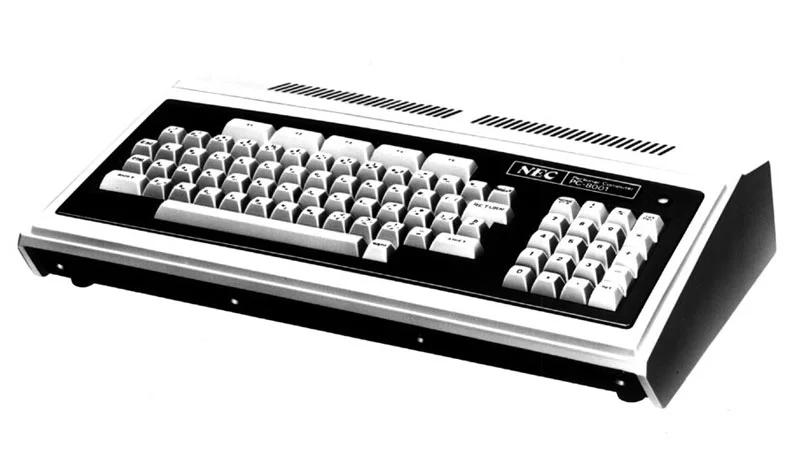
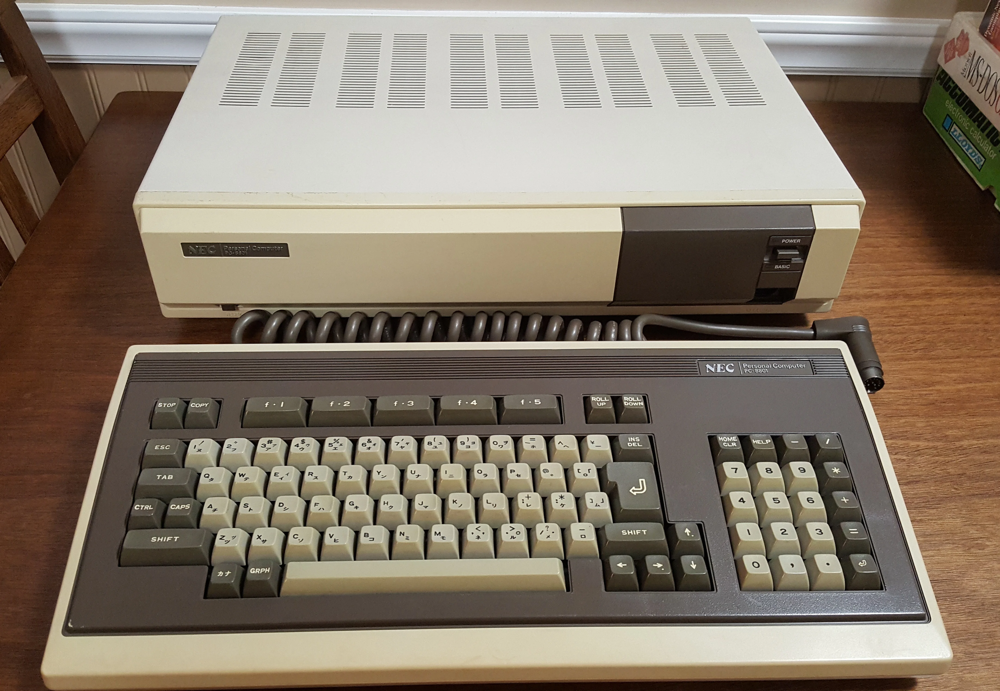
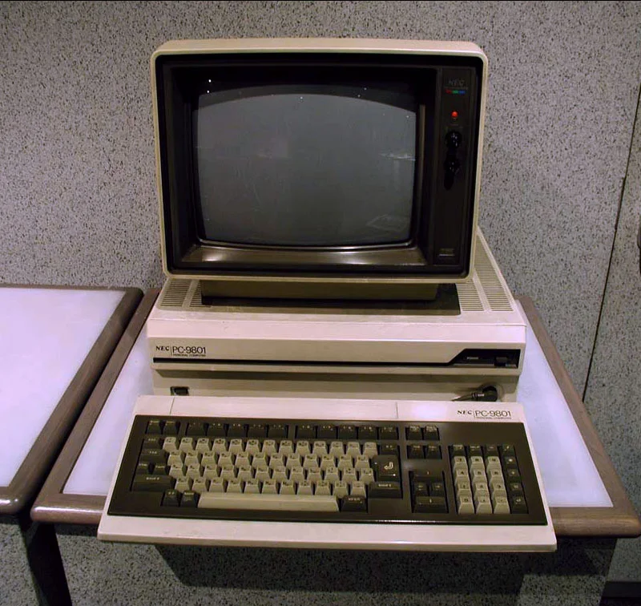
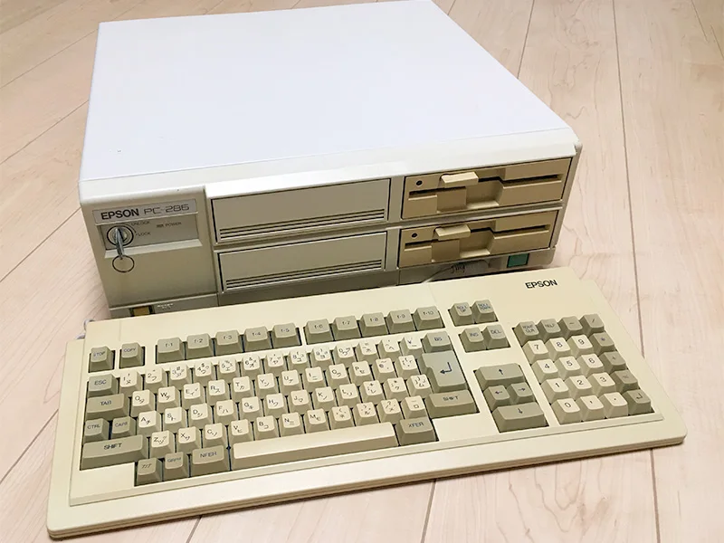
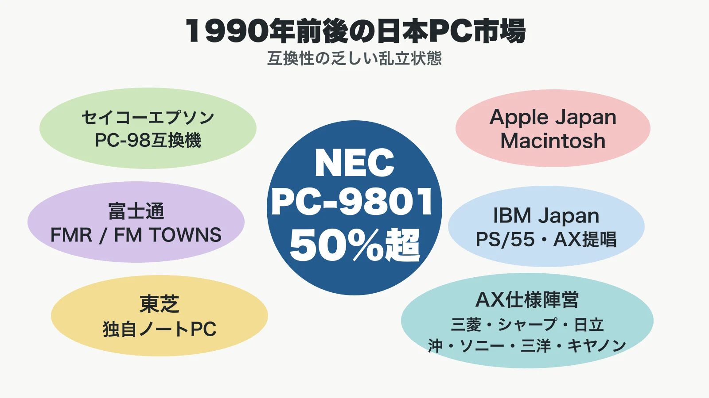

# PC-8000/8800/9800シリーズの歴史：日本語処理が作った国産PCゲーム文化

## はじめに：これは「懐かしの名機」ではなく、標準化競争の話である

PC-8001、PC-8801、PC-9801を一本の歴史として見ると、単なるNEC製パソコンの年代記ではなく、 **日本語を扱うための技術制約が、流通、ソフト開発、ゲームジャンル、そして市場標準まで決めていった過程** が見えてくる。

英語圏のIBM PC/AT互換機は、アルファベット中心の表示と入力を前提に世界標準へ向かった。一方、日本のパソコン市場では、かな、漢字、変換、ワープロ、帳票、店頭サポート、ソフト資産が絡み合い、単にCPUが同じであれば互換になる、という状況ではなかった。ゲームプランナー向けに言えば、これは「ハードスペックの勝負」ではなく、 **入力・表示・保存・販売・サポートを含むプラットフォーム設計** の勝負だった。

本稿ではPC-8001を出発点に、PC-8801がホビーとゲームの市場を育て、PC-9801がビジネス標準として巨大なソフト資産を抱え、最後にWindowsとDOS/Vの波で相対化されていく流れを整理する。なお、PC-98上の同人ソフト文化、家庭用ゲーム機との音源比較は既存記事で扱っているため、本稿では深入りしない。

***

## 年表

| 年 | 出来事 |
|---|---|
| 1979 | NECがPC-8001を発表。BASICをROMに搭載し、CRT、プリンタ、カセット、フロッピー、モデム等を接続できるモジュール型システムとして登場[[1](#ref-1)] |
| 1981 | PC-8801登場。PC-8001系のホビー用途を引き継ぎつつ、より高解像度・日本語対応・業務寄り用途へ広がる |
| 1982 | NECが16ビット機PC-9801を発表。日本語処理とカラーグラフィックを備えたビジネス向けPCとして展開[[2](#ref-2)] |
| 1983 | PC-9800シリーズがソフトメーカー、ボードメーカー、流通、販売店、システムハウスを巻き込む産業構造を形成し始める[[2](#ref-2)] |
| 1985 | PC-8801mkIISR世代でFM音源・強化グラフィックがゲーム表現の中心になる |
| 1987 | セイコーエプソンがNEC互換機PC-286 MODEL 0、PC-286Lを発売し、98互換機市場が顕在化[[3](#ref-3)] |
| 1990 | IBM JapanがDOS/Vを発表。日本語表示を専用ハードからソフトウェア処理へ寄せる転換点となる[[4](#ref-4)] |
| 1992 | Windows 3.1の登場以降、日本でもWindows導入が進み始める[[3](#ref-3)] |
| 1993 | 富士通がAT互換機FMVシリーズを発表。国内メーカーもDOS/V・OADG側へ移る流れが強まる[[3](#ref-3)] |
| 1995 | Windows 95出荷。アプリケーションがハード固有仕様からWindows APIへ寄ることで、PC-98の独自性は弱まる[[3](#ref-3)] |
| 1997 | NECがPC98-NXシリーズを発表。従来のPC-9800互換路線から、Windows時代のPC標準へ舵を切る[[3](#ref-3)] |

***

## 第1章：PC-8001――ホビーPCが「完成品の市場」を作った

1979年5月、NECは同社初のパソコンPC-8001を発表した。情報処理学会コンピュータ博物館は、PC-8001を「キーボード付きの本体」にCRTディスプレイ、プリンタ、カセットテープレコーダ、ミニフロッピーディスク、モデムなどを追加できるモジュール形式のマイクロコンピュータシステムとして説明している。ROMにはMicrosoft BASICが入り、初心者でも対話的にプログラムを組めた。[[1](#ref-1)]

ここで重要なのは、PC-8001が単体の機械としてだけでなく、周辺機器、BASIC、店頭サポート、雑誌文化を巻き込む入口になった点である。後のPCゲーム文化は、最初から「パッケージを買ってすぐ遊ぶ」だけでなく、「自分で打ち込む」「改造する」「周辺機器を増設する」「店頭で相談する」という参加型の文化を含んでいた。

NECの狙いも、単なる玩具ではなかった。PC-8001は8色カラー表示やかな文字、英小文字、記号を扱え、CRTやフロッピー、音響カプラを接続すれば汎用コンピュータの端末としても使えた。[[1](#ref-1)] つまり当初の位置づけは、ホビーパソコンでありながら、教育、端末、簡易業務へ伸ばせる「入口の広い機械」だった。

この設計は、現代のゲームプラットフォームにも通じる。最初に作るべきは最高性能機ではなく、開発者とユーザーが触れる接点である。BASIC、雑誌、販売店、周辺機器は、今日でいうSDK、ドキュメント、ストア、コミュニティに近い役割を担った。

*画像出典（引用）：情報処理学会コンピュータ博物館, [PC-8001][1], Copyright (C) Information Processing Society of Japan / PC-8001本体写真を資料として引用。WebP変換。*

***

## 第2章：PC-8801――ホビーと日本語処理のあいだで市場を握った

PC-8801は、PC-8001の後継的な8ビット上位機として、ホビーと簡易ビジネスの中間に位置した。PC-9801が本格的な16ビット業務機へ向かう一方、PC-8801は家庭・個人ユーザー、プログラミング学習、ゲーム、ワープロ的用途を引き受けた。

市場を押さえた理由は、単一のスペックではない。第一に、日本語表示への対応である。日本語の文章を扱うには、アルファベットだけの表示より高い解像度と文字パターン、入力変換が必要だった。PC-8801系は、機種更新の中で漢字ROMやフロッピーディスク、表示能力を強化し、日本語ワープロ的な利用とゲーム表現の両方へ広がった。

第二に、価格と拡張のバランスである。16ビット機PC-9801はビジネス向けで高価になりやすい。一方、PC-8801は8ビット機としてホビー層に届きやすく、必要に応じてフロッピーや漢字ROM、音源強化へ進める構造を持った。これは、最初から全部入りにするのではなく、ユーザーの用途に応じて段階的に投資させる設計だった。

第三に、ソフト供給網である。Computing Japanは、NECがBit-Innというショールーム網を設け、利用者の要望を観察し、ソフトウェア企業にハードを貸与し技術情報を提供するなど、ISV支援を行ったと説明している。互換性とソフト資産が利用者にとっての最大の魅力になり、利用者が増えるほど開発会社もその機種を優先する循環が生まれた。[[5](#ref-5)]

ゲームプランナーにとっての教訓は明快だ。プラットフォームの魅力は、CPUクロックや色数だけでは決まらない。 **その機械を選べば作り手が多く、教材があり、店で買え、質問でき、次の作品も出る** という期待こそが市場を固める。

*画像出典（引用）：phreakindee, [NEC PC-8801 with keyboard.jpg](https://commons.wikimedia.org/wiki/File:NEC_PC-8801_with_keyboard.jpg), Wikimedia Commons, [CC0 1.0](https://creativecommons.org/publicdomain/zero/1.0/) / PC-8801本体とキーボードを示す資料として引用。WebP変換。*

***

## 第3章：PC-9801――ビジネス需要が「98」を標準にした

1982年10月に発表されたPC-9801は、PC-9800シリーズの初代機である。情報処理学会コンピュータ博物館は、同機をビジネス向けに開発され、最大640KBの主記憶、日本語処理、カラーグラフィック表示機能を備えた16ビットパソコンとして説明している。CPUはNEC製μPD8086、画像処理用LSIとしてμPD7220を搭載した。[[2](#ref-2)]

PC-9801が重要だったのは、8ビット機では重かった日本語処理を、業務用途で実用的に扱える土台にしたことだ。日本語文字コードは16ビットを必要とし、かな漢字変換、ワープロ、表計算、帳票、データベースは、英語圏PCより表示・入力・印刷の負荷が高い。PC-9801はこの問題に対し、日本語表示と高解像度グラフィックを前提にした国内標準を作った。

PC-9801は発表後、ビジネス市場を中心に受け入れられ、ソフトメーカー、ボードメーカー、出版社、ソフト流通、販売店、システムハウスを含む「パソコン産業」の形成に寄与したとされる。[[2](#ref-2)] この記述は、PC-98の本質をよく表している。PC-98は単なる本体ではなく、アプリケーション、周辺機器、解説書、販売店、保守会社まで含む業務インフラだった。

*画像出典（引用）：情報処理学会コンピュータ博物館, [PC-9801][2], Copyright (C) Information Processing Society of Japan / PC-9801初代機の本体写真を資料として引用。WebP変換。*

ここから「98互換機」問題が起こる。1987年、セイコーエプソンはNEC互換のPC-286 MODEL 0を発売し、同年にはPC-286Lも登場した。[[3](#ref-3)]

経緯を具体的に見ると、エプソンは1987年1月に日本経済新聞へ98互換機発売を示唆する広告を出し、3月13日にPC-286シリーズ（MODEL1〜4）を発表した。これに対しNECは、自社のプログラム著作権を侵害しているとして、4月7日に東京地方裁判所へ製造・販売差し止めの仮処分を申し立てた。[[6](#ref-6)] 4月14日の第1回審尋では、BIOSの類似度はソースコード全体のバイト数換算で約1.6%だったとエプソン側が報告した一方、NEC側は「争点は全体に占める割合ではなく、特定ルーチンを侵害したかどうかだ」と反論した。[[6](#ref-6)][[7](#ref-7)] 結局エプソンはMODEL1〜4の製造・販売を中止し、新たなBIOSを搭載したPC-286 MODEL 0を4月24日に発表、同年11月にはNECへ和解金を支払う形で決着した。著作権侵害の当否そのものは、判決に至らないまま残された。

*画像出典（引用）：佐々木潤, [ここから始まるNECとEPSONとの新たなる戦い「EPSON PC-286MODEL 0」][6], AKIBA PC Hotline!, Impress Corporation / EPSON PC-286 MODEL 0本体写真を資料として引用。WebP変換。*

これは、PC-98の価値がNEC本体だけでなく、既存ソフトが動くことに移っていた証拠である。互換機が出るほど標準は強い。しかし標準が独自アーキテクチャに閉じている場合、互換性は同時に法務、BIOS、周辺機器、OS起動チェックの争点になる。

ゲーム業界で言えば、これは「人気エンジンの互換実装」や「ストア外クライアント」と似た緊張を持つ。互換機はユーザー利益を増やす一方、標準を握る側から見れば品質保証、ブランド、権利管理を揺さぶる。PC-98互換機戦争は、標準化が普及の成果であると同時に、支配権争いの始まりでもあることを示した。

***

## 第4章：IBM PC/AT互換機が遅れた理由――日本語処理という壁

日本でIBM PC/AT互換機の普及が遅れた最大の理由は、日本語処理である。Computing Japanは、1990年前後の日本PC市場を、NECのPC-9801、Apple JapanのMacintosh、富士通FMRやFM TOWNS、東芝の独自ノート、IBM JapanのPS/55、AX仕様などが並ぶ、互換性の乏しい市場として描いている。背景には、日本語のかな・漢字を処理するため、各社が独自のダブルバイトOSや表示方式を作らざるを得なかった事情があった。[[5](#ref-5)]

*図：1990年前後の日本PC市場を、互換性の乏しい独立した陣営として整理したもの。*

当時の英語圏PCは、CGAのような低解像度表示でもアルファベットの実用表示ができた。しかし日本語では、漢字を読めるサイズで出すために高解像度ディスプレイ、文字ROM、変換システム、プリンタ出力が必要になる。NEC関係者は、PC-98のために日本語文字セットを作る必要があり、そのためOSも異なるものになったと説明している。[[5](#ref-5)]

DOS/Vはこの構図を変えた。Computing Japanの1995年記事は、従来の日本語表示が漢字ROMという専用チップに依存していたのに対し、DOS/Vは漢字フォントをディスクに置き、拡張メモリへ読み込み、VGAのグラフィックVRAMを使って表示するソフトウェア解決だったと説明している。[[4](#ref-4)] これにより、標準的なPC/AT互換機でも日本語を扱える見通しが立った。

つまり、PC-98の独自性は、1980年代には合理的だった。だがCPU、メモリ、VGA、HDDが十分に安く速くなると、専用ハードで日本語を処理する優位は薄れる。Windows 95以降、アプリケーションがOSのAPI上で動くようになると、ハード固有の日本語処理やバス仕様は差別化ではなく、移植コストになった。

***

## 第5章：PC-88/98で花開いた国産ジャンル

PC-88/98のゲーム史で重要なのは、家庭用ゲーム機と別の入力・保存・画面密度を持っていたことだ。キーボード、フロッピーディスク、高解像度テキスト、長文表示、セーブデータは、アクションだけでなく、RPG、アドベンチャー、シミュレーション、成人向けを含む美少女ゲームの土壌になった。

日本ファルコムのRPG系譜は、その象徴である。『ドラゴンスレイヤー』『ザナドゥ』『イース』へ続く流れは、単に「RPGが増えた」という話ではない。アクション性、成長要素、探索、BGM、パッケージイラスト、マニュアルの読み物性が一体になり、PCゲームを「長く所有する作品」として売る形を作った。特にPC-8801mkIISR以降のFM音源は、ゲーム音楽を単なる効果音から作品の記憶へ押し上げた。

エニックスの『ポートピア連続殺人事件』に代表される国産アドベンチャーは、文字入力と静止画の組み合わせから始まった。PC版の文法は、後のファミコン版でコマンド選択式へ整理され、家庭用機にも流れ込む。GAME Watchは同作を1983年発売のPC用アドベンチャーとして紹介し、プレイヤーが刑事となりヤスとともに事件を追う構造を説明している。[[8](#ref-8)] PCゲーム側で育った「読む・調べる・推理する」遊びは、家庭用機のインターフェース改善を通じて広い層へ届いた。

美少女ゲームやビジュアルノベルの源流も、PC-98の長文表示、静止画、ディスク容量、専門店流通と結びついていた。ただし本稿では作品名を羅列して系譜化することは避ける。重要なのは、PC-98がビジネス機でありながら、画面解像度と流通網の厚みによって、文章と一枚絵を中心にした国産PCゲームの実験場になった点である。

コンパイルについては、同社のシューティング史ではなく、PC-98向けディスクマガジンとして見る方が本稿の主題に近い。旧コンパイル公式のPC-9801年表には、1990年の「ディスクステーション98」系から、1993年10月の『Disc Station Vol.1』、1996年7月の『Disc Station Vol.11』までが並び、途中からCD-ROM媒体も使われている。[[9](#ref-9)] ここで重要なのは個別作品の系譜ではなく、PC-98のディスク容量と店頭・通販流通を前提に、ソフトを号数つきで継続販売する編集形式が、単発パッケージとは別の接点を作ったことである。

***

## 第6章：マイコンショップとパッケージ流通の興亡

PC-88/98時代のソフト流通は、今日のアプリストアとは異なり、店頭、雑誌広告、通販、専門店、デモ機、口コミが混ざっていた。NECのBit-Innのようなショールームは、ユーザーが実機を触り、店員やメーカーから情報を得る場だった。Computing Japanは、こうしたショールームが市場の観測拠点になり、NECがユーザーの関心を把握する場でもあったと説明している。[[5](#ref-5)]

ソフトハウスにとって、パッケージは単なる入れ物ではない。箱、マニュアル、同梱物、広告コピー、店頭ポスター、雑誌レビューが一体になって作品の期待値を作った。PCゲームは家庭用機ほど大量生産前提ではなく、専門店で「分かる人に売る」文化が強かったため、尖ったジャンルも成立しやすかった。

しかしこの流通は、Windows移行とともに揺らぐ。プラットフォームがPC-98固有からWindowsへ移ると、ユーザーはPC-98専門店ではなく、一般的なPC量販店、DOS/V機、海外ソフト、オンライン配布へ向かう。専門店の役割は残りつつも、PC-98固有の棚を維持する必然性は薄れた。技術標準の変化は、販売チャネルの地図も塗り替えたのである。

***

## 第7章：音源・グラフィックの世代変遷

PC-8001の時代、表示は8色カラーや文字表示の扱いやすさが大きな魅力だった。[[1](#ref-1)] PC-8801では高解像度表示と8ビット機としての扱いやすさが合わさり、アドベンチャーの静止画、RPGのマップ、シミュレーションの情報表示に適した画面が作られた。PC-8801mkIISR世代ではFM音源が標準的なゲーム表現の一部になり、BGMは作品のブランドを支える要素になった。

PC-9801は、最初からビジネス向けの日本語処理とカラーグラフィック表示を備え、μPD7220を搭載していた。[[2](#ref-2)] その後のPC-98ゲームでは、640×400ドット級の情報密度が、文字量の多いアドベンチャー、戦略シミュレーション、RPGのメニュー設計に向いた。一方で、家庭用ゲーム機のような多数のスプライト表示やスクロール専用設計ではないため、アクションゲームでは工夫が必要だった。

音源面では、PC-88のFM音源文化が先行し、PC-98ではPC-9801-26系、PC-9801-86系などの音源ボードを通じてFM音源、SSG、リズム音源、PCM的表現が段階的に広がった。ここで家庭用ゲーム機との優劣比較に踏み込む必要はない。重要なのは、PC-88/98内部で **ビープ音中心からFM音源、さらにPCM的表現へ** と移り、作曲・効果音・ドライバ開発がソフトハウスの競争力になった点である。

***

## 第8章：Windows移行期の凋落

1990年代前半、DOS/VはPC/AT互換機で日本語を扱う道を開き、Compaqなどの低価格機が価格競争を起こした。Computing Japanは、1992年のCompaq参入がいわゆる「Compaq Shock」となり、IBM、国内メーカー、NECを価格競争へ巻き込んだと説明している。[[5](#ref-5)]

1995年のWindows 95以降、問題はさらに大きく変わる。アプリケーションがWindows上で動くなら、PC-98専用に作る理由は弱くなる。利用者にとって重要なのは「98でしか動かない」ことではなく、「仕事で使うソフトが動く」「周辺機器が安い」「インターネットにつながる」「海外標準と互換がある」ことになった。

NECもこの流れに対応した。情報処理学会の年表では、1997年10月にNECが「PC 97/PC 98システムデザイン」を取り込んだPC98-NXシリーズを発表したことが記録されている。[[3](#ref-3)] 名前に「98」を残しながらも、従来のPC-9800互換路線からWindows時代のPC標準へ寄せていく転換だった。

PC-98の凋落は、技術的敗北というより、成功した独自標準が汎用標準に包み込まれた結果である。日本語処理、表示、周辺機器、ソフト供給網というローカル最適が、WindowsとPC/AT互換機のグローバル標準化によって置き換えられた。独自性は強みだったが、OSとアプリケーションの抽象化が進むと、同じ独自性が開発・移植・価格の負担になる。

***

## おわりに：PC-88/98は、ゲーム制作の「場」を作った

PC-8001は、個人がコンピュータに触れる入口を作った。PC-8801は、ホビー、学習、日本語表示、ゲーム制作を結びつけた。PC-9801は、ビジネス標準として巨大なソフト資産と周辺産業を作り、結果としてPCゲームの市場も支えた。

その歴史から学べるのは、プラットフォームはハードだけでは成立しないということだ。日本語処理、開発資料、店頭サポート、雑誌、パッケージ流通、互換性、周辺機器、そして「次もこの環境で作れば売れる」という期待が、PC-88/98のゲーム文化を育てた。

現代のモバイルゲームやPCゲームでも同じである。ストアの審査、SDK、広告運用、コミュニティ、決済、ランキング、ライブ運営が、作品の形を決める。PC-8001からPC-9801までの歴史は、制約がジャンルを生み、流通が作風を育て、標準化が勝者を作り、やがて別の標準化に飲み込まれるという、プラットフォーム史の濃縮版なのである。

***

## References

1. [PC-8001｜情報処理学会コンピュータ博物館][1] - 1979年発表、BASIC ROM、8色表示、周辺機器を追加できるモジュール形式の概要を確認した。

2. [PC-9801｜情報処理学会コンピュータ博物館][2] - 1982年発表、ビジネス向け、日本語処理、μPD8086、μPD7220、PC産業形成への寄与を確認した。

3. [パーソナルコンピュータ年表｜情報処理学会コンピュータ博物館][3] - PC-9801、エプソン互換機、Windows、FMV、PC98-NXなどの年表確認に用いた。

4. [DOS/V: The Soft(ware) Solution to Hard(ware) Problems｜Computing Japan][4] - DOS/Vが漢字ROM依存をソフトウェア表示へ移した経緯、VGA、フォント、FEP周辺の説明を参照した。

5. [From Chaos to Competition: Japan's PC industry in transformation｜Computing Japan][5] - 日本PC市場の独自アーキテクチャ乱立、NECのBit-Inn、ISV支援、DOS/V・OADG・Compaq Shockの流れを参照した。

6. [ここから始まるNECとEPSONとの新たなる戦い「EPSON PC-286MODEL 0」｜AKIBA PC Hotline!][6] - 98互換機戦争の経緯（広告、発表、NECによる仮処分申し立て、BIOS類似度1.6%、MODEL 0への切り替え）を確認した。

7. [「98互換機」と黒船来襲――エプソンとNECの奇妙な関係｜ITmedia][7] - NEC・エプソン双方の当時のコメント、訴訟の争点を確認した。

8. [ファミコン版「ポートピア連続殺人事件」が発売40周年！｜GAME Watch][8] - 『ポートピア連続殺人事件』のPC発アドベンチャーとしての概要確認に用いた。

9. [COMPILE GAME HISTORY -PC-9801-｜コンパイル（Internet Archive）][9] - PC-9801向け『Disc Station』各号の発売時期、媒体、価格帯を確認した。

[1]: https://museum.ipsj.or.jp/computer/personal/0001.html
[2]: https://museum.ipsj.or.jp/computer/personal/0011.html
[3]: https://museum.ipsj.or.jp/computer/personal/index.html
[4]: https://www.japaninc.com/cpj/magazine/issues/1995/mar95/03dosv.html
[5]: https://www.japaninc.com/cpj/magazine/issues/1997/apr97/chaos.html
[6]: https://akiba-pc.watch.impress.co.jp/docs/column/retrohard/1415316.html
[7]: https://www.itmedia.co.jp/enterprise/articles/0709/12/news002.html
[8]: https://game.watch.impress.co.jp/docs/kikaku/2064990.html
[9]: https://web.archive.org/web/20021003171644/http://www.compile.co.jp/game/other/9801.html

----

この文書は、Perplexity、Claude、OpenAI Codex の3つのAIの支援を受けて著述されたものです。引用画像を除き、MIT License にて提供されています。
