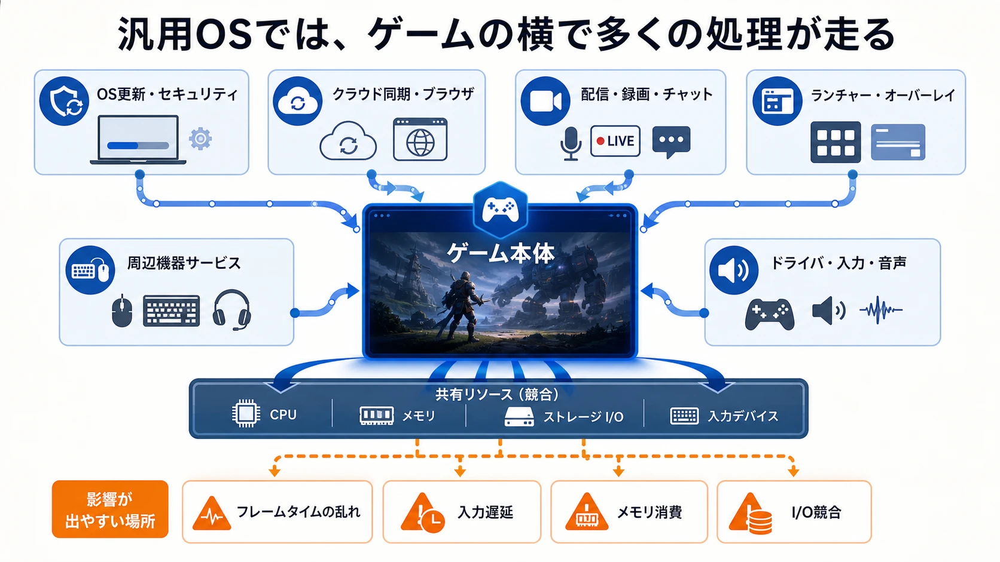
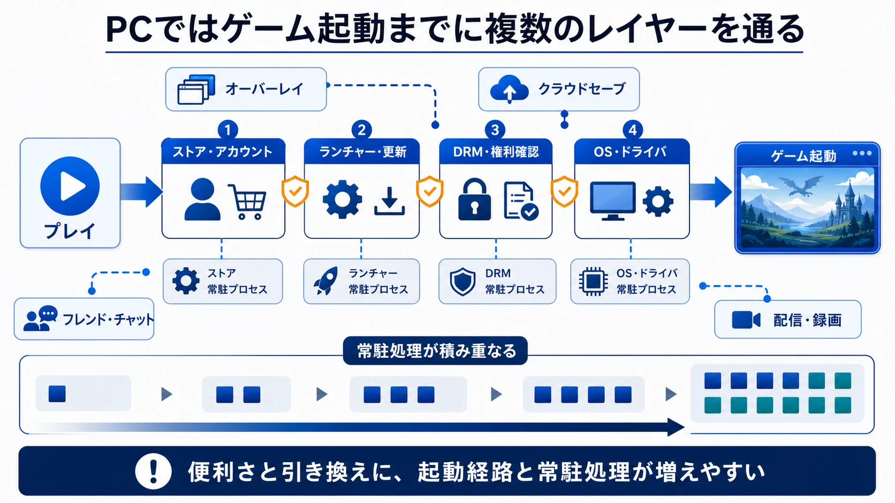
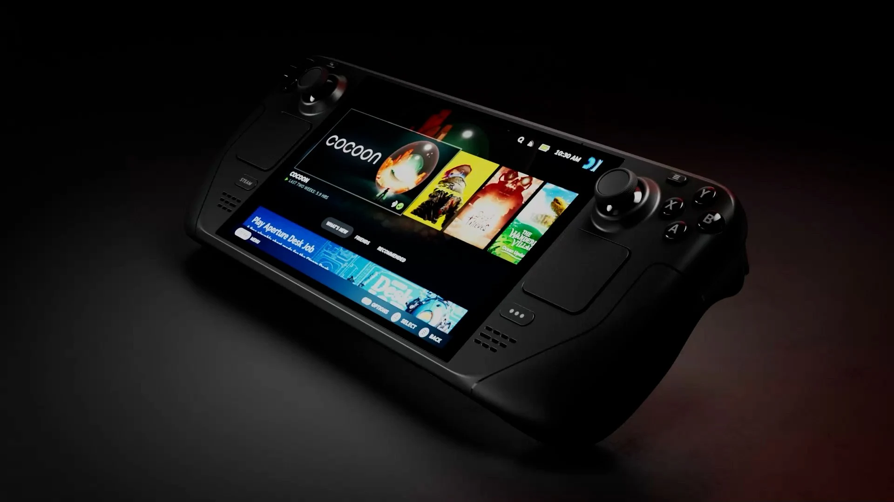
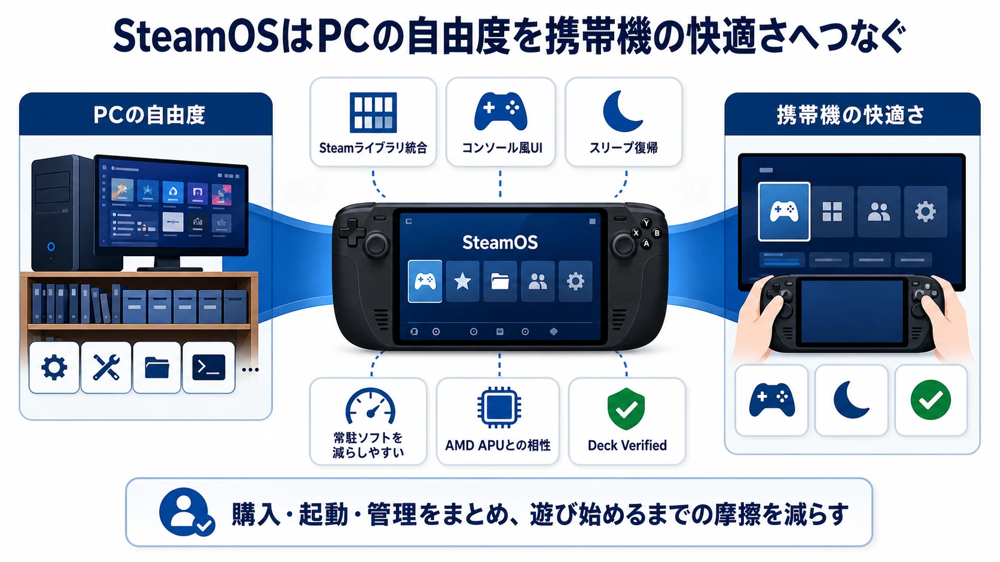
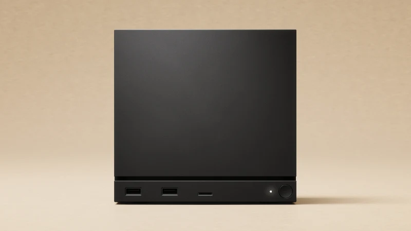
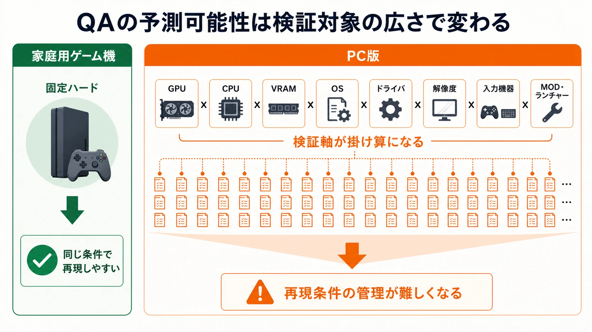
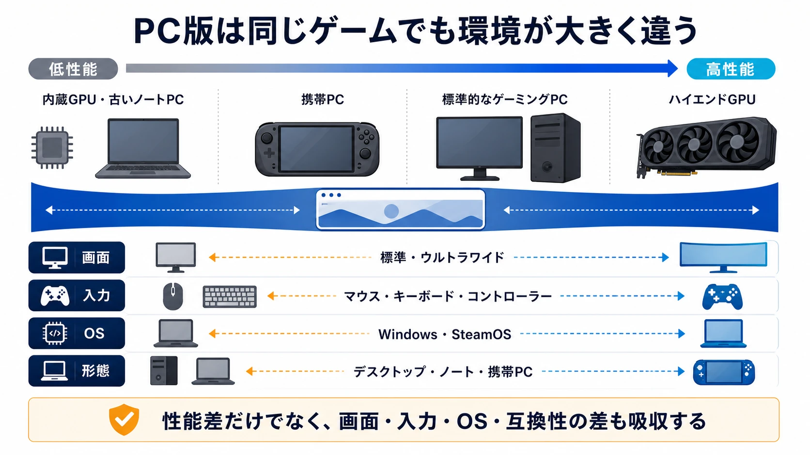
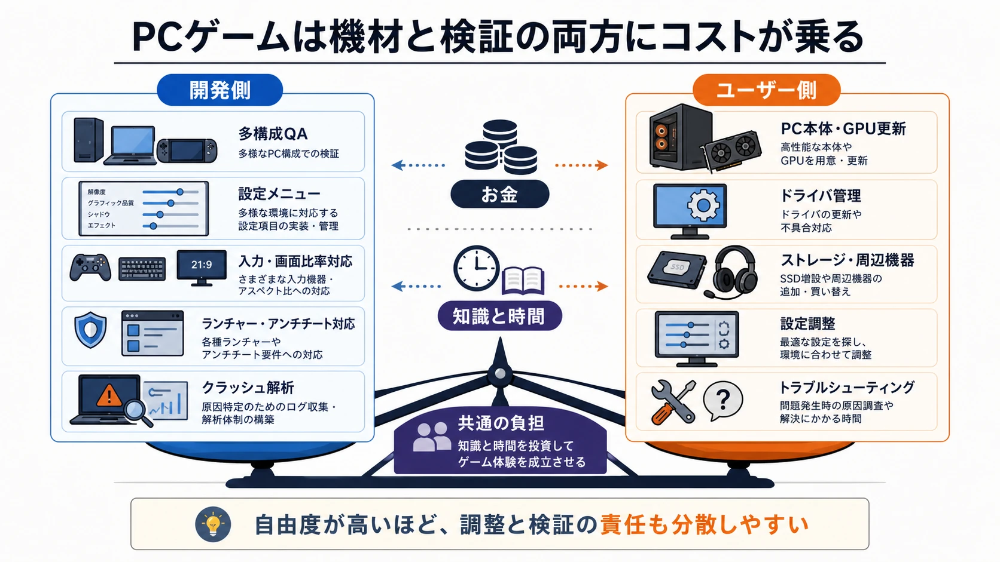

# レポート：PCゲームと家庭用コンソールのゲームの性能比較

## ― 汎用OSと専用OSの違いは、どこで効くのか

## 1. 要旨

PCゲームと家庭用ゲーム機ゲームの性能差は、単純に「PCのほうが高性能」「家庭用機のほうが最適化されている」では片づかない。実態としては、 **PCは上限性能・自由度・拡張性で勝ち、家庭用機は一定性能の引き出しやすさ・開発時の予測可能性・ユーザー体験の統一性で勝つ** 、という構図だ。

特に近年は、PC側にも変化がある。Windowsだけでなく、Steam Deck以降のSteamOS／Proton環境が成長し、LinuxベースのゲーミングOSが「PCだけど家庭用機に近い体験」を提供し始めている。ValveはSteamOSをLinuxベースのOSとして位置づけ、Steam DeckにはWindowsゲームを動かす互換レイヤーであるProtonが含まれると説明している。[[1](#ref-1)][[2](#ref-2)]

一方で、PCゲーム市場の中心は依然としてWindowsだ。Steam Hardware & Software Surveyの2026年4月データでも、OS全体ではWindowsが93.47%、Linuxが4.52%となっている。つまり、SteamOSは重要な新潮流ではあるものの、現時点では「Windowsを置き換えた主流」ではなく、 **携帯PC・リビングPC・Steamエコシステム向けの強い選択肢** と見るのが妥当である。[[3](#ref-3)]

---

## 2. 比較対象の整理

ここでいう「PCゲーム」は、主に以下を含む。

| 区分 | 代表例 | 特徴 |
|---|---|---|
| Windows PC | デスクトップPC、ゲーミングノート、ROG Ally系 | 最大市場。DirectX、各種ランチャー、MOD、周辺機器が強い |
| SteamOS系PC | Steam Deck、SteamOS対応携帯機、Steam Machine | Linuxベース。Steam中心。ProtonでWindowsゲームを動かす |
| Linuxゲーミング環境 | Bazziteなど | SteamOSに近い体験を一般PC・携帯PCに拡張 |

「家庭用ゲーム機」は、主にPS5／Xbox Series X｜S／Nintendo Switch系のような、ハードとOSとストアが統合された環境を想定する。

PlayStation系では、Sonyの公式OSSページでPlayStation製品に使われるオープンソースソフトウェアが公開されており、PS4のページにはFreeBSD Kernelなどが明記されている。Xbox Series X｜Sは、Windows系技術やDirectX、専用ストレージアーキテクチャと密接に結びついた設計だ。MicrosoftはXbox Velocity Architectureを、SSD・専用ハードウェア・DirectStorage APIなどを組み合わせたアセットストリーミング基盤として説明している。[[4](#ref-4)][[5](#ref-5)]

---

## 3. 性能比較の基本構図

### 3.1 ピーク性能：PCが有利

最高級GPU・高クロックCPU・大容量メモリ・高速NVMe SSDを組み合わせたハイエンドPCは、家庭用ゲーム機より高い解像度、フレームレート、レイトレーシング品質を狙える。

PCの強みは、たとえるなら「レースカーを自分で組める」ことだ。高価なパーツを投入すれば、4K高リフレッシュレート、ウルトラ設定、マルチモニター、VR、高品質MODなど、家庭用機の枠を超える体験が可能になる。

ただし、これは **上限性能の話** だ。市場に存在するPCの大半はハイエンドではない。PCゲーム開発では、多様なハードウェア構成への対応が常に課題になる。

### 3.2 実効性能：家庭用機が意外に強い

家庭用機は、同価格帯のPCと比べると実効性能で強みを発揮しやすい。理由は明確だ。

- ハード構成が固定されている
- OS・ドライバ・API・ストレージがゲーム向けに統合されている
- 開発者が特定構成に対して深く最適化できる
- ユーザー環境のばらつきが少ない
- バックグラウンドプロセスや常駐ソフトの影響が小さい

たとえばXbox Velocity Architectureは、ストレージ、専用I/O、展開処理、APIをまとめてゲームのアセットストリーミングに最適化する設計だ。Microsoftは、DirectStorageのコンソール向け説明で、DirectStorageがOSオーバーヘッドを減らし、ハードウェア展開によってCPU負荷を下げると説明している。[[5](#ref-5)][[6](#ref-6)]

PCにもDirectStorageはある。MicrosoftはDirectStorage 1.1について、GPU展開とGDeflateを利用でき、NVMe SSDや最新ドライバの利用を推奨している。ただしPCでは、SSD、GPU、ドライバ、OS設定、ゲーム側実装がそろわないと効果が出にくい。家庭用機では、その前提条件を最初からプラットフォーム側が固定できる。[[7](#ref-7)]

---

## 4. 汎用OSのオーバーヘッドとは何か

「Windowsは重い」「汎用OSはオーバーヘッドがある」とよく言われるが、これは単にCPU使用率が数%高いという話だけではない。主なオーバーヘッドは次の通りだ。

### 4.1 バックグラウンド処理

Windows PCでは、ゲーム以外にも多くの処理が同時に動く。

家庭用機にもバックグラウンド処理はあるが、ゲーム体験を壊さない範囲に設計・制限されている。PCではユーザーが自由に環境を構築できる反面、ゲームに関係ないソフトがフレームタイムの乱れ、入力遅延、メモリ消費、I/O競合を生むことがある。

### 4.2 ドライバと互換性レイヤー

PCゲームは、膨大なGPU、CPU、メモリ構成、ディスプレイ、入力機器、サウンド環境に対応する必要がある。これはゲーマーにとっては自由度だが、開発側には検証コストとして跳ね返る。

家庭用機なら「このGPU、このメモリ帯域、このSSD、このコントローラー」でほぼ固定だ。PCでは「あるユーザーだけクラッシュする」「特定ドライバだけ描画が崩れる」「特定ランチャーのオーバーレイで不具合が出る」といった問題が起きやすい。

### 4.3 セキュリティと管理機能

汎用OSはゲーム専用ではない。仕事、金融、ブラウジング、開発、動画編集、企業管理などにも使われる。そのため、ゲームだけを考えれば余分に見えるセキュリティ機能、権限管理、互換性維持、仮想化、更新機構が必要である。

これは「無駄」というより、PCが汎用機であるための税金だ。ゲーム機は空港の専用レーン、PCは巨大な総合駅、という感じだ。総合駅は便利だが、人も店も広告も多く、ゲームだけに最短化されてはいない。

### 4.4 ストア・ランチャー・DRMの多重化

PCではSteam、Epic Games Store、Battle.net、EA app、Ubisoft Connect、Xboxアプリなどが並立する。これらは便利な反面、以下のコストを生む。

家庭用機にもDRMやストア認証はあるが、プラットフォーム全体に統合されている。PCでは「ゲームの上にストア、その上にOS、その横に別ランチャー」という重層構造になりがちだ。

---

## 5. SteamOSの最新動向と意味

SteamOSは、PCゲームの世界においてかなり面白い中間地点だ。PCの自由度を残しつつ、家庭用機のような起動体験・スリープ復帰・コントローラー操作・統一UIを目指している。

ValveはProtonを、SteamクライアントでWindows専用ゲームをLinux上で動かすためのツールとして公開している。Steam Deckのソフトウェア紹介でも、SteamOSはLinuxシステムであり、Protonによって開発者の移植作業なしにゲームを動かせる場合があると説明されている。[[1](#ref-1)][[2](#ref-2)]

### 5.1 Protonとは何か

Protonは、単なる「Windowsゲーム起動ボタン」ではない。大まかには、Windows向けゲームが期待するAPIや実行環境を、Linux上で再現する互換レイヤーだ。Wineを土台にしつつ、DirectXをVulkanへ変換するDXVKやvkd3d-proton、音声・動画・入力・Steamworks連携などの部品を組み合わせ、Steamクライアントから扱いやすい形にまとめている。ValveのProtonリポジトリでも、ProtonはWineなどを使ってWindows専用ゲームをLinux上で動かすためのツールとして説明されている。[[2](#ref-2)]

新人プランナー向けに言うなら、Protonは「ゲームを移植する」のではなく、 **Windowsゲームが呼び出す前提条件をLinux側で受け止める翻訳・互換の層** だ。ゲーム側から見るとWindowsのAPIを呼んでいるつもりでも、その裏では描画、入力、ファイルアクセス、ネットワーク、動画再生、ミドルウェアなどがLinux環境へ橋渡しされる。

この仕組みがあるため、SteamOSはLinuxベースでありながら、多くのWindows向けSteamゲームを動かせる。ただし、Protonは万能ではない。Windowsの機能を完全に再現できない場合、独自ランチャーやDRMが複雑な場合、アンチチートがカーネル空間に依存する場合などは、互換性の壁に当たりやすい。

Proton周辺では、互換性と性能を上げるための低レイヤー改善も続いている。たとえばNTSYNCは、Windows NT系の同期プリミティブをLinux上でより正確かつ効率よく扱うためのLinuxカーネル側ドライバだ。Linuxカーネル文書では、NTSYNCはユーザー空間のNTエミュレータ向け互換ツールであり、既存のユーザー空間実装だけではWindows相当の性能と正確な意味論を両立しにくいことが背景として説明されている。Wine側でもNTSYNCを使った同期処理の実装が提案されている。[[11](#ref-11)][[12](#ref-12)]

ただし、NTSYNCは「SteamOSなら常に効く魔法の高速化」と見るべきではない。効果はカーネル、Wine/Proton側の対応、ゲームの処理内容によって変わる。ここで重要なのは、SteamOSやProtonが静的な互換レイヤーではなく、Linuxカーネル、Wine、DXVK、vkd3d-proton、ドライバ更新と一緒に改善され続ける技術スタックだという点である。

### 5.2 SteamOSのメリット

SteamOSの強みは、特に携帯ゲーミングPCで出る。

*画像引用: [Steam Deck公式サイト](https://www.steamdeck.com/en/)（Valve公開のSteam Deck OLED本体画像, © Valve Corporation。携帯ゲーミングPCとしての本体形状と操作系を説明するために引用。WebP変換）*

Steam Deck Verifiedでは、ValveがSteam Deckでの互換性評価を行い、Verified、Playable、Unsupported、Unknownの4カテゴリで表示している。これは、PCでありながら家庭用機的な「このゲームはこの環境で遊べるのか」を可視化する仕組みだ。[[8](#ref-8)]

### 5.3 SteamOSの弱点

一方で、SteamOSにも明確な弱点がある。

最大の問題は、 **互換性が100%ではない** ことだ。Protonは非常に強力だが、すべてのWindowsゲームが完全に動くわけではない。ValveもProtonを「進行中のプロジェクト」と位置づけ、カーネル空間のアンチチートは現在サポートされず推奨しないと説明している。特に問題になりやすいのは、カーネルレベルのアンチチートや独自ランチャーだ。[[9](#ref-9)][[10](#ref-10)]

つまりSteamOSは、シングルプレイ中心、Steam中心、携帯機中心ならかなり強い。しかし、競技系FPS、ライブサービス、独自ランチャー依存タイトルを多く遊ぶユーザーにとっては、Windowsのほうが安全だ。

### 5.4 SteamOSは「PCの家庭用機化」である

SteamOSの本質は、Linuxそのものよりも、 **PCゲーム環境をゲーム機的に再設計する試み** だ。

Windows PCは「何でもできる機械」だ。SteamOSは「Steamゲームを気持ちよく遊ぶ機械」に寄せている。この違いは大きい。新人プランナー向けに言うなら、SteamOSはプラットフォーム設計として、PCとコンソールの中間にある「半固定環境」だ。

### 5.5 Steam Machineの発売で「リビング向けSteamOS PC」が具体化

Valveは2025年11月12日に新しいSteam Machineを発表し、2026年6月22日に予約受付を開始した。2015年のSteam Machineが複数メーカーによる製品群だったのに対し、今回はValveが設計した約160mm角の小型PCで、テレビにつないでSteamライブラリを遊ぶことを明確な用途としている。[[13](#ref-13)][[14](#ref-14)]

*画像引用: [Steam Machine公式製品ページ](https://store.steampowered.com/sale/steammachine)（Valve公開のSteam Machine本体画像, © Valve Corporation。リビング向け小型PCとしての本体形状を説明するために引用。WebP変換）*

主な仕様は次の通りだ。

| 項目 | Steam Machineの仕様 |
|---|---|
| CPU | セミカスタムAMD Zen 4、6コア／12スレッド、最大4.8GHz、TDP 30W |
| GPU | セミカスタムAMD RDNA 3、28 CU、最大持続クロック2.45GHz、TDP 110W |
| メモリ | 16GB DDR5＋8GB GDDR6 VRAM |
| ストレージ | 512GBまたは2TBのNVMe SSD。microSDで拡張可能 |
| OS | Arch LinuxベースのSteamOS 3。デスクトップ環境はKDE Plasma |

ValveはSteam Deckの6倍を超える性能と、FSR 4.1を利用した最大4Kのゲーム体験を掲げている。また、Steam Deck Verifiedに相当する「Steam Machine Verified」を導入し、各ゲームがどの程度動作するかを購入前に確認できるようにする。[[13](#ref-13)]

一方、米国価格は512GBモデルが1,049ドル、2TBモデルが1,349ドルで、Steam Controller付きはそれぞれ79ドル高い。Valveは、家庭用機のようにハードを原価割れで販売してソフトやサブスクリプションで回収する方式を採らず、Steam Machineをコンソールではなく「PCゲームの拡張」と位置づけている。部品価格の上昇と供給不足により当初の価格目標を維持できず、初回生産数も制約を受けたという。[[14](#ref-14)]

予約は2026年6月25日10時（太平洋時間）に一度抽選され、購入案内は6月29日の週から年内にかけて順次送られる予定だ。日本ではValveからの直接販売ではなく、公式販売代理店KOMODOを通じて扱われる。[[13](#ref-13)][[14](#ref-14)]

性能比較の観点で重要なのは、Steam Machineが **家庭用機に近い固定構成と統一UIを持ちながら、別のアプリやOSも導入できるPC** だという点である。固定ハードによってValveや開発者は動作検証と最適化の基準を作りやすくなるが、価格構造、周辺機器、ソフトウェアの自由度はPCの論理を維持している。

さらにValveは、SteamOS 3.8から一般のリビングPCにもSteam Machineと同じコードベースのOSを導入できるようにした。現時点ではAMD GPUのみの対応だが、Steam Machineは単体製品であると同時に、SteamOSを自作PCや他社ハードへ広げるための基準機としての意味も持つ。[[13](#ref-13)]

---

## 6. 家庭用ゲーム機のメリット

### 6.1 最適化しやすい

家庭用機最大の強みは、固定ハードだ。開発者は、CPUコア数、GPU性能、メモリ容量、I/O性能、コントローラー、表示モードをかなり正確に想定できる。

PCでは「最低設定」「推奨設定」「ウルトラ設定」を分ける必要があるが、家庭用機では特定のターゲットに合わせて最適化できる。結果として、スペック表だけを見るとPCより劣るハードでも、見た目やフレームレートが安定しやすい。

### 6.2 ユーザー体験が安定している

家庭用機では、ユーザーがゲームを買って起動するまでの経路が短い。

- 本体を起動
- ゲームを選ぶ
- 遊ぶ

PCでは、その間に以下が入りがちだ。

- OS更新
- GPUドライバ更新
- ランチャーログイン
- ランタイム導入
- グラフィック設定
- コントローラー設定
- 互換性確認

もちろんPCに慣れたゲーマーにはこれも楽しみの一部だが、一般ユーザー向けには摩擦だ。

### 6.3 開発・QAの予測可能性

家庭用機は、QAの観点でも有利だ。検証対象が限定されるため、「全ユーザーで同じように動く」状態を作りやすい。

PC版では、GPUメーカー、VRAM容量、CPU世代、OSバージョン、ドライバ、解像度、入力機器、ウルトラワイド、MOD、ランチャーなど、検証項目が爆発する。家庭用機では、その分のコストをゲーム内容やパフォーマンス調整に回しやすい。

---

## 7. 家庭用ゲーム機のデメリット

### 7.1 上限性能は固定される

家庭用機は発売時点のハードに縛られる。世代後半になるほど、PCとの差は広がる。中間強化モデルはあるが、それでもPCのようにGPUだけ交換することはできない。

### 7.2 表現設定の自由度が低い

家庭用機では、グラフィック設定が限られることが多い。

- 品質モード
- パフォーマンスモード
- 120Hzモード
- レイトレーシングON/OFF

この程度に整理されることが一般的だ。これは分かりやすい反面、PCのようにテクスチャ、影、AO、DLSS/FSR、視野角、描画距離、フレーム上限などを細かく調整したいユーザーには物足りない。

### 7.3 ストアとプラットフォームに縛られる

家庭用機では、ストア、セーブ、オンライン、MOD、外部ツール、配信機能、周辺機器がプラットフォームの制約下にある。PCは不便なことも多いが、やろうと思えばかなり自由だ。

家庭用機は「旅館の会席料理」、PCは「巨大な業務スーパー＋自炊」だ。前者は整っていて失敗しにくい。後者は面倒だが、自由度と上限が高い。

---

## 8. PCゲームのメリット

### 8.1 上限性能と拡張性

PC最大の魅力は、性能の天井が高いことだ。

- 4K／8K
- 高リフレッシュレート
- ウルトラワイド
- マルチモニター
- 高品質レイトレーシング
- DLSS／FSR／XeSS
- MOD
- 配信・録画・編集の統合
- キーボード・マウス・各種コントローラー
- VR・シミュレーター周辺機器

家庭用機は「一定品質を多くの人に届ける」設計だ。PCは「こだわる人が限界まで伸ばせる」設計だ。

### 8.2 後方互換・保存性

PCゲームは、古いタイトルを長く遊べる可能性が高い。もちろんOS更新やDRM終了で動かなくなる例もあるが、エミュレーション、互換レイヤー、MOD、非公式パッチにより復活することもある。

家庭用機は世代交代の影響を受けやすく、ストア閉鎖や互換性方針に左右される。

### 8.3 開発者にとっての市場規模

PCは世界市場が大きく、Steamを中心にインディーゲームの販売経路も整っている。家庭用機に比べると、ストア審査や開発機材のハードルが低い場合も多く、早期アクセスや頻繁なアップデートとも相性がよい。

---

## 9. PCゲームのデメリット

### 9.1 環境差が大きい

PC版開発の最大の敵は、ユーザー環境のばらつきだ。

同じゲームでも、以下のような差がある。

新人プランナーが理解すべきなのは、PC版の仕様を考えるとき、 **「ゲームデザイン」だけでなく「環境差を吸収する設計」も必要になる** ということだ。

### 9.2 追加コストが発生する

PCゲームでは、家庭用機には少ない追加コストが発生する。

PCゲームは安いセールも多いが、総体験としては「機材と知識に投資する趣味」になりやすい。

---

## 10. Windows、SteamOS、家庭用機の比較

| 観点 | Windows PC | SteamOS系PC | 家庭用ゲーム機 |
|---|---|---|---|
| 性能上限 | 非常に高い | 機種次第 | 固定。世代内では一定 |
| 体験の安定性 | 環境差が大きい | Steam中心なら高い | 高い |
| 互換性 | 最大 | Proton依存。弱点あり | その機種向けなら高い |
| アンチチート対応 | 強い | 一部タイトルで弱い | 強い |
| UI | 汎用PC寄り | コンソール寄り | 完全にコンソール向け |
| MOD | 強い | タイトル次第 | 弱い |
| 開発QA負荷 | 高い | 中〜高 | 比較的低い |
| ストア自由度 | 高い | Steam中心 | 低い |
| 携帯機体験 | Windowsは課題あり | 強い | Switch系は強い |
| 長期保存性 | 比較的強い | 比較的強い | 世代・ストア方針に依存 |

---

## 11. ゲームプランナー視点で重要なポイント

新人ゲームプランナーにとって大事なのは、「性能」は単なるスペック表ではなく、 **設計上の制約条件** だということだ。

### 11.1 PC向けに考えるべきこと

PC版では、プレイヤー環境が違うため、ゲーム設計にも柔軟性が必要である。

- 低スペック向けに視認性を保てるか
- フレームレート差でゲームバランスが壊れないか
- マウス操作とパッド操作の両方が快適か
- UIスケーリングは十分か
- ロード時間差がマルチプレイに影響しないか
- Steam Deckの画面サイズでも読めるか
- 一部エフェクトを切ってもゲーム理解に支障がないか

特にSteam Deck／SteamOSを意識するなら、字の大きさ、消費電力、コントローラー操作、スリープ復帰、クラウドセーブの整合性が重要である。

### 11.2 家庭用機向けに考えるべきこと

家庭用機では、固定性能を前提に体験を磨き込める。

- 30fps／60fps／120fpsのどれを基準にするか
- 品質モードと性能モードをどう分けるか
- ロードをゲームデザインにどう隠すか
- コントローラー前提のUIにするか
- テレビ視聴距離で文字が読めるか
- プラットフォーム機能をどう使うか

家庭用機では、ユーザーが細かく設定をいじる前提にしないほうがよい。選択肢は少なく、意味が明確なほうが喜ばれる。

---

## 12. 結論

PCゲームと家庭用ゲーム機ゲームの違いは、単なる「性能差」ではない。

PCは、性能・自由度・拡張性・MOD・配信・長期互換性に優れている。その代わり、汎用OSゆえのバックグラウンド処理、ドライバ差、ランチャー多重化、セキュリティ機構、環境差、QA負荷というコストを抱える。

家庭用機は、ピーク性能ではハイエンドPCに劣る。しかし、固定ハード、専用OS、統合ストア、専用I/O、統一コントローラーにより、実効性能と体験の安定性を高めやすい。開発者にとっても、最適化対象が明確だ。

SteamOSは、この二項対立を少し崩している。SteamOSはPCでありながら、家庭用機のような操作感と統一体験を目指す存在だ。ただし、Proton互換性やアンチチート問題が残るため、現時点ではWindowsの完全代替ではなく、Steam中心のプレイ環境に強い第三の選択肢だ。

2026年のSteam Machineは、その第三の選択肢を携帯機からリビングへ広げる具体的な製品である。固定構成と動作認証によって家庭用機に近い予測可能性を作りながら、価格補助やソフトウェアの囲い込みを避け、PCとしての開放性を残している。

## まとめ

- **最高性能を求めるならPCが有利**
- **同一価格帯で安定した体験を得やすいのは家庭用機**
- **Windows PCは互換性と自由度が強いが、OS・常駐ソフト・環境差のコストがある**
- **SteamOSはPCをゲーム機的に使うための有力な流れ**
- **Steam Machineは固定構成・統一UI・動作認証と、PCの開放性を組み合わせたリビング向けSteamOS PC**
- **家庭用機は固定ハードによる最適化とQAのしやすさが最大の武器**
- **ゲーム設計では、性能そのものより「どの環境で、どの体験を保証するか」が重要**

---

## References

1. [Steam Deck :: Software][1] - ValveはSteam Deck上のOSをSteamOSと説明し、SteamOSがLinuxシステムであること、Protonによって移植なしに動くゲームがあることを説明している。

2. [ValveSoftware/Proton - GitHub][2] - ProtonはSteamクライアントでWindows専用ゲームをLinux上で動かすための互換ツールとして公開されている。

3. [Steam Hardware & Software Survey][3] - 2026年4月のSteam調査では、OS全体でWindowsが93.47%、Linuxが4.52%とされている。

4. [Open Source Software Used in PlayStation®4][4] - SonyのPS4向けOSS情報にはFreeBSD Kernelなどが掲載されている。

5. [Xbox Series X: A Closer Look at the Technology Powering the Next Generation][5] - MicrosoftはXbox Series Xの技術解説でXbox Velocity Architectureを、SSD、専用ハードウェア、DirectStorage APIを含む構成として説明している。

6. [DirectStorage Overview - Microsoft Learn][6] - Xbox Series X｜S向けDirectStorageはOSオーバーヘッド低減、NVMe活用、ハードウェア展開によるCPU負荷低減を目的として説明されている。

7. [DirectStorage 1.1 Now Available - DirectX Developer Blog][7] - DirectStorage 1.1ではGPU展開とGDeflateが利用可能になり、NVMe SSDと最新ドライバの利用が推奨されている。

8. [Steam Deck :: Deck Verified][8] - Deck VerifiedはSteam Deck互換性をVerified、Playable、Unsupported、Unknownの4カテゴリで示す仕組みだ。

9. [Steam Deck Compatibility Review Process - Steamworks Documentation][9] - ValveはProtonを進行中のプロジェクトとし、未実装のWindows機能やミドルウェアが互換性問題になる場合があると説明している。

10. [Steam Deck and Proton - Steamworks Documentation][10] - Protonは一部アンチチートをサポートする一方、カーネル空間のアンチチートは現在サポートされず推奨されないと説明されている。

11. [NT synchronization primitive driver - The Linux Kernel documentation][11] - NTSYNCはユーザー空間のNTエミュレータ向けに、NT同期プリミティブをLinux上で扱う互換用ドライバとして説明されている。

12. [Wine merge request: Implement in-process synchronization via the Linux "ntsync" driver][12] - Wine側ではNTSYNCドライバを使ったイベント、セマフォ、ミューテックスなどの同期処理実装が提案されている。

13. [Steam Machine][13] - Valveの公式製品ページ。Steam Machineの仕様、SteamOS、Steam Machine Verified、PCとしての開放性、SteamOS 3.8の一般PC対応、地域別販売について説明している。

14. [Steam Machine launches today!][14] - Valveは2026年6月22日の発売告知で、価格、予約方式、部品価格と供給不足の影響、コンソールではなくPCゲームの拡張として位置づける方針を説明している。

[1]: https://www.steamdeck.com/en/software
[2]: https://github.com/ValveSoftware/Proton
[3]: https://store.steampowered.com/hwsurvey/
[4]: https://www.playstation.com/en-us/oss/ps4/
[5]: https://news.xbox.com/en-us/2020/03/16/xbox-series-x-tech/
[6]: https://learn.microsoft.com/en-us/gaming/gdk/docs/features/console/storage/directstorage/directstorage-overview
[7]: https://devblogs.microsoft.com/directx/directstorage-1-1-now-available/
[8]: https://www.steamdeck.com/en/verified
[9]: https://partner.steamgames.com/doc/steamdeck/compat
[10]: https://partner.steamgames.com/doc/steamdeck/proton
[11]: https://docs.kernel.org/userspace-api/ntsync.html
[12]: https://gitlab.winehq.org/wine/wine/-/merge_requests/7226
[13]: https://store.steampowered.com/sale/steammachine
[14]: https://store.steampowered.com/news/group/45479024/view/685257114654870245

----

この文書は、Perplexity、Claude、OpenAI Codex の3つのAIの支援を受けて著述されたものです。引用画像を除き、MIT License にて提供されています。
