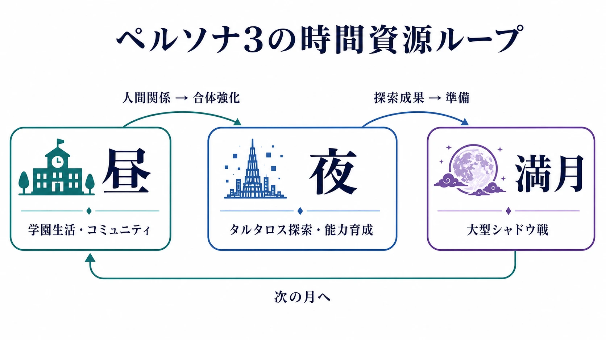
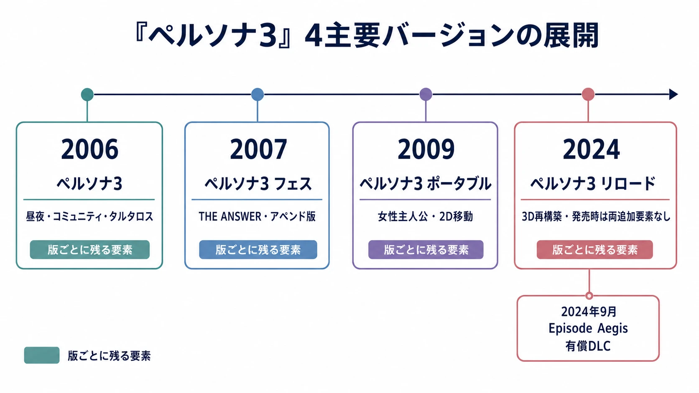
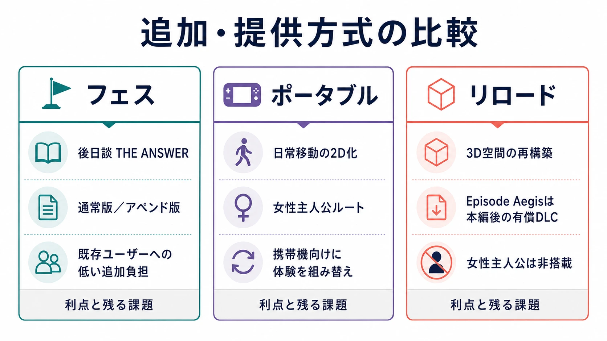

# 『ペルソナ3』は18年・4バージョンで何を変え、何を変えなかったか――再解釈と追加販売を設計として読む

> ⚠️ **ネタバレ注意** ⚠️
>
> 本稿では『ペルソナ3』本編と後日談「THE ANSWER／Episode Aegis」の結末に触れる。未プレイで結末を知りたくない読者は、先に各作品を遊んでから読むことを推奨する。

『ペルソナ3』は、2006年7月13日にアトラスがPlayStation 2向けに発売したRPGである。昼の学園生活と深夜の「影時間」、人との関係を力に変えるコミュニティ、月齢に合わせて来る大型シャドウ、そして学校が変貌する巨大迷宮タルタロスを、一年の予定表へ収めた。[[1](#ref-1)][[2](#ref-2)]

しかし本稿の主題は、原作と2024年の『ペルソナ3 リロード』を機能表で対比することではない。原作から「ペルソナ3」という一つの体験を、2007年の『ペルソナ3 フェス』、2009年の『ペルソナ3 ポータブル』、2024年の『ペルソナ3 リロード』へ、どのように分割し、補い、作り直してきたかを時系列で読むことである。最後の『Episode Aegis』配信まで含めれば、展開は18年に及ぶ。

4版には毎回、別の入口と別の欠落があった。『フェス』は本編の終わりを後日談へ延長した。『ポータブル』は携帯機向けに表示を引き算しながら、女性主人公という別視点を足した。『リロード』は3D空間と現代的な操作を再構築した一方、発売時には両方の追加要素を含まなかった。この連鎖は、再解釈の意欲だけでなく、「どの版を買えば何が遊べるのか」という製品設計の問題でもある。

***

## 1. 2006年の『ペルソナ3』：一年の予定表へ「生きる時間」を置く

### 昼と夜を、同じ時間資源の異なる使い道にする

『ペルソナ3』の核は、日常と戦闘を別モードとして並べたことだけではない。放課後の時間には、学校生活を送り、街へ出て人と会い、能力を伸ばす。夜には、寮で仲間と話す、勉強する、あるいは影時間にタルタロスを探索する。プレイヤーは「今日は誰と過ごすか」「今夜は探索へ行くか」を、一日の使い切り資源として選ぶ。

この二層は、戦闘の準備と物語の鑑賞を単に交互に置く構造ではない。昼に選んだ相手との時間は、コミュニティのランクを進め、対応するアルカナのペルソナ合体を有利にする。公式サイトも、特定の人物と過ごして絆を深めること、ランク上昇で特別な恩恵を得ることを説明している。[[2](#ref-2)] 人間関係は物語を読むための寄り道ではなく、戦力の増幅へ接続されたリソースになる。

ここでのプランニング上の重要点は、関係性を「好感度が上がる演出」に留めなかったことだ。誰かと会う選択は、有限の放課後を支払う。だが、その結果は合体時の経験値という戦闘上の効率にも返る。日常で費やした時間と迷宮で得る強さが、同じ設計図の中にあるから、プレイヤーはストーリーの進行と育成の進行を切り離せない。

### 月齢を、長期目標と短期選択を結ぶ締切にする

ゲーム内の月日は、雰囲気を作るカレンダーではない。満月の日には大型シャドウとの戦いが置かれ、プレイヤーは次の節目までにタルタロスを探索し、仲間を育て、日常の行動を割り振る。『リロード』の公式プレビューも、満月に備えてタルタロスを調査し大型シャドウを撃退する基本の循環を説明している。[[3](#ref-3)]

月ごとの締切は、探索を好きなだけ先送りできる自由と、先送りしすぎない緊張を両立させる装置である。毎晩を探索に使えば育成は進むが、日中のコミュニティは進まない。逆に日常だけを優先すれば、満月前の攻略密度が上がる。プランナーが学ぶべきなのは、自由行動に「やるべきこと」を足す際、毎日の強制タスクにせず、数週間単位の締切と自分で選べる実行日を組み合わせる方法である。

### 単一巨大ダンジョンは、日常の対極ではなく夜の反復先である

影時間の月光館学園は、タルタロスという巨大なダンジョンに変貌する。[[2](#ref-2)] 多数の小規模な物語ダンジョンを渡り歩くのでなく、同じ塔へ繰り返し入り、より深く到達する構成だ。これは景観の多様性では不利になりうる一方、「日常に戻るたび、あの塔がまだ上に続いている」という持続的な圧力を作る。

タルタロスは、昼の人間関係から得た成長を検証する場所であり、夜の探索へ使った時間によって翌日の選択肢を狭めもする。単一巨大ダンジョンを選ぶなら、フロアの種類だけで単調さを解決しようとするのでは足りない。日常、月齢、仲間の成長、救出など、外側の予定表と往復する理由を積む必要がある。後年の『ポータブル』開発者も、タルタロス探索が単調というユーザーの意見を踏まえ、ランダムなハプニングや失踪者救出を加えたと語っている。[[4](#ref-4)]

### 結末を、主題を説明する台詞ではなく一年の終点にする

本編の主人公は、世界を救った後に死を迎える。この結末は、プレイヤーに衝撃を与えるためだけの反転ではない。橋野桂ディレクターの当時の企画書には、本作のテーマとして「死」「生」「夢」「青春」が掲げられ、「死にがい」を意識して生きがいを考える若者への励ましが記されている。[[5](#ref-5)]

一年間に、誰と会い、何を鍛え、どの夜に危険へ踏み込むかを選ばせた作品が、最後に主人公の時間を有限なものとして閉じる。だから「生の有限性」は、終盤の台詞で初めて提示される抽象論ではない。日々が残り日数を持ち、選ばなかった行動は取り戻せないというプレイの感覚を、結末が回収するのである。

テーマを結末で扱う場合の教訓は明快だ。死を題材にするなら死を描けばよい、という話ではない。終わりが来るからこそ、途中の選択に取り返しのなさを持たせる。『ペルソナ3』では、カレンダー、昼夜の行動回数、満月までの猶予が、そのための下地になっている。

***

## 2. 2007年の『ペルソナ3 フェス』：終わった物語に、喪失を受け止める時間を足す

『ペルソナ3 フェス』は2007年4月19日に発売された。アトラスは、ユーザーの意見を受けて本編をリニューアルし、最終決戦後を描く「後日談」を合わせたパッケージだと説明している。[[6](#ref-6)] 追加された「THE ANSWER」は、単なる強敵向けのエンドコンテンツではない。本編の主人公を失った後、特別課外活動部の面々がその喪失をどう扱うかを、アイギスを主人公として辿るエピソードである。[[7](#ref-7)]

これは、本編の結末を「感動的な終止符」として消費させない設計判断だ。本編でプレイヤーが受け取った別れを、登場人物はまだ整理できていない。アイギスという、主人公への強い執着から人間らしい感情を学んできた存在へ視点を移すことで、同じ喪失を別の主体の問題へ組み替えている。物語を追加する理由を「続きがあるから」ではなく、「終わりの後に残る感情をプレイヤーと登場人物にもう一度通らせるため」と定義した例として読める。

後年『Episode Aegis』を手掛けた和田和久プロデューサーも、当時のファンの反応を見返し、感情面の背景描写が薄かった部分に調整を加えることで、プレイヤーが主人公の死という出来事を受け止め、前へ進めるよう図ったと説明している。[[8](#ref-8)] 2007年の「THE ANSWER」を評価する際は、難度やダンジョン量だけでなく、本編の結末をプレイヤーの外へ放置しなかった役割を見る必要がある。

### 同じ内容を、既存ユーザーには低い追加負担で渡した

『フェス』には、単独で起動できる通常版と、初回起動時に『ペルソナ3』のディスク認証を必要とするアペンド版があった。両者のゲーム内容は同一だが、当時の税込希望小売価格は通常版8,190円、アペンド版5,040円である。[[7](#ref-7)]

この形態は、原作を持たない人へは本編と後日談を一つの製品として渡し、原作を持つ人へは追加の価値に合わせた低い価格を用意する。既存ユーザーに改めてフルプライスを求めないという意味で、差分提供として筋のよい設計である。ただし、原作ディスクを保持し、認証できることが前提になるため、すべての既存ユーザーに等しく便利な形式ではない。それでも「新規ユーザーの入口」と「既存ユーザーの追加購入」を、同じ内容の二つの価格で分けた点は重要だ。

後にDLCが一般化した現在から見ると、このアペンド版は物理メディア時代の差額提供である。ここで注目すべきなのは媒体の古さではなく、追加要素の範囲と購入済みの本編をどう認識したかだ。追加分を誰へ、どの負担で渡すかは、コンテンツ量だけではなく、ユーザーが「前の購入を尊重された」と感じるかを決める。

***

## 3. 2009年の『ペルソナ3 ポータブル』：表示を引き、視点を足す

『ペルソナ3 ポータブル』は、PSP向けに2009年11月1日に発売された。[[9](#ref-9)] この版を「容量制約のために簡略化した移植」とだけ呼ぶと、重要な判断を見落とす。日常パートの移動を2Dのカーソル選択へ切り替え、3Dで歩き回る表現を引いた一方で、女性主人公ルートを新たに加え、既プレイ者にも物語を読み直す理由を与えたからである。

なお、2D化はタルタロスを含むすべての探索を平面化したものではない。開発ディレクターの薄田無門は、戦闘はPS2版と同じく3Dで描かれるとしたうえで、日常生活を2Dグラフィック化したのは、データ容量を抑え、携帯ゲーム機向けにテンポを速める決断だったと説明している。[[4](#ref-4)] 「3Dダンジョンを2Dカーソルへ変えた」と一括りにせず、どの場面の空間表現を引いたのかを分けて捉えるべきである。

この引き算は、劣化を受け入れただけではない。携帯機で短い単位でも進めやすくするため、日常の移動を情報選択へ寄せた。反面、街や校内を自分の足で歩く連続性、距離感、寄り道の手触りは薄くなる。プラットフォームを変える際は「何を再現するか」だけでなく、「どの摩擦を減らす代わりに、どの空間体験を手放すか」を明文化する必要がある。

### 女性主人公は、主人公モデルの差し替えではない

『ポータブル』の足し算である女性主人公は、外見や戦闘モーションを差し替える選択肢にとどまらない。開発ディレクターの木戸梓は、女性として扱われるためにメインシナリオだけでなくコミュニティや街の会話にも手を加えたと説明する。男性主人公では交流が少なかった仲間とも新たなコミュニティを築けるようにし、台詞の流れを自然にするため、女性主人公編で台詞が変わる箇所は前後のボイスも録り直した。[[4](#ref-4)]

つまり女性主人公は、同じ筋書きをもう一度売るための表層的な分岐ではなく、関係性の網目を作り直す追加開発である。プレイヤーが誰として、誰と、どういう関係を築くかが変われば、同じ一年の予定表でも意味が変わる。この事実は後の『リロード』で女性主人公を実装しなかった理由を読むうえでも重要になる。

『ポータブル』は、携帯機への移植で失うものを隠さず、失った空間的な連続性とは別軸の、新しい再プレイ価値を足した版である。引き算と足し算を別々の補償と見なすのではなく、プラットフォーム移行で変わった体験価値の総量を組み替える判断として理解したい。

***

## 4. 2024年の『ペルソナ3 リロード』：3Dを復権させ、二つの目玉を別の結論へ分けた

『ペルソナ3 リロード』は、アトラス／セガから2024年2月2日に発売されたフルリメイクである。公式は、シナリオや登場人物などゲームの根幹を保ちつつ、操作性とグラフィックを一新した作品と位置付けた。[[10](#ref-10)] 『ポータブル』が日常移動を情報選択へ寄せたのに対し、『リロード』は現代の3D表現で学園、街、タルタロスを再び歩かせる。これは単なる解像度向上ではなく、2006年版が持っていた「昼と夜で場所を行き来する」感覚を、現行の空間体験として再構成する選択である。

一方、発売時の『リロード』には『フェス』の「THE ANSWER」と『ポータブル』の女性主人公の、どちらも収録されなかった。このため、原作の根幹を最新の操作と3D空間で遊ぶ入口としては強力でも、過去の追加版が積み重ねてきた要素を一つに集めた「完全版」ではなかった。

### 「THE ANSWER」は7か月後に有償DLCとして戻った

「THE ANSWER」に相当する『ペルソナ3 リロード: Episode Aegis』は、2024年9月10日に有償のエクスパンションパスの一部として配信された。[[11](#ref-11)] 本編発売からおよそ7か月後である。開発側は、本編企画時から『Episode Aegis』の完全リメイクを検討していたが、時間、工数、開発スタッフの確保が障壁になり、いったん断念したと説明している。[[12](#ref-12)]

この経緯は、後出しDLCを直ちに「最初から切り分けた」と断じる材料にはならない。少なくとも開発者の説明では、実現できる組織体制を後から確保したことがDLC化の前提である。同時に、購入者の体験としては、2007年版では一つのパッケージに入っていた後日談が、2024年版では本編とは別の有償コンテンツになった。この二つの見方は両立する。

DLCを選ぶなら、開発上の事情だけでなく、製品上の約束を明確にする必要がある。本編だけで何が完結するのか。後日談は独立した追加物語なのか、物語の全体像に必要な章なのか。後者に近いと開発側自身が考えるなら、発売前後の説明、価格、導線は、購入者が判断できる粒度で整えるべきだ。

### 女性主人公は、DLCにもならなかった

女性主人公については、同じ結論にならなかった。和田和久プロデューサーは、『Episode Aegis』と併せて実装を検討したが、開発期間とコストは『Episode Aegis』の2〜3倍になり、外部へ丸ごと委託することも難しく、開発キャパシティを超えると説明している。将来の実装も難しいとの見通しを示した。[[12](#ref-12)]

これは女性主人公の需要を否定した発言ではなく、必要な制作範囲を「追加キャラクター一人」と見積もらなかった発言である。『ポータブル』の時点で、会話、コミュニティ、イベント、ボイス、関係性の前提まで作り替えていた。[[4](#ref-4)] 3Dカットシーン、演技、UI、探索表現まで新規に組み直した『リロード』では、その差分を同じ品質で載せることは、後日談一篇の制作とは異なる規模になる。

ただし、開発コストの説明は、ユーザー側の「なぜ片方は戻り、もう片方は戻らないのか」という不満を消すものではない。ここにあるのは、同じ過去作由来の要素でも、追加エピソードと別主人公ルートでは生産構造が非対称だという事実である。プランナーは、要望を件数で並べるのでなく、既存のアセット・シナリオ・テスト・ローカライズのどこまで波及するかでスコープを見積もる必要がある。

***

## 5. 4版に共通する問題：追加要素を積んでも、遊べる版は一つに収束しない

4版を年表として眺めると、毎回「前の版にない理由」を作ってきたことが分かる。

| 版 | その版の主要な再解釈 | 後の版へそのままは引き継がれなかった要素 |
| --- | --- | --- |
| 『ペルソナ3』（2006年） | 昼夜、コミュニティ、満月、タルタロスを一年の行動資源として統合 | 原作時点では後日談も女性主人公もない |
| 『ペルソナ3 フェス』（2007年） | アイギス視点の「THE ANSWER」と本編の追加要素 | 「THE ANSWER」は『ポータブル』には入らず、後に『リロード』では別売DLCになった |
| 『ペルソナ3 ポータブル』（2009年） | 携帯機向けのテンポ調整と女性主人公ルート | 女性主人公ルートは『リロード』へ実装されない見通しとなった |
| 『ペルソナ3 リロード』（2024年） | 3D空間と操作性を現代化したフルリメイク | 発売時は「THE ANSWER」と女性主人公を含まず、前者のみ後日DLC化 |

ここで「4回も売った」とだけ言えば、制作上の違いが消える。『フェス』の後日談、携帯機への適応、女性主人公ルート、現代的な3Dリメイクには、それぞれ独立した制作理由がある。反対に「毎回別物だから仕方ない」とだけ言えば、プレイヤーが複数の版をまたがないと全要素へ届かない不便さを見落とす。

重要なのは、追加価値の二種類を分けることだ。一つは、本編の後ろに置ける追加エピソードである。既存の主人公、基本ルール、進行データをある程度共有できるなら、差額版やDLCとして提供しやすい。もう一つは、プレイ全体の前提を変える追加ルートである。主人公の性別、関係性、会話、演出、テストケースを横断する場合、それは「新しいシナリオ」よりも、もう一つのゲーム進行を作る作業に近づく。

『フェス』のアペンド版は前者を、既存購入者への差額提供として扱った。『リロード』の『Episode Aegis』も前者に近いが、開発体制を確保できた時期が本編後だったため、有償DLCという形になった。女性主人公は後者であり、コストと期間の非対称性から非搭載となった。商法を論じるなら、これらを同じ「完全版の切り売り」として平坦化せず、追加価値の生産構造と提供時点を分けて評価する必要がある。

***

## 6. プランナーが持ち帰る四つの判断

### 1. 再解釈の対象を、機能ではなく体験の約束で定義する

『リロード』は、日常と影時間を往復する3Dの感覚を現代の表現で取り戻した。一方で、『ポータブル』は空間の連続性を削り、短い遊びの単位と別主人公の関係性を足した。両者の優劣を機能数だけで比べることはできない。

再展開の企画書では、「何を復活させるか」より先に、「この版でプレイヤーに何をもう一度感じてほしいか」を書くべきである。空間を歩く実在感なのか、携帯機で一日の予定を素早く回す気軽さなのか、別の人間関係を生きる再読性なのか。約束が違えば、残すべき仕様も削るべき仕様も変わる。

### 2. 追加要素は、制作量ではなく波及範囲で見積もる

後日談は大きなコンテンツでも、既存の本編と切り分けられる場合がある。対して主人公ルートは、台詞、イベント、関係性、音声、演出、UI、テストへ横に広がる。『ポータブル』の開発者が会話の前後のボイスまで録り直したという説明は、分岐追加の見積もりがなぜ膨らむかを具体的に示す。[[4](#ref-4)]

仕様書では「女性主人公を追加」のように名詞で書くだけでは足りない。共通化できるもの、性別や視点に応じて分岐するもの、分岐後に合流できないものを洗い出し、品質保証とローカライズを含めた波及図にする。追加要素の単価は、画面数や台詞数だけでは読めない。

### 3. 差額の設計は、価格表ではなく信頼の設計である

アペンド版のように既存ユーザーへ安価な導線を用意する方法は、過去の購入を前提として価値を差分化する。一方、DLCは販売時期を分けられ、開発の不確実性にも対応しやすい。どちらにも合理性がある。

ただし、追加物語が本編の理解にどれほど必要か、将来の追加をどの時点で見通せるか、購入済みの上位版が何を含むかを曖昧にすると、価格差そのものよりも「完成形が後から動いた」感覚が不信を生む。差額提供の設計では、価格、認証条件、DLCの範囲、将来の見通しを、同じプロダクト要件として扱いたい。

### 4. 長期シリーズでは、要素の保存計画を別途持つ

18年の展開で生まれた各版固有の要素は、価値の多様さであると同時に、ブランドの記憶を分断するリスクでもある。「この版の目玉だったものが次の版にない」ことが重なると、ユーザーは新作の購入判断を機能表ではなく、将来また取り残されるかもしれないという不安で行うようになる。

すべてを一作に収録できない場合でも、何を最新版へ持ち込み、何を旧版や別の提供経路に残し、何を再現しないと決めたかを整理しておくべきである。これはファン向けの説明資料である以前に、シリーズの企画判断を引き継ぐための資産台帳になる。

***

## おわりに：差分を売るなら、差分が残ることまで設計する

『ペルソナ3』の4版は、同じ原作を繰り返し売り直しただけの履歴ではない。原作は「死」を意識して生を充実させるという主題を、一年の時間資源へ翻訳した。『フェス』は終わった後の喪失をアイギスの視点で扱い、既存ユーザーにはアペンド版という低い追加負担を用意した。『ポータブル』は空間表現を引く代わりに、女性主人公の関係性を足した。『リロード』は3Dの体験を作り直し、後日談をDLCで復元したが、女性主人公は復元しない結論を出した。

差分展開には、明確な利点がある。新しい入口を作り、コレクションしたい動機を生み、追加開発の収益を得られる。各版に役割があれば、既存作を時代の異なるプレイヤーへ届け直すこともできる。

しかしリスクも明確である。「完全版」がどこにもない状態が続けば、購入者は今買う版が最終的な体験になるかを判断しにくい。過去の目玉要素が一貫して復元されなければ、版ごとの価値は増えても、シリーズ全体の約束は弱くなりうる。

プランナーが問うべきなのは、「何を追加すれば再購入されるか」だけではない。その追加要素は次の版でどこへ行くのか。既存購入者はどの負担で到達できるのか。作れない要素を、いつ、なぜ、どの品質基準で見送るのか。差分を製品にするなら、差分が残り続けることまで含めて設計する必要がある。

## References

1. [アトラス、PS2「ペルソナ3」公式サイト。6月1日からミニオンラインゲームも提供予定][1] - GAME Watch。2006年の『ペルソナ3』発売予定日、PS2向けRPG、影時間と月光館学園の設定を確認した。

2. [P３ - ペルソナ３ - 公式サイト][2] - アトラス。コミュニティの絆とランク上昇による恩恵、影時間に月光館学園がタルタロスへ変貌する設定を確認した。

3. [「ペルソナ３ リロード」プレビュー。“キミの記憶”が今呼び起こされる！ 最高品質となって蘇ったファン待望のリメイク作品][3] - GAME Watch。満月に備えてタルタロスを調査し、大型シャドウを撃退するゲーム進行を確認した。

4. [開発ディレクターが明かす！『ペルソナ3ポータブル』のココにこだわりました][4] - ファミ通.com。『ポータブル』におけるタルタロスの単調さへの対応、2D化、女性主人公ルートの設計と制作範囲を確認した。

5. [〖ゲームの企画書〗『ペルソナ3』を築き上げたのは反骨心とリスペクトだった。赤い企画書のもとに集った“愚連隊”がシリーズを生まれ変わらせるまで〖橋野桂インタビュー〗][5] - 電ファミニコゲーマー。橋野桂の企画書にある『ペルソナ3』の「死」「生」「夢」「青春」の主題と、死を意識して生の充実を考える趣旨を確認した。

6. [ペルソナ3フェス][6] - アトラス。『フェス』がユーザー意見を踏まえた本編のリニューアルと、最終決戦後を描く後日談を含むパッケージであることを確認した。

7. [スペシャル企画「ペルソナ3 フェス」][7] - ファミ通.com。2007年4月19日の発売、通常版とアペンド版の同内容・価格差・原作ディスク認証、後日談がアイギス主人公であることを確認した。

8. [Persona 3 Reload Dev Explains Its Missing Female Protagonist And If We’ll Get Persona 1 And 2 Remakes][8] - GameSpot。和田和久プロデューサーが『Episode Aigis』の主題、DLC化の経緯、女性主人公を追加しない理由、追加コンテンツの提供方針を語ったインタビュー。

9. [ペルソナ3ポータブル (PSP)の画像][9] - ファミ通.com。PSP版『ペルソナ3ポータブル』の2009年11月1日発売と、男性または女性主人公を選択できることを確認した。

10. [『ペルソナ３ リロード』ついに本日発売！プレイ感想キャンペーン開始！さらに、オリジナル・サウンドトラック発売・配信決定！オフィシャルグッズや「アイギス」1/1スケール胸像も登場！][10] - セガ。『ペルソナ３ リロード』の2024年2月2日発売と、根幹を保ちながら操作性・グラフィックを刷新する公式方針を確認した。

11. [『ペルソナ３ リロード: Episode Aegis』 ついに本日配信！ 配信記念イラスト公開/ローンチトレーラー公開/感想キャンペーン開催/サウンドトラック配信中、LINEスタンプも発売！][11] - セガ。『Episode Aegis』が2024年9月10日に配信されたこと、有償エクスパンションパスに含まれること、本編後の大型ストーリーDLCであることを確認した。

12. [Persona 3 Reload Episode Aigis Developer Interview, Discusses Additional Content][12] - Persona Central。和田和久プロデューサーと橋爪悠による『Episode Aegis』の企画・開発体制、女性主人公を実装しない判断と、開発期間・コストがEpisode Aegisの2〜3倍になるとの説明を確認した。

[1]: https://game.watch.impress.co.jp/docs/20060516/p3.htm
[2]: https://persona3.jp/
[3]: https://game.watch.impress.co.jp/docs/kikaku/1559560-2.html
[4]: https://www.famitsu.com/sp/091101_persona_special/page4.html
[5]: https://news.denfaminicogamer.jp/projectbook/191030a
[6]: https://www.atlus.co.jp/title-archive/p3/
[7]: https://www.famitsu.com/sp/070319_p3f/
[8]: https://www.gamespot.com/articles/persona-3-reload-dev-explains-its-missing-female-protagonist-and-if-well-get-persona-1-and-2-remakes/1100-6526236/
[9]: https://www.famitsu.com/game/title/6206/images/page/1
[10]: https://www.sega.jp/topics/detail/240202_5/
[11]: https://www.sega.jp/topics/detail/240910_2/
[12]: https://personacentral.com/p3r-episode-aigis-interview/

----

この文書は、Perplexity、Claude、OpenAI Codex の3つのAIの支援を受けて著述されたものです。引用画像を除き、MIT License にて提供されています。
