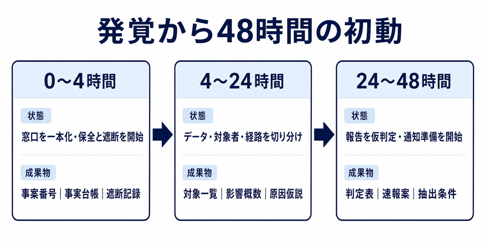
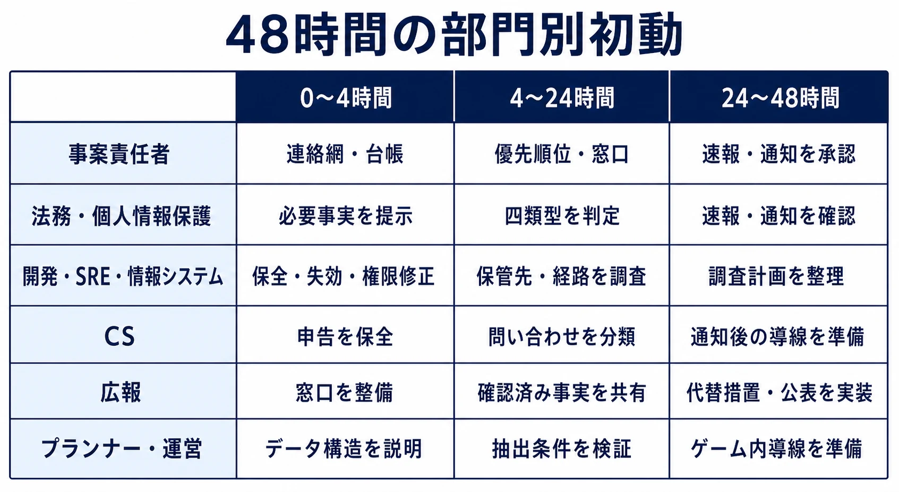

# 個人情報漏洩・不正アクセスの初動フロー――ゲーム会社が48時間で確定させるべきこと

個人情報漏洩・不正アクセスの兆候は、社内の監視画面だけでなく、外部にも現れる。発売前のゲームデータが外部サイトに現れる、利用者から身に覚えのないメールを指摘される、委託先から連絡が入る。外部で起きた異変から、社内の不正アクセスが逆算されることもある。

2026年6月、Keyを運営するビジュアルアーツは、不正アクセスにより個人情報が漏えいした可能性を公表した。新作『anemoi』のマスターデータが4月19日時点で海外サイトに無断掲載されていることを手掛かりに調査し、社内ポータルに保存されていたクラウドストレージの認証情報が窃取された可能性を明らかにした。公式通販サイト利用者、取引先、採用応募者、従業員の情報が対象となりうるとして、同社は特別対応窓口を設けている。件数は調査中であり、報道にある数字を確定値として扱う段階ではない。[[1](#ref-1)][[2](#ref-2)]

これは恐怖を煽るための事例ではない。検知の入口が何であれ、初動で問われるのは「誰が、何を、いつまでに確定させるか」である。個人情報保護法の報告・本人通知は、原因の完全な解明を待つ制度ではない。事実確認、流出の遮断、法的な報告判定を並行して進めるための型が必要になる。

本稿は、日本の個人情報保護法に基づく個人データの漏えい等を対象に、ゲーム会社が発覚から48時間で固めるべき事実と判断を整理する。炎上時の文面設計は[プレイヤーと開発元のコミュニケーション：炎上対応と信頼回復の実践知識](player-developer-communication-crisis-response.md)で扱う。また、事後の学習と再発防止の進め方は[重大インシデント後のポストモーテムを設計する](postmortem-methodology-after-major-incidents-for-game-teams.md)に譲る。本稿の範囲は、それらより前、報告義務に直結する初動の事実確認と報告判断である。

***

## 自分たちのゲームは何を預かっているのか

ライブサービス型のゲームでは、ストア課金を使う限りカード番号を直接保有しない構成が多い。自社決済でも、決済代行事業者がトークン化した値を扱う設計がある。だからといって、個人情報のリスクが小さいわけではない。むしろ運営、CS、マーケティング、採用、物販をまたぐと、カード番号以外のデータのほうが広く散らばりやすい。

棚卸しでは「個人情報か」という一問だけで終えない。 **どのシステムにあり、誰と結び付くか、外部へ出る経路は何か** まで記録する。以下はゲーム会社で確認対象になりやすい類型である。

| 類型 | 具体例 | 棚卸しで確認する点 |
|---|---|---|
| アカウント・認証情報 | メールアドレス、ログインID、パスワードハッシュ、セッショントークン、OAuthの更新トークン、復旧コード | 本人になりすまし可能か。平文・可逆な値・有効なトークンが混在していないか |
| 課金・購入情報 | ストアのレシート、注文番号、購入履歴、決済代行のトークン、返金履歴 | カード番号を持たない前提だけで除外せず、アカウントと結び付く購入情報の保管先を確認する |
| 端末・広告関連情報 | 端末識別子、IPアドレス、Cookie、広告ID、OS・端末設定 | 単体では個人情報でなくても、他の情報との照合可能性と外部送信先を記録する |
| 位置・連絡先情報 | 位置情報、端末の電話帳に含まれる氏名・電話番号・メールアドレス | 権限を使う機能、取得時点、サーバー保存の有無を確認する |
| 連絡・発送情報 | 懸賞や物販の氏名、住所、電話番号、メールアドレス、問い合わせ記録 | EC、物流、フォーム、CSツール、委託先ごとの保管期間と権限を確認する |
| ゲーム運営データ | プレイ履歴、行動ログ、チャット、通報、制裁履歴、端末ログ、クラッシュレポート | アカウント等と結び付いているか。分析基盤、ログ基盤、外部SDKへ複製されていないか |

公開されているプライバシーポリシーを見るだけでも、扱う範囲は広い。『モンスターストライク』は端末情報、位置情報、電話帳情報、アプリ内購入情報、広告識別子を取得情報として挙げている。カプコンのゲームプライバシーポリシーも、ゲーム内での入力・行動内容、プレイ日時や総プレイ時間、クラッシュ報告、端末識別子、IPアドレスなどを例示する。[[3](#ref-3)][[4](#ref-4)]

Cookieなどの端末識別子について、個人情報保護委員会は、個人情報に該当しない場合でも通常は利用者に関する「個人関連情報」に当たりうるとしている。家族などが端末を共用していても、通常は共用者それぞれとの関係で個人関連情報となりうる。他の情報と容易に照合できるなら、全体として個人情報になりうる。[[5](#ref-5)]

ここでの棚卸しは、漏えいを起こした後に一覧を作る作業ではない。平時に「データ類型｜保管システム｜管理部門｜委託先｜個人データとしての扱い｜報告判定に必要なログ」を一行ずつ持つことが、48時間の調査を可能にする。

***

## 「漏えいかもしれない」と分かった瞬間に確定させること

発覚直後に先に決めるべきことは、対策の是非や対外文の表現ではない。次の四つの事実である。原因の根本解明や再発防止策は重要だが、最初の48時間では報告判定に必要な粒度までを優先する。

1. **対象データは何か**：テーブル名、オブジェクトストレージのパス、SaaSのエクスポート、ログなど、候補を物理的な保管場所まで特定する。個人データの項目、本人との紐付き方、対象者の概数を記録する。
2. **誰に影響しうるか**：プレイヤー、退会者、通販購入者、キャンペーン応募者、取引先、応募者、従業員を混ぜずに分ける。利用中アカウントか、認証情報が有効かも区別する。
3. **何が起きたか**：外部からの不正アクセス、内部者による不正持出し、誤設定・誤送信、委託先・SaaS経由のどれが疑われるかを、確度とともに書く。原因不明は「不明」として残し、推測で空欄を埋めない。
4. **流出は続いているか**：侵害された可能性のある認証情報の無効化、セッション失効、アクセスキーのローテーション、公開設定の修正、連携停止などを行う。遮断の前後で証跡を取り、いつ誰が何を止めたかを記録する。

### 証拠保全と遮断を対立させない

ログを消してしまえば、報告内容も被害範囲も確定しにくくなる。一方、調査のために侵害された認証情報を有効なままにする理由もない。したがって、原本ログ、監査ログ、アクセス履歴、設定変更履歴、関連するチケットや通知を保全したうえで、遮断を実施する。実務上は次のような一枚の記録を、更新時刻付きで共有するとよい。

| 時刻 | 確認できた事実 | 根拠 | 未確定の点 | 実施した遮断 |
|---|---|---|---|---|
| 発覚時 | 外部掲載または異常利用を確認 | URL、通報、監視ログ | 掲載元への流出経路 | 該当URL・通報内容を保全 |
| 初回調査 | アクセスされた可能性のあるシステムを特定 | 監査ログ、認証ログ | ダウンロード・横展開の有無 | 認証情報を失効、権限を最小化 |
| 範囲確認 | 対象データの項目・概数を切り分け | DB照会、ストレージ一覧、SaaS監査ログ | 正確な件数、対象期間 | 必要に応じて外部共有を停止 |

この記録は、ポストモーテムの代わりではない。速報、確報、本人通知で「当時どこまで判明していたか」を説明するための事実台帳である。人の評価や再発防止の議論は、遮断と法的判断が落ち着いた後に別の場で行う。

### 48時間の到達点を先に置く

48時間は法定期限ではなく、社内の初動目標である。個人情報保護委員会への速報は「速やかに」、目安として発覚から概ね3〜5日以内とされる。週末や祝日、調査の長期化を考えると、48時間の時点で速報に必要な骨格がなければ余裕は小さい。[[6](#ref-6)]

「件数が正確に出るまで報告判定をしない」という順番は危険である。不正の目的による漏えい等のおそれが合理的に認められるなら、対象人数が未確定でも報告対象になりうる。速報は、判明済みの事実と未確定事項を分けて提出し、確報までに更新する前提で進める。

***

## 判定基準表：情報の類型を報告トリガーに掛ける

2022年4月1日から、個人データの漏えい等で個人の権利利益を害するおそれがある場合、個人情報保護委員会への報告と本人への通知が義務付けられた。報告対象となる主な事態は、要配慮個人情報、財産的被害のおそれ、不正の目的によるおそれ、1,000人を超える漏えい等の四類型である。[[7](#ref-7)]

以下の表は、前章の棚卸しと報告判定をつなぐための社内用の起点である。該当欄は法律上の結論ではなく、法務・個人情報保護担当へ直ちに渡すべき確認信号を示す。個別事案では、漏えい等の態様、情報の結合可能性、アクセスや取得の蓋然性を確認する必要がある。

| 棚卸しした情報類型 | 要配慮個人情報 | 財産的被害のおそれ | 不正の目的によるおそれ | 1,000人超 | 初動で確認すること |
|---|---|---|---|---|---|
| アカウント・認証情報 | 通常は該当しない | ログインIDとパスワードなど、本人になりすまして財産を処分しうる組合せなら該当しうる | 不正アクセス、侵害された認証情報の持出しなら該当しうる | 対象者数で判定 | 平文・復号可能性、有効なセッション・更新トークン、強制ログアウトの要否 |
| 課金・購入情報 | 通常は該当しない | カード番号、口座情報などの悪用で財産的被害が生じうるか | 不正取得・持出しなら該当しうる | 対象者数で判定 | どの決済情報を自社・委託先が持つか、トークンだけか、返金・購入履歴の範囲 |
| 端末・広告関連情報 | 通常は該当しない | 通常は直ちに該当しない | 不正アクセスやランサムウェア等で取得されたなら該当しうる | 対象者数で判定 | アカウント・氏名と容易に照合できるか、外部SDK・分析基盤への複製範囲 |
| 位置・連絡先情報 | 内容により該当しうる | 通常は直ちに該当しない | 不正取得・持出しなら該当しうる | 対象者数で判定 | 位置の精度・期間、電話帳の各人を本人として数えるか、用途と保存先 |
| 連絡・発送情報、CS記録 | 問い合わせに病歴などが含まれれば該当しうる | 内容により該当しうる | 不正取得・持出しなら該当しうる | 対象者数で判定 | 問い合わせ添付、本人確認書類、発送・委託先のデータを分けて確認 |
| ゲーム運営データ | チャット・通報・行動データに要配慮個人情報が含まれうる | 通常は直ちに該当しない | 不正取得・持出しなら該当しうる | 対象者数で判定 | アカウントとの紐付き、ログ基盤の保持期間、公開・ダウンロード可否 |

### 四類型を「件数判定だけ」にしない

特に見落としやすいのは、1,000人超ではないから報告不要だと早合点することである。不正アクセス、ランサムウェア、内部不正による持出しなどは、「不正の目的をもって行われたおそれ」によって報告対象となりうる。対象人数の確定前から、攻撃経路と取得可能性を確認しなければならない。

反対に、端末識別子や広告IDが含まれるから直ちに四類型に当たる、という理解も正確ではない。個人データであるか、他の情報と容易に照合できるか、どう取得されたか、人数はどの単位で数えるかを順に確認する。棚卸し表の役割は、法務判断を機械化することではなく、必要な質問を担当者の経験に依存させないことである。

### 期限は「速報」と「確報」を分けて管理する

報告対象と判断した場合、速報は速やかに、発覚から概ね3〜5日以内が目安である。確報は原則30日以内であり、不正の目的による漏えい等のおそれがある事態では60日以内となる。期限管理では、発覚日、速報提出日、確報期限、本人通知の実施状況を同じ台帳に置く。[[6](#ref-6)]

| 管理項目 | 社内で先に決めること |
|---|---|
| 発覚日時 | 最初に漏えい等を認知した日時と根拠。報道・通報・委託先連絡も記録する |
| 速報 | 報告責任者、法務確認者、未確定事項の更新担当。概ね3〜5日を待たず、判明分で提出する判断経路 |
| 確報 | 原則30日以内。不正の目的によるおそれがある場合は60日以内。件数、原因、対応状況の確定責任者 |
| 本人通知 | 対象者抽出、メール・郵送の送付責任者、通知困難時の代替措置の判断者 |

***

## 法務・CS・広報・開発は、何をいつ動かすか

役割分担を「全員で対応する」とだけ書くと、判断の空白が生まれる。個人情報漏洩に限定し、各部門の決定権と入力を分ける。

| 部門・役割 | 0〜4時間 | 4〜24時間 | 24〜48時間 |
|---|---|---|---|
| 事案責任者 | 連絡網を起動し、事実台帳の責任者を置く | 優先順位と外部専門家・委託先との窓口を決める | 速報・通知準備の意思決定を承認する |
| 法務・個人情報保護担当 | 報告・通知の判断に必要な事実項目を提示する | 四類型、対象人数、委託先の位置付けを判定する | 速報内容、本人通知、代替措置の適法性を確認する |
| 開発・SRE・情報システム | ログ保全、認証情報失効、権限修正を実施する | 保管先、アクセス範囲、データ項目、取得経路を調査する | 未確定事項と調査計画を速報に渡せる形で整理する |
| CS | 問い合わせの事実と被害申告を保全し、独自回答を止める | 問い合わせ分類、対象者が自衛できる情報を法務へ渡す | 通知後の問い合わせ導線、本人確認、FAQの運用準備をする |
| 広報 | 公表の要否を独断で判断せず、問い合わせ窓口を整える | 法務確認済みの事実だけを共有可能な形にする | 本人通知が困難な場合の代替措置、公表文の掲載経路を実装する |
| プランナー・運営担当 | ゲーム内のデータ構造とプレイヤー影響を説明する | アカウント、イベント応募、プレイログの抽出条件を検証する | ゲーム内告知が必要な場合の導線と、影響を受ける機能の運用を準備する |

広報の役割は、炎上を抑える言い回しを先に選ぶことではない。本人通知・代替措置・問い合わせ窓口を、法務が確認した事実に合わせて実装可能にすることである。CSも、原因を推測して個別に回答しない。問い合わせの内容自体が、新たな影響範囲の手掛かりになるため、事実台帳に戻す導線を持たせる。

委託先やSaaSが関わる場合は、契約窓口だけに任せない。誰が監査ログを取得できるか、誰が対象者リストを抽出するか、本人通知をどちらが担うかを、最初の24時間で確認する。委託先経由であっても、自社が保有する個人データの事案として報告・通知の検討が必要になる場合がある。

***

## 本人への通知をどう設計するか

報告対象の事態では、本人への通知も必要になる。通知は、対象者に直接知らせることが基本であり、電子メールや文書の郵送が例となる。本人への通知が困難な場合には、ホームページ等での公表や問い合わせ窓口の設置といった代替措置を講じることができる。[[7](#ref-7)]

通知の目的は謝罪文を整えることではなく、本人が自分の権利利益を守るために必要な事実を届けることにある。個人情報保護委員会の通則ガイドラインは、本人に通知すべき事項として、概要、漏えい等が発生した、または発生したおそれがある個人データの項目、原因、二次被害またはそのおそれ、その他参考となる事項を示す。すべてが判明するまで通知を待つ必要はなく、状況に応じて速やかに行う。[[8](#ref-8)]

通知テンプレートには、少なくとも次の欄を平時から持たせておく。

| 通知に置く欄 | 本人にとって必要な内容 |
|---|---|
| 事案の概要 | いつ、どのサービスまたは窓口で、何が起きたか。推測は事実と分ける |
| 対象となるデータ項目 | 当該本人に関係する項目だけを、できるだけ具体的に示す |
| 原因 | 不正アクセス、誤送信、委託先事案など、判明した範囲で示す。侵害を助長する詳細は省く |
| 二次被害と本人が取れる措置 | パスワード変更、フィッシングへの注意、問い合わせ先など、対象データに応じた行動を示す |
| 会社の対応と窓口 | 遮断・調査の状況、問い合わせ方法、受付時間、追加情報の告知場所を示す |

一斉通知を設計するときも、「全員に同じ項目が漏えいした」と決めつけない。例えば、CS添付だけが対象の人、購入履歴だけが対象の人、認証情報も対象の人では、本人が取るべき措置が異なる。対象者抽出の条件と通知テンプレートの差分を、データ棚卸しと対応付けておく必要がある。

***

## まとめ：確認だけで動ける状態を平時に作る

個人情報漏洩・不正アクセスの初動は、重大な対策をその場で発明する仕事ではない。まず、どのデータを預かり、どこにあり、誰が調べられるかを知る。次に、要配慮個人情報、財産的被害のおそれ、不正の目的、1,000人超という判定軸を、棚卸ししたデータ類型に重ねる。そして、法務・開発・CS・広報が同じ事実台帳を見て、速報と本人通知の準備を進める。

平時に作るべきものは、長大な危機管理文書ではない。データ棚卸し表、四類型の判定表、連絡責任者、証拠保全と遮断の手順、通知テンプレートである。この五つがあれば、有事には「何を確認すれば動けるか」から始められる。48時間で確定させるべきことを、48時間の前に決めておくのである。

## References

1. [不正アクセスによる個人情報漏えいに関するお知らせとお詫び][1] - クラウドストレージの認証情報窃取、『anemoi』マスターデータが4月19日に海外サイトへ無断掲載された経緯、対象者区分（VA STORE購入者・抽選応募者・個人取引先・法人取引先・採用応募者・従業員）、件数調査中である旨を伝える株式会社ビジュアルアーツの公式発表PDF。

2. [「Key」運営元ビジュアルアーツが不正アクセス被害報告、“1万件規模”の個人情報漏えいの可能性][2] - 社内ポータルのクラウドストレージ認証情報窃取という原因と、対象者の種類を伝えるAUTOMATONの記事。

3. [モンスターストライク（日本） プライバシーポリシー][3] - 端末情報、位置情報、電話帳情報（氏名・電話番号・メールアドレス）、アプリ内購入情報、広告識別子等の取得情報を明記する株式会社MIXIの公式ポリシー。

4. [カプコンゲームプライバシーポリシー（家庭用ゲーム、PCゲーム）][4] - 連絡先情報、位置情報、端末識別子、ゲーム内での行動データ等の取得情報を明記する公式ポリシー。

5. [Cookie等の端末識別子は個人関連情報に該当しますか。家族等で情報端末を共用している場合はどうですか][5] - 端末識別子が個人関連情報に該当しうること、共用端末でも各利用者との関係で個人関連情報となりうることを示す個人情報保護委員会のFAQ。

6. [漏えい等の対応とお役立ち資料][6] - 速報の期限（概ね3〜5日以内）、確報の期限（原則30日以内、不正の目的による場合は60日以内）を示す個人情報保護委員会のページ。

7. [漏えい等報告・本人への通知の義務化について][7] - 2022年4月1日施行、報告対象となる要配慮個人情報・財産的被害のおそれ・不正の目的によるおそれ・1,000人超の四類型を示す個人情報保護委員会の公式ページ。

8. [個人情報の保護に関する法律についてのガイドライン（通則編）][8] - 本人通知に含めるべき事項（概要・個人データの項目・原因・二次被害またはそのおそれ・その他参考となる事項）を示すガイドライン。

[1]: https://visual-arts.jp/wp/wp-content/uploads/2026/06/VA20260604.pdf
[2]: https://automaton-media.com/articles/newsjp/20260604-447079/
[3]: https://static.monster-strike.com/privacy/
[4]: https://www.capcom.co.jp/privacy/game/jp.html
[5]: https://www.ppc.go.jp/all_faq_index/faq1-q8-1/
[6]: https://www.ppc.go.jp/personalinfo/legal/leakAction/
[7]: https://www.ppc.go.jp/news/kaiseihou_feature/roueitouhoukoku_gimuka/
[8]: https://www.ppc.go.jp/personalinfo/legal/guidelines_tsusoku/

----

この文書は、Perplexity、Claude、OpenAI Codex の3つのAIの支援を受けて著述されたものです。引用画像を除き、MIT License にて提供されています。
