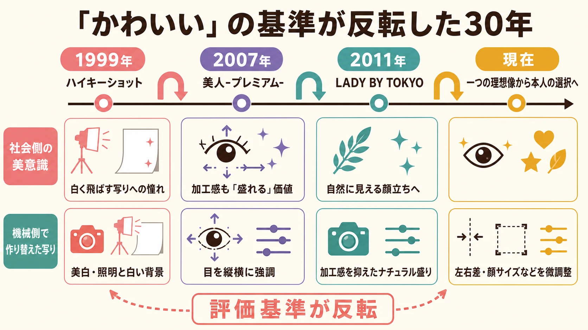
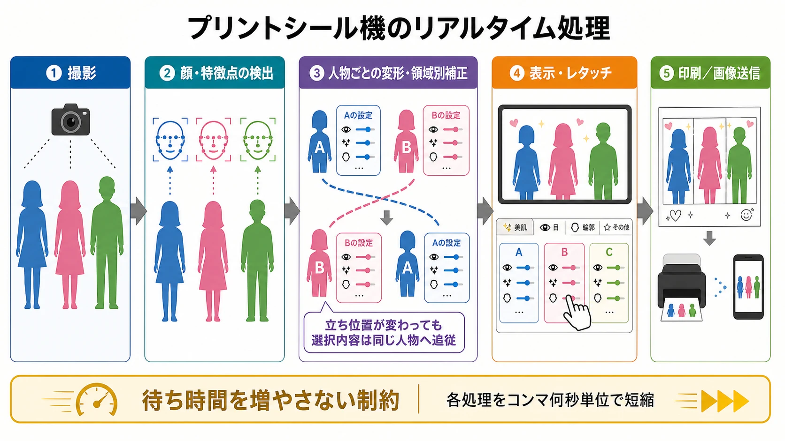
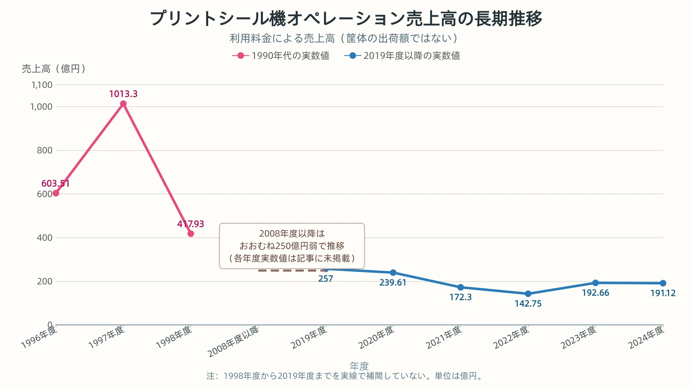

# プリクラは「かわいい」の反転をどう生き延びたか――プリントシール機30年史

## はじめに――ゲーム開発の外側にある、三つの観察対象

ゲームプランナーがプリントシール機を企画する機会は、ほぼない。ゲームの隣に置かれる筐体ではあっても、主役はルール攻略ではなく、友人と撮影し、その場で画像を作り、持ち帰る体験である。本稿はプリントシール機の作り方を指南する記事ではなく、ゲーム開発から少し離れた産業を観察する記事である。

それでも、この30年史にはゲームの企画・運営へ読み替えられる論点が三つある。

1. ユーザーの美意識が数年単位で反転する市場で、製品を更新し続けること。
2. 撮影から表示、編集、印刷までの待ち時間を、体験品質の一部として設計すること。
3. 筐体と消耗品を売る事業から、撮影画像を継続課金へつなぐ事業へ広げること。

周辺産業シリーズ第1弾の「[パチンコ・パチスロの「抽選」と「演出」はなぜ分かれているのか](pachinko-pachislot-lottery-performance-separation.md)」は制御と規制、第2弾の「[クレーンゲームはなぜ景品を出せるのか](crane-game-prize-regulation-difficulty-online-history.md)」は難易度と景品ビジネスを扱った。第3弾となる本稿の中心は、写真を印刷する機構そのものではない。プリントシール機は30年間、同じ機械を売り続けたのではなく、 **「かわいい」の基準が変わり続けることを前提に、写りと機械を作り替えてきた製品** である。

***

## 第1章：1995年、プリンター出力から生まれた発明

### 資料の印刷が「顔写真のシール」へ変わった

企画の発端は、当時のアトラスで営業を担当していた社員が、プリンターから資料が出力される様子を見たことであった。カメラで撮った写真をシールにする着想を得ると、ハンディーカムで撮影した顔写真と手作りの背景イラストを組み合わせ、試作品を作った。社内での反応が良く、アトラスとセガの共同開発による製品化へ進んだ。特許庁の広報誌「とっきょ」は、この経緯に加え、当時流行していた「持ち物へ気に入ったシールを貼る行為」と自分の顔写真を接続したことがヒットの出発点だったと説明している。[[1](#ref-1)]

「プリント倶楽部」は1995年7月25日に発売された。1997年6月末には累計出荷台数が約2万2,000台へ達した。[[2](#ref-2)] 「プリクラ」と「プリント倶楽部」はセガの登録商標だが、「プリクラ」は他社製を含むプリントシール機の通称として定着するほど広まった。[[1](#ref-1)]

初代機の価値は、高画質な写真を出すことだけにはなかった。特許庁の資料によれば、カメラの画素数をあえて抑えて肌を滑らかに見せ、プリンターのCMYKからブラックを外した3色表現によって黒髪を柔らかく仕上げていた。後年の顔認識やレタッチとは方式が異なるものの、記録の正確さより「かわいく見える写り」を優先する考え方は、最初から製品に含まれていた。[[1](#ref-1)]

### ブームを完成させた「プリ帳」

大ヒットの最大要因として特許庁が挙げるのが、シールを手帳へ集める「プリ帳」である。友人と撮ったシールを交換し、新しい友人には名刺のように渡す。手帳に貼られた枚数や顔ぶれは、交友関係と出来事の記録になった。[[1](#ref-1)] 國學院大學のビジネスケースも、プリントシールの機能を、友人の多さの顕示と、撮影した文脈を残すイベント確認として整理している。[[3](#ref-3)]

ここで、1990年代の規模を示す二種類の数字を分けておく必要がある。JAIA（日本アミューズメント産業協会）が現在公表している「プリントシール機の売上」は、ゲームセンターに設置された機械の利用による **オペレーション売上高** であり、1996年度は603億5,100万円、1997年度は1,013億3,000万円であった。[[4](#ref-4)] 一方、國學院大學のケースに示される1997年の480億円超は、筐体、基板、プリント用紙を合計した **供給側の販売市場** である。[[3](#ref-3)] 片方は利用料金、もう片方は機械・部材の販売額であり、同じ「1997年の市場規模」として混ぜることはできない。

***

## 第2章：アトラスの失速とフリューの逆転

### 先行企業を苦しめたブームの速度

プリント倶楽部のヒットで、アトラスの1997年3月期の売上高は364億円、経常利益は87億円へ急伸した。前年は売上高92億円、経常利益9億円であり、一製品が会社の規模を短期間に変えたことが分かる。[[3](#ref-3)]

ブーム期には30社近くが参入した。写真入り時計、似顔絵、はがき、Tシャツなどを出力する派生機も現れたが、1998年から1999年にかけて供給側の市場は急速に縮小した。[[3](#ref-3)] JAIAのオペレーション売上高も、1997年度の1,013億3,000万円から1998年度には417億9,300万円へ落ちている。[[4](#ref-4)]

アトラスは、高解像度プリンターと専用紙を使う「スーパープリクラ21」を投入した。筐体を売った後も専用紙を販売できる構造を狙い、2,500台の販売目標を置いたが、実績は半数程度にとどまった。1999年3月期にはプリクラ関連を含む在庫評価損31億円を計上し、経常損益は58億円の赤字へ転落した。[[3](#ref-3)]

競争上の武器として、アトラスはJリーグやサンリオと提携し、有力なキャラクターや図柄を背景・フレームへ載せるコンテンツ戦略を進めた。これに対し、國學院大學の研究は、1995年から2005年までにJ-PlatPatで「写真シール」を含む特許・実用新案を抽出した結果として、アトラス16件、オムロン系3社合計178件を挙げている。178件の内訳はオムロン100件、フリュー40件、オムロンエンタテインメント38件である。検索語による粗いスクリーニングであり、各社の全保有特許数を示す数字ではないが、コンテンツ提携を重く見たアトラスと、画像処理を蓄積したオムロン系企業の差を観察する材料にはなる。[[3](#ref-3)]

### 売れなかった初号機が市場調査を習慣にした

後のフリューにつながる事業は、1997年4月、オムロン社内の新規事業として始まった。フリューの公式沿革では、プリントシール機事業への参入を1998年4月としている。2003年7月にオムロン100％子会社のオムロンエンタテインメントとして独立し、2007年4月にはMBOによってフリュー株式会社となった。[[5](#ref-5)]

初号機「似テランジェロ」は、撮影した顔から似顔絵を作る製品であった。顔の大きさや目・口・鼻の位置、髪型を認識する技術には、オムロンが培った画像処理の蓄積が使われた。しかし市場調査に十分基づいた製品ではなく、販売は振るわなかった。[[3](#ref-3)]

この失敗を受け、開発チームはゲームセンターを巡回し、女子中高生の声を聞くようになった。1999年の「ハイキーショット」は、カメラ位置、照明、デジタル画像処理を使い、写真そのものの写りを変える方向へ舵を切った製品で、400台を超える販売につながった。以後、流行を観察して写りへ反映することが習慣となった。[[3](#ref-3)] 現在のフリューも、ユーザーインタビューや一人の対象者を深く見るN1インタビューを週1回以上行い、ネットワーク接続された筐体からプレイ回数や稼働台数を取得していると説明する。[[6](#ref-6)]

國學院大學のケースは、2023年時点で残存企業を「事実上フリューのみ」と表現した。[[3](#ref-3)] 文字どおり一社だけという意味ではない。フリュー自身の2026年3月末時点の公表値では、国内設置台数シェアは約90％である。[[6](#ref-6)] ブーム期の約30社から、ほぼ一社が市場の基準を作る状態まで集約が進んだ、と捉えるのが正確である。

***

## 第3章：「盛り」の基準は数年で反転する

### 白く飛ばす、目を広げる、加工感を減らす

「盛る」とは、同じ方向へ加工を強くし続けることではない。何をかわいいと感じるかが変われば、強調すべき部位も、加工が見えることへの評価も変わる。

1999年の「ハイキーショット」は、美白の度合いを8段階で変え、照明で肌を白く浮き立たせる機能を備えた。[[7](#ref-7)] フリュー広報は、浜崎あゆみに代表される白ギャルへの憧れが広がった時期に、鼻の輪郭が薄くなるほど白く飛ばす写りが支持されたと振り返っている。[[8](#ref-8)] 現在のように肌領域を精密に抽出して補正する方式ではなく、ストロボと白い背景を含む撮影環境そのものが美白機能を担った。

2007年7月の「美人-プレミアム-」は、顔から目の位置を検出し、目を強調する画像処理を前面へ出した。JAIAは同機を「デカ目」時代の先駆けと位置づける。[[7](#ref-7)] 開発関係者の説明では、それまでの一方向だけの拡大を越え、目を縦横へ広げる調整が採用された。[[9](#ref-9)] 目を大きくした加工画像であることが、欠点ではなく「盛れる」という価値になった。

2011年7月の「LADY BY TOKYO」は、その価値を反転させた。AKB48などのアイドル人気を背景に、過度なデカ目より自然に見える顔立ちが求められるようになり、同機は「新・極上ナチュラル」を掲げた。撮影時の原画をきれいに作り、加工工程を減らすことで、加工感を抑えながらかわいく見せる方向へ転換した。[[7](#ref-7)]

現在は、一台が全員へ同じ理想像を与えるより、本人が細部を選ぶ方向へ進んでいる。2022年の「ハルイロセカイ」は左右の目を片方ずつ調整し、小顔補正も縦・横を含む5種類から選べるようにした。[[10](#ref-10)] 2024年の「わたウサ」は、輪郭や頭部の左右差、目や眉の位置、中顔面やえらまで細かく触れられる。[[11](#ref-11)] 白さ、目の大きさ、自然さという一つの基準を全員へ強く適用する時代から、顔ごとの差を本人が整える時代へ移ったのである。

*「かわいい」は加工の強弱だけで一方向へ変化したのではなく、評価基準の反転に応じて機械側の写りも作り替えられてきた。*

この変遷で変わったのは、ソフトウェアのパラメーターだけではない。カメラの位置、ストロボの形・数・設置場所、撮影ブースの広さやカーテンの色まで、機種の狙う写りに応じて作り直されてきた。フリューの開発者は、撮影空間を流用すると写りを調整できる範囲が狭くなるため、新機種ごとに筐体を作り直すと説明している。[[12](#ref-12)] 「かわいい」の反転へ追従するとは、画像処理の設定変更だけでなく、光学系と空間を含む機械側の再設計なのである。

***

## 第4章：機械は何を計算しているのか

### 顔を見つけ、部位を分け、人ごとに加工する

プリントシール機は、撮影画像から顔と顔のパーツを検出する。検出した位置を基準に、小顔化、目の拡大、唇の色調整、美肌化、髪のツヤの強調を行い、全身を撮る機種では体のラインも補正する。複数人が写れば顔を個別に識別し、それぞれが選んだ処理を別々に適用する。撮影中に左右の立ち位置が入れ替わっても、最初に選んだ処理が同じ人物へ追従する設計である。[[12](#ref-12)]

近年の処理はさらに細かい。フリューが2023年に公開した技術解説では、顔を検出して特徴点を取得した後、顔や目を変形し、黒目・白目・まつ毛などの領域を分けて、色調やコントラストを個別に補正する流れが説明されている。前髪が目へ重なる場合やカラーコンタクトで黒目を判別しにくい場合に対応するため、5,000枚以上の画像へラベルを付け、機械学習による領域分割も導入した。[[13](#ref-13)]

### 中身はWindowsアプリケーションである

ソフトウェアは特別な専用OSだけで動いているわけではない。フリューの技術ブログによれば、筐体内にはWindows PCが入り、組み込みソフトウェアの多くはC++またはC#で開発されている。[[14](#ref-14)] 2015年の開発者インタビューでは、Cも含むC、C++、C#が使用言語として挙げられている。画像処理のほか、カメラ、ストロボ、プリンター、タッチパネル、通信機器を制御するため、ハードウェア制御と通信の知識も必要になる。[[12](#ref-12)]

### コンマ何秒が撮影のテンションを左右する

高度な画像処理は、結果が正しければよいだけではない。利用者は友人と短時間の体験を共有し、撮影、画像確認、編集、印刷へ連続して進む。途中で処理待ちが挟まると、機能の価値とは別にテンポが崩れる。

フリューの開発者は、短いプレイ時間の中で高度な処理を終えるため、「ひとつの処理をコンマ何秒縮める」作業を日々行うと説明している。開発者自身が筐体で試し、待たされる画面でテンションが落ちないかを企画者と確認しながら、コードの無駄を探す。[[12](#ref-12)] この機械では、処理時間は裏側の性能指標であると同時に、利用者が感じる撮影体験の一部である。

*複数人の立ち位置が変わっても選択内容を同じ人物へ追従させながら、全工程を待ち時間が増えないよう短縮する。*

現在、AIは顔・部位の認識だけでなく、事業展開にも使われている。フリューは、AIによるデータ分析でユーザーニーズの把握を速めることに加え、海外展開時のローカライズ作業を減らし、サービス投入を早める方針を示している。[[6](#ref-6)] 撮影結果を作るAIと、製品を別市場へ移すAIが、同じ事業の異なる場所へ入っている。

***

## 第5章：売り切りからサブスクリプションへ

### 筐体の次にシール用紙を売る

プリントシール機の収益は、筐体を一度売って終わりではない。供給側の市場を筐体・基板と用紙へ分けると、1990年代末のブーム終息後も、用紙販売は筐体ほど急には縮まなかった。國學院大學のケースは、筐体導入後にシール用紙を継続販売する事業として、この構造を説明している。[[3](#ref-3)] 現在のフリューも、アミューズメント施設へ本体を販売した後、消耗品であるシール紙を販売することで安定収益を得るとしている。[[6](#ref-6)]

同じ「その場で印刷する筐体」でも、在庫や確率を中心にした仕組みは「[100円で出てくるのはプレイ料金か、カード代か――即時印刷・排出型カード筐体の設計論](instant-print-arcade-card-machine-design.md)」で扱った。プリントシール機で重要なのは、どの完成品を排出するかではなく、利用者自身の画像が消耗品を使うたびに生成される点である。

### 画像そのものが月額課金の対象になった

次の転換は、印刷物と同時に作られるデジタル画像を商品へ変えたことである。フリューは2003年に、携帯電話へ画像のダウンロード先を送る「楽プリショット」を開始した。最初の1枚を無料とし、全画像を取得したい利用者を月額会員へ転換するフリーミアム型を構築した。スマートフォンの普及に合わせ、2011年に「ピクトリンク」へ移行した。[[15](#ref-15)]

ピクトリンクは、フリューのプリントシール機で撮影した画像をスマートフォンで取得・閲覧するサービスである。累計利用者は約2,700万人、有料会員は約127万人に達している（2026年3月末時点、フリュー調べ）。[[6](#ref-6)] 筐体を買う施設からの収益に加え、撮影した本人から月額料金を得る二重構造ができた。

料金体系は途中で変わっている。2025年6月末までは月額330円の「有料会員」と、機能を追加した月額550円相当の上位コースが併存していたが、2025年7月から順次「プレミアム会員」へ一本化された。2026年9月時点の新規契約は月額550円（税込）で、年額5,400円（税込）も選択できる。[[16](#ref-16)] したがって、330円と550円を現在の二段階料金として扱うことはできない。

収益対象は、シールを刷る機械、刷るたびに減る用紙、そこで生まれた画像データへと広がった。画像の保存・閲覧は筐体を離れた後も続くため、一回ごとの撮影料金を継続課金へ接続できる。売り切りからサブスクリプションへの移行とは、筐体販売をやめたことではなく、同じ撮影から生まれる価値へ複数の課金接点を設けたことを意味する。

***

## 第6章：30年目の現在地

### コロナ禍から戻り切らない市場

プリントシール機は2025年7月に誕生30周年を迎えた。[[2](#ref-2)] JAIAが公表するオペレーション売上高は、2008年度以降、おおむね250億円弱の水準で推移してきた。新型コロナウイルス感染症の流行期には、人と集まって撮影する体験が強く影響を受けた。

| 年度 | JAIA公表のオペレーション売上高 |
| --- | ---: |
| 2020年度 | 239億6,100万円 |
| 2021年度 | 172億3,000万円 |
| 2022年度 | 142億7,500万円 |
| 2023年度 | 192億6,600万円 |
| 2024年度 | 191億1,200万円 |

2023年度には約193億円まで戻ったが、2024年度は約191億円で横ばいとなり、コロナ禍前の2019年度約257億円には届いていない。[[4](#ref-4)] この表も、筐体の出荷額ではなく、ゲームセンター側のオペレーション売上高である。

*1998年度から2019年度までは実線で補間せず、記事で確認できる実数値だけをプロットしている。*

### 「盛らない」セルフ写真館との対照

競合する撮影体験として、日本でも韓国発のセルフフォトブースが広がっている。「人生4カット」は2017年に韓国で創業し、2024年末に運営元が「日本初上陸」として神奈川・愛知・千葉への出店を発表した。[[17](#ref-17)] 日本国内では2020年ごろから東京・愛知・大阪・兵庫・福岡などで撮影できる状態にあり、この発表はブランドとして本格展開する段階の始まりにあたる。[[18](#ref-18)] 4枚の写真を縦長の紙へ印刷する構成で、QRコードから画像データも保存できる。日本のプリントシール機にある被写体加工や落書きを行わず、ありのままの雰囲気を残すことが特徴として紹介されている。[[18](#ref-18)]

両者とも、短い撮影体験を紙とデータへ変換する。しかし、プリントシール機が顔の部位を検出して積極的に「盛る」方向を磨いてきたのに対し、韓国式セルフフォトブースは紙焼き風の細長いプリントと「盛らない」写りを価値にする。同じ若年層の撮影需要に対して、加工量の多さではなく、加工から距離を置くことが差別化になった。

### 撮影空間の安全を守る入場ルール

運営面では、プリントシール機のコーナーへ男性だけで入ることを断る店舗がある。店側が説明してきた理由は、主要客層である女子中高生を狙う盗撮・痴漢の防止と、ナンパ目的の利用者に対する苦情への対応である。[[19](#ref-19)] 密閉性のある撮影ブースと、撮影に集中する利用者を守るため、機械の機能とは別に空間側のルールが作られた。

尾崎博彦弁護士の整理では、どの客を呼び込むかは事業者の営業上の判断であり、この場面で男性だけの入場を断ることは法的に許されると考えられる。一方、張り紙が機械へ貼られているだけで区画も明確でない場合、その掲示だけに直ちに法的強制力が生じるわけではない。違反した利用者からシールを没収したり、返金を拒んだりする措置まで法律上当然に強制できるものでもない。明確に仕切られた立入禁止区画へ入れば建造物侵入罪となる可能性があるため、入場制限が許されることと、どの制裁でも許されることは分けて考える必要がある。[[19](#ref-19)]

***

## おわりに――変化を前提に作り替える

ゲームプランナーがプリントシール機の開発へ直接関わる機会は、やはりほとんどない。30年史を自分の仕事へ読み替える意味は、個別機能を真似ることではなく、変化への応答を製品と事業の両方で見ることにある。

第一に、美意識が数年単位で反転する市場では、昨日の成功機能を強めるだけでは次の成功にならない。美白、デカ目、ナチュラル、個別レタッチという変化は、流行語の付け替えではなく、カメラ、照明、撮影空間、画像処理を含む製品の作り替えを要求した。

第二に、リアルタイム処理では、体感速度そのものが設計対象になる。正確な顔認識や高度な補正を実現しても、結果を待つ時間が撮影のテンションを切れば体験品質は下がる。コンマ何秒の短縮は、利用者に見えない最適化でありながら、利用者が感じるテンポを直接作っている。

第三に、売り切りから継続課金への移行は、既存の商品を捨てることと同義ではない。筐体販売に用紙販売を重ね、さらに同じ撮影で生まれた画像をピクトリンクの月額サービスへ接続した。物理商品とデジタルサービスを、一回の体験から並行して成立させたのである。

プリクラという製品の難しさは、写真機を作ることではなかった。「かわいい」の基準が反転するたびに、その基準を観察し、写りを定義し直し、機械と収益構造まで更新し続けることにあった。その難しさこそが、ゲームの外側にあるこの産業を30年後にも観察する価値である。

## References

1. [プリント倶楽部｜特許庁 広報誌「とっきょ」Vol.47][1] - プリンター出力からの着想、ハンディーカムと手作り背景による試作、アトラスとセガの共同開発、初期の画作り、プリ帳文化を紹介する特許庁資料。

2. [2025年7月で“プリクラ”は誕生30周年｜フリュー][2] - 1995年7月25日の発売、1997年6月末の累計出荷約2万2,000台、30周年、主要機種とティーントレンドの関係をまとめた公式資料。

3. [ビジネスケース：プリントシール機業界の競争 アトラスとフリュー｜國學院大學学術情報リポジトリ][3] - 市場の測定範囲、アトラスの業績と在庫評価損、競争経緯、オムロン系企業の市場調査、特許検索結果を整理した紀要論文（ビジネスケース）。

4. [プリントシール機の売上の推移｜JAIA「メディアのみなさまへ」][4] - 1996年度から2024年度までのプリントシール機オペレーション売上高を掲載する業界団体公式ページ。

5. [沿革｜フリュー][5] - 1997年のオムロン社内新規事業開始、1998年のプリントシール機事業参入、2003年の子会社設立、2007年のMBOを示す公式沿革。

6. [プリントシール機関連事業｜フリュー新卒採用][6] - 2026年3月末時点の設置台数シェア、有料会員数・累計利用者数、筐体と消耗品の収益構造、ユーザー調査、AI活用を説明する公式事業紹介。

7. [プリントシール機20年史｜JAIA][7] - 「ハイキーショット」「美人-プレミアム-」「LADY BY TOKYO」の機能と、オペレーション売上高の長期推移をまとめた業界団体資料。

8. [プリクラの進化30年史｜smart Web][8] - フリュー広報への取材に基づき、「似テランジェロ」と「ハイキーショット」、浜崎あゆみに代表される白ギャル人気との関係を紹介する記事。

9. [「TikTokで流行の歌も、翌週には…」ヒアリングで分かった、令和JKの流行を読む難しさ｜文春オンライン][9] - フリュー関係者への取材を通じ、「美人-プレミアム-」の目の縦横方向の拡大とデカ目機能の受容を説明する記事。

10. [ワタシ専用の写り・レタッチで“主役盛れ”が叶う「ハルイロセカイ」｜フリュー][10] - 片目ずつの大きさ調整と、縦・横を含む小顔補正を説明する公式製品資料。

11. [スキップ機能で落書き時間を最大4分短縮できる「わたウサ」｜フリュー][11] - 輪郭・頭部の左右差、目や眉の位置など、細部のレタッチ項目を示す公式製品資料。

12. [地道な高速化が女子中高生の心をつかむ？ プリクラの女性プログラマーに聞く｜CodeZine][12] - 顔・部位認識、人物別処理、使用言語、ハードウェア構成、機種ごとの筐体設計、コンマ何秒単位の高速化を説明する開発者インタビュー。

13. [「MY PALETTE」エンジニアコラム｜フリュー][13] - 顔検出、特徴点、変形、領域別補正、5,000枚超の教師画像を用いた機械学習による領域分割を説明する公式技術資料。

14. [プリントシール機にUnity製ゲームを搭載したときの話｜FURYU Tech Blog][14] - 筐体内のWindows PCと、C++・C#を中心とするソフトウェア開発環境を説明する公式技術ブログ。

15. [「デカ目」「美肌」なぜ生まれた？ フリュー社長が語るプリ機30年の技術変革（2/3）｜MONOist][15] - 楽プリショットからピクトリンクへの移行と、無料画像から月額会員へつなぐ事業モデルをフリュー社長への取材に基づいて紹介する記事。

16. [ピクトリンク有料会員コースのサービス提供内容と価格の改定について｜ピクトリンク][16] - 2025年7月以降のコース一本化と、月額550円への価格改定を示す公式ヘルプ。

17. [累計撮影数1億件突破、セルフフォトブース「人生4カット」が日本初上陸｜人生4カット日本公式][17] - 2017年の創業と2024年末からの日本本格展開を発表した運営元資料。

18. [わたしを記録する時間「人生4カット」｜Korea.net][18] - 紙の4カット、QRコードによる画像保存、被写体加工や落書きを行わない特徴を紹介する韓国政府公式ポータルの記事。

19. [「男性のみの入場禁止」プリクラコーナーの男子禁制ルールは性差別でないのか？｜弁護士ドットコム][19] - 店側の防犯上の説明と、入場制限・掲示・没収・返金拒否の法的な違いを弁護士が整理した記事。

[1]: https://www.jpo.go.jp/news/koho/kohoshi/vol47/07_page1.html
[2]: https://www.puri.furyu.jp/allnews/press/202507_puri30th/
[3]: https://doi.org/10.57529/0002000384
[4]: https://jaia.jp/%E3%83%A1%E3%83%87%E3%82%A3%E3%82%A2%E3%81%AE%E3%81%BF%E3%81%AA%E3%81%95%E3%81%BE%E3%81%B8/
[5]: https://www.furyu.jp/company/history.html
[6]: https://www.furyu.jp/recruit/fresh/print-sticker-machine-business/
[7]: https://jaia.jp/wp-content/uploads/2020/04/JAMMA-PRI3.pdf
[8]: https://smartmag.jp/archives/61128/
[9]: https://bunshun.jp/articles/-/43339?page=2
[10]: https://www.furyu.jp/news/2022/01/haruirosekai/
[11]: https://www.puri.furyu.jp/allnews/press/202405_watausa/
[12]: https://codezine.jp/article/detail/8730
[13]: https://www.furyu.jp/news/2023/05/mypalette/
[14]: https://tech.furyu.jp/entry/unity-to-puri
[15]: https://monoist.itmedia.co.jp/mn/articles/2604/04/news021_2.html
[16]: https://sp.pictlink.com/web/common/help/answer/41
[17]: https://www.life4cuts-jp.com/index/?bmode=view&idx=157359135
[18]: https://japanese.korea.net/NewsFocus/HonoraryReporters/view?articleId=197168&pageIndex=1
[19]: https://www.bengo4.com/c_18/n_2910/

----

この文書は、Perplexity、Claude、OpenAI Codex の3つのAIの支援を受けて著述されたものです。引用画像を除き、MIT License にて提供されています。
