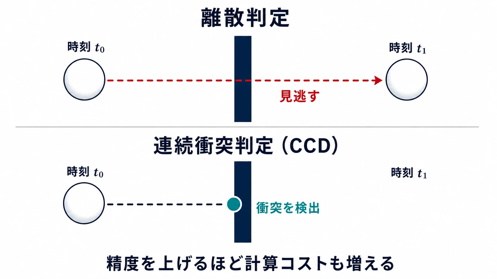
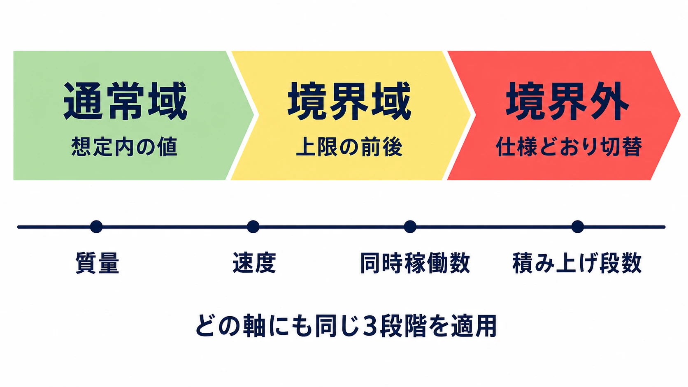
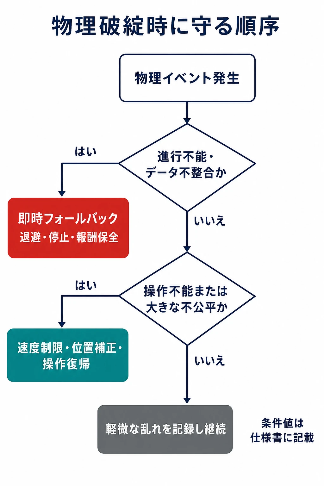
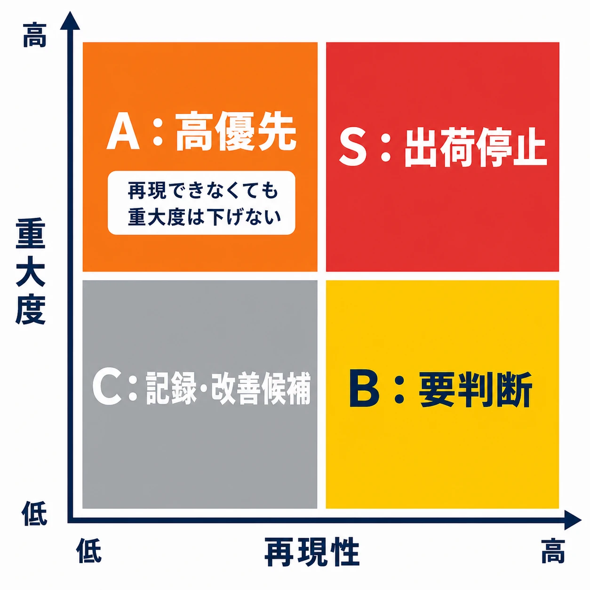
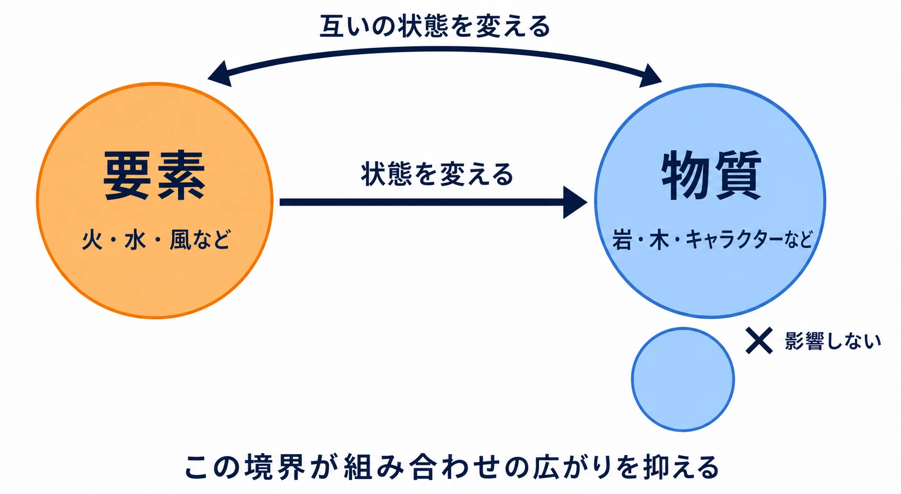

# 物理シミュレーションの不具合はなぜ根絶しにくいのか――プランナーが仕様書でつくる安全域

***

## はじめに

箱を積むとわずかに震える。高速の弾が薄い壁を抜ける。落下物が地面にめり込んだ後、突然大きく跳ねる。押したはずの扉が物に引っ掛かり、進行不能になる。こうした現象は開発中だけでなく、製品版のゲームでも起こりうる。ここでいう物理シミュレーションとは、位置、速度、質量、衝突、摩擦などの規則から、オブジェクトの動きを逐次計算する仕組みである。

既存の[「バグなのか仕様なのか——『グレーゾーン』の判断プロセス」](bug-or-spec-gray-zone-decision-process.md)では、仕様書の穴や、複数のルールから生まれる意図しないゲームプレイを広く扱った。本稿の焦点はそれより狭い。物理演算に固有の技術的な限界を確認し、プランナーがエンジンを改修できなくても、仕様書によって事故の範囲と意思決定の速度を変えられることを論じる。

重要なのは「現実と同じ動き」を約束しないことではない。ゲームが必要とする範囲で、プレイヤーが予測でき、ゲーム進行を壊さず、チームが検証できる動きを約束することである。

***

## 物理演算は同じ入力でも同じ結果になりにくい

### 小数は有限の桁でしか持てない

ゲーム内の座標や速度は、多くの場合、浮動小数点数で表す。これは広い値の範囲を効率よく扱える反面、すべての小数を正確には表せない形式である。加算、乗算、除算を何度も重ねれば、その都度の丸めが残る。接触している箱を押し戻す計算や、摩擦を解く計算では、そのごく小さな差が次の時刻の位置と速度の差になる。

しかも物理演算は、一つの数式を一回評価して終わる処理ではない。多数の接触、関節、力を一定の順序で何度も解こうとする反復計算である。ある接触を先に処理するか後に処理するかで、次に残る速度がわずかに変わる。その差が積み重なるため、「同じ初期配置なら、どの機種でも常に同じ結果になる」とは限らない。

NVIDIA PhysX も、同じプラットフォーム・同じビルド・同じ API 呼び出し順・同じ時間刻みといった条件をそろえた場合に決定性を得る、と明記している。一方、ハードウェアの浮動小数点精度やコンパイラ最適化による命令順の違いは、プラットフォーム間やビルド間の結果を変えうる。[[1](#ref-1)]

### 並列化は「速くする」ために順序を固定しにくくする

現代のゲームでは、描画、AI、音、物理を同時に進める。物理の内部でも、互いに独立に見える計算を複数のワーカースレッドへ配り、処理時間を短縮する。そこで問題になるのは、計算そのものだけでなく、接触制約を解く順序と、結果を読み出す時点である。

ここは「マルチスレッドなら必ず非決定的」と短絡してはいけない。PhysX は、指定条件下ではワーカースレッド数に決定性が左右されないとしている。しかし、アクターを追加・削除しただけで制約を処理する順序が変わり、直接触れていない物体を含む結果まで分岐しうる、とも説明している。決定性を高めるモードには性能上の譲歩もある。[[1](#ref-1)]

プランナーに必要なのは、同期処理を指定することではない。「完全に同じ再現」を要求する機能と、「見た目が自然なら個体差を許容する」機能を分けることである。リプレイ検証、対戦の判定、報酬の確定といった結果が一致しなければ困る部分を、装飾用の破片や揺れ物と同じ前提に置かない。

### 物理演算の時間は連続ではない

画面上の運動は滑らかに見えても、シミュレーションは通常、短い時間区間ごとに状態を更新する。前の時刻に壁の手前にあり、次の時刻には壁の向こう側にある高速物体があったとする。両方の時刻だけを比べる離散的な衝突判定では、途中で壁を横切った事実を取りこぼすことがある。これがトンネリング、すなわちすり抜けの基本形である。

連続衝突判定（CCD）は、時間区間の途中で起きる衝突を予測して拾うための仕組みである。ただし万能ではない。Unity の公式文書は、CCD が離散判定より計算資源を要し、物理的に正確な結果を常に得られるわけではないと説明する。CCD の利用対象にも形状上の制約がある。[[2](#ref-2)]

刻みを細かくするサブステップも有効な手段だが、無償ではない。Unreal Engine は、より小さいサブステップで安定性が高まる一方、CPU コストが増え、呼び出しの補間や衝突コールバックの扱いにも注意が必要になると説明している。[[3](#ref-3)] つまり「すり抜けを直すため、すべてを CCD にする」「ジッターを消すため、常に最大回数で計算する」という仕様は、物量が増えた場面でフレーム時間を壊す可能性がある。

### 小さな差が大きく見える理由――カオス性と創発性

物理は相互作用の連鎖である。箱が一つだけ静止している場面では、丸めの差は見えないかもしれない。しかし箱が積まれ、床がわずかに傾き、衝突の反発と摩擦が加われば、小さな差がどの箱にどの方向の力として伝わるかを変える。結果として、ある実行では静止し、別の実行では崩れることがある。

ゲームの剛体シミュレーション全体を一律に数学上のカオス系と呼ぶことは正確ではない。それでも、反復計算と衝突の分岐によって初期の小差が可視化される結果へ広がりやすい、という意味でのカオス性は設計上の問題になる。

これは単に「バグが多い」という意味ではない。単純な局所ルールから、開発者が一つずつ書き下していない全体挙動が生まれる、創発性の側面でもある。だからこそ、破片、ラグドール、多数の可動物を増やすほど、全組み合わせの予測とテストは難しくなる。

また、物体を完全に静止させること自体が計算上は難しい。微小な速度を残すと接触を解き続けて震えやすい。早く計算を止めれば、わずかな外力で不自然に止まったり、再び動く際に違和感が出たりする。PhysX には、運動エネルギーがしきい値を下回る時間が続いた物体を「スリープ」として計算対象から外す仕組みがあり、しきい値と覚醒条件を設ける必要があることが分かる。[[4](#ref-4)]

### 修正が別の箇所を壊す

物理の不具合は、衝突判定だけの問題で終わらない。コライダー形状、質量、摩擦、反発、関節、キャラクター制御、アニメーション、カメラ、ネットワーク同期、ステージ形状、破壊演出は互いに影響する。例えば、めり込みを減らすために押し戻しを強くすれば、狭い場所で急な吹き飛びが出るかもしれない。重い物体を安定させるために質量や慣性を変えれば、プレイヤーが押したときの手応えも変わる。

PhysX の公式資料も、大きな力を関節構造へ加えると速度が増大し、ソルバーが関節制約を維持できなくなる可能性を挙げる。[[4](#ref-4)] 個別の現象だけを消す変更が、別の接触・別の地形・別の負荷条件で新しい不具合を生むのは、こうした相互依存のためである。

このため出荷前の修正は、「見つかった数が多い順」に機械的に終わらせる仕事ではない。影響の大きさ、再現条件、回避手段、修正による回帰リスク、残り時間を見て優先順位を付ける。一般的なテストの欠陥報告でも、再現できる手順、期待結果と実結果、重大度、修正優先度を記録項目としている。[[5](#ref-5)]

***

## エンジンは直せなくても、仕様書は変えられる

ここまでの多くはエンジニアの領域である。プランナーが浮動小数点演算を別形式に替えたり、ソルバーを作り直したりはしない。しかし、物理に何を入力し、どこまでを成功とし、失敗時に何を優先するかはゲーム仕様で決まる。仕様書が正常時の演出だけを書けば、実装者と QA は境界で何を守るべきか決められない。

物理を使う仕様書は、動作の説明に加えて次の四点を持つべきである。

1. **入力の境界**：どの大きさ、質量、速度、個数までを製品要件として扱うか。
2. **失敗時の優先順位**：破綻したとき、見た目、操作継続、位置の正確さ、同期のどれを守るか。
3. **検証する組み合わせ**：どの状態の掛け合わせを QA が確認するか。
4. **受け入れ基準**：どの現象が出荷停止級で、どの現象が記録・保留の対象か。

これはエンジニアへ責任を押し付けるための文書ではない。ゲームとして必要な安全域を先に決め、実装、QA、出荷判断が同じ基準を共有するための文書である。

### 境界を数値で書く

「巨大な岩を転がせる」「多数の箱を積める」だけでは、物理担当者は対象範囲を決められない。最低限、想定するサイズ、質量、速度、同時稼働数、接触先、プレイヤーとの関係を数値または離散的な段階として書く。数値はエンジンに直接入力する値である必要はない。ゲームデザインの尺度であってもよい。ただし、検証可能な境界でなければならない。

以下は、投射物と可動ギミックを持つゲームの仕様表の形である。値は説明用の仮例であり、採用するエンジン、画面密度、ゲームの速度、対象プラットフォームの性能を踏まえてプロジェクトごとに決める。

| 項目 | 通常域の仮例 | 境界外の扱いを仕様で決める項目 |
| --- | --- | --- |
| 可動物の質量 | 1〜200 kg | 200 kg超を物理対象にするか、固定演出へ切り替えるか |
| 投射物の速度 | 0〜20 m/s | 上限を超える発射を禁止、速度を制限、または専用のヒット判定へ切り替えるか |
| 最小の当たり判定厚 | 0.1 m以上 | 薄い板や線状の物体を衝突対象にするか、当たり判定を厚くするか |
| 同時に動く物体 | 30個まで | 上限到達時に生成を抑制、古い物体を停止、演出を簡略化する順序 |
| 積み上げ段数 | 5段まで | 6段以上を成立条件から外すか、安定化用の補助を入れるか |

この表の効用は、数値そのものより「どこから要件外になるか」を明示する点にある。PhysX も、長さ・速度・質量の単位と典型値に合わせて許容値を設定する必要があるとしている。[[1](#ref-1)] プランナーがゲーム側の典型値を提示すれば、エンジニアは設定の妥当性を検討でき、QA は通常域と境界域を分けて試験できる。

### 許容する失敗モードを先に設計する

「絶対にめり込まない」は、見た目には明快でも、仕様としては不十分である。高速移動、狭い隙間、多数接触、処理落ちの組み合わせで破綻した際、何を優先するかが書かれていないからだ。物理の失敗をゼロにできない場面では、失敗をプレイヤー体験として安全な形へ寄せる。

例えば、以下のように定義する。

- **高速投射物**：通常の物理反発を優先せず、想定速度を超えたときは軌跡上の最初の有効対象へ命中させる。命中判定に失敗した場合、対象を通過させず、射程終端で消滅させる。
- **押せる家具**：壁や床へ一定時間以上深く入り込んだ場合、物理を解除して最後に有効だった床面へ戻す。プレイヤーを押し出して進行不能にすることを避ける。
- **ラグドール**：短時間で十分に静まらなければ、操作復帰を優先して固定姿勢へ遷移する。細かな振動を永久に計算し続けない。
- **扉・昇降機**：プレイヤーを挟む可能性があるときは、物理的に押し切るより停止・反転・退避のどれを選ぶかを定める。進行経路を閉じる状態は失敗として扱う。

ここでいうフォールバックは、バグを隠すためのごまかしではない。プレイヤーが受ける損失を限定する設計である。位置を少し補正する、速度を制限する、入力を返す、報酬を確定する、といった選択肢の優先順位を仕様に書く。実装者が例外を発見してから単独で判断するより、ゲームの意図を保ちやすい。

  

### QAへ渡す組み合わせ検証表を仕様側で用意する

物理の不具合は、単一の機能テストでは出ない。重量物を押す機能が正常でも、「重量物」「坂」「狭い通路」「プレイヤー」「扉」「処理負荷」が重なれば結果は変わる。そのため、仕様書にはテスト観点の表を添える。

最初に有効なのは **同値分割** である。挙動が同じとみなせる入力を一つのグループにまとめ、全値を試す代わりに代表値を選ぶ。次に **境界値分析** として、下限、上限、その直前と直後を確認する。最後に、事故につながりやすい軸だけを選んで **組み合わせテスト** を行う。全組み合わせを総当たりにするのではなく、仕様上のリスクで絞る考え方である。

| 観点 | 区分・値の例 | 期待結果 |
| --- | --- | --- |
| 速度 | 0、通常最大、上限直前、上限、上限超過 | 上限超過で定義済みの制限または専用判定へ移る |
| 接触面 | 平地、坂、段差、薄い壁、動く床 | 進行不能、床抜け、無限振動が起きない |
| 物体数 | 1個、通常上限、上限直後 | 上限時の優先順位どおりに簡略化・停止・生成抑制が働く |
| プレイヤー状態 | 通常、押している、ダメージ中、会話中、乗っている | 操作不能や不当な死亡へ至らない |
| 負荷条件 | 通常、描画負荷時、同時演出時 | フレーム時間の変動時もフォールバックが機能する |

表には「確認する」だけでなく、期待結果を書く。例えば、箱が少し揺れることを許容しても、「プレイヤーが閉じ込められない」「重要アイテムが到達不能な場所へ移動しない」「対戦判定が食い違わない」は別の受け入れ条件である。QA はこの条件から再現手順をつくり、エンジニアは修正の完了を判定できる。

### 重大度と再現性を、見つかる前から定義する

バグの優先順位を発売直前に初めて決めると、声の大きさや担当者の印象に引っ張られる。仕様時点で、最低限の優先基準を置く。

| 区分 | 例 | 出荷判断の原則 |
| --- | --- | --- |
| S：出荷停止 | 進行不能、セーブ破損、対戦の結果不整合、再現性を問わず重大な安全上の問題 | 原則修正。回避策がない限り出荷しない |
| A：高優先 | 比較的再現しやすい吹き飛び、重要物の消失、頻繁な操作不能 | 修正または確実なフォールバックをリリース候補までに用意する |
| B：要判断 | 特定の複雑な配置だけで起きる軽微なめり込み、短時間のジッター | 再現性、影響範囲、修正リスクを記録して判断する |
| C：記録・改善候補 | 進行や公平性に影響しない短い見た目の乱れ | 原因と条件を残し、優先度に余裕がある場合に直す |

  

同じ「クラッシュ」でも、毎回起きる現象と、特定の長時間プレイ後に限り起きる現象では調査の方法が異なる。反対に、再現が難しくてもセーブ破損や進行不能なら重大度は下げない。欠陥報告に環境、再現手順、期待結果・実結果、重大度、優先度を持たせる考え方は、テストの標準的なシラバスにも示されている。[[5](#ref-5)]

さらに出荷期には、すべての不具合を同じ基準で直せない。Microsoft の開発プロセスのガイドも、バグ修正が他の作業とのトレードオフであり、開発終盤ほど修正対象の基準を上げること、基準をチーム文書として共有することを勧めている。[[6](#ref-6)] これは未修正を正当化するためではなく、進行不能や不公平を残さないために、限られた検証と改修の余力をどこへ集中するかを決めるための手順である。

***

## ケーススタディ：『ゼルダの伝説 ブレス オブ ザ ワイルド』の「ケミストリーエンジン」

物理演算を使ったゲームが、すべてを無秩序な物理任せにする必要はない。その好例として『ゼルダの伝説 ブレス オブ ザ ワイルド』の「ケミストリーエンジン」を見る。

任天堂の藤林秀麿、滝澤悟、堂田卓宏による GDC 2017 講演は、本作における慣例を破る変更の実装を扱っている。同講演で説明されたケミストリーエンジンは、現実の化学をそのまま再現するものではない。火、水、風などの変化しうるものを「要素」、岩、木、武器、キャラクターなどの固体を「物質」として扱い、相互作用を三つの規則として定義する設計である。すなわち、要素は物質の状態を変えられる、要素同士は互いの状態を変えられる、そして物質同士は互いの状態に影響しない、という規則である。[[7](#ref-7)]

この考え方の要点は、全オブジェクトの挙動を個別のイベントとして書くのではなく、状態変化の規則を先に定めていることにある。火は燃えうる物質の状態を変え、水は火の状態を変える、といった規則があれば、配置や順序の違いから多様な結果が生まれる。一方で、「何でも起こる」ように規則を無制限に増やしてはいない。特に「物質同士は互いに影響しない」という制約は、組み合わせが際限なく広がることを防ぎ、少数の関係から生まれる結果を、プレイヤーが学習できる範囲に留める役割を果たしている。

物理演算と仕様書の関係に引き寄せるなら、これは **創発性の入力面を設計する** 例である。岩を転がす、風で物が動くといった連続的な物理だけでは、結果の幅が大きくなりやすい。そこへ「燃える」「濡れる」「通電する」といった離散的で説明可能な状態遷移を重ねると、プレイヤーには試行の余地を残しながら、作り手は許容する相互作用を表にできる。

プランナーがここから学ぶべきなのは、「ケミストリーエンジン」という名称を採用することではない。次のような設計表を持つことである。

| 対象 | 属性 | 受ける入力 | 状態変化 | 禁止・上限 |
| --- | --- | --- | --- | --- |
| 木箱 | 可燃、可搬 | 火、衝突 | 燃焼、破壊 | 燃焼中は報酬を生成しない |
| 金属扉 | 導電、固定 | 電気、押圧 | 通電、開閉 | 閉鎖中にプレイヤーを押し出さない |
| 重要アイテム | 可搬、回収保証 | 落下、衝突 | 最後の有効地点へ退避 | 到達不能領域に残さない |

この表は物理をなくすものではない。物理の連続的な揺らぎが、ゲームの進行・報酬・操作不能へ伝播する経路を、仕様上で断つためのものである。創発性は「意図しないことを放置する」ことではなく、単純なルールの組み合わせから、プレイヤーが理解と再試行をできる結果を生むように境界を設けることから生まれる。

***

## まとめ

物理シミュレーションの貫通、めり込み、吹き飛び、ジッター、ロックは、単純な不注意だけから起きるわけではない。有限精度の計算、時間を区切る近似、衝突と制約を解く順序、並列処理、負荷とのトレードオフ、そして多数の相互作用が重なることで、根絶しにくい性質を持つ。

だからプランナーの役割は、「物理なのだから仕方ない」と受け入れることでも、「絶対に起きない」とだけ書くことでもない。想定する物量と速度の境界を数値化し、境界外で守るべき体験を定め、組み合わせ試験の表を渡し、重大度と再現性に応じた受け入れ基準を先に置くことである。

良い仕様書は、物理演算を完璧にする魔法ではない。しかし、物理の不確かさがプレイヤーの進行不能や不公平に変わる前に、チームが取るべき行動を決めておける。そこに、プランナーがつくれる最も実務的な安全域がある。

## References

1. [PhysX API Basics — Determinism][1] - 同一条件での決定性の条件、浮動小数点精度・コンパイラ最適化による差異、決定性強化と性能のトレードオフ。

2. [Unity Manual: Continuous collision detection (CCD)][2] - 時間ステップ間の衝突を扱う CCD の目的、計算資源と精度上の制約。

3. [Physics Sub-Stepping in Unreal Engine][3] - サブステップによる安定性向上と CPU コスト、固定刻み・コールバックの注意点。

4. [Rigid Body Dynamics — NVIDIA PhysX SDK][4] - 大きな力と関節制約、スリープ状態としきい値の技術的背景。

5. [ISTQB Certified Tester Foundation Level Syllabus v4.0.1][5] - 欠陥報告に必要な再現手順、環境、期待結果・実結果、重大度、優先度の例。

6. [Sprint and scrum best practices — Azure Boards][6] - バグ修正のトレードオフ、開発段階に応じたトリアージ基準の共有。

7. [Change and Constant: Breaking Conventions with 'The Legend of Zelda: Breath of the Wild'][7] - 任天堂の藤林秀麿、滝澤悟、堂田卓宏による GDC 2017 講演。

[1]: https://nvidia-omniverse.github.io/PhysX/physx/5.4.1/docs/API.html
[2]: https://docs.unity3d.com/Manual/ContinuousCollisionDetection.html
[3]: https://dev.epicgames.com/documentation/en-us/unreal-engine/physics-sub-stepping-in-unreal-engine
[4]: https://archive.docs.nvidia.com/gameworks/content/gameworkslibrary/physx/guide/Manual/RigidBodyDynamics.html
[5]: https://www.istqb.org/wp-content/uploads/2024/11/ISTQB_CTFL_Syllabus_v4.0.1.pdf
[6]: https://learn.microsoft.com/en-us/azure/devops/boards/sprints/best-practices-scrum?view=azure-devops
[7]: https://www.gdcvault.com/play/1024562/Change-and-Constant-Breaking-Conventions

----

この文書は、Perplexity、Claude、OpenAI Codex の3つのAIの支援を受けて著述されたものです。引用画像を除き、MIT License にて提供されています。
