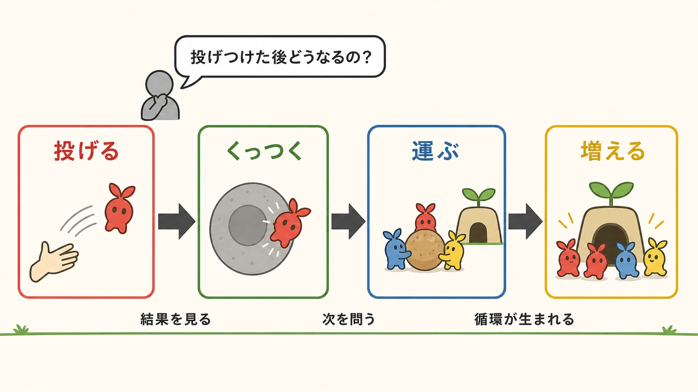
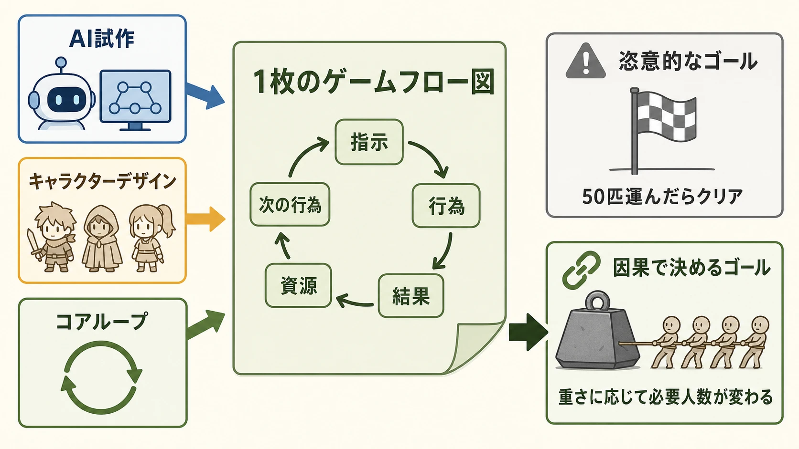
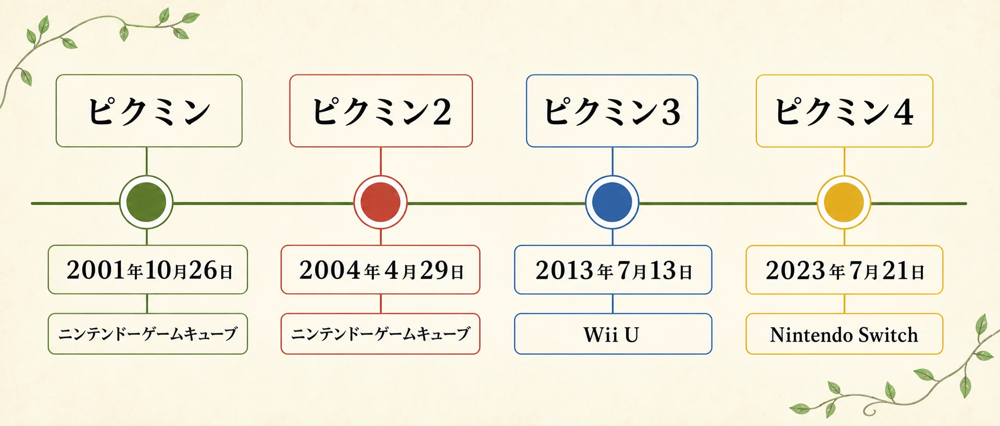

# 初代『ピクミン』の企画はどこから生まれたのか――断片を一枚のゲームフローへ統合する、プランナーの設計判断集

初代『ピクミン』は、ニンテンドーゲームキューブ向けに2001年10月26日に日本で発売された。小さな生き物を大勢引き連れ、敵を倒し、獲物を運び、仲間を増やすゲームである。シリーズの起源は、ゲームキューブ発表時の技術デモ「マリオ128」から生まれた、と説明されがちだ。しかし、後年の任天堂公式インタビューで初代開発チームの神門有史氏は、開発当時に「マリオ128」の存在を知らず、企画的にも技術的にも影響を受けていないと語っている。[[1](#ref-1)][[2](#ref-2)]

これは「多数のキャラクターを画面に出す」という共通点を否定する話ではない。『マリオ128』は実在したゲームキューブ発表時の技術デモであり、宮本茂氏も100匹以上の分身を動かす実験だったと振り返る。一方で『ピクミン』の企画は、初期ディレクターの日野氏と阿部氏が、スーパーファミコンからNINTENDO 64へ移る時期に始めた「大量のキャラクターをAIで動かすゲーム」にさかのぼる。両者を同じ起源としてつなげてしまうと、企画が何を試し、どの段階で遊びになったのかが見えなくなる。[[2](#ref-2)]

本稿は初代『ピクミン』を、完成形を最初から見通した企画としてではなく、複数の試作、表現技術、デザイン、プロデュース判断を一つのゲームサイクルへ結び直した過程として読む。新人プランナーにとって重要なのは、最初の着想を当てることではない。散らばった要素に、プレイヤーが理解できる因果関係と、チームが実装できる範囲を与えることである。

***

## 1. 出発点は「マリオ128」ではなく、大量AIを動かす試作だった

日野氏と阿部氏は初期企画のディレクターであった。日野氏はキャラクターや世界設定を、阿部氏はゲームシステムとレベルデザインを見ていたという。当初の構想はアクションゲームではなく、生き物の頭に「思考チップ」と「感情チップ」を割り当てるものだった。戦う、回復する、仲間を助けるといった思考チップで行動を決め、怒る、怖がるといった感情チップで反応の個性を変える。探索で経験を積めばチップ容量が増え、生き物がより賢くなる、という設計である。[[2](#ref-2)]

ここでの「AI」は、完成品のピクミンのように、プレイヤーの指示へ群れとして即座に応じる仕組みではなかった。まずは多くのキャラクターにどのような動きを与えられるかを検証する試作だった。神門氏は当時入社1年目のプログラマーとして配属され、AIで多数のキャラクターを動かす試作を繰り返したと述べている。デザイナーの森井氏が加わったときには、すでに小さなキャラクターが多数動いていた。[[2](#ref-2)]

企画の起点を正確に置くと、実務上の問いも変わる。「多数表示できるなら何のゲームにするか」ではなく、「多数の自律的な存在を、プレイヤーが理解し操作できる遊びへどう変換するか」である。技術デモは可能性を示せるが、ゲームの目的、操作、失敗と回復の関係までは決めない。初期の思考チップと感情チップは製品に残らなかった。それでも、群れを一つの操作対象にしようとした問題設定は、後の企画の土台になった。

***

## 2. 表現の制約を越えたとき、企画で選べる行動も増えた

NINTENDO 64で開発していた段階では、キャラクターをビルボード、すなわち平面の板を組み合わせた表現にして処理を軽くし、多数いるように見せていた。ゲームキューブへの移行後は、1匹ずつを3Dモデルとして表現できるようになった。神門氏が語る転機は、単に画面がきれいになったという話ではない。キャラクターをどう見分け、どのように群れとして扱わせ、何をさせるかというゲームデザインの選択肢が増えたということである。[[2](#ref-2)]

技術の更新を企画へ持ち込むとき、性能表の数字をそのまま売り文句にするだけでは足りない。今回の事例でチームが問うたのは、「この生き物をどう動かすと面白いか」だった。隊列を組ませる、球を投げさせる、対戦させる。実装可能になったことを、一つずつ行為の試作へ変えたのである。[[2](#ref-2)]

この順番には実務的な意味がある。新しい描画、物理、AI、ネットワークの能力を得ても、それ自体はプレイヤーの動詞にならない。技術の制約が緩んだら、次に書くべきなのは「何体まで表示できるか」だけではなく、「プレイヤーは何を見て、何を指示し、その結果を何秒後に読み取れるか」である。

***

## 3. キャラクターデザインは、見た目の決定と遊びの決定を往復した

初期のキャラクターは日野氏自身が「ヨッシーっぽい」と振り返る姿だった。上から見下ろす画面を想定し、頭の部分で性別や性格を分かるようにしていたという。森井氏が多くのスケッチを出し、満場一致で現在につながる姿が選ばれた。頭の葉は小さなキャラクターを見分ける目印として考えられた可能性があると、森井氏は振り返っている。[[2](#ref-2)]

その造形は、かわいさだけを目標にしたものではない。森井氏はティム・バートンの描く作風を好み、かわいいだけでなく、おどろおどろしさやシリアスさを持たせようとしていた。チームはフランスのアニメーション映画『ファンタスティック・プラネット』（1973年公開）を観賞し、生き物を扱うゲームの参考としてリチャード・ドーキンス『利己的な遺伝子』も読んだ。これらはデザインの正解を写す資料ではなく、既存の任天堂作品とは異なる、不思議で少し厳しい生態系を考えるための刺激だった。[[2](#ref-2)]

ただし、アートだけで最終形が決まったわけではない。宮本氏は敵のデザインについて、アート先行ではなく、ピクミンに何を仕掛けるかから設計していると説明する。頭の目印、植物らしさ、敵にくっついたときの見え方、食べられたときに葉が口から見えることまで、造形は行動の読みやすさと危険の実感に接続されている。[[2](#ref-2)]

プランナーとデザイナーの間で共有したいのは、資料の名前ではない。参照資料は「この色にする」「この線をまねる」という指示より、作品内でどんな感情の振れ幅を許すかを話すために使える。そこで定めた雰囲気を、操作中の識別性、敵味方の反応、失敗の見え方まで落とし込めるかが、ゲームのデザインになる。

***

## 4. 「投げる」は出発点であり、くっつく・運ぶ・増えるは問いから見つかった

デザインが定まった後も、チームには「何をさせればゲームとして面白いのか」というゴールが見えていなかった。日野氏が生き物をミサイルのように敵へ投げる試作を作っていたとき、宮本氏は「投げつけた後どうなるのか」と尋ねた。敵を囲んで叩くという答えに対して、敵の背中や弱点へくっつけないか、と問いを重ねた。実験すると、投げたキャラクターが敵へくっつくこと自体が手応えになった。[[2](#ref-2)]

次に、倒した敵を運んで持ち帰る行為が生まれた。実際に群れが運ぶ姿は、まるでアリがセミを運んでいるように見えたという。そして、持ち帰った獲物から生き物が増える流れが加わった。こうして「投げる」「くっつく」「運ぶ」「増える」は、一度に仕様書へ並んだ四機能ではなく、前の行為の結果を見て次の行為を問う連鎖として見つかった。[[2](#ref-2)]

この発見の仕方は、企画レビューで使える。試作を見たときに「面白いか」を先に判定するのではなく、直後の状態を問うのである。

1. **行為の直後に何が残るか**：投げた対象は、消えるのか、敵にくっつくのか、危険へ入るのか。
2. **その結果を誰が処理するか**：プレイヤーは回収するのか、群れに任せるのか、新しい指示を出すのか。
3. **処理の結果、何が次の選択肢を増やすか**：運搬は資源を戻し、増殖はより重い対象へ挑める人数を増やす。

一つの操作を、次の操作を必要にする結果へつなげる。これがコアループを作るときの基礎になる。新機能を足して操作数を増やすこととは違う。

*図：投げた後の状態を問い直すことで、行為の結果が次の行為を生み、ゲームサイクルへつながる。*

***

## 5. ゲームフロー図は、アイデアを捨てるためではなく、接続と範囲を決めるためにある

アクションとキャラクターの方向性が決まっても、ゲームサイクルはすぐには定まらなかった。日野氏は、要素が点在し、ゲームの中で何をして何をもってクリアとするかをまとめきれなかったと語る。2001年のE3での披露を目標に、当時プロデューサーだった宮本氏は阿部氏へ「ディレクターとして入るので、3か月ください。失敗したら降りる」と申し出た。日野氏によれば、約2か月後にはE3で発表している。[[2](#ref-2)]

このとき宮本氏が担ったのは、良いアイデアを一つ選び、残りを否定する役割だけではない。神門氏によれば、ばらばらだったアイデアをほとんど取りこぼさずに集め、一枚のゲームフロー図へまとめた。その図には、投げて指示すること、物を運び終えること、敵や植物の意味、一日のサイクル、ピクミンの生態と増える仕組みが、プログラムの流れとして置かれた。[[2](#ref-2)]

重要なのは、ゴールの書き方である。初期にはピクミンを出口へ連れていく構想もあった。宮本氏は「50匹運んだらクリア」のような、誰かが決めた目標を嫌ったという。代わりに「何匹集めたら物を運べるか」とし、重そうな物を運ぶには多くのピクミンが必要だという直感的な因果を置いた。これにより、戦う、運ぶ、増やすことが、効率よく進めるべき同じ循環に入った。[[2](#ref-2)]

数値を使わないという話ではない。必要人数という数値は残っている。違いは、その数字が外から課された合格ラインではなく、プレイヤーが画面上の重さと運搬の様子から理由を推測できる条件になっていることだ。任意の目標値は「なぜ50なのか」という説明を追加で必要とする。因果で説明できる目標は、プレイヤーの観察そのものが理解を支える。

また、一枚のフロー図はアイデア帳ではない。宮本氏は、図に書いてあること以外は起こらないという宣言でもあると説明する。多人数で制作するには、何を作るかだけでなく、今回は何を起こさないかまで共有しなければならない。新人プランナーが小さな企画をまとめるときも、機能一覧の前に「開始時の資源」「プレイヤーの指示」「行為の結果」「資源の変化」「次に可能になる行為」「成功または失敗」という循環を一枚で追えるようにしてみるとよい。実装、デザイン、レベル制作が同じ因果を確認できる。

*図：断片的な要素を一枚のゲームフロー図へ統合し、プレイヤーが理由を推測できる因果としてゴールを置く。*

***

## 6. シリーズの揺れは、ゲームサイクルに一つの正解がないことを示す

初代のゲームサイクルは、30日以内にクリアする時間制限を持つ。何度も遊び、より効率よく進める「深く遊べる」設計である。一方、『ピクミン2』では時間制限をなくし、ピクミンやオタカラの種類、図鑑を増やして、こつこつ集める「長く遊べる」設計へ方向を変えた。開発陣はこの差を、時間のマネージメントから種類のマネージメントへの変化として振り返っている。[[2](#ref-2)]

シリーズ本編の発売履歴を見ると、初代の後に『ピクミン2』は2004年にニンテンドーゲームキューブで、『ピクミン3』は2013年にWii Uで、『ピクミン4』は2023年にNintendo Switchで発売された。[[1](#ref-1)] 『ピクミン3』は初代の「深く遊ぶ」路線へ戻り、本編とは別にミッションモードを入れて、技術を磨くことが本編の達成にもつながるようにした。[[2](#ref-2)]

社内では、初代を好む人と2作目を好む人の間に「1作目 vs. 2作目論争」と呼ばれるほどの意見の違いがあった。神門氏は4作目について、多様な好みの人を迎え入れるために長い時間をかけて検討した結果だと述べる。[[2](#ref-2)] 宮本氏は、初代のゲームの深さを残しつつ、操作の難しさは機能面で支援するという方向を説明し、神門氏は日数制限をなくしても「深く」も「長く」も遊べるようにしたと語る。[[3](#ref-3)]

ここで学べるのは、シリーズの前作を一つの正解として固定しないことだ。同じ「ピクミンらしさ」でも、反復の密度を高めるか、収集と探索の時間を広げるかで、プレイヤーが抱く面白さは変わる。続編の企画では、前作の機能を増減する前に、何を繰り返したくなる体験として守るのかを言葉にする必要がある。

*図：初代『ピクミン』から『ピクミン4』まで、本編4作の日本での発売日とプラットフォーム。出典：任天堂「ピクミンのヒストリー」[[1](#ref-1)]*

***

## おわりに：断片を接続する人が、企画をゲームにする

初代『ピクミン』は、「大量のキャラクターをAIで動かす」という問題設定から始まった。しかし、思考チップと感情チップの試作が、そのまま製品になったわけではない。平面表現から個別の3Dモデルへの移行、森井氏のスケッチ、投げた後に何が起こるかという問い、運搬と増殖の連鎖、そして宮本氏によるゲームフロー図が重なって、現在よく知られるゲームサイクルになった。[[2](#ref-2)]

新人プランナーが持ち帰るべき判断は二つある。第一に、複数人の試作や断片的なアイデアがあるとき、良い要素を列挙するだけで終わらせないことだ。行為、結果、資源、次の行為、ゴールを一枚の設計図につなげ、実装しない範囲も同時に決める。第二に、目標数値を置くときは、プレイヤーが納得できる因果を先に作ることだ。重い物には多くの仲間が要る、という関係は、説明を読まなくても観察と操作で理解できる。

企画の起源を正しく知る価値は、逸話を訂正することだけにはない。技術デモの派生物として『ピクミン』を見るのではなく、未完成な試作を、理解できる行為の循環へ統合した仕事として見ると、今日の企画会議で何を決めるべきかが具体的になる。

## References

1. [ピクミンのヒストリー｜ピクミンガーデン ～ピクミンのいる庭～｜Nintendo][1] - 初代から『ピクミン4』までの日本における発売日とプラットフォームを示す任天堂公式年表。

2. [開発者に訊きました：ピクミン４ 第1回「ピクミン 1作目 vs. 2作目論争」｜任天堂][2] - 初代『ピクミン』の開発メンバーが、企画の出発点、表現技術、キャラクターデザイン、ゲームフロー、シリーズの設計差を振り返る公式インタビュー（2023年7月20日公開）。

3. [開発者に訊きました：ピクミン４ 第2回「ダンドリ体質」｜任天堂][3] - シリーズを通じた「深く遊べる」「長く遊べる」設計判断の統合について、『ピクミン４』開発陣が振り返る公式インタビュー（2023年7月20日公開）。

[1]: https://www.nintendo.com/jp/character/pikmin/history/index.html
[2]: https://www.nintendo.com/jp/interview/ampya/index.html
[3]: https://www.nintendo.com/jp/interview/ampya/02.html

----

この文書は、Perplexity、Claude、OpenAI Codex の3つのAIの支援を受けて著述されたものです。引用画像を除き、MIT License にて提供されています。
