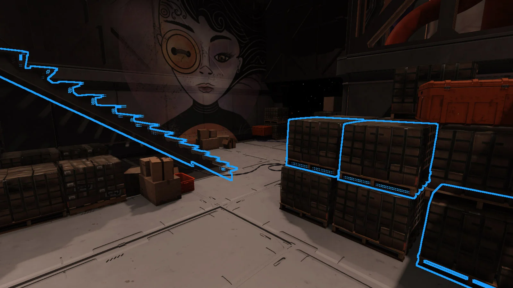
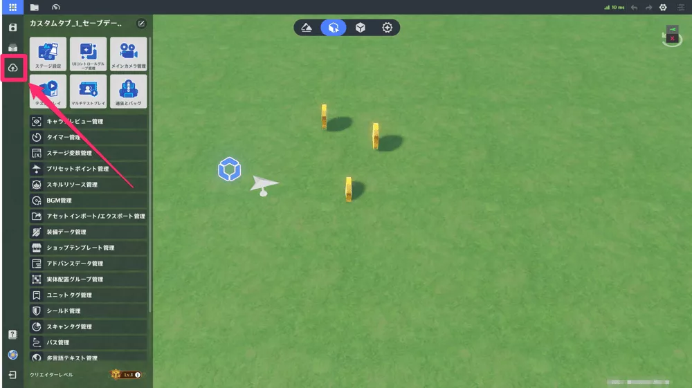

# ゲームにおけるUGC：Fortnite・Roblox・原神の徹底比較
### ユーザー体験・運営メリット・注意すべきリスクを読み解く

***

## 1. UGCとは何か：ゲームが「プラットフォーム」になる時代

**UGC（ユーザー生成コンテンツ）** とは、ゲームのプレイヤー自身がコンテンツを作成し、ほかのユーザーと共有・体験できる仕組みの総称である。[[1](#ref-1)]

MODやファンアートのように非公式なものから、開発者が公式に提供するゲーム内エディターまで幅広く含まれるが、近年注目されているのは **プラットフォーム型UGC**、すなわちゲーム内に本格的な制作ツールと収益化・配信の仕組みが統合されたモデルだ。[[2](#ref-2)][[1](#ref-1)]

その先駆者がRobloxとFortniteであり、2025年には原神も独自のUGCシステム「星々の幻境」を実装するなど、主要タイトルへの拡大が進んでいる。UGCはいまやゲーム業界の中枢的な成長エンジンとなっており、過去5年間で約90億ドル（約1.3兆円）もの投資を集めている。[[3](#ref-3)][[4](#ref-4)][[5](#ref-5)]

***

## 2. 3タイトルの概要比較

| 項目 | Fortnite (UEFN) | Roblox | 原神「星々の幻境」 |
|------|----------------|--------|--------------|
| **UGC開始時期** | 2018年〜（UEFN：2023年〜） | 2006年〜 | 2025年10月（Ver6.1） |
| **主要ツール** | Fortnite クリエイティブ / Unreal Editor for Fortnite（UEFN） | Roblox Studio | 星々の箱庭エディター |
| **プログラミング方式** | Verse（スクリプト言語）/ ノードベース | Luaスクリプト | ノードベース（UEブループリント類似） |
| **難易度** | 初心者〜プロ両対応 | 初心者向け入門ツール | 初心者〜中級者向け |
| **収益化** | エンゲージメント報酬 ＋ アイテム販売 | 開発者エクスチェンジ（DevEx） | 専用イベント期間に実施 |
| **経済圏** | V-Bucks（Fortnite本体と統合） | Robux（独立仮想通貨） | 専用通貨（プリモジェムとは別） |
| **マルチプレイ** | ○ | ○ | ○ |
| **対象プレイヤー** | 幅広い年齢層 | 主に子ども・ティーン | 既存の原神プレイヤー |

***

## 3. Fortnite / UEFN

### 3-1. ユーザーが体験できること

*画像出典（引用）: [Epic Games Developer - User Interface Reference for Unreal Editor for Fortnite](https://dev.epicgames.com/documentation/fortnite/user-interface-reference-for-unreal-editor-for-fortnite)*

Fortniteにおけるクリエイター向け環境は大きく2層に分かれる。

- **Fortnite クリエイティブ**：ゲーム内から直接アクセスできる直感的なマップエディター。テンプレートを使った簡単なアリーナやパーティーゲームの制作が可能で、初心者でも数十分で動くゲームを作れる。[[6](#ref-6)]
- **UEFN（Unreal Editor for Fortnite）**：Epic Gamesが提供するPC専用の本格開発環境。Unreal Engineをベースにしており、独自スクリプト言語「Verse」や高品質3Dアセットを活用して、商業クオリティに近いゲームを制作できる。[[7](#ref-7)]

2023年のUEFN公開からわずか1年半でクリエイター数は24,000人から70,000人以上へ急増し、2024年には198,000以上のアイランドが存在した。プレイヤーの視点でも影響は顕著で、2024年のFortnite総プレイ時間のうち **36.5%（52.3億時間）がUGCアイランドへの滞在時間** を占め、70%以上のプレイヤーが公式・UGC両方のコンテンツをプレイしている。[[8](#ref-8)][[9](#ref-9)]

### 3-2. 運営（Epic Games）にとってのメリット

- **コンテンツコストの大幅圧縮**：制作費ゼロでゲームの多様性を担保でき、毎日60,000近いクリエイターアイランドが稼働している[[8](#ref-8)]
- **ライブサービスの長期化**：UGCコンテンツを活用しているゲームは5年後のプレイヤー数が最大115%増になるというデータがある[[10](#ref-10)]
- **IP連携によるユーザー拡大**：レゴ・ディズニー・Netflixなど大型IPとのパートナーシップによって新たなデモグラフィックを獲得できる[[11](#ref-11)][[7](#ref-7)]
- **広告・ブランドビジネス**：ブランドアクティベーションのプラットフォームとしても機能する[[12](#ref-12)]

### 3-3. 収益分配の仕組み

FortniteのUGC収益化は **エンゲージメント報酬プログラム** が中心だ。アイテムショップをはじめとする実課金の純収益の40%が「エンゲージメントプール」に積み立てられ、プレイヤーのアイランド滞在データ（新規・復帰ユーザーの引き込み、プレイ時間など）に応じてクリエイターへ分配される。2025年12月からは、自アイランド内でのアイテム直販も実装され、期間限定でV-Bucks収益の100%がクリエイターに還元される（通常は50%）。[[13](#ref-13)][[14](#ref-14)]

2024年のクリエイター総支払額は **3億5,200万ドル（約530億円）** で前年比11%増だ。7人が1,000万ドル超を稼いでいる一方、1万ドル以上稼いだクリエイターは全体の一部に留まる格差構造がある。[[9](#ref-9)][[8](#ref-8)]

### 3-4. 運営が注意すべきリスク

- **IP侵害リスク**：許可を得ていないIPの使用はBANの対象となり、過去には著名作品のオマージュマップがDMCA申請で削除される事例もある[[11](#ref-11)]
- **クオリティ格差**：UEFN制作のハイクオリティ作品と、低品質アイランドの共存による発見面の汚染
- **バトルロワイヤルのイメージからの脱却困難**：長年培われたFPSゲームのブランドイメージが、多様なUGC体験への誘導を阻む構造的課題である[[15](#ref-15)]
- **クリエイター依存リスク**：トップクリエイターへの集中が進めば、少数離脱が体験の質に直撃する

***

## 4. Roblox

### 4-1. ユーザーが体験できること

*画像出典（引用）: [Roblox Creator Hub - Studio interface](https://create.roblox.com/docs/studio/ui-overview)*

Robloxは「ゲームプラットフォームのYouTube」とも例えられ、プレイヤーは **Roblox Studio** を使ってゲームを制作し、全世界のユーザーへ向けて公開できる。制作に必要なLuaスクリプトはビジュアルエディターと組み合わせられており、10代の初心者でも独学でゲームを完成させたケースが多数報告されている。[[16](#ref-16)][[17](#ref-17)]

ユーザーはゲームを **作る** だけでなく、着せ替えアイテムやUGCアバターパーツ（衣装・アクセサリー等）を **制作・販売** することもでき、消費者兼クリエイターという二面的な参加が可能だ。デイリーアクティブユーザーは2025年第4四半期時点で1億4,400万人（同年第3四半期には一時1億5,000万人超）に達し、未成年比率の高い若年層プラットフォームとして知られる（年齢確認済みユーザーでは13歳未満が約35%、13〜17歳が約38%）。近年は18歳以上の割合が拡大し、ユーザー層は徐々に高年齢化している。[[18](#ref-18)]

### 4-2. 運営（Roblox社）にとってのメリット

- **自社開発コストなしに膨大なコンテンツを確保**：コンテンツはすべてクリエイターが制作するため、ゲーム開発費をほぼゼロで維持できる
- **クリエイター経済の規模**：2025年のDevExプログラムによるクリエイター総支払額は **15億ドル（約2,250億円）以上** に達し、トップ1,000クリエイターの平均収入は130万ドルを超える[[19](#ref-19)]
- **GDP・雇用への波及効果**：2017〜2024年間に推定22,000のフルタイム相当の雇用と16.2億ドルのGDP効果をアメリカ経済にもたらしており、プラットフォームを超えた社会的影響力を持つ[[16](#ref-16)]
- **ブランドコラボの受け皿**：ライオンズゲートやセガ・NetflixなどがRoblox上に公式コンテンツを展開するIPライセンスモデルも確立している[[11](#ref-11)]

### 4-3. 収益分配の仕組み

プレイヤーはRobux（仮想通貨）を使ってゲーム内アイテムや有料体験にアクセスし、クリエイターはそこから収益を得る。一定の閾値を超えたRobuxは **DevEx（開発者エクスチェンジ）プログラム** を通じて実際の法定通貨に換金できる。ただし換金レートはRobloxが設定するため、クリエイターが受け取れる実質額はRobux額面より大幅に少なくなる。[[17](#ref-17)]

2025年第1四半期のDevEx処理額は1億2,200万ドルにのぼる一方、クリエイター1人あたりの平均収入はFortniteと比較して非常に低く（Roblox: 約143ドル/年 vs Fortnite: 約5,029ドル/年）、収益が少数のトップクリエイターに集中する傾向がある。[[20](#ref-20)][[8](#ref-8)]

### 4-4. 運営が注意すべきリスク

- **子ども向けプラットフォームの安全問題**：1億4,400万人規模のDAUの相当数が未成年であり、プレデター行為・性的コンテンツの混入・不適切なチャットが繰り返し問題化している。2025年には「Child Safety API」の整備や年齢確認（年齢推定）機能の強化が進められている[[21](#ref-21)][[18](#ref-18)]
- **コンテンツ品質のばらつき**：誰でも公開できるため低品質作品が発見性を汚染するリスクがあり、Robloxは年齢別のコンテンツ成熟度ラベリングを2024年末から必須化している[[22](#ref-22)]
- **換金レートへの批判**：Robuxの換金レートはRobloxが一方的に決定でき、クリエイターが著作権を実質上コントロールできないという法的弱立場の指摘もある[[23](#ref-23)]
- **規制リスク**：EU・英国のオンライン安全法など、各国の子ども保護規制への対応コストが増大している[[18](#ref-18)]

***

## 5. 原神「星々の幻境」

### 5-1. ユーザーが体験できること

*画像出典（引用）: [ゲームエイト「星々の幻境(UGC)のゲーム制作(作り方)」](https://game8.jp/genshin/732529)*

2025年10月のVer6.1（Luna Ⅱ）で実装された **星々の幻境** は、原神という一本のゲーム内に構築されたUGCプラットフォームだ。プレイヤーに提供される体験は主に4種類に分類される。[[24](#ref-24)][[25](#ref-25)]

1. **ドール（アバター）のカスタマイズ**：オリジナルのキャラクターを作り、テイワット世界を探索できる。髪型・顔・衣装を自由に設定でき、日本語CVも複数から選択可能[[26](#ref-26)]
2. **他プレイヤーとの交流**：ゲーム内に設けられたロビーに集まり、世界中のプレイヤーとリアルタイムに交流できる[[24](#ref-24)]
3. **オリジナルゲームの制作**（「星々の箱庭」エディター使用）：経営シミュレーション・サバイバル・パーティーゲーム・対戦など幅広いジャンルに対応。ノードベースのビジュアルプログラミングで、コーディング経験がなくてもゲームロジックを組める[[4](#ref-4)][[24](#ref-24)]
4. **コミュニティ制作ゲームのプレイ**：世界中のクリエイターが作成したステージを全デバイスで遊べる[[24](#ref-24)]

注目すべきはそのスタート地点で、原神には既に数千万人の既存プレイヤーが存在する。「新しいプラットフォームに登録する」ではなく、「いつものゲームに新機能が追加された」という形での導入であり、UGCへのハードルが極めて低い点が他タイトルとの大きな違いだ。

### 5-2. 運営（miHoYo / HoYoverse）にとってのメリット

- **コンテンツ供給のボトルネック解消**：原神はこれまで運営側のシナリオ・イベント更新のみが遊びの源泉だった。UGCにより **コミュニティ自身が常時新しいコンテンツを生成** し、イベント不在期間のエンゲージメント低下を補完できる[[3](#ref-3)][[4](#ref-4)]
- **既存ユーザーのリテンション強化**：UGCを持つタイトルは導入5年後の同時接続者数が最大115%増というデータに照らしても、長期運営タイトルへの波及効果は大きい[[10](#ref-10)]
- **クリエイター育成によるコミュニティ深耕**：公式チュートリアル・専用フォーラム・創作応援プログラムを用意しており、制作者を育てることでコアコミュニティを強化できる[[26](#ref-26)]
- **経済圏の分離による既存ガチャへの影響排除**：UGC専用通貨とバトルパスは原神本体のプリモジェムとは分離されており、課金ユーザーの不満を最小化しながらUGCマネタイズを追加できる[[27](#ref-27)]

### 5-3. 収益化の仕組み

クリエイターはゲームを公開し、多くのユーザーにプレイ・評価してもらうことで収益を得られるが、収益化機能は実装当初（Luna II）には用意されておらず、 **クリエイター収益システムはLuna IV（2026年1月）から導入された**。収益は公開ステージのプレイ人数などのプレイデータに応じて分配される仕組みだが、具体的な分配の比率や条件は現時点で限定的にしか公開されていない。収益化を行うには、クリエイターセンターへの個人情報登録に加え、 **クリエイターレベル2以上** への到達が必要だ。クリエイターレベルは審査制で段階的に機能が解放されていく仕組みである。Fortnite・Robloxと比べると収益化の歴史は浅く窓口も限定的だが、将来的な拡張が示唆されている。[[28](#ref-28)][[29](#ref-29)][[30](#ref-30)]

### 5-4. 運営が注意すべきリスク

- **原神本体のブランドとの整合性**：深いストーリーとキャラクターへの愛着で支持を集めてきた原神に、ミニゲーム的UGCが混在することで **「これは原神ではない」という既存ファンの抵抗感** が生じる可能性がある[[31](#ref-31)][[28](#ref-28)]
- **コンテンツの質の担保**：クリエイターレベルによるアクセス制限でクオリティ管理を図ってはいるが、低品質作品が増えると体験全体の印象が低下するリスクがある
- **別経済圏の複雑化**：専用通貨・専用バトルパスという仕組みは既存プレイヤーに対してガチャとの二重課金構造への懸念を与えるリスクがある[[27](#ref-27)]
- **後発プラットフォームの模倣コンテンツ問題**：原神のキャラクターやデザインを模倣した無断UGCコンテンツへのモデレーションは、規模が大きくなるほど難易度が上昇する
- **クリエイターエコシステムの未成熟**：FortniteやRobloxと異なり収益化の歴史が浅く、フルタイムクリエイターが育ちにくい段階にあることが長期的に体験の質を制約する可能性がある

***

## 6. UGC運営の3つの共通課題

プラットフォームごとの差異はあれど、UGCを持つゲームが共通して直面する課題がある。

### 課題①：発見性の設計

制作されたコンテンツが増えるほど、良質なものが埋もれるリスクが高まる。Robloxはアルゴリズムによるおすすめとコンテンツ年齢ラベリングを、Fortniteはアイランドに対するエンゲージメント指標と「スポンサードロウ」をそれぞれ導入している。原神でも完了統計・コミュニティ評価・カテゴリフィルターによる発見システムが設けられている。発見性の設計はクリエイターの収益と直結するため、単なるUIの問題にとどまらず、エコシステム全体の健全性に影響する。[[13](#ref-13)][[22](#ref-22)][[27](#ref-27)]

### 課題②：IPと著作権の管理

UGCは「ユーザーが作るもの」である以上、ゲームの資産を使って無断に他社IPや類似コンテンツが制作されるリスクを避けられない。FortniteはDMCA申請による削除対応を行っており、プラットフォームごとに公式IPライセンス制度を整備することでリスクを構造的に低減しようとしている。[[23](#ref-23)][[11](#ref-11)]

### 課題③：クリエイター収益の公平性

プラットフォームが成長しても、収益の大半はごく少数のトップクリエイターに集中する。Robloxでは上位10クリエイターの年間平均報酬が約3,390万ドルに達する一方、開発者全体の報酬中央値は年間約1,400ドルにすぎず、Fortniteでも1,000万ドル超えは7人のみだ。プランナーとして設計する際は、「多くのクリエイターがまず最初の収益を得られる」ためのオンボーディングと、「継続的な成長を促すためのスケーリング報酬」の両方を設計に含める必要がある。[[5](#ref-5)][[9](#ref-9)]

***

## 7. ゲームプランナーへの示唆：UGC設計の4つの原則

1. **経済圏の設計を最初に決める**：本体通貨との統合か分離かは、課金ユーザーの不満と新規ユーザーの参入容易性に直結する。原神型の「分離」はリスクを最小化するが、経済圏が複雑化する。

2. **ツールの難易度を段階化する**：Roblox Studioのような「誰でも始められる入口」と、UEFNのような「プロが本気で使える奥行き」の両方を設計することで、クリエイター層の厚みが増す。

3. **コンテンツのモデレーションを先行投資と見なす**：UGCが成長するほどモデレーションコストは指数的に増加する。年齢ラベリング・AIによる自動検出・コミュニティレポートの仕組みを最初期から組み込んでおくことが不可欠だ。[[21](#ref-21)][[18](#ref-18)]

4. **コンテンツが生まれるまでの「0→1」を支援する**：多くのUGCプラットフォームで失敗するのは、ツールを提供した後の「誰も作らない状態」への対処である。公式チュートリアル・テンプレート・コミュニティフォーラム・創作応援プログラムなど、最初の体験を設計する伴走支援が長期的なエコシステムの礎となる。[[32](#ref-32)][[26](#ref-26)]

***

## まとめ：3タイトルのポジションを俯瞰する

| 観点 | Fortnite (UEFN) | Roblox | 原神「星々の幻境」 |
|------|----------------|--------|--------------|
| **プレイヤーにとっての自由度** | 高い（本格ゲーム制作可） | 中〜高（初心者向き） | 中（原神内に特化） |
| **収益化の実績** | 高い（1人あたり報酬が最大） | 高い（総額は最大） | 発展途上 |
| **クリエイター参入障壁** | 中〜高（UEFN習得が必要） | 低（Luaとビジュアルエディター） | 低〜中（ノードベース） |
| **安全・モデレーション課題** | 中（IP問題が主） | 高（未成年保護が最重要） | 未知数（規模拡大後に顕在化） |
| **プラットフォーム成熟度** | 中（急成長中） | 高（20年近い歴史） | 低（実装後1年未満） |

UGCは「コンテンツを消費するゲーム」から「コミュニティが体験を作るプラットフォーム」へという、ゲームの本質的な転換点を示している。どのタイトルにも共通するのは、「ユーザーに創る楽しさを渡すことが、最終的には運営にも大きな価値をもたらす」という逆説的な関係性だ。[[1](#ref-1)]

---

## References

1. [Games industry in 2026 and beyond: is user-generated content the ...][1] - ... platform fees. Roblox D2C revenues in Q4 2025 were 30% of total revenues while aggregate platfor...

2. [Exploring UGC in the Gaming Industry: How Community Content ...][2] - Newzoo reports indicate that games with robust UGC systems have been seen to experience a 15-20% inc...

3. [「原神」に実装されたユーザー生成コンテンツ「星々の幻境」とは ...][3] - オープンワールドゲーム「原神」にUGC（ユーザー生成コンテンツ）「星々の幻境」が実装されました。これまでの原神はmiHoYoが提供してきたコンテンツを ...

4. [『原神』の大型新機能「ユーザー生成コンテンツ（UGC）」発表][4] - 本作におけるUGCとは、プレイヤー主導で作り上げるコンテンツとされている。 ... そうした思いから、今回の大型コンテンツ「UGC」が誕生したそうだ。 具体 ...

5. [Where the UGC Dollars Flow: Mapping $9B Investments in Creator ...][5] - We tracked nearly $9B flowing into creator-driven gaming through 95 investments and 21 M&A deals acr...

6. [How to Create Custom Maps in Fortnite: A Complete Guide][6] - This comparison shows that while standard Creative mode is excellent for quick map creation, UEFN op...

7. [UEFN an Emerging Contender in User-Generated Gaming Content][7] - Discover how Unreal Editor for Fortnite (UEFN) is shaping the future of user-generated content in ga...

8. [Fortnites UGC Creator Economy In 2024-2025 - Growth HQ][8] - UGC as Core Experience: 2024's data reveals that user-generated islands are no longer a side-show, b...

9. [A Peek At Fortnite's Creator Economy in 2024 - Digital Music News][9] - A total of $352 million was paid to creators in 2024, an increase of 11% when measuring the March – ...

10. [How UGC Influences Game Success ｜ GAMES.GG][10] - The findings indicate a clear link between UGC and improved retention, engagement, and monetization ...

11. [The IP licensing paradox in virtual worlds - GEEIQ][11] - Explore how IP licensing in virtual worlds like Roblox and Fortnite is reshaping creator freedom, br...

12. [Virtual-world creators gaining traction beyond Roblox and Fortnite][12] - In 2025, UGC creators are starting to find success in smaller UGC platforms beyond the major players...

13. [Xander Van Buggenhout's Post - LinkedIn][13] - Beginning November 1, 2025, creators who attract new or returning players will earn 75% of those pla...

14. [Engagement Payout in Fortnite Creative - Epic Games Developers][14] - When you're accepted into the program, you'll see new engagement and payout data in the Monetization...

15. [The State of UGC Games in 2025 - YouTube][15] - UGC platforms are evolving and where they face the most promise and challenges, from Roblox's growin...

16. [Annual Roblox Economic Impact Report][16] - In just 2024 alone, Roblox generated a total GDP impact of $445 million, up 29% from 2023. Roblox ha...

17. [The Roblox Gaming Economy - AppLixir][17] - Roblox achieved $919 million in revenue this quarter, marking a 29% year-over-year increase and surp...

18. [Roblox Under Scrutiny: Addressing Trust and Safety Challenges in ...][18] - Roblox, the user-generated gaming platform boasting over 68 million daily active users, faces escala...

19. [The Multi-Billion Dollar Digital Economy Powering Roblox][19] - In 2025, Roblox paid out more than $1.5 billion to creators through its Developer Exchange program. ...

20. [Roblox Game Creation and Monetization Statistics 2026][20] - The Developer Exchange (DevEx) processed $122 million in Q1 2025, indicating continued momentum in c...

21. [Roblox Tightens Safety Policies For Younger Users, Private Spaces][21] - Faced with lawsuits accusing the platform of child-safety issues and loopholes for child predators, ...

22. [Roblox Updates Parental Controls and Introduces New Safety ...][22] - The changes include additional restrictions for under 13-year-olds, alongside limiting access to unr...

23. [User-Generated Content in Gaming: Legal Challenges and ...][23] - This article finds that although players own the copyright of user-generated content, they are in a ...

24. [【原神/LunaⅡ】「星々の幻境(UGC)」何ができる？知っておきたい ...][24] - 【原神/LunaⅡ】「星々の幻境(UGC)」何ができる？知っておきたい情報まとめ · 実装日は10月22日 · 解放条件は魔神任務序章第一幕をクリア · 入る方法.

25. [【原神】星々の幻境(UGC)の解放条件・できること - ゲームエイト][25] - 星々の幻境(UGC)は、原神内に用意されたUGC（ユーザー生成コンテンツ）です。主に4種類（着せ替え・キャラクリ、交流、ゲーム制作、ゲームプレイ）の遊びが ...

26. [本当に『原神』なの？！全く新しい常設コンテンツ「星々の幻境 ...][26] - 『原神』次回アップデート「Luna II」が10月22日に配信決定！新キャラクター「ネフェル」の実装や、UGC「星々の幻境」が開放されます。

27. [Genshin Impact"s UGC System: Your Gateway to Creating Custom][27] - HoYoverse just dropped a bombshell – they"re launching a full User-Generated Content system for Gens...

28. [原神にMMO的な要素＆UGCが導入で賛否…？"ホヨバース"が目指す ...][28] - 原神の大型新コンテンツ「星々の幻堺」が色々な意味で話題に… メインch「バキュン / オンラインゲーム&新作ゲーム情報」 ...

29. [【原神】収益化のやり方｜ゲームエイト - 星々の幻境][29] - 収益化を行うには、クリエイターセンターへの個人情報の登録だけではなく、クリエイターレベルを2にあげる必要があります。公式クリエイターセンターの「 ...

30. [【原神】星々の幻境の容量とやるべきこと - ゲームウィズ][30] - クリエイターレベルが上がると使える機能がどんどん増えていく。クリエイターレベルはクリエイターセンターで申請して審査が通れば上げられるようになる。

31. [【原神】別ゲーレベル！大規模コンテンツ「UGC」(ユーザー生成 ...][31] - ... テーマ等リクエストがございましたらお気軽にコメントください。 ・原神を今から始める方へhttps://www.youtube.com/watch?v=05UOPkEtkAE ・ゼンゼロ ...

32. [Roblox and Fortnite: How new games impact UGC economy][32] - Better development capabilities and better discovery is driving new high-quality content from creato...

[1]: https://www.taylorwessing.com/en/insights-and-events/insights/2026/03/games-industry-in-2026-and-beyond
[2]: https://socialtargeter.com/blogs/exploring-ugc-in-the-gaming-industry-how-community-content-shapes-player-engagement
[3]: https://www.moguravr.com/genshin-miliastra-review/
[4]: https://automaton-media.com/articles/newsjp/genshin-20250813-353232/
[5]: https://investgame.net/news/where-the-ugc-dollars-flow-mapping-9b-investments-in-creator-economy/
[6]: https://www.exitlag.com/blog/fortnite-creative/
[7]: https://games.gg/news/uefn-user-generated-gaming-content/
[8]: https://www.growthhq.io/our-thinking/fortnites-ugc-creator-economy-in-2024-2025-key-earnings-growth-insights-strategic-opportunities-for-business-leaders
[9]: https://www.digitalmusicnews.com/2025/01/24/a-peek-at-fortnites-creator-economy-in-2024/
[10]: https://games.gg/news/how-ugc-influences-game-success/
[11]: https://geeiq.com/resources/blog/the-ip-licensing-paradox-in-virtual-worlds
[12]: https://digiday.com/media/virtual-world-creators-gaining-traction-beyond-roblox-and-fortnite/
[13]: https://www.linkedin.com/posts/xandervb_big-news-for-uefn-creators-starting-activity-7374454992100814848-7LyW
[14]: https://dev.epicgames.com/documentation/fortnite/engagement-payout-in-fortnite-creative
[15]: https://www.youtube.com/watch?v=WSjnRN-5gE0
[16]: https://about.roblox.com/newsroom/2025/09/roblox-annual-economic-impact-report
[17]: https://www.applixir.com/blog/the-roblox-gaming-economy/
[18]: https://www.linkedin.com/pulse/roblox-under-scrutiny-addressing-trust-safety-challenges-childrens-4g4ie
[19]: https://www.sourcery.vc/p/breaking-the-multi-billion-dollar
[20]: https://sqmagazine.co.uk/roblox-game-creation-and-monetization-statistics/
[21]: https://www.mediapost.com/publications/article/408263/roblox-tightens-safety-policies-for-younger-users.html
[22]: https://swgfl.org.uk/magazine/robloxupdatesparentalcontrolsandintroducesnewsafetyfeaturesforunder13s/
[23]: https://openaccess.city.ac.uk/id/eprint/35720/
[24]: https://hoshimare.com/genshin_ugc_zissoumae_info/
[25]: https://game8.jp/genshin/729348
[26]: https://www.inside-games.jp/article/2025/10/10/172763.html
[27]: https://bittopup.com/article/Genshin-Impacts-UGC-System-Your-Gateway-to-Creating-Custom-Adventures
[28]: https://www.youtube.com/watch?v=bdaLcekYSqw
[29]: https://game8.jp/genshin/734061
[30]: https://gamewith.jp/genshin/article/show/513633
[31]: https://www.youtube.com/watch?v=aOSw22fKwso
[32]: https://www.linkedin.com/posts/jdavetaylor_new-experiences-breaking-into-the-top-10-activity-7315398093699534849-xzx4
