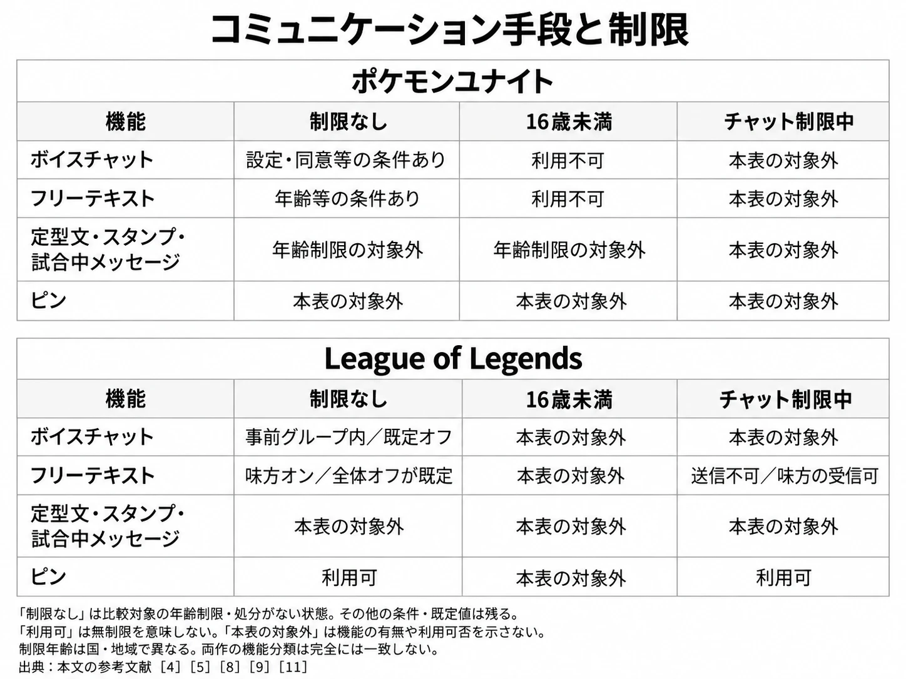

# 言葉は取り上げる。連携は取り上げない――League of Legends とポケモンユナイトのコミュニケーション設計

## 第1章　評判から離れ、送れるものを見る

League of Legends のプレイヤー同士の言動について、厳しい評判を耳にした読者もいるだろう。本稿では、その評判の当否から離れ、画面の中の仕組みを見る。比べるのはコミュニティの良し悪しではなく、プレイヤーが相手へ何を送れるかである。

オンラインゲームの有害な言動を指す *toxicity* は、学術研究でも定義がそろっていない。Bastian Kordyaka、Sukran Karaosmanoglu、Samuli Laatoによる2025年8月の系統的文献レビューは、既存研究の定義を整理し、この不一致を指摘している。同論文が引用するFair Play Allianceの見解では、曖昧で不正確なこの語に、設計やマッチングの不備から生じる紛争、意図的な不適切行動、悪意のない偶発的な誤解までが含まれてしまう。[[1](#ref-1)]

著者らは、やり取りの **形式・対象・意図・タイミング** の4次元で捉える定義を提案する。文字か、音声か、行動か。味方へのものか、敵へのものか。意図はどこにあるのか。自発的なものか、何かへの反応か。[[1](#ref-1)] 同じ「荒れている」という感想にも、異なる出来事がある。設計から生じる紛争も含むなら、何を送れるようにするかも検討に値する。

### 二つのゲームと、四つの伝え方

League of Legends は、代表的な対戦形式で5人ずつのチームが協力し、相手の拠点を破壊するゲームである。[[2](#ref-2)] 『Pokémon UNITE』（以下、ポケモンユナイト）も5対5のチーム戦で、こちらはゴールを決めて得点を競う。公式サイトはジャンルを「チーム戦略バトル」としている。[[3](#ref-3)]

このように、決まった地形の上で二つのチームに分かれ、各自が1体のキャラクターを操作して陣地を奪い合う対戦ゲームは、MOBA（Multiplayer Online Battle Arena）と呼ばれる。戦場は複数の進行路（レーン）に分かれ、キャラクターは試合の中で成長し、最終的な目的は相手陣地の攻略に置かれる、という構成が共通している。勝敗の決め方は作品ごとに異なり、League of Legends は相手拠点の破壊、ポケモンユナイトは制限時間内の得点で決まる。両作とも、味方と動く場所やタイミングを合わせる必要がある。チームスポーツで声をかけ合う場面を想像すればよい。

伝え方は一種類ではない。ここでは、次の違いを押さえておく。

- **フリーテキスト**：自分で文章を入力する方式。細かな説明も雑談もできるが、相手を傷つける文章も作れてしまう。
- **定型文チャット**：ゲーム側が用意した文を選んで送る方式。スタンプチャットは、用意された絵などを選ぶ方式である。
- **ピン（意思表示ピン）**：場所や状況に合図を付け、移動・注意・支援などの意図を伝える方式。本稿のピンは通信速度の指標ではなく、この合図を指す。
- **ボイスチャット**：マイクを使い、自分の声で会話する方式。操作を続けながら話せる一方、発言内容を自由に作れる。

表題の「言葉」は自由な発言を指す。 **自由な作文を制限しても、定型文や合図による連携は残す** という設計が本稿の主題である。

入口はポケモンユナイトでは年齢、League of Legends ではペナルティになる。年少者と違反者を同列に扱うのではなく、制限後に何ができるかを、2026年9月22日に確認した公開仕様から比べる。

***

## 第2章　ポケモンユナイトは、年齢で分けている

ポケモンユナイトのCEROレーティングはA、全年齢対象である。[[3](#ref-3)] そのゲームの中で、年齢によって使えるコミュニケーション機能が分かれている。

公式サポート「ボイスチャットが聞こえません」は、16歳未満ではボイスチャットとフリーテキストのテキストチャットを利用できないと説明する。一方、試合中メッセージシステム、定型文チャット、スタンプチャットは、この制限から除かれる。制限される年齢は居住する国・地域により異なるため、16歳という境界を世界共通のものとして読むことはできない。[[4](#ref-4)]

### 制限の境界は、自由に内容を作れるかにある

同じゲームに、条件を満たして自由記述を使える層と、年齢制限により定型文やスタンプなどで伝える層がいる。後者にも伝達手段を残す、機能ごとの出し分けである。

フリーテキストでは作戦の説明も個人的な攻撃も作れる。定型文では選べる内容を事前に限定する。 **どこまで内容の生成をプレイヤーへ委ねるか** が、この出し分けの境界である。

### 誕生日と機能の解除は、別の出来事になる

公式サポートによると、初回起動時の生年月日申告やログインアカウントの登録で16歳未満と判定されてプレイを始めた場合、16歳になってもチャットなどの年齢制限機能は自動で使えるようにならない。解除には、ポケモントレーナーセントラルのアカウント連携が必要になる。[[5](#ref-5)]

利用者から見れば、「年齢に達した」と「機能が使える」は別の状態である。仕様書には対象年齢だけでなく、解除条件とその案内まで書く必要がある。

### 題材の印象と、実際の接触は分けて見る

編者は当初、ポケモンという題材が穏やかなコミュニティにつながっているのではないかと考えていた。しかし、下調べで確認した公式告知は、その見立てを退けるものだった。

2024年8月20日の公式ニュースは、ゲーム内ボイスチャットで迷惑行為が多く確認され、楽しくプレイできない状態が生じていると公表し、暴言や脅迫などへのペナルティ強化を告知した。利用規約第18条を根拠に、行為の重大性や常習性を考慮して個別に判断し、重い場合には永久停止もあり得るとしている。詳細な処分内容は問い合わせても回答しない方針で、嫌がらせ目的などの通報機能の悪用も処分対象となり得る。[[6](#ref-6)]

当時のボイスについての告知なので、現在のコミュニティ全体の評価には使えない。それでも、 **ポケモンのIPだから穏やかだという説明は、公式が認めた迷惑行為を説明できない** 。題材の印象と、実際の接触は分けて見る必要がある。

年齢制限とは別に、行為へのペナルティも存在する。公式サポートは、種類に応じてマッチング、テキスト・ボイスチャット、課金などが制限され、反復や悪質な行為では無期限のアカウント停止も行われると説明する。[[7](#ref-7)] 本章の焦点は、そうした処分とは別に、年齢で自由な発言を制限しながら定型のやり取りを残す構造にある。

***

## 第3章　League of Legends は、罰で分けている

League of Legends では、まず発言の宛先が分かれている。味方チャット（Allied Chat）は同じチームへ、全体チャット（All Chat）は味方と敵の両チームへ文章を送る。公式サポートでは、初めてダウンロードした時点で全体チャットは無効、初めてプレイする際の味方チャットは有効と説明されている。[[8](#ref-8)]

### 発言を止めても、味方からの受信は残る

ここに、不適切な言動へのペナルティとしてチャット制限が加わる。公式サポートによると、対象者は対戦中に加え、試合前後のロビーでもチャットで発言できなくなる。一方、自チームのプレイヤーからのチャットは受信できる。制限は一定の日数が経過するまで続き、ログイン時のポップアップで残り期間が通知される。[[9](#ref-9)]

さらに、制限中も意思表示ピンを使える。公式は、チームとの連絡にピンを使うよう案内し、「後退！」「プッシュ！」などの信号を挙げている。[[9](#ref-9)] 自由な文章による送信を止めた後にも、自分から意思を伝える経路が残されている。

ただし、制限の影響が発言だけに閉じるわけではない。同じ公式サポートは、シーズン終了時にチャット制限を受けている極めて悪質なプレイヤーについて、ランク戦のシーズン終了時の褒賞を受け取れないと説明している。[[9](#ref-9)] 連携が残ることは、処分の軽さを意味しない。

### 自分で黙ることも、機能として用意されている

もう一つ、運営が発言を止める場合とは別に、本人が会話から距離を取る機能がある。2025年3月7日更新の日本語コマンド一覧には、指定したプレイヤーの発言をその試合だけミュートする `/mute`、同じく指定したプレイヤーのピンをミュートする `/muteping`、全プレイヤーの発言とピンをまとめてミュートする `/fullmute`、以後すべての試合で指定したプレイヤーの発言をミュートし続ける `/ignore` などが並ぶ。[[10](#ref-10)]

同じ一覧には `/ignore all`、`/ignore enemy`、`/chatfilter` に加え、降参投票の `/surrender`、無効試合の投票を始める `/remake`、個別メッセージの `/whisper` もある。[[10](#ref-10)] 会話、受信の調整、試合への意思表示が、別々の操作として用意されている。

本稿で特に重要なのは `/muteself` と `/deafen` である。前者は自分のチャット発言を止め、後者は自分の発言と他人のテキストの閲覧を止める。どちらも、その状態が味方へ通知される。[[10](#ref-10)] 自分で「返事をしない」と宣言する文章を打たなくても、システムが伝えてくれる形である。

なお、これらの自主的な設定と、ペナルティの通知仕様は同じではない。チャット制限のサポートは、他のプレイヤーには制限を受けていることは分からないと説明する。[[9](#ref-9)] 「何が送れないか」に加え、「なぜ送れないかを誰に知らせるか」も、別の項目なのである。

***

## 第4章　二つの入口が、同じ形に着いている

ポケモンユナイトでは、年齢を条件にボイスとフリーテキストを制限し、試合中メッセージ・定型文・スタンプを残す。League of Legends では、不適切な行動へのペナルティとしてチャット送信を制限し、味方からの受信と意思表示ピンを残す。[[4](#ref-4)] [[9](#ref-9)]

片方は年齢による利用条件、もう片方は行動への処分である。制限される理由は異なる。それでも、 **自由な発言を制限しても、協力するための経路は閉じ切らない** という同じ形が現れている。

### 発言の自由度と、連携への参加を分ける

「自由に内容を作れること」と「仲間へ意図を伝えられること」を分けると、送れる内容をあらかじめ整える選択肢が見えてくる。ただし、両作で残る機能や受信仕様まで同一だという意味ではない。

League of Legends のボイスは、公式FAQでは事前に組んだグループ内の機能で、初期状態は無効とされる。[[11](#ref-11)] 同じ「ボイスチャットがある」という記述でも、声が届く範囲は両作で異なる。

出典：両作の公式サポート。[[4](#ref-4)] [[5](#ref-5)] [[8](#ref-8)] [[9](#ref-9)] [[11](#ref-11)]

「制限なし」は比較対象の年齢制限・処分がない状態を指し、その他の条件や既定値は残る。「利用可」は無制限を意味しない。「本表の対象外」は機能の有無や利用可否を示さない。制限年齢は国・地域で異なり、両作の機能分類は完全には一致しない。

### 13年前にも、会話の入口を変える実験があった

この発想の背景には、2013年の試みもある。Riot GamesのJeffrey Linは、GDC 2013で「The Science Behind Shaping Player Behavior in Online Games」と題して講演した。[[12](#ref-12)] 以下は、Jim Cummingsによる同年3月31日の講演報道と、7月7日の本人へのQ&Aに基づく。

講演報道は、個々のプレイヤーが深刻な有害行動を示し続けるケースは稀で、多くの試合では一人の一時的な「悪い日」が問題になる、という当時の分析を紹介している。敵味方間のチャットをオプトイン、つまり利用者が選んで有効にする形にした実験では、攻撃的な言葉など、測定した有害行動の指標すべてが有意に低下したと伝える。[[13](#ref-13)]

プレイヤーが処分の是非を判断するTribunalについては、1億500万票、処分後に良好な状態へ戻ったプレイヤー28万人、社内チームとの判断の一致約80%と報告される。[[13](#ref-13)] 当時の報告値であり、現在の実績を示すものではない。裁定と接触の設計を、並行して研究していたのである。

7月のQ&Aでは、Lin自身がRestricted Chat Modeを説明している。試合ごとの送信数を限り、時間とともに使える数を増やす。発言を攻撃と協力のどちらへ使うか選ばせる試みで、結果はまだ分析中だった。[[14](#ref-14)]

現在の送信停止と当時の送信数制限は別の方式だが、会話の権限を調整して協力を支える関心は共通している。Linは同じQ&Aで、罰よりも正の強化、つまり良い行動に応える仕組みへ注力すると述べる。プレイヤーは生まれつき悪いのではなく、方向を示す小さな助けが必要な場合がある、という考え方である。[[14](#ref-14)]

13年前の実験で有効とされた、敵味方間の会話を自分で選んで開く設定は、現在の全体チャット既定オフという製品仕様にも見いだせる。[[8](#ref-8)] [[13](#ref-13)] ただし、実験から現在の設定への直接の因果関係は確認できない。ポケモンユナイトがRiotの研究を採用したという根拠もない。

### 選べるようにすると、選ばないことが不利になる

同じ会社が、ボイスチャットについては選択制を退けている。公式FAQは、ボイスをあらかじめ組んだグループ内に限る理由をこう説明する。不特定多数と話せるようにすれば誰にでも好きなことが言える状況が生まれ、競技性の高いゲームではプレイヤー間の衝突やストレスを避けにくい。選択的に利用可能にする案も検討したが、その場合プレイヤーは競技的な優位性を得るためにボイスチャットを利用しなければならないというプレッシャーを感じることになる。そのため現時点ではグループ内のみに制限した、という説明である。[[11](#ref-11)]

テキストでは利用者が選んで開く形を採り、ボイスでは選択制そのものを退けている。 **選べる機能は、選ばないことが不利になった時点で、事実上の必須になる。** 機能を任意にするかどうかを仕様書へ書くときには、選ばなかった人がどれだけ不利になるかまで見積もる必要がある。

同じFAQには、ボイスチャットの悪質行為を報告するシステムは現時点で用意されていないとも書かれている。あらかじめ組んだグループ限定の機能であるため、一緒に遊ぶフレンドやその友人との問題は当事者で解決する必要がある、という整理である。[[11](#ref-11)] ボイスでの暴言にペナルティを強化したポケモンユナイトと並べると、対照的に見える。片方は通報と処分の仕組みを厚くし、もう片方は見ず知らずの相手と声が届く状態そのものを作らない。届く範囲を絞る設計と、届いた後に裁く設計は、同じ問題への別々の答えである。

### 行動履歴による線引きも、会話の範囲を変える

現在の公式名誉ガイドにも、行動と利用機能の関係が示されている。名誉はプレイヤーの振る舞いを反映する仕組みで、パッチ25.04では全員を名誉レベル3へリセットし、新規プレイヤーも3から始まると説明される。このレベルは各種チャットを利用できる基準となる。[[15](#ref-15)]

同ガイドの表では、名誉1・2はゲーム内の全体チャットを利用できず、チームチャットとグループチャットは利用可能とされる。また、名誉レベルによってピンの利用上限なども異なる。[[15](#ref-15)] したがって、「ピンを残す」は「ピンを無制限に送れる」という意味ではない。期間付きのチャット制限と名誉による権限の表も、別の制度として読む必要がある。

残す手段にも検討は要る。定型文が皮肉になったり、合図の反復が圧力になったりする可能性はある。送信頻度や受信側の操作も検討する必要がある。両作の仕様の比較だけでは、現在の摩擦の減少率や、どちらが効果的かまでは分からない。示せるのは、連携を残しながら自由な発言を絞る設計が、異なる条件のもとで実装されているという事実である。

***

## 第5章　制度の外側を、設計が引き取る

ポケモンユナイトのCERO Aと、チャットの年齢制限は両立する。ゲームの表現内容に付く年齢区分と、その場にいる他人から届く言葉は、確認すべき対象が違うからである。

まず、CEROを家庭用ゲーム機だけの制度と考えると、比較を誤る。公式説明は、審査対象を国内で販売される業務用を除く家庭用ゲームソフト等とし、対象機器・サービスにPC、スマートフォン・携帯電話、クラウドゲームも挙げている。[[16](#ref-16)] 「PCゲームだからCEROの対象外」という整理は成立しない。

一方、今回確認した公開資料の範囲では、League of Legends にCEROレーティングが付与されている形跡は確認できなかった。「付与されていない」とは断定できず、PC全体を対象外とする根拠にもならない。

### 年齢区分が答えるのは、表現内容までである

League of Legends のESRBによる評価はTeenで、表現内容の記述はBloodとFantasy Violenceである。同じページには「Online Interactions Not Rated by the ESRB」とあり、オンライン上のやり取りはESRBの評価対象外だと明記される。[[17](#ref-17)] ゲームの戦闘表現などの評価と、プレイヤー同士の会話の評価が分けられている。

CEROについても、公式リーフレットは年齢マークを暴力・恐怖などの表現内容の目安と説明し、課金機能やオンライン交流の有無は年齢区分だけでは分からないため、ストアなどの機能表示も確認するよう案内している。[[18](#ref-18)] 制度ごとの説明は異なるが、年齢区分だけで他人との接触を判断できないという点は共通する。

### 利用を認める条件と、使える機能を分ける条件

Riot Gamesの日本語サービス規約第1.1条は、利用の条件として、成年に達していること、法令上成年とみなされること、または規約に拘束されることについて法定代理人の承諾を得ていることを挙げる。未成年者については親権者などの同意を求め、本人の利用や規約遵守について法定代理人にも責任が生じると説明する。冒頭の親権者向け案内では、子どものオンラインでの行動や他者とのやり取りを監督することも推奨している。[[19](#ref-19)]

規約が定める利用の条件と、利用中に何を使わせるかという機能の条件は別である。確認したLeague of Legends のチャット資料には、ポケモンユナイトのように「16歳未満だからフリーテキストとボイスを使えない」とする出し分けは示されていない。

対比できるのは、League of Legends が規約で年齢・同意の条件を示す一方、ポケモンユナイトはCERO Aに加え、ゲーム内機能も年齢で分けている点だ。全地域・全機能についての一律の断定は避けたい。

制度が評価対象から外す領域、年齢マークでは伝えられない領域は、各社の設計で埋める必要がある。 **レーティングが保証しない接触を、どこまで・どの形で開くか** も、企画段階から決める仕様なのである。

***

## 第6章　仕様書に書ける形へ

二つのゲームから、自分の仕様書に向ける問いを取り出そう。自由な発言と、協力に必要な伝達を分けて書けるかが出発点になる。

### 1．この機能で、プレイヤーは何を送れるのか

仕様書の「チャットあり」を、自由記述、定型文、スタンプ、音声、非言語の合図に分けてみる。同時に、宛先も書く。味方だけか、敵も含むか、事前に組んだ相手だけかで、同じ文章や声でも届く範囲が違う。

助けを求める、感謝する、役割を相談するなどの目的も添える。自由な文章を使えなくした場合も、必要な意図がどれかの手段で届くかを確かめる。

### 2．発言を取り上げるとき、何を残すのか

送信停止中の一試合を想像する。味方の予定は読めるか。行き先を知らせ、支援を頼めるか。残す機能も仕様書に書き、制限状態で連携できるかを試す。

### 3．その線引きを何で行うのか

年齢は利用資格を分け、行動履歴は利用後の権限変更に関わり、初期設定は変更しなかった人の体験を決める。組み合わせる場合も、役割を区別して書く。

解除条件も決める。年齢到達だけで変わるのか、連携が必要か。期間の経過で戻るのか。使える状態へ戻る過程までが、一つの機能である。

### 4．制限を、本人と周囲にどこでどう見せるのか

本人には、使えない機能、代替手段、解除条件を、ログイン時や実際に使う場面で伝える。周囲には何を見せるか。自主ミュートの通知と、処分歴や年齢の公開は別の判断である。期待される返答と実際に返せる内容のずれを考えたい。

### 5．レーティングが答えない部分を、誰が設計するのか

対象年齢の欄を埋めた後にも、知らない相手の音声や文章をどこまで受け取るかという判断は残る。規約上の同意が必要なら、その案内と、ゲーム中に開く機能を対応させる。機能制限、初期設定、説明表示を誰が担当するかも決めておく。

**言葉は取り上げる。連携は取り上げない。** ポケモンユナイトの年齢制限とLeague of Legends のチャット制限は、この考え方を別々の入口から示している。摩擦が起きた後に裁く仕組みに加え、起きる前から、送れる内容と残す協力手段を設計できる。新人プランナーが仕様書へ足すべきなのは、「会話を制限する」という一行と、その直後の「それでも何を伝えられるか」という一行である。

通報・検知・制裁・異議申立て・理由開示など、起きた後の裁定側の設計は、[オンラインゲームの有害行動対策はなぜ難しいのか――通報、制裁、誤BAN、理由開示を一つの設計にする](./online-game-harassment-moderation-design.md)で扱っている。

## References

公開資料の確認日：2026年9月22日。日付のない資料は公表日不明。

1. [Bastian Kordyaka・Sukran Karaosmanoglu・Samuli Laato「Defining toxicity in multiplayer online games: A systematic literature review」][1] — Computers in Human Behavior Reports、19、100698、2025年8月（オンライン公開2025年7月22日）。Introductionおよび多次元定義を参照。Fair Play Allianceの見解は同論文を通じて参照。大学公開の最終版、CC BY 4.0。

[1]: https://research.abo.fi/ws/files/69543471/1-s2.0-S2451958825001137-main.pdf

2. [Riot Games「League of Legends How to Play」][2] — League of Legends公式サイト。

[2]: https://www.leagueoflegends.com/ja-jp/how-to-play/

3. [株式会社ポケモン「ポケモンユナイト」][3] — 『Pokémon UNITE』公式サイト。

[3]: https://www.pokemonunite.jp/ja/

4. [ポケモンユナイト サポート「ボイスチャットが聞こえません」][4] — Pokémon UNITE公式サポート。

[4]: https://app-pu.pokemon-support.com/hc/ja/articles/4403477436692

5. [ポケモンユナイト サポート「16歳に達したにもかかわらず、まだ全ての機能が利用できません」][5] — Pokémon UNITE公式サポート。

[5]: https://app-pu.pokemon-support.com/hc/ja/articles/4402958853524

6. [株式会社ポケモン「ボイスチャットにおける迷惑行為への対応強化に関するお知らせ」][6] — 『Pokémon UNITE』公式サイト、2024年8月20日。

[6]: https://www.pokemonunite.jp/archive/ja/news/263/

7. [ポケモンユナイト サポート「ペナルティを受けるとどのようなことが起きますか？」][7] — Pokémon UNITE公式サポート。

[7]: https://app-pu.pokemon-support.com/hc/ja/articles/4402959152916

8. [Riot Games／Skittle Sniper「味方チャットと全体チャットの使用方法」][8] — League of Legends Support、2025年5月23日更新。

[8]: https://support.riotgames.com/ja-jp/league-of-legends/gameplay/using-allied-and-all-chat

9. [Riot Games／Chipteck「チャット制限」][9] — League of Legends Support、2026年5月30日更新。

[9]: https://support.riotgames.com/ja-jp/leagueoflegends/penalties/chat-restrictions

10. [Riot Games／Bear「チャットコマンド」][10] — League of Legends Support、2025年3月7日更新。

[10]: https://support.riotgames.com/ja-jp/league-of-legends/gameplay/chat-commands

11. [Riot Games／Isto「グループ＆ボイスチャットFAQ」][11] — League of Legends Support、2025年2月17日更新。

[11]: https://support.riotgames.com/ja-jp/league-of-legends/gameplay/parties-and-voice-chat-faq

12. [Jeffrey Lin「The Science Behind Shaping Player Behavior in Online Games」][12] — GDC 2013／GDC Vault、2013年。講演名・登壇者・概要を確認。実験の詳細と数値は次項の講演報道による。

[12]: https://www.gdcvault.com/play/1017940/The-Science-Behind-Shaping-Player

13. [Jim Cummings「GDC: Riot Experimentally Investigates Online Toxicity」][13] — Game Developer（旧Gamasutra）、2013年3月31日。敵味方間のチャット実験、Tribunalの当時の報告値を参照。同媒体の寄稿記事。

[13]: https://www.gamedeveloper.com/design/gdc-riot-experimentally-investigates-online-toxicity

14. [Jim Cummings「Q&A with Riot's Jeffrey Lin, Ph.D.」][14] — Game Developer（旧Gamasutra）、2013年7月7日。Lin本人の回答からRestricted Chat Modeと正の強化について参照。同媒体の寄稿記事。

[14]: https://www.gamedeveloper.com/design/q-a-with-riot-s-jeffrey-lin-ph-d-

15. [Riot Games／Chipteck「リーグ・オブ・レジェンドの名誉ガイド」][15] — League of Legends Support、2026年5月31日更新。

[15]: https://support.riotgames.com/ja-jp/league-of-legends/rewards/league-of-legends-honor-guide

16. [CERO「レーティング制度」][16] — コンピュータエンターテインメントレーティング機構公式サイト。

[16]: https://www.cero.gr.jp/publics/index/17/

17. [ESRB「League of Legends」][17] — ESRB公式レーティング情報。

[17]: https://www.esrb.org/ratings/27518/league-of-legends/

18. [CERO「保護者のための ゲームの年齢別レーティング活用ガイド」][18] — コンピュータエンターテインメントレーティング機構公式リーフレット。7ページのオンライン交流に関するQ&Aを参照。

[18]: https://www.cero.gr.jp/relays/download/1/83/100/325/?file=%2Ffiles%2Flibs%2F325%2F202605151504152017.pdf

19. [Riot Games「ライアットゲームズのサービス規約」][19] — Riot Games公式サイト、日本語版。冒頭の親権者向け案内と第1.1条を参照。

[19]: https://www.riotgames.com/ja/terms-of-service-JP

----

この文書は、Perplexity、Claude、OpenAI Codex の3つのAIの支援を受けて著述されたものです。引用画像を除き、MIT License にて提供されています。
