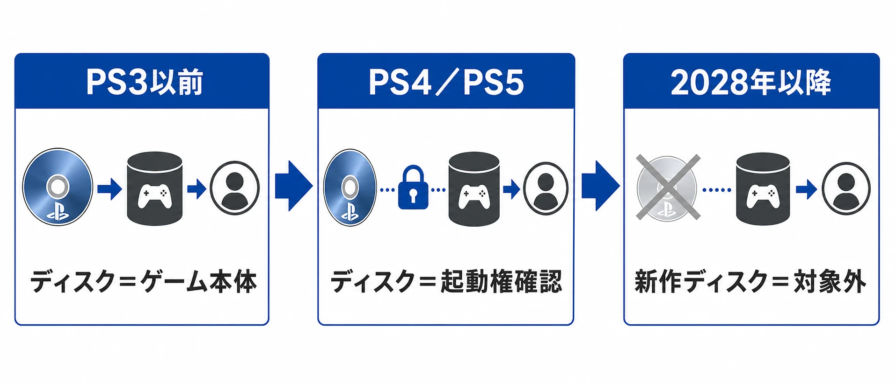
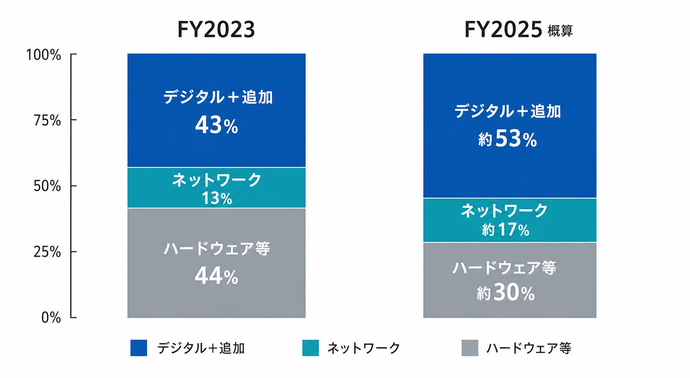
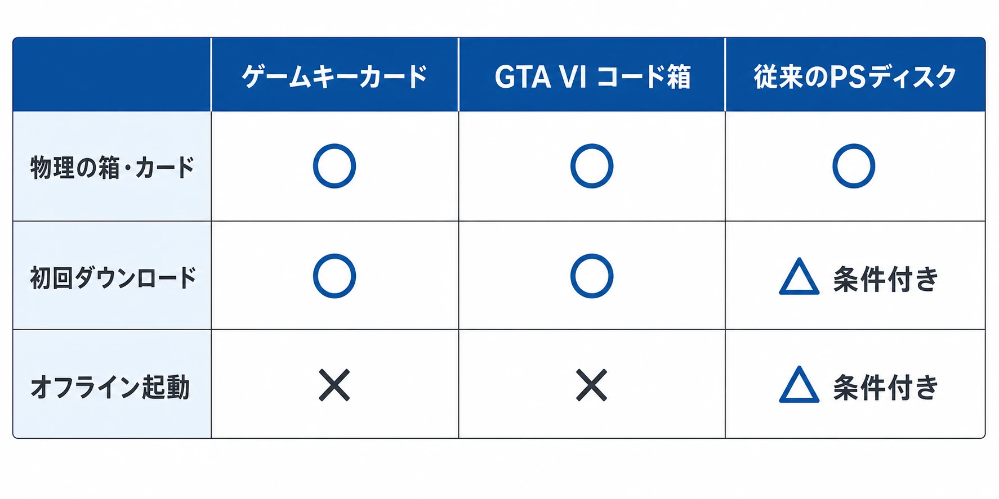

# PlayStation物理ディスク版生産終了が示すゲーム業界の構造転換

> ⚠️ 本稿は2026年7月10日時点で公開されている情報をもとに構成しています。SIEの方針や各社の販売形態、今後の発表によって内容が変更される可能性があります。

ソニー・インタラクティブエンタテインメント（SIE）は2026年7月1日、PlayStationコンソール向けに発売される新作ゲームについて、2028年1月以降、ディスク版の生産を終了すると発表した。対象となる新作は、PlayStation Storeと販売店のどちらでもダウンロード版として提供される。すでに発売されたタイトルや、2028年1月より前にディスク版として発売されるタイトルには影響しない[[1](#ref-1)]。

これは「ゲームから物理媒体が消える」という単純な話ではない。PS4、PS5世代ですでに進んでいた、ゲームの本体をディスクから本体ストレージとネットワークへ移す流れを、プラットフォーマーが流通方針として明文化した出来事である。変わるのは、製造工程だけではない。小売の役割、中古市場、ゲーム保存、作品の見つけられ方、そして発売直前の開発判断まで変わり得る。

本稿の焦点は、物理メディアが良いか悪いかを決めることではない。SIEの発表を、ゲームが「商品」から「継続的に配信されるサービス」へ移る構造の一部として読み、ゲームプランナーの実務に何が残り、何が新しい負担になるのかを整理することである。

***

## まず発表の範囲を正確に読む

SIEの公式発表は、2028年1月以降にPlayStationコンソール向けに発売される **すべての新作ゲーム** について、ディスク版の生産を終了するという内容である。以後の新作は、PlayStation Storeで販売されるダウンロード版に加え、販売店でもダウンロード版として扱われる。販売店から購入する場合、コードを同梱したパッケージなどが想定されるが、公式発表はその具体的な商品仕様までは定めていない[[1](#ref-1)]。

ここで三つの範囲を分ける必要がある。

- すでに発売済みのディスク版タイトルは対象外である。
- 2028年1月より前にディスク版として発売されるタイトルも対象外である。
- 発表文だけから、既存タイトルの再生産、将来の本体にディスクドライブがあるか、PlayStation以外のプラットフォームまで同じ方針になるかを断定することはできない。

したがって、2028年1月は既存の物理市場が一夜にして消える日ではない。新作の標準的な流通手段が、PlayStationではディスクからデジタルへ切り替わる境界である。

***

## ディスクは「ゲーム本体」から「起動権の確認」に近づいていた

### PS4とPS5ではインストールが前提になった

PS4の公式FAQは、ディスク版ゲームも本体ハードディスクへキャッシュする必要があり、プレイ時にはディスクを挿入しておく必要があると説明している[[2](#ref-2)]。PS5のサポート情報も、ディスクを挿入するとゲームデータが本体ストレージへインストールされ、遊ぶたびにディスクを入れておく必要があるとしている[[3](#ref-3)]。

この方式では、ディスクは重要ではあるが、毎回ゲームデータを読み出す主役ではない。大まかにいえば、次の三つの役割に分かれる。

1. 初回インストールに使うデータの入れ物
2. パッケージを購入したことを示す物理的な媒体
3. 起動時に、そのタイトルを利用する権利を確認するための鍵

「ディスクは単なるライセンス確認だ」と言い切るのは正確ではない。ディスクには発売時点のゲームデータが収録され、ネットワークがなくても一定範囲で動くタイトルもある。しかし、PS4とPS5では、本体ストレージにインストールされたデータと、オンラインで取得する更新データの組み合わせが実際のプレイ環境になる。その結果、ディスクの役割は、過去の世代よりもライセンス確認に近づいたのである。

### ディスクの内容は「発売時点のスナップショット」である

PlayStationはPS5とPS4でゲームやアプリを更新する機能を提供しており、更新可能な場合は最新バージョンを取得するよう案内している[[4](#ref-4)]。発売後に不具合修正、バランス調整、アクセシビリティ改善、追加コンテンツ、オンラインサービスとの接続仕様が加われば、ディスクに収録されたデータは製品の一時点を切り取ったスナップショットになる。

これは、ディスク版に価値がないという意味ではない。オフラインで動く範囲、発売時の仕様、所有や貸し借りの感覚、将来の再現可能性は、物理媒体が提供してきた価値である。一方、発売日にプレイヤーが触れる体験を、製造時点のマスターだけで固定することが難しくなった。ディスクを作った後にも、開発チームは修正を続け、発売日に配信する更新データを準備する。

この構造では、物理版は「完成品をそのまま渡す器」ではなく、「ある時点の基準データと購入導線を持つ器」になりやすい。SIEの今回の判断は、その役割をさらにデジタル側へ寄せるものである。

*図：ディスクの役割が、ゲーム本体の格納庫から起動権確認へ移り、2028年以降のPlayStation新作では対象外になる流れ。*

***

## ダウンロード専売を支えた二つの市場

### F2Pとライブサービスは販売単位を変えた

F2P（Free to Play、基本無料）は、最初のダウンロードを無料にし、追加コンテンツ、ゲーム内通貨、シーズンパス、サブスクリプションなどで収益化するモデルである。ゲームの価値が、発売日に一枚の媒体を売って終わるのではなく、運営期間中の参加と課金へ移る。

PlayStation StoreはPS3世代から、クリエイターとプレイヤーをつなぐデジタル販売の中心になってきた。SIEは2013年にインディーゲームの専用カテゴリを設け、2014年にはPlayStation 4の発表以降、グローバルに1,000以上のセルフパブリッシャーを認可したと説明している[[5](#ref-5)][[6](#ref-6)]。2020年には、AAA（大規模予算のゲーム）開発の負担が増すなかで、インディーの重要性を高めるPlayStation Indies施策を開始した[[7](#ref-7)]。

F2Pやライブサービスでは、物理ディスクを追加生産しなくても、同じクライアントへ更新、イベント、課金アイテムを継続的に追加できる。ストア上で無料ダウンロードを始めてもらい、プレイヤーの活動を運営へ接続できる点も大きい。物理版を前提にすると、無料の本体、頻繁な更新、地域別の販売、サービス終了時の扱いを一つのパッケージへ収めにくい。

### インディーにとっては「世界へ出す初期費用」の構造が違う

小規模チームにとって、デジタル販売はプレス工場への発注、パッケージ印刷、倉庫、出荷、返品、地域別の在庫を持たずに、複数地域へ同じタイトルを出せる可能性を広げる。もちろん、プラットフォーム審査、ローカライズ、マーケティング、サポートは必要であり、デジタルなら費用が消えるわけではない。それでも、需要を先読みして最低ロットを製造するリスクは下がる。

その代わり、発見性の問題が大きくなる。SIE自身も、2025年のPlayStation Store紹介で、ストアがゲームを見つける場所であり、キュレーション、デモ、フィルター、スクリーンショットやトレーラーなどを通じて次の作品へ出会わせる場だと説明している[[8](#ref-8)]。これは裏返せば、棚に置かれた箱が偶然目に入る導線を、ストアの表示、特集、検索、推薦、外部宣伝で置き換えなければならないということだ。

### SIEの収益も「一回のソフト販売」だけではない

ソニーのCorporate Report 2024は、Game & Network Services（G&NS）部門のFY2023売上構成について、デジタルソフトと追加コンテンツを合わせた比率が約43％、ハードウェアとその他を合わせた比率が約44％、ネットワークサービスが約13％だったことを示している。また、ネットワークサービスと追加コンテンツの成長による継続的な収益が、従来のソフト販売に加わる重要な収益源になったと説明している[[9](#ref-9)]。

この分類は、PlayStationの利用者がすべてF2Pを遊んでいることや、物理ソフトが利益を生まないことを意味しない。物理ソフト、デジタルソフト、追加コンテンツ、ネットワークサービスでは、原価、手数料、発売時期、収益認識が異なるからである。ただし、SIEの事業を支える重心が、媒体を一度売ることだけから、ストア、アカウント、決済、継続利用を含むプラットフォームへ移っていることは読み取れる。

さらにFY2025、すなわち2026年3月期のForm 20-Fでは、G&NSの外部顧客向け売上として、デジタルソフトと追加コンテンツが2兆4,153億500万円、ネットワークサービスが7,631億2,600万円、ハードウェアなどが1兆3,916億2,200万円と記載されている[[10](#ref-10)]。この数字だけでディスク生産終了の因果関係を証明することはできない。しかし、SIEの収益報告が、デジタル、追加コンテンツ、ネットワークを独立した大きな項目として扱っている事実は、今回の方針転換を理解する重要な背景である。

*図：G&NSの売上構成比。FY2025は本文記載の実数を合計に対して比率換算した概算。*

***

## 影響は小売から保存活動まで広がる

### 小売は「商品を並べる場所」から「購入を補助する場所」へ

SIEは2028年1月以降も販売店で新作を提供するとしている。そのため、小売店がただちにPlayStation商品を扱えなくなるわけではない。考えられる形は、ダウンロードコード、コードを同梱した箱、限定グッズとのセット、プリペイドカードなどである。ただし、ディスク版にあった在庫、値引き、中古への流出、棚での展示は同じ形では残らない。

小売と流通にとっては、物理商品の在庫を持つ商売から、コードや周辺商品、予約、店舗特典、イベント、相談や体験の場へ役割を組み替える必要がある。中古販売やレンタルのように、同じ一枚を複数の利用者へ回す仕組みは、アカウントに紐づくダウンロード権では再現しにくい。消費者側から見ると、購入後に売る、貸す、譲る、安く買い戻すという選択肢も狭くなる。

### 店頭の「偶然の発見」が減る

店頭の棚は、目的の商品を買う場所であるだけでなく、知らない作品に出会う場所でもあった。ジャケット、価格、隣に並ぶ作品、店員の推薦、ランキング、予約特典が、作品名を知らない人への広告になる。

デジタルストアにも特集や推薦はあるが、表示はアカウント履歴、地域、セール、広告、ストア内の順位などに左右される。新規IPや中小規模タイトルが発見される可能性は残るものの、企画側は「棚に置けば見つかる」という期待を捨て、発売前のウィッシュリスト獲得、体験版、配信者施策、レビュー、ストアページの検索性、発売後の継続露出を設計する必要がある。

ここには、デジタル化の利点と危険が同居する。地域をまたいで同時に販売できる一方、プラットフォーム上で目立たなければ、世界中のプレイヤーから見えない。流通の障壁が下がるほど、注意を獲得する競争は強くなる。

### コレクター文化と保存活動

物理版には、プレイのためのデータ以外にも、箱、説明書、アート、限定版、店舗特典、サイン、棚に置く行為が含まれている。iam8bitは今回の発表について「非常に失望している」とし、物理ゲームはゲーム保存、所有、消費者の選択にとって重要だという趣旨の声明を出したと報じられている[[11](#ref-11)]。

保存の問題は、単にディスクが長持ちするかどうかではない。保存活動には、発売時のビルド、パッチ、サーバーに依存する機能、認証、周辺機器、権利情報、開発資料を後世へ渡せるかという複数の問題がある。物理版も劣化し得るし、ディスクだけで完全に遊べない作品もある。それでも、公開された媒体が残ることは、研究者やコレクターが対象へアクセスする一つの入口になる。

***

## 著名クリエイターと物理版専門企業の懸念は同じではない

### 小島秀夫氏は、今回の決定より先のストリーミング化を警戒した

小島秀夫氏は、イタリア・ローマの映画祭「Il Cinema in Piazza」でこの話題について語り、物理媒体で育った立場から生産終了を悲しいとしつつ、ゲームは現状では本体ストレージへダウンロードできる点を指摘した。そのうえで、将来ゲームが映画や音楽のようにストリーミング中心になれば、データを自分の機器へ保持せず、事業者側のサーバーから利用することになるという懸念を示したと報じられている[[12](#ref-12)]。

ここで小島氏の主眼を、今回の「ディスク生産終了への反対」だけに縮めるべきではない。氏が区別しているのは、現在のダウンロード型ゲームと、将来の完全ストリーミング型ゲームである。前者には、少なくとも本体ストレージへデータを置く余地がある。後者では、契約、サーバー、政治や事業判断によって、ある作品へのアクセスが止まるリスクが大きくなる。懸念の中心は、所有と保存の主導権が、媒体からサービス提供者へさらに移ることである。

### デビッド・ヘイター氏は、消費者としての拒否を表明した

『メタルギア』シリーズでスネーク役を演じたデビッド・ヘイター氏は、2026年7月6日、ゲーム機と物理ゲームの写真に「No disc, no buy」と投稿し、PlayStation公式アカウントにも言及したと報じられている[[13](#ref-13)]。これは、ストリーミングの将来像を論じた発言ではなく、ディスクがなければ買わないという、物理版を選ぶ消費者としての意思表示である。

同じ「反対」でも、ヘイター氏の主張は、価格、購入形態、所有感、コレクションの選択肢に近い。小島氏の保存・アクセス権の議論、iam8bitの事業と保存理念の議論とは、重なる部分がありながら焦点が異なる。

***

## NintendoとTake-Twoは別の折衷案を示す

### Nintendo Switch 2のゲームキーカード

Nintendo Switch 2には、ゲームカードの形を残しながら、初回プレイ時にゲーム本編をダウンロードする「ゲームキーカード」がある。任天堂の説明では、ゲームキーカードを本体へ差し込み、初回に本編をダウンロードした後も、プレイ時にはカードを差しておく必要がある[[14](#ref-14)]。

これは、データをカードへ収める方式と、ダウンロードコードだけを紙で渡す方式の中間である。店頭性、カードを差す行為、物理的な所有感を残しながら、光学ディスクの容量や製造制約を避ける。一方で、初回ダウンロード、ストレージ容量、サーバーからの再取得、将来のサービス継続に依存する点では、従来の「カードだけで遊べる」商品とは異なる。

### 『グランド・セフト・オートVI』のコード同梱パッケージ

Take-Two Interactiveは、Rockstar Gamesの『グランド・セフト・オートVI』について、物理版の箱にダウンロードコードを入れる方式を発表した。公式資料は、予約版の事前ダウンロードを案内し、物理版も箱の中のコードでダウンロードする形だと記載している[[15](#ref-15)]。

これは、PlayStationの2028年方針より前に、巨大な新作でも「箱はあるがディスクはない」商品が成立し得ることを示す事例である。パッケージは、店頭での存在、贈り物、限定版の外観、物流上の販売単位を残せる。しかし、ゲームデータそのものの供給、更新、利用権はデジタル側にある。

二つの事例から見えるのは、物理とデジタルが完全な二択ではないことだ。カードや箱を残すか、データを物理媒体へ収めるか、購入場所を小売に残すかは別々に設計できる。ただし、SIEの発表は、PlayStationの新作についてその選択肢から「光学ディスク」を外す決定である。

*図：ゲームキーカード、ダウンロードコード同梱箱、従来のPlayStationディスクにおける物理性とダウンロード依存の比較。従来のディスクの挙動はタイトルや環境によって異なるため、表では「条件付き」としている。*

***

## ゲームプランナーの実務はどう変わるか

### 1. 発売直前の調整余地は広がるが、締切が消えるわけではない

ディスク生産では、マスター提出、複製、印刷、出荷、店頭到着までのリードタイムが必要になる。そのため、発売日よりかなり前に、製品版へ収めるビルドを固定しなければならない。ディスク生産がなくなれば、少なくとも物理複製のためのマスター提出締切はなくなり、発売直前まで修正を検討できる余地が広がる。

ただし、デジタル版にも、プラットフォーム審査、レーティング、地域別の販売設定、事前ダウンロード、ストアページの公開、サーバー負荷試験、発売時の更新配信がある。締切が消えるのではなく、締切の種類が変わると考えるべきである。直前修正を許すほど、認証、ローカライズ、トロフィー、セーブ互換、広告素材、サポートFAQ、ローンチイベントとの連携を同時に再確認する必要がある。

プランナーは「最後まで直せる」ことを、無制限に仕様を動かせる権利と解釈してはならない。遅い変更を受け入れるのか、どの品質リスクを許容するのか、発売後更新へ送るのかを、あらかじめ決めた変更管理が必要である。

### 2. 世界同時配信の障壁は下がるが、地域差は残る

物理版では、地域ごとの製造、船便や倉庫、店頭発売日、在庫配分、言語別パッケージを調整する必要がある。デジタル版では、一つの配信基盤から複数地域へ同時に公開しやすくなり、発売日のずれや在庫切れを減らせる。

しかし、レーティング、表現規制、決済、税、年齢確認、個人情報、オンラインサービスの稼働時間、地域別のサポート、言語パックは残る。世界同時配信とは、全地域の条件が同じになることではない。企画初期から、地域別に「同時に出せない理由」を洗い出し、それが製造由来なのか、法務・運営由来なのかを分けることが重要になる。

### 3. 店頭の露出を、ストアとマーケティングで再設計する

ディスクがなくなると、棚の面積を買うことによる露出が弱くなる。新作の成否は、ストアページの公開日、予約やウィッシュリスト、体験版、レビュー解禁、配信者向け素材、発売後の特集、セール設計、コミュニティ運営へ移る。

これは宣伝部門だけの仕事ではない。プランナーも、ストアで最初に表示されるゲームループ、スクリーンショット、短い動画、対応機能、プレイ時間、オンライン要件を設計初期から用意する必要がある。ゲーム内の魅力を、棚の背表紙に代わる短い説明へ翻訳する作業である。

小規模タイトルほど、「良いゲームを作れば見つかる」という前提を置けない。デジタル配信は世界へ出す入口を広げるが、見つけてもらうための費用と作業を消さない。

### 4. 契約と意思決定の論点が、媒体からアクセス権へ移る

社内の企画会議では、最初から「ディスク版を作るか」だけを問うのではなく、次のように商品設計を分解した方がよい。

| 論点 | 確認すべきこと |
|---|---|
| 販売形態 | Store専売か、販売店向けコード同梱箱や限定版を用意するか |
| 発売時点 | どのビルドを発売版とし、どの修正を発売後更新へ送るか |
| 地域展開 | レーティング、言語、価格、税、決済、サポートをいつ揃えるか |
| 発見性 | ストア掲載、体験版、配信者施策、セール、発売後露出を誰が担うか |
| 保存と継続利用 | サーバー停止、再ダウンロード、アカウント、返金、互換性をどう説明するか |
| 物理商品 | コレクター向け商品にデータを入れるのか、コードやグッズだけにするのか |

外部パブリッシャーとの契約では、販売地域、ストアの価格とセール、コードの有効期限、予約特典、返金・キャンセル、追加コンテンツ、サーバー費用、サービス終了後の案内、物理限定版の権利分配などを確認する必要がある。従来の「何枚プレスするか」という相談が、「誰がアクセスを提供し、いつまで何を保証するか」という相談へ置き換わるのである。

***

## これは「物理ゲームの全面終了」ではない

SIEの決定は、PlayStationの新作ディスクを対象にしたものであり、Nintendoのゲームカード、PCのパッケージ、専門パブリッシャーによる限定版、他社プラットフォームまで同時に消すものではない。Nintendo Switch 2のゲームキーカードや、『グランド・セフト・オートVI』のコード同梱パッケージが示すように、業界は物理的な外装とデジタルな本体を組み合わせる方向にも進んでいる。

それでも、PlayStationは大規模な市場であり、そこで新作の光学ディスク生産が終わる意味は大きい。製造費や物流費を削り、更新と世界配信を柔軟にする一方で、小売の偶然の発見、中古・貸し借り、コレクター文化、保存活動の入口を狭める。ユーザーにとっての利便性と、プラットフォーマーにとっての収益性が高まる部分が、同じ方向を向くとは限らない。

ゲームプランナーに必要なのは、物理版かデジタル版かという二択への賛否ではない。どのデータをいつ固定するのか、どの地域へどう届けるのか、どこで作品を見つけてもらうのか、サービス停止後に何が残るのかを、商品設計の初期から分けて考えることである。ディスクの役割が小さくなるほど、ゲームの価値を支えるのは、媒体そのものではなく、配信、発見、運営、保存を含む設計全体になる。

## References

1. [PlayStation®コンソール向け新作ゲームのディスク生産を2028年1月に終了][1] - SIEによる2026年7月1日の公式発表。対象範囲、ダウンロード版のみの提供、既発売・2028年1月前発売タイトルへの影響がないことを示す。

2. [PS4: The Ultimate FAQ][2] - PS4のディスク版ゲームがハードディスクへキャッシュされ、プレイ時にディスクを必要とすることを説明するPlayStation公式FAQ。

3. [PlayStationのディスク版ゲームを遊ぶ方法][3] - PS5とPS4ではディスク版ゲームを本体へインストールし、プレイ時にディスクを挿入しておく必要があることを説明するPlayStation公式サポート。

4. [PS5／PS4でゲームとアプリをアップデートする方法][4] - ゲームやアプリを最新バージョンへ更新するPlayStation公式サポート。

5. [New Indie Games Category Coming to PlayStation Store Today][5] - PlayStation Storeにインディーゲームカテゴリを設けた2013年の公式発表。

6. [PlayStation Still <3s Devs -- 1,000 Self-Publishers][6] - PlayStationがグローバルに1,000以上のセルフパブリッシャーを認可したと説明する2014年の公式記事。

7. [Introducing PlayStation Indies and a day of captivating new games][7] - AAA開発の負担増を背景に、インディーを支援するPlayStation Indiesを開始した公式記事。

8. [Evolving the PlayStation Store Experience][8] - PlayStation Storeを、キュレーション、デモ、フィルターなどで作品を発見する場所として説明するSIE公式記事。

9. [Corporate Report 2024: Game & Network Services][9] - FY2023のG&NS売上構成と、追加コンテンツ・ネットワークサービスの重要性を示すソニー公式資料。

10. [Form 20-F for the fiscal year ended March 31, 2026][10] - FY2025のG&NSにおけるデジタルソフト・追加コンテンツ、ネットワークサービス、ハードウェアなどの売上を示すソニー公式資料。

11. [“Profoundly Disappointed:” Companies Respond To Sony’s Decision To End Disc Support][11] - iam8bitの声明内容を報じ、保存、所有、消費者の選択をめぐる同社の主張を紹介するGameSpot記事。

12. [After Sony announces its sunsetting PlayStation discs, Hideo Kojima shares a warning about physical media][12] - イタリアの映画祭での小島秀夫氏の発言を、翻訳映像をもとに報じたGamesRadar+記事。

13. [Metal Gear Solid Snake actor David Hayter tells Sony “no disc, no buy”][13] - デビッド・ヘイター氏のSNS投稿と、その文脈を報じたGamesRadar+記事。

14. [「キーカード」について][14] - Nintendo Switch 2のゲームキーカードについて、初回ダウンロードとカード挿入の条件を説明する任天堂公式ページ。

15. [Rockstar Games Announces Pre-Orders for Grand Theft Auto VI][15] - 『グランド・セフト・オートVI』の物理版がダウンロードコード同梱になることを記載したTake-Two Interactive公式資料。

[1]: https://blog.ja.playstation.com/2026/07/01/20260701-playstation-physical-disc-production-announcement-o/
[2]: https://blog.playstation.com/2013/10/30/ps4-the-ultimate-faq-north-america/comment-page-4/
[3]: https://www.playstation.com/en-gb/support/hardware/disc-game-install/
[4]: https://www.playstation.com/en-us/support/hardware/playstation-system-software-application-version/
[5]: https://blog.playstation.com/?p=105479
[6]: https://blog.playstation.com/?p=127139
[7]: https://blog.playstation.com/2020/07/01/introducing-playstation-indies-and-a-morning-of-captivating-new-games/
[8]: https://sonyinteractive.com/en/news/blog/evolving-the-playstation-store-experience/
[9]: https://www.sony.com/en/SonyInfo/IR/library/corporatereport/CorporateReport2024/read/
[10]: https://www.sony.com/en/SonyInfo/IR/library/FY2025_20F_PDF.pdf
[11]: https://www.gamespot.com/articles/profoundly-disappointed-is-this-companys-response-to-sonys-decision-to-end-disc-support/
[12]: https://www.gamesradar.com/entertainment/streaming-services/after-sony-announces-its-sunsetting-playstation-discs-hideo-kojima-shares-a-warning-about-physical-media-what-is-happening-to-video-games-in-2028-might-also-happen-to-movies/
[13]: https://www.gamesradar.com/games/metal-gear/metal-gear-solid-snake-actor-david-hayter-tells-sony-no-disc-no-buy-amid-controversial-decision-to-axe-physical-discs-for-new-playstation-games-in-2028/
[14]: https://www.nintendo.com/jp/games/switch2/key-card/index.html
[15]: https://ir.take2games.com/node/32311/pdf

----

この文書は、Perplexity、Claude、OpenAI Codex の3つのAIの支援を受けて著述されたものです。引用画像を除き、MIT License にて提供されています。
