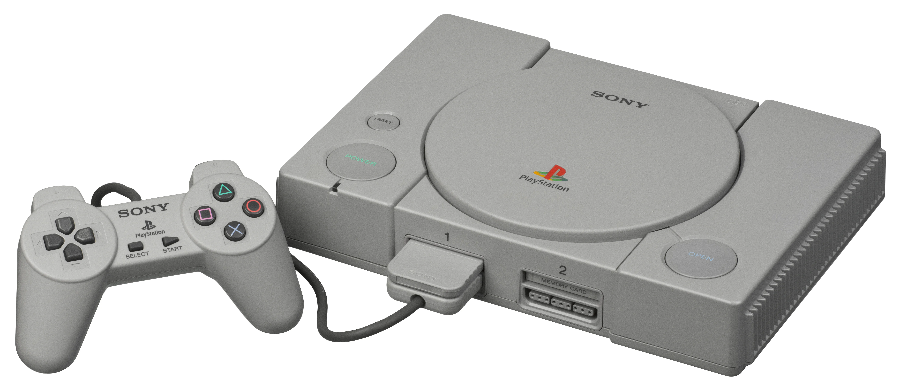
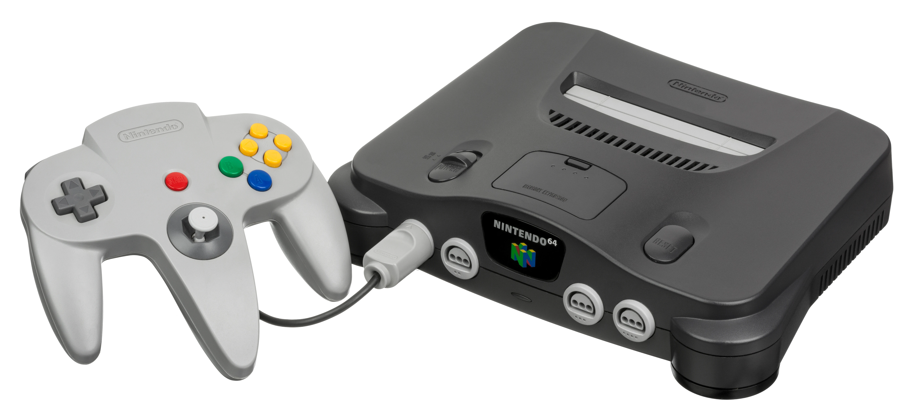

# プレイステーション、セガサターン、NINTENDO64――次世代32/64ビット機戦争を市場から読む

1990年代半ばの家庭用ゲーム機競争は、単に「32ビット対64ビット」の性能比べではなかった。プレイステーション、セガサターン、NINTENDO64は、同じ3D化の波に向き合いながら、媒体、開発者との関係、小売への届け方、強いジャンルを異なる形で選んだ。勝敗を決めたのはピーク性能の数字ではなく、どのゲームを、どの時期に、どの価格と供給条件で市場へ出せるかというプラットフォーム運営である。

本稿では、セガサターンの北米早期投入、デュアルCPU構成、Electronic Artsとの関係そのものは既存のセガ史に譲り、三機種を同じ市場図の上に置く。日本と欧米では、同じ設計判断が異なる強みと弱みになった。

***

## 三機種が共有した転換点

前世代までの主流だったROMカートリッジは、読み込みが速く、機器側の構成を単純にしやすい。一方、CD-ROMは大容量の音声・映像を扱え、量産コストを抑えやすい。後者は、ムービーや音声を使う表現だけでなく、在庫を読み違えたパブリッシャーが追加生産を決める時の金額と時間にも影響した。1990年代半ばの資料でも、CD-ROM作品は価格帯の下側に、ROMを使うスーパーファミコンとNINTENDO64の作品は上側に置かれやすかったと整理されている。[[1](#ref-1)]

同時に、ゲームは2Dの画面単位の設計から、ポリゴンで構成した空間をカメラと入力で歩かせる設計へ移った。ただし、3Dは自動的な優位ではない。カメラ、入力、衝突、アニメーション、レベルの見せ方を同時に作り替える必要がある。例えば任天堂は『スーパーマリオ64』を、従来の横スクロール2Dから3D空間へ進んだ作品として位置付けている。[[2](#ref-2)]

| 機種 | 発売と媒体 | 設計上の要点 | 市場戦略としての含意 |
| --- | --- | --- | --- |
| セガサターン | 1994年11月22日、日本。CD-ROM | SH-2を2基搭載し、2D表現とポリゴン表現を広く扱う構成 | アーケード由来の作品を速く家庭へ持ち込めることが初期の武器になった。[[3](#ref-3)] |
| プレイステーション | 1994年12月、日本。CD-ROM | 32ビットCPUと3Dグラフィックス、CDベースのソフト | 3D表現とCDを、幅広い開発会社の作品群へつなぐ土台とした。[[4](#ref-4)] |
| NINTENDO64 | 1996年6月23日、日本。カートリッジ | カスタム64ビットRISC CPUとRCP、3Dスティック | 読み込みを抑えた3D操作と、任天堂自身の作品で体験価値を明確にする設計であった。[[5](#ref-5)] |

「CDかカートリッジか」は映像量だけの選択ではない。前者はソフトの供給回転と在庫リスク、後者は読み込みの短さと物理メディアを前提にした設計を左右する。企画者は機種の性能表と並べて、メディア当たりの原価、発注締切、追加生産のリードタイム、必要な容量、ロードを隠せるゲーム構造を一枚に置くべきである。

### 競争が見えた年表

| 年月 | 出来事 | 市場への意味 |
| --- | --- | --- |
| 1994年11月 | セガサターン発売 | 先行投入と『バーチャファイター』が、次世代機の初速を作った。 |
| 1994年12月 | プレイステーション発売 | CDと3Dを軸にした新規プラットフォームが、日本の競争へ入った。 |
| 1995年5月 | 北米E3でセガサターンを早期発売、ソニーが299ドルを提示 | 小売準備と価格が、発表会の演出ではなく流通上の約束であることを示した。[[6](#ref-6)][[10](#ref-10)] |
| 1996年6月 | NINTENDO64発売 | 任天堂は後発で3D操作の基準を示したが、媒体とソフト供給の条件も比較対象になった。 |
| 1996年 | Squareが次の『ファイナルファンタジー』を非任天堂機で出す方針を表明 | 有力ソフトの選択が、ハードの将来性についての市場シグナルになった。[[1](#ref-1)] |
| 1997年 | 『ファイナルファンタジーVII』がプレイステーションで発売 | 大型RPGがCD基盤のプラットフォームに集まる認識を強めた。[[7](#ref-7)] |

***

## 日本市場：第三者の選択肢を増やした競争

### 先行したセガサターンと、ほぼ同時に始まった二強競争

セガサターンはプレイステーションより11日早く日本で発売された。セガの公式史料によれば、サターンは1994年中に50万台、約半年で国内100万台を出荷し、『バーチャファイター2』とMODEL2基板由来の移植群が牽引した。[[8](#ref-8)] 一方で、両機は1995年中に累計200万台、1996年8月には350万台を超える水準まで拡大したという当時の研究もある。[[1](#ref-1)]

この局面を「先に出した方が勝つ」と読むのは不十分である。初期購入者に本体を売るだけでは、次のソフトを作る会社の期待値は固まらない。発売日、看板ソフト、次四半期の発売予定、店頭の在庫が同時に見えて初めて、プラットフォームは継続的な投資先になる。セガサターンの先行は重要だったが、プレイステーションが短期間で選択肢を広げたため、先行の利益だけで固定化は起きなかった。

| セガサターン | 初代プレイステーション（SCPH-1000） |
| --- | --- |
|  |  |

*画像出典：Evan-Amos, [Sega-Saturn-Console-NA-Mk-I-FL.jpg](https://commons.wikimedia.org/wiki/File:Sega-Saturn-Console-NA-Mk-I-FL.jpg), Wikimedia Commons, Public Domain ／ 北米初期型セガサターン本体。WebP変換。*

*画像出典：Evan-Amos, [PlayStation-SCPH-1000-with-Controller.jpg](https://commons.wikimedia.org/wiki/File:PlayStation-SCPH-1000-with-Controller.jpg), Wikimedia Commons, Public Domain ／ 日本向け初代プレイステーションSCPH-1000とコントローラ。WebP変換。*

### サードパーティを「作品」ではなく供給網として扱う

この世代の日本市場は、サードパーティがどの機種に集中するかを決める草刈り場であった。1996年時点の集計では、ソフト会社との契約数はセガサターン350社、プレイステーション500社とされる。[[1](#ref-1)] 数字の定義や集計時点は慎重に読むべきだが、重要なのはプレイステーションが小規模・中規模の会社を含む多様な供給者を取り込もうとした点である。

ソニー・コンピュータエンタテインメントは、品揃えを広くする方針を掲げ、当時の担当者も小規模・中規模のソフト会社を支援する考えを説明していた。[[1](#ref-1)] ここでいう開発環境はSDKだけを指さない。開発機材への到達性、技術支援、発売承認、製造、ロイヤリティ、販売チャネルまでを含む、一本の商取引の流れである。個別のロイヤリティ率や交渉内容は公表資料から一般化できない。しかし、ハード会社が「有力作だけを獲得する」のではなく、「次の有力作が生まれる会社の参入障壁を下げる」ことは、供給の厚みを作る戦略になる。

### 『ファイナルファンタジーVII』が発したシグナル

『ファイナルファンタジーVII』をめぐる出来事は、特定の人物の決断劇として消費するより、プラットフォーム選定の評価軸が可視化された事件として読むべきである。当時の研究は、Squareが「必要なゲーム開発環境」を提供する機種としてプレイステーションを選んだという同社サイト上の声明を引用している。[[1](#ref-1)] Square Enixの公式情報も、オリジナル版が1997年にPlayStationで発売されたことを確認している。[[7](#ref-7)]

この移行が市場へ与えた影響は、一本のヒット作の販売本数だけではない。大型RPGを作る会社にとって、容量、量産費、映像表現、開発支援、見込めるユーザーベースをまとめて評価する必要があることを、競合各社と小売に示した点にある。つまりこれは「RPGが一作移った」出来事ではなく、次の大型企画がどこへ集まるかについての予想を変えた。もっとも、プレイステーションの優位をこの一作だけで説明するのも誤りである。前後には多数のソフト会社、店頭、雑誌、価格改定、海外展開があり、移籍はその連鎖を加速した象徴であった。

### アーケードの強みとNINTENDO64の制約

セガには、アーケード基板と家庭用の距離を縮める資産があった。公式史料が挙げる『デイトナUSA』『セガラリー・チャンピオンシップ』『電脳戦機バーチャロン』などは、「店で見た新しい体験を家で遊ぶ」という購入理由を具体化した。[[8](#ref-8)] これは単なる移植の速さではなく、アーケードで認知を作り、家庭用で長く遊んでもらう二段階の導線である。

NINTENDO64は発売が後になり、カートリッジを選んだことでCD機とは異なる制約を抱えた。カートリッジは容量と単価、追加生産の条件で大型RPGや多量の映像・音声を使う企画に慎重な判断を求める。実際、Electronic Artsの1997年の年次報告書は、NINTENDO64用カートリッジを任天堂に製造委託し、供給量と納期を自社で十分に制御できないこと、発注に保証や預託が必要な地域があることをリスクとして記している。[[9](#ref-9)]

これはCICチップなどの保護技術の優劣ではなく、供給の事業条件の問題である。NINTENDO64は『スーパーマリオ64』のように、3D空間を操作する基準を作る作品を持った。しかし日本では、CD機の豊富なRPG、アドベンチャー、対戦・移植作と並んだとき、サードパーティの企画ポートフォリオを受け止める器としては不利になりやすかった。

### 店頭と専門誌は、発売前の市場を作る

日本では玩具店を中心に築かれた流通網が、機種の物理的な入手性を左右した。セガはサターン導入時に独自の小売網や卸への出資で既存の玩具流通への依存を下げようとした。[[1](#ref-1)] 一方、専門誌は発売予定、画面写真、攻略、読者投稿を定期的に届け、購入前の比較と発売後の話題をつなぐ情報面の接点になった。

この二つを混同してはならない。小売は「今日買えるか」を、専門誌は「次に欲しくなるか」を扱う。現代なら前者は在庫表示・配送・ストア露出、後者は動画、SNS、コミュニティに置き換わる。企画側は販売本数の予測だけでなく、発売前に何を見せ、発売日にどこで受け取れ、発売後にどう話題が継続するかを別々に設計する必要がある。

***

## 欧米市場：価格、小売、パブリッシャーが増幅器になった

### 北米のE3は「発表」ではなく取引条件の提示だった

北米では、セガサターンのサプライズ早期発売が市場の入口を狭めた。1995年5月のE3でセガは限られた小売へ出荷を始めたが、事前に準備できなかった小売、報道、ソフト会社を残した。発売日を早めることは、店頭在庫、デモ、広告、ソフト供給も早められる場合にだけ利点になる。

同じE3で、Sony Computer Entertainment AmericaのSteve Raceが示した「299ドル」は、セガサターンの399ドルとの差額を一語で伝える価格戦略であった。後年の当事者による振り返りでも、この価格演出がセガの早期発売との対比を強く印象づける場面として語られている。[[10](#ref-10)] 北米と欧州でプレイステーションが1995年9月に発売されたという公式年表も、この演出が実際の市場投入計画と結び付いていたことを示す。[[11](#ref-11)]

価格だけを模倣しても再現はできない。100ドルの差は、ソフトをもう一本買えるか、周辺機器を後回しにできるか、親が購入を許可するかという購入判断へ変換される。一方で、安い本体が供給不足や薄いソフトラインナップを補うわけでもない。価格は、準備済みの供給網を増幅するレバーである。

### NINTENDO64は北米で存在感を保ち、RPGの空白を抱えた

NINTENDO64を世界全体の敗者として見るのも誤りである。任天堂の地域別累計出荷は、日本554万台、米州2,063万台、その他675万台であり、北米での比重が大きかった。[[12](#ref-12)] 家族・友人が同じ画面を囲むパーティーゲームや、プラットフォーマー、任天堂のファーストパーティ作品は、3Dスティックと4人用コントローラ端子を含む体験設計とよく結び付いた。

反面、CD機へ大型RPGが集まる流れの中で、NINTENDO64はそのジャンルの継続供給で弱くなった。カートリッジが原因のすべてではないが、容量、製造委託、在庫リスクの組み合わせは、長いテキスト、多数のムービー、複数地域への同時展開を含む企画ほど重くなる。RPG不足を「任天堂がRPGを嫌った」といった単純な物語にせず、各パブリッシャーが自社の採算と表現に合う媒体を選んだ結果として捉えるべきである。

*画像出典：Evan-Amos, [Nintendo-64-wController-L.jpg](https://commons.wikimedia.org/wiki/File:Nintendo-64-wController-L.jpg), Wikimedia Commons, Public Domain ／ NINTENDO64本体とコントローラ。WebP変換。*

### ジャンルはハード性能より、顧客と供給の交点で決まる

欧米のプレイステーションは、シューティング、スポーツ、レーシングを含む幅広いライブラリを小売の棚へ載せ、若年層から成人層まで異なる購入理由を作った。これは「プレイステーションならそのジャンルが必ず売れる」という意味ではない。複数のパブリッシャーが毎シーズン作品を投入でき、店頭で本体と一緒に比較できたことが重要である。

対してNINTENDO64は、プラットフォーマーとパーティー性の高い同室プレイで、代替しにくい強みを持った。ここから得られる実務上の教訓は、ジャンルごとに「性能が足りるか」だけを聞かないことである。誰が買うのか、誰と遊ぶのか、短いデモで魅力が伝わるか、同じ季節に競合が何本あるか、続編を何年維持できるかまでを評価しなければ、ジャンル適合は判断できない。

### 小売と大手パブリッシャーは、供給計画の共同設計者である

欧米では大手小売への配荷と、Electronic Artsのような大手パブリッシャーの対応がプラットフォームの勢いを左右した。サターンの早期発売が示したのは、ハード会社が小売を後から説得するのでは遅いという点である。初回出荷の配分は、棚、広告、返品、次回発注の判断まで含んだ関係の結果になる。

また、EAの年次報告書はNINTENDO64のカートリッジ供給を自社だけで制御できないリスクとして明記している。[[9](#ref-9)] 大手パブリッシャーにとって、これは一作品の採算だけでなく、年末商戦へ何本を並べ、どの地域へいつ出すかというポートフォリオの問題である。欧米でプレイステーションが伸びた理由を、広告の巧拙だけに還元しては見誤る。小売の準備、価格、媒体、パブリッシャーの発売計画が相互に補強したからこそ、広いジャンルの棚が成立した。

***

## 勝敗ではなく、地域別の市場適合として振り返る

最終的にプレイステーションは世界累計で1億240万台超に達し、NINTENDO64の3,293万台を大きく上回った。[[13](#ref-13)][[14](#ref-14)] ただし、この差を「64ビットでなかったから」や「CDだったから」だけで説明することはできない。日本では、セガサターンのアーケード資産と濃いユーザー層、プレイステーションの多様なソフト供給、NINTENDO64のファーストパーティ中心の強みが併存した。欧米では、プレイステーションが価格と小売・パブリッシャー網を増幅させ、NINTENDO64は北米で強い足場を保ち、セガサターンは同じ形の規模を作れなかった。

この世代を現在の企画へ翻訳するなら、媒体はダウンロード、サブスクリプション、ストリーミングへ変わっても、判断の骨格は残る。プラットフォームを選ぶときは、次の問いを同時に持つべきである。

- この表現と更新頻度に、配信容量と製造・配信の条件は合っているか。
- 開発支援、審査、収益分配、ストア露出を含む参入コストを、チーム規模に対して説明できるか。
- 地域ごとに、購入者、小売またはストア、強いパブリッシャー、競合ジャンルはどう違うか。
- 一本の大型作品が動いたとき、それを原因ではなく、供給者が何を評価したシグナルとして読むか。

ハード戦争の本質は、最も高い仕様を選ぶことではない。作り手、売り手、遊び手が次の一本にも参加したくなる循環を、地域ごとにどう設計するかである。

## References

1. [The Home Video-Game Industry (1983–1996)][1] - 当時の日本市場における媒体価格、ソフト会社との契約、Squareのプラットフォーム選定声明、流通を分析した経営研究資料。

2. [スーパーマリオ64（Wii U）｜任天堂][2] - 1996年のNINTENDO64用『スーパーマリオ64』を、2Dの横スクロールから3D空間へ進んだ作品として説明する公式ページ。

3. [セガサターン｜セガ][3] - セガサターンの日本発売日、価格、SH-2を2基搭載した構成、ST-Vとの関係を示す公式史料。

4. [The History of Sony Interactive Entertainment][4] - 初代プレイステーションをCDベースと3Dグラフィックスのハードウェアとして位置付ける公式沿革。

5. [NINTENDO64 ハードウェア紹介][5] - NINTENDO64のカスタム64ビットRISC CPU、RCP、3Dスティックを示す任天堂の当時の公式資料。

6. [Sega makes surprise game move][6] - 1995年E3における北米セガサターン早期投入と、ソニーの契約先・発売計画を伝えた当時の業界記事。

7. [ファイナルファンタジーVII｜SQUARE ENIX][7] - 『ファイナルファンタジーVII』のオリジナル版に関する公式製品情報。

8. [家庭用ゲーム機新時代の幕開け『セガサターン』｜セガ][8] - 国内初速と、アーケード基板MODEL2からの移植群が果たした役割を振り返るセガの公式記事。

9. [Electronic Arts 1997 Form 10-K][9] - NINTENDO64カートリッジの製造委託、供給・納期・発注条件を事業リスクとして記載したEAの年次報告書。

10. [Flashback: Reliving The Drama Of E3 1995, When Sega Took On Sony And Lost][10] - E3 1995の北米セガサターン早期発売と299ドル提示について、当事者発言を含めて振り返る記事。

11. [Sony Interactive Entertainment Timeline][11] - プレイステーションの日本、北米、欧州における発売時期と世界出荷の推移を示す公式年表。

12. [Consolidated Sales Transition by Region][12] - NINTENDO64の日本、米州、その他地域別の累計出荷を示す任天堂のIR資料。

13. [Sony Interactive Entertainment Business Data & Sales][13] - 初代プレイステーションの世界累計ハードウェア出荷を示す公式データ。

14. [Dedicated Video Game Sales Units][14] - NINTENDO64の世界累計ハードウェア・ソフトウェア販売を示す任天堂のIRデータ。

[1]: https://www.gbrc.jp/content/old/PDF/GameCase.PDF
[2]: https://www.nintendo.co.jp/titles/20010000013027
[3]: https://www.sega.jp/history/hard/segasaturn/
[4]: https://sonyinteractive.com/en/our-company/company-history/
[5]: https://www.nintendo.co.jp/n01/n64/hardware/index.html
[6]: https://strategyonline.ca/1995/05/15/10560-19950515/
[7]: https://www.jp.square-enix.com/game/detail/ff7/
[8]: https://www.sega.jp/history/hard/column/column_05.html
[9]: https://companiesmarketcap.com/electronic-arts/sec-reports-10k/0001012870-97-001195/
[10]: https://www.timeextension.com/features/flashback-reliving-the-drama-of-e3-1995-when-sega-took-on-sony-and-lost
[11]: https://sonyinteractive.com/en/our-company/expanded-company-timeline/
[12]: https://www.nintendo.co.jp/ir/library/historical_data/pdf/consolidated_sales_e1606.pdf
[13]: https://sonyinteractive.com/en/our-company/business-data-sales/
[14]: https://www.nintendo.co.jp/ir/en/finance/hard_soft/index.html

----

この文書は、Perplexity、Claude、OpenAI Codex の3つのAIの支援を受けて著述されたものです。引用画像を除き、MIT License にて提供されています。
