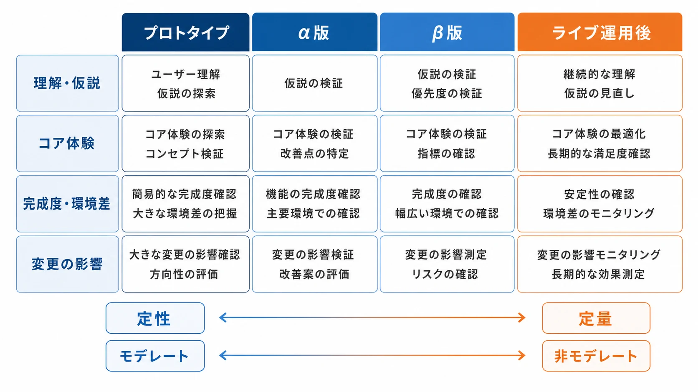
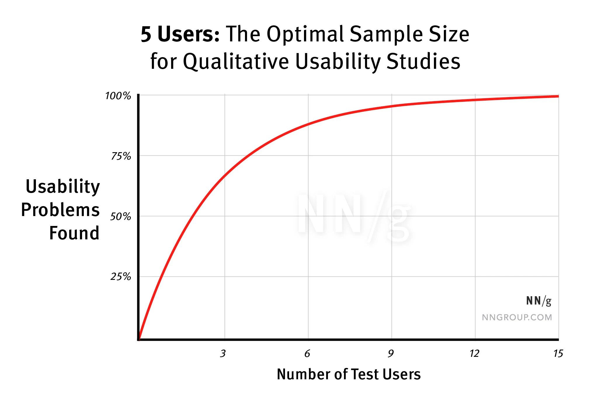
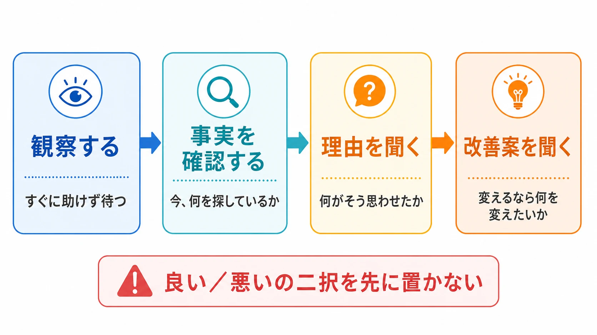
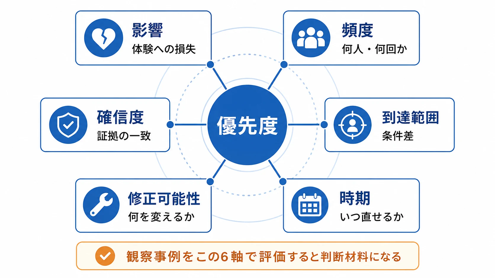
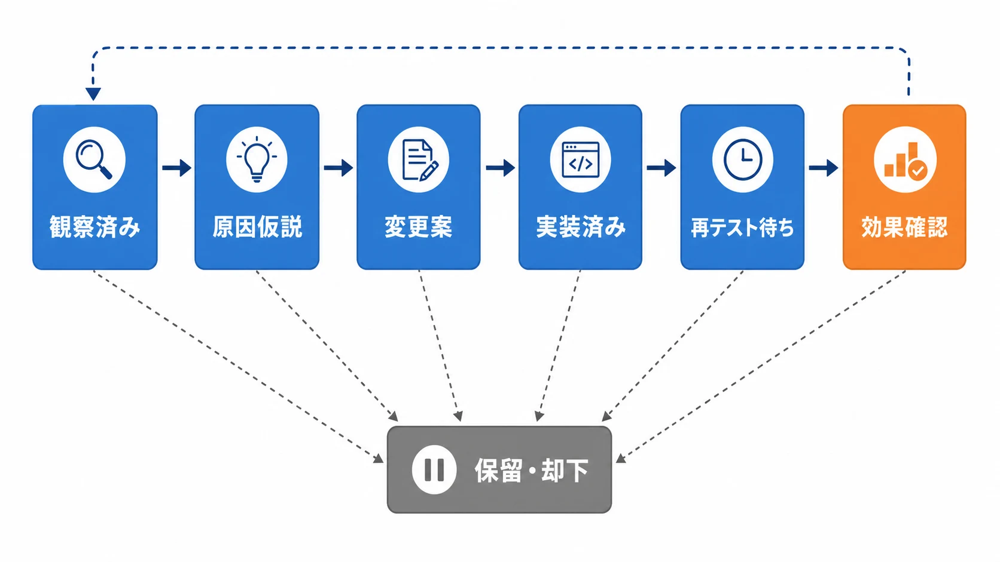

# プレイテストの設計・運用方法論
#### ――ゲーム企画者が知っておくべき目的・人・形式・測定の決め方

ゲームを作っていると、企画会議で「一度プレイテストをしよう」という話が出る。しかし、プレイテストは「何人かに遊んでもらい、感想を集める」だけの作業ではない。何を確かめたいのかが曖昧なまま参加者を集めると、強い意見や目立つバグだけが残り、企画の判断に使える証拠にならない。

本稿でいうプレイテストは、実際のプレイヤー、または想定プレイヤーにゲームやプロトタイプを触ってもらい、設計上の問いに答えるための調査である。品質保証（QA）が「仕様どおり動くか」「再現可能な不具合か」を確かめるのに対し、プレイテストは「プレイヤーが何を理解し、どこで迷い、何を期待し、どの体験を得たか」を確かめる。両者は重なる場面があるが、目的と成果物は別である。

GOV.UKのユーザーリサーチ指針でも、調査の各ラウンドには、次に取る行動を決められる程度に具体的な目的を置くことが求められている。[[1](#ref-1)] ゲーム企画者にとっての要点は、テストを開催することではなく、判断に必要な不確実性を減らすことだ。

## 1. 最初に決めるのはテスト形式ではなく「問い」である

プレイテストを設計するとき、いきなり「対面で5人に遊んでもらう」「オンラインアンケートを100人に配る」と決めてはいけない。最初に次の一文を作る。

> 私たちは、誰が、どの状況で、何を達成できるか、または何をどう感じるかを知り、その結果によって何を変更するのか。

たとえば「チュートリアルを評価する」では広すぎる。次のように分解すると、方法を選べる。

- 初回プレイヤーは、戦闘開始までに移動・攻撃・回避の役割を理解できるか
- プレイヤーは、報酬を受け取った後に次の目標を自力で見つけられるか
- 新しい難易度設定は、離脱を減らしながら熟練者の物足りなさを増やしていないか
- ライブサービスの新イベントは、既存ユーザーが報酬条件を誤解せずに参加できるか

このとき、問いを「面白いか」のような総合評価だけにしないことが重要である。「面白いか」は結果であって、修正箇所を直接示さない。理解、発見、操作、難易度、動機、継続意向など、企画が変更できる単位に置き換える。

***

## 2. 開発フェーズごとに、確かめる対象は変わる

プレイテストは、同じ手順を開発期間中に繰り返すものではない。プロトタイプ、α版・β版、ライブ運用後では、リスクの種類が違うからである。GOV.UKの指針でも、調査方法は知りたいことと開発フェーズに応じて選ぶものと整理されている。[[2](#ref-2)]

| フェーズ | 主な問い | 向く形式 | 主な成果物 |
|---|---|---|---|
| プロトタイプ・企画初期 | 価値提案、ルール、操作の仮説が伝わるか | モデレート型、短時間の1対1、紙・動画・簡易ビルド | 誤解のパターン、成立しない前提、次の試作条件 |
| α版・コア体験形成期 | 初見で遊び方が分かるか、コアループが成立するか | モデレート型を中心に、少人数の反復 | 体験上の障壁、改善仮説、優先度 |
| β版・発売前 | 初回導線、難易度、機種・環境差、長時間利用時の問題がないか | 非モデレート型、アンケート、テレメトリー、必要箇所のモデレート型 | 完了率、離脱箇所、再現条件、セグメント差 |
| ライブ運用後 | アップデートが既存体験を壊していないか、変更が行動や継続に影響したか | 既存ユーザーパネル、リモート調査、テレメトリー、実験 | 変更前後の比較、問題の原因仮説、次の改善案 |

プロトタイプで「D1リテンション」を測っても、コンテンツや運用が未完成であるため判断できない。一方、ライブ運用後に「プレイヤーがどこで迷ったか」だけを1対1で見ると、全体に起きている問題か、少数の事例かを判別しにくい。フェーズに応じて、測るべきものの粒度を変える必要がある。

Ubisoftの『Far Cry 3』に関するGDC講演でも、プレイヤーを早期から開発に参加させることと、タイトな開発スケジュールに調査を組み込むことが課題として扱われている。[[3](#ref-3)] 重要なのは、発売前に一度だけ大規模な評価を行うことではなく、変更可能な時期に小さく調査し、次の版で確かめる反復である。

*図：開発フェーズが進むにつれて、プレイテストの焦点と定性・定量の比重は変わる。ただし、両方を組み合わせる余地は各フェーズに残る。*

***

## 3. テスターは「人数」より先に「条件」を定義する

### 3-1. ターゲット属性は人口統計だけで作らない

「20代男性」「ゲーム好き」といった属性だけでは、プレイテストの参加条件として弱い。ゲームの問いに関係する行動と経験を定義する必要がある。

- プレイ頻度、直近のプレイ時期、1回あたりのプレイ時間
- 対象ジャンルや近いゲームの経験、熟練度
- 使用機種、入力デバイス、画面サイズ、通信環境
- ソロ・協力・対戦の遊び方
- 新規ユーザーか、既存ユーザーか、休眠復帰ユーザーか
- アクセシビリティ機能や入力補助を利用しているか
- テスト対象の機能を既に知っているか

GOV.UKのリクルーティング指針も、実際の利用者または将来の利用者を対象にし、年齢や性別だけでなく、経験、利用状況、障害や支援技術の利用などを条件に含めるよう求めている。[[4](#ref-4)] ゲームでも同じであり、ターゲットの代表性は「属性が市場平均に近いか」だけでなく、「今回の問いに関係する経験を持っているか」で決まる。

ただし、対象条件を細かくしすぎると、テスターが集まらず、結果的に同じ人を何度も呼ぶことになる。最初に必須条件、望ましい条件、除外条件を分けるとよい。

### 3-2. 集め方には、それぞれ得意な範囲がある

**社内テスター** は、ビルドの起動、デバッグ機能、特定操作の確認、仕様の意図と実装の差を素早く見つけるのに向く。しかし、開発者はUIの意味や正しい操作を知りすぎている。初見プレイヤーの理解や自然な迷いを測る主サンプルにはしにくい。

**既存ユーザーパネル** は、ライブ運用中のタイトルで再招集しやすく、継続利用、休眠復帰、アップデート反応を追いやすい。一方で、頻繁に参加する人ほど調査慣れし、ゲームへの関与も強くなる。パネル参加歴、直近の参加回数、プレイ時間を記録し、同じ人への依存を避けるべきである。

**外部リクルーティング会社** は、地域、年齢、経験、利用環境などの条件が細かい場合や、短い期間で必要人数を集めたい場合に向く。その代わり、募集条件を曖昧に渡すと、会社側の一般的な「ゲーマー」定義でスクリーナーが作られる。GOV.UKは、外部の募集会社には具体的な条件を伝えたリクルート仕様書を渡し、密に連携して要件を満たしてもらうよう勧めている。[[4](#ref-4)]

EAの公式プレイテスト案内は、1対1、グループ、複数日にわたる拡張テスト、アンケート、フォーカスグループ、家庭から参加するコミュニティテストを分けて紹介している。[[5](#ref-5)] Riot Gamesも、未公開コンテンツや新機能を対象に、対面とリモートのプレイテストを募集している。[[6](#ref-6)] これは「プレイテスト」という一語の中に、異なる目的と運用負荷の形式が含まれることを示す実務的な例である。

### 3-3. リクルート仕様書に書く項目

最低限、次の項目を1枚にまとめる。

1. 調査の目的と、調査後に行う意思決定
2. 対象ゲーム、テストビルド、対象機能、プレイ時間
3. 必須条件、望ましい条件、除外条件
4. セグメントごとの人数と補欠人数
5. 実施形式、日時、地域、機種、通信環境
6. NDAの要否、録画の有無、データの利用目的
7. 報酬、交通費、通信費、アクセシビリティ支援費
8. スクリーナーで聞く質問と、合格・不合格の基準

「RPG経験者」ではなく、「過去3か月以内に、対象に近いRPGを週1回以上遊んだ人」のように行動で書く。経験年数だけを聞くと、自己申告の基準が揃わない。また、テスト内容を予想できる募集文は避け、特定の答えを持つ人だけが集まることを防ぐ。

### 3-4. NDA、報酬、同意を別々に扱う

NDA（秘密保持契約）は、未公開情報の共有範囲、公開禁止期間、録画・画像の扱い、違反時の扱いを定める契約である。NDAがあるから同意が不要になるわけではない。録画、音声、画面、アンケート回答、連絡先を何に使い、誰が見て、いつ削除するかは別に説明する。

GOV.UKの実務指針では、メモや録画を開始する前に参加者のインフォームド・コンセントを得て、同意した用途の範囲でのみデータを使い、安全に保管し、不要になったら削除することを求めている。[[7](#ref-7)] ゲーム開発でも、配信視聴用の録画と、チーム内の分析用録画は同じ扱いにしない方がよい。

報酬は、参加者の時間・拘束・移動・機材・支援に見合う金額やギフトを設定する。報酬を高くすれば質が上がるわけではないが、低すぎれば参加できる人が偏る。GOV.UKは、報酬額は参加者の種類とセッション時間に応じて決め、障害のある参加者の移動や支援に追加費用が必要な場合も考慮するよう説明している。[[4](#ref-4)]

### 3-5. サンプルサイズは「何を一般化したいか」で決める

定性プレイテストでは、少人数で具体的な失敗パターンを見つけ、修正後に別の参加者で再確認する反復が基本である。GOV.UKは、インタビューやユーザビリティテストの1ラウンドを通常4〜8人程度とし、必要なら1回に詰め込まず複数ラウンドに分ける考え方を示している。[[2](#ref-2)] NN/gも、定性的なユーザビリティテストでは5人を目安としている。[[8](#ref-8)] さらにNN/gは、15人分の予算を一度の大規模調査に注ぎ込むより、5人ずつ3回に分けて反復するほうが、修正の効果を確かめながら深い課題を発見できるため効果的だとしている。[[9](#ref-9)]

*画像出典（引用）：Nielsen Norman Group, [Why You Only Need to Test with 5 Users][9]（原図を無改変で掲載）。*

ただし、「5人で十分」という標語を、すべてのプレイテストへ機械的に適用してはいけない。セグメントが2つあれば、初見プレイヤー5人と熟練者5人は別の条件である。多言語、複数機種、障害の有無、課金経験などを比較するなら、各条件を独立したサンプルとして考える。

定量調査では、完了率、平均時間、離脱率、評価値などの指標について、どの程度の誤差を許すか、どの差を検出したいか、何群を比較するかを決めて必要数を算出する。アンケート、A/Bテスト、ベンチマークのように全体傾向を明らかにしたい方法では、少人数の定性テストより大きなサンプルが必要になる。[[2](#ref-2)] 小規模βテストの結果を「全ユーザーの傾向」と呼ぶのではなく、「この条件の参加者で観測された傾向」と書くのが安全である。

***

## 4. モデレート型と非モデレート型を使い分ける

**モデレート型** とは、調査担当者がセッション中に進行し、観察し、必要に応じて質問する形式である。 **非モデレート型** とは、参加者が録画された指示やオンラインタスクに従い、担当者がその場で介入しない形式である。

モデレート型は、参加者の表情、逡巡、言い直し、操作の意図を見ながら「何を探していたか」を掘り下げられる。プロトタイプや未知のシステム、原因の探索に向く。一方で、担当者の言い方や援助が結果を変えやすく、1人あたりの時間と分析コストも大きい。

非モデレート型は、同じタスクを同じ順序で多くの人に実施でき、地域や時間帯を広げやすい。自然な自宅環境に近いデータや、完了率・操作時間・離脱率を集めるのに向く。ただし、参加者が詰まった理由をその場で確認できない。ヘルプが出なかったことと、ゲームの導線が悪かったことが混ざる可能性もある。

| 観点 | モデレート型 | 非モデレート型 |
|---|---|---|
| 情報の質 | 行動と発言の背景を深掘りできる | 同一条件の比較と規模化に向く |
| 参加者への介入 | 可能。ただし誘導に注意 | 原則できない |
| 向く段階 | 仮説探索、初見理解、原因分析 | β、ライブ、変更前後比較 |
| コスト | 高い。担当者と時間が必要 | 低くしやすいが、設計・分析が必要 |
| 主なリスク | モデレーター効果、援助による汚染 | 沈黙の理由が不明、途中離脱 |

迷った場合は、モデレート型で少人数の探索を行い、そこで見つけた仮説を非モデレート型で広く確かめる。逆に、ライブ運用中に定量データで異常な離脱を見つけ、原因候補をモデレート型で掘る流れも有効である。形式の選択は、どちらが優れているかではなく、「探索」と「確認」のどちらを先に行うかで決まる。

***

## 5. 定性データと定量データは、答える問いが違う

NN/gはユーザビリティテストを、参加者に現実に近いタスクを実行してもらい、研究者が行動を観察してフィードバックを聞く方法として説明している。[[8](#ref-8)] これは「何が起きたか」を直接見る方法である。対して、テレメトリーやアンケート集計は、複数人・複数セッションにまたがる傾向を比較する方法である。

### 5-1. 定性データが得意なこと

- どの表示や言葉が誤解を生んだか
- 参加者が何を目的に操作していたか
- 成功したが、なぜ成功したか本人も説明できない箇所
- 面白さ、緊張、達成感、退屈さが生じる瞬間
- 不満の背後にある期待や代替案

観察記録は「ボタンを押せなかった」だけで終わらせず、「報酬を受け取った後、画面中央の演出を見続け、次の目的地を示す小さなアイコンを見落とした」のように、状況と行動を書く。発言は解釈と分け、可能ならタイムスタンプや画面位置を添える。

**think-aloud法** は、タスク中に考えていることや行っていることを声に出してもらう方法である。GOV.UKは、操作中の理解や迷いを知る手段として説明する一方、参加者が「正しい答え」を言おうとしたり、発話そのものが操作に影響したりする弱点も示している。[[10](#ref-10)] したがって、発話をプレイヤーの本心そのものとみなさず、操作・時間・失敗と照合する必要がある。

発話が不自然なゲームでは、操作後に録画を見せて「この場面で何を考えていたか」を聞くレトロスペクティブ型も選択肢になる。ただし、後からの説明は記憶による再構成であり、操作中の認知状態と同一ではない。ゲームのテンポを壊したくない場合には有効だが、万能ではない。

### 5-2. 定量データが得意なこと

テレメトリーは、ゲーム内で起きたイベントを記録し、後から集計・比較するためのデータである。Microsoft PlayFabの公式ドキュメントでは、イベントを状態の変化として扱い、プレイヤー、時刻、関連データと結びつけて分析できると説明されている。[[11](#ref-11)]

プレイテストの目的に応じて、次のような指標を定義する。

| 指標 | 例 | 読み取れること |
|---|---|---|
| 完了率 | チュートリアル各ステップ、ステージ、タスクの完了 | 到達できた割合、離脱の位置 |
| 時間 | 初回操作まで、タスク完了まで、リトライ間隔 | 迷い、理解、テンポの変化 |
| 行動 | ボタン表示後の選択、装備変更、ヘルプ閲覧 | 使われた導線、使われなかった導線 |
| 失敗 | 死亡、リトライ、エラー、通信切断 | つまずきの発生地点と再現条件 |
| 空間 | 移動、滞在、死亡地点、カメラ向き | 混雑、迷いやすい場所、視認性の問題 |
| 態度 | 難易度、安心感、満足度、継続意向 | 本人の評価と行動の関係 |

PlayFabは、ログイン、購入、レベルアップ、死亡などをイベントの例として挙げている。[[11](#ref-11)] 空間データを地図に重ねるヒートマップは、死亡地点や滞在地点の集中を発見するのに役立つが、なぜそこに集中したかまでは示さない。原因の候補を定性観察で確かめるべきである。

ライブ運用後は、計測したイベントの定義と品質も確認する必要がある。Unity Analyticsの公式ドキュメントでは、イベントマネージャーで標準イベントやカスタムイベントを管理し、受信した有効・無効イベントの状態を確認できるとされている。[[12](#ref-12)] データがあることと、問いに答えられる品質であることは別である。

### 5-3. 組み合わせると「症状」と「原因」をつなげられる

たとえば、βテストでチュートリアル3段階目の完了率が低いとする。定量データだけでは、難しいのか、長いのか、通信エラーなのか分からない。モデレート型で該当箇所を観察し、事後アンケートで自信度を聞けば、次のように仮説を絞れる。

1. テレメトリー：3段階目の開始後に離脱が集中している
2. 観察：目標アイコンを見ず、画面上部の説明を読み返している
3. 発話：次に何をすればよいか分からない
4. 事後アンケート：操作自体より目的の理解に低評価が集まる
5. 企画修正：目標提示の位置・文言・達成フィードバックを変更する
6. 再テスト：同じ条件で完了率と理解の変化を確認する

定量データは「どこで、どれくらい起きたか」を示し、定性データは「なぜ起きたか」を説明する。どちらか一方を勝者にするのではなく、同じ問いに異なる角度から答えさせる。

***

## 6. タスク、シナリオ、質問を設計する

### 6-1. タスクは操作手順ではなく目的で書く

良いタスクは、参加者に達成したい目的を与える。GOV.UKは、タスクを現実的で、十分に課題があり、答えや操作方法を直接示さない形にするよう勧めている。[[13](#ref-13)]

悪い例は「メニューを開いて設定から字幕をオンにしてください」である。これでは、メニューの場所や設定の存在をテストできない。良い例は「この先の会話を、音を出せない環境でも理解できるように準備してください」である。目的だけを渡し、どの導線を選ぶかを観察する。

ただし、目的を隠しすぎて参加者が現実の状況を想像できないのも問題である。「友人と協力プレイを始めたい」「初めて訪れた町で次の目的地を見つけたい」のように、行動の背景を短く添える。

### 6-2. シナリオとタスクの順番を管理する

初回プレイヤーにいきなりボス戦をさせると、戦闘の難しさと、それまでの導線の問題が混ざる。原則として、実際の利用順に近いタスクを用意し、途中で担当者が説明を足さない。複数の機能を比較する場合は、順番による慣れや疲労の影響を記録し、可能なら参加者ごとに順序を入れ替える。

セッション前に、テスト担当者だけが知っている前提を洗い出す。開発者は「このアイコンはクエストを示す」と分かっているが、初見プレイヤーはその意味を知らない。この差を消してしまう説明は、テスト対象を先に教える行為である。

### 6-3. 誘導質問を避ける

「この新UIは分かりやすいと思いませんか」では、肯定を誘導している。「この画面で何をしようとしたか」「そう思った理由は何か」と聞く方がよい。

質問は、次の順で組み立てると安定する。

1. まず観察する。すぐに助けず、沈黙や試行錯誤を待つ
2. 次に事実を確認する。「今、何を探しているか」
3. その後に理由を聞く。「何がそう思わせたか」
4. 最後に改善案を聞く。「もし変えるなら、何を変えたいか」

「良い」「悪い」の二択を先に置くと、参加者は担当者の評価軸に合わせやすい。自由回答を先に置き、必要なら最後に尺度質問を追加する。

*図：参加者の操作を観察し、事実、理由、改善案の順に確認する。評価の二択は最初に置かない。*

### 6-4. 事前・事後アンケートは目的を分ける

事前アンケートでは、プレイ経験、対象ジャンルの慣れ、利用環境、アクセシビリティ上の要望など、サンプルを解釈するための情報を取る。テスト内容の答えを先に教える質問は避ける。

事後アンケートでは、タスクごとの自信度、難易度、理解度、満足度、記憶に残った点、続けたい理由・やめたい理由を聞く。総合点だけでは変更点に結びつきにくいので、「どの場面についての評価か」を明記する。

自由回答は分析コストが高い。数を増やすより、問いに直接関係する質問を残す。事前・事後の尺度が変わった場合は、質問文、尺度の向き、回答条件を必ず記録し、単純比較できる設計か確認する。

***

## 7. 実施運用では、ファシリテーターがゲームを説明しすぎない

モデレート型では、参加者を評価するのではなく、ゲームの設計を調べていることを最初に伝える。GOV.UKも、参加者に「テストされているのはあなたではない」と安心させ、担当者は主に見て聞くよう勧めている。[[13](#ref-13)]

ファシリテーションの基本は次の通りである。

- 開始前に、録画・メモ・秘密保持・中止の権利を説明する
- 最初に短い練習タスクを置き、think-aloudのやり方を確認する
- 参加者が操作している間は、画面を奪わず、沈黙を急いで埋めない
- 詰まったときは、まず「今、何をしようとしているか」と聞く
- 続行不能になった場合だけ、援助の内容と時点を記録して最小限に助ける
- 改善案に同意したり反論したりせず、「なぜそう思うか」を掘る
- 最後に、観察した事実と解釈を分けて確認する

担当者がヒントを出した場合、そのセッションの完了率は、ヒントなしの参加者と同列に扱えない。助けたこと自体が悪いのではない。調査を続けるための介入と、問題を解消してしまう介入を区別し、ログに残すことが重要である。

録画は、顔、声、画面、チャット、アカウント情報が含まれ得る。GOV.UKは、録画・メモを安全に保管し、同意した用途だけに使い、個人情報や機密情報を後から確認・除去するよう求めている。[[7](#ref-7)] リモート調査では、会議リンクの転送、画面共有範囲、クラウド録画の権限、ダウンロード後のコピーを管理する。観察者を増やすほど情報共有の範囲も広がるため、誰が見るかを事前に決める。

ライブ運用後のテストでは、プレイヤーアカウントとテストアカウントを分ける。課金、ランキング、フレンド通知、個人情報、サポート履歴に影響する機能を扱う場合は、データを本番環境へ流さない設計を優先する。PlayFabのような分析基盤でも、イベントの収集・保存・分析・削除の担当者と権限を決めておく必要がある。[[14](#ref-14)]

***

## 8. 分析は「感想集」ではなく、意思決定の材料に変換する

セッション終了後に全員が感想を言い合うだけでは、声の大きい人の解釈が残る。GOV.UKの分析指針は、調査の観察者を分析に参加させ、できるだけ早く、観察事実を整理・解釈し、次の行動を決める流れを示している。[[15](#ref-15)]

### 8-1. まず観察カードを作る

1枚のカードに、次の項目を書く。

- 参加者IDとセグメント
- タスク、画面、時刻
- 観察した行動・発言
- 期待していた行動との差
- 影響する体験または指標
- まだ不明な点

「UIが分かりにくい」は解釈である。「報酬受取後に3人中2人が画面を閉じ、次の目的地を開けなかった」は観察である。解釈と事実を分けることで、開発チームが別の原因を検討できる。

### 8-2. 優先度を付ける

優先度は、発生頻度だけで決めない。次の軸で整理する。

| 軸 | 確認すること |
|---|---|
| 影響 | 進行不能、誤操作、離脱、楽しさの低下のどれか |
| 頻度 | 何人、何セッション、どのセグメントで起きたか |
| 到達範囲 | 初回だけか、毎回か、特定機種・地域だけか |
| 修正可能性 | 文言、導線、数値、仕様、技術基盤のどこを変えるか |
| 確信度 | 観察、発言、ログが同じ方向を示しているか |
| 時期 | 次のビルドで直せるか、ライブの緊急対応か |

たった1人の指摘でも、進行不能や安全上の問題なら重要である。逆に、8人が「もっと機能がほしい」と言っても、実際の問いと関係せず、仕様変更のコストが大きいなら、そのまま採用しない。意見の数は重要度の代わりにならない。

*図：観察事例を影響、頻度、到達範囲、修正可能性、確信度、時期の6軸で評価し、修正の優先度を考える。*

### 8-3. レポートは「結論・証拠・判断」に分ける

開発チーム向けの1ページ目には、次の順で書く。

1. 今回の調査で決めるべきこと
2. 結論を3行以内で示す
3. それを支える行動・発言・ログ
4. 推奨する変更と、変更しない範囲
5. 次のビルドで再確認する指標
6. まだ分かっていないこと

動画は、長い録画を共有するだけでは見られない。問題が起きた時刻、セグメント、画面、短い抜粋、何を判断してほしいかを添える。個人を笑いものにするような編集や、発言の切り取りで結論を強めることは避ける。

***

## 9. フィードバックループを閉じる

プレイテストの成果は、レポートを納品した時点では完成しない。調査結果から企画変更を行い、次のビルドで変更が意図した効果を生んだか確かめて、初めてループが閉じる。

実務では、次の状態をチケットや企画書に残すとよい。

`観察済み → 原因仮説 → 変更案 → 実装済み → 再テスト待ち → 効果確認 → 保留・却下`

*図：観察から効果確認までを状態として管理し、効果確認から次の観察へ戻る。保留・却下は各段階から分岐できる。*

変更案は「分かりやすくする」ではなく、「目的地アイコンに短いラベルを付け、報酬受取後に2秒間表示する」のように検証可能にする。成功指標も「完了率を上げる」ではなく、「初見セグメントの目標到達率、到達までの時間、ヘルプ閲覧率を変更前後で比較する」と書く。

ただし、テレメトリーだけで因果関係を断定してはいけない。Microsoft PlayFabのPlayStreamは、プレイヤーやゲームからのリアルタイムイベントを処理し、行動変化やゲーム内容の調整に利用できる基盤として説明されている。[[14](#ref-14)] 便利な一方、同じ時期にイベント、価格、広告、サーバー状態が変わっていれば、指標の変化がどの施策によるものか分からない。比較条件、期間、セグメント、変更履歴を一緒に管理する必要がある。

***

## 10. プランナー、UXリサーチャー、QAの境界

小規模チームでは、プランナーが参加者を集め、進行し、分析することもある。しかし、役割を混ぜたまま進めると、設計者が自分の仮説を守る方向に質問を寄せやすい。役割の違いを意識しておくべきである。

| 役割 | 主な責任 |
|---|---|
| プランナー | 調査の意思決定、問い、対象機能、タスク、要件、変更案、優先度 |
| UXリサーチャー | 調査設計、サンプリング、質問、モデレート、分析、倫理・バイアス管理 |
| QA | 仕様・不具合の再現、環境網羅、回帰確認、リリース品質 |
| アナリティクス担当・エンジニア | イベント定義、計測実装、データ品質、集計基盤、権限管理 |
| プロデューサー・ディレクター | 調査の優先順位、リスク受容、開発計画への反映 |

プランナーが担うべき中心は、研究者の代役になることではなく、何を決めるための調査かを明確にすることだ。リクルート仕様書とタスクを作り、専門家にレビューを依頼し、結果を要件や優先度に翻訳する。UXリサーチャーがいるなら、質問の中立性、サンプルの妥当性、分析方法、参加者保護を相談する。QAには、プレイヤー体験の問題を再現可能な不具合として扱えるか、仕様変更後に回帰していないかを渡す。

***

## 11. よくある失敗パターン

### 11-1. 集めやすい人だけで結論を出す

社内メンバー、開発者の友人、既存の熱心なユーザーだけでテストすると、初見性や離脱の理由が見えない。募集経路、参加履歴、対象条件を記録し、「誰を含み、誰を含まなかったか」をレポートに書く。

### 11-2. 少数の強い意見を市場全体の声にする

印象的な一言は、企画会議で強い力を持つ。しかし、一人の意見は仮説であって、全体の割合ではない。強い意見が重大なリスクを示す場合は再テストし、一般化したい場合は定量調査で確かめる。

### 11-3. 参加者を誘導して「良い結果」を作る

担当者が「この機能は便利ですよね」と説明したり、詰まった直後に正しい操作を教えたりすると、問題が消える。質問は中立に、介入は記録付きで行う。GOV.UKも、担当者はできるだけ黙って観察し、開放的で中立な質問をするよう勧めている。[[13](#ref-13)]

### 11-4. テスト結果を政治的に利用する

「ユーザーがこう言ったから、この企画を通す」「5人中4人が嫌いと言ったから、この仕様を廃止する」という使い方は、調査の限界を隠している。テスト結果は、意思決定を支える一つの証拠であり、責任者の判断を自動化する投票ではない。目的、条件、観察、解釈、不確実性を同時に共有する。

### 11-5. 何でも一つのテストで答えようとする

プロトタイプの理解、長期継続、課金意向、機種性能、サーバー負荷を、一つの60分セッションで測ることはできない。問いを分け、必要なら複数の小さなラウンドにする。調査チームが応答できないほど結果を溜め込まないことも重要である。[[2](#ref-2)]

***

## 12. 初めて実施するチーム向けの最小セット

最初のプレイテストは、次の範囲に絞ると実行しやすい。

1. 変更可能な意思決定を一つ選ぶ
2. 問いを三つ以内にする
3. 必須条件と除外条件を定義する
4. 30〜60分のセッションで、目的ベースのタスクを二〜四つ用意する
5. 参加者を条件ごとに少人数で集める
6. モデレート型で観察し、必要な箇所だけthink-aloudを使う
7. 行動、発言、時間、失敗、担当者の介入を同じフォーマットで記録する
8. セッション直後に観察カードを整理する
9. 事実・解釈・推奨変更・未確認事項を分けて共有する
10. 次のビルドで同じ問いを再確認する

プレイテストは、プレイヤーから「正解」をもらう行為ではない。企画者が持つ仮説を、現実の行動と照らし合わせ、次の判断をより具体的にするための仕組みである。目的、対象、形式、測定を順番に決め、定性と定量を往復できる運用を作れば、専門のUXリサーチャーがいないチームでも調査の質を上げられる。専門家がいるチームでは、プランナーが問いと意思決定を担い、調査方法と参加者保護を専門家と協働することで、さらに再現性のある改善ループになる。

## References

1. [Plan a round of user research - Service Manual - GOV.UK][1] - 調査ラウンドの目的、参加者、セッション、分析を計画する公式指針。

2. [Plan user research for your service - Service Manual - GOV.UK][2] - 調査方法ごとの参加者数と、複数ラウンドへ分ける考え方に関する公式指針。

3. [Where are the Sharks? User Research in the Far Cry Production Pipeline - GDC Vault][3] - Ubisoftの『Far Cry 3』開発におけるユーザーリサーチと制作スケジュールの講演概要。

4. [Finding participants for user research - Service Manual - GOV.UK][4] - 参加者条件、募集経路、報酬、プライバシー、募集バイアスに関する公式指針。

5. [Learn about Playtesting - Electronic Arts][5] - 1対1、グループ、拡張、アンケート、フォーカスグループ、コミュニティテストの形式を紹介するEA公式案内。

6. [Playtest With Us - Riot Games][6] - Riot Gamesのプレイテスト募集ページ。未公開コンテンツ、対象プレイヤー、報酬、対面・リモート実施の概要を紹介する。

7. [Taking notes and recording user research sessions - Service Manual - GOV.UK][7] - 同意、録画、メモ、匿名化、データ保管に関する公式指針。

8. [Usability Testing 101 - Nielsen Norman Group][8] - ユーザビリティテストの定義、参加者、タスク、定性テストの実務目安を解説する資料。

9. [Why You Only Need to Test with 5 Users - Nielsen Norman Group][9] - 少人数の反復テストが有効である数理的根拠と、1回の大規模調査より複数回の小規模調査に分けるべき理由を解説する記事。

10. [Think aloud study: qualitative studies - GOV.UK][10] - think-aloud法の目的、利点、限界、実施方法に関する公式ガイダンス。

11. [Metrics and terminology - PlayFab][11] - ゲームイベント、メトリクス、セグメント、リテンションなどを説明するMicrosoft公式ドキュメント。

12. [Event Manager - Unity Analytics][12] - 標準イベント、カスタムイベント、有効・無効イベントを管理するUnity公式ドキュメント。

13. [Using moderated usability testing - Service Manual - GOV.UK][13] - モデレート型テストの目的、タスク、進行、観察に関する公式指針。

14. [PlayStream Overview - PlayFab][14] - プレイヤー行動イベントを収集・処理し、分析やライブ運用に利用するPlayFab公式ドキュメント。

15. [Analyse a research session - Service Manual - GOV.UK][15] - 観察データの整理、分析、意思決定、共有に関する公式指針。

[1]: https://www.gov.uk/service-manual/user-research/plan-round-of-user-research
[2]: https://www.gov.uk/service-manual/user-research/plan-user-research-for-your-service
[3]: https://www.gdcvault.com/play/1021181/Where-are-the-Sharks-User
[4]: https://www.gov.uk/service-manual/user-research/find-user-research-participants
[5]: https://www.ea.com/playtesting/about?isLocalized=true
[6]: https://www.riotgames.com/en/playtest
[7]: https://www.gov.uk/service-manual/user-research/taking-notes-and-recording-user-research-sessions
[8]: https://www.nngroup.com/articles/usability-testing-101/
[9]: https://www.nngroup.com/articles/why-you-only-need-to-test-with-5-users/
[10]: https://www.gov.uk/guidance/think-aloud-study-qualitative-studies
[11]: https://learn.microsoft.com/en-us/xbox/playfab/data-analytics/learn-data/reports/metrics-and-terminology
[12]: https://docs.unity.com/en-us/analytics/events/event-manager
[13]: https://www.gov.uk/service-manual/user-research/using-moderated-usability-testing
[14]: https://learn.microsoft.com/en-us/xbox/playfab/data-analytics/ingest-data/playstream-overview
[15]: https://www.gov.uk/service-manual/user-research/analyse-a-research-session

----

この文書は、Perplexity、Claude、OpenAI Codex の3つのAIの支援を受けて著述されたものです。引用画像を除き、MIT License にて提供されています。
