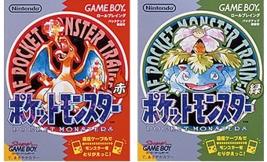
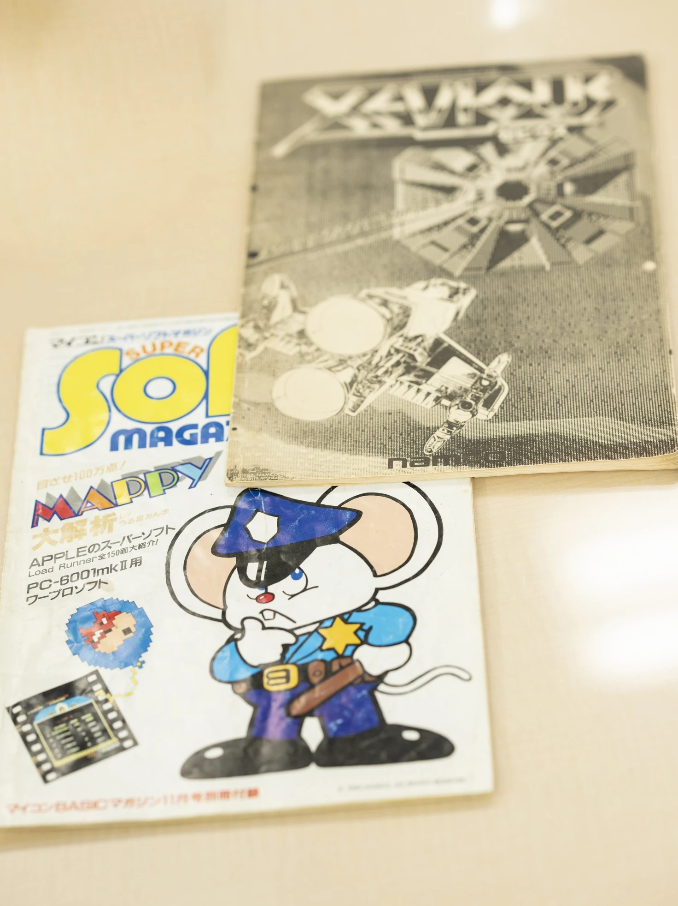
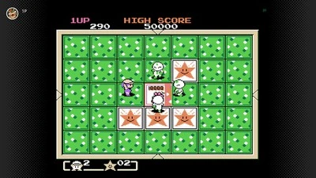

# ポケモンが生まれるまで――ゲームフリーク前史

## はじめに

世界累計販売本数3億本以上を誇る『ポケットモンスター』シリーズは、一枚のモノクロコピー誌から生まれた。それを書いた少年・田尻智は、やがて開発機材を自作してファミコンソフトを完成させ、ナムコに持ち込み、会社を興し、そしてゲームボーイの通信ケーブルに「交換」という概念の可能性を見出した。本稿では、株式会社ゲームフリークが1996年に『ポケットモンスター』を世に送り出すまでの前半生——同人誌時代から会社設立直後まで——を時系列で追う。[[1](#ref-1)]

*画像出典: [ポケットモンスターオフィシャルサイト - ポケットモンスター 赤・緑](https://www.pokemon.co.jp/game/other/gb-rg/)*

***

## 第一章　昆虫少年とゲームセンター荒らし（〜1982年）

田尻智は1965年8月28日、東京都世田谷区に生まれ、少年時代を町田市で過ごした。当時の町田はまだ自然が残っており、野山や小川、時には防空壕跡まで足を伸ばして昆虫や生き物を採取するのが日課だった。友だち同士で昆虫を「交換」するこの体験は、のちの『ポケットモンスター』の根幹にある「交換する」というコンセプトへと結実することになる。[[2](#ref-2)]

中学生になると、地元にもゲームセンターが建てられ始めた。友人の『スペースインベーダー』の最初の1機のプレイを見ていた田尻は、初めてのプレイにもかかわらず高得点を記録し、以来ゲームに取り憑かれる。「ゲームセンター荒らし」として名を馳せるほどに熱中し、少ない小遣いをつぎ込んだ。[[2](#ref-2)]

1980年、中学3年生の田尻は株式会社ユニバーサル（後のアルゼ／ユニバーサルエンターテインメント。『Mr. Do!』などで知られたアーケードゲームメーカー）主催の「ユニバーサル・ゲームアイデア・コンテスト」に「闇夜のカラス」というアイデアで応募し、落選。翌1981年には東京工業高等専門学校1年生として、セガ・エンタープライゼス主催の「TVゲームアイデア大賞」に、跳ねる動作をコンセプトにした『スプリング・ストレンジャー』を応募し、優秀賞（1位）を受賞している。プレイヤーからクリエイターへの芽は、この頃からすでに芽吹いていた。[[2](#ref-2)]

***

## 第二章　同人誌「ゲームフリーク」創刊（1983年）

### ゲーム雑誌も攻略本も少なかった時代

1983年当時、ファミリーコンピュータはちょうど発売されたばかりで（同年7月）、ゲーム専門誌や攻略本の市場は今とは比べものにならないほど貧弱だった。ゲームの情報は固定電話や手紙、そしてゲームセンターの常連同士の口コミで伝わる時代だった。[[3](#ref-3)][[4](#ref-4)]

東京工業高等専門学校3年生だった田尻智（18歳）は、こうした状況に物足りなさを感じ、自らゲーム攻略のモノクロコピー誌を執筆・創刊した。誌名は「ゲームフリーク」——文字通り「ゲームおたく」を意味する言葉で、後の会社名の原点となる。同人誌専門店に販売を委託した創刊号は、同世代のゲームフリーク（ゲームおたく）たちの間で飛ぶように売れた。[[5](#ref-5)][[2](#ref-2)]

電ファミニコゲーマーのインタビューで、遠藤雅伸（ゼビウスの開発者）は「あの同人誌は目立ってましたよ。ミュージシャンの細野晴臣さんや、宗教学者の中沢新一先生も買ってたんだよ」と振り返っている。ゲームをサブカルチャーとして真剣に論じる場がほぼ存在しなかった時代に、「ゲームフリーク」は知的なゲームメディアとして際立っていたのだ。[[4](#ref-4)]

### 杉森建との出会い

創刊号を新宿の同人誌専門店で手に取ったのが、当時高校生でのちにポケモンのキャラクターデザイナーとなる杉森建だった。ゼビウスの「隠しキャラクター」の情報に衝撃を受けた杉森は、すぐに田尻へ手紙を送った。[[4](#ref-4)]

その後も手紙を重ねるうちに、田尻は杉森が自分の知らないゲームの情報を次々と書いてくることに驚く。「一体、どういう人なんだろう」と感じた田尻は杉森と直接会い、2号以降のイラスト担当となった。この出会いがなければ、ポケモンのキャラクターデザインは生まれていなかったかもしれない。[[2](#ref-2)]

***

## 第三章　伝説の同人誌『ゼビウス1000万点への解法』（1983年）

### 「うる星あんず」との協力関係

同じ頃、大堀康祐（ペンネーム「うる星あんず」）と中金直彦が『ゼビウス 1000万点への解法』という同人誌を刊行し、ミニコミ界のベストセラーとなっていた。大堀は進学校に通っており、活動継続が難しくなってきたタイミングで、専門学校に通っていた田尻らに「"ゲームフリーク"を続ける気があるなら一緒に出してくれ」と委託を申し入れた。[[4](#ref-4)][[2](#ref-2)]

こうして田尻のサークルが、「マイコンBASICマガジン」の別冊付録「スーパーソフトマガジン」誌上で通販広告を出すことになる。1983年11月26日発行のこの別冊版は26ページで、「この本はnamco社XEVIOUSの謎を明かし10000000点を樹立する為のマニュアルである」と銘打たれ、当時のミニコミ誌としては記録的な部数を達成している。[[6](#ref-6)][[4](#ref-4)][[2](#ref-2)]

*画像出典: [4Gamer - 「ゼビウス 1000万点への解法」から40年。マトリックス代表・大堀氏とベーマガ創刊編集長・大橋氏が黎明期のゲーム業界を語る](https://www.4gamer.net/games/596/G059646/20240204001/)*

### なぜこの同人誌が重要なのか

この冊子には、本来表に出ないはずの開発情報や設定が掲載されていた。遠藤雅伸自身は大堀に「キャラクター名を書いたシート」を渡しており、同人誌でその内容が広く流通したことを後年「自分が渡した資料のせい」とコメントしている。意図せざる結果ではあったものの、結果としてこの同人誌は、開発者の頭の中にある世界観をプレイヤー側に届けるという、当時としては前例のない流通経路となった。田尻はゼビウスの「ゼビウス星」をめぐる都市伝説騒動でゲーマーコミュニティから一度は批判を受けながらも、遠藤に救われた経験から「ゲームの謎・うわさが人をつなぐ」ことを身をもって知っていた。この体験はのちのポケモンにおける「幻のポケモン」「ミュウ」の仕掛けへと受け継がれていく。[[4](#ref-4)]

***

## 第四章　ライター時代と「自分でゲームを作る」決意（1984〜1986年）

高専を卒業した田尻は、「ゲームフリーク」で培った実績や人脈を活かし、ゲームライターとして活躍を始める。[[2](#ref-2)]

- 『ファミコン通信』（現・ファミ通）——「ビデヲゲーム通信」「指鍛錬道場」「ソフトウェアレビュー」担当[[2](#ref-2)]
- 『ファミリーコンピュータMagazine』——アーケードゲーム紹介「ぼくたちゲーセン野郎」担当[[2](#ref-2)]
- ニッポン放送『オールナイトニッポン』——1986年4月〜1988年3月の約2年間、新作ゲーム紹介コーナー出演[[2](#ref-2)]

ライター・パーソナリティとして名を高める一方、田尻はセガへゲームの企画書を持ち込んだ。実際に検討してくれる担当者もいたが、企画がゲームとして発売されることはなかった。この経験が田尻の心に火をつける——「自分の手でゲームを作らなければ」。[[2](#ref-2)]

***

## 第五章　ファミコンを独自解析し、開発機材を自作する（1986〜1988年）

### 公式の外側でゲームを作る

田尻は同人誌時代から集まっていた仲間たちとともに、初の本格的なゲーム制作に着手した。しかし当時、ファミコンのゲームを作るには任天堂から正規ライセンスを受け、高額な開発機材を借り受ける必要があった。それは会社でも組織でもない、少数のゲームおたく集団には現実的でなかった。[[2](#ref-2)]

そこで彼らが取った方法は徹底的にDIYだった。後に『クインティ』の音楽を担当することになる増田順一は、ファミリーコンピュータと同じCPUを搭載していたApple IIを使ってソフトの解析を行い、その後ファミリーベーシックを解析し始めた。最終的にゲームフリークのメンバーは、 **ファミリーベーシックを使用してファミリーコンピュータを独自に解析し、自作でカートリッジを製作する** という方法を選んだ。[[7](#ref-7)]

安いファミコン用カセットを購入し、内部のROMを取り外して自分たちのデータを焼いたROMに差し替え、当時主流だったPC-9801とエプソン製互換機の2台を接続して並列処理のような作業を行った。会社でプログラマーとして働く増田は、日中は通常業務をこなし、帰宅後にゲームの音楽を制作。週末にはゲームフリークに出向いてデータの落とし込み作業をした。[[7](#ref-7)]

### 3年越しの制作

こうして作られた作品が、後に『クインティ』と名付けられるアクションパズルゲームだ。「めくる」という新しい動詞をコアにした本作は、簡単な操作で「駆け引き・戦術・収集・発見・協力・対戦」という複数の要素を詰め込んだゲームとして設計された。[[7](#ref-7)]

*画像出典: [Nintendoトピックス - 「ファミリーコンピュータ＆スーパーファミコン＆ゲームボーイ Nintendo Classics」に追加タイトルを配信開始。](https://www.nintendo.com/jp/topics/article/236a40c6-6fc1-41bb-ae24-1751947fc386)*

開発期間はおよそ3年弱（2年半〜3年）。当時のコアチームは6人前後とされる（プログラマー2名、グラフィック1名、田尻、杉森建、増田順一）。田尻がプロデュース・ディレクション・ゲームデザイン、増田順一が音楽、杉森建がキャラクターデザインを担当した。このトリオはのちのポケモンでも中核を担うことになる。[[7](#ref-7)]

***

## 第六章　ナムコへの持ち込みと法人化（1988〜1989年）

### 最初の壁——任天堂への持ち込み

完成に近づいた『クインティ』を、田尻はまず任天堂に持ち込もうとした。しかし、ゲームフリークがまだ正式な開発会社になっていなかったため、任天堂は関心を示さなかった。[[8](#ref-8)]

### ナムコとの交渉、そして「法人化」要求

次に田尻が選んだのはナムコだった。理由はシンプルで、田尻がナムコ・フリークと呼ばれるほどナムコのゲームを最も好んでいたからだという。ゲームフリーク版「ゼビウス1000万点への解法」を別冊として刊行していた縁もあり、ナムコとはゲーマー時代から接点があった。[[7](#ref-7)]

ナムコは作品そのものを高く評価し、発売を決定した。ただし交渉の過程で「個人とは契約できない。法人化してほしい」という条件が提示された。この要請を受けて田尻らは **株式会社ゲームフリーク** を設立することになる。なお、製品化にあたっての仕上げ工程は、ゲームフリークと当時ナムコの下請けをしていたKIDが共同で担当した。[[8](#ref-8)]

Game Informerのインタビューで増田順一はこう語っている。「ナムコと話し合う中で、『個人とは契約できない。法人化してほしい』と言われた。そこで会社にする決断をした」。[[8](#ref-8)]

### 1989年4月26日、設立

1989年4月26日、株式会社ゲームフリーク設立。資本金100万円、下北沢のマンションを事務所とした。 **この設立は、ナムコから『クインティ』発売の条件として法人化を求められたことが直接の契機だった**。同年6月27日、『クインティ』がナムコより発売され、約20万本を売り上げる中ヒットとなった。最終的に **累計で約5000万円の印税が発生し**、設立直後の運転資金を支えた。任天堂の宮本茂は本作に触れ、「このゲームを作ったヤツはできる！」と評したという。[[9](#ref-9)][[10](#ref-10)][[11](#ref-11)][[5](#ref-5)][[7](#ref-7)][[2](#ref-2)]

なお『クインティ』は、ファミリーコンピュータ用ゲーム史上、ほぼ唯一の「商業発売されたインディーゲーム」——すなわち、公式開発機材を使わずに個人サークルが制作してメーカーに持ち込んだ作品——として知られている。[[7](#ref-7)]

***

## 第七章　ゲームボーイの衝撃と「カプセルモンスター」構想（1989年）

### 運命の5日差

ゲームフリーク設立（4月26日）からわずか5日前の **1989年4月21日、任天堂の初代ゲームボーイが発売された**。[[12](#ref-12)]

田尻はゲームボーイを手にして、とくに **通信ケーブルによる通信機能** に強い関心を抱いた。当時のゲームボーイはほとんどのゲームがその機能を活用しておらず、いわば「忘れられた機能」だった。[[13](#ref-13)][[2](#ref-2)]

田尻が着目したのは「**交換する**」という動詞だった。少年時代に昆虫を交換した原体験、ゲームセンターで攻略情報を口コミで交換した記憶、同人誌で情報を「やりとり」してきた経験——これらすべてが、ゲームボーイの通信ケーブルという物理的なメディアと結びついた瞬間だった。[[14](#ref-14)]

「カプセルモンスター」（CAPSULE MONSTERS）という仮タイトルのゲームの企画が始動したのは1990年。田尻はこれを、任天堂への窓口役となっていた株式会社クリーチャーズ（および前身となった株式会社エイプ）に持ち込んだ。[[15](#ref-15)]

### 任天堂との縁

このポケモン企画を任天堂との間で橋渡しした重要人物が、石原恒和だった。石原はのちに株式会社ポケモンの代表となる人物で、クインティのスペシャルサンクスにもクレジットされている。ゲームフリークと任天堂の関係は、クインティ以前から築かれていたのだ。[[16](#ref-16)][[7](#ref-7)]

***

## 第八章　ポケモン開発以前のゲームフリーク作品群（1989〜1995年）

ポケモンの開発は始まったものの、それ一本に集中できる環境ではなかった。長期にわたる開発資金を確保するため、ゲームフリークは複数の受託開発プロジェクトを並行して手がけた。

| 発売年 | タイトル | 発売元 | プラットフォーム |
|--------|----------|--------|----------------|
| 1989年6月 | クインティ | ナムコ | ファミコン |
| 1991年9月 | ジェリーボーイ | EPIC・ソニー | スーパーファミコン |
| 1991年12月 | ヨッシーのたまご | 任天堂 | FC / GB |
| 1992年4月 | まじかる☆タルるートくん | セガ | メガドライブ |
| 1993年8月 | マリオとワリオ | 任天堂 | スーパーファミコン |
| 1994年7月 | パルスマン | セガ | メガドライブ |

[[17](#ref-17)][[5](#ref-5)][[2](#ref-2)]

特に『ヨッシーのたまご』（1991年）はゲームフリークが任天堂パブリッシャーとして初めて手がけた作品であり、この協業関係がポケモン開発の直接的な基盤となった。こうした受託開発を資金源としながら、田尻率いるチームは6年以上かけてポケモンを作り続けた。[[17](#ref-17)][[8](#ref-8)]

***

## まとめ——「遊ぶ」から「作る」への道筋

ゲームフリークの前史をたどると、一つの一貫したテーマが浮かぶ。それは **「自分が欲しいものは自分で作る」** という精神だ。

ゲーム攻略情報が乏しいなら自分で同人誌を作る。開発機材が手に入らないなら自分で解析して自作する。契約できる法的主体がないなら会社を作る。田尻智はそのたびに、外部の制約を「次の課題」として乗り越えた。

そして決定的だったのが、ゲームボーイという「誰もその価値に気づいていなかった機能」との出会いだった。通信ケーブルを使って生き物を「交換する」というアイデアは、昆虫少年の原体験とゲームセンターの情報共有文化と、同人誌の仲間とのやり取りという、田尻の人生全体が集約された発想だった。

『ポケットモンスター 赤・緑』が1996年2月27日に発売されるまでの6年以上、この企画はゲームフリークの「秘密プロジェクト」として続いた。それを支えたのは、ゲーム同人誌の一枚目のコピーから培われた「ゲームへの深い愛と観察眼」だった。[[8](#ref-8)]

---

## References

1. [Game Freak ｜ Nintendo ｜ Fandom][1] - Game Freak ; Founded. April 26, 1989 ; Headquarters. Chiyoda-ku, Tokyo, Japan ; Key people. Satoshi ...

2. [田尻智 - Wikipedia][2] - 田尻 智（たじり さとし、1965年8月28日 - ）は、ゲームクリエイター。株式会社ゲームフリークの代表取締役社長であり、『ポケットモンスター』の生みの親として知られる ...

3. [書評「ゲームフリーク」ポケモン誕生秘話！丁寧なものづくりは ...][3] - 元々、「ゲームフリーク」は田尻さんが作り始めたゲーム攻略本の名前だったらしいんです。今で言う同人誌のような感じですかね。 まだ世の中では「ゲーム ...

4. [ベーマガの歴史と大堀康祐さん - takuya matsubara blog][4] - 全25ページに渡る徹底解析マニュアル"ゼビウス1千万点への解法"をオフセット出版した。人は彼を「ゼビウス1千万点の男」と呼ぶ。 このオフセット ...

5. [ゲームフリーク - Wikipedia][5] - ゲームソフトの企画・開発・販売. 代表者, 代表取締役社長 田尻智. 資本金, 1000万円. 従業員数, 249名（2025年3月現在）. 関係する人物, 田尻智（創業者） 杉森建（常務 ...

6. [ゼビウス1000万点の解法 ゲームフリーク 同人誌 田尻智 【公式通販】][6] - ゲームフリーク別冊 1983年11月26日発行 26ページ この本はnamco社XEVIOUSの謎を明かし10000000点を樹立する為のマニュアルである(本文より)

7. [クインティ - Wikipedia][7] - 開発はゲームフリークおよびKIDが行い、プロデュースおよびディレクター、ゲーム・デザインを田尻智が担当、音楽は増田順一、キャラクター・デザインは杉森建が担当し ...

8. [Game Freak's Origins And Its Pre-Pokémon Games - Game Informer][8] - Game Freak began as a magazine in Japan, or as Pokémon producer and composer and Game Freak co-found...

9. [ゲームフリークが本日（4月26日）設立30周年 ...][9] - そんな彼らが本格的にゲーム開発を始め、最初に商品化されたのがファミコンソフト『クインティ』。会社としてのゲームフリークはこの作品の発売前後に設立 ...

10. [ついにファミコンの名作、あの「クインティ」が帰ってきた！][10] - 「クインティ」は1989年6月に発売されたファミコン用ソフトで、いまや「ポケットモンスター」シリーズの制作で知られるゲームフリークが、まだ同人誌作成 ...

11. [株式会社ゲームフリーク（ポケモン原作者の貴重資料保存）様][11] - ... 田尻智氏が、1989年に設立したゲームソフト開発会社。その社名は、田尻氏らが学生時代に制作していたミニコミ誌「ゲームフリーク」に由来します。 時代は80年代前半 ...

12. [ポケットモンスターの歴史1 ～誕生～ +GBCLOVER - FC2][12] - ついには彼らとゲーム造りに着手して、ファミコンソフト「クインティ」をナムコに持ち込むのです。 そんなゲームフリークが会社化して、一番最初に生まれたのが「 ...

13. [ポケモンのルーツはウルトラセブンだった ... - コバろぐ][13] - そして田尻さんは、ゲームボーイの忘れられた機能、通信機能に着目します。そして「交換する」をコンセプトにゲームを企画します。 「なんかやりとりした ...

14. [ポケットモンスター ｜ ポケモン Wiki - Fandom][14] - 田尻はとりわけゲームボーイの通信機能に着目し、「交換する」という動詞を ... 田尻の企画した「カプセルモンスター」は、カプセルトイのようなケースに入った ...

15. [初代ポケモン誕生を綴る『ゲームフリーク』が約25年ぶりに復刊 ...][15] - ポケモン生みの親・田尻智さんがゲームボーイの通信機能に着目したのが1989年で、翌年に「CAPSULE MONSTERS」（後のポケモン）の企画が始動。それをエイプに ...

16. [とみさわ昭仁「ゲームフリーク 遊びの世界標準を塗り替える ... - Mikiki][16] - さらに、巻末では〈特別企画〉として今回の復刊にあたって田尻智氏はもちろん、杉森健氏、石原恒和氏、増田順一氏といった本書に度々登場する人物たちが、 ...

17. [ヨッシーのたまご - Wikipedia][17] - 『ヨッシーのたまご』は、ゲームフリーク開発、任天堂発売のファミリーコンピュータ（以下FC）・ゲームボーイ（以下GB）用ゲームソフト。日本ではFC版・GB版ともに1991年12 ...

[1]: https://nintendo.fandom.com/wiki/Game_Freak
[2]: https://ja.wikipedia.org/wiki/%E7%94%B0%E5%B0%BB%E6%99%BA
[3]: https://note.com/oasissk/n/n2aa4ad3d1c29
[4]: https://nicotakuya.hatenablog.com/entry/2022/11/10/201721
[5]: https://ja.wikipedia.org/wiki/%E3%82%B2%E3%83%BC%E3%83%A0%E3%83%95%E3%83%AA%E3%83%BC%E3%82%AF
[6]: https://www.mydatadigital.com/items/E345973893/
[7]: https://ja.wikipedia.org/wiki/%E3%82%AF%E3%82%A4%E3%83%B3%E3%83%86%E3%82%A3
[8]: https://gameinformer.com/b/features/archive/2017/08/09/game-freaks-origins-and-non-pokemon-games.aspx
[9]: https://www.famitsu.com/news/201904/26175304.html
[10]: https://game.watch.impress.co.jp/docs/news/655639.html
[11]: https://sei-syou.com/jisseki/gamefreak
[12]: https://gameboy123.web.fc2.com/pokemonep1.html
[13]: https://www.cobalog.com/entry/pokemon_and_ultraseven
[14]: https://pocketmonsters.fandom.com/ja/wiki/%E3%83%9D%E3%82%B1%E3%83%83%E3%83%88%E3%83%A2%E3%83%B3%E3%82%B9%E3%82%BF%E3%83%BC
[15]: https://news.yahoo.co.jp/expert/articles/0188200df5943a79f81a5c497b591ccd10918929
[16]: https://mikiki.tokyo.jp/articles/-/41503
[17]: https://ja.wikipedia.org/wiki/%E3%83%A8%E3%83%83%E3%82%B7%E3%83%BC%E3%81%AE%E3%81%9F%E3%81%BE%E3%81%94

----

この文書は、Perplexity、Claude、OpenAI Codex の3つのAIの支援を受けて著述されたものです。引用画像を除き、MIT License にて提供されています。
