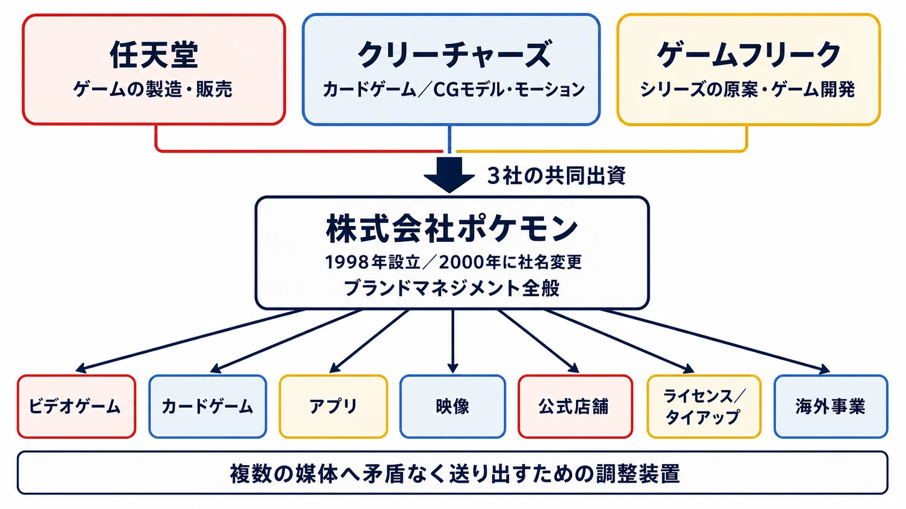
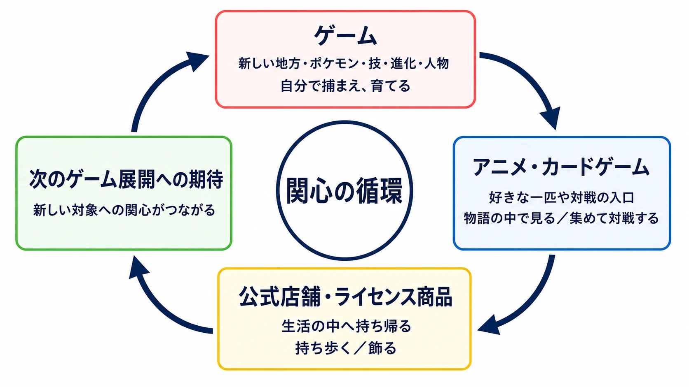
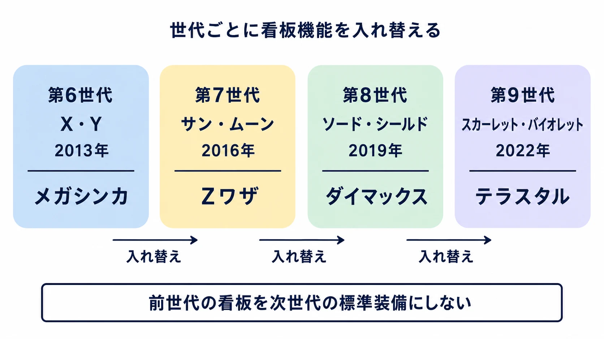
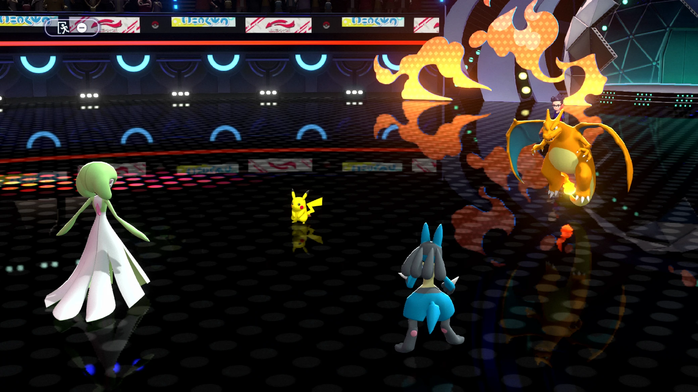
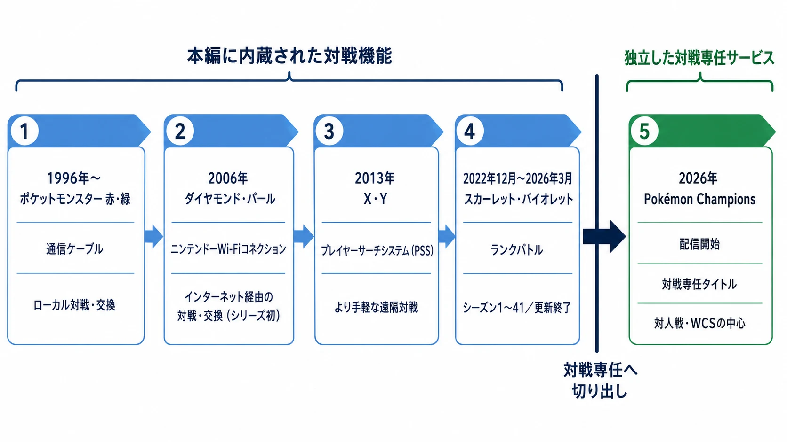

# ポケモンはなぜ巨大IPであり続けるのか――「変えない安心」と「世代ごとに変える新規性」の設計

ポケモンは、ゲームのシリーズ名であると同時に、アニメ、カードゲーム、玩具、店舗、アプリをまたぐ巨大な接点の集合でもある。株式会社ポケモンが公開する数字では、全ポケモン関連ゲームソフトの累計出荷本数は4億8,900万本超、ポケモンカードゲームの累計製造枚数は750億枚超である。『ポケットモンスター』シリーズの対応言語は10言語、カードゲームは16言語・90以上の国と地域で展開されている。いずれも2025年3月末時点（言語数を除く）の公式値だ。[[1](#ref-1)]

この規模を「キャラクターが強いから」とだけ説明すると、プランニング上の論点を見失う。新しいポケモンを生むゲーム、キャラクターに日常的な接点を作る映像とカード、欲しい対象を手元に置く商品と店舗が、それぞれ別の入口を担っているからである。一方で、その中心にあるゲームは、30年近く「捕まえる・育てる・戦わせる・集める」という約束を大きく手放していない。

本稿はこの二層を分けて読む。第1部では、作品世界を複数の媒体へ運ぶための組織と循環を扱う。第2部では、ここでいうカノン、すなわち『ポケットモンスター 赤・緑』から『スカーレット・バイオレット』、および『Pokémon LEGENDS』シリーズを含むメインシリーズのゲーム設計を扱う。前者を本編ゲームの設計論へ還元せず、後者をIPの規模だけで説明しないためである。

***

## 第1部：超巨大IPとしてのポケモン

### 媒体をまたぐための「専任のプロデュース機能」

ポケモンの原著作権者である任天堂、クリーチャーズ、ゲームフリークは、それぞれゲームの製造・販売、カードゲームやCGモデル・モーションの開発、シリーズの原案・ゲーム開発を担う。1998年に3社の共同出資で設立されたポケモンセンター株式会社は、2000年に株式会社ポケモンへ社名を変え、ブランドマネジメント全般へ業務領域を広げた。[[2](#ref-2)]

重要なのは設立の経緯をなぞることではなく、何を束ねるための機能かである。現在の株式会社ポケモンの事業は、ビデオゲーム、カードゲーム、アプリ、映像、公式店舗、ライセンス／タイアップ、海外事業に及ぶ。[[3](#ref-3)] 石原恒和社長は、ポケモンを「どんなメディアに登場させ、どんな商品にし、どう育てていくか」を考え、プロデュースすることが会社の仕事だと説明している。[[4](#ref-4)]

一つの開発会社だけでゲーム、映像、物販の最適化を同時に行おうとすれば、発売時期、露出するキャラクター、地域ごとのローカライズ、商品化の優先順位が衝突しやすい。そこで専任組織は、個別の媒体を直接制作することよりも、同じキャラクターを複数の媒体へ矛盾なく送り出すための調整装置になる。ここでは「ゲームの続編をいつ出すか」と「店頭で何を見せるか」が、別々の都合だけで完結しない。

#### コラム：新種の供給、普及、常時収益化が一周する

この仕組みを単純化すると、次の循環として見える。

ゲームは、新しい地方、ポケモン、技、進化、人物という「次に知りたい対象」を供給する。アニメやカードゲームは、それをゲーム機を持たない人にも見せ、好きな一匹や対戦の入口を作る。公式店舗やライセンス商品は、発売日や放送日を待たずに、その対象を生活の中へ持ち帰れる形にする。カードゲームについて株式会社ポケモン自身も、対戦だけでなく、好きなポケモンのカードを集めて眺めることが小さな子どもの入口になると説明している。[[5](#ref-5)]

これは、各媒体が同じ内容を反復する循環ではない。ゲームは「自分で捕まえ、育てる」体験、アニメは「物語の中で見る」体験、カードは「集めて組み合わせ、対戦する」体験、グッズは「持ち歩き、飾る」体験を提供する。同じキャラクターを中心にしながら、参加に必要な時間、端末、年齢、遊び方をずらしている。プランナーの視点では、一つの媒体が獲得した関心を、別媒体が次の行動へ変換できる設計である。

#### コラム：本編の外側に入口を増やす『Pokémon GO』とポケポケ

この循環は、カノンの本編だけに依存しない。2016年にリリースされた『Pokémon GO』は、位置情報を使い現実世界を舞台にポケモンを集めるアプリであり、現在は150以上の国と地域で展開されている。[[6](#ref-6)] 2024年10月には『Pokémon Trading Card Game Pocket（ポケポケ）』も配信された。[[7](#ref-7)]

両作を本編の新世代と同じ軸で評価する必要はない。前者は歩く場所と時間を入口にし、後者はスマートフォンでカードを開封・収集する入口にする。本編を遊ぶために必要だった専用機、数十時間の冒険、ターン制バトルへの慣れを、別の形へほどいている。巨大IPにとっては、カノンを薄めることではなく、カノンに触れる前後の接点を増やす施策と位置づけられる。

***

## 第2部：ゲームとしてのポケモン

### 変わらなかったもの：四つの動詞と、相性を読む戦闘

『ポケットモンスター 赤・緑』から続く核は、「捕まえる・育てる・集める・対戦する」の四つである。株式会社ポケモンのブランド資料も、この四要素をシリーズの原点から続くものとして整理している。[[8](#ref-8)] プレイヤーは野生のポケモンを捕まえ、バトルで育成し、相手に応じて仲間と技を選び、図鑑を埋める。ストーリーを終えた後にも図鑑と育成個体が残るため、クリアと収集の目標が完全には重ならない。

戦闘の骨格はタイプ相性である。どの技を出すかだけでなく、誰を出すか、手持ちの穴をどう埋めるかが選択になる。初代のタイプは15種類だった。『金・銀』であく・はがねが加わって17種類となり、『X・Y』でフェアリーが加わって現在の18種類になった。公式の『X・Y』サイトは、初代の15種類、1999年の2種追加、2013年の18番目のフェアリー追加を明示している。[[9](#ref-9)]

この「相性表を読んで、捕まえた個体で答えを組む」構造は、世代をまたぐ共通言語になる。シリーズ未経験者にも、ほのおにはみず、というように一部の関係から学び始められる。経験者には、新しいポケモン、特性、技、複合タイプを既存の相性表へ足し直す課題になる。ルールを毎回作り直さないからこそ、新規要素を一つずつ理解できるのである。

### 変わったもの①：一世代で使い切る、戦闘の主役

一方、戦闘には世代ごとに大きな看板機能が置かれる。第6世代『X・Y』（2013年）のメガシンカ、第7世代『サン・ムーン』（2016年）のZワザ、第8世代『ソード・シールド』（2019年）のダイマックス、第9世代『スカーレット・バイオレット』（2022年）のテラスタルである。メガシンカは既存のポケモンを一時的に別の姿と能力へ変え、Zワザは一回の強力な行動、ダイマックスは数ターンの巨大化と技の変化、テラスタルはタイプを変える選択を前面に出した。

ここで注目したいのは、前世代の看板を次世代の標準装備にしないことだ。過去の要素を再登場させる場合はあっても、対戦の共通前提として積み上げ続けない。もしメガシンカ、Zワザ、ダイマックス、テラスタルをすべて常設すれば、初見の戦闘で理解すべき例外と選択肢は急増する。どれを使うかだけでなく、どの世代の仕組みが使えるかまで、編成とルールに入り込むからである。

代わりに各世代は、既存のタイプ相性と4つの動詞の上へ、一つの大きな問いを置ける。『X・Y』なら「どのポケモンをメガシンカさせるか」、『サン・ムーン』なら「いつZワザを切るか」、『ソード・シールド』なら「どの局面でダイマックスするか」、『スカーレット・バイオレット』なら「どのタイプへテラスタルするか」である。長いシリーズでありながら、毎世代の対戦に新しい主語を用意する方法だと言える。

これは過去の蓄積を軽視する設計ではない。むしろ、持ち越さないものを決めることで、コアの相性表、ポケモンごとの役割、育成と収集を読める状態に保つ。新機能を「永続の標準」にせず、「その世代の記憶」にすることが、新鮮さと学習コストの両方を管理している。

### 変わったもの②：「全部集められる」という約束に上限を設ける

2019年6月、E3期間中のNintendo Treehouseで、『Pokémon HOME』から『ソード・シールド』へ連れていけるポケモンをガラル図鑑に登場するポケモンに絞る方針が発表された。ディレクターの大森滋氏は、800種を超えるポケモンをすべて登場させ続けることは難しく、Nintendo Switchで高精細な表現とアニメーションを作りながら、幅広い人に届く選定とバトルバランスを考える必要があると説明し、増田順一氏もガラル図鑑に登場するポケモンへ絞る方針を確認している。[[10](#ref-10)]

これは、ポケモンを「一度手に入れたら、将来の全作品へ必ず連れていける」という理解から、「クラウドには預けられても、各作品で使える種は作品ごとに異なる」という理解へ移す判断だった。『Pokémon HOME』の公式説明も、他のソフトへ連れていけるのは、そのソフトに登場するポケモンに限ると明記する。[[11](#ref-11)]

プランナーにとって重要なのは、これを単純に「量を減らした」と読むことではない。全種対応は、モデル、モーション、技、特性、対戦バランス、UI、テストを、新作の新要素と同時に維持する約束になる。図鑑は収集目標であると同時に、作品ごとの制作範囲を規定するデータベースでもある。『ソード・シールド』以降は、その範囲を毎作で選び直すことで、全体の保全と個別作品の表現を両立させようとしたのである。

### 変わったもの③：捕獲と戦闘の順番を問い直す

『Pokémon LEGENDS アルセウス』（2022年1月28日発売）[[12](#ref-12)]は、広いフィールドでポケモンの行動を観察し、気づかれない位置からモンスターボールを投げて捕獲できる。必ず戦闘を経由せずに捕獲へ到達できるため、「捕まえる」というコア動詞の手触りを、コマンド選択ではなく接近、照準、危険回避へ移した。

『Pokémon LEGENDS Z-A』（2025年10月16日発売）は、さらにポケモンとトレーナーがリアルタイムで行動する戦闘をシリーズ初として掲げた。[[13](#ref-13)] 従来のターン制コマンドバトルは、「何を選ぶか」を考える時間が中心だった。リアルタイム戦闘では、技を選ぶだけでなく、間合い、発動するタイミング、相手の行動中にどこへ動くかが判断に加わる。

ここで変えられているのは、ポケモンを集め、育て、戦わせる目的そのものではない。その目的へ至るゲームフローである。『LEGENDS アルセウス』は捕獲の前に戦闘を必須にしない。『LEGENDS Z-A』は戦闘中の入力の時間構造を変える。長く守ってきた動詞を残し、動詞を実行する順番と操作を大きく変えることで、別作品としての驚きを作っている。

### 分類と移行を、シリーズ運営のインフラにする

ポケモンは新種だけで図鑑を増やしてきたわけではない。第7世代『サン・ムーン』では、既存種がアローラ地方の環境に適応した「アローラのすがた」、すなわちリージョンフォームを導入した。公式は、リージョンフォームを、ほかの地域とは異なる姿と生態を持つポケモンと説明する。[[14](#ref-14)]

これは単に見た目の差分を増やす仕掛けではない。同じ図鑑番号や親しみのある名前を残しながら、タイプ、能力、習得技、出現環境を変えられるため、既存ポケモンを新しい地方の生態系と戦略へ接続できる。完全に新しい種を増やすことと、既存種をそのまま再登場させることの間に、設計の余地を作る手段である。

もう一つのインフラが世代間移行である。日本では2013年12月25日に『ポケモンバンク』が配信され、2020年2月12日にはクラウドサービス『Pokémon HOME』が始まった。HOMEは、シリーズや『Pokémon GO』で仲間にしたポケモンを預け、対応する他ソフトへ連れていき、交換できるサービスである。[[15](#ref-15)][[16](#ref-16)]

ただし移行の存在は、前節の図鑑制限を無効化しない。HOMEは「すべてのポケモンが集まる場所」を掲げる一方、各ソフトへ連れていける範囲は作品ごとの登場種に限る。[[11](#ref-11)] これは不整合ではなく、二つの約束を分けたものだ。プレイヤーが育てた個体の保管と再会を支える約束と、各作品が扱うデータと対戦環境を選ぶ約束を、同じサービスに背負わせないためである。

### 対戦環境を、専任サービスへ切り出す

通信による対人戦も、カノンの長い歴史を支えた要素である。『ポケットモンスター 赤・緑』の時代にはゲームボーイの通信ケーブルで、ポケモンの交換だけでなくプレイヤー同士の対戦が行われた。[[17](#ref-17)] 2006年発売の『ダイヤモンド・パール』は、ニンテンドーWi-Fiコネクションを通じてインターネット経由でポケモン交換・対戦ができるようになった、シリーズ初のタイトルである。[[18](#ref-18)][[19](#ref-19)] 後年には、ニンテンドー3DSの『X・Y』でプレイヤーサーチシステムを通じて遠く離れた相手と対戦できるようになった。[[20](#ref-20)] 冒険で育てた手持ちを、現実の他者との勝負へ持ち出せることは、収集と育成に競技性を接続する役割を担ってきた。

その対戦を主目的に据えた『Pokémon Champions』は、2025年7月22日の「Pokémon Presents」で発表された。Nintendo Switch版は2026年4月8日、iOS／Android版は同年6月17日に配信開始され、基本プレイ無料・一部アイテム課金のタイトルとして提供されている。Nintendo Switch、Nintendo Switch 2、スマートフォンの間でクロスプラットフォーム対戦に対応し、同じゲームアカウントを連携すれば複数の対応端末から利用できる。[[21](#ref-21)][[22](#ref-22)][[23](#ref-23)] 企画・制作はゲームフリークと株式会社ポケモン、開発は株式会社ポケモンワークスが担う。[[22](#ref-22)]

本作の構成は、「スカウト」で一緒に戦うポケモンを編成し、「トレーニング」で対戦の準備をし、「バトル」で勝負するというものだ。バトルにはシングル・ダブルの両形式があり、ランクバトル、カジュアルバトル、プライベートバトルを分けている。[[21](#ref-21)][[24](#ref-24)] 物語を進め、地方を探索し、図鑑を完成させるための機能ではなく、育成済みのポケモンで対戦環境へ入るまでの準備と試合運営を、単独の製品として最適化する構成である。

出典：[『Pokémon Champions』公式サイト「バトルについて」][24]

この分離は、前節のHOMEと切れていない。ポケモンワークスは2024年3月1日設立、資本金5,000万円の、ポケモンに関するゲーム開発を担う会社である。株式会社ポケモンと株式会社イルカの2社から生まれた開発チームとして、ゲームだけでなく『Pokémon HOME』のようなサービスの開発も掲げている。[[25](#ref-25)][[26](#ref-26)] 『Pokémon Champions』はHOMEと連携し、『Pokémon LEGENDS Z-A』をはじめとする既存作品や『Pokémon GO』で仲間にした一部のポケモンを「遠征」させて使える。[[27](#ref-27)] 作品ごとの図鑑制約をHOMEが仲介したように、本編で得た個体を競技用の場へつなぐ経路も、専任サービスが受け持つ形である。

『スカーレット・バイオレット』のランクバトルは、2022年12月のシーズン1開始から本編のオンライン対戦を担ってきた。[[28](#ref-28)] 株式会社ポケモンは2026年3月、4月1日開始のシーズン41を最終シーズンとし、それ以降は更新せず、サービス終了までシーズン41を継続すると告知した。月ごとの最終ランキング発表と報酬付与は行われない。[[29](#ref-29)] 同時に、2026年からポケモンワールドチャンピオンシップスのゲーム部門と原則としてその予選は『Pokémon Champions』で実施されることが決まった。一部地域では『スカーレット・バイオレット』による予選が残るため、移行は一斉ではない。[[30](#ref-30)] それでも方向性は明確である。図鑑と個体移行をHOMEへ切り出したのと同じく、対人戦のルール、ランキング、競技大会、継続的な環境調整を、本編が毎作ごとに背負う責任から専任のインフラへ移しつつある。本編は冒険と新しい地方の設計へ、対戦サービスは競技環境の更新へ、それぞれの開発資源を集中させられるようになる。

***

### 変えないことで安心を売り、変えないルールの中で変える

ポケモンの強さは、毎作すべてを刷新することにも、過去の仕組みを永久保存することにもない。捕まえる、育てる、集める、戦わせる。タイプ相性を読み、図鑑を埋める。この約束を維持することで、プレイヤーは新作に入っても最初の数時間を「学び直し」だけに使わずに済む。

そのうえで、世代ごとの戦闘ギミックを入れ替え、図鑑の対応範囲を選び直し、リージョンフォームで既存種を再解釈し、LEGENDSでは捕獲と戦闘のフローを変える。二枚看板の前半は「前作を知っている人が戻れる安心」であり、後半は「同じルールを知っているからこそ分かる違い」である。

シリーズを長期運営する際、変化は必ずしも新しい数値や新しいコンテンツ量だけではない。何を永続のルールにし、何をその作品だけの体験にし、何を作品外のインフラへ退避させるかを分けることでも、長いIPは新しさを売れる。ポケモンの設計は、その分類を世代、媒体、サービスの三層で続けている。

## References

1. [数字でみるポケモン][1] - 全ポケモン関連ゲームソフトの累計出荷本数、対応言語数、ポケモンカードゲームの累計製造枚数・販売言語数・販売地域数（2025年3月末時点）の公式値。

2. [株式会社ポケモンのあゆみ][2] - 1998年の前身会社設立、2000年の株式会社ポケモンへの社名変更、原著作権者3社の役割分担。

3. [株式会社ポケモンの事業紹介][3] - ビデオゲーム、カードゲーム、アプリ、映像、店舗、ライセンス、海外事業の一覧。

4. [代表取締役社長 石原恒和のメッセージ][4] - 株式会社ポケモンが担うプロデュースとブランドマネジメントの説明。

5. [カードゲーム事業の紹介][5] - ポケモンカードゲームを、対戦とコレクションの両面から紹介する公式説明。

6. [知らない道を歩く、冒険を楽しむ『ポケモン GO』][6] - 2016年リリース、位置情報ゲーム、150以上の国と地域での展開についての公式説明。

7. [株式会社ポケモンのあゆみ][7] - 2024年10月の『Pokémon Trading Card Game Pocket』配信開始。

8. [ポケモンブランドシート（2025年）][8] - 「捕まえ・育て・集め・対戦する」4要素を原点から続くものとして示す公式資料。

9. [新タイプ「フェアリー」登場！][9] - 初代15種類、『金・銀』でのあく・はがね追加、『X・Y』でのフェアリー追加の公式説明。

10. [増田順一氏・大森滋氏インタビュー][10] - 2019年E3での『ソード・シールド』の登場ポケモン範囲と、大森氏による高精細表現・バトルバランスに関する説明。

11. [『Pokémon HOME』とは][11] - HOMEから各ソフトへ連れていけるポケモンが、そのソフトに登場する種に限られることの公式仕様。

12. [『Pokémon LEGENDS アルセウス』早期購入特典のお知らせ][12] - 発売日が2022年1月28日（金）に決定したことを伝える公式ニュース記事。

13. [『Pokémon LEGENDS Z-A』初週世界販売本数発表][13] - 2025年10月16日の発売と、シリーズ初のリアルタイム戦闘の公式説明。

14. [アローラ地方の環境に適応した姿を持つポケモンたち][14] - 『サン・ムーン』で紹介されたリージョンフォームと「アローラのすがた」の説明。

15. [『Pokémon HOME』公式サイト][15] - 2020年2月12日の配信開始と、クラウドサービスとしての機能。

16. [3DS「ポケモンバンク」を12月25日に配信][16] - 『ポケモンバンク』の日本における2013年12月25日の配信開始と、利用条件を伝える専門メディアの報道記事。

17. [『ポケットモンスター』シリーズの原点][17] - ゲームボーイの通信ケーブルを用いた、ポケモンの通信交換・対戦を説明する公式サイト。

18. [ポケットモンスター ダイヤモンド・パール][18] - 2006年9月28日の発売日を示す公式製品情報。

19. [ポケットモンスター ダイヤモンド・パール【新機能】][19] - ニンテンドーWi-Fiコネクションを通じたインターネット経由のポケモン交換・対戦を説明する公式サイト。

20. [『ポケットモンスター X・Y』の通信機能][20] - プレイヤーサーチシステム（PSS）を通じて遠く離れたプレイヤーと対戦できることを説明する公式サイト。

21. [『Pokémon Champions』、2026年内にリリース決定][21] - 2025年7月22日の発表、スカウト・バトル・トレーニングの構成、シングル・ダブル・ランクバトルを伝える専門メディアの報道記事。

22. [『Pokémon Champions』公式サイト][22] - Nintendo Switch版・スマートフォン版の配信日、基本プレイ無料・一部アイテム課金、企画制作・開発体制、クロスプラットフォーム対戦の公式情報。

23. [複数の端末から同じゲームアカウントで遊ぶ方法][23] - Nintendo Switch、Nintendo Switch 2、スマートフォンで同じゲームアカウントを使う場合の公式サポート情報。

24. [『Pokémon Champions』のバトルについて][24] - シングル・ダブル、ランク・カジュアル・プライベートバトル、シーズン集計・レギュレーションの公式説明。

25. [株式会社ポケモンワークス：会社概要][25] - 2024年3月1日の設立、資本金5,000万円、事業内容を示す公式情報。

26. [株式会社ポケモンワークスについて][26] - 株式会社ポケモンと株式会社イルカから生まれた開発チームであり、『Pokémon HOME』のようなサービス開発を掲げる公式説明。

27. [『Pokémon Champions』のポケモンについて][27] - HOME連携と、『Pokémon LEGENDS Z-A』などで仲間にしたポケモンを遠征させる仕様の公式説明。

28. [『スカーレット・バイオレット』更新データ（Ver.1.1.0）配信のお知らせ][28] - 2022年12月のランクバトル シーズン1開始を示す公式ニュース。

29. [最終シーズン（シーズン41）以降のランクバトルについて][29] - シーズン41以降の更新停止、サービス終了までの継続、ランキング・報酬の扱いを示す公式告知。

30. [ポケモンWCS2026 ゲーム部門の対象ソフトが『Pokémon Champions』に決定][30] - 2026年からのWCSゲーム部門・予選大会の対象ソフトと、一部地域における例外を伝える公式発表。

[1]: https://corporate.pokemon.co.jp/aboutus/figures
[2]: https://corporate.pokemon.co.jp/aboutus/history
[3]: https://corporate.pokemon.co.jp/business
[4]: https://corporate.pokemon.co.jp/aboutus/message
[5]: https://corporate.pokemon.co.jp/business/cardgame/
[6]: https://corporate.pokemon.co.jp/topics/detail/t-12/
[7]: https://corporate.pokemon.co.jp/aboutus/history
[8]: https://corporate.pokemon.co.jp/media/pressrelease/detail/141.html
[9]: https://www.pokemon.co.jp/ex/xy/battle/01.html
[10]: https://www.4gamer.net/games/451/G045125/20190613082/
[11]: https://www.pokemon.co.jp/ex/pokemonhome/ja/about/
[12]: https://www.pokemon.co.jp/info/2021/08/210818_p01.html
[13]: https://corporate.pokemon.co.jp/media/pressrelease/detail/141.html
[14]: https://www.pokemon.co.jp/ex/sun_moon/world/160801_03.html
[15]: https://www.pokemon.co.jp/ex/pokemonhome/
[16]: https://game.watch.impress.co.jp/docs/news/614108.html
[17]: https://www.pokemon.co.jp/ex/VCAMAP/game/
[18]: https://www.pokemon.co.jp/game/ds/dp/
[19]: https://www.pokemon.co.jp/game/ds/dp/function.html
[20]: https://www.pokemon.co.jp/ex/xy/com/
[21]: https://www.4gamer.net/games/886/G088682/20250722072/
[22]: https://www.pokemonchampions.jp/ja/
[23]: https://app-pcs.pokemon-support.com/hc/ja/articles/56482078037529-%E8%A4%87%E6%95%B0%E3%81%AENintendo-Switch%E3%81%8B%E3%82%89%E5%90%8C%E3%81%98%E3%82%B2%E3%83%BC%E3%83%A0%E3%82%A2%E3%82%AB%E3%82%A6%E3%83%B3%E3%83%88%E3%81%A7%E9%81%8A%E3%81%B6%E3%81%93%E3%81%A8%E3%81%AF%E3%81%A7%E3%81%8D%E3%81%BE%E3%81%99%E3%81%8B
[24]: https://www.pokemonchampions.jp/ja/battle/
[25]: https://www.pokemonworks.co.jp/company/
[26]: https://www.pokemonworks.co.jp/
[27]: https://www.pokemonchampions.jp/ja/pokemon/
[28]: https://www.pokemon.co.jp/info/2022/12/221201_gm01.html
[29]: https://sv-news.pokemon.co.jp/ja/page/389.html
[30]: https://www.pokemonchampions.jp/ja/news/1.html

----

この文書は、Perplexity、Claude、OpenAI Codex の3つのAIの支援を受けて著述されたものです。引用画像を除き、MIT License にて提供されています。
