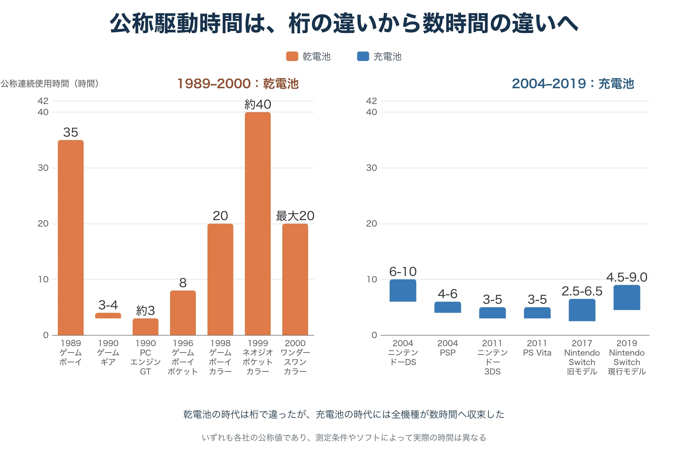
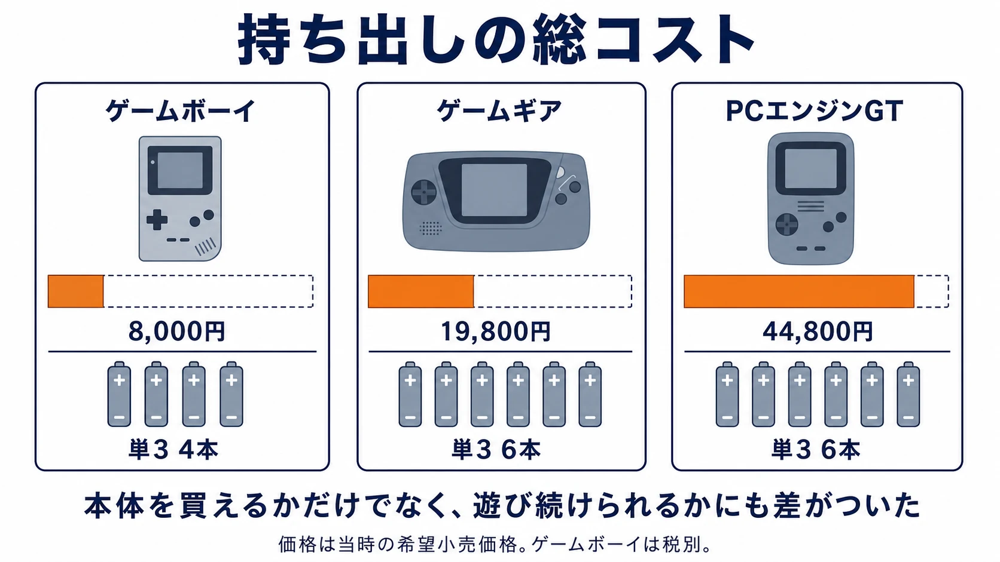
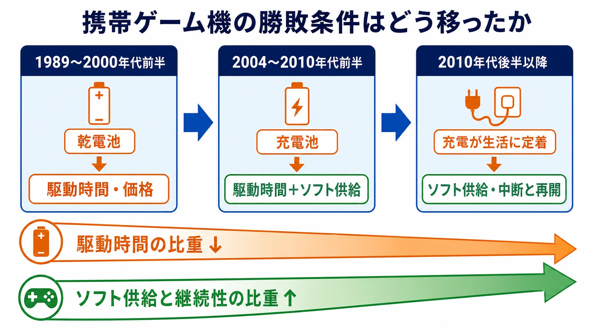
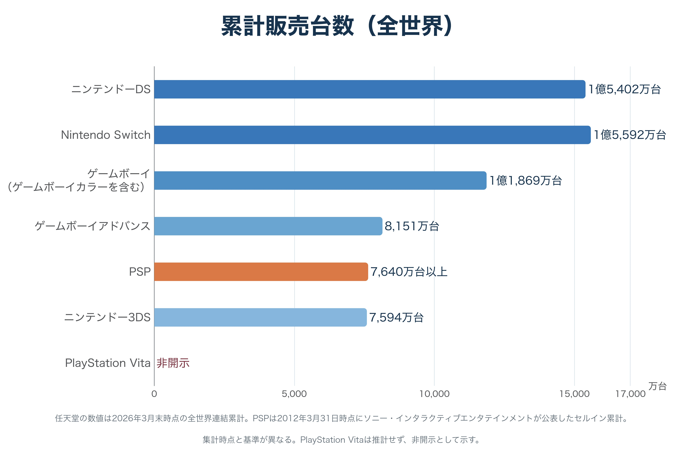
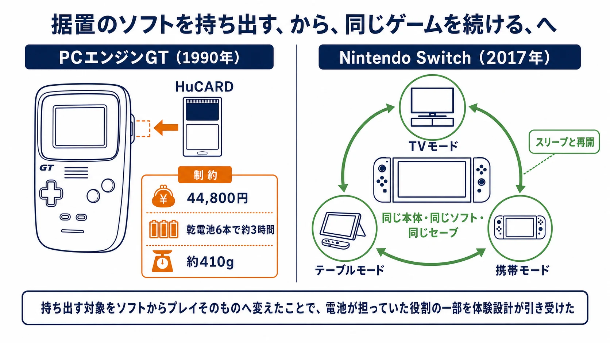

# 携帯ゲーム機はなぜ性能で勝てなかったのか――駆動時間の法則が消えるまで

カラー画面で遊べる。より滑らかに動く。据置機に近い映像が出る。携帯ゲーム機の競争には、性能面で魅力的に見える挑戦者が何度も現れた。

それでも、ゲームギア、アタリ・リンクス、ワンダースワン、PlayStation Vita（以下、PS Vita）は、それぞれの強みを市場の主役という地位へ結び付けられなかった。アタリ・リンクスは国内での存在感が小さかったが、カラー画面と高い表現力を早くから携帯機へ持ち込んだ例である。ここでいう「性能」はCPUの数値だけではない。画面、映像、音、処理能力を含め、同時代の携帯機より豊かな体験を約束する力である。

この反復は、性能が無意味だったことを意味しない。 **携帯機では、性能を味わう前に「一度にどれだけ遊べるか」と「いくらで持ち出せるか」が購入の可否を決める時期があった** ということである。

ただし、この法則は永遠ではなかった。乾電池を買い足していた時代には駆動時間が体験の入口だったが、充電が日々の生活に組み込まれ、スマートフォンが携帯する画面の基準になった後には、同じ数時間の差は勝敗を直接決めにくくなった。以後の中心は、そのハードで遊びたいゲームが継続して供給されるかへ移った。本記事は電池の規制や交換可能性ではなく、この市場の制約がどの時点で別のものへ変わったかを扱う。

***

## 1. 高性能な側が負け続けた、という不思議

ゲームギアは、国産携帯機として初めてバックライト付きカラー液晶を搭載し、テレビチューナーも選択できた。PS Vitaは、4コアCPU、5インチ有機ELディスプレイ、二つのアナログスティックを備え、携帯機として非常に多機能だった。[[1](#ref-1)][[2](#ref-2)] PCエンジンGTは据置PCエンジン用のHuCARDをそのまま使えた。後発のワンダースワンにも、縦横を使い分ける画面と小型・軽量という独自性があった。[[3](#ref-3)][[4](#ref-4)]

だが、豊かな表示や機能を先に積んだからといって、携帯機の中心を取れるわけではない。任天堂の販売実績では、ゲームボーイシリーズは累計1億1,869万台、ゲームボーイアドバンスは8,151万台、ニンテンドーDSは1億5,402万台、ニンテンドー3DSは7,594万台に達している。[[5](#ref-5)] これは個々の競合機の失敗を一つの理由で説明する数字ではない。しかし、性能を前面に出した機種が何度も存在したのに、携帯機市場の大きな基盤が別の条件の上に築かれたことは示している。

この問いを解く鍵は、「携帯」という言葉をサイズではなく運用として読むことにある。鞄へ入ることだけでは足りない。外出先で電源を心配せず、追加の負担なく、遊びたいときに遊べることまで含めて携帯性だった。

  

***

## 2. 第一の答えは「一度に遊べる時間」と価格である

その差がもっとも鮮明なのが、ゲームボーイ（DMG-01）とゲームギアである。

ゲームボーイは単3形マンガン／アルカリ乾電池4本を使い、アルカリ乾電池では約35時間の連続使用を公称した。希望小売価格は8,000円（税別）である。ゲームギアは1990年10月6日に19,800円で発売され、単3アルカリ乾電池6本で約3〜4時間の連続使用だった。[[6](#ref-6)][[1](#ref-1)]

| 比較項目 | ゲームボーイ（DMG-01） | ゲームギア |
| --- | --- | --- |
| 電源 | 単3乾電池4本 | 単3乾電池6本 |
| 公称連続使用時間 | アルカリで約35時間 | アルカリで約3〜4時間 |
| 希望小売価格 | 8,000円（税別） | 19,800円 |

*連続使用時間はソフトや使用条件で変動する公称値である。ゲームボーイとゲームギアの仕様から作成。[[6](#ref-6)][[1](#ref-1)]*

  

公称値を単純に比べれば、遊べる時間は約9〜12倍、概ね10倍の開きがある。本体価格は約2.5倍である。しかも、電池が切れた後に必要な乾電池は4本と6本に分かれる。これは本体を買えるかという一度の判断だけではない。遠出の前に予備を何本用意するか、途中で電池を買うといくらかかるか、子どもが遊ぶ一回分の時間がどこで途切れるかという、繰り返し生じる判断の差だった。

ゲームギアのカラー液晶は、画面自体を光らせるバックライトを備えていた。反射光を使うゲームボーイのモノクロ液晶より、暗い場所で見やすく、色も出せる。その代わり、表示のために継続して電力を使う。当時の乾電池で携帯性を成立させようとすると、画面の豊かさは駆動時間、電池本数、本体価格と衝突した。ゲームギアの公式資料が外部電源や充電式バッテリーパックを併記し、長時間利用には別途ACアダプターが必要になるとも説明するのは、この衝突をよく表している。[[1](#ref-1)]

ここで勝ったのは、画面が劣っていても、持ち出した先で一回の遊びを完走できる側だった。性能比較の前に、性能を使える時間そのものが商品の価値を決めていたのである。

### コラム：PCエンジンGTという、早すぎた答え

PCエンジンGTは1990年12月1日、NECホームエレクトロニクスから44,800円で発売された。PCエンジンのHuCARDを携帯して遊べるという発想は、ソフト資産を持ち出すという点で非常に先進的だった。だが、単3乾電池6本での連続稼働は約3時間、重量は約410gとされる。[[3](#ref-3)]

これは「あまりに高すぎ、あまりに電池の持たない夢のマシン」だった。既存の据置ソフトをそのまま動かす価値を、本体価格と駆動時間の負担が上回ってしまったからである。それでも、「据置と同じゲームを外でも続ける」という発想まで失われたわけではない。この問いは、後のNintendo Switchで別の形を取る。

***

## 3. 駆動時間は必要条件であって、十分条件ではない

ここで法則に反する機種を置く必要がある。ただし、比較の相手を取り違えてはならない。ワンダースワンの発売は1999年3月4日、ネオジオポケットカラーも同年3月であり、これらが同時代に向き合っていたのはゲームボーイアドバンス（2001年3月）ではなく、ゲームボーイカラー（1998年10月）である。[[4](#ref-4)]

そのゲームボーイカラーは単3形アルカリ乾電池2本で約20時間、6,800円だった。[[6](#ref-6)] 対してネオジオポケットカラーは単3乾電池2本で約40時間をうたい、[[7](#ref-7)] 初代ワンダースワンはモノクロ液晶と単3電池1本という構成で、携帯機のなかでも際立って電池に強い側にいた。少なくともモノクロ液晶の時期、電池で優位に立っていたのは挑戦者の側である。

ところが、カラー化がこの優位を削る。バンダイがワンダースワンカラー（2000年12月9日、6,800円）について公表した仕様は、単3アルカリ乾電池1本で最大20時間だった。[[4](#ref-4)] ゲームボーイカラーの約20時間と、ほぼ並んだことになる。電池1本で20時間という数字自体は依然として優秀だが、「桁違いに長く遊べる」という差別化はここで消えた。カラー液晶の電力という代償は、陣営を問わず等しくかかったのである。

同じことは勝者の側でも起きている。任天堂はゲームボーイポケットで、単4形アルカリ乾電池2本・約8時間まで駆動時間を落とした。[[6](#ref-6)] 小型化と3,800円という価格を取るための交換である。駆動時間は長ければ長いほど勝つ、という単純な話ではない。

そして、駆動時間の優位だけでは市場の中心にならなかった。ここで見落としてはならないのは、購入者が本体を買うのは電池を買うためではなく、ゲームを遊ぶためだという当然の事実である。長く動く本体に、次に遊びたい作品が来なければ、長所を使う機会そのものが増えない。

ワンダースワンカラーの発売を告知した資料で、バンダイは初代ワンダースワンの累計出荷155万台、対応ソフト105タイトル（2000年8月末時点）を公表している。[[4](#ref-4)] これは豊富なソフトを支持理由として挙げる発表でもあるが、プラットフォーム間の競争では、本数だけでなく、継続的に大作・定番・シリーズ新作が集まる期待が重要になる。ネオジオポケットカラーも格闘ゲームを中心に明確な魅力を持ったが、携帯機全体の選択肢を一台で引き受けるほどの供給にはなりにくかった。

したがって、駆動時間は「遊べる本体」であるための必要条件である。しかし十分条件ではない。 **電池が一日持つこと** と、 **翌月もその本体を手に取る理由が届くこと** は別の問題である。この二つ目を作るのがソフト供給である。

  

***

## 4. ニンテンドーDS対PSP――法則が最後に強く働いた世代

ニンテンドーDSとPSPの世代は、駆動時間が勝敗要因としてまだ強く働いた最後の局面である。

PSPは、PS2に匹敵する高度な画像処理能力と4.3インチのワイド液晶を掲げ、ゲームソフトで4〜6時間の駆動時間を公表した。ただしこれはSCEの実測値であり、音量を最大値の半分にし、ヘッドフォンを使用し、無線LANを使わないという条件のもとで測られた数字である。[[8](#ref-8)] 一方、ニンテンドーDSは約6〜10時間であり、DS専用ソフトに加えてゲームボーイアドバンス専用ソフトにも対応した。[[9](#ref-9)] 画面の精細さや映像表現でPSPが提示した価値は本物である。それでも、外出中に充電を気にしない時間と、遊べるソフトの裾野を同時に持ったDSは、より広い利用場面へ入り込めた。

DSの累計販売は1億5,402万台、ソフトは9億4,876万本である。[[5](#ref-5)] 対してPSPは7,640万台以上（2012年3月末時点）とされる。[[10](#ref-10)] この差を「電池が長かったから」とだけ読むのは誤りだ。タッチ操作、二画面、低年齢層から大人まで届く題材、既存ソフトとの互換性、開発各社の参加が重なっている。ただし、この世代では、駆動時間の長さがそれらのソフトを遊ぶ入口を広げる役割をまだ果たしていた。

言い換えれば、PSPは性能の代償として遊べる時間を削ったのではない。リチウムイオン充電池によって携帯機の表現力を広げ、4〜6時間という実用的な時間を確保した。しかし、毎日の充電が当然になる前の市場では、さらに長く充電なしで使えることが、より大きな安心として残っていたのである。

***

## 5. ニンテンドー3DS対PS Vita――駆動時間が決め手でなくなる

次の世代では、数字の位置が変わる。ニンテンドー3DSの3DS専用ソフトの駆動時間は約3〜5時間、PS Vita（PCH-1000）のゲーム時の目安も約3〜5時間である。[[11](#ref-11)][[12](#ref-12)] 画面の明るさ、無線通信、遊ぶソフトで実際の時間は変わるが、少なくとも購入時に見る公称レンジはほぼ重なった。もう「十時間対三時間」のように、片方だけが一日の持ち出しを成立させる構図ではない。

同時に、充電は携帯機だけの特別な作法ではなくなった。総務省の統計では、日本のスマートフォン世帯普及率は2010年の9.7％から急速に伸び、2017年には個人のスマートフォン保有率が60.9％に達した。[[13](#ref-13)][[14](#ref-14)] スマートフォンの普及だけで3DSとPS Vitaの競争を説明することはできない。しかし、毎晩あるいは職場や移動中に充電する生活が広がったことで、「充電しないで何十時間も使えるか」は携帯機固有の決定的な問いではなくなったと読める。

このとき中心に残るのは、何を遊べるかである。3DSは累計7,594万台、ソフト3億9,230万本に達した。[[5](#ref-5)] 対してソニーはPS Vitaの全世界累計販売台数を非開示としている。[[10](#ref-10)] ここで非開示の数字を推計で補う必要はない。両機の駆動時間が近い条件では、購入者とソフト会社がどちらへ集まり、そこでしか遊べない作品や継続的な新作がどれだけ生まれるかが、プラットフォームの差を拡大した。

性能、価格、独占作、既存シリーズ、開発費、販売網は互いに影響する。したがって「ソフト供給だけがPS Vitaを負かした」と単純化することもできない。ここで確かなのは、駆動時間の差が主因として働きにくくなった後、ソフト供給を中心とする生態系の差を覆すほどの理由にはならなかったことである。

  

***

## 6. Nintendo Switch――「どこで遊ぶか」ではなく、同じゲームを続ける

初期Nintendo Switchの公称バッテリー持続時間は約2.5〜6.5時間である。『ゼルダの伝説 ブレス オブ ザ ワイルド』では約3時間と案内された。[[15](#ref-15)] これはゲームボーイの35時間どころか、初期の携帯専用機と比べても短い部類である。それでもNintendo Switchは、2026年3月末時点で累計1億5,592万台、ソフト15億2,814万本に達した。[[5](#ref-5)]

成功を「電池が重要でなくなった」の一言で済ませると、Nintendo Switchの設計を取り逃す。任天堂は発表時、テレビにつなぐ家庭用ゲーム機でありながら、6.2インチ画面を備えた持ち運べるゲーム機だと説明した。ドック、携帯モード、Joy-Conによって、同じ本体・同じソフトを遊ぶ場所に応じて切り替える構成である。[[16](#ref-16)]

PCエンジンGTも据置ソフトを外へ持ち出そうとした。しかしNintendo Switchは、携帯版へ移植した別のゲームでも、外出用の縮小版でもなく、テレビの前で始めたゲームを本体ごと移せることを売った。ここでは「据置機か携帯機か」という棚を先に決めない。 **どこで遊んでも、同じゲームを続けられるか** が価値の中心になる。

そのために重要なのが中断と再開の設計である。ゲームを中断してスリープにし、同じソフトを再開する機能はNintendo Switchだけの発明ではない。だが、移動と再開を前提にゲーム全体を組み立てると、電池が担っていた役割の一部を体験設計が引き受けられる。すなわち「次に遊べるまで電池を切らさない」だけでなく、「今やめても、次の短い空き時間に迷わず戻れる」ことが継続の条件になる。Nintendo Switchでも、ドックから外したままスリープを保つ設定が用意されている。[[17](#ref-17)]

短い駆動時間を無視してよい、という意味ではない。三時間しか使えない場面で三時間を超えるセッションを必須にすれば、今でも遊びは途切れる。Nintendo Switchが示したのは、電池性能だけで携帯性を測るのではなく、場所をまたいだ継続性、ソフトの供給、再開のしやすさを一つの提案として設計できるということだ。

実際、任天堂自身が駆動時間を放置したわけでもない。2019年8月30日以降に発売された現行モデルでは持続時間が約4.5〜9.0時間へ延び、『ゼルダの伝説 ブレス オブ ザ ワイルド』でも約5.5時間になっている。[[15](#ref-15)] 電池は単独で勝敗を決める物差しではなくなったが、改善すべき要件であり続けている。

  

***

## 7. いま作り手が握るべき制約

携帯ゲーム機の競争史から得られる教訓は、「高性能は負ける」ではない。性能が使われるための条件が、時代によって変わるということである。

乾電池の時代、1セッションの長さはハードの制約に強く決められた。電池を何本持つか、何時間で切れるか、本体がいくらかが、ゲームを始める前の障壁だった。そこでの勝者は、性能を抑えた側ではなく、性能を持ち出せる時間と価格の中へ収めた側だった。

充電が日常化した後、駆動時間は必要条件として残ったが、単独で勝敗を決める物差しではなくなった。代わりに、遊びたいソフトが届くか、同じゲームを場所を変えて続けられるか、少しの空き時間でも再開できるかが前面に出た。

これは現代のゲーム設計へそのまま持ち帰れる。プレイヤーの1セッションを、ハードの公称駆動時間だけから決めてはならない。中断可能な地点はどこか。再開時に何を思い出させるか。短時間でも進捗や満足を得られるか。長く続けたい人の流れを不必要に切らないか。かつては電池の残量が握っていた制約を、いまは作り手がかなりの範囲で握っている。

携帯ゲーム機が教えるのは、スペック表の外側にある競争である。ハードの能力を問う前に、プレイヤーがその能力へ何分、何度、どんな場所から到達できるのかを設計する。その問いに答え続けることが、性能を実際の体験へ変える。

## References

1. [ゲームギア｜セガハード大百科][1] - 1990年10月6日発売、19,800円、バックライト付き3.2インチカラー液晶、単3アルカリ乾電池6本で約3〜4時間という仕様、および外部電源・充電式バッテリーパックの併記を掲載したセガ公式資料。

2. [PlayStation Vitaの製品仕様を発表したソニーのニュースリリース][2] - PS Vitaの4コアCPU、GPU、5インチ有機ELディスプレイ、入力・通信機能を掲載。

3. [PCエンジンGTが35周年。据置用のPCエンジンのゲームがそのまま遊べたエポックメイキングな携帯ハード][3] - PCエンジンGTの発売日、価格、重量、乾電池駆動時間、HuCARD互換を扱ったファミ通の記事。

4. [「ワンダースワンカラー」2000年12月に発売][4] - バンダイの公表資料。ワンダースワンカラーの2000年12月9日発売・6,800円・単3アルカリ乾電池1本で最大20時間という仕様に加え、初代ワンダースワンの1999年3月4日発売、累計出荷155万台、対応ソフト105タイトル（2000年8月末時点）、縦横両方向での使用を掲載。

5. [ゲーム専用機販売実績][5] - 任天堂の全世界連結累計販売数量。ゲームボーイ、ゲームボーイアドバンス、ニンテンドーDS、ニンテンドー3DS、Nintendo Switchのハード・ソフト実績を掲載。

6. [ゲームボーイ全機種仕様対比表][6] - 任天堂の仕様表。ゲームボーイ（DMG-01）の単3形乾電池4本・マンガン約15時間／アルカリ約35時間・8,000円、ゲームボーイポケットの単4形アルカリ2本・約8時間・3,800円、ゲームボーイカラーの単3形アルカリ2本・約20時間・6,800円を掲載。表記時間は連続使用の場合であり、使用するカートリッジ等によって異なる旨の注記がある。

7. [Neo-Geo Pocket…Color][7] - ネオジオポケットカラーの単3乾電池2本・約40時間という当時の発表を報じたGameSpot記事。

8. [PSP「プレイステーション・ポータブル」（PSP-1000）発売][8] - SCEの発売時発表。PS2に匹敵する高度な画像処理能力、4.3インチワイド液晶、ゲームソフトで4〜6時間という実測値と、その測定条件（音量は最大値の半分、ヘッドフォン使用、無線LAN不使用など）を掲載。

9. [ニンテンドーDS：スペック][9] - DSの約6〜10時間の電池継続時間と、DS・ゲームボーイアドバンス両対応ソフトを掲載した任天堂公式仕様。

10. [ビジネス経緯][10] - ソニー・インタラクティブエンタテインメントの公式ページ。PSPの全世界累計販売台数7,640万台以上（2012年3月31日時点）を掲載し、あわせて「プレイステーション ヴィータ」の数値は非開示と明記している。

11. [社長が訊く『ニンテンドー3DS』：バッテリー持続時間][11] - 3DS専用ソフトで約3〜5時間という目安と、明るさ・3D表示の影響を説明した任天堂の開発者インタビュー。

12. [充電する（PCH-1000シリーズ）][12] - PS Vitaのゲーム時持続時間を約3〜5時間と案内するPlayStation公式ユーザーズガイド。

13. [令和2年版国土交通白書][13] - 総務省資料を基に、スマートフォン世帯普及率が2010年に9.7％だったことを示す白書。

14. [平成30年版情報通信白書：情報通信機器の保有状況][14] - 2017年の個人におけるスマートフォン保有率60.9％を掲載した総務省資料。

15. [Nintendo Switch「バッテリー持続時間が長くなった新モデル」のお知らせ][15] - 任天堂公式。旧モデルは約2.5〜6.5時間（『ゼルダの伝説 ブレス オブ ザ ワイルド』で約3時間）、2019年8月30日以降の現行モデルは約4.5〜9.0時間（同作で約5.5時間）と案内。

16. [Nintendo Switchを2017年3月3日に発売][16] - テレビ接続、携帯モード、ドック、Joy-Conによるプレイスタイルを説明した任天堂の発売発表。

17. [プレイモードと接続方法][17] - Nintendo Switchをドックから取り外したときもスリープ状態を保つ設定を案内する任天堂サポート。

[1]: https://www.sega.jp/history/hard/gamegear/index.html
[2]: https://www.sony.com/ja/SonyInfo/IR/news/sce1_J.pdf
[3]: https://www.famitsu.com/article/202512/58964
[4]: https://www.bandai.co.jp/releases/images/3/204.pdf
[5]: https://www.nintendo.co.jp/ir/finance/hard_soft/index.html
[6]: https://www.nintendo.co.jp/n02/dmg/hardware/gbtaihi/index.html
[7]: https://www.gamespot.com/articles/neo-geo-pocketand133color/1100-2460373/
[8]: https://sonyinteractive.com/uploads/sites/5/2023/02/041027a.pdf
[9]: https://www.nintendo.co.jp/ds/series/ds/spec/index.html
[10]: https://sonyinteractive.com/jp/our-company/business-data-sales/
[11]: https://www.nintendo.co.jp/3ds/interview/hardware/vol2/index3.html
[12]: https://manuals.playstation.net/document/jp/psvita/basic/charge.html
[13]: https://www.mlit.go.jp/common/001370203.pdf
[14]: https://www.soumu.go.jp/johotsusintokei/whitepaper/ja/h30/html/nd252110.html
[15]: https://www.nintendo.com/jp/hardware/switch/had/index.html
[16]: https://www.nintendo.co.jp/corporate/release/2017/170113.html
[17]: https://support.nintendo.com/jp/switch/playmode/index.html

----

この文書は、Perplexity、Claude、OpenAI Codex の3つのAIの支援を受けて著述されたものです。引用画像を除き、MIT License にて提供されています。
