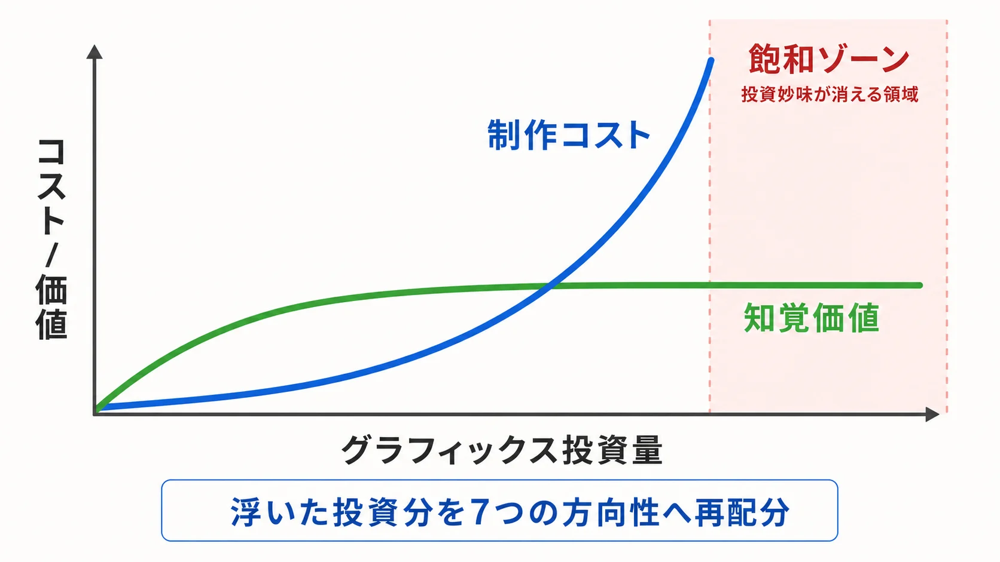
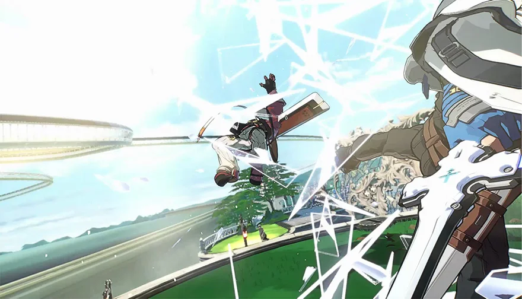
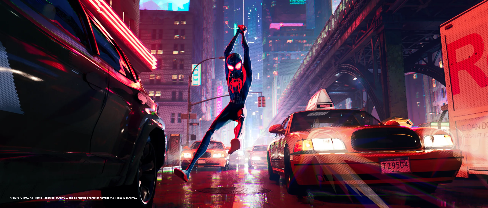
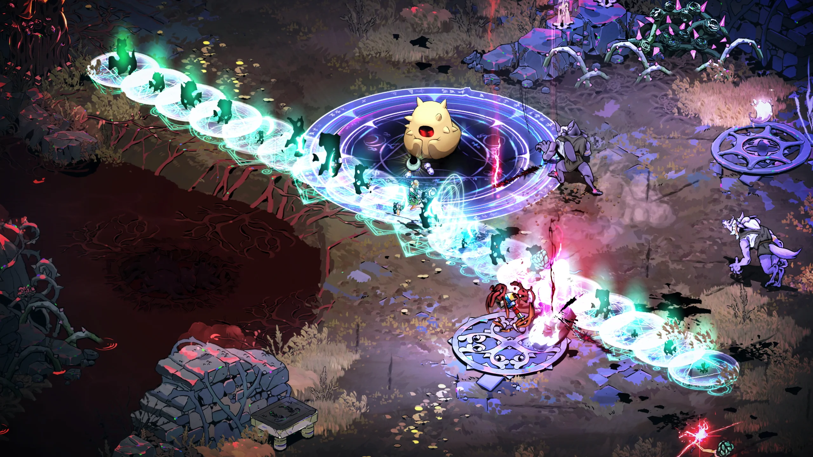
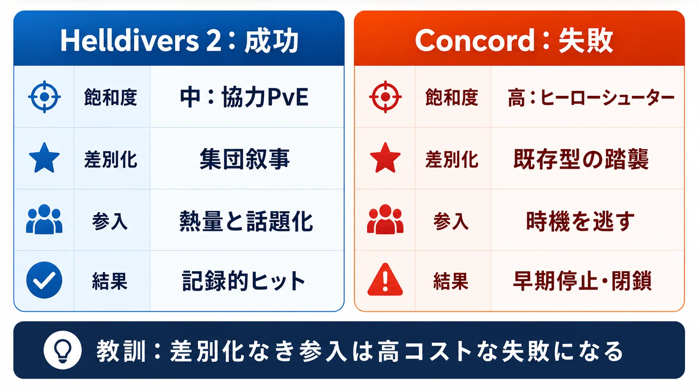
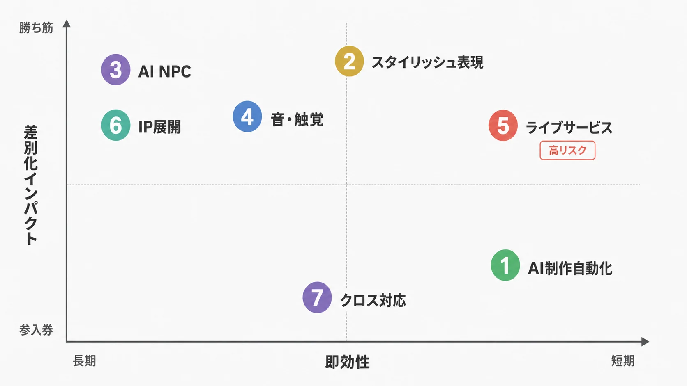
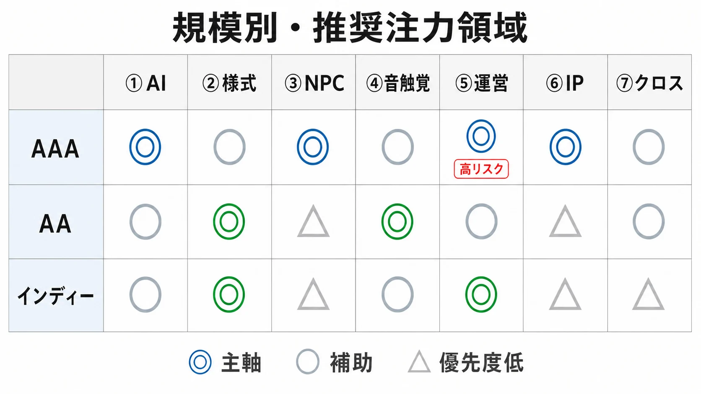

# ゲームのグラフィックスが飽和したその先は — AAA・AA級スタジオが労力を振り向ける7つの方向性

※本記事では、作品内の「世界観」を指す語を「世界設定」と表記する。

----

## エグゼクティブサマリー

フォトリアリズムの追求が限界に近づきつつある今、ゲーム業界は「見た目のリアルさ」から「体験の豊かさ」へとパラダイムシフトしている。Bainの2025年調査では、ゲームを選ぶ最大の理由として「ゲームプレイ」を挙げたプレイヤーは22%であったのに対し、「高品質なグラフィックスや音声」を最重要と答えたのはわずか7%にとどまった。一方でAAA開発コストは膨張を続け、Ubisoftの『Assassin's Creed』には2,000名超、Rockstarの『GTA VI』には全世界の拠点を含めて6,000名以上が関与するなど、AAAスタジオでは数千名規模のスタッフを抱えるプロジェクトが珍しくなくなった。[[1](#ref-1)][[2](#ref-2)]

本記事はこの構造的矛盾を出発点とした、プランナー向けの提案である。論点は単純だ。グラフィックスの限界費用は逓増し、その向上に対する知覚価値は逓減している。ならば「グラフィックスに積み増していたはずのリソースをどこへ振り向けるか」は、もはや技術選定ではなく **設計判断** である。以下では、スタジオが次の競争軸として投資しつつある7つの領域を取り上げ、それぞれについて「現状と具体事例」と「プランナーが今日から検討できる着手の勘どころ」を併記する。

----

## 1. グラフィックス飽和という現実

### フォトリアルへの限界費用増大

グラフィックスのリアルさはすでに「映画の数年前のプリレンダリング品質」に達しており、それ以上の向上に対してプレイヤーが感じる価値は急速に逓減している。実際、直近ではAAAタイトルより小規模のインディー作品のほうが評価が高い事例が増加しており、2024年にはMetacriticのトップ20のうち75%がインディースタジオ作品で占められた（2016年比でほぼ2倍）。Bainの分析は「プレイヤーはグラフィックス以上のものを求めている」という業界の転換点を明確に示している。[[3](#ref-3)][[1](#ref-1)]

ここで押さえるべきは、リアルさの絶対水準ではなく「投じたコストに対して、プレイヤーが追加で感じ取れる価値」の傾きだ。ポリゴン数や4Kテクスチャを倍にしても、プレイヤーの満足度はもはや比例して伸びない。この逓増する費用と逓減する価値の交点こそが「飽和」の正体であり、リソース配分を見直す論拠になる。

*図：グラフィックス投資が増えるほど制作コストは急増し、知覚価値は頭打ちになるという本記事の前提。*

### スタジオへの過負荷と大型レイオフ

グラフィックス品質の追求はアーティストへの深刻な負荷をもたらしている。2023年9月にはEpic Gamesが約830人（全社員の約16%）の大規模リストラを実施し、2024年1月にはRiot Gamesも約530人（全社員の約11%）のレイオフを発表した。2024年だけで業界全体で約14,600人がリストラされたとの集計もある。[[4](#ref-4)][[9](#ref-9)][[5](#ref-5)]

コスト構造の歪みは決算にも表れている。スクウェア・エニックスは2024年3月期決算で約221億円のコンテンツ廃棄損を特別損失として計上し、バンダイナムコも開発中のタイトル5本以上を中止するなど、AAAモデル特有の重い前払いコストが業界全体を揺さぶっている。[[7](#ref-7)][[27](#ref-27)]

### ミドルクラス（AA）の復活

こうした状況の中、30万〜100万本で十分な利益を出せる「ミドルクラス（AA）タイトル」の居場所が改めて確立されつつある。インディースタジオの品質向上も著しく、「AAAかインディーか」という二項対立を超えた多様な市場が形成されている。BCGのレポートは2030年のゲーム産業規模を約3,530億ドルと予測しており、拡大する市場でAAの戦略的価値はさらに増す見込みだ。[[6](#ref-6)][[8](#ref-8)]

----

## 2. スタジオが労力を振り向ける7つの方向性

### 方向性①：AIによるアセット生成と開発パイプラインの自動化

最も即効性の高い変化がAIによる制作コストの削減だ。Houdini・Unreal EngineのPCGフレームワーク・各種AIツールにより、地形生成・マテリアルブレンド・植生配置・プロップ配置といった作業が半自動化されている。ある試算では特定のアセット種類について最大95%の制作時間削減が達成可能とされ、コンセプトスケッチ生成では初期イテレーションサイクルを80%以上短縮できると報告されている。[[9](#ref-9)][[2](#ref-2)]

GDC 2025のレポートによれば、すでに半数以上（52%）のゲーム開発会社が生成AIを実装に活用している。EpicのMetaHuman Creatorは、従来は数週間から数ヶ月かかっていたフォトリアルなデジタルヒューマンの制作を1時間以下に短縮することを可能にした。アニメーションのモーションキャプチャ・クリーンアップでは、AIベースのリターゲティングにより70〜80%の作業削減が報告されている。[[10](#ref-10)][[11](#ref-11)][[2](#ref-2)]

ただし「使える」ことと「使うべき」ことは別だ。象徴的なのが『GTA VI』で、Take-Twoは社内全体で生成AIを広く使う一方、当のGTA VI本体には生成AIを「一切使っていない」と公式に表明している。最大級のフラッグシップが、あえて生成AIを排してでも作家性・手仕事の制御を優先する判断を下した事実は、AIが万能の正解ではなく「どこに効かせるか」を選ぶレバーであることを示している。[[28](#ref-28)]

**プランナーへの示唆** —— AIは「人を置き換える」道具ではなく「人をどの工程に再配置するか」を決める道具として捉えるべきだ。下流の量産工程（地形・植生・LOD・リターゲティング）から自動化を入れ、そこで浮いた人員と時間を、本記事の②〜⑥のような「人にしか出せない差別化」へ振り向ける。エントリーレベルの単純作業職は縮小し、テクニカルアート・AIツールインテグレーター・アートとコードとMLを横断するハイブリッド職の比重が増す前提で、チーム編成を見直したい。[[2](#ref-2)]

### 方向性②：スタイリッシュ表現への回帰とアート方向性の差別化

フォトリアリズム一辺倒からの脱却として、スタイリッシュな非フォトリアル表現（NPR）への投資が顕著に増加している。『スパイダーバース』や『アーケイン』の成功は、2Dと3Dを融合したハイブリッド手法がAAA品質の没入感を生み出せることを実証した。Supergiant Gamesの『Hades II』は独自のスタイリッシュ表現でMetacriticのトップ評価（PC版95点）を獲得し、2025年のMetacritic Game of the Yearに選出されており、「技術的なショーピース」よりも「芸術的なビジョン」の方が記憶に残る体験を生むことを示している。[[12](#ref-12)][[13](#ref-13)][[1](#ref-1)]

この方向性を「気分」ではなく「設計思想」に落とし込んだ好例が、Arc System Worksの『Guilty Gear』シリーズだ。同社は3Dモデルを用いながら、あえて2Dの手描きアニメに見えるよう徹底的に作り込む。技術アーティストはGDC 2015の講演で、「3Dらしく見える要素を見つけたら、それを消す方法を探す」という方針を掲げたと語っている。標準的な3Dソフトが計算する陰影・法線・モーションは“正確すぎる”ために人工的に見えてしまうため、手描きなら生じるはずの不規則さを意図的に戻し、ライティングも物理的正しさを捨ててパーツ単位で手動制御する。『-STRIVE-』のアートディレクターも、「手描きアニメの模倣」ではなく「これがGuilty Gearのアニメーションだ」と感じさせる独自様式の確立を目標に据えたと述べている。重要なのは、これらが特別なハードウェアではなく「ルール化された美学」によって再現されている点だ。[[30](#ref-30)][[29](#ref-29)]

スタイリッシュな表現はリアリズムよりも制作コストが低く、かつ独自のIPアイデンティティを確立しやすい。注目すべき事例として、Bungieの『Marathon』はアートディレクターのJoseph Cross氏によると、開発当初は「高品質リアリズム（high fidelity realism）」を目標としていたが、開発途中で「グラフィック・リアリズム（Graphic Realism）」と呼ぶスタイライズドかつ簡略化されたアプローチへと大きく方向転換した。この決断はコンテンツ制作の効率化と、開発者の負荷軽減を念頭に置いたものと分析されている。[[14](#ref-14)]

**プランナーへの示唆** —— フォトリアルは「誰がやっても似た絵になる」レッドオーシャンであり、勝ち筋は薄い。狙うべきは、自社作品を一目で識別させる「様式のルール化」だ。具体的には、(1) 色設計・線・陰影・省略の方針を明文化したアートバイブルを早期に固める、(2) 物理的正しさより「読みやすさ・記憶に残るシルエット」を優先する判断基準を共有する、(3) その様式が量産時にも破綻しない再現手順（シェーダや命名規則）に落とす。様式が固まれば制作コストは下がり、同時に最大の差別化資産になる。

*画像出典（引用）：Arc System Works, [GUILTY GEAR -STRIVE- 公式サイト](https://www.guiltygear.com/ggst/en/) / セルシェーディング系NPRの例として引用。WebP変換。*

*画像出典（引用）：Sony Pictures, [Spider-Man: Into the Spider-Verse 公式ページ](https://www.sonypictures.com/movies/spidermanintothespiderverse), © 2019 CTMG. All Rights Reserved. MARVEL and all related character names: © & ™ 2019 MARVEL / 2D/3Dハイブリッド表現の例として引用。WebP変換。*

*画像出典（引用）：Supergiant Games, [Hades II 公式サイト / Media Kit](https://www.supergiantgames.com/games/hades-ii/), © Supergiant Games / ペインタリー系のインゲーム表現の例として引用。WebP変換。*

### 方向性③：AI駆動NPCと動的ナラティブシステム

かつてゲームAIが「巡回ルート・固定台詞・予測可能な行動」を担っていた時代は終わりつつある。NVIDIA ACEとInworld AIが率いる「自律型AIキャラクター」革命が、NPCをスクリプトの呪縛から解放しようとしている。[[15](#ref-15)]

NVIDIAはCES 2025でACE（Avatar Cloud Engine）を「ACE Autonomous Game Characters」として大幅に拡張し、単なる会話NPCから「プレイヤーの目標を理解して支援するコンパニオン」「プレイヤーの戦術に動的に適応する敵」へと進化させた。KRAFTON（クラフトン）の『inZOI』では、Co-Playable Character（CPC）「Smart Zoi」が実験的機能として実装され、有効化したNPCが自律的に目標を持ち環境に反応する都市シミュレーションが実現した。[[15](#ref-15)]

Inworld AIはUbisoft・NVIDIAとGDC 2024で「NEO NPCs」を共同デモし、Inworldのキャラクターエンジン・LLM技術とNVIDIA Audio2Faceを組み合わせ、プレイヤーの音声入力に動的に応答するNPCのプロトタイプを示した。プロシージャルなストーリーイベントや、プレイヤーの選択に有機的に応答する分岐ストーリーも実用段階に入りつつある。[[16](#ref-16)][[17](#ref-17)][[10](#ref-10)]

**プランナーへの示唆** —— 「全NPCをLLM化」は誤った目標だ。生成型AIは予測不能性を持ち込むため、体験設計上のコントロールと相性が悪い（後述の課題も参照）。現実的な勝ち筋は、(1) メインの物語幹は従来通り作家が手で書き、(2) 周縁の雑談・環境反応・反復クエストといった「制御を失っても破綻しない層」にAIを限定投入する、というハイブリッドだ。まずは「このNPCがプレイヤーの行動を覚えていて言及する」程度の小さな自律性から始め、体験の手触りが向上する箇所を特定してから投資を広げるとよい。

### 方向性④：空間オーディオと多感覚没入の強化

視覚的リアルさの追求から離れた先で、オーディオ体験が次の差別化軸になっている。リアルタイムのオーディオレイトレーシングを用いた空間音響技術は、「バーチャル環境内で音がどのように振る舞うか」を物理的にシミュレートし、没入感を視覚とは独立した軸で劇的に向上させる。[[3](#ref-3)]

この軸を「中核体験」にまで引き上げた代表例が、Ninja Theoryの『Hellblade』シリーズだ。主人公セヌアの精神病（サイコシス）が聞かせる「頭の中の声」は、頭部を模したマイクによるバイノーラル録音で収録され、プレイヤーの頭の周囲を声が回り込むように再生される。これは単なる演出ではなく、サイコシスという主題そのものをゲーム機構として成立させる設計だ。続編『Hellblade II』ではGDC 2025の講演で音響設計が詳述され、岩に反響する声、近づき遠ざかる音といった音響挙動を現実同様にシミュレートして没入感をさらに深めたと語られている。注目すべきは、初代が「インディーAAA」と称される控えめな予算規模でありながら、音を主軸に据えることで突出した体験を成立させた点である。[[31](#ref-31)][[32](#ref-32)]

PS5のDualSenseコントローラーが示したハプティクス技術も重要な方向性だ。レーシングゲームの路面の凸凹、銃の反動、キャラクターへのダメージが「触感」として伝わることで、プレイヤーとゲーム世界の情緒的・身体的な繋がりが強化される。[[18](#ref-18)]

**プランナーへの示唆** —— 視覚予算を積み増す前に、「この体験は音や触覚だけでどこまで成立するか」を一度問い直す価値がある。音・触覚は視覚に比べて単位コストあたりの没入感リターンが高く、中規模予算でも“突き抜けた”一点突破を作りやすい。設計上は、(1) ゲームの中核情緒（恐怖・緊張・没入）を音で表現できないか早期に検証する、(2) ハプティクスを「演出の飾り」ではなく「情報伝達の経路（路面状態・ダメージ・残弾）」として機構に組み込む、という順で考えたい。なおバイノーラルや3D音響はヘッドホン前提の設計になりやすいため、スピーカー環境でのフォールバックも要件に含めること。

### 方向性⑤：ライブサービスとGames-as-a-Platform

「パッケージを売り切る」モデルから「長期的なエコシステムを運営する」モデルへの移行が加速している。Newzooの2025年レポートによれば、2024年のPC向けゲーム収益のうち58%（約244億ドル）がマイクロトランザクション（ライブサービスゲーム関連の課金）であった。DLC・エクスパンション・ライブアップデートはYear 1以降の生涯収益の20〜25%を占めるようになっている。[[19](#ref-19)][[20](#ref-20)]

FortniteとRobloxに代表されるGames-as-a-Platformは年間二桁成長を続けており、プレイヤー・クリエイター・ブランドを引き寄せる「重力の中心」となっている。スタジオの労力は「ゲームのリリース」から「ゲームという生態系の維持・育成」へと大きくシフトしている。[[21](#ref-21)][[22](#ref-22)][[1](#ref-1)]

この方向性で重要なのは、ライブサービスが「叙事を運営する」設計だという点だ。好例がArrowhead Game Studiosの『Helldivers 2』である。同作の「銀河大戦（Galactic War）」は、運営側のゲームマスター（通称Joel）が戦況マップを実時間で操作し、プレイヤーの集団的な勝敗が物語を実際に動かす反応型の叙事になっている。惑星マレヴェロン・クリークの攻防はその象徴で、コミュニティの集団行動が公式の歴史的事件として記録され、非プレイヤー層を巻き込む話題にまで発展した。開発側は「数百万人規模のプレイヤーが、自分の行動が物語を形づくっていると実感できること」を運営の中核に据えている。[[34](#ref-34)][[35](#ref-35)]

一方で、ライブサービスは「やれば当たる」領域ではない。SonyのヒーローシューターConcordは、開発費が報道で2億〜4億ドル規模とされた（数字には元開発者による否定もあり諸説ある）が、飽和したジャンルで差別化を欠いたまま発売され、まもなく（報道では約2週間以内）サービスを停止、開発元Firewalk Studiosも閉鎖に追い込まれた。同じ「叙事を運営する」設計でも、Helldivers 2が成功しConcordが失敗した差は、ジャンルの飽和度・差別化・参入タイミングの読みにあった。[[33](#ref-33)]

*図：ライブサービスの成否を、ジャンル飽和度・差別化・参入タイミング・結果の4軸で比較したもの。*

**プランナーへの示唆** —— ライブサービスは「収益モデル」である前に「長期運営という巨大な追加コミットメント」だ。着手前に問うべきは「このゲームには、プレイヤーが何百時間も帰ってくる理由＝運営する叙事やコミュニティの核があるか」である。設計の要点は、(1) プレイヤーの行動が世界に可視の影響を残す仕組み（共有される歴史）を作る、(2) コスメティック課金などの収益化を「搾取的でない」水準に抑え信頼を積む、(3) 飽和ジャンルに後発で全力投入しない。運営し切れる体力がなければ、売り切り型やAA規模の「狭く深い」設計のほうが期待値は高い。

### 方向性⑥：フランチャイズIPの深耕とトランスメディア展開

高品質なグラフィックスへの投資が難しくなる中、既存IPへの「品質保証」という信頼資本が代替的な競争優位になっている。リメイク・リマスターはかつての「低労力プロジェクト」から「フランチャイズ延命の戦略的手段」へと再定義された。セガ原作・Paramount Pictures製作の『ソニック・ザ・ヘッジホッグ』映画三部作は全世界で10億ドル超の興行収入を生み出しており、ゲームIPの映像・商品展開が無視できない収益源となっている。[[20](#ref-20)][[23](#ref-23)]

トランスメディア展開の効果は、映像から本編ゲームへの「逆流」としても表れる。Amazonの実写ドラマ『Fallout』の配信後、2015年発売の『Fallout 4』の欧州売上は前週比で桁違い（報道では約7,500%増）に急伸し、欧州の週間売上首位に立った。シリーズ全体では1日で数百万人規模の新規・復帰プレイヤーが流入し、旧作群が軒並み売上・同時接続数を伸ばした。映像化はもはや単なる宣伝ではなく、休眠していたIP資産を再び収益化する装置として機能している。[[36](#ref-36)]

BCGは2030年に向けて、トップ級の開発者はブランド・フランチャイズ・IP管理・サブスクリプション戦略へのさらなる投資が必要になると予測している。スタジオの資産はコードやグラフィックスだけでなく、プレイヤーコミュニティとIPそのものになっていく。[[24](#ref-24)]

**プランナーへの示唆** —— IPは「作って終わり」ではなく「手入れして育てる」資産だ。新規プロジェクトでも、(1) キャラクター・世界設定・象徴的モチーフを、ゲーム外（映像・グッズ・コミック）でも展開できる粒度で最初から設計する、(2) 旧作を「いつでも遊べる状態」に保つ（現行機対応・ストア露出）ことで、映像化などの話題が起きた瞬間に売上へ変換できる導線を確保する。映像化が決まってから慌てるのではなく、波が来たときに乗れる準備を平時から仕込んでおくのが要点である。

### 方向性⑦：クラウドゲーミングとクロスプラットフォーム対応

クラウドゲーミング収益はBCGの最新試算で2025年の約14億ドルから2030年には183億ドルへ拡大する見通しで、年平均成長率は54%超とされる。これは端末スペックに依存しない体験提供モデルであり、グラフィックスのハードウェア競争から部分的に解放される可能性を持つ。スタジオはPC・コンソール・モバイル・クラウドのすべてに適応するスケーラブルなアーキテクチャ設計に労力を割かなければならなくなっている。[[8](#ref-8)][[21](#ref-21)]

クロスプラットフォームの進行データ共有はすでに「当然のもの」としてプレイヤーに期待されており、技術インフラへの投資は単なる付加価値ではなく、市場参加のための前提条件となりつつある。[[19](#ref-19)]

**プランナーへの示唆** —— この方向性は「差別化」ではなく「入場券」だと割り切るべきだ。クロスセーブ・クロスプレイ・低スペック端末への適応は、もはや無いと減点される前提機能になっている。設計初期から、(1) UI/入力をタッチ・コントローラ・キーボードで成立させる、(2) セーブデータとプログレッションをアカウント基盤に紐づけ端末非依存にする、(3) アセットとフレームレートをスケーラブルに設計し、クラウドや低スペック環境でも体験が崩れない下限を定義する。後付けは高コストになるため、要件として最初から織り込む。

----

## 3. 方向性の整理：注力領域ポジショニングマップ

7つの方向性は、横軸に「即効性（短期で効くか・長期で効くか）」、縦軸に「差別化インパクト（参入券か・勝ち筋か）」を取ると見通しがよい。AI制作自動化は即効性が高いが単体では差別化になりにくく（むしろ参入障壁の低下を招く）、アート様式・音/触覚・運営する叙事は立ち上がりに時間はかかるが差別化の核になりうる。

*図：7つの方向性を、短期で効くか、差別化の核になるかという2軸で整理したもの。*

下表は各方向性の性質を一覧化したものである。

| 方向性 | 主な受益者 | 対アーティスト負荷 | 投資規模 | 即効性 |
| ------------------ | ---------- | --------------------- | ----- | ----- |
| ①AI制作パイプライン自動化 | AAA・AA全般 | 大幅削減（一部タスクで80〜95%）[[9](#ref-9)] | 中〜大 | 高 |
| ②スタイリッシュ表現への転換 | AA・インディー中心 | 削減（制作コスト低下）[[29](#ref-29)] | 中 | 中 |
| ③AI NPC・動的ナラティブ | AAA大手 | 中程度増加（システム設計）[[17](#ref-17)] | 大 | 低 |
| ④空間オーディオ・ハプティクス | AAA・AA全般 | 小〜中（専門職増加）[[32](#ref-32)][[3](#ref-3)] | 中 | 中 |
| ⑤ライブサービス・GaaS | AAA・大手AA | 継続的増加（運営コスト）[[21](#ref-21)] | 大（継続） | 低 |
| ⑥フランチャイズIP・トランスメディア | AAA大手 | 変動（プロジェクト依存）[[23](#ref-23)] | 大 | 中 |
| ⑦クラウド・クロスプラットフォーム | AAA・AA全般 | 変動（技術負荷増）[[19](#ref-19)] | 大 | 低 |

----

## 4. どこから手をつけるか — プロジェクト規模別の着手指針

7方向性すべてに均等に投資できるスタジオは存在しない。重要なのは、自社の規模と強みに合う組み合わせを選ぶことだ。以下に規模別の典型的な勝ち筋を示す。

### AAA（大手）

体力を活かして「規模の経済が効く領域」へ再投資するのが基本線だ。まず①のAI制作自動化で量産工程のコストを圧縮し、そこで捻出したリソースを③AI NPC・⑤ライブサービス運営・⑥IPトランスメディアへ振り向ける。ただし⑤は最大の地雷原でもある。飽和ジャンルへ差別化なく全力投入すると、Concordのように回収不能な失敗になりうるため、参入の是非はジャンル飽和度と差別化の核の有無で厳しく判断する。

### AA（ミドルクラス）

フォトリアル競争からは降りるべきだ。②スタイリッシュ表現と④音・触覚で「狭く深い」一点突破を作るのが王道になる。Helldivers 2型の「運営する叙事」やHellblade型の「音で成立する中核体験」は、数千名規模を要さずとも勝負できることを実証した。30万〜100万本で黒字化する設計を前提に、差別化の核を1つに絞って磨き込むのが効率的だ。[[6](#ref-6)]

### インディー

①のAIツールで制作の足回り（量産・反復作業）を底上げしつつ、②アート様式の独自性と⑤コミュニティ運営で戦う。Bainが指摘する「エージェンティックAIは大規模スタジオのコストを下げる一方、小規模競合の参入障壁も下げる」という逆説は、インディーにとっては追い風だ。限られたリソースを「一目で識別される様式」と「熱量の高いコミュニティ」に集中させたい。[[1](#ref-1)]

*図：AAA・AA・インディーそれぞれに向く注力領域を、主軸・補助・優先度低の3段階で整理したもの。*

----

## 5. 残された課題と不確実性

AIによる制作自動化が進む一方で、インディースタジオへの技術普及によってAAA独自の参入障壁が崩れるという逆説的なリスクも存在する。Bainの分析では「エージェンティックAIは大規模スタジオの開発コストを削減する一方で、小規模な競合者の参入障壁も下げる」と指摘されている。[[1](#ref-1)]

AI NPC・生成型ナラティブについては、GDC 2025の報告にあるように「開発者はプレイヤー体験への高いコントロールを求めており、AIが生成するコンテンツの予測不能性が実用化の壁になる」という懸念も残る。リアルタイムの生成AIモデルをスケールで運用するコストも、特に中規模スタジオには大きな課題だ。[[25](#ref-25)]

感情認識や行動トラッキングを活用したアダプティブシステムは、エンゲージメント向上の可能性と同時に、過度のプレイ誘導・依存性助長というエシカルリスクをはらんでいる。スタジオはこの設計責任と向き合う必要がある。[[26](#ref-26)]

----

## 結論

グラフィックスの飽和は「ゲームの限界」ではなく、「体験の再定義」の始まりである。プレイヤーが本当に求めているのは「もっと細かいポリゴン」ではなく、「自分がそこにいると感じられる体験」「予測不能なドラマ」「長期にわたって楽しめるエコシステム」だ。AIによる制作効率化で回収した労力を、アート様式の差別化・多感覚設計・NPC知性・運営する叙事・IPの深耕へと振り向けるスタジオが、次のプレイヤーの忠誠を獲得するだろう。どの方向性に賭けるかは、自社の規模と強みに依存する——だが共通する原則は一つだ。AAAの地位はグラフィックス品質で守るのではなく、体験の深さとIPの力で守る時代が来ている。

----

## References

1. [Squeezed in the Middle: AAA Gaming Studios Must Adapt ｜ Bain & Company][1] - Bain Gaming Report 2025の中核章。22%/7%調査結果、Metacritic top 20の75%がインディー、AA・AAAのCAGR比較等の一次資料。

2. [The Future of AAA: How Rising Budgets and AI Are Transforming Game Production ｜ CGMagazine][2] - AAA予算とAIによる制作変革の分析記事。AIリターゲティング70-80%削減、PCG・Houdini活用等。

3. [The Evolution of Gaming Technology: What's New in 2025 ｜ Glide Magazine][3] - 空間オーディオ・レイトレーシングオーディオの動向。

4. [Variety: Fortnite Developer Epic Games Axing 16% of Staff, Laying Off 830 Employees][4] - Epic Games 2023年9月のレイオフ第一報（830人/16%）。

5. [Game Industry Layoffs: 14,600 people lost their jobs in 2024 ｜ GameDev Reports][5] - 2024年業界レイオフ集計（GameIndustryLayoffs.comの集計データを基にした分析）。

6. [Global Indie Games Market Report 2024 ｜ Video Game Insights (PDF)][6] - インディー市場のセグメンテーション一次資料。中規模市場（middle market）を「15-50人チーム、20-100万本売上、$1,000万収益」と定義。

7. [4Gamer: スクウェア・エニックスHD，コンテンツ制作勘定の廃棄損として特別損失を約221億円計上する見込み][7] - 2024年4月30日のスクエニ221億円特損発表の一次報道。

8. [Gaming Industry Emerges from Post-Pandemic Slump ｜ BCG Press Release][8] - BCG Video Gaming Report 2026の公式プレスリリース。2030年市場規模3,530億ドル予測、クラウドゲーミング2025年14億ドル→2030年183億ドル。

9. [Riot Games lays off 530 employees, will close Riot Forge ｜ PC Gamer][9] - Riot Games 2024年1月の530人/11%レイオフの報道。

10. [GDC 2025 State of the Game Industry Report ｜ GDC公式][10] - GDC公式調査レポート。生成AI実装率52%、個人使用率36%、開発者の生成AIへの懸念30%等。

11. [Announcing MetaHuman Creator: Fast, High-Fidelity Digital Humans in Unreal Engine ｜ Epic Games][11] - Epic公式発表。デジタルヒューマン制作を「数週間〜数ヶ月から1時間以下に短縮」。

12. [2025年に注目のアニメーショントレンド16選 ｜ GarageFarm][12] - 2D/3Dハイブリッド、『スパイダーバース』『アーケイン』等のスタイル動向。

13. [Hades II - Metacritic（公式評価ページ）][13] - Hades II（PC版95、Switch版95、Switch 2版94）の Metacritic公式スコアおよび2025 Game of the Year選出の一次データ。

14. [Exit Interview: Joseph Cross ｜ ReaderGrev][14] および [Episode 95 - Joseph Cross ｜ The Learn Squared Podcast (Apple Podcasts)][15] - Marathon元アートディレクター・Joseph Cross氏への詳細インタビュー。「1年以内にやや写実的なスタイルからスタイライズドへ転換した」発言、および「Graphic Realism」という用語の定義について本人が直接語った一次資料（2025年4月配信ポッドキャスト + 2026年1月インタビュー）。

15. [NVIDIA Redefines Game AI With ACE Autonomous Game Characters ｜ NVIDIA][16] - CES 2025発表のACE Autonomous Game Characters公式情報。inZOIのSmart Zoi、PUBG Allyの実装詳細。

16. [AI-powered gameplay in experiences from Ubisoft, NVIDIA, Xbox, and indie devs at GDC 2024 ｜ Inworld AI][17] - GDC 2024でのNEO NPCs（Ubisoft）共同発表の一次資料。

17. [Ubisoft debuts GenAI-powered Neo NPCs and gameplay prototype ｜ GamesBeat][18] - GDC 2024でのNEO NPCs公開の詳細報道。Xavier Manzanares氏（Ubisoftプロデューサー）のコメント等。

18. [How PS5's DualSense controller is making EA Sports F1 22 an incredibly authentic racing experience ｜ PlayStation Blog（公式）][19] - PlayStation公式ブログ。DualSenseのハプティクス・アダプティブトリガーがレーシングゲームでどのようにアセット化されているかの一次資料。

19. [The PC and Console Gaming Report 2025 ｜ Newzoo（公式PDF）][20] - Newzoo公式レポート。2024年PCゲーム収益のうちマイクロトランザクション58%（約244億ドル）、DLC 14%（約53億ドル）、プレミアム 28%（約107億ドル）の内訳一次データ。

20. [Game Industry In 2025: The Trends Defining How Studios Will Build ｜ Gianty][21] - Newzoo 2025レポートに基づく業界動向総覧。

21. [AAA Game Development & Studio Strategies: 2026 Guide ｜ Juego Studio][22] - GaaS、ライブサービス戦略についての業界解説。

22. [Games industry in 2026 and beyond: is user-generated content the future? ｜ Taylor Wessing][23] - UGC・GaaS動向に関する法律事務所による分析。

23. [Sega Press Release: Sonic the Hedgehog 3 Movie Box Office Surpasses $425 Million Worldwide][24] - セガ公式発表。Sonic映画三部作累計10億ドル超達成の一次資料。

24. [Video Gaming Report 2026: The Next Era of Growth ｜ BCG][25] - BCG Video Gaming Report 2026本編。クラウドゲーミング・サブスクリプション・IP戦略の予測。

25. [GDC 2025: Beyond prototypes to production AI ｜ Inworld AI][26] - Inworld公式GDC 2025レポート。AI NPC実用化の課題（コントロール、コスト、予測可能性）に関する一次資料。

26. [The Ethics of AI in Games ｜ arXiv (David Melhart et al., 2023)][27] - 感情認識・アダプティブシステムのエシカルリスクに関する学術論文。Affective Game Loop（感情の引き出し→感知→検出→適応）の各段階における倫理的課題（プライバシー、透明性、ダークパターン、依存性の助長）を体系的に論じる一次資料。ACM Foundations of Digital Games 2025発表の関連論文も参照可能。

27. [バンダイナムコグループ 2024年3月期 第3四半期 決算説明会（質疑応答概要） ｜ バンダイナムコ公式PDF][28] - バンダイナムコ公式IR資料。「5タイトル以上の開発中止」の一次情報源。

28. [Generative AI Has "Zero Part" In GTA 6 Despite Widespread Use Across Take-Two ｜ GameSpot][29] - 2026年2月。Take-Two CEO Strauss Zelnick氏が「GTA VIには生成AIは一切使われていない」と公式表明。AAA大作の生成AI採用状況の最新一次情報。

29. [How Guilty Gear -Strive- hits an ultra combo with groundbreaking visuals and gameplay ｜ Unreal Engine（Epic Games）][30] - Arc System Works開発陣への公式インタビュー。3Dモデルで2D手描き表現を実現する設計思想、パーツ単位の手動ライティング制御、独自様式の確立を目標とした旨の一次資料。

30. [Guilty Gear Xrd's Art Style: The X Factor Between 2D and 3D（GDC 2015） ｜ Arc System Works公式][31] - 技術アーティストJunya C Motomura氏によるGDC 2015講演の公式公開ページ。「3Dらしく見える要素を消す」アプローチを含むNPR技法の一次資料。

31. [How Ninja Theory created Hellblade II's unsettling soundscape ｜ Game Developer][32] - GDC 2025でのNinja Theory音響設計講演の詳細報道。バイノーラル録音・頭部模擬マイク・音響挙動シミュレーションに関する一次的解説。

32. [Headphones Required - Senua's Saga: Hellblade II's Binaural Audio ｜ Xbox Wire（公式）][33] - Xbox公式。音響ディレクターDavid Garcia Diaz氏インタビュー。バイノーラル音響を体験の中核に据えた設計の一次資料。

33. [Concord's Post-Mortem: One Year Later ｜ TheSixthAxis][34] - Concordの開発費（推定2億〜4億ドル、確定値は非公表）、早期サービス停止、Firewalk Studios閉鎖、Sonyのライブサービス方針見直しを整理した検証記事。

34. [Galactic War Stories: The Live Narrative of Helldivers 2（devcom 2025講演）][35] - Arrowhead Game Studiosによる「銀河大戦」のライブ叙事設計に関する講演。数百万人規模のプレイヤーが物語を形づくる反応型運営の一次的説明。

35. [How Helldivers 2 Became a Viral Gaming Phenomenon ｜ TechTimes][36] - 惑星マレヴェロン・クリークの集団行動、ゲームマスター主導の反応型叙事、コミュニティ駆動の拡散に関する分析。

36. [Fallout Games Attract 5 Million Users in One Day Due to Popularity Surge ｜ Push Square][37] - Amazonドラマ配信後のFalloutシリーズ売上・同接急増（Fallout 4 欧州売上 約7,500%増、全シリーズ1日約500万人）に関する報道。

[1]:	https://www.bain.com/insights/squeezed-in-the-middle-aaa-gaming-studios-must-adapt-gaming-report-2025/
[2]:	https://www.cgmagonline.com/articles/budgets-ai-are-transform-games/
[3]:	https://glidemagazine.com/314357/the-evolution-of-gaming-technology-whats-new-in-2025/
[4]:	https://variety.com/2023/digital/news/epic-games-layoffs-830-employees-fortnite-bandcamp-1235738980/
[5]:	https://gamedevreports.substack.com/p/game-industry-layoffs-14600-people
[6]:	https://app.sensortower.com/vgi/assets/reports/VGI_Global_Indie_Games_Market_Report_2024.pdf
[7]:	https://www.4gamer.net/games/999/G999905/20240430049/
[8]:	https://www.bcg.com/press/9december2025-gaming-industry-emerges-from-post-pandemic-slump-gamers-playing-more
[9]:	https://www.pcgamer.com/riot-games-layoffs-2024/
[10]:	https://gdconf.com/article/gdc-2025-state-of-the-game-industry-devs-weigh-in-on-layoffs-ai-and-more/
[11]:	https://www.epicgames.com/site/en-US/news/announcing-metahuman-creator-fast-high-fidelity-digital-humans-in-unreal-engine
[12]:	https://garagefarm.net/jp-blog/16-animation-trends-to-watch-in-2025-key-insights
[13]:	https://www.metacritic.com/game/hades-ii/
[14]:	https://www.readergrev.com/p/exit-interview-joseph-cross-marathon
[15]:	https://podcasts.apple.com/au/podcast/episode-95-joseph-cross/id1518651281?i=1000703032190
[16]:	https://www.nvidia.com/en-us/geforce/news/nvidia-ace-autonomous-ai-companions-pubg-naraka-bladepoint/
[17]:	https://inworld.ai/blog/gdc-2024
[18]:	https://gamesbeat.com/ubisoft-neo-npcs-nvidia-inworldai-gdc/
[19]:	https://blog.playstation.com/2022/06/20/how-ps5s-dualsense-controller-is-making-ea-sports-f1-22-an-incredibly-authentic-racing-experience/
[20]:	https://resources.newzoo.com/hubfs/Free%20Reports/PC%20and%20Console%20Report/2025_Newzoo_The%20PC%20and%20Console%20Gaming%20Report.pdf
[21]:	https://www.gianty.com/game-industry-in-2025-and-the-trends-in-2026/
[22]:	https://www.juegostudio.com/blog/guide-to-aaa-game-development-and-studio-strategies
[23]:	https://www.taylorwessing.com/en/insights-and-events/insights/2026/03/games-industry-in-2026-and-beyond
[24]:	https://www.sega.co.jp/en/release/250122_1.html
[25]:	https://www.bcg.com/publications/2025/video-gaming-report-2026-next-era-of-growth
[26]:	https://inworld.ai/blog/gdc-2025
[27]:	https://arxiv.org/pdf/2305.07392
[28]:	https://www.bandainamco.co.jp/files/ir/financialstatements/pdf/20240214_qa.pdf
[29]:	https://www.gamespot.com/articles/generative-ai-has-zero-part-in-gta-6-despite-widespread-use-across-take-two/1100-6537900/
[30]:	https://www.unrealengine.com/en-US/developer-interviews/how-guilty-gear--strive--hits-an-ultra-combo-with-groundbreaking-visuals-and-gameplay
[31]:	https://www.arcsystemworks.com/guilty-gear-xrds-art-style-the-x-factor-between-2d-and-3d-talk-from-gdc-2015-is-now-available-online/
[32]:	https://www.gamedeveloper.com/audio/how-ninja-theory-created-hellblade-ii-s-unsettling-soundscape
[33]:	https://news.xbox.com/en-us/2024/05/17/hellblade-2-audio-design-is-like-nothing-youve-ever-heard/
[34]:	https://www.thesixthaxis.com/2025/09/06/concords-ps5-cancelled-shut-down-offline/
[35]:	https://bizcommunity.gamescom.global/widget/event/devcom-developer-conference-2025/planning/UGxhbm5pbmdfMjcxNjUyNQ==
[36]:	https://www.techtimes.com/articles/314268/20260124/how-helldivers-2-became-viral-gaming-phenomenon-without-spending-millions-marketing.htm
[37]:	https://www.pushsquare.com/news/2024/04/fallout-games-attract-5-million-users-in-one-day-due-to-popularity-surge

----

この文書は、Perplexity、Claude、OpenAI Codex の3つのAIの支援を受けて著述されたものです。引用画像を除き、MIT License にて提供されています。
