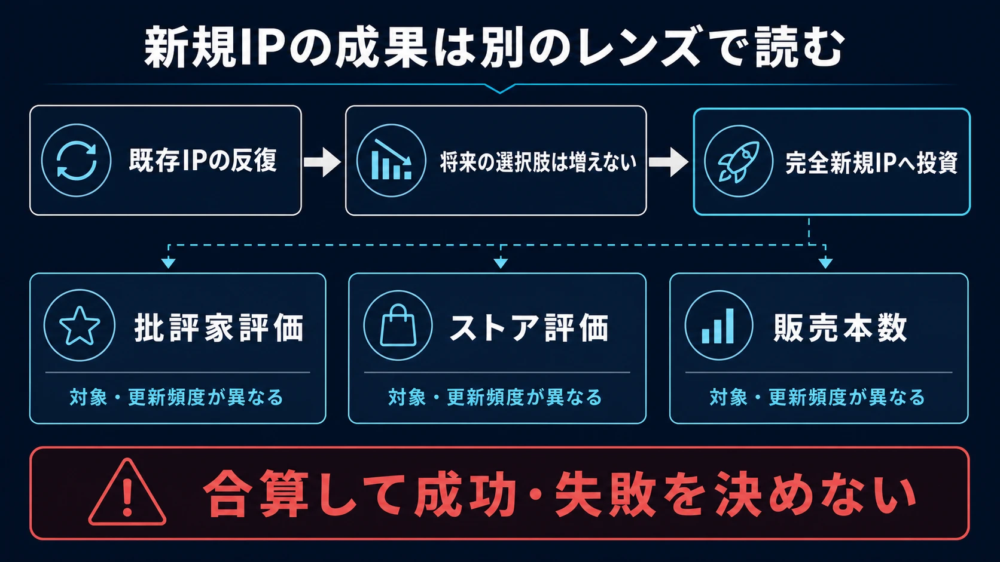
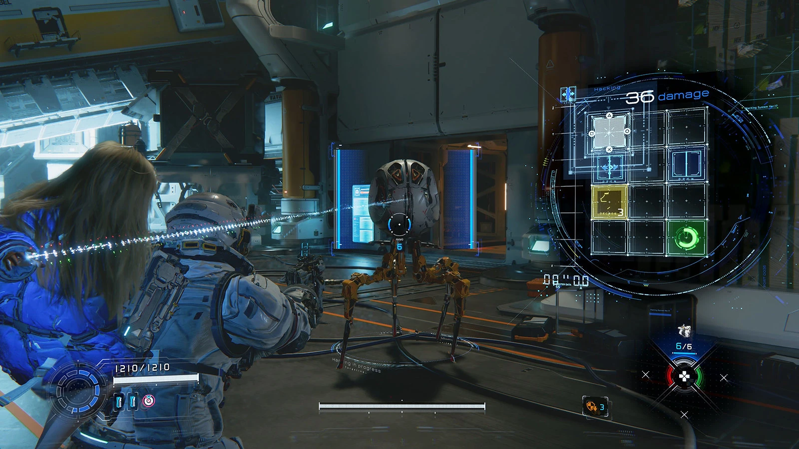
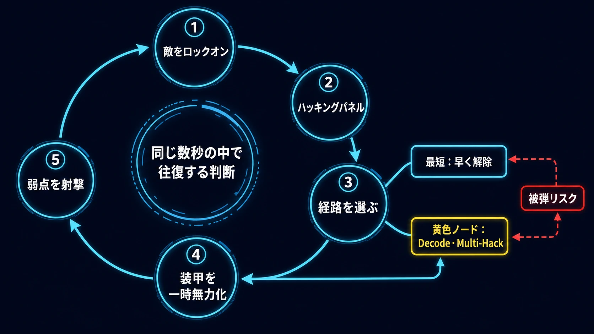
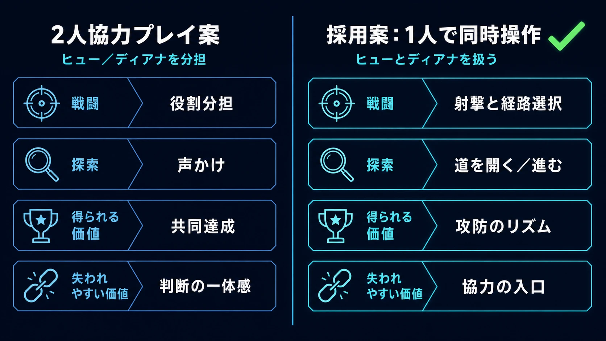
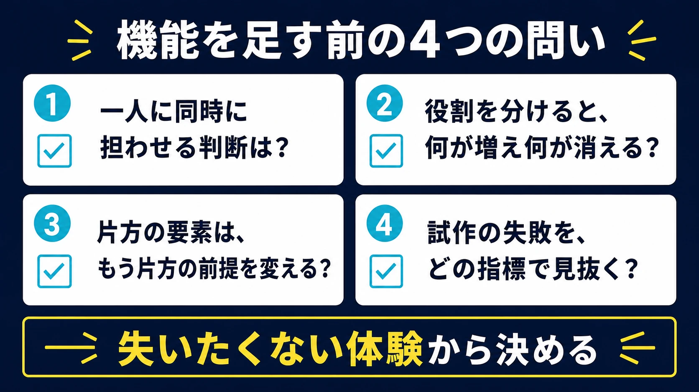

# 『PRAGMATA』はなぜ2人協力プレイにしなかったのか――完全新規IPと「自分自身との協力」の設計

既存IPの続編は、最初から「誰に届けるか」の一部が決まっている。認知、過去作の体験、シリーズへの信頼が、発売前から入口になる。一方、完全新規IPにはその入口がない。遊び方も世界設定もキャラクターも、短時間で「これは自分のためのゲームだ」と理解してもらわなければならない。

カプコンの『PRAGMATA』は、その不利を正面から引き受けた事例である。本作は月面研究施設に取り残された調査員ヒュー・ウィリアムズと、アンドロイドのディアナが、敵対AI「IDUS」の支配下にある施設から地球への帰還を目指すSFアクションアドベンチャーだ。物語の詳細には立ち入らない。本稿が見るのは、ヒューの射撃とディアナのハッキングを一人のプレイヤーに同時に担わせ、あえて2人協力プレイにしなかった判断である。[[1](#ref-1)]

結論を先に言えば、本作の核は「二人の役割があること」ではない。異質な二つの判断を、戦闘の同じ数秒の中で一人に往復させることにある。協力プレイという機能を足せば、役割分担は明快になる。しかし、そこで失われる体験もある。『PRAGMATA』はその交換条件を、かなり明瞭に示している。

***

## 強い既存IPを持つ会社が、なぜ新規IPに投資するのか

カプコンは『バイオハザード』『モンスターハンター』『ストリートファイター』『ロックマン』などの強いシリーズを持つ。既存IPは、続編の企画、マーケティング、周辺展開で過去の資産を活かせる。その意味で、完全新規IPは不確実性が高い投資である。

ただし、既存IPだけを反復しても、将来の選択肢は増えない。カプコン自身も、持続的・安定的な成長にはIPを継続的に生み出す投資と、グローバルな認知拡大が重要だと説明している。2026年3月期の質疑応答でも、完全新規IPの創出を持続的成長を支える重要な取り組みとして継続する方針を示した。[[2](#ref-2)]

この文脈で『PRAGMATA』は、単に新しい題材を試す作品ではない。将来シリーズに育てられる候補をつくる投資であり、同時に既存シリーズでは採りにくい操作密度とゲームの約束を検証する投資でもある。カプコンは2020年の発表時点で、本作を家庭用ゲーム機向けでは4年ぶりの完全新規IPと位置付け、コアブランド化を目標に掲げていた。[[3](#ref-3)]

新規IPの最大のハンデは、内容以前に知名度がないことだ。プレイヤーはタイトル名から品質もジャンルも想像しにくい。よって企画は、説明の容易さと独自性を両立させる必要がある。『PRAGMATA』の場合、その入口は「ハッキングしてから撃つ」「二人を一人で同時に扱う」という、映像でも試遊でも伝えやすい一文に集約されている。

***

## 成算はあったのか――三つの指標を混同しない

商業的な成立を一本の数字だけで断定するのは危険である。批評家評価は作品の受容を、ストア評価は購入者・体験者の反応を、販売本数は市場への到達を別々に示す。対象範囲も更新頻度も異なるため、同列の「成功点」として足し算してはならない。

| 指標 | 2026年7月17日時点の値 | 何を示すか | 読む際の注意 |
| --- | --- | --- | --- |
| Metacritic | PS5版メタスコア85、批評家104件。ユーザースコア8.8、2,156件 | 批評家の集計評価と、同サイト利用者の評価 | プラットフォームや投稿者層に依存する |
| Steam | 全言語で「圧倒的に好評」。総レビュー23,579件、肯定22,898件 | PC版での継続的なユーザー反応 | レビュー数は販売本数そのものではない |
| カプコン公表の販売本数 | 発売48時間で100万本超、発売16日間で200万本超 | 全世界での初動の到達 | 地域・プラットフォーム別の内訳や実売の詳細は公表されていない |

MetacriticではPS5版が85点で、批評家104件に基づく「おおむね好評」となっている。ユーザースコアは8.8である。[[4](#ref-4)] Steamでは、全言語の総レビュー23,579件のうち22,898件が肯定で、「圧倒的に好評」と表示されている。[[5](#ref-5)] いずれも、ハッキングと射撃の融合が少なくとも受容の中心にあったことを示す補助線にはなる。ただし、評価は作品の収益や継続率を直接測る数字ではない。

市場到達の根拠は、カプコンの公表値である。4月17日の発売から48時間で全世界100万本を超え、発売16日間で200万本を超えた。カプコンは、早期の体験版配信、マルチプラットフォーム展開、独自のゲーム性を認知拡大施策として挙げている。[[6](#ref-6)][[7](#ref-7)]

この三つを合わせると、「無名の新規IPだったから売れなかった」という結果ではない。もっとも、これだけで長期シリーズ化の採算まで確定するわけでもない。次作への投資判断には、開発費、値引き後の販売推移、追加コンテンツ、地域・機種別の構成など、非公開の変数が残る。カプコンもシリーズ化は継続的に分析しながら検討するとしている。[[2](#ref-2)]

***

## ハッキングは射撃の前提条件として組み込まれた

『PRAGMATA』の敵ボットは、通常の射撃だけでは有効打を与えにくい装甲を持つ。ヒューが敵をロックオンすると、ディアナのハッキングパネルが現れる。プレイヤーはカーソルでマスを連続して通り、目標ノードへ到達させる。成功すると敵の装甲が一時的に無力化され、露出した弱点をヒューの武器で攻撃できる。多くのマスを通るほど、ハッキング自体のダメージと装甲解除の持続時間が増える。[[8](#ref-8)]

ここでパズルは、戦闘の外にある息抜きではない。射撃が有効になる条件をつくる行為であり、敵が攻撃を続けるリアルタイムの中で行う。最短で目標へ向かえば危険時間を短縮できる。一方、黄色の中間ノードを経由すれば、「Decode」による防御低下や「Multi-Hack」による周辺の敵への波及といった効果を得られる。ただし、ノードの使用には消費があり、経路を伸ばすほど回避の猶予も削られる。[[8](#ref-8)]

*画像出典（引用）：PlayStation.Blog, [Pragmata hands-on report: hack-and-blast through a futuristic city][8]（2026年3月17日）。ハッキングパネル操作中の画面を示す資料として引用。画像内容は変更せず、WebP形式へ変換。*

この構造が生むのは、パズルの正誤ではなく、戦闘中の経路選択である。安全な短経路で弱点を開けるか。被弾の危険を受け入れて強化ノードまで取りに行くか。まず敵の攻撃を避けるか。プレイヤーは照準、移動、回避、経路設計、武器選択を短い周期で切り替える。

開発側も、この結合を当初から完成形として持っていたわけではない。大山直人プロデューサーは、二人を同時に操作し、ハッキングとアクションで戦うコンセプトは早期から決まっていた一方、それをどのゲームシステムに落とすかを試行錯誤し、現行のパズルとシューティングの形式に至ったと説明している。発売延期の主因も、このゲームシステム決定後を含むバランス調整だったという。[[9](#ref-9)]

PlayStation Blogのインタビューでは、開発チームが初期試作で、戦闘中にハッキングを自動発動する案と、プレイヤーに全面的な自由を与える案の双方を試したことが明かされている。前者は能動性に乏しく、後者では射撃だけに依存されやすかった。そのため、ハッキングが意味を持ち、かつ必須と感じられる均衡を、繰り返しのプレイテストで調整した。パズルを義務作業に見せないため、視覚効果、音、パネル変化まで含めて磨いたという。[[10](#ref-10)]

これは「取ってつけた要素」を避けるための重要な順序である。まず、片方の要素だけで問題を解けないようにする。次に、もう片方を待ち時間や単純な鍵にしない。そして、両者の選択が互いの価値を変えるようにする。『PRAGMATA』では、ハッキングが射撃の有効時間をつくり、武器と敵配置がハッキング経路の価値を変える。この相互依存が、二つの要素を一つの戦闘ループへまとめている。

***

## なぜ2人協力プレイを選ばなかったのか

ヒューを一人目、ディアナを二人目が担当する協力プレイは、自然な発想に見える。役割は視覚的にも明快で、会話も生まれやすい。しかし開発チームはこの案を検討した上で採用しなかった。

大山プロデューサーは、二人に分割すると、一方がアクションをし、もう一方がパズルを解くだけになり、組み合わせた時の面白さが薄れると説明している。そこで、一人のプレイヤーがアクションとパズルを同時に扱う忙しさと楽しさへ振り切った。[[11](#ref-11)]

| 設計案 | 得られる価値 | 失われやすい価値 |
| --- | --- | --- |
| ヒューとディアナを別プレイヤーが担当する2人協力 | 役割分担の分かりやすさ、声かけ、共同達成 | 同じ人が照準・回避と経路選択を往復する緊張、判断の一体感 |
| 一人のプレイヤーが両者を同時に扱う | 射撃とハッキングの相互依存、自分の判断でつくる攻防のリズム | 協力相手と遊ぶ入口、役割を分ける気楽さ |

この判断を「協力プレイを省いた」と捉えると本質を見失う。本作は、対照的な二人を一人が同時に扱うことを、ゲームの主題であると同時に操作上の負荷として利用している。敵弾を避けながら経路を引くからこそ、強化ノードを取るか即座に装甲を開くかの判断に手触りが生まれる。役割を二人に分ければ、協力のコミュニケーションは生まれても、各プレイヤーが感じる負荷と達成感は別物になる。

探索にも同じ考え方が延びている。ディアナが道を開き、ヒューがスラスターやホバーで進む。広い場所ではディアナが進行方向を示す。つまり、戦闘だけを協力らしく見せるのではなく、移動と導線にも二人の依存関係を置いている。[[1](#ref-1)][[11](#ref-11)]

***

## プランナーへの教訓――機能ではなく、失いたくない体験から決める

この事例の教訓は、「協力プレイは不要」という一般論ではない。協力プレイが最も強い体験を生む企画は数多くある。重要なのは、機能を追加する前に、その機能が核となる認知負荷と達成感をどう変えるかを言語化することである。

企画の初期には、次の問いが有効である。

- **一人に同時に担わせる判断は何か。** それは単なる忙しさではなく、判断の組み合わせ自体が面白さになっているか。
- **役割を分けた時、何が増え、何が消えるか。** 遊びやすさだけでなく、緊張、観察、成功の帰属先まで比較する。
- **片方の要素は、もう片方の前提を変えるか。** 変えないなら、並列のミニゲームになりやすい。
- **試作の失敗をどの指標で見抜くか。** 「自動化すると退屈」「自由にすると片方しか使われない」のように、狙った体験が崩れる条件を先に定める。

『PRAGMATA』は、新規IPの成否を「珍しい設定」だけで取りにいっていない。知名度の不利に対して、説明しやすい固有の戦闘ループを用意した。そして、そのループを守るために、魅力的に見える2人協力プレイを採用しなかった。新しい機能を加える時に問うべきなのは、機能表を豊かにできるかではない。その追加によって、プレイヤーに残したい判断と感情が、より強くなるかである。

## References

1. [PRAGMATA ｜ ゲームタイトル ｜ PlayStation（日本）][1] - シングルプレイヤー、二人の同時操作、戦闘・探索での役割を確認。

2. [決算短信・説明会資料・動画 ｜ IR資料室 ｜ 株式会社カプコン][2] - 完全新規IPの継続方針、販売要因、シリーズ化検討に関する質疑応答。

3. [Capcom Announces Resident Evil Village and Pragmata for Next-Gen Platforms!][3] - 2020年時点の完全新規IPとコアブランド化の位置付け。

4. [PRAGMATA Reviews ｜ Metacritic][4] - 批評家・ユーザーの集計値。2026年7月17日確認。

5. [PRAGMATA on Steam][5] - Steamレビューの件数と評価表示。2026年7月17日確認。

6. [All-New IP PRAGMATA Surpasses One Million Units Sold in Two Days!][6] - 発売48時間での全世界100万本超と施策。

7. [Sales of All-New IP PRAGMATA Top Two Million Units in 16 Days!][7] - 発売16日間での全世界200万本超。

8. [Pragmata hands-on report: hack-and-blast through a futuristic city][8] - ハッキングパネル、装甲解除、ノードの効果を確認。

9. [こだわりを捨ててでも快適度を優先する。カプコン完全新作「プラグマタ」インタビュー][9] - ゲームシステムの試行錯誤とバランス調整に関する開発者発言。

10. [Pragmata interview: combat, hacking, resource management, and more][10] - 自動化・自由化の試作と、プレイテストを通じた調整に関する開発者発言。

11. [カプコン新作宇宙アクション『プラグマタ』開発者を突き動かしたのは「既視感のあるゲームにしたくない」執念][11] - 2人協力プレイを採用せず、一人でアクションとパズルを扱う判断に関する開発者発言。

[1]: https://www.playstation.com/ja-jp/games/pragmata/
[2]: https://www.capcom.co.jp/ir/data/result.html
[3]: https://www.capcom.co.jp/ir/english/news/html/e200612a.html
[4]: https://www.metacritic.com/game/pragmata/
[5]: https://store.steampowered.com/app/3357650/PRAGMATA/
[6]: https://www.capcom.co.jp/ir/english/news/html/e260420.html
[7]: https://www.capcom.co.jp/ir/english/news/html/e260507.html
[8]: https://blog.playstation.com/2026/03/17/pragmata-hands-on-report-hack-and-blast-through-a-futuristic-city/
[9]: https://game.watch.impress.co.jp/docs/interview/2071013.html
[10]: https://blog.playstation.com/2026/03/19/pragmata-interview-combat-hacking-resource-management-and-more/
[11]: https://automaton-media.com/articles/interviewsjp/pragmata-20250927-359444/

----

この文書は、Perplexity、Claude、OpenAI Codex の3つのAIの支援を受けて著述されたものです。引用画像を除き、MIT License にて提供されています。
