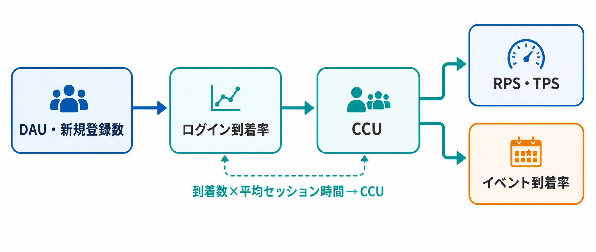
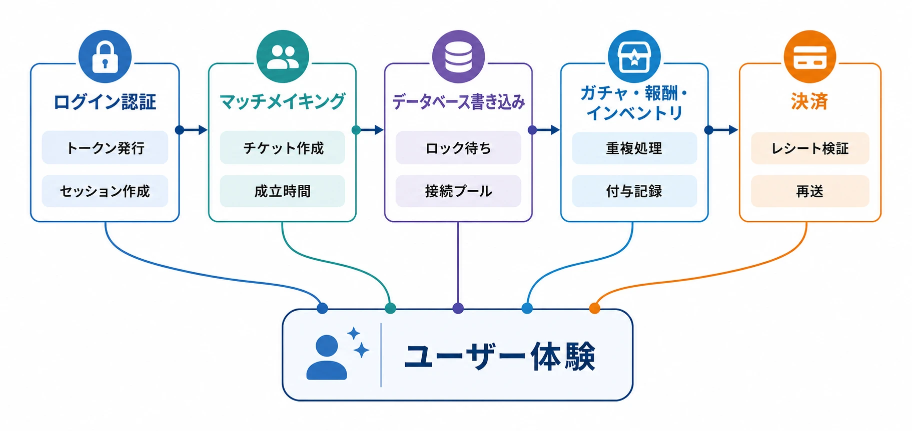
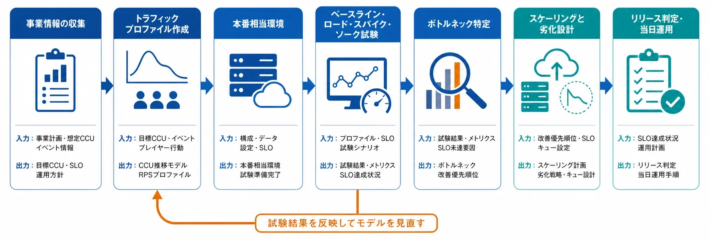
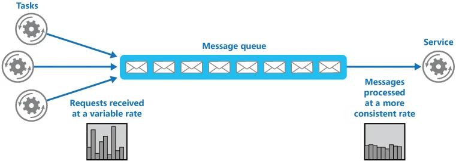

# 本番想定の負荷試験・キャパシティプランニングの実務

オンラインゲームのリリースや大型ライブイベントでは、「サーバーを増やせば何とかなる」という期待が生まれやすい。しかし、実際の障害は、アプリケーションサーバーのCPU不足だけで起きるとは限らない。ログイン認証の集中、マッチメイキングの待ち行列、データベースへの同時書き込み、外部決済サービスの制限、リトライの連鎖など、複数の箇所が別々の速度で限界に達するからである。

既存記事「[ゲームにおける非機能要件](game-non-functional-requirements.md)」では、非機能要件の一項目としてスケーラビリティを扱っている。本稿の主題はそのチェックリストではない。事前登録数やキャンペーン計画を負荷モデルに変換し、試験を組み立て、結果をもとに構成と運用判断を決める一連の実務である。読者として想定するのは、インフラ担当やSRE（Site Reliability Engineering、サービスの信頼性を工学的に扱う役割）と、何を確認し、何を依頼すべきかを会話したいゲームプランナーである。

結論から言えば、プランナーが出すべきものは「同時接続10万人に対応してほしい」という一つの数字ではない。どの時間帯に、どの地域のユーザーが、どの導線を、どの割合で利用し、どの体験を最低限守るのかを定義した **トラフィックプロファイル** である。SREやインフラ担当は、それをサービス容量、試験シナリオ、スケーリング設定、障害時の優先順位へ変換する。

***

## なぜリリース後の増強では遅いのか

負荷が増えたあとにサーバーを増やすだけでは、原因が解決しない場合がある。オートスケーリングとは、CPU使用率やリクエスト数などの指標に応じてサーバーやコンテナの台数を自動的に増減する仕組みだが、増設には起動、初期化、ヘルスチェック、ロードバランサーへの参加という時間がかかる。データベースの書き込み上限や外部サービスのレート制限は、アプリケーションサーバーの台数を増やしても広がらない。

さらに、障害が起きたサービスはリトライによって自分自身をさらに混雑させることがある。ログインに失敗したクライアントが短い間隔で再試行し、認証サービス、セッションストア、ログ収集基盤まで同時に圧迫するという構図である。限界点を知らないまま本番を迎えると、障害中に初めて「何を止めれば守れるか」を考えることになる。

GoogleのSRE資料は、キャパシティプランニングを将来需要と必要な冗長性を満たすための活動と位置付け、自然増だけでなく機能ローンチやマーケティングキャンペーンのような事業起因の需要も予測へ含めるよう求めている。また、サーバーやディスクの量と、実際に提供できるサービス容量を結び付けるため、定期的な負荷試験を挙げている。[[1](#ref-1)]

したがって、事前の負荷試験の目的は「本番と同じ人数を一度動かして安心すること」ではない。次の三つを知ることである。

- どの処理が最初に限界へ達するか
- 限界に達したとき、ユーザーへどのような劣化が起きるか
- 増強、流量制御、機能制限、メンテナンスのどれが有効か

負荷試験を実施できなかった場合でも、少なくとも「試験していないため、ここから先の容量は未検証である」というリスクを、リリース判断の材料に残す必要がある。

***

## キャパシティプランニングの出発点は同時接続数ではない

### 同時接続数、ログイン数、リクエスト数を分ける

ゲームの会話では、CCU（Concurrent Users、同時接続ユーザー数）とDAU（Daily Active Users、日次アクティブユーザー数）が混同されやすい。DAUが大きくてもプレイ時間が分散していればピークCCUは低い。逆に、配信開始時刻やイベント報酬の受け取り時刻が揃えば、DAUがそれほど大きくなくても短時間のログイン集中が起きる。

最初に、少なくとも次の指標を別々に置く。

| 指標 | 意味 | 使い道 |
|---|---|---|
| DAU・新規登録数 | 一日または期間内に利用する人数 | 需要の母数を置く |
| ログイン到着率 | 一分あたりにログインを試みる人数 | 認証・セッション開始のピークを置く |
| CCU | ある瞬間にプレイ中または接続中の人数 | ゲームサーバー、接続管理、ネットワークを評価する |
| RPS・TPS | 一秒あたりのリクエスト数・トランザクション数 | API、DB、キュー、外部サービスを評価する |
| イベント到着率 | 報酬受け取り、ガチャ、マッチ検索などの発生率 | 特定機能の集中を評価する |

概算では、同時接続数を「単位時間あたりのログイン到着数 × 平均セッション時間」で考えられる。APIのリクエスト数は「同時接続ユーザー数 × 一人あたりの操作頻度」で置ける。ただし、これは平均値を作る式であり、リリース直後の集中やイベント開始直後の偏りは表せない。最終的な試験では、平均ではなく時間帯ごとの到着率と操作分布を使う必要がある。

### 目標値は三つの帯で持つ

一つの予測値にすべてを託すと、予測誤差と設計余力が混ざる。実務では、少なくとも次の三つの帯に分けると会話しやすい。

1. **基準ケース：** 現時点で最も起こりそうな利用状況である。
2. **高位ケース：** 事前登録、広告到達、配信者施策、復帰率などが上振れした場合である。
3. **防御ケース：** 高位ケースを超える流入や、リトライ・再接続が増えた状態である。ここでは「快適に処理できるか」だけでなく、データ破損を防ぎ、安全に入場制限できるかを確認する。

高位ケースをそのまま「必ず処理する保証値」とするか、「整理券を配って待ってもらう上限」とするかは、事業と技術の共同判断である。MicrosoftのAzure Well-Architected Frameworkも、季節変動、製品更新、マーケティングキャンペーン、特別イベントなど、利用パターンが変わる前にキャパシティプランニングを行うよう整理している。[[2](#ref-2)]

### 情報源を一つの数字にしない

プランナーが集める情報源には、それぞれ異なる偏りがある。

- **事前登録数：** 興味を示した母数であり、同時にログインする人数ではない。予約特典の受け取り、事前ダウンロード、地域別の登録比率も分けて見る。
- **類似タイトルの実績：** 自社の過去作や同ジャンルの公開実績から、登録から初回起動、初回起動から継続利用への変換を置く。ただし、プラットフォーム、価格、ブランド力、配信地域が違えば補正が必要である。
- **マーケティング施策：** テレビCM、ストア掲載、配信者の動画、SNSキャンペーン、報酬配布の時刻を、施策カレンダーから負荷カレンダーへ移す。
- **過去のライブイベントログ：** イベント開始時刻、ログイン到着率、報酬受け取り、ガチャ、マッチ検索、切断・再接続を時系列で取り出す。平均値ではなく、ピークの継続時間と地域差を見る。
- **ゲームデザインの仕様：** 一斉に受け取る報酬、日次更新、限定ガチャ、ランキング締切、ワールドボスの開始時刻は、自然発生の利用とは異なる集中を作る。

ここで大切なのは、マーケティング施策を「参考情報」として共有するだけで終わらせないことである。開始時刻、対象地域、想定リーチ、ユーザーが次に行う操作、施策を止める条件まで、負荷試験の入力へ変換する必要がある。

### 例示値を使ってモデルを説明する

実際のプロジェクトでは、次のような表を一枚作るとよい。以下の数字は説明用の仮値であり、業界標準値ではない。

| 項目 | 基準ケース | 高位ケース | 実測・確認方法 |
|---|---:|---:|---|
| 期間内の新規登録 | 120,000人 | 180,000人 | 事前登録・広告計画 |
| 初日ログイン率 | 35% | 50% | 類似タイトル・自社実績 |
| ピーク時の同時接続比率 | 25% | 35% | 過去ログ・時間帯別予測 |
| 5分間のログイン集中 | 通常の3倍 | 通常の6倍 | 配信・報酬の開始時刻 |
| 目標CCU | 10,500人 | 31,500人 | 上記の組み合わせから算出 |

この表から、CCUだけでなく「5分間のログイン到着率」「ログイン後にマッチ検索へ進む割合」「初回報酬を受け取る割合」を作る。インフラ担当への依頼は「31,500人に対応」ではなく、「開始5分にログイン到着が集中し、その後の10分でマッチ検索と初回報酬の書き込みが増えるシナリオを、地域別に試験したい」となる。

*図：DAU・新規登録数を出発点に、ログイン到着率とCCUを経て、RPS・TPSとイベント到着率へ負荷を分解する流れ。*

***

## 負荷試験は目的ごとに使い分ける

負荷試験という言葉で、すべての試験を一括してはいけない。Azureの公式資料は、指定した負荷を処理できるかを見るロードテスト、限界を超えたときの挙動を調べるストレステスト、急増を扱うスパイクテスト、長時間の劣化を調べるソークテストを区別している。[[3](#ref-3)]

| 試験 | 負荷のかけ方 | 確認すること | ゲームでの例 |
|---|---|---|---|
| ベースラインテスト | 少人数または平常時負荷 | 正常時の遅延、エラー率、リソース使用量 | ログイン、ホーム表示、通常のマッチ検索 |
| ロードテスト | 目標負荷を一定時間維持 | 目標SLOを満たせるか | 高位ケースのCCUとRPSを30分維持 |
| スパイクテスト | 短時間で負荷を急増・急減 | 急増時の受付、オートスケーリング、復帰 | イベント開始直後のログイン、報酬受け取り |
| ストレステスト | 目標を超えて限界まで増加 | どこで壊れ、どう失敗し、どう回復するか | 認証、DB、マッチングの限界点を探す |
| ソークテスト | 高めの負荷を長時間維持 | メモリリーク、接続枯渇、ログ蓄積、性能劣化 | 6時間のイベント運営を模した連続接続 |
| リカバリーテスト | 障害や負荷を解除して観測 | キューが排出され、処理が正常に戻るか | 認証復旧後の再接続嵐、遅延書き込みの消化 |

AWSの公式ロードテスト手順でも、タスク数、同時実行数、ランプアップ時間、目標負荷を維持する時間を別々の設定として扱っている。試験スクリプト側でトランザクション率を定義しただけでは、どの時間幅でどの負荷になったのかを説明できない。[[4](#ref-4)]

### 合否条件はCPU使用率だけにしない

CPU使用率が低いのに、接続プールやDBロックが枯渇していることがある。最低限、次の四層で観測する。

- **ユーザー体験：** ログイン完了時間、マッチ成立時間、画面表示時間、タイムアウト率、再試行率
- **サービス：** RPS、同時接続数、p50・p95・p99レイテンシ、HTTPエラー、ゲーム固有の失敗コード
- **リソース：** CPU、メモリ、GC、ネットワーク、ファイルディスクリプタ、接続プール、スレッド、キュー深度
- **データと依存先：** DBのCPU・IOPS・ロック待ち・レプリカ遅延、キャッシュヒット率、認証・決済・通知サービスのエラーとレート制限

SLO（Service Level Objective、サービスレベル目標）は、「95%のログインが何秒以内」のようにユーザー体験で置く。平均値だけでは、少数のユーザーが長時間待たされる問題を隠してしまう。試験の終了条件も、「CPUが80%を超えなかった」ではなく、「高位ケースでログインp95が目標以内、課金を除く主要APIのエラー率が閾値以下、DBの書き込み遅延が回復可能な範囲」と書くべきである。

### スクリプトは「画面を開く」だけでは弱い

仮想ユーザーの行動を、ゲーム内の状態遷移に沿って作る。たとえば次のようなシナリオである。

1. アプリ起動、バージョン確認、認証トークン取得
2. ログイン、セッション確立、プレイヤーデータ読み込み
3. お知らせ・ホーム・所持品の読み込み
4. マッチ検索、キャンセル、再検索、成立後の接続
5. 報酬受け取り、ガチャ、インベントリ更新
6. 切断、再接続、タイムアウト後の再試行

各操作の割合と間隔を変える。全員が同じ順番で同じ間隔に動くスクリプトは、実際のユーザー行動より人工的であり、負荷の偏りを誤る。乱数を使う場合も、再現できるシードとユーザー状態を保存する必要がある。

***

## ゲーム特有のボトルネックを分解する

### ログイン認証

ログインは、認証プロバイダー、トークン発行、アカウントデータ、セッションストア、ゲームサーバーへの割り当てを連鎖させる。認証APIのRPSだけを試験しても、ログイン完了後のキャラクター選択やワールド入場で詰まれば、プレイヤーはゲームを始められない。

確認項目は、トークン発行数、セッション作成の書き込み、同一アカウントの重複ログイン、失敗時の再試行間隔、ログインキューの位置保持、復旧後の再接続である。認証だけを通過させた仮想ユーザーが、同じアカウントデータを奪い合う設計になっていないかも見る。

### マッチメイキング

マッチメイキングは、単なるAPIの応答ではない。チケットを登録し、条件を評価し、マッチを成立させ、必要ならゲームサーバーを割り当て、各プレイヤーを接続させる一連の処理である。PlayFabの公式資料でも、マッチングはキュー内のチケットを扱い、キューの設計やプレイヤー属性の偏りによって待ち時間が変わると説明されている。[[5](#ref-5)]

試験では、CCUだけでなく、毎秒のチケット作成数、キャンセル数、ポーリングまたは通知数、マッチ成立率、成立までの時間、サーバー割り当て時間を記録する。プラットフォーム、地域、レート帯、パーティー人数などの条件を分ける。特定ルールの組み合わせで候補探索が増え、CPUより先に待ち時間が悪化することもある。

### データベース書き込み

ログイン報酬、クエスト達成、対戦結果、ランキング、所持品、ガチャ結果は、読み込みより書き込みの方が厳しい設計になりやすい。大量の同時書き込みで問題になるのは、DBのCPUだけではない。接続プール、トランザクションロック、ホットキー、インデックス更新、レプリカ遅延、リトライによる二重処理を確認する。

負荷試験用のデータを一件だけ使い回すと、実際には存在しない競合を作る場合と、逆に実際の分散を消してしまう場合がある。新規ユーザー、既存ユーザー、人気ランキング上位、同一イベント報酬を受け取るユーザーを分けたデータセットを用意する。

### ガチャ・報酬・インベントリ

ガチャ処理は、抽選、通貨消費、結果記録、アイテム付与、重複時の変換、監査ログを一つの体験として見なす必要がある。レスポンスが返らないときにクライアントが再送すると、二重消費や二重付与が起きる危険がある。

PlayFab Economy v2の公式資料は、ネットワーク障害やタイムアウトによる重複リクエストに対して、同一のIdempotencyId（同じ論理操作を一度だけ処理するための識別子）を使う方式を説明している。[[6](#ref-6)] 自社実装でも、ガチャ一回、報酬受け取り一回、決済一件の単位で、再送時の結果をどう扱うかを試験項目にする。

### 決済

決済は、ゲーム内の「購入ボタンを押す」だけを負荷試験してはいけない。ストアの取引、レシートまたはトランザクション情報の検証、付与、再送、返金・取り消し、問い合わせ対応までが範囲である。AppleのApp Store Server APIは、サーバーから取引情報を扱う仕組みと、サンドボックス環境でのテストを提供している。[[7](#ref-7)]

本番のストアで大量の決済を発生させることはできないため、テスト用ストア環境、モック、録画済みの応答を組み合わせる。ただし、モックだけでは外部サービスのレート制限や応答遅延を確認できない。ベンダーの上限、検証APIのタイムアウト、同じ取引の再送、付与処理の再実行を、契約・公式ドキュメントと照合する。

*図：ログイン認証、マッチメイキング、データベース書き込み、ガチャ・報酬・インベントリ、決済が、ユーザー体験の途中経路として連鎖する構造。*

***

## 試験環境は「本番と同じ」より「違いを説明できる」ことが重要である

本番相当環境を作るには費用がかかる。データベースの容量、リージョン、CDN、ネットワーク、監視、外部サービス、ゲームサーバーの台数まで同じにする必要があるからだ。一方、すべてを本番と同じにできないプロジェクトも多い。重要なのは、差分を表にして、試験結果がどの条件に有効かを説明できることである。

試験環境の依頼書には、次を含める。

- 本番と同じアプリケーションビルド、設定、DBスキーマ、マスターデータ
- 本番と同じ地域分布、ロードバランサー、CDN、通信経路
- 新規・既存・復帰ユーザーを含むデータ分布
- 認証、マッチング、通知、決済など外部サービスの接続方式
- 本番と同じ監視、分散トレース、ログサンプリング、アラート
- 試験用データの削除方法、課金を発生させない安全策、停止条件
- 本番との差分、差分が結果へ与える影響、未検証の領域

試験用の負荷生成基盤自体がボトルネックになることもある。AWSの分散ロードテストの公式ソリューションは、複数リージョンから多数の仮想ユーザーを生成し、ランプアップ、同時ユーザー数、保持時間を設定できる。[[4](#ref-4)] 自社で用意する場合も、負荷生成側のCPU、ネットワーク、リージョン、送信元IP制限を観測し、アプリケーション側に届いた実負荷を基準に判定する。

### スケジュールに組み込む

負荷試験をリリース直前の一回にすると、問題を見つけても修正と再試験の時間がない。プロジェクト規模に応じて前後するが、次のように段階化するとよい。

| 時期の目安 | 実施内容 | 判断の成果物 |
|---|---|---|
| リリース3か月以上前 | 需要モデル、SLO、主要導線、外部依存を定義 | キャパシティ計画書、未確定事項 |
| 2か月前 | ベースライン、代表シナリオ、監視の確認 | 1台・1シャードあたりの容量モデル |
| 6週間前 | 基準・高位ケースのロードテスト | 必要台数、DB設定、ボトルネック一覧 |
| 4週間前 | スパイク、ストレス、機能制限の試験 | 限界値、劣化モード、復旧手順 |
| 3週間前 | ソーク、再接続、障害復旧のリハーサル | 長時間劣化と当番向けランブック |
| 1週間前 | 本番設定の差分確認、キャンペーン時刻との突合 | リリース可否、残余リスク、停止条件 |

開始条件と終了条件を先に決める。試験途中で明らかなデータ破損が起きた場合は、負荷を上げ続けるのではなく停止して原因を切り分ける。試験が成功したとしても、負荷モデル、ビルド、設定、データ量、観測値を記録しなければ、次のイベントで再利用できない。

*図：事業情報を負荷モデルへ変換し、試験結果を改善ループでモデルへ戻しながら、リリース判定と当日運用へつなげる工程。*

***

## スケーリング戦略は増やす・待たせる・減らすを組み合わせる

### オートスケーリングは万能な蛇口ではない

水平スケーリングとは、同じ役割のサーバーやコンテナを増やすことである。KubernetesのHorizontal Pod Autoscalerは、CPU、メモリ、カスタムメトリクスなどをもとにワークロードのレプリカ数を調整する。しかし、これは観測と制御を繰り返す仕組みであり、負荷が到着してから即座に新しい処理能力が使えるとは限らない。起動直後のインスタンスがウォームアップ中である場合や、DB・外部APIが先に限界へ達する場合もある。[[8](#ref-8)]

そのため、イベント開始時は最小台数をあらかじめ引き上げる **プレウォーム** と、負荷が増えたときのオートスケーリングを組み合わせる。スケールアウトの指標にはCPUだけでなく、リクエスト待ち時間、アクティブ接続数、キュー深度、ゲームサーバーの空き枠など、ユーザー体験に近い値を候補にする。スケールインは急に行わず、短いピークで台数が揺れ動くフラッピングを避ける。Kubernetesの公式資料も、スケールインの安定化ウィンドウや変更速度の制御を設定できるとしている。[[8](#ref-8)]

### キューイングは失敗ではなく入場制御である

整理券方式のキューは、要求を捨てずに順番を付けて、処理できる速度で入場させる方法である。AzureのQueue-Based Load Leveling Patternは、到着と処理をキューで分離し、急な需要を平準化する考え方を示している。ただし、キューの後ろのワーカー数を増やしすぎると、今度はデータストアが詰まるため、処理側の並列度も制御する必要がある。[[9](#ref-9)]

ゲームで使う場合は、次を決めておく。

- 何をキューに入れるか。ログイン、マッチ検索、報酬受け取りを同じ列にしない。
- 順序と優先度をどうするか。課金ユーザー、無料体験、復帰ユーザーの扱いは、事業・規約と整合させる。
- 待ち時間と位置をどう表示するか。表示できない場合は、推定値として扱う。
- 接続が切れたときに何を保存するか。再試行で二重処理にならない識別子が必要である。
- どの深さで新規受付を止めるか。キューを無限に伸ばすと、ユーザーの待ち時間と再接続負荷が増える。

キューはログインを通せば終わりではない。ログイン後のワールド入場、マッチ検索、サーバー割り当てにも待ち行列がある。各キューの深さ、到着率、処理率、最古の待ち時間を別々に監視する。

*画像出典（引用）：Microsoft, [Queue-Based Load Leveling Pattern - Azure Architecture Center](https://learn.microsoft.com/en-us/azure/architecture/patterns/queue-based-load-leveling) 掲載図。無改変でWebP変換。*

### 機能制限は段階的復旧の設計である

すべての機能を同時に守れない場合、サービスを完全停止する前に、重要度の低い処理を減らす選択肢がある。たとえば、ランキング更新の頻度を下げる、ソーシャルフィードを読み取り専用にする、装飾的な通知を遅延させる、マッチング条件を一時的に単純化する、といった方法である。

ただし、課金、所持品、ガチャ結果、対戦結果の確定は、負荷を下げるために曖昧な状態へしてはいけない。処理を止めるなら、受付停止、明確なエラー、再試行可能な状態、監査ログを組み合わせる。機能制限の各段階を、負荷試験で実際に切り替え、ユーザーが安全に戻れることまで確認する。

***

## 障害発生時の初動を事前に決める

障害中に「サーバーを増やすか、メンテナンスするか」を議論すると、判断が遅れる。試験の段階で、観測値と対応を対応表にしておく。

| 状況 | まず確認すること | 初動の候補 |
|---|---|---|
| アプリケーションCPUのみが高い | スケールアウト後の処理遅延と起動時間 | プレウォーム、スケールアウト、流入制御 |
| DBの書き込み待ちが増えている | ロック、接続数、ホットキー、リトライ | 書き込み頻度を下げる、対象機能を止める、受付制限 |
| 認証エラーと再試行が増えている | リトライ間隔、トークン発行、セッションストア | 再試行を抑制、ログインキュー、認証系の保護 |
| 外部サービスの上限に達している | ベンダーのレート制限、タイムアウト、障害情報 | キャッシュ、バックオフ、機能制限、代替経路 |
| データの二重付与・不整合の兆候 | 同一操作の識別、監査ログ、未確定取引 | 課金・報酬の受付停止、整合性確認、告知 |
| 複数サービスが連鎖して遅い | リトライ、依存関係、キュー深度 | 新規受付制限、段階的停止、緊急メンテナンス |

サーバー増強だけで解決しない場合は、緊急メンテナンスを早めに選ぶ必要がある。判断の目安は、データの正しさが守れない、リトライで負荷が増え続ける、外部依存の上限を越えている、機能制限でも主要導線を安定させられない、復旧操作を安全に自動化できない、といった状態である。プレイヤーを長時間つなぎ続けたまま不確定な課金や報酬を発生させる方が、短時間の停止より深刻な場合がある。

告知は、原因を完全に特定してから始める必要はない。影響範囲、現在できないこと、データへの影響の有無、次回更新時刻、ユーザーにしてほしくない操作を、確認できた範囲で伝える。次回更新時刻を守れない場合も、沈黙するのではなく、更新できない事実を知らせる。告知テンプレートと承認者を事前に決め、技術担当が調査を続けながら事業・運営担当が情報を更新できるようにする。

***

## 実際の障害事例を「次に試験する項目」へ翻訳する

### 『ファイナルファンタジーXIV: 暁月のフィナーレ』：ログインだけでなくエリア移動の集中を見る

『ファイナルファンタジーXIV: 暁月のフィナーレ』のアーリーアクセスについて、公式説明は過去最大の同時接続、ワールドごとのログイン上限、エリア移動の同時集中によるネットワーク負荷を挙げている。対応として、同時にエリア移動できるキャラクター数を調整し、瞬間的なネットワーク負荷を制限したことも説明されている。[[10](#ref-10)]

この事例から得るべき試験項目は、「ログインサーバーに何人入れるか」だけではない。次を分けて試す必要がある。

- ログイン到着率が増えた状態で、ログインキューが正しく順序を保てるか
- ログイン直後に発生するキャラクター選択、ワールド入場、エリア移動が重なったとき、ネットワークとワールド処理がどう劣化するか
- ワールドごとの上限に達したとき、新規受付を止めても既存プレイヤーのゲームプレイを守れるか
- 復旧後に再接続が集中したとき、元の障害を再発させないか

その後の『ファイナルファンタジーXIV: 黄金のレガシー』の告知では、『暁月のフィナーレ』リリース時の混雑を踏まえ、データセンターの拡張や新ワールドの追加、ログインキュー、データセンタートラベルなどの制限が案内された。[[11](#ref-11)] ここで注目すべきなのは、容量を増やす対策と、入場を制御する対策が併記されている点である。負荷試験の結果を、インフラ増強だけでなく、上限、キュー、機能制限の設計へ戻すことが重要である。

### Fallout 76：事後改善の報告を、事前の観測設計へ変える

BethesdaはFallout 76の発売から100日後の公式記事で、ゲームとサーバーの安定性を改善し、内部の変更によって性能や不正対策などを進めたと報告している。[[12](#ref-12)] この公式記事だけから、個々の原因や、事前にどの試験をすれば完全に防げたかを断定することはできない。

しかし、実務上の教訓は抽出できる。発売後に「安定性」を改善したと説明するには、少なくともサービスの失敗率、性能、サーバー状態を継続的に観測できていなければならない。そこから逆算して、事前に次を用意する。

- サービスの安定性を、クラッシュ、切断、タイムアウト、データ不整合などへ分解する
- 発売直後の負荷と、通常運営時の負荷を別々に記録する
- 改善前後の比較ができるベースラインを保存する
- プレイヤーの報告とサーバーログを突き合わせる識別子と時刻を持つ
- 負荷を下げる変更と、機能不具合を直す変更を同じ指標で評価しない

障害事例は、原因を想像して責任者を探すためではなく、次の試験と観測の穴を埋めるために使うべきである。

***

## プランナーがインフラ・SREへ依頼する内容

プランナーは、インフラの構成を一人で決める必要はない。しかし、ビジネスとゲームデザインから来る負荷の条件を、技術側が試験できる形にする責任がある。依頼書には、次の項目を入れる。

1. **イベント情報：** リリース、アップデート、報酬配布、配信、広告の開始時刻と地域
2. **ユーザー分布：** 新規、既存、復帰、無料体験、課金状態、プラットフォーム、地域
3. **行動シナリオ：** ログイン、ホーム、マッチ検索、対戦、報酬、ガチャ、決済、再接続
4. **量の条件：** CCU、ログイン到着率、RPS、TPS、キュー深度、ピーク継続時間
5. **品質条件：** ログイン時間、マッチ成立時間、主要APIのエラー率、データ整合性
6. **優先順位：** 何を守り、何を遅延させ、何を停止できるか
7. **運用条件：** 告知、メンテナンス、補填、キャンペーン停止、担当者、承認者

逆に、インフラ・SREへ「何台必要かだけを答えてほしい」と依頼するのは弱い。求める成果物を、1台または1シャードあたりの容量、ボトルネック、スケールアウト時間、依存サービスの上限、試験結果、残余リスク、当日ランブックとして指定する。

### 共通言語を作る

会話で使う用語は、定義をそろえる。

| 用語 | この計画での意味を確認する質問 |
|---|---|
| CCU | 接続中か、ゲームプレイ中か、キュー待ちを含むか |
| RPS・TPS | HTTPリクエストか、ゲーム内処理か、成功だけか失敗も含むか |
| p95・p99 | どの操作の、どの時間区間のパーセンタイルか |
| SLO | どのユーザー体験を、どの割合で守るか |
| 容量 | エラーなしの最大値か、SLOを満たす最大値か |
| ヘッドルーム | ピーク後に残す余力を、何の指標で測るか |
| キュー | 受付待ちか、処理待ちか、表示される待ち時間か |

SREの資料は、開発と運用が異なる語彙やリスク認識を持つこと自体を、協働上の課題として説明している。[[1](#ref-1)] プランナーが技術用語を暗記することより、「この数字はどのユーザー行動に対応するのか」「限界時に何を守るのか」を互いに確認できることが大切である。

***

## まとめ：負荷試験はリリース日の保険ではなく、企画の入力である

本番想定の負荷試験とキャパシティプランニングは、リリース直前にインフラ担当へ渡すチェック項目ではない。事前登録、過去ログ、広告計画、ゲーム内の一斉操作をトラフィックプロファイルへ変換し、基準・高位・防御のケースで試験し、ボトルネックと劣化モードを知る工程である。

その結果は、サーバー台数だけでなく、リリース時期、広告の規模、イベントの開始時刻、キューの導入、機能制限、緊急メンテナンスの基準へ影響する。プランナーが早い段階で「何人が来るか」だけでなく、「何が、いつ、どの順で起きるか」「混雑時に何を守るか」を提示できれば、インフラ・SREとの会話は抽象的な不安から、試験可能な要求へ変わる。

## References

1. [Google SRE - IT Service Management][1] - 需要予測、キャパシティプランニング、定期的な負荷試験、開発と運用の共通言語に関する公式資料。

[1]: https://sre.google/sre-book/introduction/

2. [Architecture strategies for capacity planning - Microsoft Azure Well-Architected Framework][2] - 季節変動、製品更新、マーケティングキャンペーン、特別イベントを考慮する容量計画の整理。

[2]: https://learn.microsoft.com/en-us/azure/well-architected/performance-efficiency/capacity-planning

3. [Architecture Strategies for Performance Testing - Microsoft Azure Well-Architected Framework][3] - ロード、ストレス、スパイク、ソークなどの性能試験の使い分け。

[3]: https://learn.microsoft.com/en-us/azure/well-architected/performance-efficiency/performance-test

4. [Create a test scenario - Distributed Load Testing on AWS][4] - 仮想ユーザー、トランザクション率、ランプアップ、保持時間、トラフィック形状の設定。

[4]: https://docs.aws.amazon.com/solutions/latest/distributed-load-testing-on-aws/create-test-scenario.html

5. [Matchmaking scenario and configuration examples - PlayFab][5] - チケット型マッチメイキング、キュー設計、プレイヤー属性の偏りと待ち時間に関する公式資料。

[5]: https://learn.microsoft.com/en-us/xbox/playfab/multiplayer/matchmaking/config-examples

6. [Idempotent transactions and retry patterns in Economy v2 - PlayFab][6] - 再送時の重複処理を防ぐIdempotencyIdとリトライの公式資料。

[6]: https://learn.microsoft.com/en-us/gaming/playfab/economy-monetization/economy-v2/tutorials/idempotent-transactions-and-retries

7. [App Store Server API - Apple Developer Documentation][7] - サーバーからのApp Store取引情報取得とサンドボックス環境に関する公式資料。

[7]: https://developer.apple.com/documentation/appstoreserverapi

8. [Horizontal Pod Autoscaling - Kubernetes][8] - メトリクスによる水平スケーリング、変更速度、安定化ウィンドウの公式ドキュメント。

[8]: https://kubernetes.io/docs/concepts/workloads/autoscaling/horizontal-pod-autoscale/

9. [Queue-Based Load Leveling Pattern - Azure Architecture Center][9] - 到着と処理を分離し、キューで負荷を平準化する設計パターン。

[9]: https://learn.microsoft.com/en-us/azure/architecture/patterns/queue-based-load-leveling

10. [Endwalker Congestion and World Status in Early Access - FINAL FANTASY XIV: The Lodestone][10] - 『暁月のフィナーレ』アーリーアクセス開始時の同時接続、ログイン上限、エリア移動集中、負荷制限に関する公式告知。

[10]: https://na.finalfantasyxiv.com/lodestone/news/detail/2d402ccbc4eb78427223ea9420fa3e81cf20dccf

11. [Regarding Congestion During Dawntrail's Launch - FINAL FANTASY XIV: The Lodestone][11] - 『黄金のレガシー』サービス開始時の混雑を踏まえたデータセンター拡張、新ワールド、ログインキュー、機能制限の告知。

[11]: https://na.finalfantasyxiv.com/lodestone/topics/detail/655f2cdb22f4c473e4f34abf58e9d4042f7e3ea3

12. [Fallout 76 - 100 Days, Roadmap for 2019 - Bethesda.net][12] - 発売後100日時点のゲームおよびサーバー安定性改善に関する公式報告。

[12]: https://fallout.bethesda.net/en/article/7Lw6jVvhjzSNzuUMmKZgwn/fallout-76-100-days-roadmap-for-2019

----

この文書は、Perplexity、Claude、OpenAI Codex の3つのAIの支援を受けて著述されたものです。引用画像を除き、MIT License にて提供されています。
