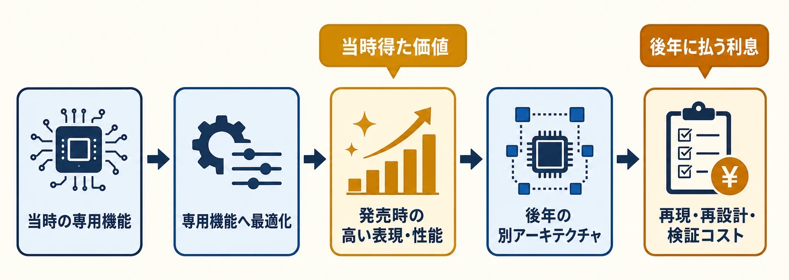
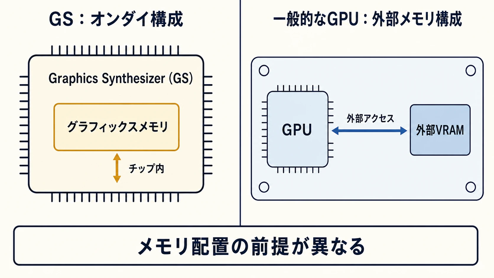
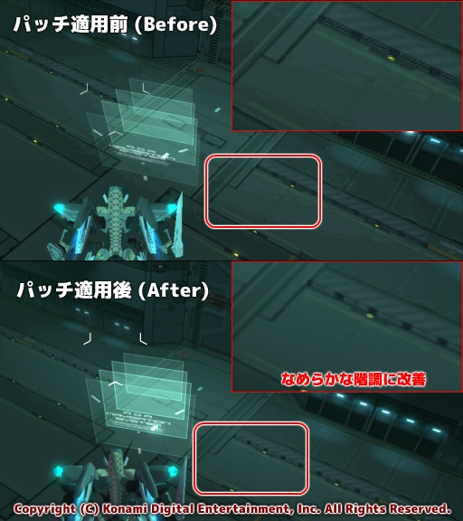
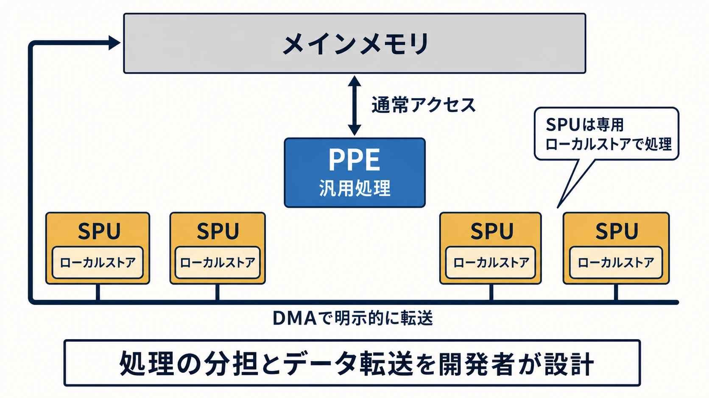

# なぜPS2・PS3世代のリマスターは難しいのか――ハード固有最適化を「技術的負債」で読む

「人気作なのに、なぜリマスターされないのか」。過去作の復刻を待つ側から見ると、現在のゲーム機は当時より高性能なのだから、映像を高解像度にして動かすだけにも思える。ところが、完成画面が同じに見えることと、その画面を作った手順が同じであることは別問題である。

この隔たりを捉える枠組みが **技術的負債** である。ソフトウェア開発者のマーティン・ファウラーは、変更しにくい内部構造によって、機能追加に本来より余分な手間が生じる状態を金銭的な負債になぞらえている。目先で得た価値が「元本」、後の変更で増える作業が「利息」に当たる。[[1](#ref-1)]

ゲーム機固有の最適化も、この比喩で読める。当時のハードから最大限の映像や速度を引き出す判断は、発売時の体験を高めるための合理的な投資だった。一方、同じ専用機能を持たない環境へ移す段階では、その機能に合わせた描画手順、処理分担、データの持ち方を別の方法へ翻訳しなければならない。当時の成果が大きいほど、後年に返す「利息」も大きくなりうる。

本稿の焦点は、 **当時の実装原理が、なぜ後年の移植コストへ変わるのか** である。リマスターとリメイクの定義や原作らしさを守る設計思想は「[ゲームのリマスターとリメイク：ゲームプランナーが押さえるべき設計思想](game-remaster-remake-design-philosophy.md)」、ビット数やFLOPSの読み方は「[ハードウェア「スペック戦争」の実態史――128ビットからテラフロップスまで](128-bit-to-teraflops-spec-wars.md)」で扱っている。

*図：ハード固有最適化が生む発売時の価値と、別アーキテクチャへの移行時に払う利息の関係。*

***

## PS2編：見た目の「作り方」がハードに埋め込まれる

PlayStation 2（以下、PS2）のグラフィックスを担うGraphics Synthesizer（以下、GS）は、ソニー・コンピュータエンタテインメントが独自開発したプロセッサである。PS2開発者へのSIE公式インタビューでは、高性能なグラフィックスのためにGSを独自開発し、グラフィックスメモリをチップ内へ載せたと説明されている。[[2](#ref-2)]

*図：GSのオンダイ構成と一般的なGPUの外部メモリ構成では、描画処理が前提とするメモリ配置が異なる。*

ここで重要なのは、GSを現在のGPUの低性能版として捉えないことである。ヘキサドライブは後年、PS2には「昨今の一般的なGPUとは異なり」高速動作のための特殊機能が多数あったと振り返っている。[[3](#ref-3)] 開発者はその構成に合わせて、描画の順序、半透明や光の重ね方、色の扱い、エフェクトの量などを調整できた。専用機能を使い切るほど、その作品の見た目はGSの振る舞いと結び付いていく。

移植先のGPUがより高速でも、GSと同じ機能や同じ計算結果をそのまま備えているとは限らない。現行機の一般的な描画手法で「似た光」を作るだけなら可能でも、色調、フォグ、半透明の重なり方まで原作と同じにするには、元の描画手順が何を起こしていたかを読み解き、別の仕組みで再現する必要がある。性能差で押し切る問題ではなく、異なる文法間の翻訳問題である。

### 『ANUBIS』で必要になったPS2グラフィックのエミュレーション

この構造を具体的に示すのが『ZONE OF THE ENDERS HD EDITION』である。KONAMIは、PS2用ソフト『ZONE OF THE ENDERS Z.O.E』と『ANUBIS ZONE OF THE ENDERS』をHDリマスター化し、PlayStation 3（以下、PS3）版とXbox 360版を2012年10月25日に発売した。PS3版には2013年7月25日、一部パフォーマンスを改善する無償パッチが配信され、同日発売のBest版にも改善が反映された。[[4](#ref-4)]

ヘキサドライブが担当したのは、このうちPS3版『ANUBIS ZONE OF THE ENDERS』の修正パッチとBest版である。同社の解説によれば、元の開発会社によるネイティブな資料がなく、ソースコードを解析したうえで対策を立てる必要があった。さらに、PS2版はPS2の性能を最大限に引き出す設計だった。[[3](#ref-3)]

映像面では、GSの特殊仕様を使った表現を再現しなければ、同じ見え方にならない箇所が多数あった。そのためチームは「PS2グラフィックのエミュレーション実装」を追加した。結果として、色調やフォグの印象、削減されていたエフェクトの量などをPS2原作へ近づけている。[[3](#ref-3)]

*画像：パッチ適用前後におけるマッハバンド（色の階調）の比較。出典：[株式会社ヘキサドライブ「ZONE OF THE ENDERS HD EDITION -はいだらクオリティへの道-」](https://hexadrive.jp/lab/case/149/)（KONAMI許諾掲載）。画像著作権：Konami Digital Entertainment, Inc.*

ここでいうエミュレーションは、PS2本体を丸ごとソフトウェアで再現するという意味ではない。GS固有の振る舞いに依存した描画結果を、PS3側の処理へ組み込んで再現するための実装である。高解像度の素材へ差し替える作業だけでは届かず、 **原作の見た目を生んだ規則そのものを移植先で作り直した** ことになる。

技術的負債の比喩では、GSの特殊機能を使ったこと自体が失敗なのではない。PS2版が得た豊かな表現こそ、その判断の価値である。返済が必要になったのは、別のアーキテクチャで同じ結果を求めた瞬間だ。元本はハード固有の実装、利息は解析、再現実装、全シーンの比較検証として現れた。

***

## PS3編：性能を引き出す仕事分担が、そのまま移植条件になる

PS3のCell Broadband Engine（以下、Cell）は、一般的な同種コアを並べるCPUとは異なる構造を採った。中央で汎用処理を進めるPower Processor Element（PPE）と、データをまとめて並列処理する複数のSynergistic Processor Unit（SPU）を組み合わせる非対称な設計である。ソニーのCell発表資料も、Powerベースのコアと複数のSPUで構成され、SPUがSIMD構造と専用のローカルストアを持つことを示している。[[5](#ref-5)] PS3の公式仕様では、CellにPowerPCベースコアと複数のSynergistic Processing Element（SPE）が搭載された。[[6](#ref-6)]

*図：PPEの汎用処理と、SPUごとのローカルストアおよび明示的なDMA転送を分けて示したCellの非対称構造。*

ゲーム側では、Cellの性能を引き出すための仕事分担が要る。PPEだけへ処理を集めず、並列化しやすい仕事を切り分け、SPUへ渡し、必要なデータと処理結果を適切な時点で行き来させる設計である。ヘキサドライブも、PS3の性能を最大限に引き出す前提条件として、SPUを効率的に稼働させることを挙げている。[[3](#ref-3)]

この構造は、企画上の表現と実装を結び付ける。大量のキャラクター更新、アニメーション、物理、描画準備といった処理をSPUへ分担させる設計なら、そのゲームのフレーム時間はCell特有の役割分担を前提に成立する。後の移植先に同じSPUがなければ、処理を現代のCPUコアやGPU向けのジョブへ組み替え、同期やデータの寿命も再設計する必要が生じる。

Naughty DogがGDC 2015で公開した『The Last of Us Remastered』の技術講演は、この翻訳を端的に示している。PS4への初期移植では、PS3でSPU上にあった処理をジョブへ置き換え、新しい描画エンジンを使った。その後もゲーム処理や描画コマンド生成をジョブ化し、エンジンの処理順まで再設計している。[[7](#ref-7)] PS3版のコードをそのまま速いCPUで動かしたのではなく、PS4の並列処理へ合わせて仕事の流し方を組み直したのである。

### PS2の最適化へ、PS3の最適化で対抗する

『ZONE OF THE ENDERS HD EDITION』の修正は、PS2とPS3の二重の特殊性がぶつかった事例でもある。PS2原作では、専用のベクトル演算ユニットがオリジナルスタッフによって限界まで最適化されていた。ヘキサドライブはその性能を補うため、PS3側を「SPU全基フル稼働」させる作りへ最適化し直した。[[3](#ref-3)]

PS2からPS3への移行では、専用ユニットへ詰め込まれた処理を読み解き、今度はCellのSPU群へ配り直す作業が発生した。移植元の負債を返すために、移植先固有の最適化を新たに組み込む構図である。

描画側では、着手時の計測でGPU負荷が高く、部分修正だけでは目標へ届かないと判断された。チームは現行の描画エンジンを破棄し、PS3向けに最適化した社内エンジンへ総入れ替えした。原作スタッフの監修下で調整を続け、PS2と同じ60fps動作を実現したと報告している。[[3](#ref-3)]

この判断が示すのは、リマスターの名称と技術作業の規模が一致するとは限らないことだ。ゲームルールや物語を変えなくても、描画エンジンの交換、並列処理の再配置、ハードウェア固有表現の再現が必要なら、内部では基盤の再構築に近い仕事が走る。外からは同じゲームに見えるほど、制作側は差を見せないための大きなコストを払っている。

***

## プランナーが見積もるべき「見えない移植範囲」

プランナーが初期調査で確認すべき対象には、画面解像度や素材の有無に加えて、次の四点がある。これらを押さえると、技術的負債がどこで利息を生むかをエンジニアと共有しやすい。

1. **原作の成立条件**：特徴的な見た目や大量表示が、どの専用機能と最適化に依存しているか。
2. **移植先で失われる前提**：同じ描画仕様、演算ユニット、メモリの使い方が存在するか。
3. **翻訳する単位**：個別エフェクトの再現で済むか、処理分担や描画エンジンまで交換するか。
4. **同一性の検証方法**：代表場面だけでなく、負荷の高い戦闘、フォグ、半透明、色調、演出量を誰が原作と比較するか。

この確認は、「移植できるか」という二択に加えて、再現対象の優先順位を決める材料になる。原作スタッフの監修が必要な箇所を早期に洗い出し、エンジン更新の影響を企画・アート・QAの工数へ反映するために行う。

見積もりでは、現在の画面に何が映っているかに加えて、 **その一枚を作るまでに何が起きているか** を聞く必要がある。特殊な処理へ依存する看板シーンほど、平均的な場面より先に技術検証へ回したい。最悪条件を先に測れば、全面移植、限定的な再現、エミュレーション、リメイクという選択肢を、発売計画が固まる前に比較できる。

***

## おわりに：同じ見た目は、同じ作りやすさを意味しない

PS2のGSとPS3のCellは、それぞれの時代に高い表現と性能を引き出すための設計だった。開発者がその専用機能へ深く最適化した作品ほど、完成画面からはハードウェアとの結び付きが見えにくい。プレイヤーが見るのは光、色、敵の群れ、滑らかな動きであり、その背後の描画手順や処理分担ではないからだ。

後年のリマスターでは、この見えない結び付きをほどき、別のアーキテクチャへ結び直す。『ANUBIS ZONE OF THE ENDERS』では、PS2グラフィックのエミュレーション、SPU全基を使う再最適化、描画エンジンの総入れ替えまで必要になった。これは古いハードが単純に遅かったからではなく、 **当時の専用機能を前提に、原作が高い水準まで作り込まれていたから** である。

プランナーが持ち帰るべき視点は一つだ。 **今の技術で同じに見えても、当時の実装原理が違えば移植コストは跳ね上がる。** 復刻企画の難しさは、完成画面の古さだけでは測れない。何を再現するかと同じくらい、何がその表現を成立させていたかを早い段階で確かめる必要がある。

## References

1. [Technical Debt][1] - 変更しにくい内部品質によって将来の機能追加へ余分な作業が生じる状態を、負債と利息の比喩で説明したマーティン・ファウラーの記事。

2. [発売22周年を迎えたPlayStation®2の誕生秘話][2] - PS2開発者が、Graphics Synthesizerの独自開発とチップ内グラフィックスメモリについて説明したSIE公式インタビュー。

3. [ZONE OF THE ENDERS HD EDITION -はいだらクオリティへの道- For quality and performance improvement.][3] - ヘキサドライブによるPS3版『ANUBIS ZONE OF THE ENDERS』修正パッチ・Best版の技術解説。GS固有表現の再現、SPU最適化、描画エンジン交換を記録している。

4. [ZONE OF THE ENDERS HD EDITION OFFICIAL WEBSITE][4] - 2012年発売のPS3版と、2013年7月25日のパフォーマンス改善パッチおよびBest版を告知したKONAMI公式サイト。

5. [＜参考資料＞次世代プロセッサ「Cell」][5] - Powerベースコアと複数のSPU、SIMD構造、ローカルストアなどを示したソニー公式資料。

6. [Sony Computer Entertainment Inc. to Launch its Next Generation Computer Entertainment System, PlayStation 3 in Spring 2006][6] - PS3のCell構成としてPowerPCベースコアと複数のSPEを記載したSCE公式発表。

7. [Parallelizing the Naughty Dog Engine Using Fibers][7] - 『The Last of Us Remastered』のPS4移植で、PS3のSPU処理をジョブへ置き換え、エンジンの並列処理を再設計した過程を示すGDC 2015講演資料。

[1]: https://martinfowler.com/bliki/TechnicalDebt.html
[2]: https://sonyinteractive.com/jp/news/blog/playstation2-22nd-anniversary/
[3]: https://hexadrive.jp/lab/case/149/
[4]: https://www.konami.com/games/zoe_hd/jp/index.html
[5]: https://sonyinteractive.com/uploads/sites/5/2023/02/050208b.pdf
[6]: https://sonyinteractive.com/en/press-releases/2005/sony-computer-entertainment-inc-to-launch-its-next-generation-computer-entertainment-system-playstation-3-in-spring-2006/
[7]: https://media.gdcvault.com/gdc2015/presentations/Gyrling_Christian_Parallelizing_The_Naughty.pdf

----

この文書は、Perplexity、Claude、OpenAI Codex の3つのAIの支援を受けて著述されたものです。引用画像を除き、MIT License にて提供されています。
