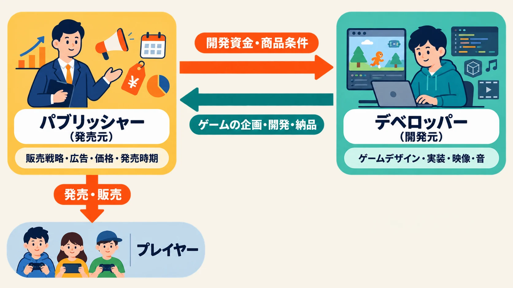

# パブリッシャーとデベロッパーは何が違うのか――「ベヨネッタ」の発売元と開発元から読むゲーム業界

***

## はじめに――「ベヨネッタを作った会社」はどこなのか

『ベヨネッタ』を作った会社はどこか。ゲームを遊んだ人なら、プラチナゲームズと答えるかもしれない。初代でディレクターを務めた神谷英樹氏をはじめ、同社の開発者が制作について語る機会も多く、プラチナゲームズを代表するシリーズの一つとして広く知られているからである。

しかし、パッケージや製品ページを見ると、初代のPlayStation 3・Xbox 360版にはセガ、『ベヨネッタ2』と『ベヨネッタ3』には任天堂の名前が「発売元」として記されている。一方、「開発元」は3作品ともプラチナゲームズである。[[1](#ref-1)][[2](#ref-2)][[3](#ref-3)][[4](#ref-4)]

このクレジットは矛盾していない。「誰がゲームを開発したか」と「誰の商品として発売したか」は、別々の問いだからである。

ゲーム業界では、発売・販売を担う側を **パブリッシャー**、企画・開発を担う側を **デベロッパー** と呼ぶ。日本語の製品情報では、それぞれ「発売元」「販売元」と「開発元」におおむね対応する。一本のゲームは、同じ会社が両方を担当することもあれば、別会社が分担することもある。

本稿では、神谷氏がX（旧Twitter）へ投稿した二つの説明を手掛かりに、パブリッシャーとデベロッパーの関係をたどる。会社名を暗記するのではなく、資金を出す仕事、ゲームを作る仕事、商品として売る仕事、権利を管理する仕事を分けて見ていこう。

なお、社内で作品を率いるディレクターと、事業をまとめるプロデューサーの違いは、既刊記事「[ディレクターとプロデューサーは何が違うのか――役職の基礎知識](game-director-producer-role-boundaries.md)」で扱っている。本稿の主題は個人の肩書きではなく、会社と会社の間に引かれる役割の境界線である。

***

## 1. 三作品のクレジットを並べると、二つの役割が見えてくる

まずは、シリーズの主要3作品が最初に発売されたときのクレジットを確認しよう。

| 作品・初出機種 | 発売年 | 発売元 | 開発元 |
| --- | ---: | --- | --- |
| 『ベヨネッタ』PlayStation 3・Xbox 360版 | 2009年 | セガ | プラチナゲームズ |
| 『ベヨネッタ2』Wii U版 | 2014年 | 任天堂 | プラチナゲームズ |
| 『ベヨネッタ3』Nintendo Switch版 | 2022年 | 任天堂 | プラチナゲームズ |

初代ではセガが発売し、2作目と3作目では任天堂が発売した。開発した会社は一貫してプラチナゲームズである。[[1](#ref-1)][[2](#ref-2)][[3](#ref-3)][[4](#ref-4)]

この表から分かるのは、「シリーズを作り続ける開発チーム」と「各作品を商品として成立させる会社」が、同じ単位で動くとは限らないことである。続編でも開発元が変わる場合はあるが、『ベヨネッタ』では発売元の側が変わった。

さらに、同じ作品でも機種によって発売元が変わる。初代『ベヨネッタ』の2009年版と2017年のPC版はセガ発売、2014年のWii U版と2018年のNintendo Switch版は任天堂発売である。さらに2020年のPS4版『BAYONETTA&VANQUISH』では、発売元表記が再びセガに戻っている。プラチナゲームズ公式ページでは、いずれの機種版でも開発元がプラチナゲームズと記載されている。[[1](#ref-1)]

したがって「このゲームはどの会社の作品か」と尋ねるだけでは、答えが足りない。正確に見るには、少なくとも次の二つへ分ける必要がある。

- **開発の問い**：ゲームデザイン、プログラム、映像、音、ステージなどを、誰が実際に作ったのか。
- **商品の問い**：どの会社が資金と販売計画をまとめ、自社の商品として市場へ出したのか。

プラチナゲームズは前者を3作品で担い、セガと任天堂は作品や機種版に応じて後者を担った。この構造を、まずはクレジットから読み取れる。

***

## 2. パブリッシャーとデベロッパーは、機能を指す呼び名であり、会社の種類ではない

みずほ銀行産業調査部のゲーム産業レポートは、パブリッシャーを、マーケティングや広告などの販売戦略を担当し、在庫のリスクを負い、自社ブランドで販売する企業と整理している。一方、デベロッパーはゲームの企画・開発を担う。同レポートは、大手パブリッシャーが社内に開発機能を持ちながら、外部デベロッパーのゲームも自社ブランドで販売する形があることを示している。[[5](#ref-5)]

パブリッシャーの仕事を「完成したゲームを店へ運ぶこと」だけだと考えると、役割の大半を見落とす。企画を商品として承認し、開発予算を組み、発売機種と時期を決め、プラットフォームとの手続きを進め、広告や広報を行い、価格や販売地域を設計する。売上が想定へ届かなければ、先に投じた費用を回収できない可能性も引き受ける。

レポートの「在庫リスク」は、パッケージソフトを製造・出荷する事業を念頭に置いた表現である。ダウンロード版には物理的な箱の在庫がないが、事業上のリスクがなくなるわけではない。開発費、移植費、宣伝費、ローカライズ費などを先に支払い、売上で回収できない危険は残る。

デベロッパーは、ゲームを遊べる形へする側である。プランナー、プログラマー、アーティスト、アニメーター、サウンド担当者などの開発チームを組み、仕様を考え、試作し、作り直し、品質を上げて完成へ近づける。プレイヤーが感じる操作感や遊びの手触りは、デベロッパーの技術と判断によって具体化される。

*図：パブリッシャーとデベロッパーは、資金・商品条件と企画・開発・納品を分担し、ゲームをプレイヤーへ届ける。*

ただし、パブリッシャーとデベロッパーは、あくまでプロジェクト上の **機能** の名前である。企業を永久に二種類へ分ける分類ではない。任天堂やセガのように自社で開発する機能を持つ企業も、外部デベロッパーへ開発を依頼することがある。小規模な開発会社が、自らストアへ登録して宣伝・販売まで行えば、その作品ではデベロッパーとパブリッシャーを兼ねる。

会社名だけで役割を決めつけず、その作品で何を担当したかを見る必要がある。

***

## 3. 神谷氏はこう語る①――「セガ製品として作った」初代

クレジットの「発売元：セガ」が何を意味するのか。初代『ベヨネッタ』でディレクターを務めた神谷氏は、2018年12月28日、自身の経歴を誤って紹介したユーザーへの返信という形で、作品が生まれた経緯を説明している。[[6](#ref-6)]

<blockquote class="twitter-tweet" data-dnt="true">
セガからの資金援助を受けてセガ製品として作ったのがベヨネッタ
&mdash; 神谷英樹 Hideki Kamiya (@HidekiKamiya_X) <a href="https://x.com/HidekiKamiya_X/status/1078445915541663744">2018年12月28日</a></blockquote>

この説明には、パブリッシャーとデベロッパーの関係を理解するための二つの要点がある。

一つ目は、 **資金援助を受けた** という点である。ゲーム開発では、完成より前から人件費や機材費などが発生する。発売後に売上が入るまで、開発会社が必要な費用をすべて自己資金で負担するとは限らない。パブリッシャーが開発費を提供すれば、デベロッパーはチームを動かし、長い制作期間を支えられる。

二つ目は、 **セガ製品として作った** という点である。プラチナゲームズの開発者が手を動かしたからといって、初代がプラチナゲームズの自己資金による自主販売作品になるわけではない。セガが資金を出し、セガの商品として発売する枠組みの中で、プラチナゲームズが開発を担当したのである。

身近な商品に置き換えるなら、腕のよい工房が設計と製造を担い、別の会社が商品企画、資金、ブランド、販売網を担う関係に近い。ただしゲームでは、開発途中に仕様、品質、納期、販売条件が相互に影響するため、完成品を単純に仕入れるだけの関係ではない。パブリッシャーとデベロッパーは、開発中も確認と判断を重ねながら一つの商品を作る。

この投稿を踏まえると、「発売元」は箱やストアページに会社名を載せるだけの立場ではないことが分かる。開発が始まり、続き、商品として発売されるための前提を用意する側なのである。

***

## 4. 神谷氏はこう語る②――「我々は開発会社」という立ち位置

神谷氏は2020年6月8日、プラチナゲームズの資金面について質問された際にも、『ベヨネッタ』における同社の立場を説明した。[[7](#ref-7)]

<blockquote class="twitter-tweet" data-dnt="true">
クライアントから開発費を頂き、その上で開発力を最大化させて製作する
&mdash; 神谷英樹 Hideki Kamiya (@HidekiKamiya_X) <a href="https://x.com/HidekiKamiya_X/status/1269973533704065026">2020年6月8日</a></blockquote>

ここで神谷氏は、プラチナゲームズを「開発会社」、資金を出す相手を「クライアント」と表現している。クライアントとは、仕事を依頼する発注者である。発注者から開発費を受け取り、プラチナゲームズは自社の人員、技術、制作ノウハウを投入してゲームを完成させる。この言葉から見えるのは、 **資金を負担する主体** と **開発力を提供する主体** の分担である。

ここで、「開発費を受け取るなら、言われたものをそのまま作るだけなのか」という疑問が生まれるかもしれない。実際のゲーム開発では、パブリッシャーが商品としての条件や予算を示し、デベロッパーが専門家として企画や表現を提案する。パブリッシャーがすべての技やステージを考えるわけでも、デベロッパーが予算や発売機種を自由に決められるわけでもない。双方が異なる責任を持ち、交わる部分を協議する。

たとえば、次のようなやり取りが起こり得る。

1. パブリッシャーが、対象機種、発売時期、予算、想定する市場などの商品条件を示す。
2. デベロッパーが、その条件で実現できるゲーム内容、開発体制、工程を提案する。
3. 開発中は、試作版や一定段階のビルドを確認し、品質、費用、日程のずれを調整する。
4. デベロッパーがゲームを完成へ導き、パブリッシャーが販売、広告、流通、プラットフォーム対応を進める。

これは一般化した流れであり、実際の分担は契約によって変わる。デベロッパーが企画を持ち込む場合も、パブリッシャーが企画を用意して開発を依頼する場合もある。開発費の一部をデベロッパーが負担したり、発売後の売上を分けたりする契約もある。

より細かな契約の読み方は「[小規模インディーのパブリッシング契約――比率より先に読むリクープ・分配原資・IP](indie-game-publishing-contract-revenue-recoup-ip.md)」で扱っている。本稿で押さえたいのは、神谷氏の説明が「発売元は売る会社、開発元は作る会社」という辞書的な区別を、資金と制作の現場へ結び付けていることである。

***

## 5. 役割を分ける理由――専門性とリスクを一社へ集中させない

パブリッシャーとデベロッパーが別会社になる理由は、ゲームを作る能力と、商品を市場へ届ける能力とで、必要とする人材も経験も異なるからである。単なる慣習ではない。

デベロッパーには、ゲームデザイン、プログラム、アート、サウンド、開発管理などの専門性が蓄積される。特定ジャンルのアクション、オンライン技術、映像表現、家庭用機への最適化など、スタジオごとの強みも生まれる。パブリッシャーには、市場分析、資金調達、宣伝、広報、営業、流通、プラットフォームとの交渉、海外展開などの能力が蓄積される。

両者が組めば、パブリッシャーは自社だけでは作れないゲームを商品として展開でき、デベロッパーは大きな開発費や販売網を自社だけで用意せずに制作へ集中できる。得意分野を組み合わせる分業である。

同時に、これはリスクの分担でもある。パブリッシャーは、開発と販売へ資金を投じた結果、売上で回収できない事業リスクを負う。デベロッパーは、決められた予算と期間の中で要求された品質を実現し、開発を完了させる責任を負う。契約によって負担の境界は変わるが、両社が同じ種類の責任を持つわけではない。

この違いは、成功したときにも失敗したときにも見落とされやすい。遊びの面白さはデベロッパーの力だけで生まれたように見え、販売本数はパブリッシャーの宣伝だけで決まったように見える。しかし実際には、確保できた予算、選んだ発売時期、開発期間、品質判断、広告、対応機種が互いに影響する。商品としての成功と、ゲームとしての完成度は、異なる役割の接点で作られる。

***

## 6. 発売元の交代は、開発元やIPの全面移転を意味しない

『ベヨネッタ2』と『ベヨネッタ3』では、発売元が任天堂へ変わっても、開発元はプラチナゲームズのままである。シリーズの開発力を担う会社と、新作の商品化を支える会社が別々に動き得ることが、クレジットへ表れている。[[3](#ref-3)][[4](#ref-4)]

一般に、続編を作るには新たな予算と販売計画が必要である。前作の発売元が、次回作にも必ず資金を出すとは限らない。販売見込み、自社が同時期に抱える作品、必要な開発費、対応機種などを検討した結果、別の会社が資金を提供し、特定機種や地域について独占的に販売する契約を結ぶことがある。プレイヤーから見ると、それがシリーズ途中の発売元交代として現れる。

ただし、これは業界で成立し得る一般的な構図である。『ベヨネッタ2』に関する契約の全条文や、セガと任天堂それぞれの社内判断は公開されていない。個別企業が何を理由に契約したかを外部から断定せず、公式情報で確認できる役割だけを読む必要がある。

さらに、発売元の名前とIPの権利者は一対一で対応しない。IPは **Intellectual Property（知的財産）** の略であり、ゲームでは著作権、商標、販売権、機種や地域ごとのライセンスなど、複数の権利をまとめて指すことが多い。

『ベヨネッタ2』Nintendo Switch版の公式ページには「© 2014-2018 Nintendo © SEGA Published by Nintendo」、『ベヨネッタ3』には「© Nintendo © SEGA Published by Nintendo」と記載されている。[[3](#ref-3)][[4](#ref-4)] 任天堂が発売元でありながら、著作権に関係する表記には任天堂とセガの両社が並ぶ。

この表記から、各社がどの権利を何％持つか、続編、移植、映像化、商品化を誰が最終承認できるかまでは分からない。契約書の全体が公開されていないからである。それでも、発売元が任天堂へ変わった後もセガの表記が残るという事実は、次の二つを教えてくれる。

- 発売を担当する会社と、シリーズの権利へ関係する会社は同じとは限らない。
- 発売元が交代しても、それだけで以前の会社との権利関係がすべて消えるとは限らない。

移植や続編が一社の希望だけで決まらない理由もここにある。デベロッパーが技術的には作れても、商品化を決める販売権や必要な許諾を持たない場合がある。パブリッシャーが発売を望んでも、必要な権利と開発体制を確保できなければ進められない。プレイヤーから見える会社名の背後では、資金、開発能力、販売範囲、IPの許諾が組み合わさっている。

***

## 7. クレジットは、意思決定の地図として読める

製品ページやエンドクレジットの会社名は、「誰が何を決められるのか」を考える入口になる。作品へ関わった企業を並べただけの飾りではない。

| 表記 | 主に分かること | そこから考えられる問い |
| --- | --- | --- |
| 発売元・販売元 | 商品として市場へ出す主体 | 価格、発売時期、機種、地域、宣伝を誰が担うのか |
| 開発元 | ゲームの実制作を担う主体 | ゲームデザイン、実装、映像、音を誰が作ったのか |
| 著作権・商標表記 | 作品やブランドの権利へ関係する主体 | 移植、続編、商品化に誰の許諾が必要になり得るか |
| 対応機種・地域 | その製品情報が対象とする範囲 | 別機種版や海外版でも同じ会社が担当するのか |

クレジットだけで契約書の中身を確定することはできない。しかし、「開発会社へ頼めば移植が決まる」「発売会社がシリーズの権利をすべて持つ」「開発会社が変わらないなら事業上の条件も同じだ」といった早合点は避けられる。

作品を評価するときにも、この区別は役立つ。操作感やステージ設計、技術的な作り込みは開発元の仕事と強く結び付く。発売機種、価格、販売計画、広告は発売元の仕事と強く結び付く。ただし、実際には両社が協議して決める領域も多い。外から一つの成功や失敗を一社だけの判断と断定するのではなく、どの役割がどこで接続していたかを見る方が、ゲーム制作の実像へ近づける。

クレジットは犯人捜しの表ではない。一本のゲームを成立させた協業と意思決定の地図なのである。

***

## まとめ――「誰が作ったか」を、資金・開発・販売・権利へ分ける

パブリッシャーは、資金、販売戦略、広告、価格、発売時期などを組み合わせ、ゲームを商品として成立させる。デベロッパーは、企画と開発の専門性を提供し、プレイヤーが実際に遊ぶゲームを完成させる。一社が両方の機能を持つことも、別々の会社が分担することもある。

神谷氏が語った初代『ベヨネッタ』の成り立ちは、この関係を具体的に示している。セガが資金を提供し、セガの商品として企画を成立させる。プラチナゲームズは開発会社として開発費を受け取り、自社の開発力を最大限に投入する。「発売元：セガ」「開発元：プラチナゲームズ」という二行の背後には、この会社間の分担があった。

続く『ベヨネッタ2』『ベヨネッタ3』では、発売元が任天堂へ変わり、開発元はプラチナゲームズのまま続いた。著作権表記には任天堂とセガの両社が並ぶ。発売、開発、IPに関する立場が別々に存在するからこそ、シリーズや移植版ごとに会社名の組み合わせが変わり得る。

次にゲームの製品ページやエンドクレジットを見るときは、「どの会社のゲームか」だけで終わらせず、四つの問いへ分けてみよう。

1. 開発費と商品化のリスクを負ったのは誰か。
2. ゲームを実際に企画・開発したのは誰か。
3. どの機種・地域で発売する権限を持つのは誰か。
4. 作品やシリーズの権利表記には誰が並んでいるか。

この四つを分ければ、移植や続編のたびに関係会社が変わって見える理由と、意思決定が一社だけで完結しない理由が見えてくる。「発売元」と「開発元」は、同じゲームへ二つの名前を付けた表記ではない。一本のゲームを世に出すために、誰がどの責任を引き受けたかを示す言葉なのである。

## References

1. [ベヨネッタ][1] - プラチナゲームズ公式作品ページ。各機種版の発売元、開発元、発売日、著作権表記を掲載。

2. [BAYONETTA（ベヨネッタ）][2] - セガ公式製品ページ。初代PlayStation 3・Xbox 360版の販売元をセガ、開発元をプラチナゲームズと記載。

3. [ベヨネッタ2][3] - プラチナゲームズ公式作品ページ。Wii U版・Nintendo Switch版の発売元、開発元、著作権表記を掲載。

4. [ベヨネッタ3][4] - プラチナゲームズ公式作品ページ。発売元を任天堂、開発元をプラチナゲームズとし、任天堂とセガを含む権利表記を掲載。

5. [コンテンツ産業の展望 第5章 ゲーム産業][5] - みずほ銀行産業調査部。パブリッシャーとデベロッパーの機能、ゲームソフト流通の構造を整理。

6. [神谷英樹氏による2018年12月28日の投稿][6] - 初代『ベヨネッタ』がセガの資金援助を受け、セガ製品として作られた経緯を説明。

7. [神谷英樹氏による2020年6月8日の投稿][7] - プラチナゲームズがクライアントから開発費を受け取り、開発力を提供する立場だったことを説明。

[1]: https://www.platinumgames.co.jp/works/bayonetta
[2]: https://www.sega.jp/game/detail/bayonetta/
[3]: https://www.platinumgames.co.jp/works/bayonetta2
[4]: https://www.platinumgames.co.jp/works/bayonetta3
[5]: https://www.mizuhobank.co.jp/corporate/industry/sangyou/pdf/1048_03_05.pdf
[6]: https://x.com/HidekiKamiya_X/status/1078445915541663744
[7]: https://x.com/HidekiKamiya_X/status/1269973533704065026

----

この文書は、Perplexity、Claude、OpenAI Codex の3つのAIの支援を受けて著述されたものです。引用画像を除き、MIT License にて提供されています。
