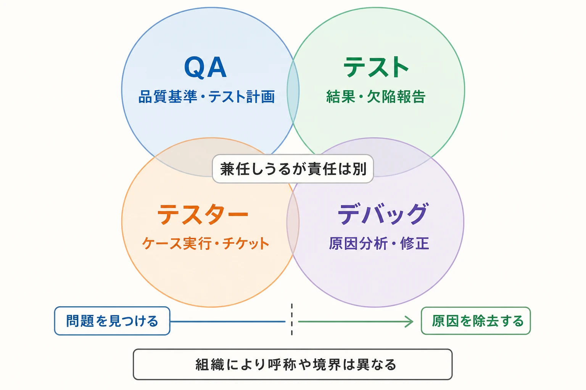
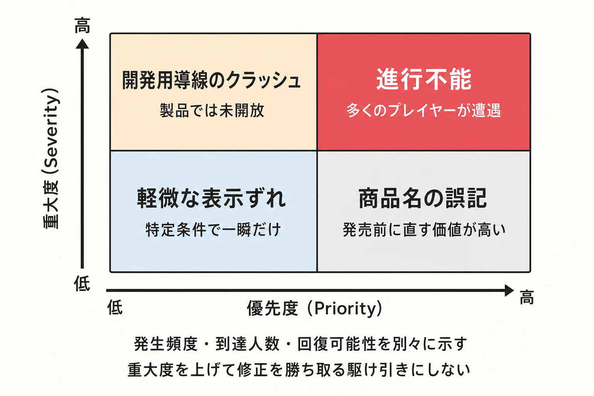
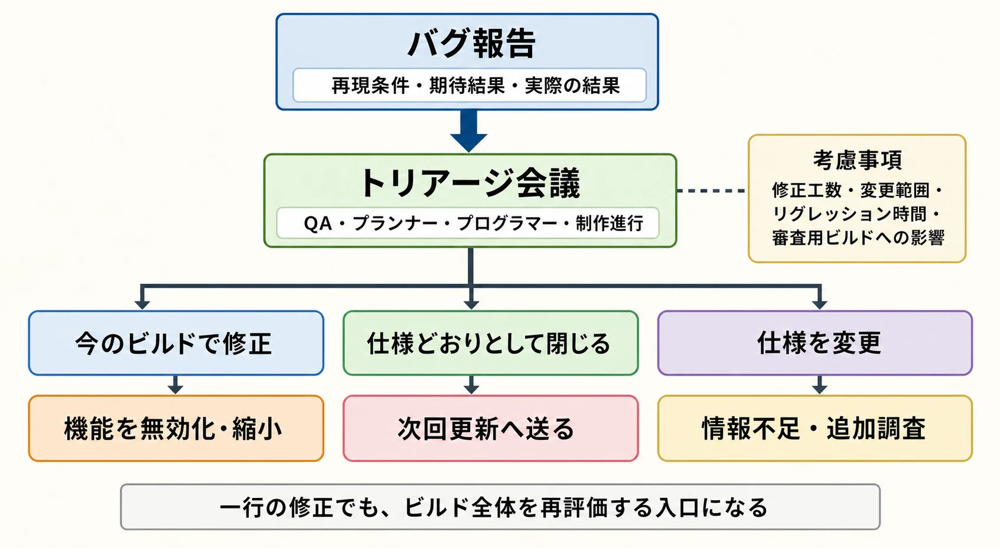
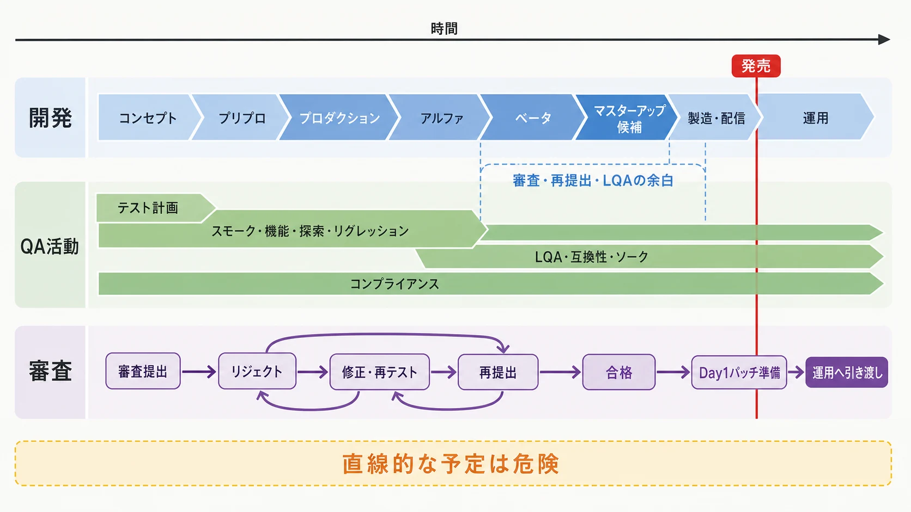
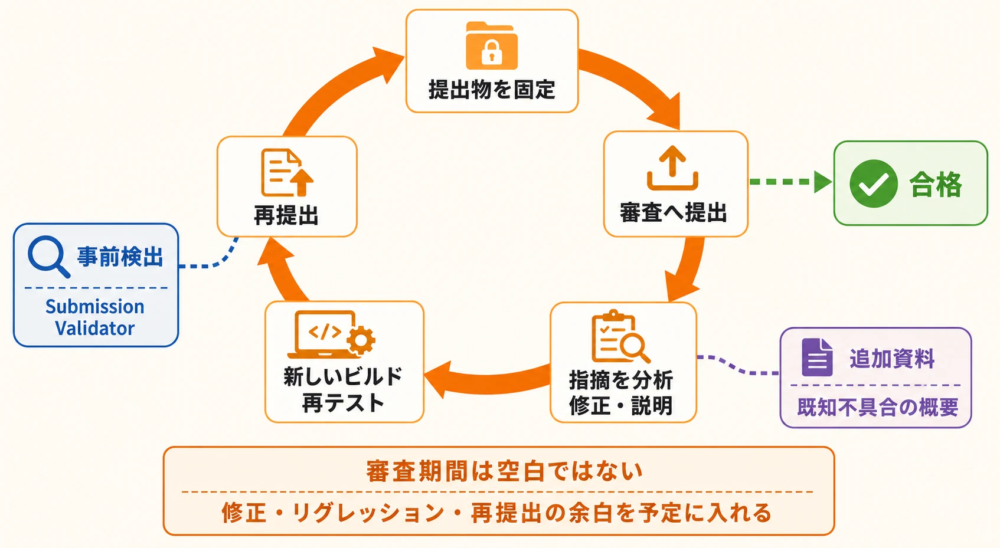
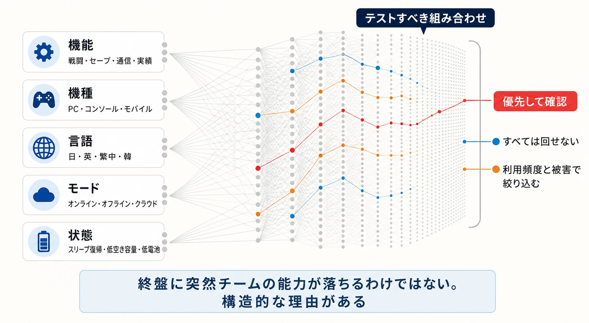

# QA・デバッグとマスターアップ——「全部直す」では出荷できないゲーム開発の実務

「テストして、見つかったバグを直せば完成する」。

新人プランナーが最初に抱きやすい誤解である。実際には、ゲームの状態と操作の組み合わせは膨大で、すべてを試すことはできない。修正には別の不具合を生む危険があり、家庭用ゲーム機ではプラットフォーマーの審査も通さなければならない。

つまり終盤の仕事は、バグをゼロにすることではない。 **限られた時間で重大なリスクを減らし、残るリスクを説明できる状態にして、出荷の可否を決めること** である。ISTQBのテスト原則でも、自明な小規模ケースを除けば網羅的なテストは不可能であり、テスト技法、優先順位付け、リスクベースドテストによって対象を絞るべきだとされている。[[1](#ref-1)]

この記事では、QAの役割からテスト設計、バグのトリアージ、プラットフォーマー審査、Day1パッチまでを、一本の出荷工程として整理する。

## QA・デバッグ・テスターは同じ仕事ではない

現場では呼び方が混ざりやすい。会社によって組織名も担当範囲も違うため、肩書ではなく **何に責任を持つか** で考えると分かりやすい。

| 用語 | 主な役割 | 代表的な成果物 |
|---|---|---|
| QA（Quality Assurance） | 品質を確認できる工程を設計し、リスクを可視化する | テスト計画、品質基準、進捗・品質レポート |
| テスト | 実物を動かし、期待結果との差や未知の問題を調べる | テスト結果、欠陥報告、ログ、動画 |
| テスター | テストを設計・実行・報告する担当者 | テストケース、チェックリスト、欠陥チケット |
| デバッグ | 起きた問題の原因を特定し、修正して確認する活動 | 原因分析、修正、確認テスト |

テスターが原因調査を手伝うことも、プログラマーがテストを書くこともある。小規模チームなら一人が全部を兼ねる。ただし、 **問題を見つけること** と **原因を除去すること** は別の作業である。この区別がないと、「QAに渡したから品質はQAの責任」という危険な考え方になる。

JSTQBのゲームテスティングシラバスは、ゲームデザイナーの責任にゲームメカニクスや文書の設計を、テスト担当者の責任に戦略、テストデータ、仕様レビュー、各種テスト、欠陥分析を挙げている。また、テスト計画は完成間際ではなく、コンセプトやプリプロダクションの段階から作るものとしている。[[2](#ref-2)]

### プランナーの曖昧さは、そのままQAコストになる

プランナーがQAと関わる最初の場面は、バグ一覧を受け取るときではない。 **期待結果を決めるとき** である。

たとえば「戦闘不能中はアイテムを使えない」とだけ書いても、予約入力済みのアイテム、復活と同じフレームの入力、通信遅延中の入力、NPCによる代理使用は未定義のままだ。QAは正誤を判定できず、質問、確認待ち、再テストが増える。

仕様には最低限、次を置きたい。

- 正常時の結果
- 境界値と例外時の結果
- 他システムと競合したときの優先順位
- 中断、再接続、ロードを挟んだときの状態
- 未決事項と、その決定者

QAに早く見せる利点は、文章の誤字を直してもらうことではない。「この仕様では合否を判定できない」「この組み合わせは検証量が爆発する」と、実装前に気づけることにある。

## テスト設計は「確認項目をたくさん書くこと」ではない

用語は組織ごとに揺れるが、実務では次の三層に分けると扱いやすい。

- **テスト計画**：何のリスクを、誰が、いつ、どの環境で調べるか。開始条件、終了条件、対象外も決める。
- **テスト仕様**：どの機能や品質特性を、どんな観点と条件で評価するか。仕様との対応関係を持たせる。
- **テストケース**：事前条件、入力や操作、期待結果を、実行できる粒度まで落としたもの。

良いテスト計画には「全部確認する」ではなく、「セーブ互換性と進行不能を最優先し、装飾品の軽微な表示差は探索的テストで拾う」のような配分が書かれる。対象外を隠さず、残るリスクとして共有することも重要だ。

### 目的が違えば、テストの種類も変わる

| 種類 | 何を確かめるか | 使う場面 |
|---|---|---|
| スモークテスト | 起動、ログイン、主要画面、基本プレイなど、ビルドが詳しいテストに耐えるか | 新しいビルドを受け取った直後 |
| 機能テスト | 個々の仕様どおりに動くか | 機能の実装後、仕様変更後 |
| 探索的テスト | 経験を使い、設計済みケースの外にある問題を探す | 複雑な相互作用、仕様の穴の調査 |
| リグレッションテスト | 変更によって既存機能が壊れていないか | バグ修正、統合、SDK更新後 |
| 負荷テスト | 同時接続、生成物、通信量などが増えたとき耐えられるか | オンライン機能や大量オブジェクトの評価 |
| 互換性テスト | 端末、OS、GPU、入力機器、画面状態などの差に耐えられるか | PC・モバイル・複数機種への展開 |
| ソークテスト | 長時間動かしたとき、資源枯渇や劣化が起きないか | メモリリーク、切断、蓄積誤差の検出 |

Androidの公式品質ガイドも、市場にある全端末ではなく、対象ユーザーを代表する実機とエミュレーターを選び、主要なハードウェアとソフトウェアの組み合わせを試すよう勧めている。[[3](#ref-3)] 互換性テストは「全機種を触る」ことではない。利用者数、性能帯、OS、GPU、画面形状、過去の不具合をもとに、代表環境と危険な端を選ぶ仕事である。

## バグ票は「壊れています」では直せない

バグ管理で最も価値がある情報は、派手なスクリーンショットより **再現条件** である。少なくとも次を残す。

- ビルド番号、機種、OS、言語、通信環境
- 使用アカウント、セーブデータ、ゲーム内状態
- 事前条件と、番号付きの再現手順
- 期待結果と実際の結果
- 再現回数と試行回数
- ログ、動画、クラッシュダンプ、発生時刻
- 回避策の有無と、影響する範囲

「3回に1回」と「1回起きたが、残り2回は試していない」は違う。分母まで書く。オンラインゲームではサーバーログと突き合わせられるよう、時刻とアカウント識別情報も必要になる。

### SeverityとPriorityを分ける

**Severity（重大度）** は、起きたときの被害の大きさである。 **Priority（優先度）** は、いつ直すかという事業・開発上の順番である。

|  | Priority：高 | Priority：低 |
|---|---|---|
| Severity：高 | 多くのプレイヤーが遭遇する進行不能。直す、機能を外す、延期する判断が必要 | 未開放の開発用導線だけで起きるクラッシュ。出荷範囲から確実に除外できるなら後回しになり得る |
| Severity：低 | 起動画面の商品名の誤記。機能は壊さないが、発売前に直す価値が高い | 特定条件で一瞬だけ起きる軽微な表示ずれ |

分類名や決裁者はチームごとに決めればよい。大切なのは、重大度を上げて修正を勝ち取る駆け引きにしないことだ。発生頻度、到達人数、回復可能性、法務・審査・課金への影響、修正範囲を別々に示す。

### トリアージは「直すバグを選ぶ会議」

トリアージでは、QA、プランナー、プログラマー、制作進行などが、報告を次のどれに送るか決める。

- 今のビルドで修正する
- 仕様どおりとして閉じる
- 仕様を変更する
- 機能を無効化・縮小する
- 次回更新へ送る
- 情報不足として追加調査する

修正工数だけで決めてはいけない。変更箇所の広さ、リグレッションに必要な時間、審査用ビルドを作り直す影響まで含める。終盤では、簡単に見える一行の修正でも、安定していたビルド全体を再評価する入口になる。

### 「再現しない」は解決ではない

再現できない報告を即座に閉じると、低頻度の重大障害を捨てることになる。ビルド差、端末、セーブ状態、通信、スリープ復帰、直前の操作を確認し、試行条件と回数を残す。ログ追加やテレメトリーで次回の証拠を増やし、「再現不能」ではなく **現時点の観測状態** として管理する。

一方で、無期限に全員で追うこともできない。被害が軽く、頻度も低く、検出手段もないなら保留は妥当になり得る。判断根拠と再開条件を残すことが、放置との違いである。

## 進行不能・クラッシュ・フリーズ・メモリリークが重い理由

これらは一括して最高ランクになるわけではないが、出荷判断では厳しく見る。

- **進行不能**：以後のコンテンツに到達できない。セーブ後に戻れなければ被害が永続する。
- **クラッシュ**：セッションを強制終了し、未保存の進行を失わせる。原因がデータ破損なら再起動でも直らない。
- **フリーズ**：画面が止まり、入力を受けない。OSから見れば生存中の場合もあり、自動回収しにくい。
- **メモリリーク**：使い終えたメモリが解放されず、長時間後に遅延やクラッシュとして現れる。短い確認では通過しやすい。

Microsoftが公開する現行のXbox Requirementsでも、タイトルの安定性に加え、クラッシュ、フリーズ、重大な進行阻害などの深刻な問題がないことを、提出品質の要件として挙げている。[[4](#ref-4)] ただし、発生経路が製品に存在しない、プレイヤーが安全に回復できるなど、条件によって扱いは変わる。名称だけで機械的に決めず、被害と到達可能性を見る。

## ゲームの自動テストは難しい。それでも捨てる理由はない

ゲームは入力タイミング、物理演算、乱数、AI、通信、フレームレートが結果に影響する。状態の組み合わせも多く、「楽しい」「見栄えが自然」「音が場面に合う」といった評価は単純な真偽値にしにくい。頻繁な演出変更で、画面操作をなぞる自動テストが壊れ続けることもある。

そのため、 **人間のプレイを丸ごと置き換える** 発想は費用対効果が悪くなりやすい。代わりに、答えが安定している領域を機械へ渡す。

- データの欠損、重複ID、参照切れ、範囲外値の検査
- ダメージ式、報酬式、抽選テーブルなどの単体テスト
- 起動、ログイン、マップ読み込み、セーブ・ロードの往復
- 全マップや主要アセットのロード確認
- 既知の進行ルートを通るスモークテスト
- フレーム時間、メモリ、通信失敗、クラッシュの継続計測
- 翻訳文字列の変数、禁則、未翻訳、はみ出し候補の検査

Unity Test Frameworkは、エディター上のEdit Modeと実行時のPlay Modeのテストを公式に支援している。[[5](#ref-5)] 自動化の価値は、すべてのバグを見つけることではない。人が同じ確認を繰り返す時間を減らし、変更のたびに最低限の安全網を素早く通すことにある。

## LQA、レーティング、コンプライアンスは別の合否軸

**LQA（Localization Quality Assurance）** は、翻訳文だけの校正ではない。実機上で文脈、用語統一、文字化け、フォント、改行、UIからのはみ出し、音声と字幕、日付・通貨・単位、文化的適合などを確認する。JSTQBのゲームテスティングシラバスも、言語、地域要件、特殊文字、UI表示、機能をローカライゼーションテストの対象にしている。[[2](#ref-2)]

**レーティング確認** は、対象年齢に関わる表現を把握し、申請内容と製品が一致しているかを見る仕事である。CEROは、申請者からの依頼受付、複数の審査員による表現内容の審査、年齢区分の決定、判定結果の通知、マーク表示までの流れを公開している。[[6](#ref-6)] 4Gamer.netの公式インタビューでも、メーカー提出資料を複数の審査員が確認する映像審査の仕組みで運用されていることが語られている。[[7](#ref-7)] デジタル配信で使われるIARCでは、開発者が質問票へ回答し、地域別の年齢評価や内容記述が付与される。[[8](#ref-8)] どちらも「QAが最後に遊んで問題なさそうならよい」という工程ではない。

**コンプライアンス確認** は、法令、年齢区分、ストア表示、プラットフォームの技術要件や用語などへの適合を見る。面白さや通常の機能テストとは別の合否軸であり、軽微な文言でも審査上は出荷を止めることがある。

## マスターアップとは、バグゼロ宣言ではない

マスターアップは、製造・配信・審査へ進める基準となるビルドを確定する節目である。 **ゴールドマスター** や「gone gold」は、物理メディアの製造へ回せる完成版を指す言葉として使われてきた。PlayStation.Blogでも、過去のタイトルについて、gone goldを製造と出荷へ進める完成状態として説明している。[[9](#ref-9)]

ただし、デジタル配信や発売後更新が前提の現在は、チームや契約によって言葉の境界が違う。社内の「マスター候補完成」、プラットフォーマー審査の合格、製造開始を混同しないよう、マイルストーンごとに定義する。

完成とみなす基準の例は次のとおりである。

- 対象機能とコンテンツが固定されている
- 必須のスモーク、機能、リグレッション、互換性テストが完了している
- 未承認の進行不能、データ破損、重大クラッシュが残っていない
- レーティング、ストア情報、必要な提出物が製品と一致している
- 既知不具合の影響、回避策、対応時期、決裁者が記録されている
- リリース後の監視、問い合わせ、修正配信の担当が決まっている

これは万能な正解ではない。買い切りのオフライン作品と、毎週更新するオンライン作品では終了条件が違う。重要なのは、「なんとなく安定した」ではなく、誰が何を根拠に出荷可能と判断したかを残すことだ。

### 既知不具合を抱えた出荷判断

全部のバグを直せない以上、既知不具合リストは敗北の記録ではなく、意思決定の台帳になる。各項目について次を比べる。

1. どれくらいの人が、どれくらいの頻度で遭遇するか。
2. 進行、セーブ、課金、公平性、法令、審査へ何を起こすか。
3. 再起動や設定変更など、安全な回避策があるか。
4. 修正が触る範囲と、別の不具合を生む危険はどれくらいか。
5. 修正後に必要なテストと再審査を、期限内に終えられるか。

選択肢は「修正する」と「放置する」だけではない。機能を外す、条件を制限する、発売を遅らせる、告知したうえで更新へ送るという判断もある。終盤ほど、直さない勇気ではなく、 **直す危険まで説明する責任** が必要になる。

## プラットフォーマー審査という見えない壁

家庭用ゲーム機では、開発会社のQAを通過しても出荷は確定しない。プラットフォーマーが、安全性、安定性、システム連携、表示、パッケージなどの要件に照らして提出物を確認する。

任天堂の公開ページは、発売準備として契約と年齢レーティングの取得を案内している。英語版では、発売前に任天堂のレビューへ提出し、安全に遊べることと任天堂の制作基準への適合を確認すると説明している。[[10](#ref-10)] SIEは、PlayStation Partnersへの登録承認と契約後に、開発ツール、公開用資料、文書、サポートへアクセスできるとしている。[[11](#ref-11)] 詳細要件の多くは登録者向けであり、外部から推測して埋めるものではない。

審査要件を一括して「TRC」「TCR」と呼ぶ会話もあるが、正式名称は会社、時期、地域で変わり得る。たとえばMicrosoftの現在の公開文書は **Xbox Requirements（XR）** という名称を使う。[[4](#ref-4)] 「ロットチェック」も任天堂向け審査を指す通称として扱われることがあるが、現行の公開ページは単にレビューと説明している。プロジェクトでは、その時点の公式文書と担当窓口を正とする。

審査で問題が見つかれば、通常は次の循環になる。

1. 提出用ビルドと資料を固定する。
2. 審査へ提出する。
3. 指摘を分析し、修正または説明を行う。
4. 新しいビルドを作り、影響範囲を再テストする。
5. 再提出する。

Microsoftの公開Game Publishing Guideでも、パッケージはXbox Requirementsへの適合確認を受け、不合格なら問題を直して再提出すると説明されている。既知不具合の概要を審査チームへ追加資料として渡せることも明記されている。[[12](#ref-12)] つまり審査期間は、発売日までの空白ではない。 **リジェクト、修正、リグレッション、再提出の余白** として予定に入れる必要がある。

また、事前検証ツールを通したから合格が保証されるわけではない。それでも、MicrosoftのSubmission Validatorのように、提出時に失敗しやすいパッケージ上の問題を先に検出する公式ツールはある。[[13](#ref-13)] プランナーも、システムメッセージ、サインイン導線、切断時の挙動、公式用語など、自分の仕様が審査項目と接続していることを理解したい。

## Day1パッチは「あとで直せばよい」を可能にする魔法ではない

Day1パッチは、製造や本編ビルドの提出を止めた後も、発売日に向けて別の更新を準備する構造から生まれる。物理メディアの製造、ストア登録、事前ダウンロードには締切がある一方、開発チームはその後も修正を続けられるためだ。

合理的な場合もある。低リスクの修正を本編ビルドへねじ込み、全体を不安定にするより、変更を分離して十分に検証する方が安全なこともある。しかし次の負債を伴う。

- オフライン利用者や更新前の利用者は、元のビルドを遊ぶ
- ダウンロード容量と回線時間をプレイヤーへ負担させる
- パッチ自体にもQA、提出、配信準備が必要になる
- 本編とパッチの組み合わせで、新しい不具合が生まれ得る
- 「発売日までに何とかする」が常態化すると、再提出余白を食いつぶす

判断軸は、パッチがあるかどうかではない。 **更新なしでも商品として成立するか、更新の失敗時に戻せるか、プレイヤーへ負担を説明できるか** である。

## なぜマスターアップ直前に問題が集中するのか

終盤に突然チームの能力が落ちるわけではない。構造的な理由がある。

- コンテンツがそろい、初めて全体を通して遊べる
- セーブ、通信、実績、課金、ローカライズなどの結合点が増える
- 最適化やSDK更新が広い範囲へ影響する
- 修正が新しいリグレッションを生む
- 長時間プレイや低頻度条件の問題が、試行回数の増加で見え始める
- 実機、製品相当設定、提出用パッケージでしか出ない問題がある

したがって「開発完了後にデバッグ期間を置く」という一本線の予定は危険だ。発売日から逆算し、審査と再提出、レーティングとLQA、コンテンツ固定、フルリグレッション、その前の機能テストを重ねて配置する。

見積もりでは画面数だけでなく、 **機能 × 機種 × 言語 × モード × 状態** の組み合わせを見る。すべては回せないため、利用頻度と被害をもとに優先順位を付ける。バグ件数だけでなく、新規流入数、修正完了数、再オープン数、重大度別残数、テスト未実施範囲も追う。件数が減っていても、重大バグが再発し続けているなら収束していない。

大規模チームは機能QA、LQA、コンプライアンス、外部テスト会社などを分けられる。一方、インディーでは一人が複数役を担うことが多い。後者ほど、対象機種表、終了条件、既知不具合リスト、外部テストを使う時期を早く決める必要がある。人数が少ないことより、判断が頭の中だけにあることの方が危険だ。

## マスターアップは、品質責任の終了ではない

マスターアップは祝うべき節目だが、ゲームがプレイヤーの環境で動き始める入口でもある。発売後には、社内で再現しなかった端末差、想定を超える同時接続、未知の遊び方、問い合わせが現れる。

出荷前のQAは、そこで終わる作業ではない。既知不具合、ログ、判断理由、回避策を、カスタマーサポートと運営・更新チームへ渡す橋である。

完成とは、問題が一つもない状態ではない。 **残る問題を把握し、許容した理由を説明でき、何か起きたときに次の行動へ移れる状態** である。それを作るのが、QA・デバッグとマスターアップの泥臭い実務だ。

## References

1. [ISTQBテスト技術者資格制度 Foundation Level シラバス 日本語版 Version 2023V4.0.J02][1] - 網羅的テストは自明なケースを除いて不可能であり、優先順位付けとリスクベースドテストで対象を絞るという原則を示す。

2. [ISTQBテスト技術者資格制度 Foundation Level シラバス ゲームテスティング Version 1.0.1.J01][2] - ゲーム開発における役割、ライフサイクルを通したテスト、組み合わせ爆発、マルチプラットフォーム、ローカライゼーションテストを解説する。

3. [Core app quality - Android Developers][3] - 対象ユーザーを代表する実機、エミュレーター、OSやフォームファクターを選ぶテスト環境の考え方を示す。

4. [Xbox Requirements for Xbox Console Games - Microsoft Learn][4] - 現行のXbox Requirementsと、安定性、提出品質、クラッシュ・フリーズ・進行阻害などに関する公開要件を示す。

5. [Unity Manual: Test Framework][5] - UnityにおけるEdit ModeとPlay Modeのテスト支援を案内する公式文書。

6. [レーティング制度 - CERO][6] - CEROの審査依頼受付から年齢区分マーク表示までの工程を説明する公式ページ。

7. [［インタビュー］今の時代におけるCEROの存在意義とは？ 審査不通過による発売見送り，対象年齢外タイトルのヒット，IARCなどへの見解を聞く - 4Gamer.net][7] - CEROがメーカー提出資料を複数の審査員が確認する審査運用について公式に語った2023年5月のインタビュー記事。

8. [IARCの仕組み][8] - 質問票への回答から地域別評価、コンテンツ記述子、インタラクティブ要素が付与される流れを示す。

9. [Sack it to Me: LittleBigPlanet PS Vita Goes Gold! - PlayStation.Blog][9] - 「gone gold」を、製造して店舗へ送る前の完成状態として説明した公式ブログ記事。

10. [The Process - Nintendo Developer Portal][10] - 開発者登録から年齢レーティング、任天堂によるレビュー、発売後サポートまでの公開工程を説明する。

11. [PlayStation®にあなたのゲームを披露しませんか - Sony Interactive Entertainment][11] - PlayStation Partnersの登録、契約後に利用できる開発・公開資料と支援の範囲を案内する。

12. [Certification (Certify) - Game Publishing Guide - Microsoft Learn][12] - Xboxパッケージ審査、既知不具合資料の提出、不合格時の修正と再提出を説明する。

13. [Submission Validator introduction - Microsoft Learn][13] - パッケージ取り込みや認証で失敗しやすい一般的な問題を事前検出する公式ツールを説明する。

[1]: https://www.jstqb.jp/wordpress/wp-content/uploads/2026/02/CORE-FOUNDATION-FL%E3%82%B7%E3%83%A9%E3%83%90%E3%82%B9CTFL.pdf
[2]: https://www.jstqb.jp/wordpress/wp-content/uploads/2026/03/JSTQB-Syllabus.Foundation_CT_GaMe_v1.0.1.J01.pdf
[3]: https://developer.android.com/docs/quality-guidelines/core-app-quality
[4]: https://learn.microsoft.com/en-us/gaming/gdk/_content/gc/policies/console/certification-requirements
[5]: https://docs.unity3d.com/ja/current/Manual/com.unity.test-framework.html
[6]: https://www.cero.gr.jp/publics/index/17/
[7]: https://www.4gamer.net/games/999/G999905/20230518083/
[8]: https://www.globalratings.com/ja/iarc%E3%81%AE%E4%BB%95%E7%B5%84%E3%81%BF/
[9]: https://blog.playstation.com/2012/09/03/sack-it-to-me-littlebigplanet-ps-vita-goes-gold/
[10]: https://developer.nintendo.com/the-process
[11]: https://sonyinteractive.com/jp/news/blog/showing-your-game-to-playstation/
[12]: https://learn.microsoft.com/en-us/gaming/game-publishing/concepts/certification/certification-overview
[13]: https://learn.microsoft.com/en-us/gaming/gdk/docs/features/common/packaging/subval/submissionvalidator

----

この文書は、Perplexity、Claude、OpenAI Codex の3つのAIの支援を受けて著述されたものです。引用画像を除き、MIT License にて提供されています。
