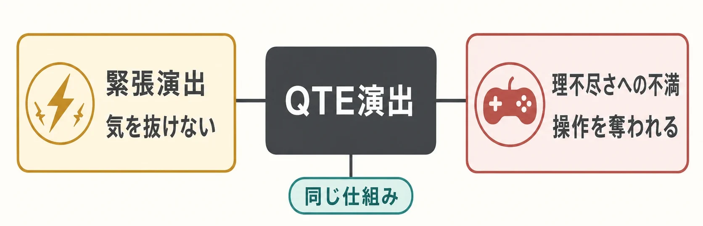
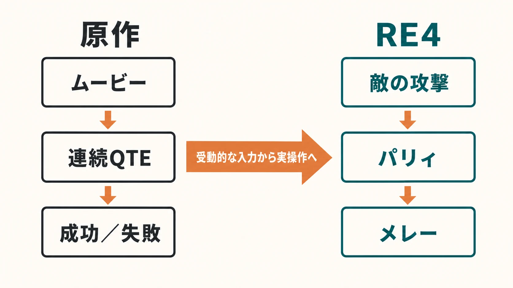
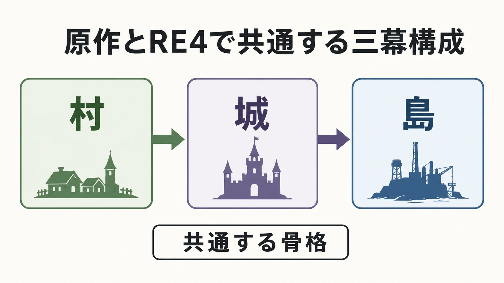
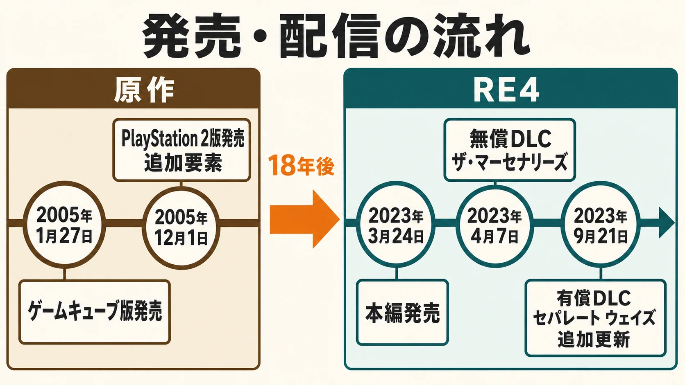

# 『バイオハザード4』と『バイオRE:4』——変えた設計、変えなかった設計

『バイオハザード4』（以下、原作）は2005年1月27日にニンテンドーゲームキューブ向けに発売され、同年12月1日発売のPlayStation 2版でAMATEURモード、エイダを主人公とした隠しシナリオ「the another order」、レーザー武器「P.R.L.412」といった追加要素が加わった[[1](#ref-1)][[2](#ref-2)]。それから18年後の2023年3月24日、『バイオハザード RE:4』（以下、RE4）としてフルリメイクされたこの作品は、プロデューサーの平林良章氏が「原作の核を大事にしつつ、現代のプレイフィール、再構成されたストーリー、最新のグラフィックによって、最新のサバイバルホラーとしてリメイクすること」を掲げて制作した、単なるグラフィック刷新にとどまらない作品である[[3](#ref-3)]。本稿では、シリーズ企画記事の慣例に沿い、両作を並べて「何を変え、何を変えなかったか」というプランナー視点の設計判断として言語化する。『[大神](okami-control-redesign-wii-ps3-hd.md)』記事が「リメイクではなくコントロール再設計」という切り口だったのに対し、本作は明確な一対一のリメイクであるため、原作の文法を踏まえた上で個別のシステムがどう置換・維持・分離されたかという構造比較に焦点を当てる。

***

## 原作が確立したTPSサバイバルホラーの文法

原作最大の功績は、それまで固定カメラだったシリーズの視点を、レオンの肩越しに構える「オーバーショルダー視点」へ切り替えたことにある。ディレクターの三上真司氏は、当時をエグゼクティブプロデューサーの竹内潤氏に振り返り、「単純にその角度のほうが良いと思っただけで、何か新しいことや画期的なことをしようとしていたわけではなかった」と述べている[[4](#ref-4)]。意図的な差別化戦略というよりも自然な進化として選ばれたこの視点変更だが、狙いを定めると画面がズームしレオンの背中越しに敵を注視する構図は、プレイヤーに「照準を合わせる間は移動できない」という明確なトレードオフを課した。竹内氏はのちに、Epic Gamesの開発者から『Gears of War』の射撃と視点が本作のカメラの影響を受けたと聞かされたというエピソードを明かしており、この文法が後の多くのサードパーソンシューターに影響を与えたことがうかがえる[[4](#ref-4)]。

この視点と組み合わさったのが部位破壊による怯み管理である。頭部への命中でよろめかせて近接コンボへ繋ぐ、脚を撃って転倒させる、といった部位ごとの反応差は、単なる弾を当てる射撃から「どこを狙うか」という戦術選択をプレイヤーに要求した。狙いを定めている間は無防備になるという緊張と、部位破壊で得られる隙という報酬が表裏一体になっており、これが「立ち止まって撃つ」というオーバーショルダー視点の制約を逆にゲームプレイの核に転化した設計だと言える。

マーチャント（武器商人）の装備更新ループも、原作が確立した文法の一つである。道中で得たお宝を換金し、火力・連射・リロード速度・弾倉容量といった軸で武器を強化する。プレイヤーはショットガンで近距離の制圧力を取るか、ライフルで部位破壊の精度を取るか、といった資源配分の意思決定を繰り返し行うことになり、これが探索と戦闘の間の経済的な緊張を生んでいた。

アタッシェケースのインベントリパズルは、こうした資源管理をさらに空間的な制約に落とし込んだ仕組みである。武器・弾薬・回復アイテム・お宝をテトリス状のグリッドに配置することで、「何を持ち歩き、何を売り、何を捨てるか」という取捨選択がプレイのたびに発生する。単なる所持数制限ではなく、アイテムの形状差（大型ライフルは場所を取る、小型ハーブは隙間に収まる）が視覚的なパズルとして機能し、装備更新ループとインベントリパズルが合わさることで、原作の「稼いで、選んで、持ち帰る」というサバイバルホラーとしての資源管理サイクルが完成していた。

***

## QTEとムービー演出——導入意図と分かれた評価

原作が当時のアクションゲームの潮流に乗って積極的に採用したのが、コンテキストセンシティブなQTE（クイックタイムイベント）である。プロデューサーの平林良章氏は後年、原作制作時の狙いを「ムービー中でも気を抜けない環境がいいのでは」と考えてQTEを組み込んだと振り返っている[[5](#ref-5)]。カットシーンの最中に唐突にボタン入力を要求し、失敗すれば即座にダメージやゲームオーバーに繋がるこの仕組みは、プレイヤーに「ムービーだから安全」という油断を許さない緊張演出として機能した。

この設計意図は、単なる目新しいギミックの実装にとどまらない。ムービー演出の受動性とゲームプレイの能動性の境界を意図的に曖昧にすることで、「このゲームでは何が起きても不思議ではない」という緊張感をプレイヤーに植え付ける狙いがあったと考えられる。事実、クラウザーとのナイフ戦は原作において「QTEの最終試練」とも言うべき長大な連続入力シーケンスとして構築されており、格闘シーンの緊張とQTE特有の予測不能な操作要求を組み合わせた、原作を象徴する演出の一つになっていた。

一方で、この設計についての評価は一様ではない。海外ゲームメディアSVGの回顧記事は、QTEについて「"バイオハザード"シリーズの誰にとっても一番のお気に入りだったことはない」としたうえで、巨石から逃げるシーンなどの連打QTEを、不意に現れてコントローラーを置く間もなく親指を酷使させる、笑ってしまうほど理不尽な仕組みとして振り返る。ただし同記事は、クラウザーとのナイフ戦のQTEに限っては「なくなったことをむしろ惜しむ」プレイヤーもいると指摘し、この仕組みをシリーズの中でも「もっとも評価の分かれる仕組みの一つ」と位置づけている[[6](#ref-6)]。SVGという一媒体の見解ではあるが、失敗時の理不尽さへの不満と緊張演出としての効果への評価とが同じ仕組みの中に同居しているという指摘は、平林氏自身が「予測していない時にボタンを押せないとやられるというのは嬉しくない体験である」と、この設計が抱えていた負の側面を認めている点とも符合する[[5](#ref-5)]。

***

## リメイクの決断——QTEを操作へ置き換える

RE4開発陣は、この評価の分かれたQTEという文法に真正面から向き合った。プロデューサーの平林氏はメールインタビューで、QTEの定義自体が人によって異なると前置きしたうえで、「原作にあったカットシーンの途中に突然出るようなQTEは、本作ではございません。ただ無くすだけというわけではなく、ゲームとして再構成しているところも一部あります」と説明している[[7](#ref-7)]。

この置き換えの核心にあったのが、クラウザーとのナイフ戦の再設計である。Game Informerの取材によれば、本作のディレクションを担うチームは、原作のQTE偏重のクラウザー戦を見直す中で「リメイクでナイフを使って戦うとしたら、どう実現すべきか」という問いに直面し、そこから生まれたのが新しいナイフパリィ機構だったという。チームはこの仕組みがクラウザー戦一つに留まらず、通常戦闘全体に応用できる汎用性を持つことに気づき、標準的な近接戦闘オプションとして正式に採用するに至った[[8](#ref-8)]。つまりRE4のパリィシステムは、ボス戦特化の入力当てゲームを解体し、その代替として生まれた仕組みを全編の戦闘文法へ格上げしたという開発順序を辿っている。この判断の背景には、プロデューサー平林氏が掲げる「死を逸し、倒す快感」というコンセプトがある[[3](#ref-3)][[5](#ref-5)]。九死に一生を得る緊張と、それを自分の操作で切り抜けたときの爽快感を、QTEという受動的な反射入力ではなく、プレイヤー自身の判断とタイミングに委ねる能動的なアクションへ委譲したのが、このリメイクにおける最大の設計転換だと言える。

プランナーとして持ち帰るべき教訓は、「賛否が分かれた仕組みを削除するだけでなく、その仕組みが担っていた機能（ここでは緊張感の演出と気の抜けない没入）を代替システムに引き継がせる」という手順である。単純な機能削減ではなく、機能の分解と再配置がここでの本質になっている。

***

## 新規導入：ナイフパリィと耐久度システム

RE4で新たに追加されたナイフパリィは、通常パリィとジャストパリィの二段階で構成される。敵の攻撃に合わせてナイフを構えるだけで発動する通常パリィはダメージを防ぐが、攻撃が当たる直前ぎりぎりのタイミングで構えると成立する「ジャストパリィ」は、敵を大きくよろめかせて近接攻撃（メレー）へ直結させることができる[[9](#ref-9)]。この二層構造により、初心者は安全策として早めにパリィを狙い、上級者はリスクを取ってジャストパリィのタイミングを攻めるという、腕前に応じた選択の幅がプレイヤーに委ねられている。

このパリィにはナイフの耐久度という資源制約が組み合わされている。平林氏によれば、パリィなどのアクションを行うたびに耐久値が減少し、ゼロになるとナイフが破損して構えられなくなる。修理可能なメインのナイフに加え、修理はできないが道中で拾える消費型のナイフも用意されており、ナイフは弾薬や資金と並ぶ管理対象のリソースとして戦略に組み込まれている[[5](#ref-5)][[3](#ref-3)]。難易度「プロフェッショナル」ではパリィの成立条件がジャストパリィのみに限定される仕様もあり、難易度設計そのものがこの近接システムの精度要求を段階的に調整する軸として機能している[[10](#ref-10)]。

この設計がプランナー視点で興味深いのは、パリィという「守り」の選択肢に耐久度という「消費」のコストを紐づけたことで、既存のマーチャント経済ループへ新しい変数を接続した点にある。原作では弾薬とお金の管理が資源配分の中心だったが、RE4ではそこにナイフの耐久度という第三の資源軸が加わり、「銃で戦うか、ナイフで凌ぐか、いつ修理に金を使うか」という三すくみ的な判断をプレイヤーに追加で課している。近接戦は原作でも存在したが、あくまで補助的な選択肢だった。RE4ではパリィが正面から敵の攻撃を防ぐ主力戦術に格上げされたことで、近距離戦の選択肢が質的に拡張されたと言える。

***

## 変えなかった部分——原作の骨格の継承

一方でRE4は、原作の骨格そのものは意図的に維持している。プロデューサー平林氏はPlayStation Blogの発売直前インタビューで「原作ではできたのに本作ではできないという部分は、ほぼない」と明言し、新しい要素をただ足すのではなく、原作のプレイフィールを維持したうえで拡張することが本作のリメイクの核心だと語っている[[11](#ref-11)]。同氏はファミ通のインタビューでも、最初にレオンが立ち入る不気味な猟師小屋や、村の広場に到達してからのアップテンポなゲーム展開など、原作にあった各エリアのコンセプトに向き合い、パワーアップさせる方針を語っている[[3](#ref-3)]。

具体的に維持された要素は多岐にわたる。オーバーショルダー視点の基本文法はそのまま継承されている一方、操作面には現代的なアレンジも加えられており、原作にあった「狙いを定めている間は移動できない」という制約は撤廃され、銃を構えたまま移動できるようになった[[11](#ref-11)]。マーチャントの装備更新ループとアタッシェケースのインベントリパズルは健在で、武器改造による資源配分の判断と、グリッド管理による取捨選択という二重の意思決定サイクルは変わっていない。村・城・島という三幕構成のマクロ構造も維持されており、各章ごとに戦闘のテンポや恐怖の質感を切り替えるという原作のリズム設計がそのまま生かされている。

以下は原作とRE4における主要システムの対比である。

| 要素 | 原作（2005） | RE4（2023） |
| :-- | :-- | :-- |
| 視点 | オーバーショルダー視点を新規導入 [[4](#ref-4)] | 同じ文法を継承、ただし狙いながらの移動制約は撤廃 [[11](#ref-11)] |
| ムービー中の緊張演出 | コンテキストセンシティブQTEを多用 [[5](#ref-5)][[6](#ref-6)] | ほぼ廃止、プレイヤー操作へ置換 [[7](#ref-7)] |
| クラウザー戦 | 連続QTEシーケンス | ナイフパリィによる実操作戦闘 [[8](#ref-8)] |
| 近接戦の選択肢 | 補助的なナイフ攻撃 | 通常パリィ／ジャストパリィ＋耐久度システム [[9](#ref-9)][[10](#ref-10)] |
| マーチャント／インベントリ | 原作で確立 | 基本文法を維持 [[11](#ref-11)] |
| エイダ主人公シナリオ | PS2版で無償追加要素「the another order」として本編内に内包 [[1](#ref-1)] | 有償DLC「セパレート ウェイズ」として本編発売から約半年後に分離配信 [[12](#ref-12)] |
| マーセナリーズ | 本編に同梱 | 無償DLCとして本編発売の約2週間後に配信、エイダ・ウェスカーの参戦は本編発売から約半年後の追加更新 [[13](#ref-13)][[12](#ref-12)] |

***

## コンテンツ配信モデルの変化——本編内蔵から分離配信へ

原作では、エイダを主人公とする隠しシナリオ「the another order」は、PS2版において本編クリア後に出現する無償のボーナスコンテンツとして本編ディスクに内包されていた[[1](#ref-1)]。マーセナリーズ（タイムアタック形式の高難度モード）も、原作から本編に同梱される形で提供されてきた。つまり原作の時代における「やり込み要素」は、パッケージ販売という単一の売り切りモデルの中で、周回プレイや高難易度モードのおまけとして機能していた。

これに対しRE4は、同じ「やり込み要素」の中でも、コンテンツの性質に応じて配信のタイミングを使い分けている。「ザ・マーセナリーズ」は本編発売からわずか2週間後の2023年4月7日に、無償DLCとして配信された[[13](#ref-13)]。一方、原作の「the another order」に相当するエイダ主人公編「セパレート ウェイズ」は、本編発売から約半年後の2023年9月21日に有償DLCとして単独販売され、価格は1,000円（税込）に設定された。この同じ9月21日、既存の「ザ・マーセナリーズ」にエイダ・ウォンとアルバート・ウェスカーを新規プレイアブルキャラクターとして追加する無償アップデートも合わせて配信されている[[12](#ref-12)]。

この配信順をプランナー視点で読むなら、ローンチ直後の無償モードと、約半年後の有償ストーリー拡張は、プレイヤーに異なる役割を与える構成として見える。前者は本編を終えたプレイヤーに再挑戦の場を早期に提供し、後者はエイダの視点から本編の物語を補完する。ただし、公開資料から各コンテンツの制作期間、収益目標、アセット共有の有無までを断定することはできない。本作で確認できるのは、コンテンツの種類ごとに異なる時点と価格で提供されたという配信のあり方である。

***

## プランナーへの教訓——「変える」「変えない」の判断基準

RE4というリメイクが示すのは、変更の判断が「古いか新しいか」という単純な二択では下されていないという点である。三つの判断基準が浮かび上がる。

第一に、賛否が割れた仕組みは機能ごとに分解して代替せよ、という原則である。ムービー中に突発的に操作を強いるQTEという文法そのものはほぼ姿を消したが、その発端であるクラウザー戦の再設計を通じて、QTEが担っていた「油断させない緊張感」という機能は、プレイヤー主導のパリィという能動的なシステムへ引き継がれた。全否定でも温存でもなく、機能の切り分けが鍵になっている。

第二に、ジャンルの根幹をなす骨格は温存し、拡張は操作面や近接戦闘といった末端のシステムに集中させる、という原則である。オーバーショルダー視点、マーチャントのループ、アタッシェケース、三幕構成といった原作の骨格はそのまま維持されており、狙いながらの移動やしゃがみ、ステルスキルの追加といった変更は、いずれも根幹の資源管理サイクルには手を付けないサブシステム側の拡張にとどまっている。骨格を変えずに末端を拡張することで、原作ファンの期待を裏切らずに新規性を提供できる。

第三に、コンテンツの性質に応じて配信モデルとタイミングを切り分ける、という原則である。本作で確認できる配信順からは、リプレイ性重視のモードを本編発売後の早い時点で無償配信し、ストーリー拡張を後発の有償DLCとして提供する構成を見ることができる。プランナーは「何を本編に残し、何をどのタイミングで後から配信するか」を企画段階から設計する視点を持つ必要がある。

## References

1. [ニンテンドー ゲームキューブ版との違いについて／PlayStation 2版のオリジナル要素について][1] - PS2版で追加されたAMATEURモード、隠しシナリオ「the another order」、レーザー武器「P.R.L.412」等を確認した。

2. [「ファミ通 AWARDS 2005」にてカプコンの『バイオハザード4』が大賞を受賞][2] - PlayStation 2版（日本国内）の発売日が2005年12月1日であることを確認した。

3. [『バイオハザード RE:4』平林Pにインタビュー。「"死を逸（かわ）し、倒す快感"というものをキーワードにしています」][3] - プロデューサー平林良章氏のコンセプト発言、猟師小屋・村の広場のエリアコンセプト継承方針、ナイフによるパリィと耐久度・武器商人での修理の仕組みを確認した。

4. [Shinji Mikami didn't realize the impact of Resident Evil 4's camera][4] - 三上真司氏のオーバーショルダー視点に関する発言と、竹内潤氏が明かした『Gears of War』への影響エピソードを確認した。

5. [『バイオハザード RE：4』ケースやナイフもプレイの幅を広げる？ 闇の表現や怖さなどの違いを平林プロデューサーが語る][5] - 原作でQTEを導入した設計意図、リメイクでの再考、ナイフの耐久度と修理の仕組みを確認した。

6. [One Major Resident Evil 4 Scene Doesn't Feel Right Without Quick Time Events][6] - 原作QTEに対する評価の分裂と、クラウザー戦のQTEを「シリーズでもっとも評価の分かれる仕組みの一つ」とする評価を確認した。

7. [『バイオハザード RE:4』開発者ショートインタビュー。QTEの変化や"空耳要素"など細かい部分を訊いた][7] - リメイクにおけるQTEの扱いについての平林氏の発言を確認した。

8. [How Resident Evil 4's Directors Approached Designing The Remake][8] - クラウザー戦の再設計からナイフパリィ機構が生まれた経緯を確認した。

9. [【バイオハザードRE4】パリィのやり方とジャストパリィのコツ【バイオRE4】][9] - 通常パリィとジャストパリィの二段階構造を確認した。

10. [バイオRE4 - プロフェッショナル S+攻略とセーブポイント][10] - プロフェッショナル難易度でジャストパリィのみが有効となる仕様を確認した。

11. [『バイオハザード RE:4』発売直前インタビュー！ 原作の"核"を大切にして目指した懐かしくも新しい体験【特集第3回】][11] - 「原作ではできたのに本作ではできない部分はほぼない」という発言、拡張としてのリメイクという方針、および銃を構えたまま移動できるようになった旨の発言を確認した。

12. [『バイオハザード RE:4』の追加DLC、『セパレート ウェイズ』が9月21日（木）に発売！][12] - 「セパレート ウェイズ」の価格・発売日、「ザ・マーセナリーズ」へのエイダ・ウェスカー追加更新の同日配信、「the another order」からの改称を確認した。

13. [『バイオハザード RE:4』、無料DLC「ザ・マーセナリーズ」本日配信！][13] - 「ザ・マーセナリーズ」が本編発売から約2週間後の2023年4月7日に無償DLCとして先行配信されたことを確認した。

[1]: https://www.capcom.co.jp/support/faq/platform_ps2_bio4_036783.html
[2]: https://www.capcom.co.jp/ir/news/pdf/060424.pdf
[3]: https://www.famitsu.com/news/202210/21279744.html
[4]: https://www.gamedeveloper.com/business/shinji-mikami-didn-t-realize-the-impact-of-i-resident-evil-4-i-s-camera
[5]: https://dengekionline.com/articles/154690/
[6]: https://www.svg.com/1250327/one-major-resident-evil-4-scene-doesnt-feel-right-without-quick-time-events/
[7]: https://automaton-media.com/articles/interviewsjp/20221021-223597/
[8]: https://gameinformer.com/exclusive-feature/2023/02/08/how-resident-evil-4s-directors-approached-designing-the-remake
[9]: https://game8.jp/biohazard-re4/517969
[10]: https://gamewith.jp/biohazard-re4/article/show/393509
[11]: https://blog.ja.playstation.com/2023/03/23/20230323-biore4-2/
[12]: https://prtimes.jp/main/html/rd/p/000003977.000013450.html
[13]: https://prtimes.jp/main/html/rd/p/000003667.000013450.html

----

この文書は、Perplexity、Claude、OpenAI Codex の3つのAIの支援を受けて著述されたものです。引用画像を除き、MIT License にて提供されています。
