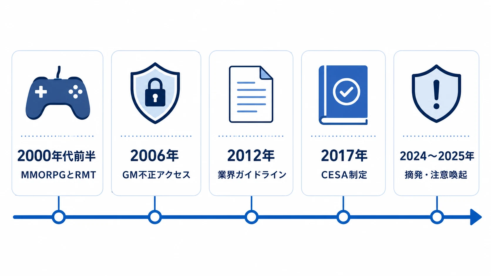
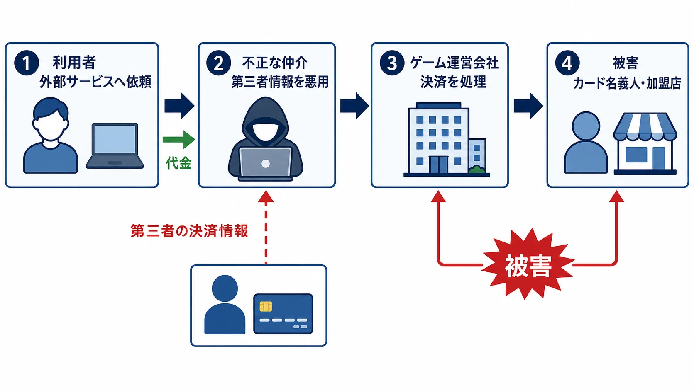

# 日本におけるRMTの歴史――なぜゲームはリアルマネートレードを禁止し続けるのか

> **注意：** 本レポートは法的助言ではありません。具体的な法的判断は、必ず弁護士・法務部門に確認してください。法令は改正されることがあるため、不正アクセス禁止法、刑法、商標法、組織犯罪処罰法、犯罪収益移転防止法、著作権法については、最新の条文・判例・行政資料を参照してください。

***

## はじめに

RMT（リアルマネートレード）とは、運営が認めていない方法で、ゲームのアカウント、キャラクター、アイテム、ゲーム内通貨などを現実の金銭と交換する行為である。RMTはゲーム外で決済されるため、「ゲームの外で当事者が合意した売買なら、運営には関係がない」と見えやすい。

しかし、取引の対象はゲームサーバー上にあり、供給量、獲得難度、アカウントの本人性、対戦や協力の公平性はすべて運営のルールで成立している。RMTはそのルールの外側に現金の報酬を置くことで、BOT、不正アクセス、決済不正、詐欺を採算の合う仕事へ変えうる。

本稿は、RMTを経済設計の歪みとして扱った [ゲーム内経済の設計](in-game-economy-design.md)、不正対策技術史として扱った [オンラインゲームのアンチチート技術史](online-game-anti-cheat-technology-history.md) とは切り分け、日本でRMTがどう可視化され、どのような法的・業界的対応が積み重なったかを時系列で読む。個別の契約の有効性や犯罪の成否は事案で変わるため、ここでの法令整理は法的助言ではない。

## まず押さえるべき結論

- 日本には、RMTという取引類型そのものを包括的に禁じる専用法はない。
- 多くのタイトルでの直接の禁止根拠は、プレイヤーと運営会社の間で結ばれる利用規約という契約である。違反時には、アカウント停止、アイテム回収などの措置が取りうる。
- ただし、不正に通貨を作る、他人のアカウントへ入る、盗んだカード情報で課金する、犯罪収益を隠す、ゲーム名を無断で販売サイトに用いる、といった行為は別の法令に触れうる。RMTは、それらの行為で得た価値を換金する出口になりうる。

この二層を混同しないことが重要である。規約違反であることと、ただちに刑事罰の対象であることは同義ではない。一方で、RMTを入り口にした取引が犯罪と結びつけば、買い手や代行の依頼者まで捜査対象になりうる。

***

## 1. 年表でつかむ、日本のRMT

| 時期 | 出来事 | 意味 |
|---|---|---|
| 2000年代前半 | MMORPGが定着し、通貨・装備・育成済みキャラクターの外部売買が広がる | 長い育成時間と希少資産に、現金による価格が付いた |
| 2006年 | 『ラグナロクオンライン』の元ゲームマスターが不正アクセスで逮捕 | 運営内部の権限管理とRMTの接続が露呈した |
| 2012年 | プラットフォーム6社がRMT対策ガイドラインを公表 | タイトル単位の規約対応から、業界の自主規制へ進んだ |
| 2017年 | CESAがRMT対策ガイドラインを制定 | 監視、禁止、情報共有の共通枠組みを明文化した |
| 2024〜2025年 | 課金代行、偽サイト、RMTサイト運営などの摘発が続く | RMTが決済不正、アカウント窃取、資金洗浄の出口になりうることが明確になった |

### 1-1. 2000年代前半：MMORPGの「時間」が現金で値付けされた

日本でRMTが大きな問題として語られるようになった背景には、継続的に遊ぶMMORPGの普及がある。レベル上げ、資源採集、希少装備の獲得には長時間を要し、ゲーム内通貨や装備が次の進行を左右した。時間を短縮したい人と、時間をかけて資産を集めて売りたい人を結ぶ外部市場が成立したのである。

2006年の業界講演では、当時の国内RMT市場を約150億円、利用者を約7万人とする推計が示されていた。これは公的統計ではなく、対象範囲や推計方法も現在の市場規模と単純には比較できない。それでも、MMORPGの持続的な成長とともに、RMTが個人間の例外的な売買ではなく、仲介・生産・販売を含む市場として認識され始めていたことを示す材料である。[[1](#ref-1)]

ここで問題になったのは、取引の存在だけではない。現金で売れるなら、通常のプレイで資産を集める行為に報酬が生まれる。BOTによる反復採集、独占的な狩場利用、アカウント窃取、通貨やアイテムの複製が、ゲームを遊ぶためではなく販売在庫を作るために行われうる。運営の禁止は、公平性の宣言であると同時に、外部の現金需要がゲーム内の行動を支配することへの対抗だった。

### 1-2. 2006年：『ラグナロクオンライン』事件が示した内部関係者リスク

2006年7月、『ラグナロクオンライン』の元社員が、不正アクセス禁止法違反の容疑で逮捕された。報道によれば、この人物は不正行為のパトロールやイベント企画を担うゲームマスターで、上司のアカウントを使ってゲームデータ管理サーバーへ不正にアクセスし、ゲーム内通貨「ゼニー」を作出してRMT業者へ売却したとされた。会社の調査では、2005年10月から2006年3月に不正取得した総額は6,910億ゼニー、売却益は約1,400万円と説明されている。[[2](#ref-2)]

この事例が象徴的なのは、外部のチート利用者ではなく、運営に近い立場の者が、アクセス権限の管理不備を突いて通貨供給そのものを壊した点である。不正な通貨が各ワールドの流通量に占める割合は6〜17％に達したとされ、現金化の出口がなければ不正作出の動機はここまで強くなりにくい。事件後、運営会社はアクセス権の絞り込みや業務用ツール利用状況を監視する部門の新設などを掲げた。[[2](#ref-2)]

RMT対策は、購入者を取り締まるだけでは完結しない。通貨・アイテムの発行権限、監査ログ、権限分離、異常な残高や送金の検知を含む、運営側の内部統制でもある。この点は、不正対策をクライアント対サーバーの攻防だけに狭めない理由になる。

### 1-3. 2012年：ソーシャルゲームの急拡大と業界自主規制

2012年3月、NHN Japan、グリー、サイバーエージェント、ディー・エヌ・エー、ドワンゴ、ミクシィの6社は、ソーシャルゲームプラットフォーム連絡協議会を発足させた。同年6月22日、6社は「リアルマネートレード対策ガイドライン」を含む三つの文書を策定した。RMT業者や転売利益を目的とする行為を減らすため、各社で効果のあった施策を共有し、サービス特性に応じてRMTを直接または間接に禁止する枠組みである。[[3](#ref-3)]

この年は、消費者庁が5月18日に、オンラインゲームで有料の偶然性を伴うアイテムを取得させ、特定の複数種をそろえた人へ別の利益を提供する「コンプガチャ」が、景品表示法上の「カード合わせ」に当たりうると明確化した時期でもある。[[4](#ref-4)] RMTとコンプガチャは別問題であり、前者を景品表示法が直接規制したわけではない。ただし、急成長したソーシャルゲームに対し、表示、未成年保護、課金、取引環境を事業者が横断して整備する社会的要請が高まった時期だった。

つまり2012年は、「RMTを禁止する」という個別タイトルの約款運用が、プラットフォーム事業者の共同ルールと利用環境の整備へ接続した転換点である。現在のCESAガイドラインも、アカウント、キャラクター、アイテム、カード、ゲーム内マネーを現金や電子マネーで売買・仲介する行為をRMTとして定義し、サービス提供会社に監視と抑制を求めている。[[5](#ref-5)]

***

## 2. 「RMT禁止」の法的実態：規約と犯罪の境界

### 2-1. 禁止の第一線は利用規約である

RMTを直接に禁止する一般法がない日本では、運営会社が利用規約で禁止し、違反に対してアカウント停止などの契約上の措置を取ることが基本になる。『ラグナロクオンライン』も、ゲーム外でのアイテムやゼニーの取引を禁じ、確認時はガンホーID停止措置を適用すると案内している。[[6](#ref-6)]

これは「ゲーム内のデータに絶対的な所有権があるから運営が止められる」という単純な話ではない。プレイヤーは、運営が提供するサービスを、同意したルールに従って利用する。規約は、何を譲渡・交換の対象にしてよいか、アカウントを誰が使えるか、外部取引をどう扱うかを、サービス利用の条件として定めるものである。

規約違反の典型的な結果は、サービス内の措置である。だから、RMTの利用者が規約違反で停止されたことだけをもって、RMTそのものが刑事犯罪だったと表現してはならない。反対に、取引の背後に別の違法行為があれば、規約違反の問題を超える。

### 2-2. 手口ごとに関係する法律は変わる

| 問題となる行為 | 関係しうる法律 | RMTとの関係 |
|---|---|---|
| 他人のID・パスワードでゲームや取引サイトへ入る | 不正アクセス禁止法 | 販売在庫や取引サイトのポイントを盗むための侵入 |
| サーバーへ虚偽の購入情報・不正な指令を送り、通貨を付与させる | 刑法の電子計算機使用詐欺罪 | 不正に得たゲーム内通貨を安く売る出口 |
| 登録商標のゲーム名を無断でRMTサイトの表示に使う | 商標法 | 販売サイトの集客にタイトル名を無断利用した場合 |
| 犯罪で得た資金・物を隠す、仮装する、移転する | 組織的な犯罪の処罰及び犯罪収益の規制等に関する法律 | 不正決済や詐欺の収益を取引を介して現金化・移転する局面 |
| 特定事業者が本人確認・記録保存などの義務に違反する、犯罪収益の移転に関与する | 犯罪による収益の移転防止に関する法律 | 仲介事業が同法上の特定事業者に当たるかを含め、事業の実態と具体的行為に応じて問題となる局面 |

不正アクセス禁止法は、アクセス制御されたコンピュータへの不正アクセスを禁じる。[[7](#ref-7)] 電子計算機使用詐欺罪は、虚偽の情報や不正な指令を与えて不実の電磁的記録を作り、財産上の不法の利益を得る行為を対象にする。[[8](#ref-8)] どちらも、正当に得たアイテムを外部で売る行為そのものを処罰する規定ではない。

商標法、組織犯罪処罰法、犯罪収益移転防止法も同じである。RMTサイトを開いただけで自動的に適用されるわけではない。商標の無断使用、犯罪収益の隠匿・収受、本人確認などの義務を伴う取引での違反といった、各法律の要件を満たす行為があって初めて問題になる。RMTを一つの犯罪名として扱うより、「どの行為で、どの利益を、どのように得て移したのか」を分解して見るべきである。[[9](#ref-9)][[10](#ref-10)]

### 2-3. 著作権の同一性保持権は、RMT一般を止める根拠にはならない

ゲームの改造やチートの議論では、著作権法の同一性保持権が引かれることがある。最高裁の「ときめきメモリアル」事件は、主人公のパラメータを通常はあり得ない高値へ置き換え、ストーリー展開を本来予定された範囲を超えて変えるメモリーカードについて、ゲームソフトの改変と著作者の同一性保持権侵害を認めた。[[11](#ref-11)]

ただし、この判例は「ゲームに関係する外部取引はすべて著作権侵害になる」としたものではない。判断の対象は、ゲームの創作的表現を変容させる改変データであった。アカウントや正規に獲得したアイテムを外部で売買するだけなら、通常はゲームソフトの表現を改変していない。RMTを一律に同一性保持権で規制することには限界があり、規約違反、アカウント不正利用、チート、不正作出を別々に評価する必要がある。

***

## 3. 2024〜2025年：RMTは「安い課金」の顔をした犯罪リスクになった

近年の摘発は、RMTが単に育成済みアカウントを売る市場ではなく、決済不正やアカウント窃取の換金経路になりうることを示している。CESAとJOGAが警察と連携して配布した注意喚起リーフレットには、2024年4月から7月のRMTサイト運営をめぐる商標法違反、電子計算機使用詐欺、組織犯罪処罰法違反、犯罪収益移転防止法違反の検挙、偽サイトでID・パスワードを盗む事案、不正な購入情報による課金代行、盗んだクレジットカード情報を使う課金代行、そして依頼者の検挙が記されている。[[12](#ref-12)]

神奈川県警の担当者は、2024年にRMT業者がアカウントやアイテムを仕入れて自ら販売する事例を検挙したと説明している。課金代行では、依頼者から預かったアカウントで、フィッシング等により不正取得した第三者のカード情報を用いて課金し、業者は正規価格より安い代金を依頼者から受け取る。依頼者にとっては割安な課金に見えても、他人のカードを使った決済不正の出口になりうる。[[13](#ref-13)]

日本経済新聞は2025年、RMTを約2,000億円市場として報じ、他人のカード情報で不正購入したアイテムや通貨を売って現金化する複数グループの摘発を伝えた。ここでの市場規模は、公的統計ではなく報道における推計・把握範囲に依存する数字であり、正確な全取引額を示すものではない。それでも、市場の大きさが「ゲームの周辺にある小さな個人売買」では済まない動機を生むこと、規約違反の取引が犯罪収益の受け皿になりうることは重い。[[14](#ref-14)]

2025年9月の東京ゲームショウでは、警視庁、千葉県警、神奈川県警が合同で初出展し、RMTとサイバー犯罪の危険性を来場者へ啓発した。CESA、JOGA、警察が情報共有と注意喚起を行う構図は、2012年に始まった業界横断の自主規制が、犯罪被害の予防まで含む取り組みへ広がったことを示している。[[15](#ref-15)]

***

## 4. なぜ禁止が続くのか：公平性と犯罪リスクは切り離せない

RMT禁止の理由は、「課金した人が強くなるのは不公平だから」という一言では足りない。運営が公式に販売する課金要素にも、価格、提供量、対象範囲、対戦や協力への影響を設計し、表示し、更新する責任がある。RMTは、この管理の外から、時間、通貨、アイテム、アカウント、育成というゲーム進行の要素へ現金の価格を付ける。

第一の理由は、公平性とゲームバランスの保護である。努力や技能、運、協力によって到達するはずの差が、運営の想定しない外部取引で購入できるようになると、競争と協力の前提が変わる。さらに、販売在庫を作る側がBOT、狩場独占、脆弱性の悪用へ向かえば、買わないプレイヤーの遊び方まで損なわれる。『ラグナロクオンライン』も、RMTが公平性を失わせ、ゲームバランスを崩すとしたうえで、不正ツール、独占、不正アクセス、詐欺を誘発しうると説明している。[[16](#ref-16)]

第二の理由は、犯罪リスクである。アカウントを渡す課金代行は、本人性と資産の両方を第三者へ預ける。格安販売は、盗難カード、不正な購入情報、アカウント窃取、犯罪収益の現金化で原価を不自然に下げられる。取引がゲーム外にあっても、ゲームサーバー、決済、個人情報、金融の犯罪をつなぐ導線になりうる。

プランナーに必要なのは、RMTを「不正ユーザー対応の外側」に置かないことである。アカウントの譲渡・共有、アイテム・通貨の外部売買、育成・課金代行、勧誘を規約で明確に禁じること。異常な通貨発行、短時間の集中送金、不自然な購入と取消、権限操作を監査できること。利用者が「安いから」と犯罪の入口へ入らないよう、公式の注意喚起と通報導線を持つこと。これらは公平なゲーム体験と犯罪被害の防止を、同じ運営課題として扱うための最低線である。

暗号資産やブロックチェーンを使うゲームでは、外部価値との接続が初めから仕様に入る場合もある。その新しい局面は [NEXT Bayは日本のライブサービスに何を持ち込むか](next-bay-rmt-crypto-regulatory-friction.md) と [『TOKYO BEAST』終了事例](tokyo-beast-p2e-game-shutdown-case-study.md) で扱う。本稿の通史から持ち帰るべき点は、技術や決済手段が変わっても、運営が守る対象は変わらないということである。ゲーム内で積み上げる価値を誰が、どのルールで得られるのか。その約束が壊れれば、RMTは単なる外部取引ではなく、ゲームそのものを損なう。

## References

1. [国内市場規模は150億円!?――AOGC 2006講演に見る、オンラインゲームが生んだ経済現象“RMT”の現状とこれから][1]

2. [「ラグナロク」のゲームマスター、自社サーバーへの不正アクセスで逮捕][2]

3. [ソーシャルゲームプラットフォーム連絡協議会が「ゲーム内表示等に関するガイドライン」等を策定][3]

4. [インターネット上の取引と「カード合わせ」に関するQ&A][4]

5. [リアルマネートレード対策ガイドライン][5]

6. [RMT（リアルマネートレード）について｜ラグナロクオンライン][6]

7. [不正アクセス行為の禁止等に関する法律][7]

8. [刑法 第二百四十六条の二（電子計算機使用詐欺）][8]

9. [商標法][9]

10. [組織的な犯罪の処罰及び犯罪収益の規制等に関する法律][10]／[犯罪による収益の移転防止に関する法律][11]

11. [Tokimeki Memorial――Supreme Court decision, 13 February 2001][12]

12. [RMT注意喚起リーフレット][13]

13. [神奈川県警に聞く：RMTの闇とゲームデータ売買の実態][14]

14. [オンラインゲームのアイテム売買で資金洗浄　2000億円市場に犯罪集団][15]

15. [警視庁、千葉県警、神奈川県警が合同でTGS初出展][16]

16. [RMT（リアルマネートレード）について｜ラグナロクオンライン][6]

[1]: https://ascii.jp/elem/000/000/351/351874/
[2]: https://internet.watch.impress.co.jp/cda/news/2006/07/20/12720.html
[3]: https://dena.com/jp/news/503/
[4]: https://www.caa.go.jp/policies/policy/representation/fair_labeling/faq/card
[5]: https://www.cesa.or.jp/action/for-stakeholders/rmt-guideline/
[6]: https://ragnarokonline.gungho.jp/support/play-manner/rmt.html
[7]: https://laws.e-gov.go.jp/law/411AC0000000128
[8]: https://elaws.e-gov.go.jp/document?lawid=140AC0000000045
[9]: https://laws.e-gov.go.jp/law/334AC0000000127
[10]: https://laws.e-gov.go.jp/law/411AC0000000136
[11]: https://laws.e-gov.go.jp/law/419AC0000000022
[12]: https://www.softic.or.jp/en/cases/Tokimemo_Sup.html
[13]: https://www.cesa.or.jp/assets/pdf/action/rmt-caution.pdf
[14]: https://anshin-game.jp/promise/report/250908.html
[15]: https://www.nikkei.com/article/DGXZQOUD071VU0X00C25A7000000/
[16]: https://www.4gamer.net/games/999/G999905/20250927080/

----

この文書は、Perplexity、Claude、OpenAI Codex の3つのAIの支援を受けて著述されたものです。引用画像を除き、MIT License にて提供されています。
