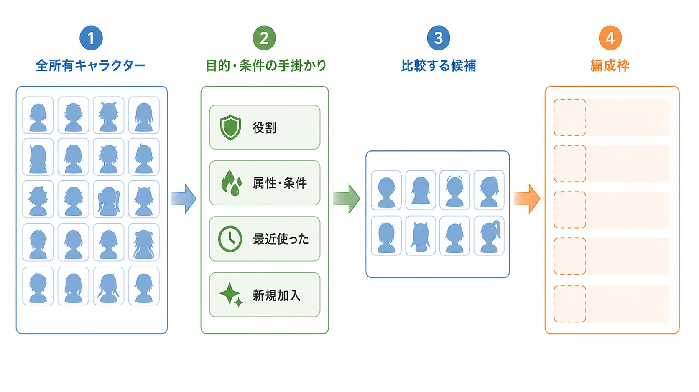
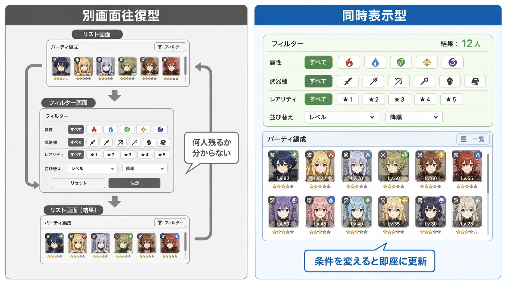
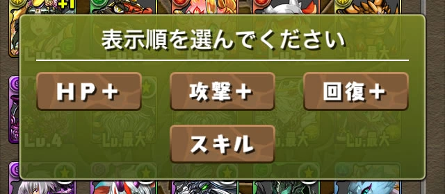
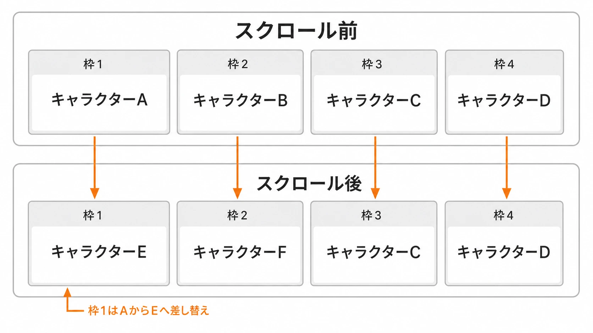

# キャラクター編成・パーティ管理UIの設計
## ──増え続ける選択肢を、速さと発見に変える

多数のキャラクターを入手し、数人を選んで出撃するロースター型ゲームでは、編成画面がプレイ前の小さな関門になる。キャラクターが増えること自体は、収集、組み合わせ、意外な発見という楽しみを増やす。しかし画面がその増加を受け止められなければ、「使いたいキャラクターを探す」操作が、戦略を考えるより長くなる。

本稿で扱うのは、キャラクターをどう育てるかではない。すでに所有している候補を、編成という目的のためにどう見せ、どう探させ、どう試させるかである。育成投資や追いつき支援の設計とは切り分け、画面上の選択、実装上の制約、そして運用で失われやすい判断を対象にする。

***

## 1. 編成画面は「全員を見せる画面」ではなく、選択を進める画面である

キャラクター一覧に全員が載っていることと、選びやすいことは同義ではない。プレイヤーが編成画面を開く理由は一つではないからだ。

| 開く理由 | プレイヤーがまず知りたいこと | 画面が先に支えるべき操作 |
|---|---|---|
| いつもの編成を少し替えたい | 直前の構成と、交代候補 | 現在の編成、控え、最近使った候補 |
| 特定の敵や条件へ合わせたい | 条件を満たす候補 | 条件に直結する絞り込みと比較 |
| 新規加入を試したい | 何ができるか、どこへ入るか | 新規・未使用の候補と役割の説明 |
| 全体を眺めたい | 所有している幅と未確認の候補 | 発見を妨げない一覧と導線 |

この四つを一つの初期並び順で同時に満たすことは難しい。そこで重要になるのが、画面を開いた瞬間の既定状態を「正解の一覧」ではなく、直前の目的へ最短で戻る足場として定義することである。たとえば、出撃準備から開く画面なら現在の編成と交代候補を先に見せ、図鑑や入手直後から開く画面なら新規加入を見失わせない。全キャラクターを同じ重みで並べるのは中立ではなく、目的の手掛かりをプレイヤーへ丸ごと委ねる選択になる。

### 1-1. ヒックの法則は「候補を減らせ」という命令ではない

ヒックの法則とは、選択肢が増えるほど選択反応に要する時間が対数的に増えるという、選択反応時間に関する知見である。Hickの1952年の研究に由来し、後年のレビューでも人間とコンピュータの対話を考える基本原則の一つとして位置付けられている。[[1](#ref-1)]

ただし、これを「選択肢を少なくすれば必ずよい」と読むのは危険である。ヒックの法則が扱うのは、選択肢の数だけでなく、不確実さや反復によって変化する選択反応である。レビューは、刺激と反応の対応、練習、非常に大きい選択集合、直前の選択といった条件が結果に影響することも整理している。[[1](#ref-1)] 編成画面のキャラクターは、等確率で初見のボタンとして並ぶわけではない。

実務で使える読み替えは、候補数を消すことではなく、 **いま比較すべき候補集合を小さく、意味のある形で提示すること** である。プレイヤーが「前衛を一人入れ替えたい」と考えているなら、全員から一人を選ばせるより、前衛として成立する候補、条件を満たす候補、直近で使った候補を手掛かりにできる方がよい。一方で、その手掛かりが固定の最適解だけを示すなら、編成を考える余地まで失われる。

*図：候補を消すのではなく、役割・属性や条件・最近使った・新規加入といった手掛かりで、現在の目的に比較対象を合わせる。*

### 1-2. 「探す」と「眺める」を同じ導線に押し込まない

編成には、目的を持って特定の候補へ到達する行為と、思いがけない候補を見つけて試す行為がある。前者だけを最適化すると、条件に合う強い候補へ素早く着ける。後者だけを残すと、発見はあるが、毎回の準備が重くなる。

この二つは、初期状態、検索・絞り込み、一覧の並び、詳細画面から戻った後の位置を分けて支える。検索した結果だけを唯一の画面にしない。たとえば検索解除後に元のスクロール位置と選択状態へ戻れるようにすれば、「条件を確認してから一覧を見直す」往復を断ち切らない。これは偶発的な発見を保証する仕組みではないが、目的探索の副作用で一覧への帰り道を失わせないための最低条件になる。

***

## 2. フィルタとソートは、候補を減らす機能ではなく、比較軸を渡す機能である

フィルタは候補集合を狭め、ソートは同じ集合の見る順番を変える。似た操作に見えるが、仕様で混同すると使いにくくなる。

| 機能 | プレイヤーへ渡す問い | 主な失敗 |
|---|---|---|
| フィルタ | 「何を満たす候補だけを見るか」 | 選択中の条件が分からず、なぜ候補が消えたか判断できない |
| ソート | 「何を基準に先頭から比較するか」 | 目的と無関係な既定順が、最適解のように見える |
| 検索 | 「名前や既知の語から直接たどり着くか」 | 正式名称を知らないプレイヤーを置き去りにする |

Nielsen Norman Groupは、モバイルの絞り込み検索で、フィルタ操作と結果を同時に見せるトレイ型のパターンを解説している。別画面のフィルタから結果へ何度も往復させず、条件と結果の関係を把握しやすくすることが主眼である。[[2](#ref-2)] 編成画面へそのまま移植する必要はないが、少なくとも「いま何の条件で、何人が残っているか」を、結果から見失わせない原則は有効である。

*図：別画面往復型では条件と結果の関係が断たれる。トレイ型では、フィルタと件数・一覧の一部を同時に確認できる。*

ここで、フィルタの便利さには明確な代償がある。役割、属性、レアリティ、戦力、装備状況などで何重にも絞れば、未知の組み合わせや、条件外だが試す価値のある候補は視界から消える。特に、未使用キャラクターを単に低い戦力順の末尾へ置くと、フィルタと既定ソートが組み合わさったときに、プレイヤーの目に入る機会がさらに減る。

解決策は、すべての候補を常に同じ場所へ戻すことではない。次の二つを仕様として併存させることである。

- **目的探索の導線**：役割や出撃条件で早く絞り、適用中の条件、件数、解除を結果の近くに置く。
- **発見の導線**：新規加入、未使用、最近入手、手持ちの中で条件に近い候補など、強さの順位とは別の並びを明示的に選べるようにする。

「おすすめ順」は後者を代替しない。おすすめの算出基準を理解できず、同じ顔ぶればかりが並ぶ場合、それは発見の導線ではなく、選択を狭める既定値になる。

### 2-1. 既定値は、隠れたゲームデザインである

一覧は空白から始まらない。ソートの初期値、フィルタの保持、タブの選択、初期フォーカス、カードに表示する一番大きな数値は、すべて「先に見てほしいもの」を決めている。これは表示だけの細部ではなく、プレイヤーが何を価値ある候補として学習するかに関わる。

たとえば戦力順を既定にするなら、戦力が低くても代替不能な役割を持つ候補を、どこで発見できるかを別途設計する。出撃条件に対する適合順を既定にするなら、その評価理由と、手動で外せる経路を用意する。既定値の妥当性は「最も強い編成を出せるか」だけでなく、プレイヤーが別の比較軸へ移れるかで評価する。

***

## 3. キャラクター数の増加は、一覧機能が後から追いつく契機になる

ライブ運用のロースターでは、初期の一覧仕様が将来の候補数に耐えるとは限らない。『パズル＆ドラゴンズ』では、2016年1月28日のアップデートで「モンスターBOX」の最大格納数が2,500体から3,000体へ拡張され、同時に「モンポ」と「合成経験値」のソート機能が追加された。[[3](#ref-3)]

*画像出典（引用）：[ガンホー、『パズル＆ドラゴンズ』で「モンスターBOX」のソート機能追加や魔法石ショップ「一度きり！超お得セット」の販売等を含むアップデートを1月28日に実施](https://gamebiz.jp/news/155818)（gamebiz、2016年1月26日掲載）内「特殊」ソート画面。© GungHo Online Entertainment, Inc. All Rights Reserved. WebP変換。*

この一件から「格納数がこの値になれば必ずこの機能が必要」といった一般則を導くことはできない。また、追加理由を外部から断定することもできない。しかし、候補を抱える器の拡張と、候補を目的別に並べ替える機能が同じ更新で扱われた事実は重要である。ロースターの成長はコンテンツ量だけの問題ではなく、既存の一覧をどの目的で使い分けるかというUIの問題を表面化させる。

プランナーは、キャラクター数だけを閾値にして後追いの機能追加を決めない方がよい。少なくとも、次の指標を観測して「探せない」状態を早く捉える。

- 編成画面を開いてから確定するまでの操作列と、途中で戻る比率
- フィルタ・ソートごとの利用状況と、解除直後に確定された編成
- 新規加入後に、そのキャラクターが編成候補として開かれた経路
- スクロール、検索、詳細閲覧の後に、編成を変えず閉じた経路

数値の良し悪しを単独で決めるのではない。たとえば確定が速くても、毎回同じ候補だけが選ばれているなら、速さは発見の喪失と引き換えかもしれない。ログと観察を、目的探索と発見の両方へ分けて読む必要がある。

***

## 4. 描画性能は、見た目の実装詳細ではなく、UIの選択肢を決める条件である

一覧にカードを何枚置くか、詳細画面をどの操作から開くか、スクロール中にどこまで画像や比較情報を更新するかは、画面設計だけで決められない。すべての候補を一度に生成し、画像・文字・装飾・入力判定を持たせる構成は、候補数とカードの情報密度が増えるほど重くなる。軽快なスクロールを維持するために、画面外の行を再利用する、表示範囲の近くだけを生成する、画像の読込を段階化するといった実装上の判断が必要になる。

その判断は、UXを直接変える。たとえばセルを再利用する一覧では、画面外へ出たカードが別の候補を表すようになるため、選択状態、詳細を開く対象、非同期で届く画像、詳細画面から戻る位置をIDに基づいて正しく復元しなければならない。カードの高さを可変にする、各カードに複数の常時アニメーションを持たせる、詳細画面への遷移前後で一覧全体の状態を更新する、といった表現は、端末性能とリスト方式によって採用コストが変わる。

*図：スクロール後、枠1・枠2は同じ表示枠のまま、キャラクターA・BからE・Fへ中身を差し替える。*

ここでは、当時制作進行を担当していたプランナーである編者の、非公開案件での一般化した体験談が示唆的である。多数のモンスターを抱えるパーティー編成画面で、当時の『パズル＆ドラゴンズ』と同じインターフェイスを実現した。その際に課題になったのは、多数のモンスターを読み込みながら一覧表示する処理であった。下限性能に近い旧世代iPhoneでは一覧スクロールが大きくもたつき、対象機種だけ表示処理を軽量化した結果、画面の見え方と処理の経路は端末によって一部異なるものになった。こうして生じた端末別の例外を、担当交代の後にも見つけ、撤去できる状態で残すことが次の問題になる。

この種の問題を「最適化はエンジニアに任せる」と切り離してはいけない。詳細画面への遷移、カードに載せる比較値、フィルタ変更時の再描画、戻り先の保持は、すべて企画仕様でもある。最小サポート端末、想定する一覧件数、カードの表示項目、初回表示・高速スクロール・フィルタ適用・詳細からの復帰を、同じテストシナリオとして書く。そうして初めて、UIの豊かさと応答性を同じテーブルで判断できる。

### 4-1. 仕様書には画面遷移図だけでなく、表示予算を書く

表示予算は、特定のフレームレートやメモリ量を企画側が勝手に決めることではない。どの端末群で、どの状態まで軽快である必要があるかを、職種横断で合意できる形にすることである。次の項目は、UI仕様と性能要件の間をつなぐ。

| 項目 | 仕様に残す内容 |
|---|---|
| 対象 | 最小サポート端末と、確認に使う端末区分 |
| データ量 | 想定一覧件数、編成枠数、カード内の表示項目 |
| 操作 | 初回表示、連続スクロール、絞り込み、詳細からの復帰 |
| 状態 | 選択済み、ロック、入手直後、読込中、通信失敗時の表示 |
| 劣化時の方針 | 省略できる装飾と、省略してはならない判断材料 |

この表があると、見栄えの議論を「残すか削るか」の二択にせず、どの条件で何を守るかへ変えられる。低性能端末だけに特別処理を持たせる判断も、例外ではなく、対応条件を持つ仕様として扱える。

***

## 5. 端末別の例外は、実装した瞬間から忘却に備える

前節の体験談には、もう一つ重要な後日談がある。後にその旧世代iPhoneをサポート対象外にする判断が生じた際、当時制作進行を担当していたプランナーである編者を除いて、軽量化措置の存在を覚えている人はいなかった。編者の記憶によって初めて「この処理は削除しても問題ない」と判断できた。

これは個人の記憶力の問題ではない。端末別の表示処理は通常の画面仕様から外れ、担当交代、端末の市場退出、コードの周辺改修を経るほど、存在理由が見えにくくなる。必要だった最適化が、いつの間にか「触れてはいけない謎の分岐」になる。逆に、すでに不要な処理が残り続ければ、保守対象だけが増える。

対策は、例外の実装箇所だけにコメントを残すことでは足りない。企画、実装、QAが参照できる変更記録に、少なくとも次を残す。

- **対象条件**：どの端末区分、OS、一覧状態で発生したか。
- **症状と影響**：何が遅くなり、プレイヤーのどの操作が阻害されたか。
- **対策と代償**：軽量化で省いた処理、端末間で異なる表示・操作があるか。
- **検証根拠**：どのシナリオと端末で問題が確認され、何をもって解消としたか。
- **撤去条件と所有者**：どのサポート終了や設計変更で再評価するか。次に判断する責任者は誰か。

とくに撤去条件が重要である。「旧端末向け」とだけ記した記録は、その端末が対象外になった後に検索へ引っかからない。対象機種のサポート終了、UI基盤の更新、一覧方式の置換といったイベントにひも付け、削除時の回帰テストを指定する。技術的負債は、古いコードそのものではなく、必要性と撤去条件を説明できない状態から始まる。

***

## 6. おすすめ編成は、選択を奪う機能ではなく、選択を始められる機能にする

おすすめ編成や自動編成は、候補が多いゲームほど価値を持つ。復帰直後、初見の高難度、出撃条件が複雑な場面では、まず動く編成を作ってもらえることが離脱を防ぐ。編成を考えたいプレイヤーにとっても、比較の出発点として役に立つ。

一方で、自動編成が常に最適解のように表示され、理由も分からず、手動変更が面倒なら、プレイヤーは「選ぶ」前に答えを受け取る。ゲーム固有の役割相性や手持ちの工夫を学ぶ機会が、速さと引き換えに失われる。問題は自動化の有無ではなく、どの段階の判断を代行し、どの段階をプレイヤーへ残すかである。

| 段階 | 自動化が担う役割 | プレイヤーへ残すべきもの |
|---|---|---|
| 提案 | 条件に合う候補や暫定編成を出す | 採用理由と、別候補を見る入口 |
| 適用前 | 空き枠を埋め、編成案を作る | 確定前の比較、除外、並び替え |
| 適用後 | 保存済み編成として再利用できる | 名前の変更、手動編集、元に戻す操作 |

よい自動編成は、結果だけでなく、どの条件を優先したのかを短く説明する。たとえば「出撃条件の属性を優先」「回復役を1枠確保」と分かれば、プレイヤーは提案を受け入れるだけでなく、外したときに何が変わるかも判断できる。反対に、内部スコアだけで決まる「最強編成」は、数値が変わるたびに理由を失い、手動選択を不安にする。

初期状態を自動編成の結果で埋める場合も、一覧と編集画面へ戻る経路を目立たなくしてはいけない。自動化の成功は、プレイヤーが考えずに確定した回数ではなく、急いでいるときには助けになり、試したいときには邪魔をしない状態で測るべきである。

***

## 7. 実務チェックリスト

### 選択と発見

- [ ] 編成画面を開く主な目的を複数に分け、初期状態がどれを助けるかを書いている
- [ ] 現在の目的に合う候補集合と、全体を眺める導線を分けている
- [ ] フィルタの適用条件、件数、解除が結果の近くで分かる
- [ ] 検索や詳細から戻った後に、一覧の文脈を失わせない
- [ ] 既定ソートが何を価値ある候補として強調するかを説明できる

### 性能と実装

- [ ] 最小サポート端末と想定一覧件数を、UI仕様に含めている
- [ ] 初回表示、連続スクロール、絞り込み、詳細からの復帰を実機で確認する
- [ ] 非同期の画像読込やカード再利用時に、選択状態と詳細遷移先がIDで整合する
- [ ] 省略できる装飾と、省略してはならない判断材料を分けている

### 運用と自動化

- [ ] 端末別・状態別の例外に、対象条件、検証根拠、撤去条件、所有者がある
- [ ] サポート終了やUI基盤更新の際に、例外を見直す手順がある
- [ ] おすすめ編成が優先した条件を短く説明できる
- [ ] 自動編成の結果から、手動で比較・編集・復帰できる

## おわりに

ロースター型ゲームの編成画面は、キャラクターを整然と並べる棚ではない。プレイヤーが、いま必要な一人へ早く届き、知らなかった一人にも出会い、自分で試す理由を持てるようにするための選択装置である。

候補が増えたとき、フィルタとソートを足せば問題が解決するわけではない。何を早く見つけられるようにし、その代わりに何が見えにくくなるかを決める必要がある。さらに、その画面は描画性能、端末別の例外、担当交代後も残る記録に支えられている。選択を速くするUIは、選択肢を消すUIではない。目的に応じて焦点を合わせ、必要なときには再び全体へ戻れるUIである。

## References

1. [Hick’s law for choice reaction time: A review][1] - ヒックの原著と選択反応時間との関係、適用時に考慮すべき条件を整理したレビュー論文。

2. [Mobile Faceted Search with a Tray: New and Improved Design Pattern][2] - モバイル画面でフィルタ条件と検索結果を同時に示すトレイ型パターンと、その意図を解説するNielsen Norman Groupの記事。

3. [ガンホー、『パズル＆ドラゴンズ』で「モンスターBOX」のソート機能追加や魔法石ショップ「一度きり！超お得セット」の販売等を含むアップデートを1月28日に実施][3] - 2016年1月28日の「モンスターBOX」最大数の2,500体から3,000体への拡張と、ソート機能追加を確認した報道。

[1]: https://web.ics.purdue.edu/~dws/pubs/ProctorSchneider_2018_QJEP.pdf
[2]: https://www.nngroup.com/articles/mobile-faceted-search/
[3]: https://gamebiz.jp/news/155818

----

この文書は、Perplexity、Claude、OpenAI Codex の3つのAIの支援を受けて著述されたものです。引用画像を除き、MIT License にて提供されています。
