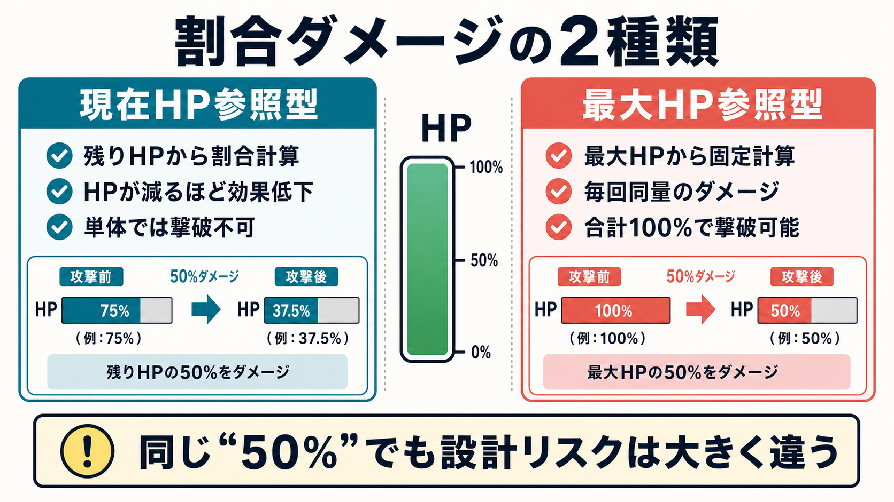
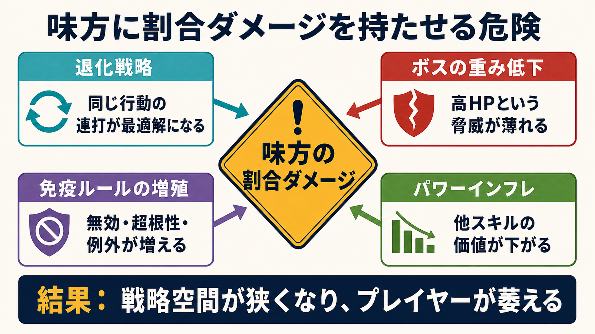

# RPGバトル設計の落とし穴：割合ダメージを軸に学ぶ「萎え」の原因と対策

***

## はじめに：なぜ「計算式」がプレイヤーの感情を左右するのか

RPGのバトルは「数値の衝突」だ。攻撃力・防御力・HPといったパラメータが噛み合い、戦略と結果が結びつくとき、プレイヤーは「俺が勝った」と感じる。逆に、計算式の設計ミスがあると「理不尽に負けた」「頑張っても無駄だった」という感情が生まれ、コントローラーを置く原因になる。[[1](#ref-1)]

本レポートでは、**味方スキルによる割合ダメージ** を代表例として取り上げながら、バトル設計全般の落とし穴と、プレイヤー心理を「萎え」させる要因、そしてその対策を体系的にまとめる。

***

## 第1章：割合ダメージとは何か

### 定義と種類

割合ダメージとは、**固定数値ではなく対象HPの割合に基づいてダメージを与える** 仕組みのことだ。大きく2種類に分類される。[[2](#ref-2)]

| 種類 | 計算基準 | 代表例 | 特性 |
|------|----------|--------|------|
| 現在HP参照型 | スキル発動時の残りHP | パズドラ旧グラビティ、FF8グラビデ | HPが減るほど効果が下がる、単体では撃破不可 |
| 最大HP参照型（確定型） | 敵の最大HP固定値 | パズドラ確定グラビティ、FFTグラビデ／命吸唱 | 毎回同量のダメージ、合計100%で確実撃破可能 |

*画像：OpenAI gpt-image により生成したインフォグラフィック。PNG生成後、WebPへ変換。*

パズル＆ドラゴンズ（パズドラ）では現在HP参照型の場合、割合計算で端数が切り捨てられHPを0にできず必ず1以上残るため、単体では敵を倒しきれず、トドメには別途通常攻撃が必要になる。最大HP参照型は「50%+50%確定グラビティ」のように組み合わせてボスを一撃で倒すワンパン戦術に発展している。[[3](#ref-3)][[4](#ref-4)]

### 割合ダメージの「本来の強み」

- **防御力・属性相性を無視** してダメージが通るため、高防御の敵や物理無効の敵に対して有効[[5](#ref-5)]
- ステータスによらず **計算通りのダメージが保証** されるため、攻略の見通しが立てやすい[[4](#ref-4)]
- ファイナルファンタジーVIII（FF8）のG.F.ディアボロスの召喚魔法「ダークメッセンジャー」は敵の最大HPに比例した割合ダメージ（9999が上限）であり、HPの大きいボスに対して相対的に有効に働く[[6](#ref-6)]
- ファイナルファンタジータクティクス（FFT）では「グラビデ」「命吸唱」「リッチ」などの割合HPダメージアビリティが2〜4回成功でラスボスを含む **どんな敵でも撃破可能** という強力な効果を持つ[[7](#ref-7)]

***

## 第2章：味方スキルの割合ダメージを「使ってはいけない」理由

ここが本レポートの核心だ。「割合ダメージ」自体は悪い機能ではない。問題は **味方（プレイヤー）側が使える割合ダメージをどう設計するか** にある。

*画像：OpenAI gpt-image により生成したインフォグラフィック。PNG生成後、WebPへ変換。*

### 理由①：ゲームの戦略空間を消滅させる「退化戦略」

割合ダメージは防御力・属性・バフ・デバフを無視するため、それらの要素を考慮する必要がなくなる。ゲームデザイン理論では、こうした「単一の行動を繰り返すことで圧倒的優位に立てる戦略」を **退化戦略（Degenerate Strategy）** と呼ぶ。[[8](#ref-8)][[9](#ref-9)]

> "A degenerate strategy is the use (or less neutrally, abuse) of a singular mechanic to raise player agency to a disproportionate degree."[[9](#ref-9)]
>
> （要約：退化戦略とは、単一のメカニクスを反復・累積させることで、プレイヤーの優位性を不均衡なほど高めてしまう手法を指す。）

スキルのバランスを考えるとき、**パワー・ユーティリティ・コスト** の3要素が釣り合っている必要がある。割合ダメージはこの3つをすべて超越してしまうため、他のすべてのスキルが「使わなくていいもの」になる。[[10](#ref-10)]

**FFTの事例** がわかりやすい。算術（算術士ジョブ）でグラビデを運用すると、ラスボス含むほぼすべての敵を問答無用で2〜4回で撃破できる。これは確かに「強い戦術」だが、ジョブシステムの豊かさ、魔法の属性相性、装備の選択という設計の努力を丸ごと無意味化する。[[7](#ref-7)]

### 理由②：ボス戦の重みを失わせる

ボスは「通常の攻略では突破困難なHP・防御力」によってその脅威を表現している。割合ダメージはその設計前提を根底から覆す。「HPがいくら多くても2回で半分になる」という事実は、ボスの「重厚感」をゲームシステム的に消し去る。

これがなぜ問題かというと、**プレイヤーはボスを「物語的にも機能的にも困難な挑戦」と期待する** からだ。「強い相手を策を考えて倒した」という達成感が、「強い相手を割合スキルを連打して秒殺した」になった瞬間、ゲームとしての感動が消える。[[11](#ref-11)]

### 理由③：ゲームバランスの非対称性問題

味方側に強力な割合ダメージを置くと、開発側は「それで簡単に倒されないよう」にボスに **割合ダメージ無効** や **超根性（HPが0にならない）** などの免疫を付けざるを得なくなる。これは対策を重ねるイタチごっこであり、設計が複雑になるほど **プレイヤーが理解しにくいゲームルール** が増殖していく。[[3](#ref-3)][[4](#ref-4)]

パズドラの例では、ボス戦でグラビティ（割合ダメージ）が効かない原因として「現HP参照型と最大HP参照型の混同」「ダメージ無効バリアの見落とし」「超根性ギミック」「グラビティ無効バリア」など複数の例外が存在し、プレイヤーが事前に詳細知識を持たないと理解不能な状況が生まれている。[[4](#ref-4)]

### 理由④：スキルのパワーインフレを助長する

割合ダメージがある環境では、他のスキルがそれと比較される。「あのスキルでいいのに、なぜ攻撃力を上げる必要があるのか？」という問いに答えられない。これはスキル設計全体への **モチベーション破壊** につながる。[[10](#ref-10)]

***

## 第3章：バトル計算式全般の落とし穴

### 落とし穴①：引き算式のアルテリオス問題

最もシンプルなダメージ計算式

$$ \text{ダメージ} = \text{攻撃力} - \text{防御力} $$

は「アルテリオス計算式」として知られる。これは有名ゲームプレイヤーのbiim兄貴による命名を起点に広まった通称であり、正式な数理モデル名というより、ゲーム文脈で使われる呼び名だ。[[12](#ref-12)]

問題は **ステータス差がそのままダメージ差に直結する** ことだ。たとえば攻撃力30のキャラが防御力10の敵と20の敵に与えるダメージはそれぞれ20と10になり、**格下の敵には楽勝、格上の敵には歯が立たないという極端なバランス** になる。[[13](#ref-13)]

これはステータス数値が大きくなる（インフレが進む）ほど悪化する。防御力が攻撃力を上回った瞬間にダメージが0以下になるため、「最低保証1ダメージ」の補正が必要になるが、それでも相性差が極端すぎる。[[14](#ref-14)]

**アルテリオス計算式はシンプルにまとまった少数値のゲームにのみ有効** であり、3桁4桁のパラメータを持つRPGでは採用すべきでない。[[13](#ref-13)]

### 落とし穴②：乗算式のインフレとスタック問題

バフ・デバフが乗算で重なる設計は、特定のスタック組み合わせによる **指数的なダメージ爆発** を引き起こす。

パズドラの軽減計算例がわかりやすい。50%軽減リーダー2体を組み合わせた場合、単純加算なら100%=完全無効になるが、実際は乗算処理になる。

$$ (1-0.5) \times (1-0.5) = 0.25 $$

つまり75%軽減にとどまる。この仕様をプレイヤーが理解していないと「絶対耐えられると思ったのに死んだ」という理不尽感が生まれる。[[15](#ref-15)]

### 落とし穴③：ランダム性の配置ミス

乱数（ランダム性）はゲームにスリルを与えるが、**発動タイミングと影響度を間違えると単なる理不尽** になる。[[16](#ref-16)]

良い乱数の設計原則：
- **失敗回数の上限を設ける**（一定以上失敗したら確定成功にする）[[16](#ref-16)]
- **プレイヤーが選択できる余地の後に乱数を置く**
- 乱数の「振れ幅を狭める」（ファイナルファンタジー（FF）シリーズの 85〜100% 乗算など）[[14](#ref-14)]

悪い乱数の例：『ドラゴンクエストIII　そして伝説へ…』（ドラクエ3）のボス戦における **バシルーラ**（仲間を吹き飛ばす呪文）は、確率発動でキャラクターを戦闘から一時的に追放する。これが「プレイヤーの判断が報われない運要素」の典型例だ。耐性装備で対策はできるが、根本的に「確率で理不尽に仲間を失う」体験はプレイヤーに無力感を与えやすい。[[17](#ref-17)]

### 落とし穴④：防御力の「無意味化」

ダメージ計算式において防御力のスケールが設計ミスになると、「防御に振っても意味がない」か「防御に全振りで無敵化」のどちらかに偏る。

- **加算型**（`ダメージ = 攻撃力 - 防御力`）：防御力が攻撃力に近づくほど効果が急減
- **割合軽減型**（`ダメージ = 攻撃力 × 攻撃力/(攻撃力+防御力)`）：防御値が高くても完全無効化はしにくい[[14](#ref-14)]
- **係数変換型**（`ダメージ = 攻撃力 × (1 - 防御力/(防御力+定数))`）：収束型であり高防御でも安全[[14](#ref-14)]

特にPvPのあるゲームでは、防御のスケール設計が「防御特化=無敵」になる瞬間に対戦バランスが崩壊する。

### 落とし穴⑤：パラメータ同士の「等価交換」問題

ある能力値を上げても別の能力値を上げても同じ効果になる設計は、プレイヤーの選択を無意味にする。バーコードフットボーラーの開発事例では、全シュートで「決定力+キック」が等価だった設計を修正し、シチュエーション別に異なる能力値が有効になるよう差別化した。[[18](#ref-18)]

> "「決定力」はシュート力を全体的に底上げし、その他の能力値は対応したシチュエーションにおけるシュート力をより効果的に上げる。この価値のベクトルの差異により、能力値の振り分けにおけるプレイヤーの選択に意味が生じました。"[[18](#ref-18)]

***

## 第4章：プレイヤーの「萎え」の構造

### 「萎え」とフロー理論

心理学的に、プレイヤーのやる気が失われる（萎える）のは **挑戦難易度が自分のスキルを大幅に超えたとき** だ。チクセントミハイのフロー理論では、「スキルと課題のバランスが取れたとき最高の集中状態（フロー）」が生まれ、どちらかに極端に偏ると不安（難しすぎ）または退屈（簡単すぎ）になる。[[19](#ref-19)]

バトル設計の失敗は、このフローを破壊する。

### 「萎え死」と「爽快死」の違い

重要な区分として、**「もう一回！」と思わせる死** と **「もういい」と思わせる死** がある。[[1](#ref-1)]

| 要素 | 爽快死（リトライしたい） | 萎え死（やめたい） |
|------|------------------------|------------------|
| 判断余地 | 死ぬ前に「あそこで回避できた」と思える | 突然死・即死で振り返れない |
| 原因の透明性 | 死因が直感的に理解できる | なぜ死んだかわからない |
| 次の指針 | 死の中に「次の戦略のヒント」が見える | 次に何をすれば良いか不明 |
| リトライコスト | 素早く再挑戦できる | 長いロード・大量の経験値ロスト |
| 運の影響 | 自分のミスで死んだと感じる | 運が悪かっただけと感じる |

[[1](#ref-1)][[16](#ref-16)]

割合ダメージが絡む「萎え」の代表は、**味方キャラクターへの割合ダメージ攻撃（被弾側）** だ。「どれだけHPを積んでも一定割合削られる」攻撃は、育成への努力感を否定する。パズドラのように「現在HPの99%ダメージ」を受け続けるギミックは、「絶対に死なないが何もできない」という無力感を生む。[[15](#ref-15)]

### 「運のせい」と感じさせる設計の害

プレイヤーが「自分の判断ではなく運で負けた」と感じると、リトライ意欲が著しく低下する。これは特に：[[16](#ref-16)][[1](#ref-1)]

- **低確率の確率付与デバフ**（状態異常が確率で付与されるスキル）：効果が安定しないため戦略的に使えず、殴った方が早い問題が顕在化する[[20](#ref-20)]
- **確率で仲間を飛ばす技**（ドラクエ3のバシルーラなど）：プレイヤー側の対策行動の価値を確率が否定する[[17](#ref-17)]
- **理由不明の即死**：ゲームの罠など「初見殺し」的な即死はプレイヤーの公平感を完全に破壊する[[1](#ref-1)]

### 「無力感の学習」とゲームオーバー

心理学の「学習性無力感」に近い現象がゲームでも起こる。何度やっても「自分の行動が結果に影響しない」と感じると、プレイヤーは試みることをやめる。[[21](#ref-21)]

> "The important point is that the player should never feel like they're 'stuck' — that there is no route to improvement or success."[[21](#ref-21)]
>
> （要約：プレイヤーに「行き詰まって改善や成功への道がない」と感じさせては決してならない、という点が重要である。）

RPGバトルで「どんな戦略を立ててもHP割合で一律削られる」「防御に投資しても無意味」「状態異常が確率でしか効かず安定しない」という体験が重なるとこの無力感が蓄積する。

***

## 第5章：実例に見るバランス設計の教訓

### 事例1：パズドラのグラビティ（割合ダメージ）とインフレの連鎖

**何が起きたか：** パズドラでは確定グラビティ（最大HP参照型）が実装された後、「50%+50%でボスを0秒で倒せる」ワンパン戦術が定着した。[[4](#ref-4)]

**開発側の対応と問題：** これに対しゲーム側は「グラビティ無効バリア」「超根性」「ダメージ無効」などのギミックを追加した。しかしこれにより：

1. 対策ギミックを理解していないプレイヤーが「グラビティ撃ったのに0！」と理不尽を感じる
2. 攻略のためには外部情報（攻略サイト）が必須になる
3. さらなる対策として「無効貫通」スキルが追加され、スキル同士の依存関係が複雑化する[[4](#ref-4)]

**教訓：** 強力なスキルを後から例外で封じていくと、ルールの複雑性が指数的に増加し、プレイヤーが「何が効くか分からない」状態になる。**強力な効果は最初から発動条件・制限を設計段階で組み込む** べきだった。

### 事例2：FFT（ファイナルファンタジータクティクス）の算術師問題

**何が起きたか：** 算術士の「算術グラビデ」は、対象のレベルや魔法力が特定の数の倍数である全ユニットに割合ダメージを当てられる。条件さえ整えれば画面上のほぼ全敵に2回で半分削れ、ラスボスも例外でない。[[7](#ref-7)]

**なぜ問題か：** FFTの醍醐味は豊富なジョブ・アビリティ組み合わせ、属性計算、装備選択にある。しかし算術グラビデを使い始めると他の戦略が全て「非効率」に見えてしまい、ゲームの幅が消えていく。

**教訓：** 「どんな状況でも有効な汎用ショートカット」は、他のすべての戦略の価値を下げる。スキルの効果が強いほど、**使える状況・対象を明確に限定する設計** が必要だ。

### 事例3：ドラクエ3 HD-2D版のラリホー問題

**何が起きたか：** HD-2D版『ドラゴンクエストIII　そして伝説へ…』では職業・特技の追加によりバトルバランスが変化し、「ラリホー」（睡眠呪文）が著しく強力になり「最強呪文」として機能するようになった。[[22](#ref-22)]

**なぜ問題か：** 睡眠は本来「補助呪文」として戦略の一部のはずだが、効果が強すぎると攻撃呪文・回復呪文の多くが「ラリホーより弱い」選択肢になる。プレイヤーは自然と「ラリホー連打」の最適解に収束する。

**教訓：** 補助効果（状態異常・デバフ）は強すぎると攻撃行動を代替してしまう。状態異常の設計では **蓄積型・確率変動型などの仕組みで「使いどころ」を明確にする** のが有効だ。[[20](#ref-20)]

### 事例4：FF8の割合ダメージ（グラビデ・ダークメッセンジャー）の絶妙なバランス設計

**何が起きたか：** FF8のG.F.ディアボロスの召喚魔法「ダークメッセンジャー」は敵の最大HPに比例した割合ダメージ（9999が上限）だが、**ボス戦の便利な補助として機能しつつゲームを壊さない** バランスになっている。[[6](#ref-6)]

**なぜうまく機能したか：**
- 瞬間撃破ではなく「大ダメージを与えて優位を築く」用途に留まる
- G.F.召喚には専用のチャージ時間があり、召喚中はG.F.が身代わりにダメージを受ける（MPは消費しない）
- 後半ボスは高防御・高HPで他の攻撃が通りにくく、割合ダメージが相対的に有効になる設計

**教訓：** 割合ダメージを「封じる」のではなく、**コスト・用途・戦闘フェーズを設計で制限する** ことで有益なゲーム体験として活かすことができる。

***

## 第6章：対策集——「萎え」を防ぐバトル設計の実践原則

### 原則1：割合ダメージを味方に与える場合のガイドライン

割合ダメージを味方スキルとして実装するなら、以下の制限を設計段階で検討すべきだ。

- **発動条件をつける**：「敵HPが50%以下のとき有効」「特定の状態異常がかかっている敵のみ有効」
- **使用回数・コストを限定**：1バトル1回限り、または高コストMPが必要
- **最大削り量に上限を設ける**：「最大HP参照で最大30%まで」のような天井を設定
- **ボス耐性との明示的な整合性**：ボスへの効果を「半減」「無効」ではなく「発動条件が厳しくなる」設計にすることで、プレイヤーが理解しやすい

### 原則2：ダメージ計算式の選び方

| ゲームタイプ | 推奨式 | 理由 |
|-------------|--------|------|
| シンプルなRPG（低数値） | 引き算式 | 直感的でわかりやすい |
| メインRPG（中〜高数値） | 割合軽減式（ファイナルファンタジー／ポケットモンスター型） | バランスしやすく主流 |
| アクションRPG・PvP | 係数変換型（100/(100+防御力)型） | 防御特化無敵が起きにくい |
| 乱数を加える場合 | 振れ幅を85〜100%程度に限定 | スリルは保ちつつ理不尽を防ぐ |

[[23](#ref-23)][[14](#ref-14)]

### 原則3：「萎え死」を防ぐ死亡設計

- **即死前に「予兆」を入れる**：大技の前のモーション、予告メッセージ、ターン制なら予告行動表示
- **死因を透明にする**：ダメージログ、被弾理由の視覚化
- **リトライコストを下げる**：ロード短縮、戦闘前オートセーブ、部分的な進行保存
- **「もう少しうまくやれば生き残れた」感** を設計に込める[[1](#ref-1)]

### 原則4：ランダム性のコントロール

良い乱数設計の鉄則：

1. **天井保証**：n回失敗したら次は必ず成功（モンハンの蓄積型状態異常が好例）[[20](#ref-20)][[16](#ref-16)]
2. **選択肢の後に乱数を置く**：「行動を決めてから運が決まる」順番にする
3. **振れ幅を明示する**：「○〜○%の確率」を表示し、プレイヤーが確率を理解できるようにする

### 原則5：スキルの「パワー・ユーティリティ・コスト」バランス

スキルバランスの3軸：[[10](#ref-10)]

- **パワー**（どれだけ強いか）
- **ユーティリティ**（どんな状況で使えるか）
- **コスト**（MP・ターン・リソース消費）

割合ダメージが壊れる理由は「パワー：高」「ユーティリティ：最高（全状況で有効）」「コスト：低」という構造にある。強いスキルほどユーティリティを限定するか、コストを上げる設計が不可欠だ。

### 原則6：プレイヤーに「理解可能な複雑さ」を提供する

複雑なバトルシステムは豊かな体験を生むが、プレイヤーが理解できないルールは「理不尽」と感じられる。設計段階で問うべきことは：[[24](#ref-24)]

- **この計算式の結果を、プレイヤーは大まかに予測できるか？**
- **強い行動と弱い行動の違いが、ゲーム内の情報から理解できるか？**
- **例外ルール（耐性・無効）は、事前にプレイヤーが把握できるか？**

***

## まとめ：プランナーが持つべき視点

バトル設計における根本的な問いは「**プレイヤーの意思決定が報われているか**」だ。[[24](#ref-24)]

割合ダメージは強力なツールであり、**敵が使えばプレイヤーへの緊張感や戦略性（HP管理、軽減スキルの重要性）を高める**。一方、**味方が使える割合ダメージは戦略空間を消滅させ、他のあらゆる設計を無意味にするリスク** を持つ。[[25](#ref-25)]

ゲームバランスが崩れたとき、プレイヤーは3種類の反応を示す：

1. **圧倒的に強い場合**：「最適解が1つになり、他の選択肢を試さなくなる（退屈）」[[8](#ref-8)]
2. **圧倒的に理不尽な場合**：「努力が報われないと感じ、プレイをやめる（萎え）」[[1](#ref-1)]
3. **バランスが絶妙な場合**：「色々な戦略を試し、学び、成長する（フロー状態）」[[19](#ref-19)]

新米ゲームプランナーへのアドバイスとして最後に残すとすれば、**計算式はExcelかスプレッドシートで必ずシミュレーションしてからゲームに実装すること**。数値の挙動は「なんとなく大丈夫だろう」という直感を必ず裏切る。グラフ化することで広いパラメータ範囲における影響を視覚的に把握でき、落とし穴を事前に発見できる。[[26](#ref-26)][[27](#ref-27)]

---

## References

1. [【ゲームプランナー基礎講座】気持ちよく死んでもらう「もう一回！」を生むゲーム設計][1] - プレイヤーが「もう一回！」と思う死と「もういいや」と思う死の違いを論じ、リトライしたくなる死の設計を解説した記事。

2. [割合ダメージ (わりあいだめーじ)とは【ピクシブ百科事典】][2] - HPを割合基準で削るダメージのこと。例えば50%割合ダメージだと確実に相手のHPを半分削る技となる。 また、毒などのスリップダメージを極小（1桁％～1％未満）の割合 ...

3. [【ディスガイアRPG】割合ダメージの特殊効果と仕様について解説][3] - ディスガイアRPGの割合ダメージについてご紹介。割合ダメージの効果、割合ダメージ使用時の注意点、割合ダメージを使えるキャラを一覧で記載しています。

4. [パズドラのグラビティ徹底解説！ワンパン編成や対策も紹介][4] - 割合ダメージの計算式の違いから、最強ワンパン編成の組み方や無効貫通の使い方まで網羅しました。パズドラ グラビティが効かない原因と対策も紹介 ...

5. [【ポコダン】割合ダメージスキルについて解説【ポ ... - ゲームウィズ][5] - 割合ダメージは敵の最大HPではなく敵の現在HPから◯％減らす効果だ。敵のHPが少なくなってから使用すると与えるダメージが減るので攻める前に使おう。1 ...

6. [ディアボロス（重力属性） - ファイナルファンタジー8攻略][6] - ディアボロスは、魔法のランプから召喚して戦闘で入手できる重力属性のG.F.です。敵HPに比例した割合ダメージの召喚魔法「ダークメッセンジャー」と、「エンカウント無し」 ...

7. [FFT（ファイナルファンタジータクティクス）「割合ダメージ」の ...][7] - 割合ダメージとは？ その名の通り「割合にてダメージを与える」アビリティのことである。主にHPダメージのことを示すが、MPダメージも扱います。

8. [Degenerate play - tis.so][8] - Degenerate play is a strategy that makes a game less fun. In the strictest sense, if there is a stra...

9. [What Is "Degenerate"? - Game Developer][9] - The answer is deceptively simple: select and arrange rules in such a way that players want to engage...

10. [A Critical Thought on Balancing Skills in Game Design - YouTube][10] - ... balance. I also talked about progressing in terms of skills and the difference between hard numb...

11. [【個人ゲーム制作】アクションゲームの敵キャラ設計、最初に ... - note][11] - 「やらせたいこと」の前に「体験してほしいこと」を考える. 論理的に敵を作ろうとすると、ついアクションを分解して考えがちです。ありがちなのが、「 ...

12. [アルテリオス計算式 - ピクシブ百科事典][12] - 「攻撃力-防御力=ダメージ」という単純明快なダメージ計算式。命名はbiim兄貴。 概要RPGの戦闘では攻撃時にダメージが発生する。その値を導く計算式は多岐にわたるが、 ...

13. [アルテリオス計算式について考えてみようの会 - Fiction Holic][13] - その内容はとてもシンプルで「攻撃力-防御力＝ダメージ」というもの。小学生でもできるレベルの計算ですね。数学どころか算数レベル。 こんな簡単な計算式 ...

14. [RPGでよく使われるダメージ計算式とは？実例とバランスの考え方][14] - 防御力が「割合でダメージを減らす」式。防御が高いほど効き目があるが、完全に無効化はしにくい。

15. [パズドラの割合ダメージ計算をマスターして即死を防ぐ方法][15] - 実質HPが同じ4倍のリーダーでも、「HP4倍・軽減なし」だと150%割合ダメージで即死しますが、「HP2倍・半減」なら耐えることができます。割合ダメージが ...

16. [ゲームの運要素とあなたが向き合うための方法【PL/GM両用】 - note][16] - 大雑把に、プレイヤーに対してゲームへの意欲を削いでしまうもの、これは悪い運要素でしょう。 具体的に言えば、狙ったものを入手することが極めて困難で ...

17. [ドラクエ3バシルーラ対策！ボストロール戦や装備を完全解説][17] - ラリホーやバシルーラなどの状態異常に対して非常に高い耐性を持ちます。女性キャラにはこれを装備させるのが鉄板です。 マジックシールド. 魔法の盾.

18. [【45】バランスの破綻を防ぐゲームデザイン][18] - ゲームデザインの段階でこのリスクを回避する方法を考えてみましょう。ここでは、私の代表作となる iOS 用サッカーシミュレーションゲーム「バーコードフットボーラー」（ ...

19. [仲間の「萎え落ち」を防げ！ゲームのやる気の心理学 - モチ研][19] - 仲間の「萎え落ち」を防げ！ゲームのやる気の心理学 · 1 難しすぎると人間は萎える · 2 かんたんすぎてもつまらない · 3 最高に楽しい”究極の集中”状態とは？

20. [『ボス戦で有効に使える状態異常』を作るにはどうすれば良いのか？][20] - ①敵の最大HPから割合②固定ダメージ（ゲーム内で完全に決めちゃう） ③スキル依存（FF的に表現するなら、バイオ、バイオラ、バイオガで毒のダメージ量が違う ...

21. [How Difficulty Impacts Motivation in Game Design][21] - When we talk about difficulty, it is intrinsically linked to the player's skill level and what kind ...

22. [なぜ、HD-2D版『ドラクエ3』では「ラリホー」が“最強呪文”なのか？][22] - HD-2D版『ドラクエ3』では新たな職業や特技が追加されているが、それによってバトルバランスが変化しており、なぜか「ラリホー」が鬼のように強い。

23. [You Smack The Rat for ??? Damage - by - On Video Games][23] - Here defense ranges from 0 to 100 and represents a percentage damage reduction. So if the character ...

24. [Game Design: Getting Difficulty Right - LinkedIn][24] - The first method is by designing a steady, fair difficulty curve. A difficulty curve determines how ...

25. [【パズドラ】その他ギミックの対策一覧 - ゲームエイト][25] - 覚醒スキル「◯ダメージ軽減」を用意しておけば、該当属性からのダメージを割合で防げます。1個で7％軽減できます。100％割合ダメージであれば93％に軽減でき ...

26. [ダメージ計算式について：差と比率 - アヒルのある日][26] - 基本式としてはこの2パターンが考えられます。 ①ダメージ = 攻撃力 - 防御力②ダメージ = 攻撃力 ÷ 防御力実際はここに係数や乱数を掛けて調整していき ...

27. [RPGのレベルデザイン（バトル編）の初歩について - Appirits spirits][27] - メインキャラクターの成長値や装備加算値を数値化し設定する。 · 成長値や加算値は各ステージの難易度を仮定し増加率を定める。 · 基本的にはゲーム全体の10 ...

[1]: https://note.com/ukiukiblog/n/nd60039f8f179
[2]: https://dic.pixiv.net/a/%E5%89%B2%E5%90%88%E3%83%80%E3%83%A1%E3%83%BC%E3%82%B8
[3]: https://altema.jp/disgaea/wariaidamage
[4]: https://game-inform.com/pazudora178/
[5]: https://gamewith.jp/pocodun/article/show/195851
[6]: https://game.konomi.app/ff8/gf/junction-type/diablos
[7]: https://note.com/evening_calmloop/n/n34ddd9334729
[8]: https://tis.so/degenerate-play
[9]: https://www.gamedeveloper.com/design/what-is-quot-degenerate-quot-
[10]: https://www.youtube.com/watch?v=N5IjVDpTJT0
[11]: https://note.com/darkangels_417/n/n1f5d8ede2f07
[12]: https://dic.pixiv.net/a/%E3%82%A2%E3%83%AB%E3%83%86%E3%83%AA%E3%82%AA%E3%82%B9%E8%A8%88%E7%AE%97%E5%BC%8F
[13]: https://shouyouyork.hatenablog.com/entry/2014/04/12/232842
[14]: https://cewigames.com/1161/
[15]: https://game-inform.com/pazudora40/
[16]: https://note.com/_lhy/n/n717f52738c3d
[17]: https://game-inform.com/dqthree13/
[18]: https://yoshi389111.github.io/kinokobooks/game1/game145.htm
[19]: https://bestperformanceclub.com/archives/65
[20]: https://note.com/daraneko_games/n/na9955512a301
[21]: https://www.gamedeveloper.com/design/how-difficulty-impacts-motivation-in-game-design
[22]: https://jp.ign.com/games/77827/opinion/hd-2d3
[23]: https://jmargaris.substack.com/p/you-smack-the-rat-for-damage
[24]: https://www.linkedin.com/pulse/game-design-getting-difficulty-right-thomas-eaves
[25]: https://game8.jp/pazudora/351120
[26]: https://blog.ahiru.co.jp/entry/2021/04/16/080000
[27]: https://spirits.appirits.com/game/planner/21658/

----

この文書は、Perplexity、Claude、OpenAI Codex の3つのAIの支援を受けて著述されたものです。引用画像を除き、MIT License にて提供されています。
