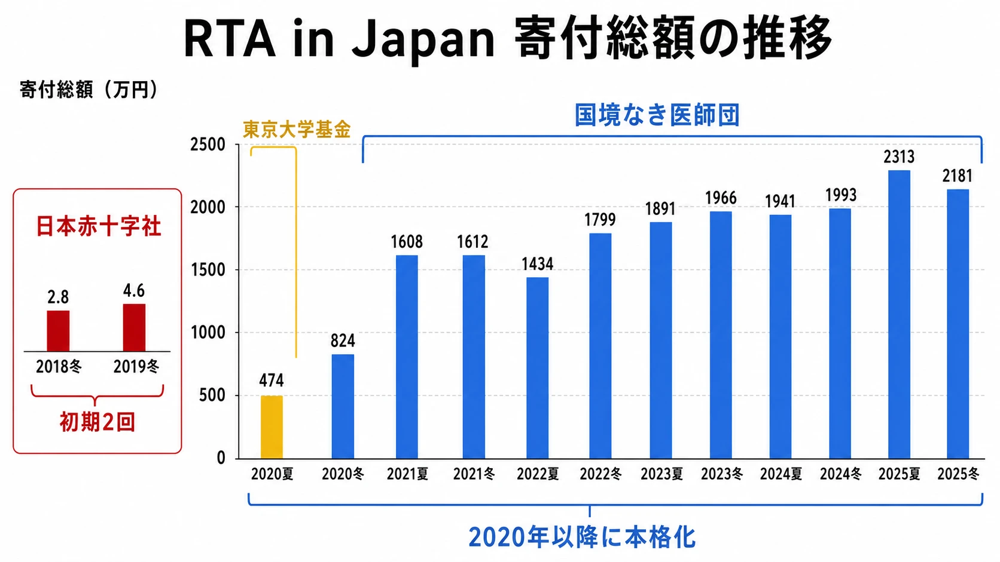

# RTA in Japan――寄付イベントとしてのタイムアタック文化

***

## はじめに――「観戦されるゲームプレイ」の第三の軸

「観戦されるゲームプレイ」には、大きく分けて三つの型がある。

一つ目は、 **対人競技としての強さ** を軸にした [eスポーツ](esports-history-and-business-structure.md) だ。プレイヤー同士が技を競い合い、企業スポンサーと興行モデルが結びついた、明確に「勝者と敗者がいる」スポーツ的文脈のコンテンツである。二つ目は、 **キャラクターへの感情移入** を駆動力にした [にじさんじ甲子園](nijisanji-koshien-publisher-engagement-design.md) のような祭典だ。VTuberという人格に共感したファンが、推しを応援するためにゲームの勝敗を見守る。

そして三つ目が、本稿が扱う **RTA（リアルタイムアタック）** というジャンルだ。ここには「対戦相手」がいない。プレイヤーが挑む相手は、対面する人間ではなく、ゲームそのものだ。「このゲームを、いかに早く、いかに深く攻略し尽くせるか」――その問いへの挑戦が、観客を集める。

対人でも感情移入でもない、 **第三の観戦軸** がRTAにはある。そしてRTA in Japanは、そこにさらに独自の「チャリティ」という価値観を接続することで、他に類を見ないイベント形態を生み出した。本稿はその構造と、その背後にあるゲーム文化・ビジネス的含意を読み解く試みである。

***

## 1. RTAとは何か

**RTA（Real Time Attack）** とは、ゲームを最初から最後まで通してプレイし、クリアまでの「実時間」を競う遊び方だ。ゲーム内の計測時間（IGT）ではなく、セーブ・ロード・ロード待ち・休憩時間も含めた現実の経過時間を外部タイマーで計測するのが特徴である。「どれだけ速くクリアできるか」だけを問うこの純粋な問いは、「RTAという言葉自体は2000年にゲーム攻略サークル極限攻略研究会が創り出した日本独自の造語」であり、海外では同じ遊び方を **Speedrun（スピードラン）** と呼ぶ。[[1](#ref-1)][[2](#ref-2)][[3](#ref-3)][[4](#ref-4)]

走者（プレイヤー）は、同じゲームでもプレイルールによって複数の「カテゴリ」に分かれて記録を競う。バグ・グリッチの使用を許容する「Any%」から、開発者の意図した動作のみでクリアを目指す「Glitchless」まで、カテゴリは走者コミュニティが協議して決定する。記録は世界最大のレーティングサイト **speedrun.com** に集積され、世界中のランナーがリアルタイムで競い合う。[[5](#ref-5)]

***

## 2. GDQとRTA in Japanの誕生

RTAのライブイベントとしてのルーツは、アメリカの **Games Done Quick（GDQ）** にある。2010年に「Classic Games Done Quick」として第1回が開催されたGDQは、チャリティイベントとしての側面を持ち、急速にその規模を拡大させた。2018年の夏大会（SGDQ）では **約2億3000万円** を超える寄付金を集めており、1回のイベントで数億円規模の寄付を実現する巨大イベントへと成長している。[[6](#ref-6)][[7](#ref-7)]

この海外の動きを参考に、日本でも「同様のゲームイベントを開催したい」という機運が生まれた。創始者の「もか」氏（中島和希氏）が企画・運営し、 **2016年12月末に第1回「RTA in Japan」が開催** された。数日間にわたって開催される規模のRTAイベントとしては、日本初の試みだった。現在は年に2回――夏の「RTA in Japan Summer」と冬の「RTA in Japan Winter」――が定例化しており、東京都内の会場でオフライン開催しながら、Twitch上での同時配信も行っている。[[8](#ref-8)][[9](#ref-9)][[1](#ref-1)]

***

## 3. 資金モデルの独自性――「マリオを速くクリアすると社会に貢献できる」

RTA in Japanの最も際立った特徴は、 **賞金でも企業スポンサーによる興行収益でもなく、「チャリティ（寄付）」を軸に据えた資金モデル** にある。

初期はRTA in Japan3（2018年冬）より運営メンバーのポケットマネーでグッズを制作し売上の一部を寄付するという形から始まったが、2020年以降に本格的なチャリティイベントとして再設計された。現在は **国境なき医師団（MSF）** への寄付を主目的とし、イベント期間中にTwitch配信で得た収益・視聴者からの直接寄付・協賛企業からのスポンサーシップ収益を、税額を除いてすべて寄付する仕組みを採用している。[[10](#ref-10)][[9](#ref-9)]

### 寄付実績の推移

以下が公式寄付報告に基づく主な記録である。[[11](#ref-11)][[12](#ref-12)][[13](#ref-13)][[14](#ref-14)][[23](#ref-23)]

| 回 | 開催時期 | 寄付先 | 寄付総額（概算） |
| --- | --- | --- | --- |
| RTA in Japan 3 | 2018年12月 | 日本赤十字社（北海道胆振東部地震義援金） | 約2.8万円 |
| RTA in Japan 2019 | 2019年12月 | 日本赤十字社（台風第15号千葉県災害義援金） | 約4.6万円 |
| RTA in Japan Online 2020 | 2020年8月 | 東京大学新型コロナ対策基金 | 約474万円 |
| RTA in Japan 2020 | 2020年12月 | 国境なき医師団 | 約824万円 |
| RTA in Japan Summer 2021 | 2021年8月 | 国境なき医師団 | 約1,608万円 |
| RTA in Japan Winter 2021 | 2021年12月 | 国境なき医師団 | 約1,612万円 |
| RTA in Japan Summer 2022 | 2022年8月 | 国境なき医師団 | 約1,434万円 |
| RTA in Japan Winter 2022 | 2022年12月 | 国境なき医師団 | 約1,799万円 |
| RTA in Japan Summer 2023 | 2023年8月 | 国境なき医師団 | 約1,891万円 |
| RTA in Japan Winter 2023 | 2023年12月 | 国境なき医師団 | 約1,966万円 |
| RTA in Japan Summer 2024 | 2024年8月 | 国境なき医師団 | 約1,941万円 |
| RTA in Japan Winter 2024 | 2024年12月 | 国境なき医師団 | 約1,993万円 |
| RTA in Japan Summer 2025 | 2025年8月 | 国境なき医師団 | 約2,313万円 |
| RTA in Japan Winter 2025 | 2025年12月 | 国境なき医師団 | 約2,181万円 |

*2018年・2019年は別枠、2020年8月は東京大学基金として色分けした。*

2023年末時点で累計寄付総額はすでに **1億円を超えており**、2024年夏の大会終了後には累計で1億1300万円以上に達したとも報告されている。[[9](#ref-9)]

この背後にある価値観は、GDQから受け継がれた「**ゲームで社会貢献できるというモデルケースを作りたかった**」という姿勢だ。「マリオを速くクリアすると社会に貢献できる」という逆説的ともいえる価値観は、GDQが体現した「エンターテインメントと慈善活動の接続」を日本的なRTA文化に移植した結果である。[[9](#ref-9)]

### 法人化の経緯

2020年6月、RTA in Japanは **一般社団法人** として法人格を取得した。理由は主に二点。一つは個人主催では金銭面の負担が限界に達していたこと（会場費・機材購入費を主催者個人が前払いしていた）。もう一つは、法人化することで機材レンタルや企業協賛、直接寄付の受け付けといった法人向けサービスが利用可能になり、イベントの質と規模を向上できるためだ。[[15](#ref-15)][[16](#ref-16)]

重要なのは、一般社団法人の選択が「**利益を法人の活動資金にせず、自分たちのものにしようとすると国からその資格を剥奪される**」という制約を意図的に受け入れるためだという点だ。理事に役員報酬を出さず、従業員も置かない体制は現在も変わっていない。「運営自体の利益はゼロ」という原則は、単なる美徳ではなく法的・組織的な構造によって担保されている。[[15](#ref-15)]

***

## 4. 統治構造の特異性――「ルールは走者が決める」

もう一つの独自性が、 **ゲームルールの決定構造** にある。

RTA in Japanでは、「どのカテゴリのルールで走るか」を **運営組織が決めるのではなく**、そのゲームの走者コミュニティが協議して決定する仕組みを採用している。運営に対してルールの問い合わせがあっても、「そのような理由があるため運営では回答できかねる」と明確に回答している。[[9](#ref-9)]

これはにじさんじ甲子園のような大会――主催者がゲームのルールを明確に定め、参加者全員が同じ条件のもとで競う形式――とは根本的に異なる統治のあり方だ。RTA in Japanにおける運営の役割は「場の提供」と「進行管理」であり、コンテンツの中核である「ルール」は走者コミュニティの自治に委ねられている。

この構造は、RTAという遊びが元来コミュニティドリブンな文化であることを反映している。Speedrun.comに集積された各ゲームのルールや記録も、その道のモデレーター（管理者）が走者コミュニティの中から選ばれ、承認作業を担う。「ゲームの最速クリアを競う競技」である以上、その仕様や抜け穴を最もよく知るのは走者自身であり、外部の組織がルールを一律に定めることは本質的に難しい。[[3](#ref-3)]

***

## 5. ゲームパブリッシャーとの関係スペクトラム

RTA in Japanとゲーム会社との関係は一枚岩ではなく、 **「緊張・慎重さ」から「積極的なコラボレーション」まで幅のある連続体（スペクトラム）** として理解するのが正確だ。

### 任天堂との許諾問題――緊張関係の事例

2025年8月、RTA in Japanは公式サイトにて重要な経緯を開示した。2025年6月13日、 **任天堂株式会社からRTA in Japanに対し「法人による任天堂のゲームの利用には事前の許諾が必要である」こと、および「これまでの利用が事前の許諾なく無許諾利用にあたる」こと** が指摘されたのである。[[17](#ref-17)]

RTA in Japanはこの指摘を受け、任天堂との許諾に関する協議を開始した。しかし「RTA in Japan Summer 2025」については採用ゲーム発表のタイミングでは明確な取り扱いを定めることができず、この回のイベントでは **任天堂タイトルを不採用** とする判断を下した。以降は「イベント・ゲームごとに個別に任天堂へ許諾申請を出し、許諾を受けることで利用可能となる見込み」とされており、冬以降の大会では所定の手続きを経て任天堂作品の採用が見込まれるとの発表もなされた。[[18](#ref-18)][[19](#ref-19)][[17](#ref-17)]

RTA in Japanは非営利チャリティイベントではあるが、一般社団法人として継続的に収益を生む配信活動を行っており、「小規模」とは言えない規模に成長している。著作権・配信権の観点から、法人としての運用に厳格な対応を求めることは、任天堂のこれまでの知的財産ポリシーとも整合的だ。[[18](#ref-18)]

### ゲームメーカーとRTAの歩み寄り――コラボレーション側の事例

一方で、RTAコミュニティへの公式な接近を試みるメーカーも増えている。CEDEC2022にて登壇したRTA走者・えぬわた氏は、セガが『スーパーモンキーボール』のRTA走者を **公式プレイヤーとして起用し、公式生放送を行った** 事例を紹介した。これは「RTA走者をパブリッシャーが公認のプロモーター」として位置づけた、当時としては先進的なコラボレーションだった。[[20](#ref-20)]

同講演では「ゲームメーカーがRTAに寄り添ったゲームを作ること」への期待として、走者がより練習しやすくなる **「どこでもセーブ」「ステージ単体でのクリア練習機能」「リプレイ機能」** の実装が望ましいとの声も紹介されている。インディーゲーム『Celeste』（Maddy Thorson氏ら開発）はゲーム内部にスピードラン向けのタイマーを実装しており、走者コミュニティから「RTAに向いているタイトル」として広く認知されている例だ。[[21](#ref-21)][[20](#ref-20)]

また、RTA in Japanというイベントそのものが「**ゲームメーカーとのコラボ**」を実現する場ともなっており、地方開催やゲームメーカーとの連携事例も生まれ始めていると運営は述べている。[[9](#ref-9)]

### 「バグ・グリッチをどう扱うか」というデザイン上の岐路

この「緊張から協調まで」のスペクトラムの底流には、 **バグ・グリッチに対するゲームデザイン上の価値判断** が横たわっている。

RTAにおいてバグやグリッチは「ゲーム内の不具合を制御して活用するテクニック」として肯定的に扱われる。「Any%」カテゴリではグリッチの使用が許容され、開発者の意図しないショートカットがコンテンツとして成立する。こうした「走者によるゲームの再解釈」が、観戦者の驚きと感動を生む核心でもある。[[22](#ref-22)][[5](#ref-5)]

しかしパブリッシャーから見れば、同じグリッチは「修正すべき不具合」または「公には認めにくい行為」として映りうる。CEDEC2022の講演でも、公式RTAプロモーションを行う際に「バグを視聴者に見せることへの懸念」が実際的な課題として挙げられており、「No Major Glitches」ルールの適用によって回避する方法が提案されている。[[20](#ref-20)]

**「バグをコンテンツとして許容するか、修正すべき不具合として処理するか」** という問いは、ゲームデザインの哲学的問題でもある。走者コミュニティとパブリッシャーの関係の濃淡は、まさにこの判断軸の上に位置している。どちらが「正解」かを断定することはできない。求める価値（競技的純粋さ vs. 作品意図の保護）が異なるため、どちらも合理性を持ちうる。重要なのは、両者の対話が必要な問題だと双方が認識することだ。

***

## 6. おわりに――「対戦相手のいない競技」の観戦力学

RTAは、プレイヤーが孤独にゲームと向き合う競技だ。そこに「対戦相手」はいない。だが、だからこそ生まれる独特の観戦体験がある。走者と観客が「同じゲームを攻略する」という共通の文脈を持ちながら、走者のミス・リカバリー・グリッチ成功を共に見守る場は、他のゲーム観戦とは質の異なる熱量を持つ。

RTA in Japanはそこに **コミュニティの自治** と **チャリティという社会的駆動力** を接続することで、「ゲームを早くクリアすることが社会に貢献する」という価値観を成立させた。ゲームプランナーの視点から見れば、これはゲームというメディアが「競技性」「物語性」「コミュニティ性」「社会的意義」のいずれを軸として観戦文化を成立させうるかを体現している事例だ。

RTAにおいて走者が挑むのはゲームという「設計物」そのものである以上、RTA in Japanはゲームデザインの非意図的な豊かさをも照射する鏡でもある。どんなゲームがコミュニティを生み、どんなデザイン判断が走者との関係を決定づけるか――その問いは、これからのゲーム開発にとっても無視できない視点となっている。

---

## References

1. [RTA in Japan 公式サイト][1] - RTA in Japanは、日本で開く大規模RTAイベント。RTAプレイヤーが一堂に会し、それぞれの持ちゲームを代わる代わるRTAとしてプレイする。

2. [独自の文化について分かりやすく解説 ゲームのRTAとは？][2] - ゲームのRTAについて、言葉の意味や基本的なルール、魅力、独自の文化等を解説する記事。

3. [必要なのはタイマー、録画、そして“ゲームへの愛”…「RTA」どう始める？][3] - RTA走者インタビュー。ゲームを最初から最後までプレイしてタイマーを付ければRTAになる、という基本的な始め方を解説。

4. [RTAの始め方を徹底解説！必要な機材や準備・ステップを紹介][4] - LiveSplitなど、RTA走者が使用するタイマーツールについて解説する記事。

5. [グリッチとは？バグやチートとの違いやRTAでの使われ方][5] - ハードウェアを物理的に破損させるような技はリスクが高く再現性も低いため、現代のRTA公式記録では禁止されることが多いと解説。

6. [RTA in Japanができるまで｜もか][6] - RTA in Japan創始者「もか」氏本人による一次証言記事。Games Done Quick（GDQ）が当初は小規模な内輪イベントだったが、年を追うごとに規模を拡大し、今では1イベントで日本円にして1億円以上の寄付を集めるイベントに成長したと述べている。

7. [ゲームの最速クリアで2億3000万円以上の寄付金。RTAを披露するチャリティーイベント「SGDQ 2018」][7] - 2018年の「SGDQ」で3万5370回の寄付があり、総額は212万9079ドル（約2億3000万円）に達したと報告。

8. [0.01秒の戦い! ゲームクリアのスピードを競うRTA（リアルタイムアタック）とは｜集英社オンライン][8] - RTA in Japan創始者・中島和希（もか）氏本人へのインタビュー記事。国内で初めて複数タイトルが集まる大規模オフラインRTAイベントが開催されたのは2016年12月のことで、当時の第1回参加者は50人前後だったと明かしている。

9. [注目ゲームイベント「RTA in Japan」とは?―今さら聞けない基礎知識と、今だからこそ伝えたいこと【CEDEC2024】][9] - ユーザーコミュニティから始まり、今やゲームメーカーとコラボを行うほど人気になったRTA in Japanの成り立ちを解説。

10. [RTA in Japan Summer 2025に関する寄付のご報告][10] - イベント専用PayPalへの入金額と寄付ページ上の数字の差異についての説明を含む、公式の寄付報告。

11. [『RTA in Japan Winter 2025』にて“2100万円以上”の寄付集まる][11] - 国境なき医師団への寄付完了を運営法人が報告した記事。

12. [RTA in Japan Winter 2025に関する寄付のご報告][12] - 直接寄付・Twitch収益等の内訳を含む、公式の寄付報告。

13. [RTA in Japan Summer 2024に関する寄付のご報告][13] - 直接寄付・Twitch収益等の内訳を含む、公式の寄付報告。

14. [RTA in Japanが「合計1965万円」を国境なき医師団に寄付したことを報告][14] - 2023年12月開催の「RTA in Japan Winter 2023」の寄付総額報告に加え、2018年のRTA in Japan 3以降の全回の寄付実績一覧表を掲載。

15. [一般社団法人RTA in Japanを設立しました][15] - 法人化に至った背景を、個人開催の金銭的負担と法人向けサービス利用の必要性という2点から説明。

16. [RTA in Japan、一般社団法人「RTA in Japan」を設立][16] - 代表理事「もか」氏こと中島和希氏の実名を明記し、法人化の経緯と非営利性徹底の方針を報じた記事。

17. [RTA in Japan における任天堂株式会社のゲームの利用に関するお知らせ][17] - 任天堂からの指摘と、それを受けた協議開始の経緯を説明する公式発表。

18. [「RTA in Japan Summer 2025」で任天堂タイトルが非採用となった理由][18] - 任天堂タイトル非採用の経緯と今後の対応についての報道記事。

19. [「RTA in Japan」今冬のイベントから“任天堂のゲーム”が利用可能となる見込み][19] - 任天堂との協議を踏まえた今後の見通しを報じた記事。

20. [RTAのプロモーション活用――伝説のRTA走者えぬわた氏が語るRTA配信の「瞬間風速」と「熱量の保温」【CEDEC2022】][20] - セガが『スーパーモンキーボール』のRTA走者を公式プレイヤーとして起用した事例などを紹介した講演レポート。

21. [【Celeste】トライ＆エラーを楽しみながら聖なる山に挑む！！名作アクションゲームをレビュー！][21] - ゲーム内設定でタイムカウンターをオンにすると画面左上にタイマーが表示される、Celesteのタイムアタック向け機能を紹介するレビュー記事。

22. [Glitchとは - RTAPlay!][22] - RTAにおける「グリッチ」の意味を解説する記事。

23. [「RTA in Japan Winter 2024」の寄付成果は“約1993万円”に。運営法人が報告][23] - 2024年12月開催の「RTA in Japan Winter 2024」の寄付総額（合計1993万4638円）を報じた記事。

[1]: https://rtain.jp
[2]: https://www.dat.ac.jp/course/game/game-column/game-school/what-is-rta/
[3]: https://www.gamespark.jp/article/2023/08/16/133031.html
[4]: https://speed-score-ranking.com/column/start-rta/
[5]: https://speed-score-ranking.com/column/what-glitch/
[6]: https://note.com/mokapeer/n/n1f2e56cc1550
[7]: https://news.denfaminicogamer.jp/gamenewsplus/180703
[8]: https://news.infoseek.co.jp/article/shueisha_28100/
[9]: https://www.gamebusiness.jp/article/2024/08/27/23427.html
[10]: https://rtain.jp/donation/rijs2025/
[11]: https://news.denfaminicogamer.jp/news/260216f
[12]: https://rtain.jp/donation/rijw2025/
[13]: https://rtain.jp/rtaij/rijs2024/
[14]: https://news.denfaminicogamer.jp/news/240414e
[15]: https://rtain.jp/rtaij/general-incorporated-association/
[16]: https://news.mynavi.jp/article/20200615-1056612/
[17]: https://rtain.jp/rtaij/nintendo/
[18]: https://www.4gamer.net/games/991/G999111/20250805012/
[19]: https://news.denfaminicogamer.jp/news/2508042d
[20]: https://gamemakers.jp/article/2022_08_29_15694/
[21]: https://www.dospara.co.jp/express/dospara/amt1626915
[22]: https://rta-play.info/meaning/glitch/
[23]: https://news.denfaminicogamer.jp/news/250209k

----

この文書は、Perplexity、Claude、OpenAI Codex の3つのAIの支援を受けて著述されたものです。引用画像を除き、MIT License にて提供されています。
