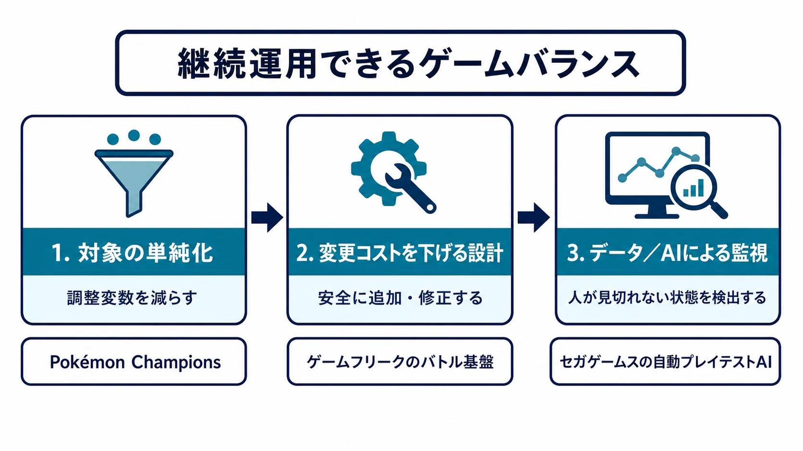

# 1000種以上のポケモンをどう調整し続けるか――大規模ゲームバランスを支える3つの仕組み

1000種以上のポケモン、900種以上の技、300種以上の特性、200種以上の道具。この数字は、CEDEC2026でゲームフリークの宗像快氏・小幡敏宏氏が紹介した、現在の『ポケットモンスター』シリーズのバトルが扱う対象の規模である。[[1](#ref-1)][[2](#ref-2)] 対象の多さは、それ自体が問題なのではない。技、特性、道具、天気、対戦形式が互いに作用するため、数が増えるほど「どの変更がどこへ波及するか」を人力で把握し続けることが難しくなる。

League of Legendsも、公式サイトでは140体を超えるチャンピオンを選べるとしている。[[3](#ref-3)] 大規模ロースターの運用で少人数のデザインチームが全組み合わせを遊び尽くし、常に正解を知ることは構造上できない。必要なのは、担当者の記憶力や試遊量を増やすことではなく、把握すべき対象を減らし、変更を安全にし、見落としを継続的に検出する仕組みである。

本稿では、[既存のTCGデザイン記事](tcg-digital-deck-building-design-practices.md)が扱った新弾、ローテーション、禁止・制限といったメタゲーム運用の選択肢には踏み込まない。焦点は、その手前にある「多すぎる対象そのものを、いかに運用可能な量へ保つか」である。ポケモン本編とポケモンカードゲームを手がかりに、次の三つのレイヤーを見ていく。

***

## レイヤー1：調整すべき変数そのものを減らす

大量の対象を扱うとき、最初に問うべきなのは「どの数値を弱体化するか」ではない。「そもそも、その数値を対戦バランスの変数として残す必要があるか」である。

『Pokémon Champions』は、Nintendo Switch版が2026年4月、スマートフォン版が同年6月に配信された、対戦に焦点を置くタイトルである。公式サイトは、基本プレイ無料、クロスプラットフォーム対応であり、企画制作をゲームフリークと株式会社ポケモン、開発を株式会社ポケモンワークスが担うと案内している。[[4](#ref-4)] 任天堂の案内では、VP（ビクトリーポイント）を使い、ポケモンの能力ポイントを調整できることが説明されている。[[5](#ref-5)]

ここから読めるのは、対戦前の育成を、個体ごとの来歴や複数の手段へ広げるのではなく、対戦で意味を持つ能力の配分へ寄せる判断である。これは育成を簡単にしたという一点ではない。プレイヤーが能力ポイントを直接割り振れることで、対戦バランスを検討する側も、その配分を明示的な選択として扱える。育成と対戦の複雑さを切り分け、調整・検証の対象となる状態空間を先に狭めるアプローチである。

変数を減らせば、細かな育成の最適化や偶然の差異を表現する余地も減る。ここで重要なのは、何でも単純にすべきという結論ではない。長期の成長、収集、厳選が遊びの中核なら、その複雑さは残す価値がある。一方で対戦を継続運用する主目的が「多数のポケモンを試し、調整された条件で戦えること」なら、育成の複雑さと対戦の複雑さを分けて扱う価値がある。

プランナーは、新しいパラメータを足す前に次の問いを置くとよい。

- この変数は、試合中の判断を面白くするのか。それとも試合前の手間だけを増やすのか。
- 同じ役割を、既存の変数の組み合わせで表せないか。
- この変数が存在すると、QA、分析、将来の調整で区別すべき状態はいくつ増えるか。

小規模なプロジェクトでも、まず一つの「実質的に同じ意味を持つ数値」を統合することから始められる。対象数を減らすことは、後述する二つのレイヤーが機能するための余白を作る。

***

## レイヤー2：変更を安全にする基盤を、バランス運用の一部にする

対象を単純化しても、長期シリーズでは新技、新特性、新しいバトル形式が増え続ける。そこで必要になるのが、変更を加えるたびに既存のロジック全体を壊さなくて済む構造である。

CEDEC2026の公式セッションページは、複雑化したバトル仕様と開発ラインの増加に対し、ゲームフリークが基盤設計を見直して再構築したことを説明している。宗像氏と小幡氏は同社のポケモン・バトルシステムチームに所属し、講演はゲームロジックを品質を保ちながら拡張・保守するための考え方を扱った。[[1](#ref-1)] 報道によれば、専門チーム発足の契機は『ポケットモンスター サン・ムーン』（2016年）の開発後であり、約20年の前作拡張型の蓄積を、『ポケットモンスター ソード・シールド』（2019年）で全面的に再構築したという。[[2](#ref-2)]

再構築の核は、バトルの処理を「セクション」に分けることだった。セクションは「ダメージ付与」「攻撃力決定」のように、処理の順序と役割だけを定義する最小単位であり、個々の技や特性の仕様は持ち込まない。技、道具、特性、天気の個別効果は、イベントとイベントハンドラーで接続する。イベントハンドラーとは、ある処理段階で発生したイベントを受け、必要な補正や追加処理を差し込む部品である。[[6](#ref-6)]

たとえば天気の「晴れ」は、炎技への補正と水技への補正を持つ。これを各ダメージ計算に直接書き込めば、同じ仕様が複数の場所へ散り、変更や削除が危険になる。イベントハンドラーなら、既存の主ロジックを直接書き換えず、必要なイベントへ反応する部品として追加できる。不要になった仕様も、ハンドラーを登録しなければ外せる。[[6](#ref-6)]

この構造は、ターン制の改修だけに閉じない。『Pokémon LEGENDS Z-A』のリアルタイムバトルでも、発動判定やダメージ付与などのセクションは、ターン制と同じ内部構造を再利用している。[[6](#ref-6)]

ここでの要点は、アーキテクチャを「実装者の都合」として切り離さないことである。頻繁なバランス変更が予想されるなら、変更箇所を局所化し、どの既存仕様に影響するかを追跡しやすくする設計は、運用能力そのものである。調整案が正しくても、実装や検証のコストが高すぎれば、実行できる頻度は下がる。反対に、小さな変更を安全に試せれば、問題の大きな改修を待たずに仮説を検証できる。

プランナーが仕様を渡すときは、効果そのものに加え、「何に介入するか」を明記したい。たとえば「最終ダメージを20％減らす」ではなく、「ダメージ計算後・HP減少前に補正する」「ほかの軽減効果と積算か乗算か」を決める。これはイベントハンドラーを実装するためだけの記述ではない。将来、別の効果が同じ段階に介入したときに、仕様の衝突を発見するための地図になる。

***

## レイヤー3：人が見切れない状態を、データとAIで継続監視する

対象を減らし、変更しやすくしても、実際にどの組み合わせが難しすぎるか、どの設定変更が新たな詰まりを作ったかを、人がすべての条件で遊んで確認することはできない。最後のレイヤーは、データと自動化で監視の解像度と反復回数を増やすことである。

セガゲームスの事例では、ブレインパッドが、深層強化学習でテストプレイを学習するAIシステムの開発支援を紹介している。ここでいう深層強化学習は、AIが試行と結果を繰り返し、目標へ近づく行動を学ぶ方法である。ベンダー発信の導入事例であり、対象タイトル名や内部の評価指標は公開されていない点には注意が必要だ。[[7](#ref-7)]

それでも、運用へ接続する仕組みは具体的である。シミュレーターを通じてAIにテストプレイを学習させ、動作確認と難易度確認を含む検証を自動化した。設定条件を変更するたびに約60分を要していた再学習を短縮し、複数ステージ・複数キャラクターが存在するゲームでも、従来より大量のゲームバランス検証ができるようになったと報告されている。[[7](#ref-7)]

これはAIに「面白いか」を最終判定させる仕組みではない。人間が確認すべき判断の前に、設定変更後の状態を大量に通し、失敗率、到達時間、特定行動の選択率といった差分を早く見つける仕組みである。たとえば難易度を一段階だけ変えたとき、あるキャラクターだけが特定ステージで進行不能に近い状態になっていないか。新しい能力を足したとき、AIが以前と大きく違う経路を選び始めていないか。こうした候補を広く出し、人間のプレイと判断を集中させる。

導入時には、まずAIに何を学ばせるかより、何を観測したいかを定義する。勝利だけを報酬にすれば、想定外の近道を見つけるかもしれないが、途中の体験の悪化を見落とす。到達率、所要時間、被ダメージ、リトライ、行動の多様性など、ゲームの目的に合う複数の観測値を置く必要がある。さらに、再学習の短縮は単なる高速化ではない。変更、学習、差分確認、人間の再試遊というループを短くし、調整を一度きりの会議から継続的な運用へ変える手段である。

対戦ゲームの公開運用では、Riot Gamesのチャンピオンバランスフレームワークが別の形を示す。平均層、上級層、エリート層、プロ層を分け、勝率、バン率、プレゼンスに異なるしきい値を置く。同時に、習熟曲線が急なチャンピオンや人気による偏りを、統計だけで機械的に扱わないとしている。[[8](#ref-8)] データは問題候補を絞る道具であり、変更内容を自動決定するものではない。

カードゲームの比較も同じである。Magic: The Gatheringは2026年8月の禁止制限告知で、MTG Arenaの使用率・勝率と、過去に禁止したカードのデータパターンを照合し、フォーマットの速度が問題になる場合は大会結果を待たずに対応する考え方を示した。[[9](#ref-9)] 一方、遊戯王の2026年7月適用リミットレギュレーションは変更カードを定期発表しているが、その告知本文は選定理由を個別には説明していない。[[10](#ref-10)] 同じ禁止・制限という結果でも、判断の透明性と説明の仕方は運用設計の一部になる。

***

## 三つのレイヤーを、プロジェクトの規模に合わせて始める

大量の対象を運用する問題は、「AIを導入するか」だけでは解けない。三つのレイヤーは、次の順で互いを支える。

| レイヤー | まず解く問題 | 小規模プロジェクトでの最初の一歩 |
| --- | --- | --- |
| 対象の単純化 | 調整・検証すべき状態が多すぎる | 似た役割のパラメータを一つ統合し、残す変数の目的を書く |
| 変更コストを下げる設計 | 一か所の変更が予測不能な箇所へ波及する | 効果の発動段階と影響範囲を仕様に書き、個別効果を主処理から分ける |
| データ／AIによる監視 | 人の試遊だけでは差分を追えない | テストログに到達率・所要時間・失敗理由を残し、変更前後で比較する |

『Pokémon Champions』から読めるのは、対戦の中心に不要な複雑さを残さず、調整対象を先に狭める姿勢である。ゲームフリークのCEDEC講演が示したのは、新しい要素を足しても既存ロジックを直接壊しにくい基盤が、長期的な品質と変更速度を支えるという事実である。セガゲームスの事例が示すのは、人がすべてを遊べない規模では、AIを人の代役ではなく、広い状態空間を繰り返し通して異常候補を見つける検証装置として置けるということである。

自分のプロジェクトが1000種の対象を持っていなくても、この順序は使える。まず、増やす予定のパラメータを一つ減らせないかを見る。次に、次回の調整でどこを直すか分からなくならない構造を作る。その上で、毎ビルドで比較したい指標を一つ自動集計する。ゲームバランスの継続運用とは、すべてを把握し続けることではない。把握しなくてよいものを減らし、変化を安全にし、人が見るべき場所を知らせる仕組みを重ねることである。

## References

1. [CEDEC2026 セッション詳細：ポケモン勝負の進化を支える、バトルシステムの基盤設計と運用事例][1] - 登壇者、講演概要、複雑化したロジックの保守と再構築の公式説明。

2. [CEDEC2026『ポケモン』バトルシステム講演：複雑なシステムがどうなってるのか][2] - 専門チーム発足と全面再構築の経緯、セクションとイベントの講演内容を報じた記事。

3. [League of Legends公式：How to Play][3] - 140体を超えるチャンピオンを案内する公式ページ。

4. [『Pokémon Champions』公式サイト][4] - 配信時期、対応機種、企画制作・開発・発売の情報。

5. [任天堂トピックス：『Pokémon Champions』は本日配信開始][5] - ゲーム内でポケモンの能力ポイントを調整できることを案内している。

6. [ファミ通.com：複雑化するバトルを支えるシステム設計と運用事例][6] - セクション、イベント、イベントハンドラーによる構造化と拡張性、リアルタイムバトルへの基盤再利用を報じた講演レポート。

7. [ブレインパッド：セガゲームスへの深層強化学習によるゲーム攻略AIの開発支援][7] - 自動テストプレイ、再学習時間の短縮、大量のゲームバランス検証を紹介するベンダー発信の導入事例。

8. [Riot Games：Champion Balance Framework][8] - プレイヤー層別の指標と、データから変更判断へ至る考え方を説明した公式開発者ブログ。

9. [Magic: The Gathering：Banned and Restricted Announcement — August 10, 2026][9] - MTG Arenaのデータと過去のパターンを踏まえた禁止制限判断を説明する公式告知。

10. [遊戯王OCG：2026年7月1日適用リミットレギュレーション][10] - 禁止・制限カードの変更リストを告知する公式ページ。

[1]: https://cedec.cesa.or.jp/2026/timetable/detail/s698585436538b/
[2]: https://news.denfaminicogamer.jp/kikakuthetower/2607224z
[3]: https://www.leagueoflegends.com/en-sg/how-to-play/
[4]: https://www.pokemonchampions.jp/ja/
[5]: https://www.nintendo.com/jp/topics/article/948dfa20-e059-47d3-beac-516cd3f5cfb3
[6]: https://www.famitsu.com/article/202607/82439
[7]: https://www.brainpad.co.jp/doors/contents/02_ai_case_study_sega_games/
[8]: https://nexus.leagueoflegends.com/en-us/2019/05/dev-champion-balance-framework/
[9]: https://magic.wizards.com/en/news/announcements/banned-and-restricted-august-10-2026
[10]: https://yu-gi-oh.jp/news_detail.php?page=details&id=2561

----

この文書は、Perplexity、Claude、OpenAI Codex の3つのAIの支援を受けて著述されたものです。引用画像を除き、MIT License にて提供されています。
