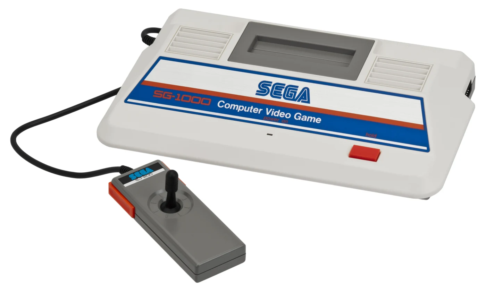
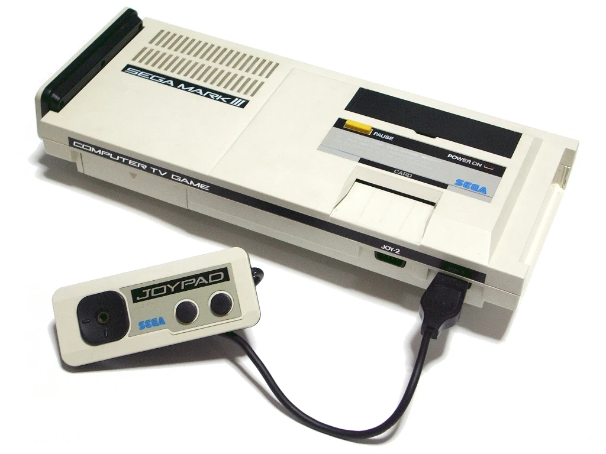
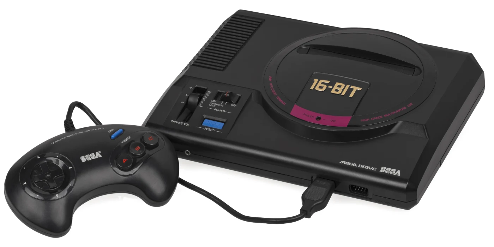
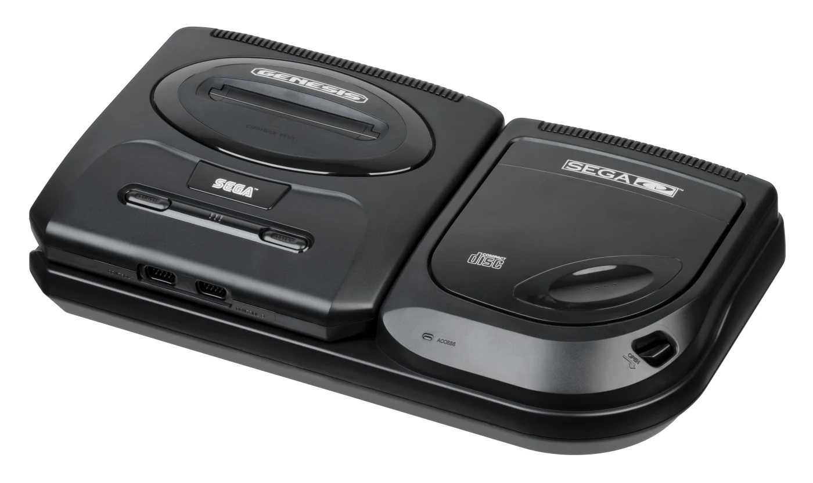
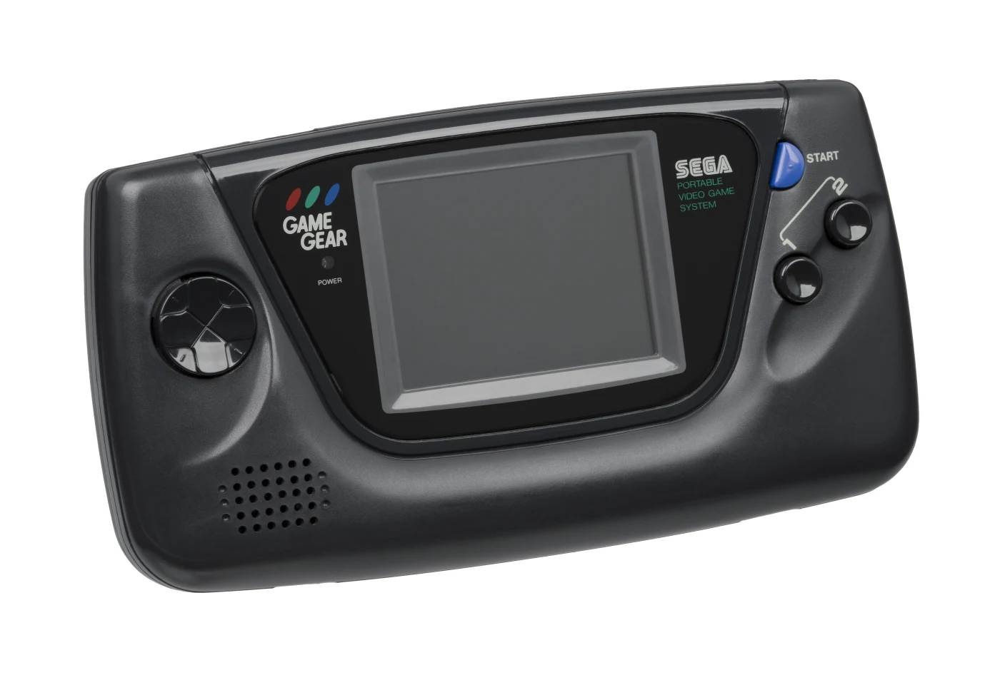
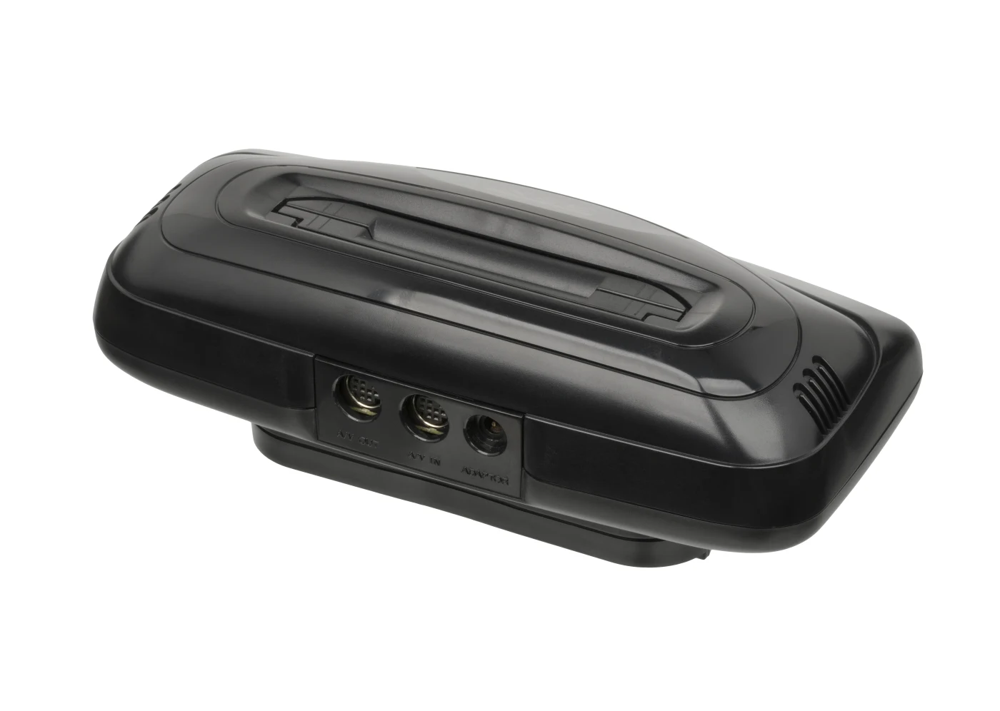
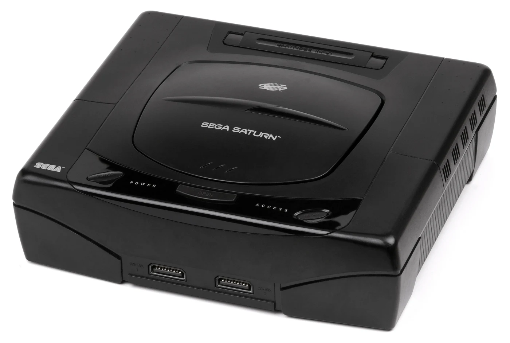
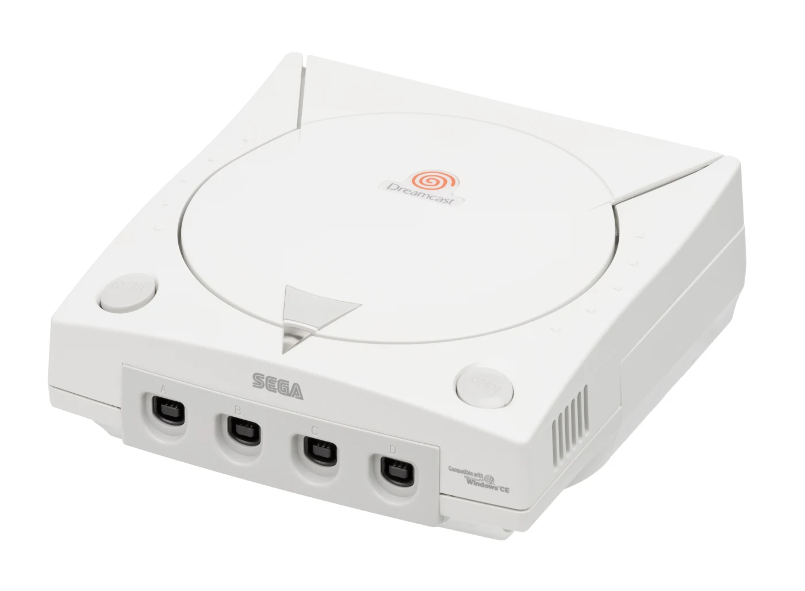

# セガのコンソール史：SG-1000からドリームキャストまで
## ハード設計とマーケティング戦略の因果関係

***

## はじめに：「アーケードを家庭へ」という哲学

本ブログではこれまで、家庭用ゲーム機の歴史を語る際、基本的には市場でメジャーな流れとして、任天堂のファミコンからスーパーファミコン、Wii、Switchへ続く系譜や、PlayStation各シリーズを中心に扱ってきた。これは、多くのプレイヤーが実際に触れてきた環境を基準にゲーム体験を考えるためであり、決してマイナー機を軽んじる意図ではない。

しかしセガのハードウェアには、単に「マイナーだった」で片づけられない独自の設計思想と、市場で優位に立てなかっただけの構造的な理由がある。そこで今回は、あえてセガの家庭用ハードに焦点を絞り、その成功と失敗をまとめて見ていく。

セガのハード史を貫く一本の軸は、 **「アーケードゲームを家庭に持ち込む」** という設計思想だ。この哲学は、SG-1000の誕生からドリームキャストの終焉まで一貫して続く。しかしこの哲学は時に技術的な先進性として輝き、時に市場の読み違いとして組織を蝕んだ。ハードウェアの設計決定がいかにマーケティング戦略の成否を決定づけたか、年代ごとに解剖する。[[1](#ref-1)]

***

## 第一世代（1983–1985）：出発点の呪い

### SG-1000 ― ファミコンと同日に生まれた悲劇

*画像出典: Evan-Amos, [Sega-SG-1000-Console-Set.jpg](https://commons.wikimedia.org/wiki/File:Sega-SG-1000-Console-Set.jpg), Wikimedia Commons, Public Domain.*

| 項目 | SG-1000 | ファミコン |
|---|---|---|
| 発売日 | 1983年7月15日 | 1983年7月15日 |
| CPU | NEC μPD780C（Z80互換）3.58MHz | リコー製2A03（6502互換）1.79MHz |
| 映像チップ | TI TMS9918（ColecoVisionと同一） | リコー製PPU（2C02） |
| 価格 | 15,000円 | 14,800円 |
| 世界販売台数 | 約200万台 | 6,000万台超 |

1983年7月15日、セガ・エンタープライゼスは初の家庭用ゲーム機 **SG-1000** を、ファミコンとまったく同じ日に発売した。これは同社にとって根本的な出発不利だった。SG-1000のビデオチップはColecoVisionと同一のTI TMS9918であり、アーケードの移植品質では拮抗できたが、ファミコン専用に開発されたPPU（2C02）のスプライト性能を超えることはできなかった。[[2](#ref-2)][[1](#ref-1)]

**ハード設計とマーケの因果関係①**：SG-1000は「アーケード移植のショーケース」として設計された。つまりマーケティングのコアメッセージは「セガのアーケードゲームが家で遊べる」という体験価値だった。しかし任天堂が同価格帯でオリジナルタイトル（ドンキーコング、マリオブラザーズ）を大量に展開したため、移植品質だけでは差別化できなかった。

同時に発売されたコンピュータ版 **SC-3000**（キーボード付き）は、ホームコンピュータ市場も狙うという戦略的二刀流だったが、両方中途半端になるリスクを孕んでいた。[[3](#ref-3)]

### セガ・マークIII / マスターシステム ― 「高性能なのに負けた」教訓

*画像出典: Muband, [Sega Mark III.jpg](https://commons.wikimedia.org/wiki/File:Sega_Mark_III.jpg), Wikimedia Commons, [CC BY-SA 3.0](https://creativecommons.org/licenses/by-sa/3.0/)。WebP変換。*

SG-1000の反省を活かし、1985年10月に **セガ・マークIII** が日本で登場。これをベースに、北米（1986年）では **Master System** として、欧州（1987年）でも **マスターシステム** として展開された。[[4](#ref-4)]

**ハード設計の論理**：マークIIIはNESよりも広い発色パレットと大きな解像度を持ち、ハードウェア性能では明確に優位だった。これをもとにセガ・エンタープライゼスは「NESより高い技術力」を前面に押し出すマーケティングを展開しようとした。

**しかし市場は動かなかった（北米・日本）**：任天堂はファミコン／NESのサードパーティに対し、プラットフォーム独占条項・年間発売本数の制限・自社製造カートリッジの義務付け（北米では10NESロックアウトチップ）を柱とする厳格なライセンス契約を課していた。この結果、コナミ・カプコン・ナムコといった主要デベロッパーの人気タイトルは事実上ファミコン／NESに集中し、競合機には供給されにくかった。「高性能」というメッセージは、ソフトラインナップの貧弱さによって相殺された。[[5](#ref-5)]

**ところが欧州とブラジルでは逆転した**：任天堂の独占契約の影響が弱かった欧州では、マスターシステムはシェアを確立した。ブラジルでは **TecToy社** が正規ライセンス生産・販売を担い、独自に市場を育成。任天堂がブラジルに公式拠点を持たなかったため、マスターシステムは事実上ブラジルの標準ゲーム機となった。TecToyは2026年現在もマスターシステムを販売し続けている。[[6](#ref-6)][[4](#ref-4)]

> **設計→マーケの因果：** 「高性能」という技術的優位は、サードパーティのコンテンツなしには市場を動かせない。北米・日本での失敗は、ハードの性能ではなくエコシステムの欠如が原因だった。

***

## 第二世代（1988–1993）：黄金期の設計哲学

### メガドライブ / Genesis ― 「アーケードの完全移植」が世界を制した

*画像出典: Evan-Amos, [Sega-Mega-Drive-JP-Mk1-Console-Set.jpg](https://commons.wikimedia.org/wiki/File:Sega-Mega-Drive-JP-Mk1-Console-Set.jpg), Wikimedia Commons, Public Domain.*

| 項目 | メガドライブ / Genesis |
|---|---|
| 発売日 | 1988年10月29日（JP）/ 1989年8月14日（NA） |
| メインCPU | Motorola 68000（7.67MHz） |
| サブCPU | Zilog Z80（3.58MHz、サウンド制御） |
| 世界販売台数 | 約3,000万台以上 |
| 北米シェアピーク | 約65%（対SNES） |

**メガドライブのハード設計は意図的な「アーケード基板の家庭用化」だった。** メインCPUに採用したMotorola 68000は、セガの業務用アーケード基板 **System 16**（1985年）と同系統のプロセッサだ。サブCPUのZ80は主にサウンド制御を担うが、外付けアダプタ「パワーベースコンバータ」を介すことでマスターシステムソフトの後方互換も実現した。68000採用は開発者にとって「アーケード移植が容易」という直接的なメリットを意味した。[[7](#ref-7)][[8](#ref-8)]

**「Genesis does what Nintendon't」** ― この1990年前後の北米キャンペーンはハード設計の特性をそのままキャッチコピーにしたものだ。特に物議を醸した **「ブラスト・プロセッシング」** は、Genesisの68000のDMAコントローラーがSNESより高速にビデオプロセッサへデータを転送できる実際の技術的特性を、マーケティング用語に昇華させたものだった。「言葉は盛り気味」だが「嘘ではない」という絶妙な境界線にあった。[[9](#ref-9)][[10](#ref-10)]

**トム・カリンスキーの戦略**：Sega of AmericaのCEO、トム・カリンスキーは：[[11](#ref-11)]
- ソニックをバンドルして価格競争力を高めた
- EAスポーツとの強力な連携で「スポーツゲームはセガ」イメージを確立
- ティーン〜大学生をターゲットにした「クール」ブランドを構築

**日本での苦戦**：一方、日本ではPCエンジンと競合しつつ、スーパーファミコンの登場（1990年）で苦境に立った。日本でのメガドライブ販売台数は358万台にとどまり、欧米の成功とは対照的だった。[[12](#ref-12)]

#### メガCD（北米名：Sega CD）― CD-ROMというハード拡張の野望

*画像出典: Evan-Amos, [Sega-CD-Model2-Set.jpg](https://commons.wikimedia.org/wiki/File:Sega-CD-Model2-Set.jpg), Wikimedia Commons, Public Domain.*

1991年（日本では「メガCD」）・1992年（北米では「Sega CD」）にリリースされたこのCD-ROMアドオンは、メガドライブ本体の下部に接続して使用する。アーケード的な「スペック拡張」の発想そのものだったが、次の問題が発生した：[[1](#ref-1)]

- **FMV（フルモーション・ビデオ）ゲームの氾濫**：CD-ROMの大容量を動画再生に使った低品質タイトルが多数発売された
- 代表タイトル *ナイトトラップ*（1992年）は米議会の公聴会で暴力・性的表現の俎上に上がるほどの問題作となった[[13](#ref-13)][[14](#ref-14)]
- 良作（*ソニック・ザ・ヘッジホッグCD*、*LUNAR ザ・シルバースター*、*スナッチャー*）も存在したが、印象を覆せなかった

> **設計→マーケの因果：** CD-ROMという「大容量」は技術的優位だが、コンテンツ品質の管理なしには「スペックの無駄遣い」というブランドリスクに転化する。

***

## 第三世代（1990–1994）：拡張戦略の迷走

### ゲームギア ― カラー携帯機の「電池問題」

*画像出典: Evan-Amos, [Sega-Game-Gear-FR.jpg](https://commons.wikimedia.org/wiki/File:Sega-Game-Gear-FR.jpg), Wikimedia Commons, Public Domain.*

1990年10月6日に発売された **ゲームギア** は、マスターシステムをほぼそのまま携帯化したカラー液晶機だ。[[15](#ref-15)]

| 項目 | ゲームギア | ゲームボーイ |
|---|---|---|
| 発売年 | 1990年 | 1989年 |
| ディスプレイ | カラーバックライトLCD | モノクロ反射型LCD |
| 連続駆動時間 | 乾電池6本で約3〜4時間 | 乾電池4本で約35時間 |
| 販売台数 | 約1,100万台 | 1億台超 |

**ハード設計の選択とその代償**：バックライト付きカラーディスプレイは技術的に優れていたが、電力消費量が膨大だった。「カラーで綺麗に見える」というマーケティング上の訴求ポイントは、「電池がすぐ切れる」という致命的なユーザー体験によって相殺された。ゲームボーイの「ゲームボーイはどこでも遊べる」シンプルさに対し、ゲームギアは「遊べるが電源が必要」という実用上の制限を抱えた。[[16](#ref-16)]

Master Gear Converterを使えばマスターシステムのカセットが動くという互換性は訴求できたが、ゲームボーイに対抗するキラータイトルが不足していた。[[17](#ref-17)]

### 32X ― 史上最悪のハード拡張

*画像出典: Evan-Amos, [Sega-Genesis-32X-02.jpg](https://commons.wikimedia.org/wiki/File:Sega-Genesis-32X-02.jpg), Wikimedia Commons, Public Domain.*

1994年11月（北米は11月21日）に発売された **32X** は、メガドライブのカートリッジスロットに装着する独立電源付きの拡張ユニットだった。[[18](#ref-18)]

**なぜこれが生まれたか：** Sega of AmericaはGenesisの3,000万ユーザーベースを守りたかった。一方、日本法人であるセガ・エンタープライゼスはセガサターンへの早期移行を推進していた。この組織的葛藤の妥協点として、開発コードネーム「Project Mars」（セガはハード開発に惑星名を用いる慣習があった）のもと、「セガサターン世代への橋渡し」という名目で32Xが承認された。32XはセガサターンのCPUと同系のHitachi SH-2を、より低いクロックで2基搭載していた。[[19](#ref-19)]

**結果**：
- 発売時期がセガサターンの日本発売（1994年11月22日）とほぼ同時 → 自社競合[[18](#ref-18)]
- 1年で約80万台販売、その後急速に廃れた[[18](#ref-18)]
- 開発者から見れば「セガサターン・PS・32X・メガドライブ」の4プラットフォームへの対応を求められる状況になり、サポートを打ち切るサードパーティが続出

> **設計→マーケの因果：** 「社内の政治的妥協」がハード設計に持ち込まれると、どのプラットフォームでも中途半端な存在になる。32Xは技術的には興味深いが、マーケットにとっては「また新しいセガのハードを買わされる」という不信感の象徴となった。

***

## 第四世代（1994–1998）：傑作と崩壊のセガサターン

### セガサターン ― 2Dの傑作、3Dの試練

*画像出典: Evan-Amos, [Sega-Saturn-Console-NA-Mk-I-FL.jpg](https://commons.wikimedia.org/wiki/File:Sega-Saturn-Console-NA-Mk-I-FL.jpg), Wikimedia Commons, Public Domain.*

| 項目 | セガサターン | Sony PlayStation |
|---|---|---|
| 発売日（JP） | 1994年11月22日 | 1994年12月3日 |
| CPU | Hitachi SH-2 ×2基（各28.63MHz） | MIPS R3000A（33.87MHz）×1 |
| ポリゴン描画 | 四辺形（クワッド）ベース | 三角形ベース |
| 北米発売価格 | 399ドル | 299ドル |
| 世界販売台数 | 926万台 | 1億200万台 |

**ハード設計の根本的な選択ミス：**

セガサターンのアーキテクチャは **デュアルSH-2** という独創的な構成だったが、2つのCPUがメモリを容易に共有できない設計だった。さらにポリゴン描画単位が **四辺形（クワッド）** であり、PlayStation・N64が採用した業界標準の **三角形ポリゴン** とは異なっていた。三角形は任意形状のポリゴンを効率的に処理できるが、四辺形は2D的な板状スプライト処理を前提とした設計思想の延長線上にある。[[20](#ref-20)][[21](#ref-21)]

この設計は **格闘ゲームと2Dゲームには強力** だった。*バーチャファイター2*（1995）はアーケード版の人気を家庭に持ち込み、セガサターン本体の販売を牽引する看板タイトルとなった。*龍虎の拳2*、*ザ・キング・オブ・ファイターズ（KOF）* シリーズ、*バーチャコップ* など、アーケード由来のタイトルの移植品質も高く、ここではセガの「アーケードゲームを家庭に持ち込む」という思想が素直に強みとして出た。[[22](#ref-22)]

ただし、セガサターンを支えたのは移植タイトルだけではない。*NiGHTS into dreams...* はアーケードからの移植ではなく、セガサターン向けに作られたオリジナルタイトルだった。夢の空間を飛ぶ独特のフライトアクションは、サターンが単なる移植機ではなく、独自の表現を持つプラットフォームでもあったことを示していた。[[52](#ref-52)]

しかし *トゥームレイダー* のような3Dゲームや、PlayStationで急成長していた3Dアクション・アドベンチャー系の移植は困難を極めた。 **結果として欧米のデベロッパーがPlayStation優先** になっていく。

**E3 1995の大失策：**

1995年5月11日、Sega of America社長兼CEOのトム・カリンスキーはE3の壇上でセガサターンの「本日発売」を宣言。価格は399ドルだった。事前通告のなかった主要小売チェーンの一部は在庫がなく、セガに不信感を持った。その後、ソニー側ではSCEA（Sony Computer Entertainment of America）社長スティーブ・レースが壇上に上がり、ひと言「299ドル」とだけ告げて降壇した。PlayStationはセガサターンより100ドル安いことが示された瞬間だった。[[23](#ref-23)][[24](#ref-24)][[25](#ref-25)][[26](#ref-26)]

トム・カリンスキー自身が後に「セガ史上最大の失策」と評したこのサプライズ発売は、 **日本法人であるセガ・エンタープライゼスとSega of Americaの組織的断絶** の直接的な結果だった。早期発売は日本本社の主導で、北米の流通・マーケティングインフラを無視した意思決定であり、カリンスキー自身は強く反対していたとされる。[[27](#ref-27)][[19](#ref-19)]

**セガサターンは日本では成功：**

日本においてはセガサターンはむしろ健闘した。発売6か月でPlayStationに先んじて100万台を達成し、最終的な日本国内累計は約580万台に到達。これはセガの歴代家庭用ゲーム機で最多であり、同世代のライバルであるニンテンドウ64（日本国内約554万台）を上回った。*セガサターンマガジン* が厚いコミュニティを形成し、*サクラ大戦*、*グランディア*、*バーニングレンジャー* などオリジナルIPが育った。これは「日本市場ではアーケード移植と2D RPGへの需要が強い」という地域特性と、セガのハード設計思想が一致した稀な例だった。[[28](#ref-28)][[29](#ref-29)]

***

## コラム：PCエンジン ― 第三極の証明

ここまでセガのハードを軸に見てきたが、同じ時代の日本市場には、任天堂でもセガでもない第三極のハードウェアも存在した。PCエンジンはその代表例であり、セガの失敗を相対化するうえでも重要な比較対象になる。

### NEC × ハドソンの奇跡

**PCエンジン** は1987年10月30日、NECホームエレクトロニクスとハドソンの共同開発によって発売された。価格は24,800円。[[30](#ref-30)][[31](#ref-31)]

| 仕様 | PCエンジン |
|---|---|
| CPU | HuC6280（6502互換カスタム、最大7.16MHz＝ファミコンの約4倍） |
| グラフィック | 16ビットVDC（HuC6270）＋カラーエンコーダHuC6260 |
| 記録メディア | HuCard（独自ICカード） |
| 日本国内累計販売 | 約584万台（シリーズ計約764万台） |

**設計の独自性：** PCエンジンはCPU（HuC6280）こそ8ビット（6502互換）だが、画像処理を担うVDC（HuC6270）がVRAMと16ビットバスで接続される独自構成により、グラフィックス面では16ビット機並みの表現力を持っていた。HuCardという薄型ICカードの採用は、後の **PCエンジンGT**（1990年）として世界初の「据置機とソフト互換性を持つ携帯ゲーム機」を実現させた。[[32](#ref-32)][[30](#ref-30)]

**CD-ROM²の革命（1988年）：** PCエンジンは1988年に世界初の家庭用CD-ROMアドオン「CD-ROM²」を発売（59,800円）。これはセガのメガCDより3年先行しており、大容量を活かした *イース* シリーズのアドベンチャーゲーム、アニメボイス付きのアドベンチャーゲームなど独自のコンテンツ文化を育てた。[[32](#ref-32)]

**セガとの競合と棲み分け：** PCエンジンは日本市場でセガのメガドライブよりも高いシェアを維持した期間があった。1989年4月時点で日本の新規ゲーム機販売の50%を占め、累計150万台に達していた。メガドライブが苦手とした「日本のコアゲーマー」層をPCエンジンが取り込んでいたとも言える。[[33](#ref-33)]

**北米での失敗（TurboGrafx-16）：** 北米では *TurboGrafx-16* として1989年に発売されたが、Genesis/SNESの挟撃を受け市場シェアを取れなかった。ローカライズ不足と参入の遅れが響いた。[[34](#ref-34)][[30](#ref-30)]

**後継機PC-FXの迷走（1994年）：** PCエンジンの後継として1994年12月に発売した **PC-FX** は、3Dポリゴン描画に非対応というセガサターン・PlayStation世代に完全に取り残された設計で市場を去った。セガサターンと同様、「前世代の文化（2D・FMV）を引き継ぎすぎた」設計思想が足を引っ張った事例だ。[[35](#ref-35)][[36](#ref-36)]

> **PCエンジンの教訓：** 強いハードと強いコンテンツ文化は日本市場では通用した。しかしグローバル展開と世代移行の失敗は、どのメーカーも平等に滅ぼす。

***

## 第五世代（1998–2001）：ドリームキャストの先見性と終焉

### ドリームキャスト ― 未来に生まれすぎた機体

*画像出典: Evan-Amos, [Sega-Dreamcast-Console-FL.jpg](https://commons.wikimedia.org/wiki/File:Sega-Dreamcast-Console-FL.jpg), Wikimedia Commons, Public Domain.*

| 項目 | ドリームキャスト |
|---|---|
| 発売日 | 1998年11月27日（JP）/ 1999年9月9日（NA）|
| CPU | Hitachi SH-4（200MHz）シングルコア |
| GPU | NEC PowerVR2（Holly）100MHz |
| 記録メディア | GD-ROM（約1GB） |
| 標準搭載 | モデム（日本初期型33.6kbps／1999年9月以降の北米型以降は56kbps） |
| 世界販売台数 | 約913万台 |

**セガサターンの反省を設計に活かした：** セガサターンのデュアルプロセッサによる開発の複雑さへの反省から、ドリームキャストはSH-4シングルCPUに統一された。ポリゴン描画もDirectXと互換性の高い標準的な三角形ベースに移行し、サードパーティ開発が容易になった。[[37](#ref-37)]

**アーケード基板NAOMIとの統一戦略：** ドリームキャストはセガのアーケードボード **NAOMI**（1998年）とほぼ同一のアーキテクチャを持つ。NAOMIはドリームキャストの2倍のRAMを搭載するが、CPUとGPUのクロックは同じだ。これにより「アーケードで稼働中のゲームがほぼそのままドリームキャストに移植できる」という、セガの長年の夢を最も完璧に実現した設計だった。[[38](#ref-38)][[39](#ref-39)]

**モデム標準搭載という先見：** 世界初の「モデム標準搭載コンソール」というドリームキャストの設計は、当時「なぜゲーム機にモデムが要るのか」と疑問視もされたが、これが最大の差別化要因となった。[[40](#ref-40)]

- **ファンタシースターオンライン**（2000年）：家庭用ゲーム機初の本格コンソールオンラインRPG。パーティを組んでネット対戦・協力する体験を一般家庭に届けた[[41](#ref-41)]
- 北米ではプロバイダ2年契約でDreamcast本体＋キーボードを無料配布するキャンペーンも実施[[42](#ref-42)]
- VMU（ビジュアルメモリユニット）はコントローラーに差し込むメモリカードでありながら、自前の液晶画面・ボタン・CPU・バッテリーを搭載し、「第2画面」機能を実現[[43](#ref-43)]

**シェンムー（1999年）** は推定制作費4,700万〜7,000万ドルとも言われ、当時世界一高額なゲーム開発プロジェクトだった。オープンワールド・昼夜サイクル・NPC独自スケジュール・QTEなど後のゲーム設計に多大な影響を残した。[[44](#ref-44)][[45](#ref-45)]

### なぜドリームキャストは市場で敗北したか

セガのハード事業の終焉は多層的な要因の複合だ：

**① PS2のDVD再生機能：** PlayStation 2（2000年）はゲーム機でありながらDVDプレイヤーでもあった。日本国内では5万円超だったDVDプレイヤー代わりになり、ドリームキャストにはこの機能がなかった。[[46](#ref-46)]

**② 海賊版問題：** ドリームキャストはMIL-CD（音楽CD派生フォーマット）をサポートしており、このフォーマットにコピープロテクトがなかった。これを悪用したコピーゲームが蔓延し、ゲームソフトの販売収益を大きく損なった。[[46](#ref-46)]

**③ セガサターンの財務的損失：** セガサターンの失敗と *シェンムー* の巨額投資により、セガの財務体力は底をついていた。ドリームキャストが軌道に乗るまで耐え続けるキャッシュがなかった。[[47](#ref-47)]

**④ サードパーティの離反：** セガサターン時代の「突然の発売・開発環境の難しさ・販売台数の低迷」によって、Electronic Artsはドリームキャストのサポートを拒否。EA抜きでは北米スポーツゲーム市場の覇権を取れなかった。[[1](#ref-1)]

2001年1月31日、セガはドリームキャストの製造終了と家庭用ゲーム機事業からの撤退を発表。セガは以後、サードパーティ・デベロッパーとして活動を続けている。[[48](#ref-48)]

***

## 構造分析：セガを滅ぼした因果の連鎖

### ハード設計の失敗パターン

セガのハード史を振り返ると、失敗には明確なパターンがある：

| フェーズ | ハード | 設計の問題 | マーケへの影響 |
|---|---|---|---|
| 1983 | SG-1000 | ファミコンと同スペック帯 | 差別化できずソフトで圧倒された |
| 1985 | マスターシステム（北米名：Master System） | 高性能だがエコシステム欠如 | サードパーティ確保できず北米で失敗 |
| 1991 | メガCD / Sega CD | CD大容量をFMVに浪費 | 「低品質タイトルの巣窟」のイメージ |
| 1994 | 32X | 社内政治の産物 | 消費者の信頼を決定的に損なった |
| 1994 | セガサターン | クワッドポリゴン・デュアルCPU | 3Dゲーム時代に開発困難・移植困難 |
| 1998 | ドリームキャスト | DVD非搭載・MILCD海賊版穴 | PS2に市場を奪われ財務悪化 |

### マーケティング組織の分断

ここでは、2000年11月1日に「株式会社セガ」へ社名変更する前の日本側組織を、原則として「日本法人であるセガ・エンタープライゼス」と呼ぶ。Sega of Americaとの対比を明確にするためだ。[[50](#ref-50)][[51](#ref-51)]

日本法人であるセガ・エンタープライゼスとSega of Americaの対立は、ハード設計にも直接影響を与えた：[[19](#ref-19)]

- **Genesis期**：カリンスキー主導の北米マーケが「クール」ブランドを構築し、セガ・エンタープライゼスの反発を受けつつも成功
- **セガサターン期**：日本法人であるセガ・エンタープライゼスがE3サプライズ発売を強行し、北米のマーケ・流通インフラを無視 → 大失敗
- **ドリームキャスト期**：日本法人（2000年10月まではセガ・エンタープライゼス、同年11月以降はセガ）がネット戦略を主導し、一定の成果を上げたが財務が持たなかった

**組織の分断は、ハードの設計と市場投入タイミングを直接歪める。** これがセガの最も根深い「ハード設計とマーケの因果」だった。

***

## まとめ：セガのDNAと現代ゲームへの遺産

セガのハード史が残したものは、単なる「失敗の博物館」ではない：

- **アーケードと家庭機の融合思想** は、NAOMI以降のセガ・アーケード基板（Lindbergh、RingEdge等）が家庭用機やPCと共通アーキテクチャ化していく流れに引き継がれた
- **ドリームキャストのオンライン標準搭載** は、Xbox Liveや現代のオンライン常時接続の先駆けだ[[1](#ref-1)]
- **ソニック** は現在もIPとして稼働し、実写映画で世界的ヒットを記録した[[49](#ref-49)]
- **VMUのセカンドスクリーン** はニンテンドーDSやWii Uのコンセプトと同根だ[[43](#ref-43)]

ゲームプランナーにとって最大の教訓は、 **優れたハード設計と正確な市場読解と組織的整合性の三位一体が揃わなければ、技術的先進性は市場勝利に直結しない** という事実だ。セガはその三つのうち、常にどれか一つか二つを欠いていた。

***

*参考：セガハード大百科（sega.jp）、Sega Retro、Wikipedia各項目、Video Game Console Library、セガびとたちのブログほか*

---

## References

1. [History of Sega Consoles: From SG-1000 to Dreamcast][1] - The complete history of Sega consoles from the SG-1000 to the Dreamcast. Every system, every misstep...

2. [SG-1000][2] - ... SC-3000 computer, released on the same day on 15 July 1983. The SG-1000 was only sold in select ...

3. [SC-3000とSG-1000が発売された日。セガが初めて ...][3] - ... 1983年という年から日本におけるゲーム機の発売ラッシュがスタート。“ゲーム機戦争”などと称された販売競争は、SC-3000とSG-1000の投入によってより ...

4. [The Mark III / Master System - Sega Does][4] - TECH SPECS: Z-80 8-bit processor running at 3.58 Mhz, 8Kb of RAM, 16kb of VRAM. Video processor: TI-...

5. [Master System - Wikipedia][5] - The Master System is an 8-bit home video game console manufactured and developed by Sega. It was ori...

6. [TecToy - Sega Retro][6] - With Tec Toy, Sega had a huge advantage over rival Nintendo in the Brazilian market; although there ...

7. [The Sega Mega Drive is Here!][7] - Sega's long-rumored “Mark V” home console will finally be released on October 29. It will feature a ...

8. [Sega System 16][8] - The Sega System 16 (セガ システム 16) is an arcade board released by Sega in 1985 as a 16‑bit successor to...

9. [SMASHING The Myth About Speed and Power - Game Pilgrimage][9] - SMASHING: The Myth of Speed and Power was a Nintendo print advertising campaign in 1994 against Sega...

10. [SNES developer used 'blast processing' before Sega marketing ...][10] - “Blast processing” really was just a term that marketing used to sum up that, on a hardware level, t...

11. [The Rise and Fall of Sega - Hey, Good Game][11] - It details how Tom Kalinske, the then-CEO of Sega of America, miraculously turned an industry punch ...

12. [Mega Drive ｜ Sega Wiki ｜ Fandom][12] - By mid-1994, Sega's market share had dropped from 65% to 46%, and the official announcements of newe...

13. [Night Trap - Sega Mega-CD / Sega CD Review - Retro Gaming Power][13] - Night Trap, one of video gaming's all-time most controversial games of all-time, got a remastered re...

14. [Night Trap: A 25th Anniversary Retrospective - Sega Does][14] - And on Oct. 15, 1992, Night Trap – after five years in development purgatory – was finally released ...

15. [Game Gear - Wikipedia][15] - The Game Gear is a handheld game console developed and marketed by Sega. It was released in Japan on...

16. [時代を先取りしすぎた携帯ゲーム機「ゲームギア」 任天堂の ...][16] - 単3型アルカリ乾電池6本でプレー時間が3～4時間ですからゲームボーイと比べると違いが明確です。電池持ちの時間と価格は弱点でしたが、コンセントから電源 ...

17. [The Sega Game Gear: Sega's Handheld at 35 - LinkedIn][17] - Japan got it first in October 1990, launching with games like Columns, Super Monaco GP, and Pengo. S...

18. [The Sega 32X. Why it FAILED! - YouTube][18] - In this episode of "Why It Failed" I take a look at Segas ill fated 32bit add on for the Mega Drive/...

19. [Sega Lost Before the War Began - YouTube][19] - Most people think Sega lost the console war because of bad decisions. The Sega CD. The 32X. The Satu...

20. [Sega Saturn Architecture ｜ A Practical Analysis - Rodrigo Copetti][20] - Finally, even though the VDP2 is limited to two 3D planes, nothing prevents the CPU from using its V...

21. [Did the Saturn really render geometry with squares, rather than ...][21] - Yes, the Saturn hardware was designed for quad-based rendering instead of triangle-based. This was g...

22. [Virtua Fighter (video game) - Wikipedia][22] - The game was ported to Sega Saturn as a global launch title in 1994 and 1995, and also received a po...

23. [Why the Sega Saturn Failed: A Retrospective on Sega's Most ...][23] - Its high price, confusing hardware, and lack of a big Sonic game made it hard to compete with the So...

24. [It's Been 25 Years Since Sega Of America Made Its Biggest Ever ...][24] - On this day, 25 years ago, Sega of America president Tom Kalinske took to the stage at the first-eve...

25. [25 years of the Sega Saturn: Part 2-The Two-Pronged Stumble][25] - The Sega Saturn had begun its perpetual tumble towards commercial failure, as we look back at one of...

26. [The Sad Legacy of the Saturn Launch - IGN][26] - The early debut of the SEGA Saturn in May of 1995 is widely considered the leading cause of the cons...

27. [Face-Off: Did the Saturn's surprise launch doom it in the US?][27] - ... Tom Kalinske himself regarded the early Saturn launch as the biggest mistake SEGA ever made. If ...

28. [Sega Saturn - Wikipedia][28] - The Saturn was succeeded in 1998 by the Dreamcast, having sold 9.26 million units sold worldwide, mo...

29. [History of the Sega Saturn/Release][29] - Eventually Sega of America announced the release date was to be "Saturnday" on September 2, 1995 - d...

30. [Unseen64: History of PC Engine/Turbografx-16 ｜ Tony W Peters][30] - Though active as recently as 2011 in their hardware department, fellow Japanese developer Konami sta...

31. [PCエンジン - ぼちゃけ - エキサイトブログ][31] - ここで少しPCエンジンの歴史をおさらいしてみよう。 「PCエンジン」はNECとハドソンが共同開発した家庭用TVゲーム機。 1987年10月30日に2万4800円で ...

32. [「PCエンジン」生誕37周年！ カートリッジではなくHuCARDを ...][32] - CD-ROM2は当初、CD-ROMユニットとインターフェースユニットが別売りになっており、合計価格は5万9,800円と、ゲーム機としてはかなり高価だった。PC ...

33. [PC Engine - NEC Retro][33] - By April 1989 the PC Engine had acquired 50% of new console sales in Japan, with 1.5 million units s...

34. [TurboGrafx-16 - Wikipedia][34] - In Japan, NEC had sold a total of 5.84 million PC Engine units as of 1995 of which CD-ROM² units and...

35. [PC-FX - Wikipedia][35] - ... failure. It was discontinued in February 1998 and NEC subsequently exited the home video game co...

36. [NEC PC-FX [OT] - 32-bit Blunder - retrogameboards.com][36] - It's not often that a video game hardware manufacturer follows up a successful console with a comple...

37. [Dreamcast Architecture ｜ A Practical Analysis - Rodrigo Copetti][37] - It was designed with constrained hardware in mind, such as a limited power source (AA batteries), me...

38. [Sega NAOMI][38] - While the CPU of the NAOMI and Dreamcast operate at the same clock frequency, the NAOMI packs twice ...

39. [Sega Dreamcast and NAOMI Hardware Overview - Dreamcast ...][39] - SUPPORT THE CHANNEL : http://www.patreon.com/VideoGameEsoterica Hello and Welcome to the Dreamcast D...

40. [Dreamcast ｜ Sega Wiki - Fandom][40] - Dreamcast was the first console to include a built-in modem and Internet support for Online Gaming. ...

41. [Phantasy Star Online - Wikipedia][41] - Phantasy Star Online was ported to Windows and rereleased on the Dreamcast as Ver. 2 with expanded c...

42. [「セガハードヒストリア」のヒストリア～または製作日記【第3回】][42] - 「セガハードヒストリア」には、約300冊にものぼる「BEEP!メガドライブ」、「セガサターンマガジン」、「ドリームキャストマガジン」を各号振り返る ...

43. [Sega Dreamcast VMU Teardown & History - YouTube][43] - Sega Dreamcast VMU Teardown & History ｜ Visual Memory Unit Disassembly & Spec In this video, we take...

44. [Shenmue (video game) - Wikipedia][44] - Shenmue became the most expensive video game ever developed at the time, with an estimated productio...

45. ["Shenmue was the most expensive game made for its time"][45] - The original number that was floating around on the net for years was 70 million, which was said to ...

46. [Sega Dreamcast: What Happened?! - Tech Fails! - YouTube][46] - ... Dreamcast was cancelled. In this episode of Tech Fails, we travel back to 2001 and examine exact...

47. [sega dreamcast area history feature - Captain Williams][47] - SEGA by this time had lost vast amounts of money. The Saturn had pushed SEGA way into the red. $500 ...

48. [SEGA Dreamcast: A Console Ahead of its Time - LinkedIn][48] - By the late 1990s, Sega was struggling. Although the Sega Saturn had performed well in Japan, in Nor...

49. [セガの今昔そして現在地 - セガびとたちのブログ][49] - 佐藤氏はエレメカ黎明期からセガのハードに携わり支え続け、ファミコンと同時発売となった「SC-3000」「SG-1000」からドリームキャストに至るまで、 ...

50. [沿革 ｜ 株式会社セガ][50] - セガ公式の沿革。2000年にSEGA Corporationへ社名変更したことを記載している。

51. [1日から新社名「セガ」に～旧セガ・エンタープライゼス][51] - 2000年11月1日付でセガ・エンタープライゼスが「セガ」に社名変更したことを伝える当時の記事。

52. [NiGHTS into dreams...｜SEGA][52] - セガ公式ページ。1996年のセガサターン版をオリジナルとするフライトアクションとして紹介している。

[1]: https://www.videogameconsolelibrary.com/history-of-sega-consoles/
[2]: https://segaretro.org/SG-1000
[3]: https://www.famitsu.com/article/202507/46954
[4]: https://segadoes.com/2014/09/08/the-mark-iiimaster-system/
[5]: https://en.wikipedia.org/wiki/Master_System
[6]: https://segaretro.org/TecToy
[7]: https://mdshock.com/2018/07/08/the-sega-mega-drive-is-here/
[8]: https://segaretro.org/Sega_System_16
[9]: http://gamepilgrimage.com/book/export/html/13880
[10]: https://zeldauniverse.net/2020/05/06/snes-developer-used-blast-processing-before-sega-marketing-pushed-it/
[11]: https://www.hey.gg/blog/console-wars
[12]: https://sega.fandom.com/wiki/Mega_Drive
[13]: https://retrogamingpower.co.uk/nighttrap/nighttrap.htm
[14]: https://segadoes.com/2017/08/11/night-trap-a-25th-anniversary-retrospective/
[15]: https://en.wikipedia.org/wiki/Game_Gear
[16]: https://news.yahoo.co.jp/expert/articles/9b8f31181b3d6f55d30fa7a5865377efc142f69b
[17]: https://www.linkedin.com/pulse/sega-game-gear-segas-handheld-35-warren-leigh-kowbe
[18]: https://www.youtube.com/watch?v=fzUVUVr2_zk
[19]: https://www.youtube.com/watch?v=2MvCVyu93DE
[20]: https://www.copetti.org/writings/consoles/sega-saturn/
[21]: https://gamefaqs.gamespot.com/saturn/916393-sega-saturn/answers/57481-did-the-saturn-really-render-geometry-with-squares-rather-than-triangles
[22]: https://en.wikipedia.org/wiki/Virtua_Fighter_(video_game)
[23]: https://retrogametalk.com/threads/why-the-sega-saturn-failed-a-retrospective-on-segas-most-misunderstood-console.14212/
[24]: https://www.forbes.com/sites/mattgardner1/2020/05/11/its-25-years-since-sega-of-america-made-its-biggest-ever-mistake/
[25]: https://www.presspauseradio.com/presspauseradio/2021/6/3/25-years-of-the-sega-saturn-part-2-the-two-pronged-stumble.html
[26]: https://www.ign.com/articles/2008/05/02/the-sad-legacy-of-the-saturn-launch
[27]: https://www.seganerds.com/2015/05/12/face-off-did-the-saturns-surprise-launch-doom-it-in-the-us/
[28]: https://en.wikipedia.org/wiki/Sega_Saturn
[29]: https://segaretro.org/History_of_the_Sega_Saturn/Release
[30]: https://tonywpeters.wordpress.com/2015/12/28/unseen64-history-of-pc-engineturbografx-16/
[31]: https://aristo.exblog.jp/4021190/
[32]: https://game.watch.impress.co.jp/docs/kikaku/1634927.html
[33]: https://necretro.org/PC_Engine
[34]: https://en.wikipedia.org/wiki/TurboGrafx-16
[35]: https://en.wikipedia.org/wiki/PC-FX
[36]: https://www.retrogameboards.com/t/nec-pc-fx-ot-32-bit-blunder/350
[37]: https://www.copetti.org/writings/consoles/dreamcast/
[38]: https://segaretro.org/Sega_NAOMI
[39]: https://www.youtube.com/watch?v=OTa7zHPCRtY
[40]: https://sega.fandom.com/wiki/Dreamcast
[41]: https://en.wikipedia.org/wiki/Phantasy_Star_Online
[42]: https://game.watch.impress.co.jp/docs/feature/1312900.html
[43]: https://www.youtube.com/watch?v=OYPpHHra2Rg
[44]: https://en.wikipedia.org/wiki/Shenmue_(video_game)
[45]: https://www.shenmuedojo.com/forum/index.php
[46]: https://www.youtube.com/watch?v=0fcKdL-fyLY
[47]: https://www.captainwilliams.co.uk/sega/dreamcast/dreamcast_history.php
[48]: https://www.linkedin.com/pulse/sega-dreamcast-console-ahead-its-time-warren-leigh-pioqe
[49]: https://sega.chu.jp/2025/11/24/%E3%82%BB%E3%82%AC%E3%81%AE%E4%BB%8A%E6%98%94%E3%81%9D%E3%81%97%E3%81%A6%E7%8F%BE%E5%9C%A8%E5%9C%B0/
[50]: https://www.sega.co.jp/company/history/index.html
[51]: https://www.watch.impress.co.jp/finance/news/2000/11/01/doc893.htm
[52]: https://nights.sega.jp/nights1/hd/
