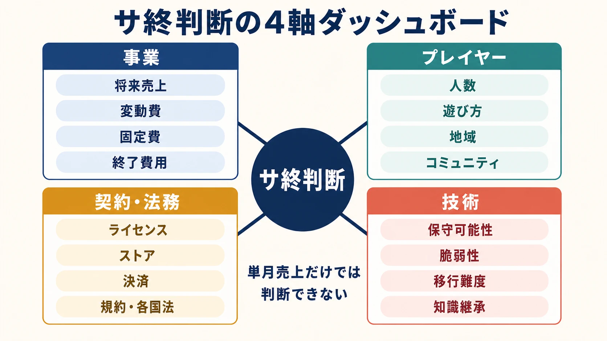
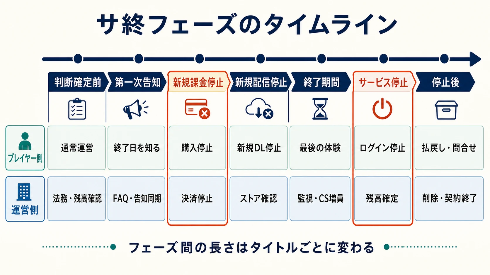
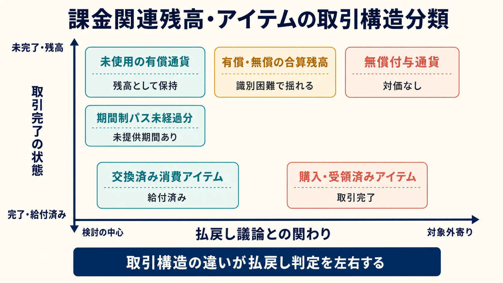
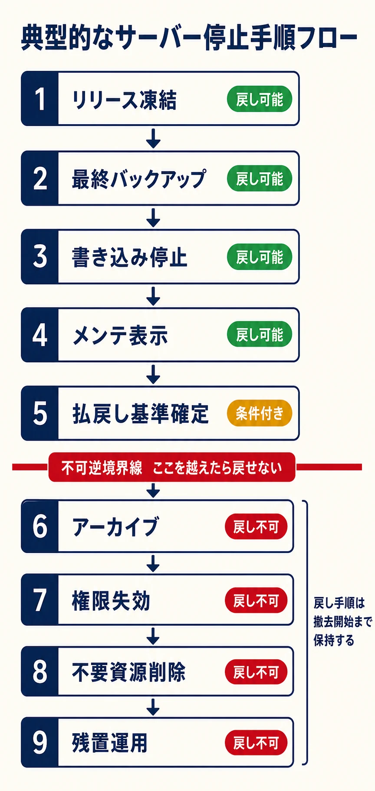
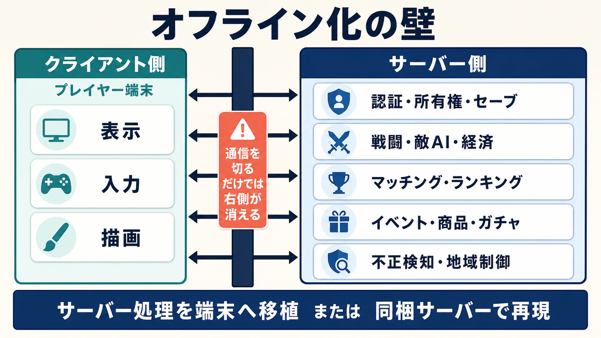
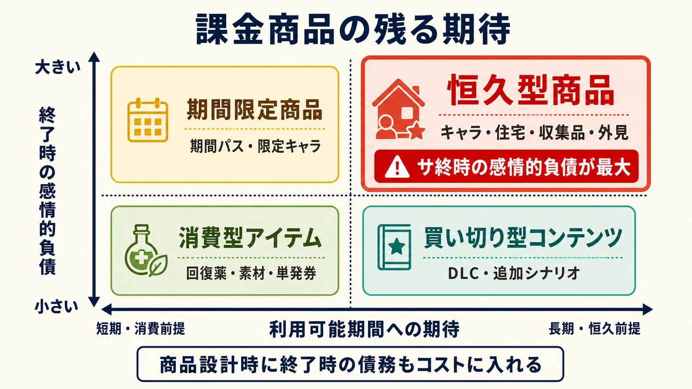

# サービス終了をどう設計するか――オンラインゲームを破綻なく畳む実務

> **注意：** 本記事は法的助言ではありません。具体的な法的判断は、必ず弁護士・法務部門に確認してください。法令は改正されることがあるため、資金決済法、消費者契約法、特定商取引法、景品表示法、個人情報保護法などは最新の条文を参照してください。

## はじめに：サ終は「サーバーの電源を切る日」ではない

ライブサービスやオンライン専用ゲームには、いつか終わりが来る。ここでいうライブサービスとは、発売後もサーバーを運用し、更新やイベントを続けるゲームのことだ。本記事では、その終了を通称に合わせて「サ終」と呼ぶ。

新人プランナーが誤解しやすいのは、 **終了告知を出し、最終日にサーバーを止めれば終わる** という考え方である。実際には、課金停止、未使用残高の処理、問い合わせ、データ削除、契約終了、インフラ撤去が別々の時刻表で動く。

サ終は一つの機能ではない。 **事業・法務・技術・運用・コミュニケーションを束ねる最後のリリース** である。終盤になってから準備すると、残高台帳が分けられない、古いクライアントを更新できない、権利物をオフライン版に残せない、といった問題が一度に噴き出す。

特定の終了期間や施策が、すべてのタイトルに通用するわけではない。規模、契約、地域、プラットフォーム、課金方式によって条件は変わる。本記事では、判断材料と後戻りできない期限を整理する。

---

## なぜサービス終了は起きるのか

ライブサービスは、発売後も費用が発生し続ける。クラウド料金だけではない。監視、障害対応、問い合わせ、決済、不正対策、OS更新、セキュリティ修正、ライセンス更新、ストア審査にも人と予算が要る。

終了判断の材料には、たとえば次がある。

- 売上や粗利が、サーバー費と運用人件費を含む継続費用を下回った
- 継続率、課金者数、同時接続数などのKPIが下がり、回復施策の見込みも薄い
- 楽曲、キャラクター、スポーツ選手、車両、ミドルウェアなどのライセンスが切れる
- 認証、決済、広告、SNS連携、基盤プラットフォームの提供が終わる
- 開発者を次の作品へ移さなければ、会社全体の機会損失が大きくなる
- 古いサーバーやクライアントを安全に保守できなくなる

欧州委員会も、サーバーやライセンス依存の維持費、開発者の再配置などを終了要因として挙げている。また、現代のゲームでは認証、マッチング、ランキング、クラウドセーブ、アンチチートなどが会社側の基盤へ移り、停止がゲーム全体の利用不能につながりやすいと整理している。[[1](#ref-1)]

### 「赤字になったら終了」では決められない

判断が難しいのは、数字が未来予測を含むからだ。大型更新で回復する可能性がある一方、決断を延ばすほど未使用残高や運用債務が積み上がる。

そこで、単月売上だけではなく、次の四つを同じ表に置く。

| 判断軸 | 確認すること | 見落としやすい点 |
|---|---|---|
| 事業 | 将来の売上、変動費、固定費、終了費用 | 払戻し、告知、サポートにも予算が要る |
| プレイヤー | 人数、遊び方、地域、コミュニティ | 人数が少なくても生活の一部になっている場合がある |
| 契約・法務 | ライセンス、ストア、決済、利用規約、各国法 | 契約終了日がサーバー停止日より先に来ることがある |
| 技術 | 保守可能性、脆弱性、移行・オフライン化の難度 | 担当者の退職で知識が消える |

撤退の採算には、終了までの売上だけでなく、 **安全に終えるための費用** を入れる。ここをゼロとして計画すると、最後に品質と誠実さを削ることになる。

---

## 終了日は一本ではない：段階的に畳む

サ終計画では「終了日」ではなく、複数の締切を引く。順序はタイトルごとに変わるが、典型的な流れは次のようになる。

| フェーズ | プレイヤー向けの変化 | 裏側で行うこと |
|---|---|---|
| 判断確定前 | 原則として通常運営 | 法務確認、残高集計、契約棚卸し、停止手順の検証 |
| 第一次告知 | 終了日、対象地域、問い合わせ先を案内 | FAQ、ストア、CS、翻訳、障害時の代替告知を同期 |
| 新規課金停止 | 有償通貨、定期購入、広告商品の販売を止める | 決済導線、予約販売、外部EC、プラットフォーム商品を停止 |
| 新規配信停止 | 新規ダウンロードを止める | 再ダウンロードや最終更新の可否をストアごとに確認 |
| 終了期間 | 最終イベント、データ出力、残高確認を提供 | 負荷監視、問い合わせ増員、不正・荒らし対策 |
| サービス停止 | ログインやオンライン機能を止める | 書き込み停止、最終スナップショット、払戻し基準時点の確定 |
| 停止後 | 払戻し、問い合わせ、公式サイトの案内を継続 | データ保持・削除、契約解約、秘密情報の失効、インフラ撤去 |

ストアで「新規配信を止める」ことと、既存ユーザーの利用や更新を止めることは同じではない。Google Playでは、非公開後も既存ユーザーは利用と更新を続けられる。[[2](#ref-2)] 実際の挙動はストアや契約状態ごとに確認する。

### 先に止めるべきものを決める

終了が決まった後も、長期間使えるように見える高額商品を売り続ければ、プレイヤーの判断と実態がずれる。新規課金停止を先に置くのは、法務対応だけでなく、信頼を守るためでもある。

ただし、販売を一斉に止めることが常に最善とは限らない。残った通貨を使うための商品まで消すと、かえって不利益になる。新規購入は止めつつ、既存残高の消費先は残す、といった分離が必要になる。

---

## 告知は「情報」と「感情」の両方を設計する

終了告知で最も避けたいのは、感謝の長文の中に重要事項が埋もれることだ。最初の画面で、少なくとも次を読めるようにする。

- 何が、いつ、どの地域で終了するか
- 課金、定期購入、新規ダウンロードをいつ止めるか
- 有償残高をどこで確認でき、払戻しの対象や手続をいつ案内するか
- プレイデータ、投稿、フレンド情報、スクリーンショットをいつまで確認できるか
- 問い合わせ窓口と、その提供期間
- オフライン版、データ引き継ぎ、記念施策の有無

日付には時刻とタイムゾーンを書く。「予定」「確定」「変更あり」を混ぜない。公式サイト、ゲーム内お知らせ、SNS、メール、ストア説明、サポートFAQで表現が食い違わないよう、情報源を一つにする。

### 誠実さは、理由の細かさより約束の明瞭さに出る

終了理由をどこまで説明できるかは、取引先や未発表作品などの事情で変わる。伝えるべきなのは、説明可能な範囲の理由、プレイヤーへの影響、今後の時刻表、変更時の連絡方法である。分からないことは「未定」と書き、次の回答日を示す。

### 「最後の体験」は豪華さより、後悔を減らす

終了記念イベント、全キャラクターの開放、過去イベントの再演、記念壁紙、サウンドトラック、プレイ履歴の出力などは、別れを体験に変えられる。一方、最後のランキング競争や高難度イベントは、残り時間の短さやマッチング人口の減少と相性が悪い。

判断軸は「盛り上がるか」だけではない。

- 復帰者が短時間で参加できるか
- 終了間際の障害で達成不能にならないか
- 他者が必要な実績を、減った人口でも解除できるか
- 権利上、配布後もプレイヤーの手元に残せるか

撮影場所を用意するだけでも価値がある。一方、記念品発送のための住所取得は新たな個人情報管理を生む。

---

## 法務・コンプライアンス：終了ボタンより先に確認する

以下は2026年6月27日時点の制度を前提にした一般的な整理であり、個別案件への法的助言ではない。実際の終了では、商品の仕組み、利用規約、販売地域、契約主体をもとに、社内法務や専門家、必要に応じて所管当局へ確認する。

### 有償通貨とアイテムは、同じ箱に入れない

日本では、購入したゲーム内通貨やポイントが、資金決済法上の **前払式支払手段** に当たることがある。前払式支払手段とは、あらかじめ対価を受け取り、記録された金額や数量に応じて商品・サービスの支払いに使える仕組みを指す。名称が「石」「コイン」「チケット」であるかではなく、発行と使用の実態で判断される。[[3](#ref-3)]

金融庁は、前払式支払手段の利用を終了した場合、資金決済法第20条第1項に基づく払戻手続を実施し、ウェブサイトや新聞、店頭などで知らせ、保有者が申出期間内に申し出る流れを案内している。[[4](#ref-4)]

ここで重要なのは、 **「課金に関係したものは全部、同じ方法で現金化する」わけではない** ことだ。

- 購入され、未使用のまま残る通貨やポイント
- キャンペーンで無償付与した通貨
- 有償通貨と無償通貨を合算表示した残高
- 通貨と交換済みの消費アイテム
- 直接購入し、すでに受領・使用されたアイテム
- 月額・期間制パスの未経過分

これらは取引構造が異なる。金融庁の制度導入時の見解でも、アイテムの給付をもって取引が完了する場合と、アイテムの使用ごとにポイントが減る場合を分けて考えている。[[5](#ref-5)] したがって、商品マスタと残高台帳を法務へ渡し、種類ごとに判定する。無償分と有償分を同じ数値でしか保存していない設計は、終了時に大きな調査コストを生む。

実務では、次を早期に固定する。

1. 払戻し判定の基準時刻と、対象残高のスナップショット
2. 有償・無償・購入経路・通貨種別を分けた台帳
3. 告知媒体、申出方法、本人確認、送金方法、問い合わせ窓口
4. 申請エラー、アカウント喪失、相続、海外居住など例外の扱い
5. 集計結果と処理履歴を監査できる記録

アプリを先に更新不能にすると、残高表示や申請フォームを届けられない場合がある。払戻し導線は、サーバー停止手順より前に検証する。

### 利用規約の終了条項は「万能な免責」ではない

利用規約には、サービスの変更・中断・終了条件、告知方法、アカウントやデータの扱い、準拠法などを定める。しかし、終了できると書いてあれば、あらゆる説明や責任が消えるわけではない。消費者契約法は、不当な契約条項の無効などを定めている。[[6](#ref-6)]

企画段階では、終了条項を法務だけの文章にせず、実際の運用と照合する。規約が「公式サイトで告知」と定めるなら、そのサイトを終了後も必要期間維持できるか。事前告知期間を定めるなら、ライセンス終了日から逆算できるか。会社、パブリッシャー、プラットフォームのどこが契約主体で、誰が返金や問い合わせを担当するかも明確にする。

### 景品表示法・特定商取引法との接点

オンライン販売は、特定商取引法上の通信販売に該当し得る。消費者庁は、通信販売の広告について、価格、支払時期・方法、提供時期、解除条件、事業者情報などの表示と、誇大広告の禁止を案内している。[[7](#ref-7)]

景品表示法は、商品・サービスの内容や価格などを、実際より著しく優良または有利に見せる表示を禁じている。[[8](#ref-8)] 終了決定後の販売画面やキャンペーンが、利用可能期間や価値を誤認させないかを確認する。これは「サ終すると景品表示法違反になる」という意味ではない。何をいつまで利用できるかという実態と、広告・ストア・ゲーム内表示が一致しているかが論点になる。

### 個人情報は「全部残す」でも「即日全削除」でもない

アカウント情報、課金履歴、問い合わせ、チャットログ、端末識別子、行動ログは、同じ日に同じ理由で消せるとは限らない。払戻し、会計、税務、不正調査、紛争対応などのため、一定期間の保持が必要になる場合がある。

個人情報保護委員会は、個人情報保護法が一律の保存期間や廃棄時期を定めているわけではない一方、利用する必要がなくなった個人データは遅滞なく消去するよう努めるとしている。[[9](#ref-9)] また、消去する際は復元不可能な手段を用い、外部委託時は委託先を適切に監督する必要があると注意喚起している。[[10](#ref-10)]

そこで、データ項目ごとに次を記した **保持・削除台帳** を作る。

| 項目 | 記録する内容 |
|---|---|
| 保持目的 | 払戻し、法定保存、問い合わせ、不正対策など |
| 保持期限 | 起算日、期間、延長条件 |
| 保存場所 | 本番DB、バックアップ、ログ基盤、委託先 |
| アクセス権 | 閲覧できる担当と承認手続 |
| 削除方法 | 論理削除、物理消去、匿名化、媒体廃棄 |
| 証跡 | 実施者、実施日、対象、例外、確認結果 |

本番DBだけ消しても、バックアップ、分析基盤、サポートツール、表計算への出力に複製が残る。逆に、ゲーム保存を目的としたアーカイブに、プレイヤーの個人データまで入れる必要はない。ゲーム資産の保存とユーザーデータの保持を分ける。

海外展開では、GDPRを含む各地域の個人情報・消費者保護・デジタルコンテンツに関する規制を確認する。たとえばEUの案内では、個人データを必要以上に長く保持しない原則や、一定条件で削除を求める権利が示されている。[[11](#ref-11)] 日本向け手順を翻訳するだけでは足りず、販売国、契約主体、データの保存国、年齢層ごとに法務マトリクスを作る。

---

## 技術と運用：止める順序をリハーサルする

サーバー停止は、インスタンスを削除する作業ではない。必要な記録を残しつつ、安全に閉じる必要がある。

典型的な停止手順は次のようになる。

1. リリース、商品マスタ、残高変換、イベント設定の変更を凍結する
2. 終了直前のバックアップを取り、復元テストを行う
3. 購入、ギフト、取引所、ランキングなど終了影響の大きい書き込みを順に止める
4. メンテナンス表示へ切り替え、セッションを安全に終了する
5. 払戻し基準となる残高と処理中取引を確定する
6. 必要なデータ、ログ、ソース、ビルド手順、設定、DBスキーマをアーカイブする
7. APIキー、証明書、管理者アカウント、委託先権限を失効する
8. 保持対象を隔離し、不要なDB、ログ、バックアップ、クラウド資源を削除する
9. 公式サイト、払戻し、問い合わせ、監視だけを必要期間残す

  

終了リハーサルでは、本番データのコピーを安全な環境で使い、「最終時刻の直前に購入した」「決済は成功したが付与が遅れた」「複数端末でログイン中」といった境界条件を試す。停止後に再起動できる **戻し手順** も、撤去を始めるまでは用意しておく。

### 人口減少は、停止日より前にゲームを壊す

対戦や協力プレイでは、告知後に人口が減り、待ち時間と実力差が広がる。サーバーが動いていても、遊びが成立しなければ体験上はすでに終わっている。

対策には、リージョンやプレイリストの統合、期間限定モードの整理、必要人数の緩和、NPC補充、時刻を決めた集中マッチ、ランキング条件の変更などがある。ただし統合は遅延や言語差を生み、NPCは競技性を変える。実績条件を変えれば公平性への異論も出る。

大切なのは、全部の機能を薄く残すことではない。 **最後まで成立させる体験を選び、それ以外を早めに閉じる** という判断である。

### オフライン化は「通信を切る」だけではできない

オンライン専用ゲームでは、クライアントが見た目と入力だけを担当し、次の処理をサーバー側に置くことがある。

- ログイン、所有権、セーブデータ
- 戦闘判定、敵AI、ドロップ、経済
- マッチング、ランキング、ギルド、チャット
- イベント時刻、商品マスタ、ガチャ結果
- アンチチート、不正検知、年齢・地域制御

この場合、認証を外すだけでは遊べない。サーバーの処理をクライアントへ移すか、小型のローカルサーバーを同梱し、UI、セーブ、バランス、権利物まで作り直す必要がある。さらに、第三者ライセンス、個人情報、チートコード化される秘密情報、未修正の脆弱性も問題になる。

| 残し方 | 長所 | 主な難しさ |
|---|---|---|
| オフライン版 | 一人でも遊びやすい | サーバー処理の移植と再QAが重い |
| 専用サーバー配布 | マルチプレイを残せる | セキュリティ、運用知識、ライセンスの整理が要る |
| P2P化 | 公式サーバー費を抑えられる | NAT越え、ホスト不正、切断、個人情報の課題がある |
| 閲覧・記念版 | キャラクターや物語を残しやすい | 「遊べる保存」にはならない |
| データ出力 | 思い出や記録を持ち出せる | 他のゲームで使える資産にはならない |

---

## ゲーム保存をめぐる動き：2026年6月時点

オンライン依存によって購入済みゲームまで遊べなくなる問題に対し、プレイヤー側では「Stop Killing Games」キャンペーンと、それに連なる欧州市民イニシアチブ「Stop Destroying Videogames」が進んだ。

欧州委員会の2026年6月16日付回答によれば、このイニシアチブは129万4,188件の有効な支持を得て審査対象となった。委員会は、販売・ライセンスされたゲームを終了後もプレイ可能にする一般的な法的義務の提案は比例的でないとして見送った。一方で、既存の消費者保護には透明性や契約適合性、救済の枠組みがあると整理し、2026年末までに業界・消費者側との対話を始め、ゲームの終末期に関する自主規範の可能性を探るとしている。[[1](#ref-1)]

つまり、運動がそのまま法制化されたわけでも、議論が終わったわけでもない。注目すべきは、サ終が企業内部の採算判断だけでなく、消費者への表示、購入物への期待、文化保存、知的財産、セキュリティの調整問題として公的に議論されていることだ。

保存は「サーバーを永久運営する」ことと同義ではない。オフライン版、専用サーバー、文化機関への資料提供、ビルドや設計資料の保管など、残せる層は複数ある。何を公開できないかではなく、何なら残せるかを分解して検討する。

---

## 始める前に終わりを設計する

サ終の負担を大きく左右するのは、終了発表後の頑張りより、開発初期の構造である。企画書や技術設計に、 **出口戦略** を一ページ持つ。

### 1. 終了モードへ切り替えられる構造にする

- 認証、課金、ソーシャル機能と、コアゲームを疎結合にする
- 有償・無償残高、購入経路、付与理由を台帳で分ける
- サーバーの設定値がなくても、最低限のローカル設定で起動できるようにする
- 最終ビルドを再生成できるソース、依存物、署名、手順を保管する
- 課金停止、読取専用、最終イベント、メンテナンスの各モードを用意する
- データ出力とアカウント削除を、平常時から試せるようにする

オフライン版を必ず作るという意味ではない。後から見積もれる境界を作る。完全なオンラインゲームでも、物語閲覧、キャラクタービューア、ローカル戦闘など一部だけ残せる場合がある。

### 2. 契約に「終了後」を入れる

楽曲、ボイス、実在ブランド、ミドルウェア、フォント、サーバーSDKの契約時に、サービス中だけでなく次を確認する。

- ストアからの再ダウンロードをいつまで認められるか
- オフライン版や記念版に収録できるか
- 文化保存機関へ非公開で寄託できるか
- 続編、移植、別プラットフォームで資産を再利用できるか
- 契約終了後も保管すべきデータと、削除すべきデータは何か

権利切れの直前に交渉を始めると、選択肢も交渉力も減る。

### 3. 課金商品の「残る期待」を考える

消費型アイテムは使えば役目を終えやすい。恒久キャラクター、住宅、コレクション、高額な外見資産は、長く所有できる期待を生みやすい。だから恒久型を売るな、という結論ではない。商品の価格、利用可能期間の期待、サービス依存度、終了時に残せる形をセットで審査する。

終了リスクを下げる選択肢には、販売終了を早める、利用期限を明瞭にする、買い切りコンテンツをローカルに残す、プレイヤーが記録を出力できるようにする、といった方法がある。売上だけでなく、終了時の債務と感情的な期待も商品設計のコストに含める。

### 4. IPと資産の再利用は、プレイヤーデータの移行と分ける

続編への称号や外見の引き継ぎは強い感謝になる。しかし、旧作のDBをそのまま持ち込めるとは限らない。本人同意、利用目的、子どものデータ、退会済みユーザー、権利切れ資産を確認する。引き継げない場合は記念コードなど別の道もある。IPを残すことと、個人データを残すことを混同しない。

---

## まとめ：終わり方もゲームの一部である

サービス終了は、必ずしも作品の失敗を意味しない。成功したゲームでさえ、永遠には運用できない。

それでも、終わり方は選べる。

- 採算だけでなく、終了費用とプレイヤーへの影響を含めて判断する
- 告知日、課金停止日、配信停止日、サービス停止日、払戻し・削除期限を分ける
- 有償残高、規約、表示、個人情報を商品・地域ごとに確認する
- 停止と復旧をリハーサルし、必要な記録を残してから安全に撤去する
- 最後まで成立させる体験を選び、思い出を持ち出す道を用意する
- 開発初期から、オフライン化、権利、台帳、データ削除という出口を設計する

プレイヤーは、終了後にどう扱われたかを覚えている。その誠実さは、次の作品へもう一度お金と時間を預けるかという判断に残る。

サ終は運用の外側にある事故ではない。 **ライブサービスを始める時点から設計すべき、運用の最終工程** である。

---

## References

1. [Communication from the Commission on the European Citizens' Initiative “Stop Destroying Videogames”][1] - 欧州委員会が、オンライン依存ゲームの終了要因、技術・権利上の論点、既存の消費者保護、2026年6月時点の結論と今後の自主規範検討を整理した公式回答。

2. [Update or unpublish your app][2] - Google Playにおけるアプリの非公開化と、既存ユーザーの利用・更新の扱いを説明した公式ヘルプ。

3. [FinTechサポートデスクについて][3] - 金融庁が、前払式支払手段の基本的な定義と、自家型・第三者型の区分を説明した公式FAQ。

4. [商品券（プリペイドカード）の払戻しについて][4] - 金融庁が、資金決済法第20条第1項に基づく利用終了時の払戻手続と周知、申出期間の考え方を案内したページ。

5. [「資金決済に関する法律」等の施行に伴う政令案・内閣府令案等に対するパブリックコメントの結果等について][5] - 金融庁が、オンラインゲームのアイテム給付やポイント減算など、前払式支払手段の該当性に関する考え方を示した資料。

6. [消費者契約法][6] - 消費者庁が、不当な勧誘による契約の取消しや不当な契約条項の無効など、消費者契約法の制度概要を説明したページ。

7. [通信販売｜特定商取引法ガイド][7] - 消費者庁が、通信販売における広告表示、誇大広告の禁止、最終確認画面などの規制概要を説明したページ。

8. [表示規制の概要][8] - 消費者庁が、景品表示法における優良誤認表示と有利誤認表示の考え方を説明したページ。

9. [取得した個人情報は、いつ廃棄しなければなりませんか。][9] - 個人情報保護委員会が、一律の保存期間は定められていないことと、利用不要後の遅滞ない消去の努力義務を説明したFAQ。

10. [データの消去に関する注意喚起][10] - 個人情報保護委員会が、復元不可能な手段による消去と、消去業務の委託先監督を案内した注意喚起。

11. [Data protection explained][11] - 欧州委員会が、GDPRにおける保存期間の制限や消去権など、個人データ保護の原則と権利を説明したページ。

[1]: https://citizens-initiative.europa.eu/document/download/75d642bc-6ff5-4713-b1cf-14f4aaf15869_en?filename=C_2026_4110_EN.pdf
[2]: https://support.google.com/googleplay/android-developer/answer/9859350?hl=en-GB
[3]: https://www.fsa.go.jp/news/27/sonota/20151214-2.html
[4]: https://www.fsa.go.jp/policy/prepaid/
[5]: https://www.fsa.go.jp/news/21/kinyu/20100223-1.html
[6]: https://www.caa.go.jp/policies/policy/consumer_system/consumer_contract_act/
[7]: https://www.no-trouble.caa.go.jp/what/mailorder/
[8]: https://www.caa.go.jp/policies/policy/representation/fair_labeling/representation_regulation/
[9]: https://www.ppc.go.jp/all_faq_index/faq1-q5-2/
[10]: https://www.ppc.go.jp/news/careful_information/data_syokyo
[11]: https://commission.europa.eu/law/law-topic/data-protection/reform/what-personal-data_en

----

この文書は、Perplexity、Claude、OpenAI Codex の3つのAIの支援を受けて著述されたものです。引用画像を除き、MIT License にて提供されています。
