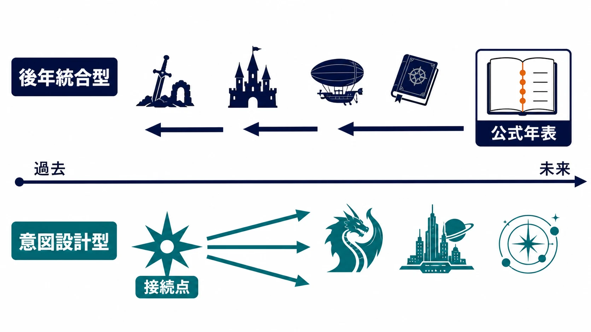
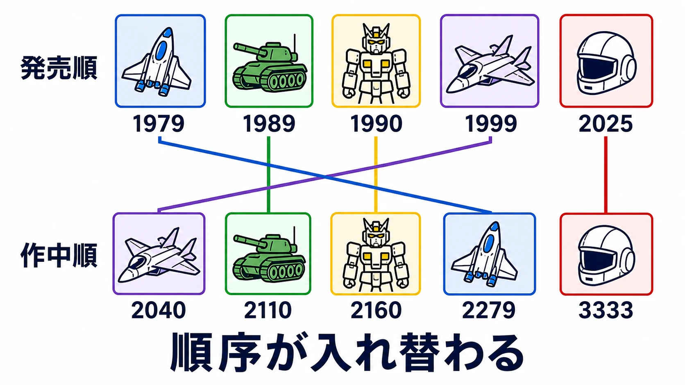
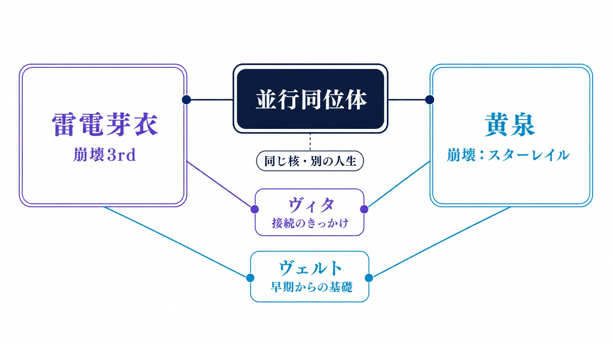

# 作品世界を「つなぐ」設計――UGSFと『崩壊3rd』×『崩壊：スターレイル』から考える、後年統合型と意図設計型

複数タイトルを展開するIPでは、作品同士をつなぐこと自体が目的ではない。新作だけでも満足して遊べる入口を守りつつ、既存プレイヤーには「あの要素がここにつながるのか」と発見できる余白を渡す。その余白が、タイトルをまたぐ心理的な結びつきを生む。

『崩壊』シリーズには『崩壊学園』、『崩壊3rd』、『崩壊：スターレイル』があり、『崩壊：ネクサスアニマ』も公式サイトでテスト参加者を募集している。[[1](#ref-1)][[2](#ref-2)] 本稿はシリーズ全体の接続を網羅するものではなく、作品間のコラボレーションと制作陣の説明が公に確認できる『崩壊3rd』と『崩壊：スターレイル』を、意図設計型の事例として取り上げる。

この設計には大きく二つの型がある。ひとつは、個別に育った作品群の共有設定を後年に公式化し、歴史として読み直せるようにする **後年統合型** である。もうひとつは、将来の横断展開を見越して、キャラクターや設定を初期から接続点として配置する **意図設計型** である。

前者の好例がバンダイナムコエンターテインメントのUGSFシリーズであり、後者の好例が『崩壊3rd』と『崩壊：スターレイル』の関係である。両者を手がかりに、複数のゲームをどの時点で、どの強さでつなぐかという企画判断を考える。

***

## 二つの型は「設定を作った時期」ではなく「公式の約束を置く時期」で分かれる

ここでいう後年統合型は、何もないところから設定を作り、過去作へ一方的に付け足す手法だけを指すものではない。開発者の間にあった暗黙の共有設定や、作品内に点在していた接点を、後からプレイヤーにも読める公式の約束へ変える手法である。

一方の意図設計型は、新作の企画段階で「将来、どの作品と、どの程度つながり得るか」を考え、接続の根を先に置く手法である。ただし、将来の展開をすべて固定することとは異なる。独立した一作として成立させながら、接続できる選択肢を残すことが要点になる。

| 観点 | 後年統合型 | 意図設計型 |
| --- | --- | --- |
| 接続を公式化する時期 | 作品群が蓄積した後 | 新作・シリーズ構想の早期 |
| 主な資産 | 過去作の設定、意匠、プレイヤーの記憶 | キャラクター、用語、将来の横断導線 |
| 強み | 多様な既存資産を掘り起こせる | 新作への導線と整合をあらかじめ設計できる |
| 主なリスク | 年表や設定の齟齬、無理な回収 | 未来の展開を縛り、新規プレイヤーの負担になること |
| 向くポートフォリオ | 長年の独立作・異ジャンル作品が多い場合 | 統一ブランドの連作を継続的に出す場合 |

***

## UGSF――暗黙の共有設定を、遊べる年表へ変える

UGSFはUnited Galaxy Space Force、すなわち銀河連邦宇宙軍を軸に、旧ナムコ作品をつなぐ設定群である。公式サイトは、従来の作品に見られた共有設定をクリエイター間の「暗黙の共通世界」と説明している。1990年の『ギャラクシアン³』でUGSFという設定が生まれ、スペースシューティング以外にも接続が広がった。パズルゲームの『ミスタードリラー』では、ジャンルを飛び越えて『ディグダグ』『バラデューク』への接続が明かされている。一方、未発売に終わったプロトタイプ作品『スターブレード オペレーション・ブループラネット』や『ニュースペースオーダー』では、『エースコンバット3 エレクトロスフィア』との作品世界の共有が示唆されるにとどまっている。[[3](#ref-3)]

この関係をプレイヤー向けに明文化した節目が、2011年9月2日のUGSFシリーズ公式サイト公開である。公式サイト自身が「暗黙の元に設定されていたUGSF世界」を初めて公に整理し、年表上の整合性をとった目的を掲げた。公開時には、『ギャラクシアン』、『ギャラガ』、『スターブレード』だけでなく、『ミスタードリラー』や『スタートリゴン』なども年表へ並んだと報じられている。[[4](#ref-4)]

年表の起点は、1979年にアーケードで発売された『ギャラクシアン』である。現在の公式年表は2025年発売の『シャドウラビリンス』までを収録し、作品の発売順ではなく、UGSF内の歴史としてタイトルを読み直せるようにしている。[[5](#ref-5)]

重要なのは、UGSFが齟齬を隠していない点である。公式サイトは、後からUGSFに組み込まれた作品には設定上の齟齬があり得ること、今後も年表の追加・修正が起こり得ることを明記し、その後付けをシリーズの特徴としている。[[3](#ref-3)] これは設定資料集の完全性を約束するよりも、発見の場を継続して提供する選択だと読める。

*図：上段は発売年順、下段はUGSF HISTORYの掲載順から抜粋した作中順。同じ色のカードは同じ作品を表し、交差する線が順序の入れ替わりを示す。*

プランナーの観点では、後年統合型の価値は「過去作を同じ物語に回収すること」そのものではない。発売年代も遊びも異なる作品を、プレイヤーが自分でたどり直せる索引に変えることにある。個別作品の独立性を損なわず、長く蓄積された意匠や名称に新しい読み方を与えられる。

***

## 『崩壊』シリーズから取り上げる『崩壊3rd』×『崩壊：スターレイル』――接続を前提に、独立性も残す

『崩壊3rd』日本版は2017年2月16日にサービスを開始した。[[6](#ref-6)] その後に始まった『崩壊：スターレイル』との関係について、両作のシナリオ制作陣は2024年11月28日公開のインタビューで、かなり早い段階から両作の作品世界を結び付けられないか考えていたと説明している。[[7](#ref-7)]

具体的な接続点として、制作陣はヴェルトを「両作を結びつける基礎」としてプロジェクトの非常に早い段階から考え、『崩壊：スターレイル』へ意図的に登場させたと述べた。さらに、コラボレーションの実制作では『崩壊3rd』のヴィタが、二つの作品世界を結び付ける状況に設定上適したキャラクターとして選ばれている。[[7](#ref-7)]

この型の特徴は、接続そのものと同時に、各タイトルの独立性を設計していることにある。制作陣は、並行同位体という仕組みをシリーズ立ち上げ当初から、作品を超えてつながる大きなIPを表すために構想していたと説明する。同位体は、同じキャラクターの核を思わせながらも、作品ごとに別の人生を与える。たとえば『崩壊3rd』の雷電芽衣と『崩壊：スターレイル』の黄泉は別の人物として描かれ、既知の人物像をそのまま再利用しない。[[8](#ref-8)]

キアナ、芽衣、ブローニャのようにシリーズ初期から育ててきた人物群は、このスターシステム的な構造の手がかりになる。制作陣は、中心人物の空白性と純粋さを大切にしてきたからこそ、後続作品でも同位体として別の可能性を表現できたと語る。『崩壊3rd』と『崩壊：スターレイル』の間では、見慣れた顔や名前を答え合わせの報酬にしながら、新しいプレイヤーには別の人物として受け入れられるようにする設計である。[[8](#ref-8)]

『星神（アイオーン）』のような語も、両作のつながりを予感させる単語の一例として、ファミ通の記事とインタビュー記事の編集部の双方が挙げている。[[6](#ref-6)][[9](#ref-9)] ただし、この種の用語だけを作品間の直接的な接続の証拠とみなすべきではない。制作陣が明言した根拠は、ヴェルト、ヴィタ、並行同位体、そして早期からのシリーズ構想である。考察を誘う記号と、公式に設計された接続点を分けて扱うことが、長期IPを読むうえでも企画を説明するうえでも重要になる。

実際、制作陣は「ひとつの作品しか遊んだことがない」プレイヤーにも負担をかけずにコラボを楽しんでもらうことを原則に挙げている。[[7](#ref-7)] これは横断設計の実務上の核心である。過去作を知る人には発見の密度を上げ、知らない人には本筋を欠かせないものにしない。接続は履修条件ではなく、理解が深まる追加報酬として置くべきである。

***

## なぜ「つながり」は横断ロイヤルティを強めるのか

二つの型は接続の作り方こそ異なるが、プレイヤーに渡す体験は似ている。それは、自分の記憶や知識が新作で意味を持つという感覚である。

第一に、接続点は探索の問いを生む。年表に見覚えのある作品名を見つける、あるいは新作に既知の人物像の変奏を見る。この小さな不一致や一致が、「どこまでつながるのか」という自発的な調査を促す。プランナーが用意するのは答えの一覧ではなく、プレイヤーが確かめたくなる問いである。

第二に、横断体験は過去のプレイ時間を無駄にしない。UGSFでは古い作品の記憶が公式年表を通じて別の位置を得る。本稿で取り上げる『崩壊3rd』と『崩壊：スターレイル』では、既知の人物の「別の可能性」が新作の人物理解を豊かにする。これはアイテムや通貨の共有ではなく、プレイヤーが蓄えた理解を再利用できる設計である。

第三に、接続は次のタイトルへ移る心理的な橋になる。ただし、これは新作の購入や継続を直接保証する仕掛けではない。ゲームとして単体で面白いことが前提であり、その上で「知っているものの続きがある」「まだ知らない側にも手がかりがある」という感覚が、横断する理由を一つ増やす。ロイヤルティは囲い込みではなく、選び直せる関心の積み重ねとして強くなる。

***

## 実務では、ポートフォリオから型を選ぶ

後年統合型と意図設計型の優劣は、作品群の性質で決まる。判断を誤ると、前者は苦しい整合性合わせになり、後者は未確定の新作を過去の約束で縛る。

| 判断項目 | 後年統合型を選びやすい条件 | 意図設計型を選びやすい条件 |
| --- | --- | --- |
| 保有するタイトル | 独立制作の歴史が長く、ジャンルやプラットフォームが多様 | 共通ブランドで新作を継続的に企画している |
| 使える接続資産 | 共通の意匠、名称、設定の断片、開発者の共有認識がある | 横断の核にできる人物、組織、事件、テーマを初期から置ける |
| 将来の確度 | 新作計画は流動的で、まず既存資産の価値を高めたい | 複数タイトルの展開方向と運営期間をある程度見通せる |
| プレイヤーへの約束 | 年表や資料で探索の場を提供する | 単体で完結する新作に、将来の接続余地を残す |

どちらを選ぶにしても、最低限の運用設計がいる。接続要素ごとに「確定した事実」「示唆にとどめる事実」「まだ公開しない余白」を記録する設定台帳を持つこと、矛盾の扱いと修正権限を決めること、新規プレイヤーが接続を知らなくても主筋を楽しめるかをレビューすること。この三つがなければ、気づきの快感は単なる内輪の暗号になりやすい。

UGSFは、多様な既存資産を年表という読み解きの装置でつなぎ直した。『崩壊3rd』と『崩壊：スターレイル』は、早期に置いた人物と同位体の構造で、新作の独立性を保ちながら横断の余地を作った。自社の作品群が独立ジャンルの蓄積なら、まず掘り起こして公式化する後年統合型が合う。統一ブランドの連作なら、未来の接続点を企画段階から設計する意図設計型が合う。

作品世界をつなぐ設計は、巨大な共通年表を作ることではない。プレイヤーが一作を遊び終えた後、別の一作へ向かう理由を、押しつけずに残しておくことである。

## References

1. [美少女・萌えゲーム／アプリ「崩壊学園」公式サイト][1] - 『崩壊学園』の公式サイトと更新情報。

2. [『崩壊：ネクサスアニマ』公式サイト][2] - 『崩壊：ネクサスアニマ』の公式サイトにおける進化テスト参加者募集。

3. [UGSFシリーズ 公式サイト「UGSF（UNITED GALAXY SPACE FORCE）」][3] - UGSFの成り立ち、暗黙の共有設定、後から組み込んだタイトルと設定上の齟齬に関する公式説明。

4. [バンダイナムコ、UGSFシリーズ公式サイトを公開。銀河連邦公式年表がついに明らかに][4] - 2011年9月2日の公式サイト公開と、当時年表に収録されたタイトルを報じたGAME Watchの記事。

5. [UGSFシリーズ 公式サイト「UGSF HISTORY」][5] - 『ギャラクシアン』の1979年アーケード発売と、『シャドウラビリンス』の2025年発売・年表収録を確認した公式年表。

6. [『崩壊3rd』日本版サービスが開始した日][6] - 2017年2月16日の日本版サービス開始日を確認したファミ通.comの記事。

7. [「崩壊」シリーズ シナリオ制作陣インタビュー（1）][7] - HoYoverseとのタイアップ記事。『崩壊3rd』と『崩壊：スターレイル』を結び付ける早期構想、ヴェルト、ヴィタ、単独作品のプレイヤーへの配慮についての制作陣発言。

8. [「崩壊」シリーズ シナリオ制作陣インタビュー（2）][8] - 並行同位体、スターシステム的な構造、雷電芽衣と黄泉の関係についての制作陣発言。

9. [「崩壊」シリーズ シナリオ制作陣インタビュー（3）][9] - シリーズ全体の設定を早期から編んできたという制作陣発言と、編集部が接続を予感させる語の例として挙げた「星神」への言及。

[1]: https://www.mihoyo.co.jp/
[2]: https://hna.hoyoverse.com/ja-jp
[3]: https://ugsf-series.com/about.html
[4]: https://game.watch.impress.co.jp/docs/news/474884.html
[5]: https://ugsf-series.com/
[6]: https://www.famitsu.com/article/202602/65804
[7]: https://news.denfaminicogamer.jp/interview/241128h
[8]: https://news.denfaminicogamer.jp/interview/241128h/2
[9]: https://news.denfaminicogamer.jp/interview/241128h/3

----

この文書は、Perplexity、Claude、OpenAI Codex の3つのAIの支援を受けて著述されたものです。引用画像を除き、MIT License にて提供されています。
