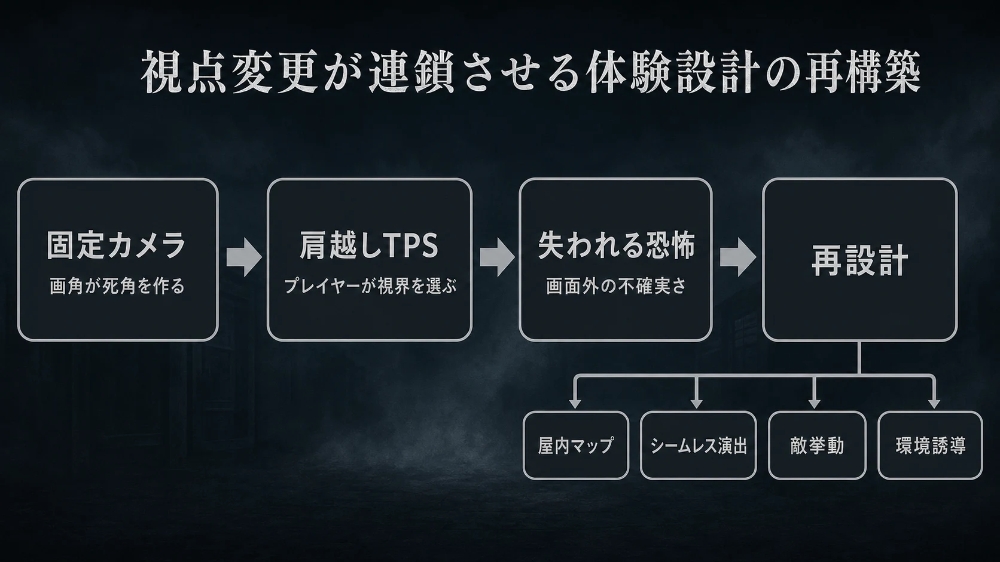
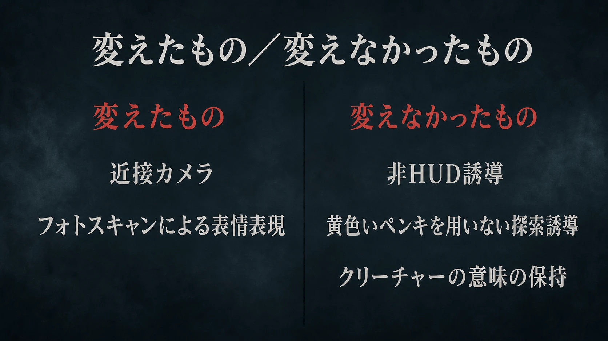
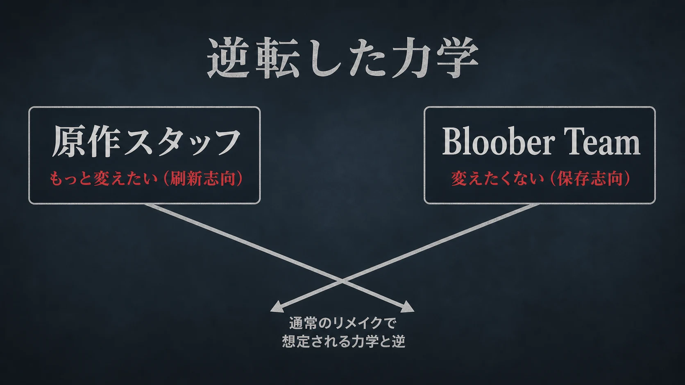

# 『サイレントヒル2』は、なぜカメラを変えるだけでは済まなかったのか――視点変更が連鎖させた体験設計の再構築

> ⚠️ **ネタバレ注意** ⚠️
>
> 本稿は『サイレントヒル2』および『SILENT HILL 2』の物語の核と、クリーチャー表現が担う意味に触れる。未プレイで内容を知りたくない読者は、先に作品を遊ぶことを推奨する。

『サイレントヒル2』は、2001年9月27日にコナミがPlayStation 2向けに発売した作品である。亡き妻メアリーからの手紙を受け取ったジェイムスが、思い出の街サイレントヒルを歩く。[[1](#ref-1)] 2024年10月8日には、ポーランドのBloober Teamが開発を手掛けたフルリメイク『SILENT HILL 2』がPlayStation 5とPC（Steam）向けに発売された。スタンダードエディションは8,580円、ダウンロード版限定のデラックスエディションは9,790円である。[[2](#ref-2)]

この比較を「映像がきれいになった」「戦闘が現代的になった」という機能表で済ませると、重要な設計判断を取り逃がす。リメイクの起点は、固定カメラを軸とした見下ろし寄りの画面構成から、肩越しの三人称視点（TPS）へ移したことである。カメラは単なる表示装置ではない。プレイヤーが見られる範囲、敵と遭遇する予測、部屋を歩く速さ、アイテムの見つけ方、そして「自分の知らないところに何かがいる」という恐怖の作り方を決める。

実際にBloober Teamは、肩越し視点の採用によって戦闘と一部の演出を作り直す必要があると、発表時点で説明していた。[[3](#ref-3)] 本稿では、視点変更を中心の仕様変更と見なし、そこからマップ、演出、敵、誘導へ何が連鎖したかを読む。

***

## 1. 原作は、見せないことでジェイムスの内側を画面に置いた

### 固定カメラは、視界の欠落を設計した

原作のカメラは、常に真上から見下ろすだけではない。廊下を斜めから切り取る、人物を画面端へ追い込む、天井近くから室内を見せるといった固定的なフレーミングを軸にしている。プレイヤーはジェイムスを動かせても、どこまで見せるかを常に決められるわけではない。

この制約は、情報を隠すためだけの仕掛けではない。次の角の先を見通せないこと、画面外の音に振り向けないこと、クリーチャーを正面から観察し続けにくいことが、街の不確かさを保つ。プレイヤーはジェイムスを操作しているが、彼の理解を越えたものを自在に把握できない。その不自由さが、主人公とプレイヤーの認知を近づける。

常時表示の体力ゲージや目的地マーカーも、原作では前面に出ない。地図を開く動作やジェイムスの反応を通して、情報を世界の中へ寄せる。これは情報をゼロにする設計ではなく、「生存に必要な情報を、HUD（画面に常時表示する情報）ではなく身体・環境・音から読む」設計である。画面の余白が大きいからこそ、ラジオノイズ、足音、暗い通路の奥が先に意識へ届く。

### 霧、パズル、クリーチャーを別々の仕掛けにしない

深い霧は遠景を覆い、街の輪郭と進行先をあいまいにする。一方で、霧は単なる視程制限ではない。リメイクに参加した原作コンセプトアーティストの伊藤暢達氏は、霧がジェイムスの記憶や心境を表すための重要な要素であると説明している。[[4](#ref-4)] 恐怖を作る視覚効果と、主人公の心理を語る表現を同じ一層に重ねている点が重要である。

パズルにも同じ姿勢がある。鍵と扉の対応を現実の利便性だけで説明せず、不釣り合いな物品、奇妙な詩句、場所の記憶を通して進行させる。常識的な因果から少し外れた解き方は、プレイヤーを一度立ち止まらせる。合理的な脱出ではなく、ジェイムスの見ている不穏な街を読み解く行為へ探索を寄せるためである。

クリーチャーも、戦闘難度を上げる敵の種類ではない。伊藤氏は、原作でバトルデザインの優先度を下げ、ストーリー、ゲームプレイの体験、道のりを重視したと振り返る。そのうえで主人公の感情を台詞で語らず、霧とクリーチャーの象徴性で表現することに力を入れたと述べている。[[5](#ref-5)] つまり原作の恐怖は、カメラ、非HUD、霧、解きにくいパズル、異形の敵を別部門の特色として並べたものではない。ジェイムスが自分の過去を直視できない状態を、プレイヤーの視界と手触りへ分散させた設計である。

***

## 2. 視点を自由にした瞬間、固定カメラが担っていた仕事が消える

肩越しTPS視点では、プレイヤーが右スティックで周囲を確かめられる。原作の固定カメラが自動的に作っていた死角、フレーム外からの出現、画面構図による距離感は、そのままでは成立しない。自由な視点は没入感を増す一方で、「見えないから怖い」を弱めうる。

リメイク版の課題は、固定カメラの画角を模倣することではなかった。自由に見回せるプレイヤーへ、別の方法で不安定な情報量を渡すことである。これが、視点変更が他の仕様を連鎖的に作り替える理由になる。

### 屋外を残し、屋内を一新する

「全マップを広げた」と表現すると実態を見誤る。Bloober TeamのクリエイティブディレクターMateusz Lenart氏によれば、東地区など序盤の屋外は原作から大きく変えていない。対して屋内は、肩越し視点で探索しがいがあり、面白くなるよう一新したという。[[4](#ref-4)]

この差は合理的である。屋外は霧と長い歩行が支配する空間であり、視界を自由にしても「遠くが見えない」という核を保ちやすい。反対に屋内は、固定カメラの一画面、一扉ごとの切り替え、狭い通路の画角が探索のリズムを決めていた。肩越し視点へ変えるなら、通路の幅、曲がり角、遮蔽物、部屋の出入口、視線の抜けを、プレイヤーが自分でカメラを動かす前提で設計し直さなければならない。

部屋の移動をシームレスにしたことも、この設計と切り離せない。原作では扉を開けて室内へ入るときにロード画面が挿入されたが、リメイクでは連続して移動できる。それに合わせ、恐怖演出も移動が途切れない前提で再構築された。[[4](#ref-4)] ロード画面の撤廃は待ち時間の改善ではなく、扉を安全な区切りにしていた体験の作り直しなのである。

### 敵を見せ直し、操作側にも回避を渡す

自由視点は敵を見つけやすくし、ジェイムスをより能動的な戦闘者にする。原作と同じ挙動の敵をそのまま置けば、戦闘は予測可能になり、恐怖より処理が先に立つ。そこでリメイクは、敵そのものを「見えるから対処できる」相手に固定しなかった。

マネキンはプレイヤーの視界から外れると隠れ、飛びかかる。ライングフィギュアは地上を這うだけでなく、立ち上がって飛び道具で攻撃する。各クリーチャーへ複数の挙動を持たせ、次の行動を読みにくくすることで、自由カメラの情報優位を崩している。[[4](#ref-4)] これは敵AIを豪華にするためではなく、固定カメラがかつて自動で作っていた「見失い」を、行動の不確実さとして作り直す判断である。

一方で、敵だけを強くすれば理不尽になる。リメイクはジェイムスに回避を新設し、プレイヤーへ危機から離脱する操作も渡した。肩越しTPS化によって増えた照準と移動の自由度に対し、敵の攻撃手段と主人公の防御手段を同時に組み替えている。[[6](#ref-6)] 片方だけを近代化しないことが、戦闘をアクションゲーム化しすぎず、緊張を残す条件になる。

***

## 3. 現代化したものと、現代化しなかったもの

### 変えたもの：身体に近い画面と、表情を担う顔

カメラの距離が縮まると、ジェイムスの背中、通路の奥、敵との距離、登場人物の顔が、以前より直接的に目へ入る。リメイクは俳優の顔をフォトスキャンし、フェイシャルキャプチャーを用いる方式を採った。岡本基氏は、顔の造形だけでなく演技力も含めてキャスティングしたため、原作とは異なる印象になる可能性があると説明している。[[4](#ref-4)][[5](#ref-5)]

ここでの変更は、単純な高精細化ではない。原作では限定された表情情報とカメラ構図が、ジェイムスや周囲の人物を読み切れない存在にしていた。リメイクは顔の情報を増やす代わりに、演技の精度を新たな心理描写の責任として引き受けた。視点を近づけるなら、近づけた画面が伝える感情まで設計対象になる。

### 変えなかったもの：ゲームの外から説明しすぎない

リメイクは、情報の多い現代的な画面で探索を成立させる必要があった。それでも、岡本氏はゲーム的なUIを可能な限り使わない方針を示し、地図をジェイムスが取り出す表現を残した。アイテムに視線を向ける仕草、配置、照明、倒れたゴミ箱など、環境の中に手がかりを置く。また、各種アイコンは設定で表示を切り替えられる。[[7](#ref-7)][[8](#ref-8)]

同じ文脈で、「黄色いペンキ」のように進行を画面外の規約で強調する誘導も採らないとされた。これは、誘導を減らすこと自体が目的ではない。霧の街を歩いていると、環境の異変や配置から自然に進む方向が立ち上がる。その読み取りを、作品の外にある記号で上書きしないための選択である。[[7](#ref-7)][[8](#ref-8)]

クリーチャーについても、数を増やしたりゴア表現を強めたりして、戦闘上の刺激を足す方向は取らなかった。開発陣は、原作の趣旨ではないためゴア表現を強化しない方針を語り、伊藤氏は全く新しいクリーチャーを追加せず、物語上の意図を踏まえた微細な差異を加えたと説明している。[[4](#ref-4)][[5](#ref-5)]

重要なのは「見た目を同じにする」ことではない。視点が近づくほど、クリーチャーの大きさ、距離、視界への入り方、挙動の一つひとつは強く意味づけられる。造形や行動を調整しても、ジェイムスの物語のためにそこにいるという意味まで、戦闘都合で変えない。リメイクで守ったのは、部品の形ではなく、部品が体験の中で果たす役割である。

***

## 4. 「もっと変えたい」原作スタッフと、「変えたくない」海外スタジオ

リメイクの企画では、原作側が保存を求め、新規開発側が刷新を求める構図を想像しやすい。『SILENT HILL 2』では、その力学が一部逆転した。岡本氏は、開発当初にクリーチャーのデザインを全面的に変える案や、サウンドをさらに新しい方向へ寄せる案、完全新作のような『SILENT HILL 2』を作る案まで議論したと語っている。原作のコンセプトアーティストである伊藤氏も、コアを守るなら外側は全く新しくするほうがリメイクの意義になると考えていた。[[4](#ref-4)]

対してBloober Teamは、原作への強い愛情と思い入れを出発点に、レベルデザイン、戦闘、パズルを見直して一体感のあるゲーム体験を目指した。[[4](#ref-4)] ここでの「変えたくない」は、技術更新を拒むことではない。現代の市場で成立させるため、肩越しTPS、屋内の再設計、回避、敵挙動、フォトスキャンを導入している。守ろうとしたのは、作品を読み解くときの余白と、象徴が物語を担う構造である。

岡本氏がBloober Teamを選んだ理由も、この緊張関係を読み解く手がかりになる。世界中のスタジオを候補にしつつ、シリーズに愛情のあるチームを選びたかったとし、実際に訪問してその愛情の強さを確信したと述べている。[[4](#ref-4)] 発注先の選定基準を、技術力や過去の実績だけでなく、「何を壊してはいけないか」を原作と同じ言葉で議論できるかに置いたのである。

この座組みは、原作スタッフを承認印の役へ閉じ込めない。原作スタッフには、当時できなかった刷新を提案する自由がある。開発スタジオには、ファンとして作品の核を守る根拠がある。両者の衝突を「どちらが正しいか」で終わらせず、コアと外側を分け、体験へどう返るかで落としどころを探す。これが、リメイクを懐古にも別作品にも寄せすぎない進行管理になる。

***

## 5. プランナーが持ち帰る三つの判断軸

### 5-1. カメラ変更は、他仕様の親要件である

カメラを変える見積もりでは、操作感と描画だけを対象にしてはならない。最初に「このカメラは何を見せ、何を見せないのか」を定義し、その後にマップ、敵配置、敵AI、戦闘、アイテム視認性、ロード境界、演出トリガーを依存関係として洗い出す必要がある。『SILENT HILL 2』の屋外を比較的保ち、屋内を一新した判断は、同じタイトルの全空間を一律に作り替えない好例である。

### 5-2. 変更管理では、要素の形より「意味」を台帳にする

リメイクで残すべきものを、武器、敵、場所、台詞の一覧だけで管理すると、意味が抜け落ちる。霧なら「視程を短くする効果」だけでなく「ジェイムスの心理を視覚で表す」。クリーチャーなら「敵の種類」だけでなく「主人公の感情を言葉なしで担う」。地図なら「現在地を見せるUI」だけでなく「主人公が街を読み取る所作」である。

この意味を要素ごとに記録しておけば、フォトスキャンや新AIのように形を変える提案も評価できる。意味を強める変更か、別の意味へ置換する変更か、意味を失わせる変更かを区別できるからである。サイズや挙動を変えるときも、スペック比較より先に、その存在が物語のどの層を担っているかを確認するべきである。

### 5-3. 発注先の「愛情」は、感情論ではなく仕様理解の指標になる

愛情だけで難しい開発を成功させられるわけではない。しかし、長く解釈されてきた作品のリメイクでは、愛情は曖昧な称賛でなく、仕様書に書ききれない優先順位を共有する能力になりうる。どの不便が意図的か、どの不完全さが作品の味か、どの分かりにくさは修正すべきかを、解像度高く議論するための土台になる。

発売から9日後の2024年10月17日、コナミはリメイク版の全世界累計出荷本数が100万本を突破したと発表した。[[9](#ref-9)] ただし、プランナーがこの事例から持ち帰るべきなのは販売数字そのものではない。視点を変えるなら、画面だけでなく体験全体を引き受けて作り直すこと。そして変更のたびに、原作の何を再現するのかではなく、なぜその要素がそこにあったのかを問い直すことである。

## References

1. [KONAMI「SILENT HILL2」][1] - 原作の対応機種と日本での発売日。

2. [株式会社コナミデジタルエンタテインメント「サイコロジカルホラー『SILENT HILL 2』本日発売！」][2] - リメイク版の発売日、対応機種、価格。

3. [PlayStation.Blog「Silent Hill 2 remake revealed, first gameplay details and design changes announced」][3] - 肩越し視点の導入と、それに伴う戦闘・演出の再構築方針。

4. [PlayStation.Blog 日本語「『SILENT HILL 2』インタビュー！ 23年を経て現代に蘇る霧の街での物語──その魅力や開発の舞台裏を制作陣が語る」][4] - 開発体制、原作スタッフとBloober Teamの意見、霧とクリーチャーの方針。

5. [マイナビニュース「リメイク版『SILENT HILL 2』を4時間プレイ！ サイコロジカルホラーの傑作はどう生まれ変わった？」][5] - 制作陣合同インタビュー。原作における霧・クリーチャーの表現意図、フォトスキャン、視点変更がマップ・敵挙動へ与えた影響。

6. [GamingBible「Silent Hill 2 remake developer interview - respecting a classic」][6] - 自由視点に合わせた敵のAI・攻撃挙動と回避の導入に関する開発者発言。

7. [AUTOMATON WEST「Silent Hill 2 remake will not use “yellow paint and the like,” producer assures」][7] - UIの表示切替、環境を使った探索誘導、黄色いペンキを用いない方針。

8. [ファミ通.com「リメイク版『サイレントヒル 2』岡本Pインタビュー。原作らしさを最大限大切にするリメイク。ファンのための“変えない”決断をオリジナル版スタッフとともに」][8] - ゲーム的なUIを最小化する方針、環境を用いた誘導、クリーチャーの意味を損なわない判断。

9. [株式会社コナミデジタルエンタテインメント「サイコロジカルホラー『SILENT HILL 2』全世界累計出荷本数が100万本を突破！」][9] - 2024年10月17日時点の全世界累計出荷本数。

[1]: https://www.konami.com/games/jp/ja/products/silenthill2/
[2]: https://www.konami.com/games/corporate/ja/news/topics/20241008/
[3]: https://blog.playstation.com/2022/10/19/silent-hill-2-remake-revealed-first-gameplay-details-and-design-changes-announced/
[4]: https://blog.ja.playstation.com/2024/08/19/20240819-sh2-2/
[5]: https://news.mynavi.jp/article/20240821-3008105/2
[6]: https://www.gamingbible.com/features/silent-hill-2-remake-developer-interview-398071-20240816
[7]: https://automaton-media.com/en/news/silent-hill-2-remake-will-not-use-yellow-paint-and-the-like-producer-assures/
[8]: https://www.famitsu.com/article/202406/6918?page=1
[9]: https://www.konami.com/games/corporate/ja/news/topics/20241017sh/

----

この文書は、Perplexity、Claude、OpenAI Codex の3つのAIの支援を受けて著述されたものです。引用画像を除き、MIT License にて提供されています。
